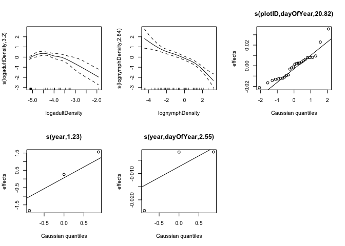
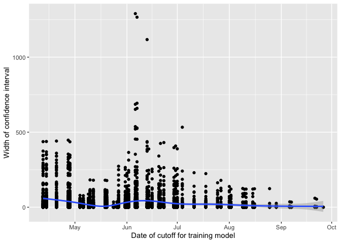
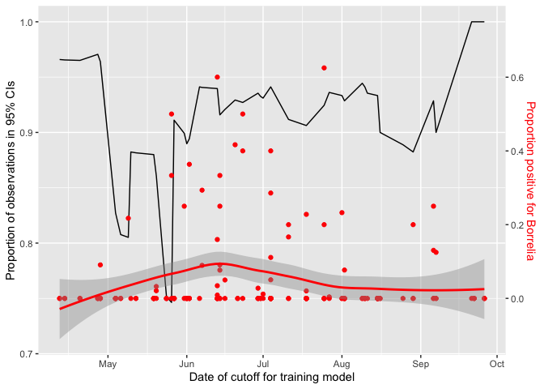
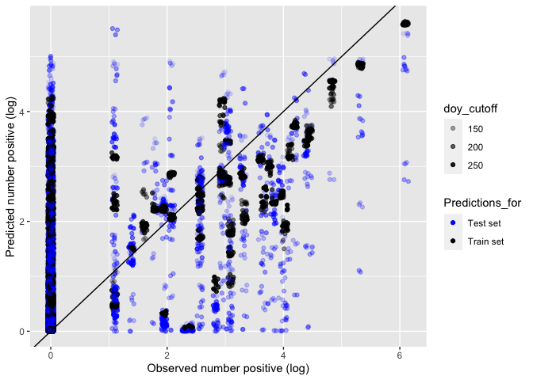

## Load libraries

```r
library(dplyr)
library(tidyverse)
library(forcats)
library(lubridate)
library(ggthemes)  # for a mapping theme
library(ggalt)  # for custom map projections
library(viridis)
library(ggrepel)  # for annotations
library(png)
library(jpeg)
library(mgcv)
library(tidyr)
library(broom)
library(ggplot2)
library(stringr)
library(RColorBrewer)
library(caret)
library(brms)
library(boot) # for invlogit
```

***

# Tick and *Borrelia* Background

Lyme disease is the most common vector-borne disease in the U.S. and has been the subject of intense research for the last several decades. The disease is caused by a bacterial spirochete (*Borrelia* species) that is vectored by ticks (primarily *Ixodes scapularis*) Dozens of studies have addressed local- and landscape-scale factors that drive the dynamics of this system, with mixed success. Here, we aimed to use National Ecological Observatory Network (NEON) data to tease apart the factors important to spatiotemporal variability in (i) tick abundance and (ii) *Borrelia* prevalence, which together determine human Lyme risk.

## Ecology of *Ixodes scapularis* & *Borrelia*

### *I. scapularis*
*I. scapularis* primary inhabits the eastern U.S. and has a ~2 year life cycle. **Eggs** are laid in spring of year *t* and hatch into **larvae** in summer of the same year. Larvae take a single bloodmeal (typically from a small mammal) in summer of year *t* and overwinter. Larvae then molt into **nymphs** in the late spring/early summer of year *t*+1. Nymphal ticks take a single bloodmeal in late spring/summer (typically from a small mammal, but also birds and reptiles). In autumn of year *t*+1, nymphs molt into **adults**. In late autumn/early winter of year *t*+1, adult ticks find an appropriate large mammal host (often deer) where the female takes a bloodmeal and sexual reproduction occurs. Eggs are laid the following spring, and the cycle repeats.

Numerous aspects of the abiotic environment can control *I. scapularis* distribution and abundance, including temperature and humidity which jointly drive the risk of dessication. Yet, broad population patterns of *I. scapularis* most closely correlate with the distribution of forests because the most important hosts for both larvae/nymphs and adults (white-footed mice and deer, respectively) rely heavily on forested habitats. Within forested areas, temporal variability may be introduced by processes driving changes in host populations, most notably acorn masting patterns. There are thus temporal and spatial considerations *I. scapularis* presence and abundance.

### *Borrelia*

*Borrelia* is vectored by ticks, with numerous reservoirs (though, most often small rodents). Tick eggs are virtually Borrelia-free---in other words the bacteria is not vertically transmitted. Tick larvae and nymphs may become infected with *Borrelia* when taking bloodmeals from infected reservoirs. Adult hosts (e.g., deer) tend not to be reservoirs for *Borrelia*, and thus host--parasite dynamics in this system are limited primarily to interactions involving larval or nymphal ticks and reservoir hosts. 

Because larvae are never infected prior to their bloodmeal (and only take 1 bloodmeal), they cannot transmit *Borrelia* to hosts and thus pose little threat to humans. Conversely, if larvae become infected during their bloodmeal, successfully molt into a nymph, and take a bloodmeal from a susceptible host they can transmit the infection. Owing to this and their small size (~1 mm) nyphal ticks pose the largest threat to human health via transmission of *Borrelia*. Infected adult ticks may also transmit *Borrelia* to humans but are conspicuous and more easily removed.

For these reasons, the density of infected nymphs (D.O.N.) of *I. scapularis* is the most common and successful index of Lyme risk. Understanding what drives D.O.N. requires understanding what drives both nymphal density *and* nymphal infection prevalence.

***

### National Ecological Observatory Network (NEON) Tick Sampling

The National Ecological Observatory Network (NEON) is a long-term, large-scale, NSF-funded project with the goal to monitor global change at a continental scale. NEON's sampling design provides a unique opportunity to examine large spatial and temporal scale questions about hosts, vectors, and parasites as they all respond to environmental change in different ways.

NEON is organized into 20 domains, which were delineated based on ecoclimatic state variables. Within each domain, there is one terrestrial core site and one or two terrestrial relocatable sites. Sites encompass much of the diversity that exists in North America - sites exists at sea level to 12,000 ft above sea level, in temperate and tropical forests, and in desert and mountain ecosystems. Sites are further stratified into plots, which encompass local scale variation.

NEON tick sampling uses the dragging and flagging method, which is arguably the most commonly used method to sample ticks. This method is effective for catching questing ticks, so it most closely approximates the human risk of picking up ticks from the environment. To sample, a 1 m^2 piece of white cloth is dragged along the ground at a slow pace along the border of a 40x40 m tick plot. It is examined every 5-10 m, and any adult, nymph, and larval ticks are removed and collected in 95% EtOH. Flagging is used when vegetation prevents the drag sampling. Sampling frequency occurs once every six weeks until one or more ticks are collected at a site. Once at least one tick is collected, sampling frequency increases to once every three weeks. Sampling is only conducted when the high temperature on the previous day was >0 degC and the mean temperature for the previous five days was >7 degC. 

Collected ticks are sent to external facilities for taxonomic identification at the adult and nymph level and pathogen testing. Following identification, ticks are combined by species, life stage, site, and sampling event and tested for pathogens. Actual sample size depends on the sampling event success, but for any species/life stage combination, a minimum of 10 and target of 100 individuals per site/sampling event combination is recommended. 

***

# Tick Data Exploration

## Load data & set up


We limited all analyses to *I. scapularis* nymphs, which are the primary vector of human Lyme and for which there were plentiful NEON data. Formal analyses (W.E.M.) used tick *density*, in which raw tick counts were scaled by drag length, but because drag lengths were fairly consistent across space/time (see plot directly below) and because raw counts are easier to intepret than densities, the former is displayed in exploratory maps/plots below.

## Survey Effort
<!-- -->

## Spatial variation in ticks

A good starting place is to consider which NEON sites across the U.S. even have *I. scapularis* by plotting mean count per survey.

<!-- -->

We can see that, largely, *I. scapularis* is restricted to east of the Mississippi River.


Zooming in on the eastern half of the country, we can also see enormous plot-level variability in tick count per survey.

<!-- -->


Can also view the distribution of count data across these scales. First, let's look at domain-level.

<!-- -->

We can see that there are relatively few domains with *I. scapularis* and that there are some surveys that yielded extremely high nymph counts (~2500).

If we next consider plots within domains, we can furher see that even where ticks are detected and sometimes abundant, most surveys still yield counts of 0.

<!-- -->

Note the x-axis range is restricted here to easier view the distribution of counts.

The final scale of consideration is plots within sites, where we also see high levels of variation.

<!-- -->


Exercises like these lead to several decisions:
(i) exclude domains with no ticks
(ii) within-site variability makes the use of latitude & longitude somewhat meaningless


## Temporal variability

As mentioned above, there are strong seasonal patterns in tick abundance owing to life cycle dynamics.

Although some annual variation exists and should be accounted for, the most prominent feature of the data is the annual peak in *I. scapularis* nymphal abundance.

<!-- -->

This pattern raises several important points:
(i) there is a pretty clear split between "tick season" and "non-tick season"
(ii) there is a unimodal hump-shaped peak in nymph populations within that "tick season"

Yet, we still see plot-level variability. One important consideration that ties back to spatial patterns is habitat. We can split this temporal plot out by different NLCD classes to see some important patterns.

<!-- -->

These results are cool and make a lot of sense! *I. scapularis* distribution is tightly linked to that of its forest-dwelling hosts. So in addition to broad, domain-scale distribution limits there are also very strong, local patterns of distribution and abundance.


## PREVALENCE 

Just like with tick abundance, it is useful to look at where *Borrelia* spp. occurs across NEON sites. This analysis was restricted to *Borrelia burgdorferi*, *B. mayonii*, *B. burgdorferi* sensu lato, *B. miyamotoi*, and *B. lonestari* found in *Ixodes* spp. nymphs. We do not differentiate between individual species because they are all the causal agents of Lyme Disease in humans and use similar mechanisms to infect hosts.


## Spatial variability

*Borrelia* spp. could theoretically inhabit any domain that has *Ixodes* ticks but is actually only present in a subset of domains. The upper Midwest and Northeast have the highest prevalence among domains where it occurs. 

<!-- -->


Just like with tick abundance, *Borrelia* spp. prevalence is variable at the site level within domains and at the plot level within sites. Even among domains or sites that are heavily invested with ticks, *Borrelia* spp. can remain absent at smaller scales. This is likely dominated by local characteristics at the plot scale (vegetation, microhabitats, microclimates) and density of small mammals and deer.


<!-- -->


<!-- -->

Elevation could influence occurrence and prevalence of *Borrelia* spp. by influencing vegetation and climate. At the plot level, it doesn't look like elevation is really important. Within a given elevation, there could be high or low prevalence. 

<!-- -->

## Temporal variability

Prevalence over time at the site scale is mostly stable, but it's difficult to be sure in this short of a time scale.

<!-- -->

The plot scale shows a little more variability.

<!-- -->

Prevalence at the plot scale by month shows more variability, especially in the early and late tick season.

<!-- -->

Plots are categorized by their dominate vegetation class into an NCLD class. *Borrelia* spp. is clearly most commonly found in deciduous forest but still shows lots of variation within it. Some NLCD classes have zero prevalence, but this is unsurprising when we consider what vegetation and small and large mammals might be there and how exactly transmission would occur.

<!-- -->

Contrary to tick abundance patterns, there is no peak in *Borrelia* spp. prevalence in mid-summer. Ticks have a two year life cycle, so it is likely that infected nymphs and adults are collected from the previous year in the early sampling season. Additionally, prevalence at the plot scale is extremely variable and likely dependent on vegetation structure, small mammal density, and large mammal minimum thresholds.


# Tick Abundance Models

## Modeling approach

Our goal was to build a model that could be used to predict and understand tick abundances at NEON sites. We investigated several modeling approaches including state-space time series, variance partitioning, boosted regression trees, generalized linear mixed models, and generalized additive models. We ultimately proceeded with GAMs due to their ability to handle the non-linear, temporal element of our data and their flexibility in response variable. 

One major challenge to modeling tick abundances (specifically, the densities of Ixodes nymphs) was the extreme zero-inflation in our data (as explored above). To handle this, we used zero-inflated poisson models. These models have two parts, one to predict the probability of 0s (the zero inflation model), and one to predict the counts (poisson model). 

We explored several predictors for both the poisson and the zero inflation models. For the zero inflation model, the predictor variables we considered were: 

   * `nlcdClass`
   * `season` (a binary predictor; whether the sampling event was between May-September or not)
   * `plotID` (a random effect)

Therefore, these variables influenced whether there were ticks present or not (probability of tick count being a 0 or not).

For the poisson model (counts), the predictor variables we considered were:

   * `year-plotID` (the combination of year and plot, as a random effect)
   * `plotID`  (a random effect)
   * `dayofYear` (a smoothed term)
   * `year` (a random effect)

Finally, we accounted for sampling effort by including the area of the tick drag as an offset.


## Read in the data

We fit our models using a training dataset that had one tick season removed from it (May through July, 2018; later used as the validation dataset). This dataset is similar to the one used in data exploration, but has a few columns added and scaled. Note that the domains with no ticks present were removed, but this dataset does contain plots that never had ticks.


```r
abun <- readRDS("data/nymph_abun_train.Rdata")
```

## Fit the models

Models are fit using the `mgcv` package. We used AIC for model selection. 

Code for fitting models is below. Note that if you run the code below verbatim, it will read in the list of model objects instead of actually fitting all the models, since model fitting is time intensive.


```r
# check if models have already been run
models.exist <- file.exists("model_objects/zipmodels_tick_abun.Rdata")
# if so, read them in and can skip the next part
if(models.exist==TRUE){
  readRDS("Model_objects/zipmodels_tick_abun.Rdata") -> zipmodlist
  list2env(zipmodlist, .GlobalEnv)
  rm(zipmodlist)
}

# if the models haven't been pulled/run this will run them
# careful as this may take a while
if(models.exist == FALSE){
  abun <- readRDS("data_derived/nymph_abun_all.Rdata")
  head(abun)
  # fit zero-inflated Poissons
  # first part of the model: poisson process (abundance)
  # second part of the model: zero inflation process (prob of 0)
  # a null model
  zip0 <- gam(list(estimatedCount ~ offset(logSampledArea),
                   ~1),
              data = abun, family = ziplss())
  
  # random effects only
  zip1 <- gam(list(estimatedCount ~ s(plotID, bs = "re") + offset(logSampledArea) ,
                   ~s(plotID, bs = "re")),
              data = abun, family = ziplss())
  
  # add in season as a predictor of presence
  zip2 <- gam(list(estimatedCount ~ s(plotID, bs = "re") + offset(logSampledArea) ,
                   ~ season + s(plotID, bs = "re")),
              data = abun, family = ziplss())
  
  # add in nlcd as a predictor of presence
  zip3 <- gam(list(estimatedCount ~s(plotID, bs = "re") + offset(logSampledArea) ,
                   ~ season + nlcdClass + s(plotID, bs = "re")),
              data = abun, family = ziplss())
  
  # add in day of year as a predictor of abundance
  zip4 <- gam(list(estimatedCount ~ s(sDayofYear) + s(plotID, bs = "re") + offset(logSampledArea),
                   ~season + nlcdClass + s(plotID, bs = "re")),
              data = abun, family = ziplss())
  
  # add year as a random effect 
  zip5 <- gam(list(estimatedCount ~ s(sDayofYear) + s(fYear, bs = "re") + s(plotID, bs = "re") + offset(logSampledArea) ,
                   ~season + nlcdClass + s(plotID, bs = "re")),
              data = abun, family = ziplss())
  
  # add year as a random effect NESTED witin plot 
  zip6 <- gam(list(estimatedCount ~ s(sDayofYear) +offset(logSampledArea) + s(yearPlot, bs = "re"),
                   ~season + nlcdClass + s(plotID, bs = "re")),
              data = abun, family = ziplss())
  # add a randomn smooth for day of year by plot
  zip7 <- gam(list(estimatedCount ~ s(sDayofYear, plotID, bs = "re") +fYear + offset(logSampledArea) ,
                   ~season + nlcdClass + s(plotID, bs = "re")),
              data = abun, family = ziplss())
  zip8 <- gam(list(estimatedCount ~ s(sDayofYear, yearPlot, bs = "re") + offset(logSampledArea), 
                   ~season + nlcdClass + s(plotID, bs = "re")), 
              data = abun, family = ziplss())
  pattern <- ls(pattern="zip") # get names of models
  # pattern <- grep("zip", names(.GlobalEnv), value = TRUE)
  models <- do.call("list", mget(pattern))
  
  # save models
  saveRDS(models, "Model_objects/zipmodels_tick_abun.Rdata" )
}
```

Compare models with AIC:

```r
pattern <- ls(pattern="zip") # get names of models
zipmodlist <- do.call("list", mget(pattern)) # make a list of all them
do.call(rbind, lapply(zipmodlist, glance)) %>% data.frame() %>%
  mutate(model = pattern) %>% select(model, everything(.)) %>% arrange(AIC)
```

<div data-pagedtable="false">
  <script data-pagedtable-source type="application/json">
{"columns":[{"label":["model"],"name":[1],"type":["chr"],"align":["left"]},{"label":["df"],"name":[2],"type":["dbl"],"align":["right"]},{"label":["logLik"],"name":[3],"type":["dbl"],"align":["right"]},{"label":["AIC"],"name":[4],"type":["dbl"],"align":["right"]},{"label":["BIC"],"name":[5],"type":["dbl"],"align":["right"]},{"label":["deviance"],"name":[6],"type":["dbl"],"align":["right"]},{"label":["df.residual"],"name":[7],"type":["dbl"],"align":["right"]}],"data":[{"1":"zip6","2":"202.7146","3":"-6933.872","4":"14275.12","5":"15483.19","6":"12842.38","7":"2579.285"},{"1":"zip5","2":"134.5821","3":"-13370.318","4":"27011.69","5":"27815.51","6":"25715.27","7":"2647.418"},{"1":"zip8","2":"205.5651","3":"-13904.856","4":"28223.58","5":"29450.88","6":"26784.34","7":"2576.435"},{"1":"zip4","2":"130.8361","3":"-15411.718","4":"31086.97","5":"31868.47","6":"29798.07","7":"2651.164"},{"1":"zip7","2":"128.6633","3":"-23720.365","4":"47700.51","5":"48470.89","6":"46415.36","7":"2653.337"},{"1":"zip3","2":"122.0530","3":"-23788.111","4":"47822.03","5":"48550.96","6":"46550.85","7":"2659.947"},{"1":"zip2","2":"123.9564","3":"-23788.254","4":"47826.00","5":"48565.85","6":"46551.14","7":"2658.044"},{"1":"zip1","2":"122.2124","3":"-23862.706","4":"47971.45","5":"48701.07","6":"46700.04","7":"2659.788"},{"1":"zip0","2":"2.0000","3":"-36210.201","4":"72424.40","5":"72436.26","6":"71395.03","7":"2780.000"}],"options":{"columns":{"min":{},"max":[10]},"rows":{"min":[10],"max":[10]},"pages":{}}}
  </script>
</div>

Explore output from "best" model:


```r
summary(zip6)
```

```
## 
## Family: ziplss 
## Link function: identity identity 
## 
## Formula:
## estimatedCount ~ s(sDayofYear) + offset(logSampledArea) + s(yearPlot, 
##     bs = "re")
## ~season + nlcdClass + s(plotID, bs = "re")
## 
## Parametric coefficients:
##                            Estimate Std. Error z value Pr(>|z|)    
## (Intercept)                -9.14105    0.42362 -21.578  < 2e-16 ***
## (Intercept).1              -5.55599    1.13988  -4.874 1.09e-06 ***
## season.1                    1.63546    0.16395   9.975  < 2e-16 ***
## nlcdClasswoodyWetlands.1    0.04931    1.28966   0.038    0.970    
## nlcdClassevergreenForest.1  0.40868    1.33809   0.305    0.760    
## nlcdClassmixedForest.1      1.17189    1.37165   0.854    0.393    
## nlcdClassdeciduousForest.1  1.85470    1.18695   1.563    0.118    
## ---
## Signif. codes:  0 '***' 0.001 '**' 0.01 '*' 0.05 '.' 0.1 ' ' 1
## 
## Approximate significance of smooth terms:
##                   edf  Ref.df  Chi.sq p-value    
## s(sDayofYear)   8.926   8.996  6238.0  <2e-16 ***
## s(yearPlot)   114.724 135.000 23447.5  <2e-16 ***
## s.1(plotID)    72.064 104.000   434.9  <2e-16 ***
## ---
## Signif. codes:  0 '***' 0.001 '**' 0.01 '*' 0.05 '.' 0.1 ' ' 1
## 
## Deviance explained = 82.2%
## -REML = 7391.7  Scale est. = 1         n = 2782
```

## Optional: re-fit best model with brms
In order to better extract uncertainty estimates, we can fit the best model in `brms` which will give posterior distributions of parameters. 

Note that if you want to run this model you will have to manually change the code below; otherwise, it reads in an existing model object. 

```r
run.mod <- "no" # change this if you want to run the model 
# warning that running it takes a long time (e.g. hours)!
if(run.mod == "yes"){
  require(brms)
  b_zip6 <- brm(bf(
    estimatedCount ~  s(sDayofYear)+ (1|yearPlot) + offset(logSampledArea), # observation-level RE
    zi ~ nlcdClass + season + (1|plotID)),
    data = abun, family = zero_inflated_poisson(), iter =1000, chains = 4)
  b_zip7 <- update(b_zip6, iter = 2000) # run chains longer
  saveRDS(b_zip7, "Model_objects/b_zip7.Rdata")
}

# if you don't want to run it can just load it
b_zip7 <- readRDS("model_objects/b_zip7.Rdata")
summary(b_zip7)
```

```
##  Family: zero_inflated_poisson 
##   Links: mu = log; zi = logit 
## Formula: estimatedCount ~ s(sDayofYear) + (1 | yearPlot) + offset(logSampledArea) 
##          zi ~ nlcdClass + season + (1 | plotID)
##    Data: abun (Number of observations: 2782) 
## Samples: 4 chains, each with iter = 2000; warmup = 1000; thin = 1;
##          total post-warmup samples = 4000
## 
## Smooth Terms: 
##                    Estimate Est.Error l-95% CI u-95% CI Rhat Bulk_ESS Tail_ESS
## sds(ssDayofYear_1)    49.01     11.66    31.02    76.60 1.03       95      287
## 
## Group-Level Effects: 
## ~yearPlot (Number of levels: 418) 
##               Estimate Est.Error l-95% CI u-95% CI Rhat Bulk_ESS Tail_ESS
## sd(Intercept)     2.12      0.13     1.89     2.36 1.06       43      119
## 
## ~plotID (Number of levels: 109) 
##                  Estimate Est.Error l-95% CI u-95% CI Rhat Bulk_ESS Tail_ESS
## sd(zi_Intercept)     3.43      0.49     2.61     4.53 1.05       84      240
## 
## Population-Level Effects: 
##                             Estimate Est.Error l-95% CI u-95% CI Rhat Bulk_ESS
## Intercept                      -6.68      0.25    -7.19    -6.17 1.10       31
## zi_Intercept                    5.16      1.82     1.85     9.00 1.06       50
## zi_nlcdClasswoodyWetlands       0.87      2.11    -3.54     5.08 1.10       34
## zi_nlcdClassevergreenForest     0.34      2.19    -4.16     4.63 1.05       73
## zi_nlcdClassmixedForest        -0.94      2.10    -5.18     3.02 1.08       43
## zi_nlcdClassdeciduousForest    -2.73      1.89    -6.58     0.69 1.04       79
## zi_season                      -1.39      0.33    -2.04    -0.75 1.01      364
## ssDayofYear_1                 205.69     29.72   148.96   264.20 1.01      231
##                             Tail_ESS
## Intercept                         40
## zi_Intercept                     187
## zi_nlcdClasswoodyWetlands        110
## zi_nlcdClassevergreenForest       90
## zi_nlcdClassmixedForest          232
## zi_nlcdClassdeciduousForest      114
## zi_season                        889
## ssDayofYear_1                    555
## 
## Samples were drawn using sampling(NUTS). For each parameter, Bulk_ESS
## and Tail_ESS are effective sample size measures, and Rhat is the potential
## scale reduction factor on split chains (at convergence, Rhat = 1).
```

```r
plot(b_zip7, ask = FALSE, newpage = FALSE)
```

<!-- --><!-- --><!-- -->

This model didn't converge; the chains look pretty bad. In the future, we could use stronger priors and explore correlation among parameters which might be leading to the issue. For now, we will just proceed with maximum likelihood models fit with `mgcv`. 

## Evaluate model fit using validation dataset

The test/validation dataset is similar to the training, except contains a few months of data that were left out (May - July 2018). 


```r
nymphtest <- readRDS("data/nymph_abun_test.Rdata")
```

We will predict tick abundances using our model and compare to the actual abundances.

From our two-part model, we can predict a few different responses. (1) probability of presence, from the zero-inflated (logit) part of the model (2) tick count if they are present from the poisson part of the model and (3) mean expected count, which multiplies the two together (type = "response").


```r
nymph_pred <- nymphtest 

# get predicted mean count (3)
nymph_pred <- cbind(nymph_pred, data.frame(predict(zip6, newdata = nymph_pred, type = "response", se.fit = TRUE)) %>%
                       select(pred_mean_count = fit, pred_mean_count_se = se.fit))
# i'm skeptical of the standard error here...


# also get predicted probability
nymph_pred <- cbind(nymph_pred, data.frame(predict(zip6, newdata = nymph_pred, se.fit = TRUE)) %>%  # predict 
   mutate(pred_prob = plogis(fit.2), pred_prob_low = plogis(fit.2-2*se.fit.2), pred_prob_hi = plogis(fit.2 + 2*se.fit.2), # back transform
          pred_pois_count = exp(fit.1), pred_pois_count_low = exp(fit.1 - 2*se.fit.1), pred_pois_count_hi = exp(fit.1 + 2*se.fit.1)) %>%
   select(pred_prob, pred_prob_low, pred_prob_hi, pred_pois_count, pred_pois_count_low, pred_pois_count_hi))
```

### How well does the model do at probability of presence?


```
## `stat_bin()` using `bins = 30`. Pick better value with `binwidth`.
```

<!-- -->

Were there plots where model predicts very low prob of ticks but they were observed?

```r
(nymph_pred %>% filter(nymph_presence==1, pred_prob  < 0.05) %>% nrow())/(nymph_pred %>% filter(pred_prob  < 0.05) %>% nrow())
```

```
## [1] 0.03614458
```

```r
(nymph_pred %>% filter(nymph_presence==1, pred_prob  < 0.1) %>% nrow())/(nymph_pred %>% filter(pred_prob  < 0.1) %>% nrow())
```

```
## [1] 0.04132231
```

```r
(nymph_pred %>% filter(nymph_presence==1, pred_prob  < 0.25) %>% nrow())/(nymph_pred %>% filter(pred_prob  < 0.25) %>% nrow())
```

```
## [1] 0.1066667
```
Of the samples where the model predicted < 0.05 chance of ticks, 3.6 percent had ticks (4 percent error).
Of the samples where the model predicted < 0.10 chance of ticks, 4.1 percent had ticks.
Of the samples where the model predicted < 0.25 chance of ticks, 11 percent had ticks.

Were there plots where model predicts very high chance of ticks, but they were NOT observed?

```r
(nymph_pred %>% filter(nymph_presence==0, pred_prob  > 0.6) %>% nrow())/(nymph_pred %>% filter(pred_prob  > 0.6) %>% nrow())
```

```
## [1] 0.1764706
```

Of the samples where model predicted > 0.6 chance of ticks, 17 percent did NOT have ticks.

Overall, how well does predicted probablity of presence match observed presence?


```r
nymph_pred %>% ggplot(aes(x = pred_prob, y = nymph_presence)) + geom_jitter(width = .001, height = 0.05, alpha = .3, size = 3, col = "forestgreen") +
  xlab("Model predicted probability of presence")+
  ylab("Observed tick presence") +
  theme_classic()
```

<!-- -->

Using a confusion matrix to evaluate how well the model predicts presence/absence:


```r
confusionMatrix(data = as.factor(as.numeric(nymph_pred$pred_prob>0.5)),
                      reference = as.factor(nymph_pred$nymph_presence))
```

```
## Confusion Matrix and Statistics
## 
##           Reference
## Prediction   0   1
##          0 155  47
##          1   8  33
##                                           
##                Accuracy : 0.7737          
##                  95% CI : (0.7158, 0.8247)
##     No Information Rate : 0.6708          
##     P-Value [Acc > NIR] : 0.0002867       
##                                           
##                   Kappa : 0.4149          
##                                           
##  Mcnemar's Test P-Value : 2.992e-07       
##                                           
##             Sensitivity : 0.9509          
##             Specificity : 0.4125          
##          Pos Pred Value : 0.7673          
##          Neg Pred Value : 0.8049          
##              Prevalence : 0.6708          
##          Detection Rate : 0.6379          
##    Detection Prevalence : 0.8313          
##       Balanced Accuracy : 0.6817          
##                                           
##        'Positive' Class : 0               
## 
```

Model seems fairly decent at predicting presence absence! 

### How well does the model do at predicting abundance?

Compare the predicted count from the model to the observed count:


```r
nymph_pred %>%
  ggplot(aes(x=estimatedCount, y= pred_mean_count))+
  geom_point(alpha = .5, size = 3, col = "magenta")+
  geom_abline(slope = 1, intercept = 0, col ="magenta")+
  theme_classic()+
  ylab("Predicted count from model")+
  xlab("Observed count")
```

<!-- -->

Yikes. They seem to correlate, but the model is consistently predicting a higher count than observed (e.g. our model is biased).

Let's figure out why. First, extract the records that have bad predictions:

```r
nymph_pred$resid <- nymph_pred$estimatedCount - nymph_pred$pred_mean_count
mean(nymph_pred$resid) # negative, meaning we are OVER predicting
```

```
## [1] -18.21733
```

```r
hist(nymph_pred$resid)
```

<!-- -->

```r
# the "really bad" resids are < -25
nymph_pred %>% filter(resid < -25) -> bad_preds
```

For the plots in the "bad" dataset, plot the time series for 2018 only. Predictions are in blue, actuals are in red:

<!-- -->

What about the predictions that aren't as bad? Anything different about those time series?

<!-- -->

A lot of these are zeros -- the plot pretty much always has zero ticks and so the prediction matches well.

Why the bias towards high nymph counts? Is 2018 weird? Combine the training and testing datasets and visualize yearly patterns in nymphal density. 


```r
nymph_all <- rbind(abun, nymphtest)

nymph_all %>% ggplot(aes(x=sDayofYear, y = log(density+.1), group = plotID)) +
  geom_point(aes(color = plotID), show.legend=FALSE)+
  facet_wrap(~year)+
   theme_tick()+
   xlab("Day of Year (scaled)") +
   ylab("log (nymph density)")
```

<!-- -->

Yes; 2018 seems like a weird year in terms of low densities, explaining why the model reliably over-predicts. 

In future models, year-level covariates could be useful in making predictions; e.g. perhaps 2018 is a low mammal year or has a climate not favorable for nymph recruitment. 

Plot predictions vs. actuals for plots that sometimes have ticks. Predictions are in blue, actuals are in red.
<!-- --><!-- -->

## Closing thoughts

Overall, the model does better at presence/absence than abundance. However, the way we did our testing and training dataset matters; our test dataset was subsetted by year. Therefore if abundance (rather than presence/absence) varies strongly across years, then our data won't be as good at predicting abundance.

There is a lot of variation among plots. Right now, this is a random effect and if we had previous years of data, we were fairly good at predicting presence/absence at a plot in the next year. But what if we wanted to predict entirely new plots? Right now, the only informative covariates are day of year and nlcd. The uncertainty on the nlcd classes is large. Therefore, if we want to predict what will happen at NEW plots, we need a lot more plot-level and year-level information. This would be useful not only in predictions, but also in understanding mechanism; right now we know very little about why some plots have high tick densities. 

Future models could incorporate small mammal density, litter, and other plot-year level information to make predictions. 

# *Borrelia* Prevalence Models

The second goal is to be able to predict *Borrelia* prevalence. The first thing we do is plot all *Borrelia* data across time and plot to assess the distribution of *Borrelia*.


<!-- -->


There are many samples where nymphs were present, but they were never tested for *Borrelia*. Additionally, there are also many samples where they tested for *Borrelia*, but there were no positive individuals. Therefore, we should filter all these out.


```
## [1] 491
```


<!-- -->

The data are still very zero-inflated, but much more manageable now. We also take a cursory look at how prevalence and infection rates differ across time (`dayOfYear`).

<!-- -->

<!-- -->


## Modelling approach:

Challenges of dataset:

* Strongly zero-inflated-- needs a two-part model (hurdle or zero-inflated)
* Non-linear relationships between response and predictors-- may need splines
* Complexity of non-linear predictors and zero-inflated data means Bayesian methods are extremely slow (e.g. BRMS)- should do EDA and possible model selection in a non-bayesian space

The steps we want to take are:

* Split data into test and training sets
* Fit two separate spline-based non-bayesian models (GAMs) to the training set (prevalence amongst plots vs prevalence amongst ticks) and do model selection
* Use the test set to assess our ability to predict future *Borrelia* risk

Future directions:

* Translate best-fit GAMs into in Bayesian space (actually quite straight forward in BRMS)
* Use Bayesian model to propogate uncertainty in coefficients to better understand uncertainty in predictions-- to do this with splines is a little tricky.
* Combine the two-component model we've created here into a single "zero-inflated" model-- there are more possibilities in the brms package than the GAM package. Specifically, we are looking for a zero-inflated binomial.


Our first challenge is the large number of zeros in the dataset. We should use some sort of zero-inflated or hurdle model-- however, the GAM package does not allow zero-inflated binomial models and convergence of Bayesian models (in BRMS) is slow in such a complex model. Thus, we make the decision here to model the prevalence of *Borrelia* amongst plots separately from the prevalence amongst ticks. In the future, we will likely combine these into a single bayesian model, but here we keep them separate due to time restraints.

Additionally, for prediction, we find that *Borrelia* prevalence is extremely variable between years. Therefore, we are partially interested in whether we can predict *Borrelia* prevalence if we know something about the tick season early in the year. From a risk assessment point of view-- is there a particular point in the year that we should begin sampling to best inform our risk assessment for the rest of the year? 

The test set is year 2017, which is the last year for which we have *Borrelia* data. The training set is years 2014-2016.


.


### Part I: Fitting the "hurdle" component of our model

To help model selection, we wrote a custom script to extract AIC and Deviance explained values from different combinations of predictors. This function is similar to "stepAIC", so we've named it "stepGAM". 


We iterate through all combinations of predictors to see what combination comes out as the "best fit"


```r
#### Part I: binomial hurdle component ####
# First, model a binomial component using training set
allPred <- c("s(dayOfYear)","nlcdClass","s(elevation)"
             ,"s(logNLtckDensity)","s(logadultDensity)","s(lognymphDensity)"
             ,"s(plotID, bs='re')", "s(plotID, dayOfYear, bs='re')"
             ,"s(year, bs='re')", "s(year, dayOfYear, bs='re')"
             , "domainID", "s(domainID, bs='re')"
)

if (!file.exists("model_objects/allAIC.RData")) {
  allAIC <- stepGAM(dat = tck_borrelia_train, predictors = allPred, response = "borrPresent", constant_pred = "offset(log(numberTested))", family = binomial, ignore.combos=list(c("domainID","s(domainID, bs='re')"), c("s(logNLtckDensity)","s(logadultDensity)","s(lognymphDensity)")                                                                                                                                                                 , c("s(logNLtckDensity)","s(logadultDensity)"),c("s(logNLtckDensity)","s(lognymphDensity)")))
  save(allAIC, file="model_objects/allAIC.RData")

} else {
  load("model_objects/allAIC.RData")
}
```

The output is a table, showing all the different models attempted.
<div data-pagedtable="false">
  <script data-pagedtable-source type="application/json">
{"columns":[{"label":["AIC"],"name":[1],"type":["dbl"],"align":["right"]},{"label":["REML"],"name":[2],"type":["dbl"],"align":["right"]},{"label":["Dev.expl"],"name":[3],"type":["dbl"],"align":["right"]},{"label":["formula"],"name":[4],"type":["chr"],"align":["left"]}],"data":[{"1":"134.1703","2":"51.93900","3":"0.6860248","4":"borrPresent ~ offset(log(numberTested))+nlcdClass+s(logadultDensity)+s(year, bs='re')+s(domainID, bs='re')"},{"1":"134.2042","2":"51.93874","3":"0.6866624","4":"borrPresent ~ offset(log(numberTested))+nlcdClass+s(logadultDensity)+s(plotID, dayOfYear, bs='re')+s(year, bs='re')+s(domainID, bs='re')"},{"1":"134.3026","2":"51.93011","3":"0.6858688","4":"borrPresent ~ offset(log(numberTested))+nlcdClass+s(logadultDensity)+s(year, bs='re')+s(year, dayOfYear, bs='re')+s(domainID, bs='re')"},{"1":"134.3784","2":"51.92910","3":"0.6870236","4":"borrPresent ~ offset(log(numberTested))+nlcdClass+s(logadultDensity)+s(plotID, dayOfYear, bs='re')+s(year, bs='re')+s(year, dayOfYear, bs='re')+s(domainID, bs='re')"},{"1":"134.6275","2":"34.70283","3":"0.6889948","4":"borrPresent ~ offset(log(numberTested))+nlcdClass+s(logadultDensity)+s(year, bs='re')+domainID"},{"1":"134.6280","2":"34.70285","3":"0.6890118","4":"borrPresent ~ offset(log(numberTested))+nlcdClass+s(logadultDensity)+s(plotID, dayOfYear, bs='re')+s(year, bs='re')+domainID"}],"options":{"columns":{"min":{},"max":[10]},"rows":{"min":[10],"max":[10]},"pages":{}}}
  </script>
</div>
Now, we can look at how AIC changes when ranked from best model to least

<!-- -->

<!-- -->

At this point, we can filter the models to the "best" AIC and Deviance explained models and play around with the parameters, or adjust them as needed. For brevity, we won't go through our (tedious) manual model selection process. Instead, we will simply say that we decided the "best Deviance explained" model appeared to have the highest prediction accuracy with the most sensible predictors, so that is what we choose as our "best fit" model. 

```r
frml_bin1_bestAIC <- allAIC_filt[allAIC_filt$AIC==min(allAIC_filt$AIC),"formula"]
frml_bin1_bestDevexpl <- allAIC_filt[allAIC_filt$Dev.expl==max(allAIC_filt$Dev.expl),"formula"]

frml_bin1_bestAIC
```

```
## [1] "borrPresent ~ offset(log(numberTested))+nlcdClass+s(logadultDensity)+s(year, bs='re')+s(domainID, bs='re')"
```

```r
frml_bin1_bestDevexpl
```

```
## [1] "borrPresent ~ offset(log(numberTested))+s(logadultDensity)+s(plotID, bs='re')+s(plotID, dayOfYear, bs='re')+s(year, bs='re')+s(year, dayOfYear, bs='re')"
```


```r
## FINAL MODEL:
frml.bin1 <- frml_bin1_bestDevexpl
mod.gambin<- gam(as.formula(frml.bin1)
                 , data=tck_borrelia_train
                 , method="REML"
                 , family=binomial)
gam.check(mod.gambin)
```

<!-- -->

```
## 
## Method: REML   Optimizer: outer newton
## full convergence after 14 iterations.
## Gradient range [-0.0002513314,1.866814e-06]
## (score 105.2789 & scale 1).
## Hessian positive definite, eigenvalue range [1.002772e-05,5.973602].
## Model rank =  122 / 122 
## 
## Basis dimension (k) checking results. Low p-value (k-index<1) may
## indicate that k is too low, especially if edf is close to k'.
## 
##                           k'      edf k-index p-value
## s(logadultDensity)  9.00e+00 3.25e+00    0.95    0.25
## s(plotID)           5.30e+01 2.20e-03      NA      NA
## s(plotID,dayOfYear) 5.30e+01 3.55e+01      NA      NA
## s(year)             3.00e+00 1.01e-04      NA      NA
## s(year,dayOfYear)   3.00e+00 1.45e+00      NA      NA
```

```r
plot(mod.gambin, scale=0, pages=1)
```

<!-- -->

```r
mean((predict(mod.gambin, type = "response")>0.5) == tck_borrelia_train$borrPresent)
```

```
## [1] 0.9333333
```

For further diagnostics, we want to see if incorrectly predicted results are due to extremely low  *Borrelia* intensity-- that is, perhaps a sample that predicted a false negative did so because the amount of *Borrelia* in that plot was actually really low.

<!-- -->


```r
# Is there a bias for predicting negative or positive results?
tck_borrelia_train %>%
  mutate(predictedProbability =as.numeric(plogis(predict(mod.gambin)))
         , predicted_status = (predictedProbability>0.5)
         , observed_status=borrPresent) %>%
  select(observed_status,predicted_status) %>% table()
```

```
##                predicted_status
## observed_status FALSE TRUE
##               0   238    5
##               1    15   42
```


```r
confusionMatrix(tck_borrelia_train %>%
  mutate(predictedProbability =as.numeric(plogis(predict(mod.gambin)))
         , predictedPA = as.numeric(predictedProbability>0.5)) %>%
  select(borrPresent,predictedPA) %>% table())
```

```
## Confusion Matrix and Statistics
## 
##            predictedPA
## borrPresent   0   1
##           0 238   5
##           1  15  42
##                                           
##                Accuracy : 0.9333          
##                  95% CI : (0.8989, 0.9588)
##     No Information Rate : 0.8433          
##     P-Value [Acc > NIR] : 1.804e-06       
##                                           
##                   Kappa : 0.7678          
##                                           
##  Mcnemar's Test P-Value : 0.04417         
##                                           
##             Sensitivity : 0.9407          
##             Specificity : 0.8936          
##          Pos Pred Value : 0.9794          
##          Neg Pred Value : 0.7368          
##              Prevalence : 0.8433          
##          Detection Rate : 0.7933          
##    Detection Prevalence : 0.8100          
##       Balanced Accuracy : 0.9172          
##                                           
##        'Positive' Class : 0               
## 
```
The Detection rate is actually pretty poor here-- we are pretty good and predicting when there will not be Borrelia, but not very good and predicting when there is Borrelia. Sadly, this is the opposite of what we want to know!

Now, we move onto predicting Borrelia Prevalence-- fist, we must filter dataset to exclude "hurdle" zeros in order to fit the prevalence aspect of the model.


```r
tck_borrelia_filtBin <- tck_borrelia_train %>%
  mutate(pred=predict(mod.gambin, type="response")) %>%
  filter((borrPresent>0 | pred > 0.5))
```

### Part II: Borrelia Prevalence component
As before, we fit many different models and extract the AIC and Deviance explained by each.

```r
# make year a factor
tck_borrelia_filtBin <- tck_borrelia_filtBin %>%
  mutate(year=factor(year))

allPred2 <- c("s(dayOfYear, sp=1)","nlcdClass","s(elevation)"
             ,"s(logNLtckDensity, sp=1)","s(logadultDensity, sp=1)","s(lognymphDensity, sp=1)"
             ,"s(plotID, bs='re')", "s(plotID, dayOfYear, bs='re')"
             ,"s(year, bs='re')", "s(year, dayOfYear, bs='re')"
             , "domainID", "s(domainID, bs='re')"
)
ignoreCombos <- list(c("domainID","s(domainID, bs='re')")
                     , c("s(logNLtckDensity, sp=1)","s(logadultDensity, sp=1)","s(lognymphDensity, sp=1)")
                     , c("s(logNLtckDensity, sp=1)","s(lognymphDensity, sp=1)")
                     , c("s(logNLtckDensity, sp=1)","s(logadultDensity, sp=1)")
)

if ( !file.exists("model_objects/allAIC_2.RData") ) {
  allAIC_2 <- stepGAM(dat=tck_borrelia_filtBin, predictors = allPred2, response = "cbind(numberPositive,numberTested)", family = binomial, ignore.combos=ignoreCombos)
  
  save(allAIC_2, file="model_objects/allAIC_2.RData")
  } else {
  load("model_objects/allAIC_2.RData")
  }
```

Then, we look at the distribution of AIC and Deviance explained values over ranked models
<!-- -->

And the importance of particular predictors

<!-- -->


```r
frml_bin2_bestAIC <- allAIC_2_filt[allAIC_2_filt$AIC==min(allAIC_2_filt$AIC),"formula"]
frml_bin2_bestDevexpl <- allAIC_2_filt[allAIC_2_filt$Dev.expl==max(allAIC_2_filt$Dev.expl),"formula"]

frml_bin2_bestAIC
```

```
## [1] "cbind(numberPositive,numberTested) ~ s(logadultDensity, sp=1) + s(lognymphDensity, sp=1) + s(plotID, dayOfYear, bs='re') + s(year, bs='re') + s(year, dayOfYear, bs='re') + domainID"
```

```r
frml_bin2_bestDevexpl
```

```
## [1] "cbind(numberPositive,numberTested) ~ nlcdClass + s(logadultDensity, sp=1) + s(lognymphDensity, sp=1) + s(plotID, dayOfYear, bs='re') + s(year, bs='re') + s(year, dayOfYear, bs='re') + domainID"
```

Again, we don't show the tedious work of looking through models and predictors; rather we choose the "best AIC model" as our model and show results from just that. 


```r
### BEST MODEL:
frml.bin2 <- frml_bin2_bestAIC
mod.gambin_2 <- gam(as.formula(frml.bin2)
                    , data=tck_borrelia_filtBin
                    , method="REML"
                    , family=binomial)
summary(mod.gambin_2)
```

```
## 
## Family: binomial 
## Link function: logit 
## 
## Formula:
## cbind(numberPositive, numberTested) ~ s(logadultDensity, sp = 1) + 
##     s(lognymphDensity, sp = 1) + s(plotID, dayOfYear, bs = "re") + 
##     s(year, bs = "re") + s(year, dayOfYear, bs = "re") + domainID
## 
## Parametric coefficients:
##             Estimate Std. Error z value Pr(>|z|)  
## (Intercept)  -1.3685     2.0286  -0.675   0.4999  
## domainIDD02   4.1727     2.3392   1.784   0.0744 .
## domainIDD03  -2.4569     2.3234  -1.057   0.2903  
## domainIDD05   1.1237     2.4169   0.465   0.6420  
## domainIDD06  -0.8575     2.3227  -0.369   0.7120  
## domainIDD07   0.5108     2.8773   0.178   0.8591  
## domainIDD08   0.2273     2.6554   0.086   0.9318  
## ---
## Signif. codes:  0 '***' 0.001 '**' 0.01 '*' 0.05 '.' 0.1 ' ' 1
## 
## Approximate significance of smooth terms:
##                        edf Ref.df   Chi.sq  p-value    
## s(logadultDensity)   3.200  3.531    43.12 9.64e-08 ***
## s(lognymphDensity)   2.837  3.536    73.08 7.78e-15 ***
## s(plotID,dayOfYear) 20.815 25.000   317.68 0.000559 ***
## s(year)              1.235  2.000 23423.07 8.91e-05 ***
## s(year,dayOfYear)    2.553  3.000 32656.82 2.69e-06 ***
## ---
## Signif. codes:  0 '***' 0.001 '**' 0.01 '*' 0.05 '.' 0.1 ' ' 1
## 
## R-sq.(adj) =  0.803   Deviance explained = 91.2%
## -REML = 289.19  Scale est. = 1         n = 62
```

```r
gam.check(mod.gambin_2)
```

<!-- -->

```
## 
## Method: REML   Optimizer: outer newton
## full convergence after 12 iterations.
## Gradient range [-1.378787e-07,4.329546e-07]
## (score 289.1889 & scale 1).
## Hessian positive definite, eigenvalue range [0.5692267,6.00674].
## Model rank =  57 / 57 
## 
## Basis dimension (k) checking results. Low p-value (k-index<1) may
## indicate that k is too low, especially if edf is close to k'.
## 
##                        k'   edf k-index p-value
## s(logadultDensity)   9.00  3.20    1.19    0.94
## s(lognymphDensity)   9.00  2.84    1.12    0.82
## s(plotID,dayOfYear) 26.00 20.82      NA      NA
## s(year)              3.00  1.23      NA      NA
## s(year,dayOfYear)    3.00  2.55      NA      NA
```

```r
# Residuals
plot(mod.gambin_2$residuals ~ mod.gambin_2$fitted.values, ylab="Residuals",xlab="Fitted values")
```

<!-- -->

```r
plot(mod.gambin_2, pages=1)
```

<!-- -->


### Part III: Predicting 2017

Now that we have selected the best-fit models for *Borrelia* presence/absence and prevalence, the next step is to try to predict *Borrelia* for the year 2017. Below, we interate through all test/train splits (using every new sampling day as a new DOY "cutoff" point) to see if prediction accuracy increases if we have more data on that year


```r
if ( !file.exists("model_objects/predictions_over_doy.RData")) {
  predictions_over_doy_unprocessed <- data.frame(matrix(ncol=35, dimnames = list(NULL, c("pred_type","pred_bin","pred_bin2","se","se2","doy_cutoff",colnames(tck_borrelia_test)))))
pb <- txtProgressBar(title = "progress bar", min = 0,
                     max = length(daysIn2017), style=3)

for ( i in 1:length(daysIn2017) ) {
  doy <- daysIn2017[i]
  tempTrain <- subsetData[[paste0(doy)]][['train']]
  tempTrain2017 <- tempTrain %>% filter(year==2017) %>% arrange(dayOfYear)
  tempTest <- subsetData[[paste0(doy)]][['test']]
  ### Part I: Presence/absence
  tempFit <- gam(as.formula(frml.bin1), data=tempTrain, family = binomial(), method = "REML")
  tempNewPredict <- predict(tempFit, newdata = tempTest, type = "link", se.fit = TRUE)
  tempOldPredict <- predict(tempFit, newdata = tempTrain2017, type="link", se.fit = TRUE)
  tempTrainPredict <- predict(tempFit, type='link', se.fit=TRUE)
  ### Part II: prevalence
  # Filter trainig dataset to exclude zeros
  tempTrain2 <- tempTrain %>%
    cbind(data.frame(pred_bin1=tempTrainPredict$fit)) %>%
    filter(pred_bin1>0.5 | borrPresent>0)
  
  tempFit2 <- gam(as.formula(frml.bin2), data=tempTrain2, family = binomial(), method = "REML")
  tempNewPredict2 <- predict(tempFit2, newdata = tempTest, type = "link", se.fit = TRUE)
  tempOldPredict2 <- predict(tempFit2, newdata = tempTrain2017, type="link", se.fit = TRUE)
  ### Tracking progress
  Sys.sleep(0.1)
  setTxtProgressBar(pb, i, label=paste( round(i/length(daysIn2017)*100, 0),
                                        "% done"))
  ### Store predictions
  predictions_over_doy_unprocessed <-rbind(predictions_over_doy_unprocessed, cbind(data.frame(pred_type=c(rep("train_pred",length(tempOldPredict$fit)),rep("test_pred",length(tempNewPredict$fit)))
                                                                      , pred_bin=c(tempOldPredict$fit, tempNewPredict$fit)
                                                                      , pred_bin2=c(tempOldPredict2$fit, tempNewPredict2$fit)
                                                                      , se = c(tempOldPredict$se.fit, tempNewPredict$se.fit)
                                                                      , se2 = c(tempOldPredict2$se.fit, tempNewPredict2$se.fit)
                                                                      , doy_cutoff = rep(doy, nrow(tck_borrelia_test))
  ),rbind(tempTrain2017,tempTest)))
}

predictions_over_doy <- predictions_over_doy_unprocessed %>%
  filter(!is.na(pred_bin))
save(predictions_over_doy,file="model_objects/predictions_over_doy.RData")
} else {
  load("model_objects/predictions_over_doy.RData")
}
```


Below, we plot the MSE (mean squared error) of test and train set predictions (for 2017 only) on Borrelia presence/absence as we increase DOY cutoff . Superimposed, I've also included the real observed data to see where *Borrelia* peaks, and whether we can predict *Borrelia* risk of the year before risk actually peaks.

<!-- -->

We can split up the "error" of this binomial model into false positives and false negatives too.


```
## `geom_smooth()` using method = 'loess' and formula 'y ~ x'
```

```
## Warning: Removed 4 rows containing missing values (geom_smooth).
```

<!-- -->

<!-- -->

It seems the false positive rate actually greatly improves once you start sampling in May. Unfortunately, the false negative rate is generally the more important "error" term, since we don't want to accidently report "low risk", but experience a "high risk" year.


Next, we look at the errors in predictions for prevalence amongst tick within plot. Again, we do not see a meaningful drop in MSE as we increase the cutoff date for predicting the rest of the year. 

<!-- -->


### Part IV: Simulating predictions

The final question we have is: how much uncertainty is there in our predictions? Since we do not use a bayesian framework, the only uncertainty we have is the point estimate + standard deviation for each data point. We can use these values to estimate a 95% confidence interval for each data point by combining our two models (binomial, plot-level and binomial, individual-level) and simulating zero-inflated distributions for each data point. Then, we can use quantiles to see if the observed value is within the 95% confidence interval.


```r
 # First, make a  column of sample names for samples
predictions_over_doy <- predictions_over_doy %>%
  mutate(rown = 1:n()
           ,SimSample = paste0("V",rown))
nsim <- 1000
if (!file.exists("model_objects/countPred_sim.RData")) {
 
countPred_sim <- matrix(ncol=nrow(predictions_over_doy), nrow=nsim)
bin1_sim_all <- matrix(ncol=nrow(predictions_over_doy), nrow=nsim)
bin2_sim_all <- matrix(ncol=nrow(predictions_over_doy), nrow=nsim)
  pb <- txtProgressBar(title = "progress bar", min = 0,
                       max = nrow(predictions_over_doy), style=3)
  
  for ( r in 1:nrow(predictions_over_doy)) {
    expbin_sim <- rnorm(n=nsim, mean=predictions_over_doy[r,"pred_bin"], sd=predictions_over_doy[r,"se"] )
    bin_sim <- rbinom(n=nsim,size=1,prob = inv.logit(expbin_sim) )
    expbin2_sim <- rnorm(n=nsim, mean=predictions_over_doy[r,"pred_bin2"], sd=predictions_over_doy[r,"se2"] )
    bin2_sim <- rbinom(n=nsim, size=predictions_over_doy[r,"numberTested"], prob=inv.logit(expbin2_sim))
    exp_count_combined <- bin_sim*bin2_sim
    exp_prop_combined <- exp_count_combined/predictions_over_doy[r,"numberTested"]
    # Save
    bin1_sim_all[,r] <- bin_sim
    bin2_sim_all[,r] <- bin2_sim
    countPred_sim[,r] <- exp_count_combined

    Sys.sleep(0.1)
    setTxtProgressBar(pb, r)
  }
  save(bin1_sim_all, file="model_objects/bin1_sim_all.RData")
  save(bin2_sim_all, file="model_objects/bin2_sim_all.RData")
  save(countPred_sim, file="model_objects/countPred_sim.RData")
}else {
  load("model_objects/bin1_sim_all.RData")
  load("model_objects/bin2_sim_all.RData")
  load("model_objects/countPred_sim.RData")
}
countPred_sim_long <- countPred_sim %>%
  as.data.frame() %>%
  mutate(SimID = 1:nsim) %>%
  gather(-SimID,key=SimSample, value=sim_count) 

if ( !file.exists("model_objects/sim_results.RData")) {
  sim_results <- predictions_over_doy %>%
    full_join(countPred_sim_long) %>%
    mutate(prop_sim = sim_count/numberTested
           ,SampleID = paste0(plotID,year,dayOfYear, sep="_"))
  
  save(sim_results, file="model_objects/sim_results.RData")
} else {
  load("model_objects/sim_results.RData")
}

sim_results_summarized <- sim_results %>%
  group_by(SampleID, numberPositive, numberTested, proportionPositive, pred_type, pred_bin, pred_bin2, doy_cutoff) %>%
  summarise(CI97.5_count=quantile(sim_count, probs=0.975)
            , CI2.5_count=quantile(sim_count, probs=0.025)
            , sd_count=sd(sim_count)
            , mean_count=mean(sim_count)
            , CI97.5_prop=quantile(prop_sim, probs=0.975)
            , CI2.5_prop=quantile(prop_sim, probs=0.025)
            , sd_prop=sd(prop_sim)
            , mean_prop=mean(prop_sim)) %>%
  ungroup() %>%
  mutate(res_count = numberPositive-mean_count)
# count_sim_results$doy_cutoff
```


Does the confidence interval for each point decrease in breadth as you increase DOY cutoff? It seems it does not really-- there is a slightly increase over time, but not enough to make predictions meaningfully better. Importantly, the "drop" in CI breadth seems to happen *after* the peak in *Borrelia* every year, which means it's not particularily useful for us.

<!-- -->

The 95% confidence interval increases when tick prevalence is high-- which is exected. But more interestingly, there is a modest drop in confidence interval size early on in the year. It is unclear whether this drop in uncertainty is useful to us or not. 


```
## `geom_smooth()` using method = 'loess' and formula 'y ~ x'
```

<!-- -->


We can compare the prediction accuracy of the training set and testing set to see if our poor predictive power is an issue with the model being over-fitted or under-fitted. Here, we see that predictions for training set values are slightly better than test set values, but that even training set values are poorly predicted in general. Thus, to improve model fit we probably need to get more data or better predictors. 

<!-- -->


### Final thoughts

Things we have discovered/confirmed:

* Within our current model, knowing *Borrelia* prevalence in earlier months does not improve knowledge about *Borrelia* prevalence in later months very well. However, this prediction will likely improve with more data.
* *Borrelia* prevalence does not correlate positively with tick density-- rather, we see a negative correlation. However, it is unclear whether this negative correlation is "real", or if it is a statistical artifact from the fact that prevalence increases in late summer (presumably because there is more time for *Borrelia* to spread amongst the population), which usually sees lower nymph densities.
* There are many unmeasured variables in our dataset. The variation we see between domains, sites, and plots make it obvious that there is some kind of unmeasured variable driving a lot of *Borrelia* prevalence. However, the "most" we can do right now is use plotID as a proxy for the aggregate effects of all these unknown environmental variables. This is fine for predicting Lyme disease risk for known plots, but means it will not be possible to predict disease risk for "new" plots. 
