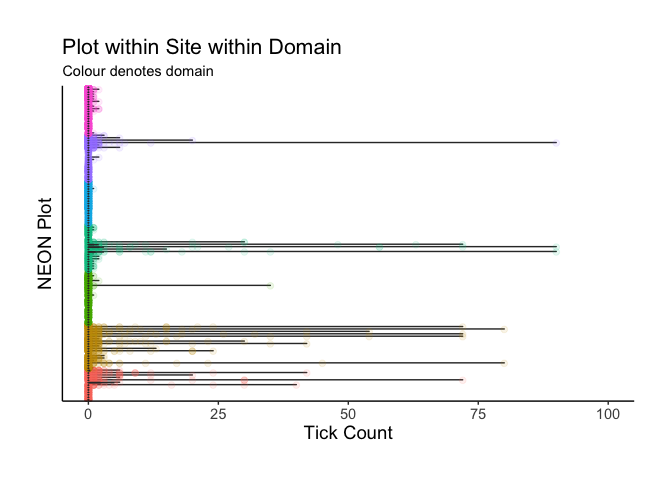
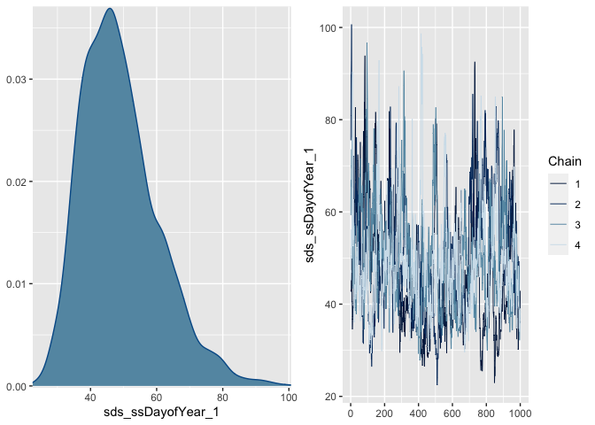
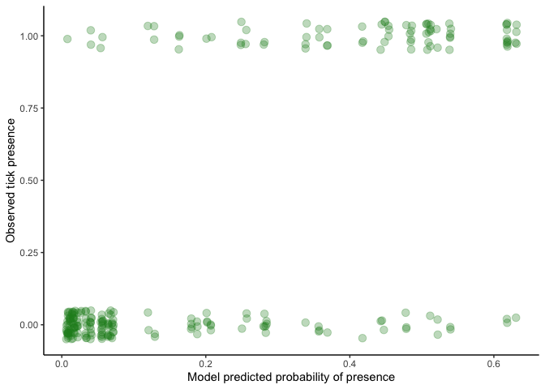
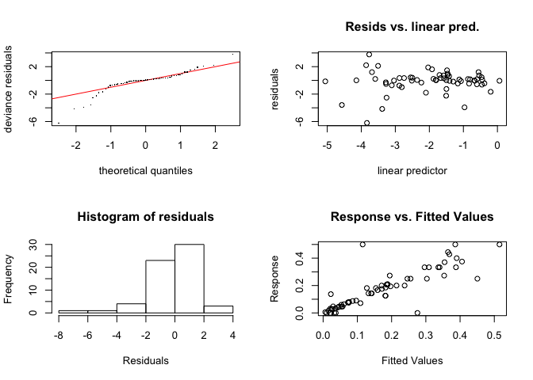

## Load libraries

```r
library(dplyr)
library(tidyverse)
library(forcats)
library(lubridate)
library(ggthemes)  # for a mapping theme
library(ggalt)  # for custom map projections
library(viridis)
library(ggrepel)  # for annotations
library(png)
library(jpeg)
library(mgcv)
library(tidyr)
library(broom)
library(ggplot2)
library(stringr)
library(RColorBrewer)
library(caret)
library(brms)
library(boot) # for invlogit
```

***

# Tick and *Borrelia* Background

Lyme disease is the most common vector-borne disease in the U.S. and has been the subject of intense research for the last several decades. The disease is caused by a bacterial spirochete (*Borrelia* species) that is vectored by ticks (primarily *Ixodes scapularis*) Dozens of studies have addressed local- and landscape-scale factors that drive the dynamics of this system, with mixed success. Here, we aimed to use National Ecological Observatory Network (NEON) data to tease apart the factors important to spatiotemporal variability in (i) tick abundance and (ii) *Borrelia* prevalence, which together determine human Lyme risk.

## Ecology of *Ixodes scapularis* & *Borrelia*

### *I. scapularis*
*I. scapularis* primary inhabits the eastern U.S. and has a ~2 year life cycle. **Eggs** are laid in spring of year *t* and hatch into **larvae** in summer of the same year. Larvae take a single bloodmeal (typically from a small mammal) in summer of year *t* and overwinter. Larvae then molt into **nymphs** in the late spring/early summer of year *t*+1. Nymphal ticks take a single bloodmeal in late spring/summer (typically from a small mammal, but also birds and reptiles). In autumn of year *t*+1, nymphs molt into **adults**. In late autumn/early winter of year *t*+1, adult ticks find an appropriate large mammal host (often deer) where the female takes a bloodmeal and sexual reproduction occurs. Eggs are laid the following spring, and the cycle repeats.

Numerous aspects of the abiotic environment can control *I. scapularis* distribution and abundance, including temperature and humidity which jointly drive the risk of dessication. Yet, broad population patterns of *I. scapularis* most closely correlate with the distribution of forests because the most important hosts for both larvae/nymphs and adults (white-footed mice and deer, respectively) rely heavily on forested habitats. Within forested areas, temporal variability may be introduced by processes driving changes in host populations, most notably acorn masting patterns. There are thus temporal and spatial considerations *I. scapularis* presence and abundance.

### *Borrelia*

*Borrelia* is vectored by ticks, with numerous reservoirs (though, most often small rodents). Tick eggs are virtually Borrelia-free---in other words the bacteria is not vertically transmitted. Tick larvae and nymphs may become infected with *Borrelia* when taking bloodmeals from infected reservoirs. Adult hosts (e.g., deer) tend not to be reservoirs for *Borrelia*, and thus host--parasite dynamics in this system are limited primarily to interactions involving larval or nymphal ticks and reservoir hosts. 

Because larvae are never infected prior to their bloodmeal (and only take 1 bloodmeal), they cannot transmit *Borrelia* to hosts and thus pose little threat to humans. Conversely, if larvae become infected during their bloodmeal, successfully molt into a nymph, and take a bloodmeal from a susceptible host they can transmit the infection. Owing to this and their small size (~1 mm) nyphal ticks pose the largest threat to human health via transmission of *Borrelia*. Infected adult ticks may also transmit *Borrelia* to humans but are conspicuous and more easily removed.

For these reasons, the density of infected nymphs (D.O.N.) of *I. scapularis* is the most common and successful index of Lyme risk. Understanding what drives D.O.N. requires understanding what drives both nymphal density *and* nymphal infection prevalence.

***

### National Ecological Observatory Network (NEON) Tick Sampling

The National Ecological Observatory Network (NEON) is a long-term, large-scale, NSF-funded project with the goal to monitor global change at a continental scale. NEON's sampling design provides a unique opportunity to examine large spatial and temporal scale questions about hosts, vectors, and parasites as they all respond to environmental change in different ways.

NEON is organized into 20 domains, which were delineated based on ecoclimatic state variables. Within each domain, there is one terrestrial core site and one or two terrestrial relocatable sites. Sites encompass much of the diversity that exists in North America - sites exists at sea level to 12,000 ft above sea level, in temperate and tropical forests, and in desert and mountain ecosystems. Sites are further stratified into plots, which encompass local scale variation.

NEON tick sampling uses the dragging and flagging method, which is arguably the most commonly used method to sample ticks. This method is effective for catching questing ticks, so it most closely approximates the human risk of picking up ticks from the environment. To sample, a 1 m^2 piece of white cloth is dragged along the ground at a slow pace along the border of a 40x40 m tick plot. It is examined every 5-10 m, and any adult, nymph, and larval ticks are removed and collected in 95% EtOH. Flagging is used when vegetation prevents the drag sampling. Sampling frequency occurs once every six weeks until one or more ticks are collected at a site. Once at least one tick is collected, sampling frequency increases to once every three weeks. Sampling is only conducted when the high temperature on the previous day was >0 degC and the mean temperature for the previous five days was >7 degC. 

Collected ticks are sent to external facilities for taxonomic identification at the adult and nymph level and pathogen testing. Following identification, ticks are combined by species, life stage, site, and sampling event and tested for pathogens. Actual sample size depends on the sampling event success, but for any species/life stage combination, a minimum of 10 and target of 100 individuals per site/sampling event combination is recommended. 

***

# Tick Data Exploration

## Load data & set up


We limited all analyses to *I. scapularis* nymphs, which are the primary vector of human Lyme and for which there were plentiful NEON data. Formal analyses (W.E.M.) used tick *density*, in which raw tick counts were scaled by drag length, but because drag lengths were fairly consistent across space/time (see plot directly below) and because raw counts are easier to intepret than densities, the former is displayed in exploratory maps/plots below.

## Survey Effort
<!-- -->

## Spatial variation in ticks

A good starting place is to consider which NEON sites across the U.S. even have *I. scapularis* by plotting mean count per survey.

<!-- -->

We can see that, largely, *I. scapularis* is restricted to east of the Mississippi River.


Zooming in on the eastern half of the country, we can also see enormous plot-level variability in tick count per survey.

<!-- -->


Can also view the distribution of count data across these scales. First, let's look at domain-level.

<!-- -->

We can see that there are relatively few domains with *I. scapularis* and that there are some surveys that yielded extremely high nymph counts (~2500).

If we next consider plots within domains, we can furher see that even where ticks are detected and sometimes abundant, most surveys still yield counts of 0.

<!-- -->

Note the x-axis range is restricted here to easier view the distribution of counts.

The final scale of consideration is plots within sites, where we also see high levels of variation.

<!-- -->


Exercises like these lead to several decisions:
(i) exclude domains with no ticks
(ii) within-site variability makes the use of latitude & longitude somewhat meaningless


## Temporal variability

As mentioned above, there are strong seasonal patterns in tick abundance owing to life cycle dynamics.

Although some annual variation exists and should be accounted for, the most prominent feature of the data is the annual peak in *I. scapularis* nymphal abundance.

<!-- -->

This pattern raises several important points:
(i) there is a pretty clear split between "tick season" and "non-tick season"
(ii) there is a unimodal hump-shaped peak in nymph populations within that "tick season"

Yet, we still see plot-level variability. One important consideration that ties back to spatial patterns is habitat. We can split this temporal plot out by different NLCD classes to see some important patterns.

<!-- -->

These results are cool and make a lot of sense! *I. scapularis* distribution is tightly linked to that of its forest-dwelling hosts. So in addition to broad, domain-scale distribution limits there are also very strong, local patterns of distribution and abundance.


## PREVALENCE 

Just like with tick abundance, it is useful to look at where *Borrelia* spp. occurs across NEON sites. This analysis was restricted to *Borrelia burgdorferi*, *B. mayonii*, *B. burgdorferi* sensu lato, *B. miyamotoi*, and *B. lonestari* found in *Ixodes* spp. nymphs. We do not differentiate between individual species because they are all the causal agents of Lyme Disease in humans and use similar mechanisms to infect hosts.


## Spatial variability

*Borrelia* spp. could theoretically inhabit any domain that has *Ixodes* ticks but is actually only present in a subset of domains. The upper Midwest and Northeast have the highest prevalence among domains where it occurs. 

<!-- -->


Just like with tick abundance, *Borrelia* spp. prevalence is variable at the site level within domains and at the plot level within sites. Even among domains or sites that are heavily invested with ticks, *Borrelia* spp. can remain absent at smaller scales. This is likely dominated by local characteristics at the plot scale (vegetation, microhabitats, microclimates) and density of small mammals and deer.


<!-- -->


<!-- -->

Elevation could influence occurrence and prevalence of *Borrelia* spp. by influencing vegetation and climate. At the plot level, it doesn't look like elevation is really important. Within a given elevation, there could be high or low prevalence. 

<!-- -->

## Temporal variability

Prevalence over time at the site scale is mostly stable, but it's difficult to be sure in this short of a time scale.

<!-- -->

The plot scale shows a little more variability.

<!-- -->

Prevalence at the plot scale by month shows more variability, especially in the early and late tick season.

<!-- -->

Plots are categorized by their dominate vegetation class into an NCLD class. *Borrelia* spp. is clearly most commonly found in deciduous forest but still shows lots of variation within it. Some NLCD classes have zero prevalence, but this is unsurprising when we consider what vegetation and small and large mammals might be there and how exactly transmission would occur.

<!-- -->

Contrary to tick abundance patterns, there is no peak in *Borrelia* spp. prevalence in mid-summer. Ticks have a two year life cycle, so it is likely that infected nymphs and adults are collected from the previous year in the early sampling season. Additionally, prevalence at the plot scale is extremely variable and likely dependent on vegetation structure, small mammal density, and large mammal minimum thresholds.


# Tick Abundance Models

## Modeling approach

Our goal was to build a model that could be used to predict and understand tick abundances at NEON sites. We investigated several modeling approaches including state-space time series, variance partitioning, boosted regression trees, generalized linear mixed models, and generalized additive models. We ultimately proceeded with GAMs due to their ability to handle the non-linear, temporal element of our data and their flexibility in response variable. 

One major challenge to modeling tick abundances (specifically, the densities of Ixodes nymphs) was the extreme zero-inflation in our data (as explored above). To handle this, we used zero-inflated poisson models. These models have two parts, one to predict the probability of 0s (the zero inflation model), and one to predict the counts (poisson model). 

We explored several predictors for both the poisson and the zero inflation models. For the zero inflation model, the predictor variables we considered were: 

   * `nlcdClass`
   * `season` (a binary predictor; whether the sampling event was between May-September or not)
   * `plotID` (a random effect)

Therefore, these variables influenced whether there were ticks present or not (probability of tick count being a 0 or not).

For the poisson model (counts), the predictor variables we considered were:

   * `year-plotID` (the combination of year and plot, as a random effect)
   * `plotID`  (a random effect)
   * `dayofYear` (a smoothed term)
   * `year` (a random effect)

Finally, we accounted for sampling effort by including the area of the tick drag as an offset.


## Read in the data

We fit our models using a training dataset that had one tick season removed from it (May through July, 2018; later used as the validation dataset). This dataset is similar to the one used in data exploration, but has a few columns added and scaled. Note that the domains with no ticks present were removed, but this dataset does contain plots that never had ticks.


```r
abun <- readRDS("data/nymph_abun_train.Rdata")
```

## Fit the models

Models are fit using the `mgcv` package. We used AIC for model selection. 

Code for fitting models is below. Note that if you run the code below verbatim, it will read in the list of model objects instead of actually fitting all the models, since model fitting is time intensive.


```r
# check if models have already been run
models.exist <- file.exists("model_objects/zipmodels_tick_abun.Rdata")
# if so, read them in and can skip the next part
if(models.exist==TRUE){
  readRDS("Model_objects/zipmodels_tick_abun.Rdata") -> zipmodlist
  list2env(zipmodlist, .GlobalEnv)
  rm(zipmodlist)
}

# if the models haven't been pulled/run this will run them
# careful as this may take a while
if(models.exist == FALSE){
  abun <- readRDS("data_derived/nymph_abun_all.Rdata")
  head(abun)
  # fit zero-inflated Poissons
  # first part of the model: poisson process (abundance)
  # second part of the model: zero inflation process (prob of 0)
  # a null model
  zip0 <- gam(list(estimatedCount ~ offset(logSampledArea),
                   ~1),
              data = abun, family = ziplss())
  
  # random effects only
  zip1 <- gam(list(estimatedCount ~ s(plotID, bs = "re") + offset(logSampledArea) ,
                   ~s(plotID, bs = "re")),
              data = abun, family = ziplss())
  
  # add in season as a predictor of presence
  zip2 <- gam(list(estimatedCount ~ s(plotID, bs = "re") + offset(logSampledArea) ,
                   ~ season + s(plotID, bs = "re")),
              data = abun, family = ziplss())
  
  # add in nlcd as a predictor of presence
  zip3 <- gam(list(estimatedCount ~s(plotID, bs = "re") + offset(logSampledArea) ,
                   ~ season + nlcdClass + s(plotID, bs = "re")),
              data = abun, family = ziplss())
  
  # add in day of year as a predictor of abundance
  zip4 <- gam(list(estimatedCount ~ s(sDayofYear) + s(plotID, bs = "re") + offset(logSampledArea),
                   ~season + nlcdClass + s(plotID, bs = "re")),
              data = abun, family = ziplss())
  
  # add year as a random effect 
  zip5 <- gam(list(estimatedCount ~ s(sDayofYear) + s(fYear, bs = "re") + s(plotID, bs = "re") + offset(logSampledArea) ,
                   ~season + nlcdClass + s(plotID, bs = "re")),
              data = abun, family = ziplss())
  
  # add year as a random effect NESTED witin plot 
  zip6 <- gam(list(estimatedCount ~ s(sDayofYear) +offset(logSampledArea) + s(yearPlot, bs = "re"),
                   ~season + nlcdClass + s(plotID, bs = "re")),
              data = abun, family = ziplss())
  # add a randomn smooth for day of year by plot
  zip7 <- gam(list(estimatedCount ~ s(sDayofYear, plotID, bs = "re") +fYear + offset(logSampledArea) ,
                   ~season + nlcdClass + s(plotID, bs = "re")),
              data = abun, family = ziplss())
  zip8 <- gam(list(estimatedCount ~ s(sDayofYear, yearPlot, bs = "re") + offset(logSampledArea), 
                   ~season + nlcdClass + s(plotID, bs = "re")), 
              data = abun, family = ziplss())
  pattern <- ls(pattern="zip") # get names of models
  # pattern <- grep("zip", names(.GlobalEnv), value = TRUE)
  models <- do.call("list", mget(pattern))
  
  # save models
  saveRDS(models, "Model_objects/zipmodels_tick_abun.Rdata" )
}
```

Compare models with AIC:

```r
pattern <- ls(pattern="zip") # get names of models
zipmodlist <- do.call("list", mget(pattern)) # make a list of all them
do.call(rbind, lapply(zipmodlist, glance)) %>% data.frame() %>%
  mutate(model = pattern) %>% select(model, everything(.)) %>% arrange(AIC)
```

<div data-pagedtable="false">
  <script data-pagedtable-source type="application/json">
{"columns":[{"label":["model"],"name":[1],"type":["chr"],"align":["left"]},{"label":["df"],"name":[2],"type":["dbl"],"align":["right"]},{"label":["logLik"],"name":[3],"type":["dbl"],"align":["right"]},{"label":["AIC"],"name":[4],"type":["dbl"],"align":["right"]},{"label":["BIC"],"name":[5],"type":["dbl"],"align":["right"]},{"label":["deviance"],"name":[6],"type":["dbl"],"align":["right"]},{"label":["df.residual"],"name":[7],"type":["dbl"],"align":["right"]}],"data":[{"1":"zip6","2":"202.7146","3":"-6933.872","4":"14275.12","5":"15483.19","6":"12842.38","7":"2579.285"},{"1":"zip5","2":"134.5821","3":"-13370.318","4":"27011.69","5":"27815.51","6":"25715.27","7":"2647.418"},{"1":"zip8","2":"205.5651","3":"-13904.856","4":"28223.58","5":"29450.88","6":"26784.34","7":"2576.435"},{"1":"zip4","2":"130.8361","3":"-15411.718","4":"31086.97","5":"31868.47","6":"29798.07","7":"2651.164"},{"1":"zip7","2":"128.6633","3":"-23720.365","4":"47700.51","5":"48470.89","6":"46415.36","7":"2653.337"},{"1":"zip3","2":"122.0530","3":"-23788.111","4":"47822.03","5":"48550.96","6":"46550.85","7":"2659.947"},{"1":"zip2","2":"123.9564","3":"-23788.254","4":"47826.00","5":"48565.85","6":"46551.14","7":"2658.044"},{"1":"zip1","2":"122.2124","3":"-23862.706","4":"47971.45","5":"48701.07","6":"46700.04","7":"2659.788"},{"1":"zip0","2":"2.0000","3":"-36210.201","4":"72424.40","5":"72436.26","6":"71395.03","7":"2780.000"}],"options":{"columns":{"min":{},"max":[10]},"rows":{"min":[10],"max":[10]},"pages":{}}}
  </script>
</div>

Explore output from "best" model:


```r
summary(zip6)
```

```
## 
## Family: ziplss 
## Link function: identity identity 
## 
## Formula:
## estimatedCount ~ s(sDayofYear) + offset(logSampledArea) + s(yearPlot, 
##     bs = "re")
## ~season + nlcdClass + s(plotID, bs = "re")
## 
## Parametric coefficients:
##                            Estimate Std. Error z value Pr(>|z|)    
## (Intercept)                -9.14105    0.42362 -21.578  < 2e-16 ***
## (Intercept).1              -5.55599    1.13988  -4.874 1.09e-06 ***
## season.1                    1.63546    0.16395   9.975  < 2e-16 ***
## nlcdClasswoodyWetlands.1    0.04931    1.28966   0.038    0.970    
## nlcdClassevergreenForest.1  0.40868    1.33809   0.305    0.760    
## nlcdClassmixedForest.1      1.17189    1.37165   0.854    0.393    
## nlcdClassdeciduousForest.1  1.85470    1.18695   1.563    0.118    
## ---
## Signif. codes:  0 '***' 0.001 '**' 0.01 '*' 0.05 '.' 0.1 ' ' 1
## 
## Approximate significance of smooth terms:
##                   edf  Ref.df  Chi.sq p-value    
## s(sDayofYear)   8.926   8.996  6238.0  <2e-16 ***
## s(yearPlot)   114.724 135.000 23447.5  <2e-16 ***
## s.1(plotID)    72.064 104.000   434.9  <2e-16 ***
## ---
## Signif. codes:  0 '***' 0.001 '**' 0.01 '*' 0.05 '.' 0.1 ' ' 1
## 
## Deviance explained = 82.2%
## -REML = 7391.7  Scale est. = 1         n = 2782
```

## Optional: re-fit best model with brms
In order to better extract uncertainty estimates, we can fit the best model in `brms` which will give posterior distributions of parameters. 

Note that if you want to run this model you will have to manually change the code below; otherwise, it reads in an existing model object. 

```r
run.mod <- "no" # change this if you want to run the model 
# warning that running it takes a long time (e.g. hours)!
if(run.mod == "yes"){
  require(brms)
  b_zip6 <- brm(bf(
    estimatedCount ~  s(sDayofYear)+ (1|yearPlot) + offset(logSampledArea), # observation-level RE
    zi ~ nlcdClass + season + (1|plotID)),
    data = abun, family = zero_inflated_poisson(), iter =1000, chains = 4)
  b_zip7 <- update(b_zip6, iter = 2000) # run chains longer
  saveRDS(b_zip7, "Model_objects/b_zip7.Rdata")
}

# if you don't want to run it can just load it
b_zip7 <- readRDS("model_objects/b_zip7.Rdata")
summary(b_zip7)
```

```
##  Family: zero_inflated_poisson 
##   Links: mu = log; zi = logit 
## Formula: estimatedCount ~ s(sDayofYear) + (1 | yearPlot) + offset(logSampledArea) 
##          zi ~ nlcdClass + season + (1 | plotID)
##    Data: abun (Number of observations: 2782) 
## Samples: 4 chains, each with iter = 2000; warmup = 1000; thin = 1;
##          total post-warmup samples = 4000
## 
## Smooth Terms: 
##                    Estimate Est.Error l-95% CI u-95% CI Rhat Bulk_ESS Tail_ESS
## sds(ssDayofYear_1)    49.01     11.66    31.02    76.60 1.03       95      287
## 
## Group-Level Effects: 
## ~yearPlot (Number of levels: 418) 
##               Estimate Est.Error l-95% CI u-95% CI Rhat Bulk_ESS Tail_ESS
## sd(Intercept)     2.12      0.13     1.89     2.36 1.06       43      119
## 
## ~plotID (Number of levels: 109) 
##                  Estimate Est.Error l-95% CI u-95% CI Rhat Bulk_ESS Tail_ESS
## sd(zi_Intercept)     3.43      0.49     2.61     4.53 1.05       84      240
## 
## Population-Level Effects: 
##                             Estimate Est.Error l-95% CI u-95% CI Rhat Bulk_ESS
## Intercept                      -6.68      0.25    -7.19    -6.17 1.10       31
## zi_Intercept                    5.16      1.82     1.85     9.00 1.06       50
## zi_nlcdClasswoodyWetlands       0.87      2.11    -3.54     5.08 1.10       34
## zi_nlcdClassevergreenForest     0.34      2.19    -4.16     4.63 1.05       73
## zi_nlcdClassmixedForest        -0.94      2.10    -5.18     3.02 1.08       43
## zi_nlcdClassdeciduousForest    -2.73      1.89    -6.58     0.69 1.04       79
## zi_season                      -1.39      0.33    -2.04    -0.75 1.01      364
## ssDayofYear_1                 205.69     29.72   148.96   264.20 1.01      231
##                             Tail_ESS
## Intercept                         40
## zi_Intercept                     187
## zi_nlcdClasswoodyWetlands        110
## zi_nlcdClassevergreenForest       90
## zi_nlcdClassmixedForest          232
## zi_nlcdClassdeciduousForest      114
## zi_season                        889
## ssDayofYear_1                    555
## 
## Samples were drawn using sampling(NUTS). For each parameter, Bulk_ESS
## and Tail_ESS are effective sample size measures, and Rhat is the potential
## scale reduction factor on split chains (at convergence, Rhat = 1).
```

```r
plot(b_zip7, ask = FALSE, newpage = FALSE)
```

<!-- --><!-- --><!-- -->

This model didn't converge; the chains look pretty bad. In the future, we could use stronger priors and explore correlation among parameters which might be leading to the issue. For now, we will just proceed with maximum likelihood models fit with `mgcv`. 

## Evaluate model fit using validation dataset

The test/validation dataset is similar to the training, except contains a few months of data that were left out (May - July 2018). 


```r
nymphtest <- readRDS("data/nymph_abun_test.Rdata")
```

We will predict tick abundances using our model and compare to the actual abundances.

From our two-part model, we can predict a few different responses. (1) probability of presence, from the zero-inflated (logit) part of the model (2) tick count if they are present from the poisson part of the model and (3) mean expected count, which multiplies the two together (type = "response").


```r
nymph_pred <- nymphtest 

# get predicted mean count (3)
nymph_pred <- cbind(nymph_pred, data.frame(predict(zip6, newdata = nymph_pred, type = "response", se.fit = TRUE)) %>%
                       select(pred_mean_count = fit, pred_mean_count_se = se.fit))
# i'm skeptical of the standard error here...


# also get predicted probability
nymph_pred <- cbind(nymph_pred, data.frame(predict(zip6, newdata = nymph_pred, se.fit = TRUE)) %>%  # predict 
   mutate(pred_prob = plogis(fit.2), pred_prob_low = plogis(fit.2-2*se.fit.2), pred_prob_hi = plogis(fit.2 + 2*se.fit.2), # back transform
          pred_pois_count = exp(fit.1), pred_pois_count_low = exp(fit.1 - 2*se.fit.1), pred_pois_count_hi = exp(fit.1 + 2*se.fit.1)) %>%
   select(pred_prob, pred_prob_low, pred_prob_hi, pred_pois_count, pred_pois_count_low, pred_pois_count_hi))
```

### How well does the model do at probability of presence?


```
## `stat_bin()` using `bins = 30`. Pick better value with `binwidth`.
```

<!-- -->

Were there plots where model predicts very low prob of ticks but they were observed?

```r
(nymph_pred %>% filter(nymph_presence==1, pred_prob  < 0.05) %>% nrow())/(nymph_pred %>% filter(pred_prob  < 0.05) %>% nrow())
```

```
## [1] 0.03614458
```

```r
(nymph_pred %>% filter(nymph_presence==1, pred_prob  < 0.1) %>% nrow())/(nymph_pred %>% filter(pred_prob  < 0.1) %>% nrow())
```

```
## [1] 0.04132231
```

```r
(nymph_pred %>% filter(nymph_presence==1, pred_prob  < 0.25) %>% nrow())/(nymph_pred %>% filter(pred_prob  < 0.25) %>% nrow())
```

```
## [1] 0.1066667
```
Of the samples where the model predicted < 0.05 chance of ticks, 3.6 percent had ticks (4 percent error).
Of the samples where the model predicted < 0.10 chance of ticks, 4.1 percent had ticks.
Of the samples where the model predicted < 0.25 chance of ticks, 11 percent had ticks.

Were there plots where model predicts very high chance of ticks, but they were NOT observed?

```r
(nymph_pred %>% filter(nymph_presence==0, pred_prob  > 0.6) %>% nrow())/(nymph_pred %>% filter(pred_prob  > 0.6) %>% nrow())
```

```
## [1] 0.1764706
```

Of the samples where model predicted > 0.6 chance of ticks, 17 percent did NOT have ticks.

Overall, how well does predicted probablity of presence match observed presence?


```r
nymph_pred %>% ggplot(aes(x = pred_prob, y = nymph_presence)) + geom_jitter(width = .001, height = 0.05, alpha = .3, size = 3, col = "forestgreen") +
  xlab("Model predicted probability of presence")+
  ylab("Observed tick presence") +
  theme_classic()
```

<!-- -->

Using a confusion matrix to evaluate how well the model predicts presence/absence:


```r
confusionMatrix(data = as.factor(as.numeric(nymph_pred$pred_prob>0.5)),
                      reference = as.factor(nymph_pred$nymph_presence))
```

```
## Confusion Matrix and Statistics
## 
##           Reference
## Prediction   0   1
##          0 155  47
##          1   8  33
##                                           
##                Accuracy : 0.7737          
##                  95% CI : (0.7158, 0.8247)
##     No Information Rate : 0.6708          
##     P-Value [Acc > NIR] : 0.0002867       
##                                           
##                   Kappa : 0.4149          
##                                           
##  Mcnemar's Test P-Value : 2.992e-07       
##                                           
##             Sensitivity : 0.9509          
##             Specificity : 0.4125          
##          Pos Pred Value : 0.7673          
##          Neg Pred Value : 0.8049          
##              Prevalence : 0.6708          
##          Detection Rate : 0.6379          
##    Detection Prevalence : 0.8313          
##       Balanced Accuracy : 0.6817          
##                                           
##        'Positive' Class : 0               
## 
```

Model seems fairly decent at predicting presence absence! 

### How well does the model do at predicting abundance?

Compare the predicted count from the model to the observed count:


```r
nymph_pred %>%
  ggplot(aes(x=estimatedCount, y= pred_mean_count))+
  geom_point(alpha = .5, size = 3, col = "magenta")+
  geom_abline(slope = 1, intercept = 0, col ="magenta")+
  theme_classic()+
  ylab("Predicted count from model")+
  xlab("Observed count")
```

<!-- -->

Yikes. They seem to correlate, but the model is consistently predicting a higher count than observed (e.g. our model is biased).

Let's figure out why. First, extract the records that have bad predictions:

```r
nymph_pred$resid <- nymph_pred$estimatedCount - nymph_pred$pred_mean_count
mean(nymph_pred$resid) # negative, meaning we are OVER predicting
```

```
## [1] -18.21733
```

```r
hist(nymph_pred$resid)
```

<!-- -->

```r
# the "really bad" resids are < -25
nymph_pred %>% filter(resid < -25) -> bad_preds
```

For the plots in the "bad" dataset, plot the time series for 2018 only. Predictions are in blue, actuals are in red:

<!-- -->

What about the predictions that aren't as bad? Anything different about those time series?

<!-- -->

A lot of these are zeros -- the plot pretty much always has zero ticks and so the prediction matches well.

Why the bias towards high nymph counts? Is 2018 weird? Combine the training and testing datasets and visualize yearly patterns in nymphal density. 


```r
nymph_all <- rbind(abun, nymphtest)

nymph_all %>% ggplot(aes(x=sDayofYear, y = log(density+.1), group = plotID)) +
  geom_point(aes(color = plotID), show.legend=FALSE)+
  facet_wrap(~year)+
   theme_tick()+
   xlab("Day of Year (scaled)") +
   ylab("log (nymph density)")
```

<!-- -->

Yes; 2018 seems like a weird year in terms of low densities, explaining why the model reliably over-predicts. 

In future models, year-level covariates could be useful in making predictions; e.g. perhaps 2018 is a low mammal year or has a climate not favorable for nymph recruitment. 

Plot predictions vs. actuals for plots that sometimes have ticks. Predictions are in blue, actuals are in red.
<!-- --><!-- -->

## Closing thoughts

Overall, the model does better at presence/absence than abundance. However, the way we did our testing and training dataset matters; our test dataset was subsetted by year. Therefore if abundance (rather than presence/absence) varies strongly across years, then our data won't be as good at predicting abundance.

There is a lot of variation among plots. Right now, this is a random effect and if we had previous years of data, we were fairly good at predicting presence/absence at a plot in the next year. But what if we wanted to predict entirely new plots? Right now, the only informative covariates are day of year and nlcd. The uncertainty on the nlcd classes is large. Therefore, if we want to predict what will happen at NEW plots, we need a lot more plot-level and year-level information. This would be useful not only in predictions, but also in understanding mechanism; right now we know very little about why some plots have high tick densities. 

Future models could incorporate small mammal density, litter, and other plot-year level information to make predictions. 

# *Borrelia* Prevalence Models

The second goal is to be able to predict *Borrelia* prevalence. The first thing we do is plot all *Borrelia* data across time and plot to assess the distribution of *Borrelia*.


<!-- -->


There are many samples where nymphs were present, but they were never tested for *Borrelia*. Additionally, there are also many samples where they tested for *Borrelia*, but there were no positive individuals. Therefore, we should filter all these out.


```
## [1] 491
```


<!-- -->

The data are still very zero-inflated, but much more manageable now. We also take a cursory look at how prevalence and infection rates differ across time (`dayOfYear`).

<!-- -->

<!-- -->


## Modelling approach:

Challenges of dataset:

* Strongly zero-inflated-- needs a two-part model (hurdle or zero-inflated)
* Non-linear relationships between response and predictors-- may need splines
* Complexity of non-linear predictors and zero-inflated data means Bayesian methods are extremely slow (e.g. BRMS)- should do EDA and possible model selection in a non-bayesian space

The steps we want to take are:

* Split data into test and training sets
* Fit two separate spline-based non-bayesian models (GAMs) to the training set (prevalence amongst plots vs prevalence amongst ticks) and do model selection
* Use the test set to assess our ability to predict future *Borrelia* risk

Future directions:

* Translate best-fit GAMs into in Bayesian space (actually quite straight forward in BRMS)
* Use Bayesian model to propogate uncertainty in coefficients to better understand uncertainty in predictions-- to do this with splines is a little tricky.
* Combine the two-component model we've created here into a single "zero-inflated" model-- there are more possibilities in the brms package than the GAM package. Specifically, we are looking for a zero-inflated binomial.


Our first challenge is the large number of zeros in the dataset. We should use some sort of zero-inflated or hurdle model-- however, the GAM package does not allow zero-inflated binomial models and convergence of Bayesian models (in BRMS) is slow in such a complex model. Thus, we make the decision here to model the prevalence of *Borrelia* amongst plots separately from the prevalence amongst ticks. In the future, we will likely combine these into a single bayesian model, but here we keep them separate due to time restraints.

Additionally, for prediction, we find that *Borrelia* prevalence is extremely variable between years. Therefore, we are partially interested in whether we can predict *Borrelia* prevalence if we know something about the tick season early in the year. From a risk assessment point of view-- is there a particular point in the year that we should begin sampling to best inform our risk assessment for the rest of the year? 

The test set is year 2017, which is the last year for which we have *Borrelia* data. The training set is years 2014-2016.


.


### Part I: Fitting the "hurdle" component of our model

To help model selection, we wrote a custom script to extract AIC and Deviance explained values from different combinations of predictors. This function is similar to "stepAIC", so we've named it "stepGAM". 


We iterate through all combinations of predictors to see what combination comes out as the "best fit"


```r
#### Part I: binomial hurdle component ####
# First, model a binomial component using training set
allPred <- c("s(dayOfYear)","nlcdClass","s(elevation)"
             ,"s(logNLtckDensity)","s(logadultDensity)","s(lognymphDensity)"
             ,"s(plotID, bs='re')", "s(plotID, dayOfYear, bs='re')"
             ,"s(year, bs='re')", "s(year, dayOfYear, bs='re')"
             , "domainID", "s(domainID, bs='re')"
)

if (!file.exists("model_objects/allAIC.RData")) {
  allAIC <- stepGAM(dat = tck_borrelia_train, predictors = allPred, response = "borrPresent", constant_pred = "offset(log(numberTested))", family = binomial, ignore.combos=list(c("domainID","s(domainID, bs='re')"), c("s(logNLtckDensity)","s(logadultDensity)","s(lognymphDensity)")                                                                                                                                                                 , c("s(logNLtckDensity)","s(logadultDensity)"),c("s(logNLtckDensity)","s(lognymphDensity)")))
  save(allAIC, file="model_objects/allAIC.RData")

} else {
  load("model_objects/allAIC.RData")
}
```

The output is a table, showing all the different models attempted.
<div data-pagedtable="false">
  <script data-pagedtable-source type="application/json">
{"columns":[{"label":["AIC"],"name":[1],"type":["chr"],"align":["left"]},{"label":["REML"],"name":[2],"type":["chr"],"align":["left"]},{"label":["Dev.expl"],"name":[3],"type":["chr"],"align":["left"]},{"label":["formula"],"name":[4],"type":["chr"],"align":["left"]}],"data":[{"1":"310.184944987764","2":"157.691827686884","3":"0.104202268780662","4":"borrPresent ~ offset(log(numberTested))+s(dayOfYear)"},{"1":"268.349355700646","2":"123.070044070033","3":"0.215546485720546","4":"borrPresent ~ offset(log(numberTested))+nlcdClass"},{"1":"172.251490962541","2":"94.2091826806714","3":"0.533717084736119","4":"borrPresent ~ offset(log(numberTested))+s(elevation)"},{"1":"327.345984591523","2":"163.245861273268","3":"0.0325411782603351","4":"borrPresent ~ offset(log(numberTested))+s(logNLtckDensity)"},{"1":"310.121971682293","2":"158.559175752391","3":"0.107112736620758","4":"borrPresent ~ offset(log(numberTested))+s(logadultDensity)"},{"1":"225.981891542486","2":"112.798906620044","3":"0.33115171759687","4":"borrPresent ~ offset(log(numberTested))+s(lognymphDensity)"},{"1":"154.550221197584","2":"90.4373054034311","3":"0.677281046271578","4":"borrPresent ~ offset(log(numberTested))+s(plotID, bs='re')"},{"1":"156.358795948387","2":"90.9942981884432","3":"0.673452027267076","4":"borrPresent ~ offset(log(numberTested))+s(plotID, dayOfYear, bs='re')"},{"1":"327.68387886816","2":"164.248350992374","3":"0.0280618623246419","4":"borrPresent ~ offset(log(numberTested))+s(year, bs='re')"},{"1":"327.855598392006","2":"164.304101782298","3":"0.0285295999592919","4":"borrPresent ~ offset(log(numberTested))+s(year, dayOfYear, bs='re')"},{"1":"151.763439096923","2":"65.3678230023487","3":"0.584907707526365","4":"borrPresent ~ offset(log(numberTested))+domainID"},{"1":"151.552345932583","2":"82.3705759968192","3":"0.584241041033246","4":"borrPresent ~ offset(log(numberTested))+s(domainID, bs='re')"},{"1":"262.637857000894","2":"109.157924191807","3":"0.250172731056639","4":"borrPresent ~ offset(log(numberTested))+s(dayOfYear)+nlcdClass"},{"1":"173.72067792165","2":"94.2723608563393","3":"0.540810381946992","4":"borrPresent ~ offset(log(numberTested))+s(dayOfYear)+s(elevation)"},{"1":"306.476548139227","2":"155.351741327808","3":"0.122298607352385","4":"borrPresent ~ offset(log(numberTested))+s(dayOfYear)+s(logNLtckDensity)"},{"1":"292.502965518924","2":"148.472316917026","3":"0.164237642077365","4":"borrPresent ~ offset(log(numberTested))+s(dayOfYear)+s(logadultDensity)"},{"1":"216.190126857133","2":"108.086462223894","3":"0.378777518487175","4":"borrPresent ~ offset(log(numberTested))+s(dayOfYear)+s(lognymphDensity)"},{"1":"156.054271305619","2":"90.6528904131975","3":"0.679343021170756","4":"borrPresent ~ offset(log(numberTested))+s(dayOfYear)+s(plotID, bs='re')"},{"1":"155.645408884622","2":"89.8716663921518","3":"0.685345584427489","4":"borrPresent ~ offset(log(numberTested))+s(dayOfYear)+s(plotID, dayOfYear, bs='re')"},{"1":"298.920830107472","2":"152.869826956815","3":"0.147407814304922","4":"borrPresent ~ offset(log(numberTested))+s(dayOfYear)+s(year, bs='re')"},{"1":"298.042359369498","2":"152.569925917877","3":"0.150296942103388","4":"borrPresent ~ offset(log(numberTested))+s(dayOfYear)+s(year, dayOfYear, bs='re')"},{"1":"151.066368272316","2":"65.1859297875102","3":"0.607151735304316","4":"borrPresent ~ offset(log(numberTested))+s(dayOfYear)+domainID"},{"1":"152.440097413647","2":"82.3060380273892","3":"0.592930340472527","4":"borrPresent ~ offset(log(numberTested))+s(dayOfYear)+s(domainID, bs='re')"},{"1":"171.712256299658","2":"70.2138690467985","3":"0.548283281848472","4":"borrPresent ~ offset(log(numberTested))+nlcdClass+s(elevation)"},{"1":"260.096217797034","2":"108.141033833941","3":"0.255856721725548","4":"borrPresent ~ offset(log(numberTested))+nlcdClass+s(logNLtckDensity)"},{"1":"268.315166411583","2":"111.683208459045","3":"0.221676356443224","4":"borrPresent ~ offset(log(numberTested))+nlcdClass+s(logadultDensity)"},{"1":"207.453657861248","2":"81.8857263105079","3":"0.405056916039546","4":"borrPresent ~ offset(log(numberTested))+nlcdClass+s(lognymphDensity)"},{"1":"150.881717126403","2":"63.4684746820634","3":"0.679836499450677","4":"borrPresent ~ offset(log(numberTested))+nlcdClass+s(plotID, bs='re')"},{"1":"152.897756555512","2":"63.8543776714771","3":"0.677222274254996","4":"borrPresent ~ offset(log(numberTested))+nlcdClass+s(plotID, dayOfYear, bs='re')"},{"1":"263.381145497112","2":"110.113242498658","3":"0.239013861810501","4":"borrPresent ~ offset(log(numberTested))+nlcdClass+s(year, bs='re')"},{"1":"263.450669499116","2":"110.175656167109","3":"0.239770932853292","4":"borrPresent ~ offset(log(numberTested))+nlcdClass+s(year, dayOfYear, bs='re')"},{"1":"147.767971372054","2":"50.0012181617125","3":"0.615024845237155","4":"borrPresent ~ offset(log(numberTested))+nlcdClass+domainID"},{"1":"146.77131489185","2":"55.8961177988809","3":"0.614086601602708","4":"borrPresent ~ offset(log(numberTested))+nlcdClass+s(domainID, bs='re')"},{"1":"171.978417289449","2":"93.7207592470888","3":"0.54069996562956","4":"borrPresent ~ offset(log(numberTested))+s(elevation)+s(logNLtckDensity)"},{"1":"174.218957837055","2":"94.715581719276","3":"0.534062552433688","4":"borrPresent ~ offset(log(numberTested))+s(elevation)+s(logadultDensity)"},{"1":"161.895138300842","2":"87.0619157486199","3":"0.567933058992003","4":"borrPresent ~ offset(log(numberTested))+s(elevation)+s(lognymphDensity)"},{"1":"147.634182529678","2":"84.6201796763806","3":"0.672195333529648","4":"borrPresent ~ offset(log(numberTested))+s(elevation)+s(plotID, bs='re')"},{"1":"149.224546652151","2":"84.9731186074838","3":"0.67222283857618","4":"borrPresent ~ offset(log(numberTested))+s(elevation)+s(plotID, dayOfYear, bs='re')"},{"1":"170.109798450284","2":"93.6290981539369","3":"0.547056505588458","4":"borrPresent ~ offset(log(numberTested))+s(elevation)+s(year, bs='re')"},{"1":"170.663807513614","2":"93.7668853100565","3":"0.544908618875887","4":"borrPresent ~ offset(log(numberTested))+s(elevation)+s(year, dayOfYear, bs='re')"},{"1":"152.886781229862","2":"65.0211402183003","3":"0.587549852234189","4":"borrPresent ~ offset(log(numberTested))+s(elevation)+domainID"},{"1":"152.628927621662","2":"82.2297565460467","3":"0.586787656632603","4":"borrPresent ~ offset(log(numberTested))+s(elevation)+s(domainID, bs='re')"},{"1":"NA","2":"NA","3":"NA","4":"NA"},{"1":"NA","2":"NA","3":"NA","4":"NA"},{"1":"152.800467500797","2":"89.0002051756576","3":"0.688399626712399","4":"borrPresent ~ offset(log(numberTested))+s(logNLtckDensity)+s(plotID, bs='re')"},{"1":"153.856574969584","2":"89.263604094509","3":"0.686905373453625","4":"borrPresent ~ offset(log(numberTested))+s(logNLtckDensity)+s(plotID, dayOfYear, bs='re')"},{"1":"322.495889037364","2":"161.708390205436","3":"0.0586431481591675","4":"borrPresent ~ offset(log(numberTested))+s(logNLtckDensity)+s(year, bs='re')"},{"1":"322.567791832089","2":"161.778566793701","3":"0.0599290251544997","4":"borrPresent ~ offset(log(numberTested))+s(logNLtckDensity)+s(year, dayOfYear, bs='re')"},{"1":"151.880476465678","2":"64.8985325327919","3":"0.590581527097613","4":"borrPresent ~ offset(log(numberTested))+s(logNLtckDensity)+domainID"},{"1":"151.665361064775","2":"81.921553967648","3":"0.589906456995694","4":"borrPresent ~ offset(log(numberTested))+s(logNLtckDensity)+s(domainID, bs='re')"},{"1":"227.911204321286","2":"113.602754133417","3":"0.333559720681329","4":"borrPresent ~ offset(log(numberTested))+s(logadultDensity)+s(lognymphDensity)"},{"1":"153.723506955757","2":"90.2180175111373","3":"0.69276797496876","4":"borrPresent ~ offset(log(numberTested))+s(logadultDensity)+s(plotID, bs='re')"},{"1":"153.11748370636","2":"90.7534487417953","3":"0.705949948589065","4":"borrPresent ~ offset(log(numberTested))+s(logadultDensity)+s(plotID, dayOfYear, bs='re')"},{"1":"305.621517259699","2":"156.780729316746","3":"0.129184869442989","4":"borrPresent ~ offset(log(numberTested))+s(logadultDensity)+s(year, bs='re')"},{"1":"306.296093394824","2":"157.263832662461","3":"0.128633689670337","4":"borrPresent ~ offset(log(numberTested))+s(logadultDensity)+s(year, dayOfYear, bs='re')"},{"1":"147.50336655961","2":"63.7592344760784","3":"0.618213800689302","4":"borrPresent ~ offset(log(numberTested))+s(logadultDensity)+domainID"},{"1":"148.007864988092","2":"81.3408519202684","3":"0.613157139696348","4":"borrPresent ~ offset(log(numberTested))+s(logadultDensity)+s(domainID, bs='re')"},{"1":"158.276760602319","2":"88.5451134567705","3":"0.665326968794605","4":"borrPresent ~ offset(log(numberTested))+s(lognymphDensity)+s(plotID, bs='re')"},{"1":"158.781441741947","2":"88.0818330407157","3":"0.66317304792034","4":"borrPresent ~ offset(log(numberTested))+s(lognymphDensity)+s(plotID, dayOfYear, bs='re')"},{"1":"225.529523369686","2":"112.647242181121","3":"0.33678663252763","4":"borrPresent ~ offset(log(numberTested))+s(lognymphDensity)+s(year, bs='re')"},{"1":"225.611591486585","2":"112.681675423222","3":"0.336563469167657","4":"borrPresent ~ offset(log(numberTested))+s(lognymphDensity)+s(year, dayOfYear, bs='re')"},{"1":"147.788491357195","2":"63.4254218965955","3":"0.611835380063407","4":"borrPresent ~ offset(log(numberTested))+s(lognymphDensity)+domainID"},{"1":"148.169128703781","2":"78.716259211428","3":"0.599416581906776","4":"borrPresent ~ offset(log(numberTested))+s(lognymphDensity)+s(domainID, bs='re')"},{"1":"154.682844734313","2":"90.1353733323321","3":"0.687501018967171","4":"borrPresent ~ offset(log(numberTested))+s(plotID, bs='re')+s(plotID, dayOfYear, bs='re')"},{"1":"152.466599221141","2":"89.4454907354249","3":"0.689258253222053","4":"borrPresent ~ offset(log(numberTested))+s(plotID, bs='re')+s(year, bs='re')"},{"1":"152.654851940808","2":"89.4194982528995","3":"0.689644467780389","4":"borrPresent ~ offset(log(numberTested))+s(plotID, bs='re')+s(year, dayOfYear, bs='re')"},{"1":"144.890312509323","2":"63.081075575081","3":"0.657546559599322","4":"borrPresent ~ offset(log(numberTested))+s(plotID, bs='re')+domainID"},{"1":"145.383255400388","2":"80.3209266656623","3":"0.650622953547512","4":"borrPresent ~ offset(log(numberTested))+s(plotID, bs='re')+s(domainID, bs='re')"},{"1":"154.83165927053","2":"90.2042351667958","3":"0.683372017468845","4":"borrPresent ~ offset(log(numberTested))+s(plotID, dayOfYear, bs='re')+s(year, bs='re')"},{"1":"152.680732484012","2":"89.1863445411109","3":"0.691207823783679","4":"borrPresent ~ offset(log(numberTested))+s(plotID, dayOfYear, bs='re')+s(year, dayOfYear, bs='re')"},{"1":"146.235978291074","2":"63.5414207993224","3":"0.651195913870104","4":"borrPresent ~ offset(log(numberTested))+s(plotID, dayOfYear, bs='re')+domainID"},{"1":"146.413091686849","2":"80.5886440667721","3":"0.648047091657949","4":"borrPresent ~ offset(log(numberTested))+s(plotID, dayOfYear, bs='re')+s(domainID, bs='re')"},{"1":"327.677914606865","2":"164.240332689093","3":"0.0287321489267514","4":"borrPresent ~ offset(log(numberTested))+s(year, bs='re')+s(year, dayOfYear, bs='re')"},{"1":"145.029742959347","2":"62.5954605356505","3":"0.613673628549684","4":"borrPresent ~ offset(log(numberTested))+s(year, bs='re')+domainID"},{"1":"144.975465329421","2":"79.8092769164745","3":"0.612313410788104","4":"borrPresent ~ offset(log(numberTested))+s(year, bs='re')+s(domainID, bs='re')"},{"1":"145.366038512561","2":"62.7651989001303","3":"0.613850735857492","4":"borrPresent ~ offset(log(numberTested))+s(year, dayOfYear, bs='re')+domainID"},{"1":"145.248238429927","2":"79.8928658160106","3":"0.61270836915539","4":"borrPresent ~ offset(log(numberTested))+s(year, dayOfYear, bs='re')+s(domainID, bs='re')"},{"1":"NA","2":"NA","3":"NA","4":"NA"},{"1":"173.352592595206","2":"70.3261621609036","3":"0.554462254683332","4":"borrPresent ~ offset(log(numberTested))+s(dayOfYear)+nlcdClass+s(elevation)"},{"1":"256.256369625365","2":"105.833659813108","3":"0.281886844876423","4":"borrPresent ~ offset(log(numberTested))+s(dayOfYear)+nlcdClass+s(logNLtckDensity)"},{"1":"258.012466428295","2":"106.471027164295","3":"0.271693179076062","4":"borrPresent ~ offset(log(numberTested))+s(dayOfYear)+nlcdClass+s(logadultDensity)"},{"1":"201.227903783709","2":"78.6103688232959","3":"0.439956560913242","4":"borrPresent ~ offset(log(numberTested))+s(dayOfYear)+nlcdClass+s(lognymphDensity)"},{"1":"152.318665547276","2":"63.6208233914651","3":"0.681748880706648","4":"borrPresent ~ offset(log(numberTested))+s(dayOfYear)+nlcdClass+s(plotID, bs='re')"},{"1":"154.298587409851","2":"63.9425927212558","3":"0.680409594970123","4":"borrPresent ~ offset(log(numberTested))+s(dayOfYear)+nlcdClass+s(plotID, dayOfYear, bs='re')"},{"1":"254.615111489454","2":"105.96473681153","3":"0.285046932533971","4":"borrPresent ~ offset(log(numberTested))+s(dayOfYear)+nlcdClass+s(year, bs='re')"},{"1":"253.980088222728","2":"105.728219446457","3":"0.287318604409596","4":"borrPresent ~ offset(log(numberTested))+s(dayOfYear)+nlcdClass+s(year, dayOfYear, bs='re')"},{"1":"149.170195596333","2":"39.5269749648274","3":"0.620941920644913","4":"borrPresent ~ offset(log(numberTested))+s(dayOfYear)+nlcdClass+domainID"},{"1":"148.210423585813","2":"55.986101363916","3":"0.619622268442248","4":"borrPresent ~ offset(log(numberTested))+s(dayOfYear)+nlcdClass+s(domainID, bs='re')"},{"1":"173.640075614844","2":"93.8310356820964","3":"0.546472109094994","4":"borrPresent ~ offset(log(numberTested))+s(dayOfYear)+s(elevation)+s(logNLtckDensity)"},{"1":"175.533205359176","2":"94.5843369772465","3":"0.542174080212457","4":"borrPresent ~ offset(log(numberTested))+s(dayOfYear)+s(elevation)+s(logadultDensity)"},{"1":"161.78815774983","2":"86.322648358259","3":"0.580922083225862","4":"borrPresent ~ offset(log(numberTested))+s(dayOfYear)+s(elevation)+s(lognymphDensity)"},{"1":"149.261191087576","2":"84.8815339481754","3":"0.673861287605581","4":"borrPresent ~ offset(log(numberTested))+s(dayOfYear)+s(elevation)+s(plotID, bs='re')"},{"1":"150.956077007164","2":"85.1661440356773","3":"0.677322845278622","4":"borrPresent ~ offset(log(numberTested))+s(dayOfYear)+s(elevation)+s(plotID, dayOfYear, bs='re')"},{"1":"171.472438605846","2":"93.7112554216073","3":"0.555140019080252","4":"borrPresent ~ offset(log(numberTested))+s(dayOfYear)+s(elevation)+s(year, bs='re')"},{"1":"171.940762706281","2":"93.7874606197248","3":"0.552482245542224","4":"borrPresent ~ offset(log(numberTested))+s(dayOfYear)+s(elevation)+s(year, dayOfYear, bs='re')"},{"1":"151.558083757808","2":"64.7129429967108","3":"0.613277649129273","4":"borrPresent ~ offset(log(numberTested))+s(dayOfYear)+s(elevation)+domainID"},{"1":"151.815929154825","2":"82.1118633616673","3":"0.609445892620477","4":"borrPresent ~ offset(log(numberTested))+s(dayOfYear)+s(elevation)+s(domainID, bs='re')"},{"1":"NA","2":"NA","3":"NA","4":"NA"},{"1":"NA","2":"NA","3":"NA","4":"NA"},{"1":"154.350588734433","2":"89.2234195904188","3":"0.689961842754667","4":"borrPresent ~ offset(log(numberTested))+s(dayOfYear)+s(logNLtckDensity)+s(plotID, bs='re')"},{"1":"153.528431947471","2":"88.3188772450262","3":"0.696913411474393","4":"borrPresent ~ offset(log(numberTested))+s(dayOfYear)+s(logNLtckDensity)+s(plotID, dayOfYear, bs='re')"},{"1":"296.955901531489","2":"151.519228648488","3":"0.159461294262012","4":"borrPresent ~ offset(log(numberTested))+s(dayOfYear)+s(logNLtckDensity)+s(year, bs='re')"},{"1":"296.06279711875","2":"151.218742808243","3":"0.162293908586735","4":"borrPresent ~ offset(log(numberTested))+s(dayOfYear)+s(logNLtckDensity)+s(year, dayOfYear, bs='re')"},{"1":"152.956500987128","2":"64.7505616213368","3":"0.597024534026729","4":"borrPresent ~ offset(log(numberTested))+s(dayOfYear)+s(logNLtckDensity)+domainID"},{"1":"152.77047839089","2":"81.8839119337953","3":"0.596241657456192","4":"borrPresent ~ offset(log(numberTested))+s(dayOfYear)+s(logNLtckDensity)+s(domainID, bs='re')"},{"1":"217.387203944578","2":"108.417850602955","3":"0.38151295568345","4":"borrPresent ~ offset(log(numberTested))+s(dayOfYear)+s(logadultDensity)+s(lognymphDensity)"},{"1":"155.632424557239","2":"90.4480503008139","3":"0.693060153300167","4":"borrPresent ~ offset(log(numberTested))+s(dayOfYear)+s(logadultDensity)+s(plotID, bs='re')"},{"1":"154.664761733851","2":"89.69969852014","3":"0.701348115751094","4":"borrPresent ~ offset(log(numberTested))+s(dayOfYear)+s(logadultDensity)+s(plotID, dayOfYear, bs='re')"},{"1":"284.106168823646","2":"145.105074608594","3":"0.198898688209169","4":"borrPresent ~ offset(log(numberTested))+s(dayOfYear)+s(logadultDensity)+s(year, bs='re')"},{"1":"283.327186935542","2":"144.839316548083","3":"0.201510254971947","4":"borrPresent ~ offset(log(numberTested))+s(dayOfYear)+s(logadultDensity)+s(year, dayOfYear, bs='re')"},{"1":"149.269699361384","2":"64.0213159246502","3":"0.619664862453374","4":"borrPresent ~ offset(log(numberTested))+s(dayOfYear)+s(logadultDensity)+domainID"},{"1":"149.29209916346","2":"81.6327597993349","3":"0.617818719089781","4":"borrPresent ~ offset(log(numberTested))+s(dayOfYear)+s(logadultDensity)+s(domainID, bs='re')"},{"1":"159.874668174982","2":"88.1617411430018","3":"0.670714967373862","4":"borrPresent ~ offset(log(numberTested))+s(dayOfYear)+s(lognymphDensity)+s(plotID, bs='re')"},{"1":"158.735129297302","2":"87.4284746351858","3":"0.675512235118847","4":"borrPresent ~ offset(log(numberTested))+s(dayOfYear)+s(lognymphDensity)+s(plotID, dayOfYear, bs='re')"},{"1":"215.073108433952","2":"107.738384588902","3":"0.38842374127177","4":"borrPresent ~ offset(log(numberTested))+s(dayOfYear)+s(lognymphDensity)+s(year, bs='re')"},{"1":"214.957270969039","2":"107.707416528059","3":"0.389147288010079","4":"borrPresent ~ offset(log(numberTested))+s(dayOfYear)+s(lognymphDensity)+s(year, dayOfYear, bs='re')"},{"1":"147.964947634748","2":"62.5830807804986","3":"0.614855448644878","4":"borrPresent ~ offset(log(numberTested))+s(dayOfYear)+s(lognymphDensity)+domainID"},{"1":"147.854978570233","2":"77.9537680263946","3":"0.612969370867764","4":"borrPresent ~ offset(log(numberTested))+s(dayOfYear)+s(lognymphDensity)+s(domainID, bs='re')"},{"1":"155.643464600822","2":"89.8668494232982","3":"0.68672865830406","4":"borrPresent ~ offset(log(numberTested))+s(dayOfYear)+s(plotID, bs='re')+s(plotID, dayOfYear, bs='re')"},{"1":"154.501492167347","2":"89.7332659401708","3":"0.692006967620887","4":"borrPresent ~ offset(log(numberTested))+s(dayOfYear)+s(plotID, bs='re')+s(year, bs='re')"},{"1":"154.03452472392","2":"89.4913562803639","3":"0.693349624291486","4":"borrPresent ~ offset(log(numberTested))+s(dayOfYear)+s(plotID, bs='re')+s(year, dayOfYear, bs='re')"},{"1":"146.394799174946","2":"63.1789291952249","3":"0.658737356461324","4":"borrPresent ~ offset(log(numberTested))+s(dayOfYear)+s(plotID, bs='re')+domainID"},{"1":"146.924180825804","2":"80.5157251872598","3":"0.651749769455368","4":"borrPresent ~ offset(log(numberTested))+s(dayOfYear)+s(plotID, bs='re')+s(domainID, bs='re')"},{"1":"153.056278090776","2":"88.5895884877426","3":"0.699474897813654","4":"borrPresent ~ offset(log(numberTested))+s(dayOfYear)+s(plotID, dayOfYear, bs='re')+s(year, bs='re')"},{"1":"152.28851097753","2":"88.191553924744","3":"0.701780717628288","4":"borrPresent ~ offset(log(numberTested))+s(dayOfYear)+s(plotID, dayOfYear, bs='re')+s(year, dayOfYear, bs='re')"},{"1":"147.903958683798","2":"63.6924363261232","3":"0.653013871680037","4":"borrPresent ~ offset(log(numberTested))+s(dayOfYear)+s(plotID, dayOfYear, bs='re')+domainID"},{"1":"148.126682462349","2":"80.8385904703834","3":"0.64992014293883","4":"borrPresent ~ offset(log(numberTested))+s(dayOfYear)+s(plotID, dayOfYear, bs='re')+s(domainID, bs='re')"},{"1":"298.042483334813","2":"152.569958862611","3":"0.150296846672053","4":"borrPresent ~ offset(log(numberTested))+s(dayOfYear)+s(year, bs='re')+s(year, dayOfYear, bs='re')"},{"1":"143.231408375811","2":"62.3545486066336","3":"0.642522507447733","4":"borrPresent ~ offset(log(numberTested))+s(dayOfYear)+s(year, bs='re')+domainID"},{"1":"143.455517111821","2":"79.6675098952943","3":"0.639563289402059","4":"borrPresent ~ offset(log(numberTested))+s(dayOfYear)+s(year, bs='re')+s(domainID, bs='re')"},{"1":"143.161935725649","2":"62.3407820360176","3":"0.643027984449164","4":"borrPresent ~ offset(log(numberTested))+s(dayOfYear)+s(year, dayOfYear, bs='re')+domainID"},{"1":"143.299331766311","2":"79.5975340165388","3":"0.640464259204447","4":"borrPresent ~ offset(log(numberTested))+s(dayOfYear)+s(year, dayOfYear, bs='re')+s(domainID, bs='re')"},{"1":"NA","2":"NA","3":"NA","4":"NA"},{"1":"171.735877415849","2":"69.8196861249348","3":"0.554362196330275","4":"borrPresent ~ offset(log(numberTested))+nlcdClass+s(elevation)+s(logNLtckDensity)"},{"1":"173.606837301514","2":"70.6560063065306","3":"0.548665804878171","4":"borrPresent ~ offset(log(numberTested))+nlcdClass+s(elevation)+s(logadultDensity)"},{"1":"162.975162653752","2":"64.3207402733402","3":"0.577572904598814","4":"borrPresent ~ offset(log(numberTested))+nlcdClass+s(elevation)+s(lognymphDensity)"},{"1":"148.242646217092","2":"60.784403110221","3":"0.676956750940337","4":"borrPresent ~ offset(log(numberTested))+nlcdClass+s(elevation)+s(plotID, bs='re')"},{"1":"151.243779317913","2":"61.2243670432454","3":"0.677219639141491","4":"borrPresent ~ offset(log(numberTested))+nlcdClass+s(elevation)+s(plotID, dayOfYear, bs='re')"},{"1":"170.251416319083","2":"69.8337638521346","3":"0.55873942907108","4":"borrPresent ~ offset(log(numberTested))+nlcdClass+s(elevation)+s(year, bs='re')"},{"1":"170.67049835525","2":"69.9443558227221","3":"0.556915495417593","4":"borrPresent ~ offset(log(numberTested))+nlcdClass+s(elevation)+s(year, dayOfYear, bs='re')"},{"1":"149.277880410543","2":"39.38545138081","3":"0.616501963442646","4":"borrPresent ~ offset(log(numberTested))+nlcdClass+s(elevation)+domainID"},{"1":"148.388977670006","2":"55.8881814210152","3":"0.616191136909072","4":"borrPresent ~ offset(log(numberTested))+nlcdClass+s(elevation)+s(domainID, bs='re')"},{"1":"NA","2":"NA","3":"NA","4":"NA"},{"1":"NA","2":"NA","3":"NA","4":"NA"},{"1":"148.915911843952","2":"61.6701417135862","3":"0.690941342646482","4":"borrPresent ~ offset(log(numberTested))+nlcdClass+s(logNLtckDensity)+s(plotID, bs='re')"},{"1":"150.603932427155","2":"61.9187822050788","3":"0.689315950923816","4":"borrPresent ~ offset(log(numberTested))+nlcdClass+s(logNLtckDensity)+s(plotID, dayOfYear, bs='re')"},{"1":"256.838536597281","2":"106.9041969189","3":"0.273601749600035","4":"borrPresent ~ offset(log(numberTested))+nlcdClass+s(logNLtckDensity)+s(year, bs='re')"},{"1":"256.754444585217","2":"106.915348430616","3":"0.274895568073933","4":"borrPresent ~ offset(log(numberTested))+nlcdClass+s(logNLtckDensity)+s(year, dayOfYear, bs='re')"},{"1":"147.605217227232","2":"38.9150717920758","3":"0.62154172818651","4":"borrPresent ~ offset(log(numberTested))+nlcdClass+s(logNLtckDensity)+domainID"},{"1":"146.588147905054","2":"55.2851471231538","3":"0.620625148639189","4":"borrPresent ~ offset(log(numberTested))+nlcdClass+s(logNLtckDensity)+s(domainID, bs='re')"},{"1":"209.166965630903","2":"82.4318408253731","3":"0.405920662267856","4":"borrPresent ~ offset(log(numberTested))+nlcdClass+s(logadultDensity)+s(lognymphDensity)"},{"1":"150.347320575012","2":"63.2942179116495","3":"0.693976222896953","4":"borrPresent ~ offset(log(numberTested))+nlcdClass+s(logadultDensity)+s(plotID, bs='re')"},{"1":"152.77664269027","2":"63.8966499572371","3":"0.691006351672024","4":"borrPresent ~ offset(log(numberTested))+nlcdClass+s(logadultDensity)+s(plotID, dayOfYear, bs='re')"},{"1":"263.645876999831","2":"109.822194601367","3":"0.244185540098496","4":"borrPresent ~ offset(log(numberTested))+nlcdClass+s(logadultDensity)+s(year, bs='re')"},{"1":"263.82586116129","2":"109.97706644354","3":"0.244718122002752","4":"borrPresent ~ offset(log(numberTested))+nlcdClass+s(logadultDensity)+s(year, dayOfYear, bs='re')"},{"1":"143.153605128828","2":"37.8025043314029","3":"0.650833607430159","4":"borrPresent ~ offset(log(numberTested))+nlcdClass+s(logadultDensity)+domainID"},{"1":"142.631339716429","2":"54.8746374986863","3":"0.647942023037602","4":"borrPresent ~ offset(log(numberTested))+nlcdClass+s(logadultDensity)+s(domainID, bs='re')"},{"1":"153.983458465924","2":"62.2338051435753","3":"0.671946784597082","4":"borrPresent ~ offset(log(numberTested))+nlcdClass+s(lognymphDensity)+s(plotID, bs='re')"},{"1":"155.439774687541","2":"62.4092621470162","3":"0.669889194714179","4":"borrPresent ~ offset(log(numberTested))+nlcdClass+s(lognymphDensity)+s(plotID, dayOfYear, bs='re')"},{"1":"206.264934521585","2":"81.439898301164","3":"0.414722873801839","4":"borrPresent ~ offset(log(numberTested))+nlcdClass+s(lognymphDensity)+s(year, bs='re')"},{"1":"206.519387254312","2":"81.5493844896732","3":"0.414001318675115","4":"borrPresent ~ offset(log(numberTested))+nlcdClass+s(lognymphDensity)+s(year, dayOfYear, bs='re')"},{"1":"144.650324090722","2":"38.3692733981205","3":"0.64367492734251","4":"borrPresent ~ offset(log(numberTested))+nlcdClass+s(lognymphDensity)+domainID"},{"1":"145.226413057197","2":"53.6088764038066","3":"0.623221803777601","4":"borrPresent ~ offset(log(numberTested))+nlcdClass+s(lognymphDensity)+s(domainID, bs='re')"},{"1":"151.252684858165","2":"63.3839007623091","3":"0.685758671732212","4":"borrPresent ~ offset(log(numberTested))+nlcdClass+s(plotID, bs='re')+s(plotID, dayOfYear, bs='re')"},{"1":"148.621277873253","2":"62.3466498369089","3":"0.692294324270282","4":"borrPresent ~ offset(log(numberTested))+nlcdClass+s(plotID, bs='re')+s(year, bs='re')"},{"1":"148.948512459866","2":"62.4387178682689","3":"0.692127315060137","4":"borrPresent ~ offset(log(numberTested))+nlcdClass+s(plotID, bs='re')+s(year, dayOfYear, bs='re')"},{"1":"143.400976956987","2":"38.0185946380741","3":"0.663699616298375","4":"borrPresent ~ offset(log(numberTested))+nlcdClass+s(plotID, bs='re')+domainID"},{"1":"142.831585106349","2":"54.580011576073","3":"0.657891102599863","4":"borrPresent ~ offset(log(numberTested))+nlcdClass+s(plotID, bs='re')+s(domainID, bs='re')"},{"1":"151.090554335113","2":"62.9258390357879","3":"0.687836411340313","4":"borrPresent ~ offset(log(numberTested))+nlcdClass+s(plotID, dayOfYear, bs='re')+s(year, bs='re')"},{"1":"149.982067173458","2":"62.4421709703349","3":"0.692183801542129","4":"borrPresent ~ offset(log(numberTested))+nlcdClass+s(plotID, dayOfYear, bs='re')+s(year, dayOfYear, bs='re')"},{"1":"145.083953276376","2":"38.6342114770004","3":"0.653287831724146","4":"borrPresent ~ offset(log(numberTested))+nlcdClass+s(plotID, dayOfYear, bs='re')+domainID"},{"1":"144.212664124767","2":"55.0050994627849","3":"0.65088480822406","4":"borrPresent ~ offset(log(numberTested))+nlcdClass+s(plotID, dayOfYear, bs='re')+s(domainID, bs='re')"},{"1":"263.381364862272","2":"110.11326097987","3":"0.239015290859532","4":"borrPresent ~ offset(log(numberTested))+nlcdClass+s(year, bs='re')+s(year, dayOfYear, bs='re')"},{"1":"141.766825641577","2":"37.0506983074649","3":"0.641442245688632","4":"borrPresent ~ offset(log(numberTested))+nlcdClass+s(year, bs='re')+domainID"},{"1":"140.910891402913","2":"53.5608605718624","3":"0.639896693678137","4":"borrPresent ~ offset(log(numberTested))+nlcdClass+s(year, bs='re')+s(domainID, bs='re')"},{"1":"142.457567033755","2":"37.3432388896541","3":"0.640226020349846","4":"borrPresent ~ offset(log(numberTested))+nlcdClass+s(year, dayOfYear, bs='re')+domainID"},{"1":"141.508174460898","2":"53.775480492404","3":"0.638955273146018","4":"borrPresent ~ offset(log(numberTested))+nlcdClass+s(year, dayOfYear, bs='re')+s(domainID, bs='re')"},{"1":"NA","2":"NA","3":"NA","4":"NA"},{"1":"NA","2":"NA","3":"NA","4":"NA"},{"1":"NA","2":"NA","3":"NA","4":"NA"},{"1":"146.382032865193","2":"83.6341547861169","3":"0.683476496269184","4":"borrPresent ~ offset(log(numberTested))+s(elevation)+s(logNLtckDensity)+s(plotID, bs='re')"},{"1":"147.47271174624","2":"83.7542726245667","3":"0.686093519920884","4":"borrPresent ~ offset(log(numberTested))+s(elevation)+s(logNLtckDensity)+s(plotID, dayOfYear, bs='re')"},{"1":"170.690466305668","2":"93.4159615645976","3":"0.550421989229713","4":"borrPresent ~ offset(log(numberTested))+s(elevation)+s(logNLtckDensity)+s(year, bs='re')"},{"1":"171.181382963606","2":"93.5291859362127","3":"0.547976488298956","4":"borrPresent ~ offset(log(numberTested))+s(elevation)+s(logNLtckDensity)+s(year, dayOfYear, bs='re')"},{"1":"152.905810556798","2":"64.5461828373938","3":"0.59351836731653","4":"borrPresent ~ offset(log(numberTested))+s(elevation)+s(logNLtckDensity)+domainID"},{"1":"152.648673950836","2":"81.7762829094053","3":"0.592755169343933","4":"borrPresent ~ offset(log(numberTested))+s(elevation)+s(logNLtckDensity)+s(domainID, bs='re')"},{"1":"163.061916351631","2":"87.3129561186572","3":"0.570585559440651","4":"borrPresent ~ offset(log(numberTested))+s(elevation)+s(logadultDensity)+s(lognymphDensity)"},{"1":"147.3930201299","2":"84.4857177564951","3":"0.686771510148191","4":"borrPresent ~ offset(log(numberTested))+s(elevation)+s(logadultDensity)+s(plotID, bs='re')"},{"1":"149.348101161066","2":"84.9877894596195","3":"0.68554274569276","4":"borrPresent ~ offset(log(numberTested))+s(elevation)+s(logadultDensity)+s(plotID, dayOfYear, bs='re')"},{"1":"172.074037135001","2":"94.1373571847273","3":"0.548675703378477","4":"borrPresent ~ offset(log(numberTested))+s(elevation)+s(logadultDensity)+s(year, bs='re')"},{"1":"172.585356858511","2":"94.2666729950663","3":"0.546421358722157","4":"borrPresent ~ offset(log(numberTested))+s(elevation)+s(logadultDensity)+s(year, dayOfYear, bs='re')"},{"1":"147.808537627206","2":"63.0134667170347","3":"0.623598305681782","4":"borrPresent ~ offset(log(numberTested))+s(elevation)+s(logadultDensity)+domainID"},{"1":"147.855867891192","2":"80.9062128696134","3":"0.62138237722008","4":"borrPresent ~ offset(log(numberTested))+s(elevation)+s(logadultDensity)+s(domainID, bs='re')"},{"1":"150.589334604896","2":"83.3150725104366","3":"0.661009747348528","4":"borrPresent ~ offset(log(numberTested))+s(elevation)+s(lognymphDensity)+s(plotID, bs='re')"},{"1":"151.736857714499","2":"83.4812834682909","3":"0.661554021400435","4":"borrPresent ~ offset(log(numberTested))+s(elevation)+s(lognymphDensity)+s(plotID, dayOfYear, bs='re')"},{"1":"161.469038253908","2":"86.991546686163","3":"0.57280332350688","4":"borrPresent ~ offset(log(numberTested))+s(elevation)+s(lognymphDensity)+s(year, bs='re')"},{"1":"161.76758178114","2":"87.0464742732896","3":"0.570234268151866","4":"borrPresent ~ offset(log(numberTested))+s(elevation)+s(lognymphDensity)+s(year, dayOfYear, bs='re')"},{"1":"148.834426059087","2":"63.2917417302894","3":"0.616313733772391","4":"borrPresent ~ offset(log(numberTested))+s(elevation)+s(lognymphDensity)+domainID"},{"1":"149.521970636233","2":"78.8962611225839","3":"0.601123638332673","4":"borrPresent ~ offset(log(numberTested))+s(elevation)+s(lognymphDensity)+s(domainID, bs='re')"},{"1":"147.634351402287","2":"84.6201885078829","3":"0.672198051650585","4":"borrPresent ~ offset(log(numberTested))+s(elevation)+s(plotID, bs='re')+s(plotID, dayOfYear, bs='re')"},{"1":"145.775449375309","2":"84.0811646518394","3":"0.683620559704758","4":"borrPresent ~ offset(log(numberTested))+s(elevation)+s(plotID, bs='re')+s(year, bs='re')"},{"1":"146.07637197608","2":"84.1461962666571","3":"0.683070566274829","4":"borrPresent ~ offset(log(numberTested))+s(elevation)+s(plotID, bs='re')+s(year, dayOfYear, bs='re')"},{"1":"145.512289508075","2":"62.5100719924155","3":"0.661910105836974","4":"borrPresent ~ offset(log(numberTested))+s(elevation)+s(plotID, bs='re')+domainID"},{"1":"146.066102450395","2":"80.0296905353963","3":"0.654038182739615","4":"borrPresent ~ offset(log(numberTested))+s(elevation)+s(plotID, bs='re')+s(domainID, bs='re')"},{"1":"147.399275989731","2":"84.4123612582146","3":"0.683681318548509","4":"borrPresent ~ offset(log(numberTested))+s(elevation)+s(plotID, dayOfYear, bs='re')+s(year, bs='re')"},{"1":"146.815467054517","2":"84.223044707893","3":"0.687730170929464","4":"borrPresent ~ offset(log(numberTested))+s(elevation)+s(plotID, dayOfYear, bs='re')+s(year, dayOfYear, bs='re')"},{"1":"147.434125117787","2":"63.2128496147995","3":"0.652763341880215","4":"borrPresent ~ offset(log(numberTested))+s(elevation)+s(plotID, dayOfYear, bs='re')+domainID"},{"1":"147.491908011356","2":"80.4148698496202","3":"0.650587254563939","4":"borrPresent ~ offset(log(numberTested))+s(elevation)+s(plotID, dayOfYear, bs='re')+s(domainID, bs='re')"},{"1":"170.1098641428","2":"93.6291191637313","3":"0.547056955589738","4":"borrPresent ~ offset(log(numberTested))+s(elevation)+s(year, bs='re')+s(year, dayOfYear, bs='re')"},{"1":"146.991954297016","2":"62.6399818409544","3":"0.613666192939191","4":"borrPresent ~ offset(log(numberTested))+s(elevation)+s(year, bs='re')+domainID"},{"1":"146.802867455929","2":"79.8860077483993","3":"0.612438411466714","4":"borrPresent ~ offset(log(numberTested))+s(elevation)+s(year, bs='re')+s(domainID, bs='re')"},{"1":"147.316954601144","2":"62.8172684549557","3":"0.613884276254053","4":"borrPresent ~ offset(log(numberTested))+s(elevation)+s(year, dayOfYear, bs='re')+domainID"},{"1":"147.060412096174","2":"79.9726198353951","3":"0.612944753537028","4":"borrPresent ~ offset(log(numberTested))+s(elevation)+s(year, dayOfYear, bs='re')+s(domainID, bs='re')"},{"1":"NA","2":"NA","3":"NA","4":"NA"},{"1":"NA","2":"NA","3":"NA","4":"NA"},{"1":"NA","2":"NA","3":"NA","4":"NA"},{"1":"NA","2":"NA","3":"NA","4":"NA"},{"1":"NA","2":"NA","3":"NA","4":"NA"},{"1":"NA","2":"NA","3":"NA","4":"NA"},{"1":"NA","2":"NA","3":"NA","4":"NA"},{"1":"NA","2":"NA","3":"NA","4":"NA"},{"1":"NA","2":"NA","3":"NA","4":"NA"},{"1":"NA","2":"NA","3":"NA","4":"NA"},{"1":"NA","2":"NA","3":"NA","4":"NA"},{"1":"NA","2":"NA","3":"NA","4":"NA"},{"1":"NA","2":"NA","3":"NA","4":"NA"},{"1":"NA","2":"NA","3":"NA","4":"NA"},{"1":"152.966223834054","2":"88.6517032664702","3":"0.699108631394835","4":"borrPresent ~ offset(log(numberTested))+s(logNLtckDensity)+s(plotID, bs='re')+s(plotID, dayOfYear, bs='re')"},{"1":"152.199694935716","2":"88.6461361119044","3":"0.694540424397522","4":"borrPresent ~ offset(log(numberTested))+s(logNLtckDensity)+s(plotID, bs='re')+s(year, bs='re')"},{"1":"152.316542834629","2":"88.6152952203641","3":"0.694951637326962","4":"borrPresent ~ offset(log(numberTested))+s(logNLtckDensity)+s(plotID, bs='re')+s(year, dayOfYear, bs='re')"},{"1":"144.12012148125","2":"62.3192646130505","3":"0.670266709928642","4":"borrPresent ~ offset(log(numberTested))+s(logNLtckDensity)+s(plotID, bs='re')+domainID"},{"1":"144.751479241014","2":"79.6468266219258","3":"0.662251878701647","4":"borrPresent ~ offset(log(numberTested))+s(logNLtckDensity)+s(plotID, bs='re')+s(domainID, bs='re')"},{"1":"153.735795783336","2":"89.0785212722941","3":"0.690818570660142","4":"borrPresent ~ offset(log(numberTested))+s(logNLtckDensity)+s(plotID, dayOfYear, bs='re')+s(year, bs='re')"},{"1":"152.428658417848","2":"88.4071868480514","3":"0.696846890921468","4":"borrPresent ~ offset(log(numberTested))+s(logNLtckDensity)+s(plotID, dayOfYear, bs='re')+s(year, dayOfYear, bs='re')"},{"1":"145.1266691787","2":"62.6502040519484","3":"0.666549143433081","4":"borrPresent ~ offset(log(numberTested))+s(logNLtckDensity)+s(plotID, dayOfYear, bs='re')+domainID"},{"1":"145.412698968956","2":"79.7816193165659","3":"0.662317511287969","4":"borrPresent ~ offset(log(numberTested))+s(logNLtckDensity)+s(plotID, dayOfYear, bs='re')+s(domainID, bs='re')"},{"1":"322.479054583741","2":"161.707456939138","3":"0.0590302900763351","4":"borrPresent ~ offset(log(numberTested))+s(logNLtckDensity)+s(year, bs='re')+s(year, dayOfYear, bs='re')"},{"1":"146.423986864331","2":"62.7385972373453","3":"0.615161595165971","4":"borrPresent ~ offset(log(numberTested))+s(logNLtckDensity)+s(year, bs='re')+domainID"},{"1":"146.368832835938","2":"79.9511618783433","3":"0.613747388213643","4":"borrPresent ~ offset(log(numberTested))+s(logNLtckDensity)+s(year, bs='re')+s(domainID, bs='re')"},{"1":"146.77442454615","2":"62.9121980129761","3":"0.615115608352431","4":"borrPresent ~ offset(log(numberTested))+s(logNLtckDensity)+s(year, dayOfYear, bs='re')+domainID"},{"1":"146.655597602207","2":"80.0458904331202","3":"0.613936424712655","4":"borrPresent ~ offset(log(numberTested))+s(logNLtckDensity)+s(year, dayOfYear, bs='re')+s(domainID, bs='re')"},{"1":"NA","2":"NA","3":"NA","4":"NA"},{"1":"156.882341169114","2":"88.0619743394959","3":"0.682843757971335","4":"borrPresent ~ offset(log(numberTested))+s(logadultDensity)+s(lognymphDensity)+s(plotID, bs='re')"},{"1":"157.82730302085","2":"87.9815276937492","3":"0.681362348469256","4":"borrPresent ~ offset(log(numberTested))+s(logadultDensity)+s(lognymphDensity)+s(plotID, dayOfYear, bs='re')"},{"1":"227.237768566891","2":"113.401601985809","3":"0.341552615187552","4":"borrPresent ~ offset(log(numberTested))+s(logadultDensity)+s(lognymphDensity)+s(year, bs='re')"},{"1":"227.373774931108","2":"113.44862223011","3":"0.340853728770749","4":"borrPresent ~ offset(log(numberTested))+s(logadultDensity)+s(lognymphDensity)+s(year, dayOfYear, bs='re')"},{"1":"146.272243037518","2":"61.7210953141141","3":"0.619862044024203","4":"borrPresent ~ offset(log(numberTested))+s(logadultDensity)+s(lognymphDensity)+domainID"},{"1":"146.465872669612","2":"77.7067130893349","3":"0.61559472975222","4":"borrPresent ~ offset(log(numberTested))+s(logadultDensity)+s(lognymphDensity)+s(domainID, bs='re')"},{"1":"153.915193464093","2":"90.0273290806904","3":"0.702871884344543","4":"borrPresent ~ offset(log(numberTested))+s(logadultDensity)+s(plotID, bs='re')+s(plotID, dayOfYear, bs='re')"},{"1":"150.626421379369","2":"89.0133432722167","3":"0.710154416577165","4":"borrPresent ~ offset(log(numberTested))+s(logadultDensity)+s(plotID, bs='re')+s(year, bs='re')"},{"1":"150.80160233957","2":"88.9053725279542","3":"0.709797371620087","4":"borrPresent ~ offset(log(numberTested))+s(logadultDensity)+s(plotID, bs='re')+s(year, dayOfYear, bs='re')"},{"1":"143.470587367674","2":"61.8739306428118","3":"0.675644974745381","4":"borrPresent ~ offset(log(numberTested))+s(logadultDensity)+s(plotID, bs='re')+domainID"},{"1":"144.338946781085","2":"79.6472124532732","3":"0.665842076138389","4":"borrPresent ~ offset(log(numberTested))+s(logadultDensity)+s(plotID, bs='re')+s(domainID, bs='re')"},{"1":"149.112290353043","2":"89.3435734476302","3":"0.727011800927493","4":"borrPresent ~ offset(log(numberTested))+s(logadultDensity)+s(plotID, dayOfYear, bs='re')+s(year, bs='re')"},{"1":"147.809760192155","2":"88.4997230448397","3":"0.730419997954974","4":"borrPresent ~ offset(log(numberTested))+s(logadultDensity)+s(plotID, dayOfYear, bs='re')+s(year, dayOfYear, bs='re')"},{"1":"144.283773837632","2":"62.2263804929927","3":"0.67250649023219","4":"borrPresent ~ offset(log(numberTested))+s(logadultDensity)+s(plotID, dayOfYear, bs='re')+domainID"},{"1":"145.053621247848","2":"79.8825442551874","3":"0.664683871165499","4":"borrPresent ~ offset(log(numberTested))+s(logadultDensity)+s(plotID, dayOfYear, bs='re')+s(domainID, bs='re')"},{"1":"305.621627864005","2":"156.780784471762","3":"0.129185162330919","4":"borrPresent ~ offset(log(numberTested))+s(logadultDensity)+s(year, bs='re')+s(year, dayOfYear, bs='re')"},{"1":"137.926201995344","2":"60.4212286297496","3":"0.661200964187387","4":"borrPresent ~ offset(log(numberTested))+s(logadultDensity)+s(year, bs='re')+domainID"},{"1":"138.148404427485","2":"78.2587619075985","3":"0.65859476746813","4":"borrPresent ~ offset(log(numberTested))+s(logadultDensity)+s(year, bs='re')+s(domainID, bs='re')"},{"1":"138.642105613266","2":"60.3755133352842","3":"0.657544455334085","4":"borrPresent ~ offset(log(numberTested))+s(logadultDensity)+s(year, dayOfYear, bs='re')+domainID"},{"1":"138.930678107895","2":"78.1779439022039","3":"0.654312165196246","4":"borrPresent ~ offset(log(numberTested))+s(logadultDensity)+s(year, dayOfYear, bs='re')+s(domainID, bs='re')"},{"1":"NA","2":"NA","3":"NA","4":"NA"},{"1":"158.130384517349","2":"87.9300239896788","3":"0.672740084835523","4":"borrPresent ~ offset(log(numberTested))+s(lognymphDensity)+s(plotID, bs='re')+s(plotID, dayOfYear, bs='re')"},{"1":"156.838101420718","2":"88.0399491853644","3":"0.675280355383227","4":"borrPresent ~ offset(log(numberTested))+s(lognymphDensity)+s(plotID, bs='re')+s(year, bs='re')"},{"1":"157.004399843339","2":"88.0709348911561","3":"0.675571990980933","4":"borrPresent ~ offset(log(numberTested))+s(lognymphDensity)+s(plotID, bs='re')+s(year, dayOfYear, bs='re')"},{"1":"145.993460004188","2":"62.5068221763667","3":"0.647473746201646","4":"borrPresent ~ offset(log(numberTested))+s(lognymphDensity)+s(plotID, bs='re')+domainID"},{"1":"146.875744362841","2":"78.3887110560526","3":"0.628616901086935","4":"borrPresent ~ offset(log(numberTested))+s(lognymphDensity)+s(plotID, bs='re')+s(domainID, bs='re')"},{"1":"158.162490393197","2":"87.8368227743329","3":"0.669412609278657","4":"borrPresent ~ offset(log(numberTested))+s(lognymphDensity)+s(plotID, dayOfYear, bs='re')+s(year, bs='re')"},{"1":"156.73849102618","2":"87.3889620663152","3":"0.676168464241978","4":"borrPresent ~ offset(log(numberTested))+s(lognymphDensity)+s(plotID, dayOfYear, bs='re')+s(year, dayOfYear, bs='re')"},{"1":"146.710306064675","2":"62.7602549386023","3":"0.640692090241581","4":"borrPresent ~ offset(log(numberTested))+s(lognymphDensity)+s(plotID, dayOfYear, bs='re')+domainID"},{"1":"147.282167696131","2":"78.463662284688","3":"0.626477417508452","4":"borrPresent ~ offset(log(numberTested))+s(lognymphDensity)+s(plotID, dayOfYear, bs='re')+s(domainID, bs='re')"},{"1":"225.529513019623","2":"112.647236678007","3":"0.336787536461984","4":"borrPresent ~ offset(log(numberTested))+s(lognymphDensity)+s(year, bs='re')+s(year, dayOfYear, bs='re')"},{"1":"144.298531937717","2":"61.5586950672179","3":"0.621248804278361","4":"borrPresent ~ offset(log(numberTested))+s(lognymphDensity)+s(year, bs='re')+domainID"},{"1":"144.529692517683","2":"77.4794885490899","3":"0.617636947323725","4":"borrPresent ~ offset(log(numberTested))+s(lognymphDensity)+s(year, bs='re')+s(domainID, bs='re')"},{"1":"144.733592916556","2":"61.7608594546195","3":"0.620878921607621","4":"borrPresent ~ offset(log(numberTested))+s(lognymphDensity)+s(year, dayOfYear, bs='re')+domainID"},{"1":"144.905154974925","2":"77.6121029219334","3":"0.617353881967828","4":"borrPresent ~ offset(log(numberTested))+s(lognymphDensity)+s(year, dayOfYear, bs='re')+s(domainID, bs='re')"},{"1":"NA","2":"NA","3":"NA","4":"NA"},{"1":"152.969015264009","2":"89.2920685590404","3":"0.696717952479303","4":"borrPresent ~ offset(log(numberTested))+s(plotID, bs='re')+s(plotID, dayOfYear, bs='re')+s(year, bs='re')"},{"1":"152.305284248132","2":"88.8228021520593","3":"0.700976401553116","4":"borrPresent ~ offset(log(numberTested))+s(plotID, bs='re')+s(plotID, dayOfYear, bs='re')+s(year, dayOfYear, bs='re')"},{"1":"144.89041211144","2":"63.0810973375538","3":"0.657548751215645","4":"borrPresent ~ offset(log(numberTested))+s(plotID, bs='re')+s(plotID, dayOfYear, bs='re')+domainID"},{"1":"145.383367695457","2":"80.3209390575023","3":"0.650626709106579","4":"borrPresent ~ offset(log(numberTested))+s(plotID, bs='re')+s(plotID, dayOfYear, bs='re')+s(domainID, bs='re')"},{"1":"152.654941410452","2":"89.4195066816366","3":"0.689645639284579","4":"borrPresent ~ offset(log(numberTested))+s(plotID, bs='re')+s(year, bs='re')+s(year, dayOfYear, bs='re')"},{"1":"141.683561027421","2":"61.4684983682769","3":"0.664736716644946","4":"borrPresent ~ offset(log(numberTested))+s(plotID, bs='re')+s(year, bs='re')+domainID"},{"1":"142.010372286183","2":"78.7642252908022","3":"0.658985762843569","4":"borrPresent ~ offset(log(numberTested))+s(plotID, bs='re')+s(year, bs='re')+s(domainID, bs='re')"},{"1":"141.933625017367","2":"61.5898991881587","3":"0.665221150465544","4":"borrPresent ~ offset(log(numberTested))+s(plotID, bs='re')+s(year, dayOfYear, bs='re')+domainID"},{"1":"142.199786452902","2":"78.8080640284723","3":"0.659648564666891","4":"borrPresent ~ offset(log(numberTested))+s(plotID, bs='re')+s(year, dayOfYear, bs='re')+s(domainID, bs='re')"},{"1":"NA","2":"NA","3":"NA","4":"NA"},{"1":"152.680788377934","2":"89.1863709317961","3":"0.691207794557974","4":"borrPresent ~ offset(log(numberTested))+s(plotID, dayOfYear, bs='re')+s(year, bs='re')+s(year, dayOfYear, bs='re')"},{"1":"143.064405161214","2":"61.9217109841559","3":"0.654551953589503","4":"borrPresent ~ offset(log(numberTested))+s(plotID, dayOfYear, bs='re')+s(year, bs='re')+domainID"},{"1":"143.183524635291","2":"79.0930176202192","3":"0.652629196218499","4":"borrPresent ~ offset(log(numberTested))+s(plotID, dayOfYear, bs='re')+s(year, bs='re')+s(domainID, bs='re')"},{"1":"143.180561118944","2":"62.0185968733138","3":"0.656324637603315","4":"borrPresent ~ offset(log(numberTested))+s(plotID, dayOfYear, bs='re')+s(year, dayOfYear, bs='re')+domainID"},{"1":"143.2077385208","2":"79.084261737113","3":"0.655147725706484","4":"borrPresent ~ offset(log(numberTested))+s(plotID, dayOfYear, bs='re')+s(year, dayOfYear, bs='re')+s(domainID, bs='re')"},{"1":"NA","2":"NA","3":"NA","4":"NA"},{"1":"145.029864470943","2":"62.5954772985169","3":"0.613674135421891","4":"borrPresent ~ offset(log(numberTested))+s(year, bs='re')+s(year, dayOfYear, bs='re')+domainID"},{"1":"144.975704859383","2":"79.8092917846628","3":"0.612314972334649","4":"borrPresent ~ offset(log(numberTested))+s(year, bs='re')+s(year, dayOfYear, bs='re')+s(domainID, bs='re')"},{"1":"NA","2":"NA","3":"NA","4":"NA"},{"1":"NA","2":"NA","3":"NA","4":"NA"},{"1":"173.562082300945","2":"69.9969600672723","3":"0.559073591714046","4":"borrPresent ~ offset(log(numberTested))+s(dayOfYear)+nlcdClass+s(elevation)+s(logNLtckDensity)"},{"1":"175.28373934576","2":"70.6635386504554","3":"0.555219553362681","4":"borrPresent ~ offset(log(numberTested))+s(dayOfYear)+nlcdClass+s(elevation)+s(logadultDensity)"},{"1":"163.179498999254","2":"63.6612153313857","3":"0.58933712702839","4":"borrPresent ~ offset(log(numberTested))+s(dayOfYear)+nlcdClass+s(elevation)+s(lognymphDensity)"},{"1":"149.878553000511","2":"61.0192228078933","3":"0.678893750457981","4":"borrPresent ~ offset(log(numberTested))+s(dayOfYear)+nlcdClass+s(elevation)+s(plotID, bs='re')"},{"1":"152.67225875281","2":"61.2352205279495","3":"0.682895134571981","4":"borrPresent ~ offset(log(numberTested))+s(dayOfYear)+nlcdClass+s(elevation)+s(plotID, dayOfYear, bs='re')"},{"1":"171.702679839159","2":"69.9270966100447","3":"0.566367050697453","4":"borrPresent ~ offset(log(numberTested))+s(dayOfYear)+nlcdClass+s(elevation)+s(year, bs='re')"},{"1":"172.028191188445","2":"69.9762023467163","3":"0.564535271746644","4":"borrPresent ~ offset(log(numberTested))+s(dayOfYear)+nlcdClass+s(elevation)+s(year, dayOfYear, bs='re')"},{"1":"150.580574277634","2":"39.3566742559959","3":"0.624322044550327","4":"borrPresent ~ offset(log(numberTested))+s(dayOfYear)+nlcdClass+s(elevation)+domainID"},{"1":"149.79491010314","2":"55.9813075972549","3":"0.62217175558334","4":"borrPresent ~ offset(log(numberTested))+s(dayOfYear)+nlcdClass+s(elevation)+s(domainID, bs='re')"},{"1":"NA","2":"NA","3":"NA","4":"NA"},{"1":"NA","2":"NA","3":"NA","4":"NA"},{"1":"150.453137409387","2":"61.8409133853455","3":"0.692496811637801","4":"borrPresent ~ offset(log(numberTested))+s(dayOfYear)+nlcdClass+s(logNLtckDensity)+s(plotID, bs='re')"},{"1":"152.036978343911","2":"62.0521009648747","3":"0.691207121976268","4":"borrPresent ~ offset(log(numberTested))+s(dayOfYear)+nlcdClass+s(logNLtckDensity)+s(plotID, dayOfYear, bs='re')"},{"1":"250.825162038367","2":"103.785853787585","3":"0.308013726184961","4":"borrPresent ~ offset(log(numberTested))+s(dayOfYear)+nlcdClass+s(logNLtckDensity)+s(year, bs='re')"},{"1":"250.201260265773","2":"103.558139786017","3":"0.310295940326638","4":"borrPresent ~ offset(log(numberTested))+s(dayOfYear)+nlcdClass+s(logNLtckDensity)+s(year, dayOfYear, bs='re')"},{"1":"149.142235661557","2":"38.9695582694282","3":"0.62398727069975","4":"borrPresent ~ offset(log(numberTested))+s(dayOfYear)+nlcdClass+s(logNLtckDensity)+domainID"},{"1":"148.153158839411","2":"55.4299056637455","3":"0.623420757045454","4":"borrPresent ~ offset(log(numberTested))+s(dayOfYear)+nlcdClass+s(logNLtckDensity)+s(domainID, bs='re')"},{"1":"202.861663520524","2":"79.0424671882355","3":"0.441341419599558","4":"borrPresent ~ offset(log(numberTested))+s(dayOfYear)+nlcdClass+s(logadultDensity)+s(lognymphDensity)"},{"1":"152.274026326117","2":"63.4944050043924","3":"0.694072228459673","4":"borrPresent ~ offset(log(numberTested))+s(dayOfYear)+nlcdClass+s(logadultDensity)+s(plotID, bs='re')"},{"1":"153.485878212144","2":"63.7920988159695","3":"0.694623387302771","4":"borrPresent ~ offset(log(numberTested))+s(dayOfYear)+nlcdClass+s(logadultDensity)+s(plotID, dayOfYear, bs='re')"},{"1":"251.178391822075","2":"103.8430001673","3":"0.302707275598232","4":"borrPresent ~ offset(log(numberTested))+s(dayOfYear)+nlcdClass+s(logadultDensity)+s(year, bs='re')"},{"1":"250.621213772444","2":"103.629109797082","3":"0.304634312277919","4":"borrPresent ~ offset(log(numberTested))+s(dayOfYear)+nlcdClass+s(logadultDensity)+s(year, dayOfYear, bs='re')"},{"1":"145.07364320405","2":"38.0566312483286","3":"0.65141324060602","4":"borrPresent ~ offset(log(numberTested))+s(dayOfYear)+nlcdClass+s(logadultDensity)+domainID"},{"1":"144.509994902067","2":"55.1616976048972","3":"0.648750476341121","4":"borrPresent ~ offset(log(numberTested))+s(dayOfYear)+nlcdClass+s(logadultDensity)+s(domainID, bs='re')"},{"1":"155.476248957642","2":"61.9853525619372","3":"0.677332499204979","4":"borrPresent ~ offset(log(numberTested))+s(dayOfYear)+nlcdClass+s(lognymphDensity)+s(plotID, bs='re')"},{"1":"156.820751956188","2":"62.3673601306099","3":"0.675544019482988","4":"borrPresent ~ offset(log(numberTested))+s(dayOfYear)+nlcdClass+s(lognymphDensity)+s(plotID, dayOfYear, bs='re')"},{"1":"199.913469192868","2":"78.15163211075","3":"0.450431152309447","4":"borrPresent ~ offset(log(numberTested))+s(dayOfYear)+nlcdClass+s(lognymphDensity)+s(year, bs='re')"},{"1":"199.883488148874","2":"78.13068944241","3":"0.450534295700868","4":"borrPresent ~ offset(log(numberTested))+s(dayOfYear)+nlcdClass+s(lognymphDensity)+s(year, dayOfYear, bs='re')"},{"1":"145.785320890608","2":"38.1402825900829","3":"0.648572130202485","4":"borrPresent ~ offset(log(numberTested))+s(dayOfYear)+nlcdClass+s(lognymphDensity)+domainID"},{"1":"145.715481935569","2":"53.1646812365455","3":"0.63342532229964","4":"borrPresent ~ offset(log(numberTested))+s(dayOfYear)+nlcdClass+s(lognymphDensity)+s(domainID, bs='re')"},{"1":"152.769455949325","2":"63.5898192351675","3":"0.686615374072259","4":"borrPresent ~ offset(log(numberTested))+s(dayOfYear)+nlcdClass+s(plotID, bs='re')+s(plotID, dayOfYear, bs='re')"},{"1":"150.619435388618","2":"62.6233995727703","3":"0.69475986909617","4":"borrPresent ~ offset(log(numberTested))+s(dayOfYear)+nlcdClass+s(plotID, bs='re')+s(year, bs='re')"},{"1":"150.235620998988","2":"62.4710670762057","3":"0.695470397724014","4":"borrPresent ~ offset(log(numberTested))+s(dayOfYear)+nlcdClass+s(plotID, bs='re')+s(year, dayOfYear, bs='re')"},{"1":"145.017394961773","2":"38.1582961360411","3":"0.665007082733777","4":"borrPresent ~ offset(log(numberTested))+s(dayOfYear)+nlcdClass+s(plotID, bs='re')+domainID"},{"1":"144.514942479661","2":"54.8130164847842","3":"0.659165014196946","4":"borrPresent ~ offset(log(numberTested))+s(dayOfYear)+nlcdClass+s(plotID, bs='re')+s(domainID, bs='re')"},{"1":"151.935685898987","2":"62.7488967737612","3":"0.694670537836345","4":"borrPresent ~ offset(log(numberTested))+s(dayOfYear)+nlcdClass+s(plotID, dayOfYear, bs='re')+s(year, bs='re')"},{"1":"151.161110083657","2":"62.4182841197171","3":"0.696939353865123","4":"borrPresent ~ offset(log(numberTested))+s(dayOfYear)+nlcdClass+s(plotID, dayOfYear, bs='re')+s(year, dayOfYear, bs='re')"},{"1":"146.810103707273","2":"38.7879779712963","3":"0.655561417520993","4":"borrPresent ~ offset(log(numberTested))+s(dayOfYear)+nlcdClass+s(plotID, dayOfYear, bs='re')+domainID"},{"1":"145.975462483514","2":"55.2579028397582","3":"0.65282626363287","4":"borrPresent ~ offset(log(numberTested))+s(dayOfYear)+nlcdClass+s(plotID, dayOfYear, bs='re')+s(domainID, bs='re')"},{"1":"253.980296181725","2":"105.728277258992","3":"0.287318707703877","4":"borrPresent ~ offset(log(numberTested))+s(dayOfYear)+nlcdClass+s(year, bs='re')+s(year, dayOfYear, bs='re')"},{"1":"141.343961436237","2":"37.110153023611","3":"0.663728012247295","4":"borrPresent ~ offset(log(numberTested))+s(dayOfYear)+nlcdClass+s(year, bs='re')+domainID"},{"1":"141.753346236707","2":"53.6564625794244","3":"0.65244646791412","4":"borrPresent ~ offset(log(numberTested))+s(dayOfYear)+nlcdClass+s(year, bs='re')+s(domainID, bs='re')"},{"1":"141.45814745788","2":"37.1915207982402","3":"0.663940824193403","4":"borrPresent ~ offset(log(numberTested))+s(dayOfYear)+nlcdClass+s(year, dayOfYear, bs='re')+domainID"},{"1":"142.262115413975","2":"53.6943648302558","3":"0.648932577668947","4":"borrPresent ~ offset(log(numberTested))+s(dayOfYear)+nlcdClass+s(year, dayOfYear, bs='re')+s(domainID, bs='re')"},{"1":"NA","2":"NA","3":"NA","4":"NA"},{"1":"NA","2":"NA","3":"NA","4":"NA"},{"1":"NA","2":"NA","3":"NA","4":"NA"},{"1":"148.036794340317","2":"83.8852666735733","3":"0.684968948247493","4":"borrPresent ~ offset(log(numberTested))+s(dayOfYear)+s(elevation)+s(logNLtckDensity)+s(plotID, bs='re')"},{"1":"149.284847370153","2":"83.9976593540038","3":"0.689185916610081","4":"borrPresent ~ offset(log(numberTested))+s(dayOfYear)+s(elevation)+s(logNLtckDensity)+s(plotID, dayOfYear, bs='re')"},{"1":"172.313297441287","2":"93.5586784055668","3":"0.556821498674028","4":"borrPresent ~ offset(log(numberTested))+s(dayOfYear)+s(elevation)+s(logNLtckDensity)+s(year, bs='re')"},{"1":"172.676882023828","2":"93.6078424532257","3":"0.554445284252516","4":"borrPresent ~ offset(log(numberTested))+s(dayOfYear)+s(elevation)+s(logNLtckDensity)+s(year, dayOfYear, bs='re')"},{"1":"152.198526460673","2":"64.3904002166804","3":"0.616441054471351","4":"borrPresent ~ offset(log(numberTested))+s(dayOfYear)+s(elevation)+s(logNLtckDensity)+domainID"},{"1":"153.725389188115","2":"81.7346511796518","3":"0.600761280840303","4":"borrPresent ~ offset(log(numberTested))+s(dayOfYear)+s(elevation)+s(logNLtckDensity)+s(domainID, bs='re')"},{"1":"163.677904526645","2":"86.8001824629606","3":"0.581138455816545","4":"borrPresent ~ offset(log(numberTested))+s(dayOfYear)+s(elevation)+s(logadultDensity)+s(lognymphDensity)"},{"1":"149.305789921955","2":"84.7356725141753","3":"0.687200287033517","4":"borrPresent ~ offset(log(numberTested))+s(dayOfYear)+s(elevation)+s(logadultDensity)+s(plotID, bs='re')"},{"1":"150.581508761985","2":"85.0719112028884","3":"0.689701365593101","4":"borrPresent ~ offset(log(numberTested))+s(dayOfYear)+s(elevation)+s(logadultDensity)+s(plotID, dayOfYear, bs='re')"},{"1":"173.333367471288","2":"94.0446379132482","3":"0.556004216201974","4":"borrPresent ~ offset(log(numberTested))+s(dayOfYear)+s(elevation)+s(logadultDensity)+s(year, bs='re')"},{"1":"173.791081036649","2":"94.1193555808412","3":"0.55348337501666","4":"borrPresent ~ offset(log(numberTested))+s(dayOfYear)+s(elevation)+s(logadultDensity)+s(year, dayOfYear, bs='re')"},{"1":"148.209361999242","2":"63.4871264970953","3":"0.644123753365791","4":"borrPresent ~ offset(log(numberTested))+s(dayOfYear)+s(elevation)+s(logadultDensity)+domainID"},{"1":"149.659516781763","2":"81.489034517117","3":"0.632647515237833","4":"borrPresent ~ offset(log(numberTested))+s(dayOfYear)+s(elevation)+s(logadultDensity)+s(domainID, bs='re')"},{"1":"152.169876130148","2":"83.1874972599258","3":"0.665703450641839","4":"borrPresent ~ offset(log(numberTested))+s(dayOfYear)+s(elevation)+s(lognymphDensity)+s(plotID, bs='re')"},{"1":"153.215040363954","2":"83.3638651197326","3":"0.666912301830268","4":"borrPresent ~ offset(log(numberTested))+s(dayOfYear)+s(elevation)+s(lognymphDensity)+s(plotID, dayOfYear, bs='re')"},{"1":"161.731825887454","2":"86.3196150300016","3":"0.581977114387774","4":"borrPresent ~ offset(log(numberTested))+s(dayOfYear)+s(elevation)+s(lognymphDensity)+s(year, bs='re')"},{"1":"161.744424363798","2":"86.3193481442675","3":"0.581895412057448","4":"borrPresent ~ offset(log(numberTested))+s(dayOfYear)+s(elevation)+s(lognymphDensity)+s(year, dayOfYear, bs='re')"},{"1":"149.365912513498","2":"62.5129019186968","3":"0.617575370974899","4":"borrPresent ~ offset(log(numberTested))+s(dayOfYear)+s(elevation)+s(lognymphDensity)+domainID"},{"1":"149.266529599268","2":"78.1450879794751","3":"0.614900551201938","4":"borrPresent ~ offset(log(numberTested))+s(dayOfYear)+s(elevation)+s(lognymphDensity)+s(domainID, bs='re')"},{"1":"149.261978888855","2":"84.8815569602367","3":"0.673866499874234","4":"borrPresent ~ offset(log(numberTested))+s(dayOfYear)+s(elevation)+s(plotID, bs='re')+s(plotID, dayOfYear, bs='re')"},{"1":"147.806208066601","2":"84.4078377146226","3":"0.68580404281118","4":"borrPresent ~ offset(log(numberTested))+s(dayOfYear)+s(elevation)+s(plotID, bs='re')+s(year, bs='re')"},{"1":"147.567176014275","2":"84.3300184267996","3":"0.686358933419744","4":"borrPresent ~ offset(log(numberTested))+s(dayOfYear)+s(elevation)+s(plotID, bs='re')+s(year, dayOfYear, bs='re')"},{"1":"147.125018204478","2":"62.6399156208636","3":"0.663716255624538","4":"borrPresent ~ offset(log(numberTested))+s(dayOfYear)+s(elevation)+s(plotID, bs='re')+domainID"},{"1":"147.727568532796","2":"80.2376686722818","3":"0.655738014632965","4":"borrPresent ~ offset(log(numberTested))+s(dayOfYear)+s(elevation)+s(plotID, bs='re')+s(domainID, bs='re')"},{"1":"148.638047165047","2":"84.4551373009835","3":"0.692635420734436","4":"borrPresent ~ offset(log(numberTested))+s(dayOfYear)+s(elevation)+s(plotID, dayOfYear, bs='re')+s(year, bs='re')"},{"1":"148.23831176859","2":"84.3066445981438","3":"0.694778144733455","4":"borrPresent ~ offset(log(numberTested))+s(dayOfYear)+s(elevation)+s(plotID, dayOfYear, bs='re')+s(year, dayOfYear, bs='re')"},{"1":"149.115246269209","2":"63.3572187973159","3":"0.655799070213896","4":"borrPresent ~ offset(log(numberTested))+s(dayOfYear)+s(elevation)+s(plotID, dayOfYear, bs='re')+domainID"},{"1":"149.22367072763","2":"80.6510187581929","3":"0.653215120603028","4":"borrPresent ~ offset(log(numberTested))+s(dayOfYear)+s(elevation)+s(plotID, dayOfYear, bs='re')+s(domainID, bs='re')"},{"1":"171.472518299413","2":"93.7112801941043","3":"0.555140742701019","4":"borrPresent ~ offset(log(numberTested))+s(dayOfYear)+s(elevation)+s(year, bs='re')+s(year, dayOfYear, bs='re')"},{"1":"145.181016066561","2":"62.3811187930489","3":"0.642412641566273","4":"borrPresent ~ offset(log(numberTested))+s(dayOfYear)+s(elevation)+s(year, bs='re')+domainID"},{"1":"145.28220954372","2":"79.7408039793328","3":"0.639576919949921","4":"borrPresent ~ offset(log(numberTested))+s(dayOfYear)+s(elevation)+s(year, bs='re')+s(domainID, bs='re')"},{"1":"145.096771821998","2":"62.3680101880726","3":"0.643020335277293","4":"borrPresent ~ offset(log(numberTested))+s(dayOfYear)+s(elevation)+s(year, dayOfYear, bs='re')+domainID"},{"1":"145.098027461759","2":"79.6560575336826","3":"0.640637903513798","4":"borrPresent ~ offset(log(numberTested))+s(dayOfYear)+s(elevation)+s(year, dayOfYear, bs='re')+s(domainID, bs='re')"},{"1":"NA","2":"NA","3":"NA","4":"NA"},{"1":"NA","2":"NA","3":"NA","4":"NA"},{"1":"NA","2":"NA","3":"NA","4":"NA"},{"1":"NA","2":"NA","3":"NA","4":"NA"},{"1":"NA","2":"NA","3":"NA","4":"NA"},{"1":"NA","2":"NA","3":"NA","4":"NA"},{"1":"NA","2":"NA","3":"NA","4":"NA"},{"1":"NA","2":"NA","3":"NA","4":"NA"},{"1":"NA","2":"NA","3":"NA","4":"NA"},{"1":"NA","2":"NA","3":"NA","4":"NA"},{"1":"NA","2":"NA","3":"NA","4":"NA"},{"1":"NA","2":"NA","3":"NA","4":"NA"},{"1":"NA","2":"NA","3":"NA","4":"NA"},{"1":"NA","2":"NA","3":"NA","4":"NA"},{"1":"153.530377065248","2":"88.3187779000072","3":"0.697063093702725","4":"borrPresent ~ offset(log(numberTested))+s(dayOfYear)+s(logNLtckDensity)+s(plotID, bs='re')+s(plotID, dayOfYear, bs='re')"},{"1":"154.132595703179","2":"88.9284386920861","3":"0.696547270206768","4":"borrPresent ~ offset(log(numberTested))+s(dayOfYear)+s(logNLtckDensity)+s(plotID, bs='re')+s(year, bs='re')"},{"1":"153.834988023538","2":"88.7434476979176","3":"0.6980822793422","4":"borrPresent ~ offset(log(numberTested))+s(dayOfYear)+s(logNLtckDensity)+s(plotID, bs='re')+s(year, dayOfYear, bs='re')"},{"1":"145.660562697566","2":"62.4050415670516","3":"0.671352590153743","4":"borrPresent ~ offset(log(numberTested))+s(dayOfYear)+s(logNLtckDensity)+s(plotID, bs='re')+domainID"},{"1":"146.292736695112","2":"79.8303454553242","3":"0.66322160305284","4":"borrPresent ~ offset(log(numberTested))+s(dayOfYear)+s(logNLtckDensity)+s(plotID, bs='re')+s(domainID, bs='re')"},{"1":"152.74567171206","2":"87.8154349656504","3":"0.704565984690806","4":"borrPresent ~ offset(log(numberTested))+s(dayOfYear)+s(logNLtckDensity)+s(plotID, dayOfYear, bs='re')+s(year, bs='re')"},{"1":"152.191449486026","2":"87.5004991486492","3":"0.706727827911599","4":"borrPresent ~ offset(log(numberTested))+s(dayOfYear)+s(logNLtckDensity)+s(plotID, dayOfYear, bs='re')+s(year, dayOfYear, bs='re')"},{"1":"146.695738462364","2":"62.7893147261741","3":"0.666962937156395","4":"borrPresent ~ offset(log(numberTested))+s(dayOfYear)+s(logNLtckDensity)+s(plotID, dayOfYear, bs='re')+domainID"},{"1":"147.069181770654","2":"80.0373986832448","3":"0.662747257979874","4":"borrPresent ~ offset(log(numberTested))+s(dayOfYear)+s(logNLtckDensity)+s(plotID, dayOfYear, bs='re')+s(domainID, bs='re')"},{"1":"296.061979988559","2":"151.218721691024","3":"0.162271912727872","4":"borrPresent ~ offset(log(numberTested))+s(dayOfYear)+s(logNLtckDensity)+s(year, bs='re')+s(year, dayOfYear, bs='re')"},{"1":"145.019550371234","2":"62.6159233727017","3":"0.642218150604862","4":"borrPresent ~ offset(log(numberTested))+s(dayOfYear)+s(logNLtckDensity)+s(year, bs='re')+domainID"},{"1":"145.281236446108","2":"79.9246192099536","3":"0.638953898696185","4":"borrPresent ~ offset(log(numberTested))+s(dayOfYear)+s(logNLtckDensity)+s(year, bs='re')+s(domainID, bs='re')"},{"1":"144.95125895918","2":"62.5975133160529","3":"0.642678872290596","4":"borrPresent ~ offset(log(numberTested))+s(dayOfYear)+s(logNLtckDensity)+s(year, dayOfYear, bs='re')+domainID"},{"1":"145.125116646552","2":"79.8559975535769","3":"0.639841925247635","4":"borrPresent ~ offset(log(numberTested))+s(dayOfYear)+s(logNLtckDensity)+s(year, dayOfYear, bs='re')+s(domainID, bs='re')"},{"1":"NA","2":"NA","3":"NA","4":"NA"},{"1":"159.689391480773","2":"88.2195556695158","3":"0.681587500443874","4":"borrPresent ~ offset(log(numberTested))+s(dayOfYear)+s(logadultDensity)+s(lognymphDensity)+s(plotID, bs='re')"},{"1":"158.368138498279","2":"87.4695876937135","3":"0.688997647263618","4":"borrPresent ~ offset(log(numberTested))+s(dayOfYear)+s(logadultDensity)+s(lognymphDensity)+s(plotID, dayOfYear, bs='re')"},{"1":"216.38594996712","2":"108.112477982124","3":"0.390601179289373","4":"borrPresent ~ offset(log(numberTested))+s(dayOfYear)+s(logadultDensity)+s(lognymphDensity)+s(year, bs='re')"},{"1":"216.256343502377","2":"108.076195421733","3":"0.391431764782344","4":"borrPresent ~ offset(log(numberTested))+s(dayOfYear)+s(logadultDensity)+s(lognymphDensity)+s(year, dayOfYear, bs='re')"},{"1":"148.039744067616","2":"61.900009150236","3":"0.620003538773509","4":"borrPresent ~ offset(log(numberTested))+s(dayOfYear)+s(logadultDensity)+s(lognymphDensity)+domainID"},{"1":"148.423978790478","2":"77.825258145462","3":"0.617014475022006","4":"borrPresent ~ offset(log(numberTested))+s(dayOfYear)+s(logadultDensity)+s(lognymphDensity)+s(domainID, bs='re')"},{"1":"154.488889341028","2":"89.6670682206361","3":"0.705073832433931","4":"borrPresent ~ offset(log(numberTested))+s(dayOfYear)+s(logadultDensity)+s(plotID, bs='re')+s(plotID, dayOfYear, bs='re')"},{"1":"152.397907722497","2":"89.2319911158402","3":"0.711062581480143","4":"borrPresent ~ offset(log(numberTested))+s(dayOfYear)+s(logadultDensity)+s(plotID, bs='re')+s(year, bs='re')"},{"1":"152.477694316222","2":"89.0600526813025","3":"0.710384338549251","4":"borrPresent ~ offset(log(numberTested))+s(dayOfYear)+s(logadultDensity)+s(plotID, bs='re')+s(year, dayOfYear, bs='re')"},{"1":"145.351343779887","2":"62.1112198113183","3":"0.676537471629851","4":"borrPresent ~ offset(log(numberTested))+s(dayOfYear)+s(logadultDensity)+s(plotID, bs='re')+domainID"},{"1":"146.220395439195","2":"79.9225469552687","3":"0.666584325231146","4":"borrPresent ~ offset(log(numberTested))+s(dayOfYear)+s(logadultDensity)+s(plotID, bs='re')+s(domainID, bs='re')"},{"1":"149.810379796024","2":"87.9365170960571","3":"0.726341277912655","4":"borrPresent ~ offset(log(numberTested))+s(dayOfYear)+s(logadultDensity)+s(plotID, dayOfYear, bs='re')+s(year, bs='re')"},{"1":"149.630237742546","2":"87.6374828114933","3":"0.725409399677307","4":"borrPresent ~ offset(log(numberTested))+s(dayOfYear)+s(logadultDensity)+s(plotID, dayOfYear, bs='re')+s(year, dayOfYear, bs='re')"},{"1":"145.980669427379","2":"62.4524855182152","3":"0.674697724414295","4":"borrPresent ~ offset(log(numberTested))+s(dayOfYear)+s(logadultDensity)+s(plotID, dayOfYear, bs='re')+domainID"},{"1":"146.749018249962","2":"80.1475455290124","3":"0.666772822031077","4":"borrPresent ~ offset(log(numberTested))+s(dayOfYear)+s(logadultDensity)+s(plotID, dayOfYear, bs='re')+s(domainID, bs='re')"},{"1":"283.327215316849","2":"144.839328289341","3":"0.20151003612072","4":"borrPresent ~ offset(log(numberTested))+s(dayOfYear)+s(logadultDensity)+s(year, bs='re')+s(year, dayOfYear, bs='re')"},{"1":"137.520226258731","2":"60.4928446289965","3":"0.684463894792343","4":"borrPresent ~ offset(log(numberTested))+s(dayOfYear)+s(logadultDensity)+s(year, bs='re')+domainID"},{"1":"138.550762251714","2":"78.4711855668103","3":"0.676548848477364","4":"borrPresent ~ offset(log(numberTested))+s(dayOfYear)+s(logadultDensity)+s(year, bs='re')+s(domainID, bs='re')"},{"1":"140.171116126208","2":"60.54784572848","3":"0.658459595266966","4":"borrPresent ~ offset(log(numberTested))+s(dayOfYear)+s(logadultDensity)+s(year, dayOfYear, bs='re')+domainID"},{"1":"139.913558324044","2":"78.4958633416694","3":"0.667865701033165","4":"borrPresent ~ offset(log(numberTested))+s(dayOfYear)+s(logadultDensity)+s(year, dayOfYear, bs='re')+s(domainID, bs='re')"},{"1":"NA","2":"NA","3":"NA","4":"NA"},{"1":"158.734858871324","2":"87.4284518796039","3":"0.675514867797818","4":"borrPresent ~ offset(log(numberTested))+s(dayOfYear)+s(lognymphDensity)+s(plotID, bs='re')+s(plotID, dayOfYear, bs='re')"},{"1":"158.876709049597","2":"87.799881201067","3":"0.679083207279407","4":"borrPresent ~ offset(log(numberTested))+s(dayOfYear)+s(lognymphDensity)+s(plotID, bs='re')+s(year, bs='re')"},{"1":"158.514117822748","2":"87.6462305577529","3":"0.680790230365231","4":"borrPresent ~ offset(log(numberTested))+s(dayOfYear)+s(lognymphDensity)+s(plotID, bs='re')+s(year, dayOfYear, bs='re')"},{"1":"146.93794978701","2":"62.2162338382105","3":"0.646749361993059","4":"borrPresent ~ offset(log(numberTested))+s(dayOfYear)+s(lognymphDensity)+s(plotID, bs='re')+domainID"},{"1":"147.508154722352","2":"77.8705440718673","3":"0.627544135885875","4":"borrPresent ~ offset(log(numberTested))+s(dayOfYear)+s(lognymphDensity)+s(plotID, bs='re')+s(domainID, bs='re')"},{"1":"157.33155028348","2":"86.942467810236","3":"0.685387666887107","4":"borrPresent ~ offset(log(numberTested))+s(dayOfYear)+s(lognymphDensity)+s(plotID, dayOfYear, bs='re')+s(year, bs='re')"},{"1":"156.681075337197","2":"86.693629168911","3":"0.688046267340753","4":"borrPresent ~ offset(log(numberTested))+s(dayOfYear)+s(lognymphDensity)+s(plotID, dayOfYear, bs='re')+s(year, dayOfYear, bs='re')"},{"1":"147.481712688013","2":"62.4166645267448","3":"0.638580117173517","4":"borrPresent ~ offset(log(numberTested))+s(dayOfYear)+s(lognymphDensity)+s(plotID, dayOfYear, bs='re')+domainID"},{"1":"147.770902988368","2":"77.9288162083621","3":"0.62202694088521","4":"borrPresent ~ offset(log(numberTested))+s(dayOfYear)+s(lognymphDensity)+s(plotID, dayOfYear, bs='re')+s(domainID, bs='re')"},{"1":"214.957108495239","2":"107.707381701684","3":"0.389147996348305","4":"borrPresent ~ offset(log(numberTested))+s(dayOfYear)+s(lognymphDensity)+s(year, bs='re')+s(year, dayOfYear, bs='re')"},{"1":"144.618754007114","2":"61.3174582273754","3":"0.634947668033742","4":"borrPresent ~ offset(log(numberTested))+s(dayOfYear)+s(lognymphDensity)+s(year, bs='re')+domainID"},{"1":"145.052597276294","2":"77.0933878796432","3":"0.629408001554014","4":"borrPresent ~ offset(log(numberTested))+s(dayOfYear)+s(lognymphDensity)+s(year, bs='re')+s(domainID, bs='re')"},{"1":"144.751981131832","2":"61.2665973190597","3":"0.632856817692703","4":"borrPresent ~ offset(log(numberTested))+s(dayOfYear)+s(lognymphDensity)+s(year, dayOfYear, bs='re')+domainID"},{"1":"144.964112125397","2":"77.0023672190885","3":"0.629215437694034","4":"borrPresent ~ offset(log(numberTested))+s(dayOfYear)+s(lognymphDensity)+s(year, dayOfYear, bs='re')+s(domainID, bs='re')"},{"1":"NA","2":"NA","3":"NA","4":"NA"},{"1":"153.056294098079","2":"88.5896077953156","3":"0.699477786922413","4":"borrPresent ~ offset(log(numberTested))+s(dayOfYear)+s(plotID, bs='re')+s(plotID, dayOfYear, bs='re')+s(year, bs='re')"},{"1":"152.288535523968","2":"88.1915763419324","3":"0.701783478835911","4":"borrPresent ~ offset(log(numberTested))+s(dayOfYear)+s(plotID, bs='re')+s(plotID, dayOfYear, bs='re')+s(year, dayOfYear, bs='re')"},{"1":"146.39408029659","2":"63.1789347443187","3":"0.658734116914046","4":"borrPresent ~ offset(log(numberTested))+s(dayOfYear)+s(plotID, bs='re')+s(plotID, dayOfYear, bs='re')+domainID"},{"1":"146.924351941979","2":"80.5157722783078","3":"0.651756970838414","4":"borrPresent ~ offset(log(numberTested))+s(dayOfYear)+s(plotID, bs='re')+s(plotID, dayOfYear, bs='re')+s(domainID, bs='re')"},{"1":"154.033656688679","2":"89.4913783902993","3":"0.693345060990922","4":"borrPresent ~ offset(log(numberTested))+s(dayOfYear)+s(plotID, bs='re')+s(year, bs='re')+s(year, dayOfYear, bs='re')"},{"1":"143.592132848208","2":"61.7611466041332","3":"0.667420963098947","4":"borrPresent ~ offset(log(numberTested))+s(dayOfYear)+s(plotID, bs='re')+s(year, bs='re')+domainID"},{"1":"143.897539176789","2":"79.0756326512477","3":"0.661667430245959","4":"borrPresent ~ offset(log(numberTested))+s(dayOfYear)+s(plotID, bs='re')+s(year, bs='re')+s(domainID, bs='re')"},{"1":"143.261007242264","2":"61.6131798403228","3":"0.667561511676578","4":"borrPresent ~ offset(log(numberTested))+s(dayOfYear)+s(plotID, bs='re')+s(year, dayOfYear, bs='re')+domainID"},{"1":"143.561408909456","2":"78.9013789570247","3":"0.662207178570518","4":"borrPresent ~ offset(log(numberTested))+s(dayOfYear)+s(plotID, bs='re')+s(year, dayOfYear, bs='re')+s(domainID, bs='re')"},{"1":"NA","2":"NA","3":"NA","4":"NA"},{"1":"152.288561998574","2":"88.1915739143404","3":"0.701780716070242","4":"borrPresent ~ offset(log(numberTested))+s(dayOfYear)+s(plotID, dayOfYear, bs='re')+s(year, bs='re')+s(year, dayOfYear, bs='re')"},{"1":"143.045746255742","2":"62.1108795646334","3":"0.666564709249987","4":"borrPresent ~ offset(log(numberTested))+s(dayOfYear)+s(plotID, dayOfYear, bs='re')+s(year, bs='re')+domainID"},{"1":"144.547060184782","2":"79.3135168507634","3":"0.658695692943354","4":"borrPresent ~ offset(log(numberTested))+s(dayOfYear)+s(plotID, dayOfYear, bs='re')+s(year, bs='re')+s(domainID, bs='re')"},{"1":"144.441894994684","2":"62.0463084975919","3":"0.659137123733637","4":"borrPresent ~ offset(log(numberTested))+s(dayOfYear)+s(plotID, dayOfYear, bs='re')+s(year, dayOfYear, bs='re')+domainID"},{"1":"144.464926194994","2":"79.1812912480465","3":"0.658358605683892","4":"borrPresent ~ offset(log(numberTested))+s(dayOfYear)+s(plotID, dayOfYear, bs='re')+s(year, dayOfYear, bs='re')+s(domainID, bs='re')"},{"1":"NA","2":"NA","3":"NA","4":"NA"},{"1":"143.156772111984","2":"62.3340688912001","3":"0.643277180901232","4":"borrPresent ~ offset(log(numberTested))+s(dayOfYear)+s(year, bs='re')+s(year, dayOfYear, bs='re')+domainID"},{"1":"143.29976350422","2":"79.597552923582","3":"0.640463174801358","4":"borrPresent ~ offset(log(numberTested))+s(dayOfYear)+s(year, bs='re')+s(year, dayOfYear, bs='re')+s(domainID, bs='re')"},{"1":"NA","2":"NA","3":"NA","4":"NA"},{"1":"NA","2":"NA","3":"NA","4":"NA"},{"1":"NA","2":"NA","3":"NA","4":"NA"},{"1":"NA","2":"NA","3":"NA","4":"NA"},{"1":"147.785613244291","2":"59.4431718788393","3":"0.690623421372295","4":"borrPresent ~ offset(log(numberTested))+nlcdClass+s(elevation)+s(logNLtckDensity)+s(plotID, bs='re')"},{"1":"149.468125516534","2":"59.7777055057701","3":"0.689642793240895","4":"borrPresent ~ offset(log(numberTested))+nlcdClass+s(elevation)+s(logNLtckDensity)+s(plotID, dayOfYear, bs='re')"},{"1":"170.97336830821","2":"69.6525203836817","3":"0.561339041548386","4":"borrPresent ~ offset(log(numberTested))+nlcdClass+s(elevation)+s(logNLtckDensity)+s(year, bs='re')"},{"1":"171.323200517173","2":"69.734317502795","3":"0.559188483857203","4":"borrPresent ~ offset(log(numberTested))+nlcdClass+s(elevation)+s(logNLtckDensity)+s(year, dayOfYear, bs='re')"},{"1":"149.036004606647","2":"38.7635081569588","3":"0.623256631217033","4":"borrPresent ~ offset(log(numberTested))+nlcdClass+s(elevation)+s(logNLtckDensity)+domainID"},{"1":"148.017686563178","2":"55.3002275698463","3":"0.62218685755282","4":"borrPresent ~ offset(log(numberTested))+nlcdClass+s(elevation)+s(logNLtckDensity)+s(domainID, bs='re')"},{"1":"164.024490163785","2":"64.4416041731387","3":"0.580669776172293","4":"borrPresent ~ offset(log(numberTested))+nlcdClass+s(elevation)+s(logadultDensity)+s(lognymphDensity)"},{"1":"147.909075571516","2":"60.6067254846574","3":"0.691635591868856","4":"borrPresent ~ offset(log(numberTested))+nlcdClass+s(elevation)+s(logadultDensity)+s(plotID, bs='re')"},{"1":"151.059674712436","2":"61.2092522604317","3":"0.691671257222077","4":"borrPresent ~ offset(log(numberTested))+nlcdClass+s(elevation)+s(logadultDensity)+s(plotID, dayOfYear, bs='re')"},{"1":"172.185940991688","2":"70.2982011244557","3":"0.559157271984269","4":"borrPresent ~ offset(log(numberTested))+nlcdClass+s(elevation)+s(logadultDensity)+s(year, bs='re')"},{"1":"172.535933515108","2":"70.391025498949","3":"0.557376012939248","4":"borrPresent ~ offset(log(numberTested))+nlcdClass+s(elevation)+s(logadultDensity)+s(year, dayOfYear, bs='re')"},{"1":"143.931639404868","2":"37.2770570830781","3":"0.654685344394435","4":"borrPresent ~ offset(log(numberTested))+nlcdClass+s(elevation)+s(logadultDensity)+domainID"},{"1":"143.490295539137","2":"54.6665320941039","3":"0.651498633730829","4":"borrPresent ~ offset(log(numberTested))+nlcdClass+s(elevation)+s(logadultDensity)+s(domainID, bs='re')"},{"1":"151.173767723828","2":"59.9029924875077","3":"0.669901322275481","4":"borrPresent ~ offset(log(numberTested))+nlcdClass+s(elevation)+s(lognymphDensity)+s(plotID, bs='re')"},{"1":"153.988549935865","2":"60.10103298148","3":"0.669496671343137","4":"borrPresent ~ offset(log(numberTested))+nlcdClass+s(elevation)+s(lognymphDensity)+s(plotID, dayOfYear, bs='re')"},{"1":"162.741426890662","2":"64.2869649469401","3":"0.580983340836812","4":"borrPresent ~ offset(log(numberTested))+nlcdClass+s(elevation)+s(lognymphDensity)+s(year, bs='re')"},{"1":"162.951719380943","2":"64.3196832604759","3":"0.578202845531776","4":"borrPresent ~ offset(log(numberTested))+nlcdClass+s(elevation)+s(lognymphDensity)+s(year, dayOfYear, bs='re')"},{"1":"146.173697793465","2":"38.3506078933473","3":"0.645330870591932","4":"borrPresent ~ offset(log(numberTested))+nlcdClass+s(elevation)+s(lognymphDensity)+domainID"},{"1":"146.852755722672","2":"53.8251095949059","3":"0.624205599437896","4":"borrPresent ~ offset(log(numberTested))+nlcdClass+s(elevation)+s(lognymphDensity)+s(domainID, bs='re')"},{"1":"149.658575403251","2":"60.7638748949039","3":"0.6829516773739","4":"borrPresent ~ offset(log(numberTested))+nlcdClass+s(elevation)+s(plotID, bs='re')+s(plotID, dayOfYear, bs='re')"},{"1":"147.651791059813","2":"60.1511273586644","3":"0.690763468596374","4":"borrPresent ~ offset(log(numberTested))+nlcdClass+s(elevation)+s(plotID, bs='re')+s(year, bs='re')"},{"1":"146.754006218008","2":"60.298084662348","3":"0.687980761240627","4":"borrPresent ~ offset(log(numberTested))+nlcdClass+s(elevation)+s(plotID, bs='re')+s(year, dayOfYear, bs='re')"},{"1":"144.352217670702","2":"37.6378647403105","3":"0.667627584566322","4":"borrPresent ~ offset(log(numberTested))+nlcdClass+s(elevation)+s(plotID, bs='re')+domainID"},{"1":"143.863784444865","2":"54.4206191215972","3":"0.660996669886534","4":"borrPresent ~ offset(log(numberTested))+nlcdClass+s(elevation)+s(plotID, bs='re')+s(domainID, bs='re')"},{"1":"149.580847768289","2":"60.5711970965679","3":"0.688336812219904","4":"borrPresent ~ offset(log(numberTested))+nlcdClass+s(elevation)+s(plotID, dayOfYear, bs='re')+s(year, bs='re')"},{"1":"148.679342235913","2":"60.1912921944503","3":"0.692660623396789","4":"borrPresent ~ offset(log(numberTested))+nlcdClass+s(elevation)+s(plotID, dayOfYear, bs='re')+s(year, dayOfYear, bs='re')"},{"1":"146.46243188001","2":"38.4288513526827","3":"0.65541354460071","4":"borrPresent ~ offset(log(numberTested))+nlcdClass+s(elevation)+s(plotID, dayOfYear, bs='re')+domainID"},{"1":"145.510520562405","2":"54.9251027479021","3":"0.653584115140898","4":"borrPresent ~ offset(log(numberTested))+nlcdClass+s(elevation)+s(plotID, dayOfYear, bs='re')+s(domainID, bs='re')"},{"1":"170.251508426243","2":"69.8337966119185","3":"0.558740274693127","4":"borrPresent ~ offset(log(numberTested))+nlcdClass+s(elevation)+s(year, bs='re')+s(year, dayOfYear, bs='re')"},{"1":"143.67140087263","2":"37.0796762641965","3":"0.641709810505924","4":"borrPresent ~ offset(log(numberTested))+nlcdClass+s(elevation)+s(year, bs='re')+domainID"},{"1":"142.673470903802","2":"53.5979219000399","3":"0.640298026015156","4":"borrPresent ~ offset(log(numberTested))+nlcdClass+s(elevation)+s(year, bs='re')+s(domainID, bs='re')"},{"1":"144.34493040624","2":"37.3812150964005","3":"0.640624895923546","4":"borrPresent ~ offset(log(numberTested))+nlcdClass+s(elevation)+s(year, dayOfYear, bs='re')+domainID"},{"1":"143.246671983462","2":"53.8193566482766","3":"0.639558338723254","4":"borrPresent ~ offset(log(numberTested))+nlcdClass+s(elevation)+s(year, dayOfYear, bs='re')+s(domainID, bs='re')"},{"1":"NA","2":"NA","3":"NA","4":"NA"},{"1":"NA","2":"NA","3":"NA","4":"NA"},{"1":"NA","2":"NA","3":"NA","4":"NA"},{"1":"NA","2":"NA","3":"NA","4":"NA"},{"1":"NA","2":"NA","3":"NA","4":"NA"},{"1":"NA","2":"NA","3":"NA","4":"NA"},{"1":"NA","2":"NA","3":"NA","4":"NA"},{"1":"NA","2":"NA","3":"NA","4":"NA"},{"1":"NA","2":"NA","3":"NA","4":"NA"},{"1":"NA","2":"NA","3":"NA","4":"NA"},{"1":"NA","2":"NA","3":"NA","4":"NA"},{"1":"NA","2":"NA","3":"NA","4":"NA"},{"1":"NA","2":"NA","3":"NA","4":"NA"},{"1":"NA","2":"NA","3":"NA","4":"NA"},{"1":"149.419796359794","2":"61.5901471994678","3":"0.696799492778895","4":"borrPresent ~ offset(log(numberTested))+nlcdClass+s(logNLtckDensity)+s(plotID, bs='re')+s(plotID, dayOfYear, bs='re')"},{"1":"148.20169402035","2":"61.2747177161833","3":"0.697433974910399","4":"borrPresent ~ offset(log(numberTested))+nlcdClass+s(logNLtckDensity)+s(plotID, bs='re')+s(year, bs='re')"},{"1":"148.395986627112","2":"61.3209324720607","3":"0.697261192699168","4":"borrPresent ~ offset(log(numberTested))+nlcdClass+s(logNLtckDensity)+s(plotID, bs='re')+s(year, dayOfYear, bs='re')"},{"1":"142.780396161494","2":"37.2323034098419","3":"0.675066700697302","4":"borrPresent ~ offset(log(numberTested))+nlcdClass+s(logNLtckDensity)+s(plotID, bs='re')+domainID"},{"1":"142.279359665792","2":"53.8469812037921","3":"0.668364672752862","4":"borrPresent ~ offset(log(numberTested))+nlcdClass+s(logNLtckDensity)+s(plotID, bs='re')+s(domainID, bs='re')"},{"1":"150.185358639741","2":"61.6506717427507","3":"0.694254989928856","4":"borrPresent ~ offset(log(numberTested))+nlcdClass+s(logNLtckDensity)+s(plotID, dayOfYear, bs='re')+s(year, bs='re')"},{"1":"149.479544672556","2":"61.3432006756291","3":"0.697643204639463","4":"borrPresent ~ offset(log(numberTested))+nlcdClass+s(logNLtckDensity)+s(plotID, dayOfYear, bs='re')+s(year, dayOfYear, bs='re')"},{"1":"144.285374669996","2":"37.7831541396236","3":"0.666644974744261","4":"borrPresent ~ offset(log(numberTested))+nlcdClass+s(logNLtckDensity)+s(plotID, dayOfYear, bs='re')+domainID"},{"1":"143.451813939006","2":"54.1969884130717","3":"0.663357794542871","4":"borrPresent ~ offset(log(numberTested))+nlcdClass+s(logNLtckDensity)+s(plotID, dayOfYear, bs='re')+s(domainID, bs='re')"},{"1":"256.839546749303","2":"106.903763797341","3":"0.273864564410891","4":"borrPresent ~ offset(log(numberTested))+nlcdClass+s(logNLtckDensity)+s(year, bs='re')+s(year, dayOfYear, bs='re')"},{"1":"142.940926473683","2":"37.0621233378912","3":"0.643522750854291","4":"borrPresent ~ offset(log(numberTested))+nlcdClass+s(logNLtckDensity)+s(year, bs='re')+domainID"},{"1":"142.08054451398","2":"53.5692307332926","3":"0.641913960846035","4":"borrPresent ~ offset(log(numberTested))+nlcdClass+s(logNLtckDensity)+s(year, bs='re')+s(domainID, bs='re')"},{"1":"143.63243494296","2":"37.3487983839898","3":"0.642042173883899","4":"borrPresent ~ offset(log(numberTested))+nlcdClass+s(logNLtckDensity)+s(year, dayOfYear, bs='re')+domainID"},{"1":"142.678347358428","2":"53.7828705485569","3":"0.640741285733667","4":"borrPresent ~ offset(log(numberTested))+nlcdClass+s(logNLtckDensity)+s(year, dayOfYear, bs='re')+s(domainID, bs='re')"},{"1":"NA","2":"NA","3":"NA","4":"NA"},{"1":"153.030650495905","2":"61.8705122403035","3":"0.687567345806463","4":"borrPresent ~ offset(log(numberTested))+nlcdClass+s(logadultDensity)+s(lognymphDensity)+s(plotID, bs='re')"},{"1":"155.18571564928","2":"62.3168325440681","3":"0.683612374085444","4":"borrPresent ~ offset(log(numberTested))+nlcdClass+s(logadultDensity)+s(lognymphDensity)+s(plotID, dayOfYear, bs='re')"},{"1":"207.951237430023","2":"81.9752155882964","3":"0.415729210042321","4":"borrPresent ~ offset(log(numberTested))+nlcdClass+s(logadultDensity)+s(lognymphDensity)+s(year, bs='re')"},{"1":"208.139324898345","2":"82.0555824679382","3":"0.41525606535506","4":"borrPresent ~ offset(log(numberTested))+nlcdClass+s(logadultDensity)+s(lognymphDensity)+s(year, dayOfYear, bs='re')"},{"1":"143.37564101719","2":"36.9843550984442","3":"0.658581338749582","4":"borrPresent ~ offset(log(numberTested))+nlcdClass+s(logadultDensity)+s(lognymphDensity)+domainID"},{"1":"143.611334591884","2":"52.6580458550228","3":"0.640868124269954","4":"borrPresent ~ offset(log(numberTested))+nlcdClass+s(logadultDensity)+s(lognymphDensity)+s(domainID, bs='re')"},{"1":"150.627523602473","2":"63.2504877222739","3":"0.698860607178979","4":"borrPresent ~ offset(log(numberTested))+nlcdClass+s(logadultDensity)+s(plotID, bs='re')+s(plotID, dayOfYear, bs='re')"},{"1":"147.082102040447","2":"61.9870076993347","3":"0.712110200088385","4":"borrPresent ~ offset(log(numberTested))+nlcdClass+s(logadultDensity)+s(plotID, bs='re')+s(year, bs='re')"},{"1":"147.365370877405","2":"61.9853599123798","3":"0.711343866169894","4":"borrPresent ~ offset(log(numberTested))+nlcdClass+s(logadultDensity)+s(plotID, bs='re')+s(year, dayOfYear, bs='re')"},{"1":"141.635842662979","2":"36.7779104499108","3":"0.683429649318949","4":"borrPresent ~ offset(log(numberTested))+nlcdClass+s(logadultDensity)+s(plotID, bs='re')+domainID"},{"1":"141.728213077411","2":"53.9532233061741","3":"0.673696701851314","4":"borrPresent ~ offset(log(numberTested))+nlcdClass+s(logadultDensity)+s(plotID, bs='re')+s(domainID, bs='re')"},{"1":"149.2894656315","2":"62.7365099228253","3":"0.711169755840935","4":"borrPresent ~ offset(log(numberTested))+nlcdClass+s(logadultDensity)+s(plotID, dayOfYear, bs='re')+s(year, bs='re')"},{"1":"148.248452726418","2":"62.1726570777135","3":"0.714498128699529","4":"borrPresent ~ offset(log(numberTested))+nlcdClass+s(logadultDensity)+s(plotID, dayOfYear, bs='re')+s(year, dayOfYear, bs='re')"},{"1":"142.398511009643","2":"37.2503419465037","3":"0.677361559484271","4":"borrPresent ~ offset(log(numberTested))+nlcdClass+s(logadultDensity)+s(plotID, dayOfYear, bs='re')+domainID"},{"1":"142.623254926897","2":"54.3209564626026","3":"0.668539470042294","4":"borrPresent ~ offset(log(numberTested))+nlcdClass+s(logadultDensity)+s(plotID, dayOfYear, bs='re')+s(domainID, bs='re')"},{"1":"263.646273601611","2":"109.822209671683","3":"0.244171596566977","4":"borrPresent ~ offset(log(numberTested))+nlcdClass+s(logadultDensity)+s(year, bs='re')+s(year, dayOfYear, bs='re')"},{"1":"134.627453356225","2":"34.7028299199368","3":"0.688994766088387","4":"borrPresent ~ offset(log(numberTested))+nlcdClass+s(logadultDensity)+s(year, bs='re')+domainID"},{"1":"134.170340146601","2":"51.9389960216699","3":"0.686024849649212","4":"borrPresent ~ offset(log(numberTested))+nlcdClass+s(logadultDensity)+s(year, bs='re')+s(domainID, bs='re')"},{"1":"135.58919727671","2":"34.8043569817862","3":"0.684970916196723","4":"borrPresent ~ offset(log(numberTested))+nlcdClass+s(logadultDensity)+s(year, dayOfYear, bs='re')+domainID"},{"1":"135.138944675424","2":"52.019188952342","3":"0.68170325210874","4":"borrPresent ~ offset(log(numberTested))+nlcdClass+s(logadultDensity)+s(year, dayOfYear, bs='re')+s(domainID, bs='re')"},{"1":"NA","2":"NA","3":"NA","4":"NA"},{"1":"154.263802482716","2":"62.1310988612748","3":"0.677786206129854","4":"borrPresent ~ offset(log(numberTested))+nlcdClass+s(lognymphDensity)+s(plotID, bs='re')+s(plotID, dayOfYear, bs='re')"},{"1":"152.334429856297","2":"61.555772309808","3":"0.68273317460396","4":"borrPresent ~ offset(log(numberTested))+nlcdClass+s(lognymphDensity)+s(plotID, bs='re')+s(year, bs='re')"},{"1":"152.650998253592","2":"61.6709487951993","3":"0.682366677840288","4":"borrPresent ~ offset(log(numberTested))+nlcdClass+s(lognymphDensity)+s(plotID, bs='re')+s(year, dayOfYear, bs='re')"},{"1":"143.154960713374","2":"37.7820981141937","3":"0.675813210591776","4":"borrPresent ~ offset(log(numberTested))+nlcdClass+s(lognymphDensity)+s(plotID, bs='re')+domainID"},{"1":"144.247470721856","2":"53.3395484285833","3":"0.644931202918555","4":"borrPresent ~ offset(log(numberTested))+nlcdClass+s(lognymphDensity)+s(plotID, bs='re')+s(domainID, bs='re')"},{"1":"154.46881777849","2":"61.9658046027078","3":"0.677768795875188","4":"borrPresent ~ offset(log(numberTested))+nlcdClass+s(lognymphDensity)+s(plotID, dayOfYear, bs='re')+s(year, bs='re')"},{"1":"153.619894620388","2":"61.7017934332498","3":"0.681930595771991","4":"borrPresent ~ offset(log(numberTested))+nlcdClass+s(lognymphDensity)+s(plotID, dayOfYear, bs='re')+s(year, dayOfYear, bs='re')"},{"1":"143.974386533357","2":"38.1366636805018","3":"0.66545781771517","4":"borrPresent ~ offset(log(numberTested))+nlcdClass+s(lognymphDensity)+s(plotID, dayOfYear, bs='re')+domainID"},{"1":"144.899824262908","2":"53.5108318270678","3":"0.636737661536492","4":"borrPresent ~ offset(log(numberTested))+nlcdClass+s(lognymphDensity)+s(plotID, dayOfYear, bs='re')+s(domainID, bs='re')"},{"1":"206.264989901815","2":"81.4399106108832","3":"0.414723151386968","4":"borrPresent ~ offset(log(numberTested))+nlcdClass+s(lognymphDensity)+s(year, bs='re')+s(year, dayOfYear, bs='re')"},{"1":"141.21688190757","2":"36.7102723258031","3":"0.660293344111277","4":"borrPresent ~ offset(log(numberTested))+nlcdClass+s(lognymphDensity)+s(year, bs='re')+domainID"},{"1":"141.54243136337","2":"52.2684617285777","3":"0.641931759346168","4":"borrPresent ~ offset(log(numberTested))+nlcdClass+s(lognymphDensity)+s(year, bs='re')+s(domainID, bs='re')"},{"1":"141.592563815733","2":"36.9610537123799","3":"0.660800365486709","4":"borrPresent ~ offset(log(numberTested))+nlcdClass+s(lognymphDensity)+s(year, dayOfYear, bs='re')+domainID"},{"1":"142.1164598884","2":"52.4761788133946","3":"0.640785927514548","4":"borrPresent ~ offset(log(numberTested))+nlcdClass+s(lognymphDensity)+s(year, dayOfYear, bs='re')+s(domainID, bs='re')"},{"1":"NA","2":"NA","3":"NA","4":"NA"},{"1":"148.917010400203","2":"62.3301890120072","3":"0.695175610673936","4":"borrPresent ~ offset(log(numberTested))+nlcdClass+s(plotID, bs='re')+s(plotID, dayOfYear, bs='re')+s(year, bs='re')"},{"1":"149.258921467049","2":"62.1981697997373","3":"0.700144062511999","4":"borrPresent ~ offset(log(numberTested))+nlcdClass+s(plotID, bs='re')+s(plotID, dayOfYear, bs='re')+s(year, dayOfYear, bs='re')"},{"1":"143.401047708983","2":"38.0186127101339","3":"0.663700196663767","4":"borrPresent ~ offset(log(numberTested))+nlcdClass+s(plotID, bs='re')+s(plotID, dayOfYear, bs='re')+domainID"},{"1":"142.831645441803","2":"54.5800241585358","3":"0.657891791364378","4":"borrPresent ~ offset(log(numberTested))+nlcdClass+s(plotID, bs='re')+s(plotID, dayOfYear, bs='re')+s(domainID, bs='re')"},{"1":"148.621541593344","2":"62.3466770744922","3":"0.692295282327488","4":"borrPresent ~ offset(log(numberTested))+nlcdClass+s(plotID, bs='re')+s(year, bs='re')+s(year, dayOfYear, bs='re')"},{"1":"140.114564311462","2":"36.4330189548827","3":"0.671528828985842","4":"borrPresent ~ offset(log(numberTested))+nlcdClass+s(plotID, bs='re')+s(year, bs='re')+domainID"},{"1":"139.400403365553","2":"52.998662633659","3":"0.667164675002713","4":"borrPresent ~ offset(log(numberTested))+nlcdClass+s(plotID, bs='re')+s(year, bs='re')+s(domainID, bs='re')"},{"1":"140.504231950057","2":"36.6206457333321","3":"0.672460479789447","4":"borrPresent ~ offset(log(numberTested))+nlcdClass+s(plotID, bs='re')+s(year, dayOfYear, bs='re')+domainID"},{"1":"139.734982462635","2":"53.1277860252799","3":"0.668048988352664","4":"borrPresent ~ offset(log(numberTested))+nlcdClass+s(plotID, bs='re')+s(year, dayOfYear, bs='re')+s(domainID, bs='re')"},{"1":"NA","2":"NA","3":"NA","4":"NA"},{"1":"149.982112811522","2":"62.4421862309056","3":"0.692183788979432","4":"borrPresent ~ offset(log(numberTested))+nlcdClass+s(plotID, dayOfYear, bs='re')+s(year, bs='re')+s(year, dayOfYear, bs='re')"},{"1":"141.409481811412","2":"36.8973490221916","3":"0.657044638249247","4":"borrPresent ~ offset(log(numberTested))+nlcdClass+s(plotID, dayOfYear, bs='re')+s(year, bs='re')+domainID"},{"1":"140.537388287721","2":"53.3575456996851","3":"0.656861192709431","4":"borrPresent ~ offset(log(numberTested))+nlcdClass+s(plotID, dayOfYear, bs='re')+s(year, bs='re')+s(domainID, bs='re')"},{"1":"141.787801527251","2":"37.091235142036","3":"0.659808287834024","4":"borrPresent ~ offset(log(numberTested))+nlcdClass+s(plotID, dayOfYear, bs='re')+s(year, dayOfYear, bs='re')+domainID"},{"1":"140.815320772519","2":"53.4643609525577","3":"0.659726891706738","4":"borrPresent ~ offset(log(numberTested))+nlcdClass+s(plotID, dayOfYear, bs='re')+s(year, dayOfYear, bs='re')+s(domainID, bs='re')"},{"1":"NA","2":"NA","3":"NA","4":"NA"},{"1":"141.766882462191","2":"37.0507099831209","3":"0.641442391616841","4":"borrPresent ~ offset(log(numberTested))+nlcdClass+s(year, bs='re')+s(year, dayOfYear, bs='re')+domainID"},{"1":"140.911060774094","2":"53.5608903062706","3":"0.639897313299248","4":"borrPresent ~ offset(log(numberTested))+nlcdClass+s(year, bs='re')+s(year, dayOfYear, bs='re')+s(domainID, bs='re')"},{"1":"NA","2":"NA","3":"NA","4":"NA"},{"1":"NA","2":"NA","3":"NA","4":"NA"},{"1":"NA","2":"NA","3":"NA","4":"NA"},{"1":"NA","2":"NA","3":"NA","4":"NA"},{"1":"NA","2":"NA","3":"NA","4":"NA"},{"1":"NA","2":"NA","3":"NA","4":"NA"},{"1":"NA","2":"NA","3":"NA","4":"NA"},{"1":"NA","2":"NA","3":"NA","4":"NA"},{"1":"NA","2":"NA","3":"NA","4":"NA"},{"1":"NA","2":"NA","3":"NA","4":"NA"},{"1":"NA","2":"NA","3":"NA","4":"NA"},{"1":"NA","2":"NA","3":"NA","4":"NA"},{"1":"NA","2":"NA","3":"NA","4":"NA"},{"1":"NA","2":"NA","3":"NA","4":"NA"},{"1":"NA","2":"NA","3":"NA","4":"NA"},{"1":"146.738891996845","2":"83.625367717809","3":"0.686632192531436","4":"borrPresent ~ offset(log(numberTested))+s(elevation)+s(logNLtckDensity)+s(plotID, bs='re')+s(plotID, dayOfYear, bs='re')"},{"1":"145.718773146424","2":"83.4657084296406","3":"0.689104063222224","4":"borrPresent ~ offset(log(numberTested))+s(elevation)+s(logNLtckDensity)+s(plotID, bs='re')+s(year, bs='re')"},{"1":"145.89821930839","2":"83.5010892636883","3":"0.688588071387122","4":"borrPresent ~ offset(log(numberTested))+s(elevation)+s(logNLtckDensity)+s(plotID, bs='re')+s(year, dayOfYear, bs='re')"},{"1":"144.689930366467","2":"61.7363308372029","3":"0.674804100213877","4":"borrPresent ~ offset(log(numberTested))+s(elevation)+s(logNLtckDensity)+s(plotID, bs='re')+domainID"},{"1":"145.379219296392","2":"79.346872695787","3":"0.665887355434097","4":"borrPresent ~ offset(log(numberTested))+s(elevation)+s(logNLtckDensity)+s(plotID, bs='re')+s(domainID, bs='re')"},{"1":"146.873895721841","2":"83.5864287693701","3":"0.691396215679149","4":"borrPresent ~ offset(log(numberTested))+s(elevation)+s(logNLtckDensity)+s(plotID, dayOfYear, bs='re')+s(year, bs='re')"},{"1":"146.479768191296","2":"83.4668249515261","3":"0.69443619708522","4":"borrPresent ~ offset(log(numberTested))+s(elevation)+s(logNLtckDensity)+s(plotID, dayOfYear, bs='re')+s(year, dayOfYear, bs='re')"},{"1":"146.234843880456","2":"62.299596473585","3":"0.668832017649775","4":"borrPresent ~ offset(log(numberTested))+s(elevation)+s(logNLtckDensity)+s(plotID, dayOfYear, bs='re')+domainID"},{"1":"146.390232243818","2":"79.5809503389353","3":"0.665585154597065","4":"borrPresent ~ offset(log(numberTested))+s(elevation)+s(logNLtckDensity)+s(plotID, dayOfYear, bs='re')+s(domainID, bs='re')"},{"1":"170.69046598532","2":"93.4159638043477","3":"0.550422337596501","4":"borrPresent ~ offset(log(numberTested))+s(elevation)+s(logNLtckDensity)+s(year, bs='re')+s(year, dayOfYear, bs='re')"},{"1":"148.382575048781","2":"62.7884545283806","3":"0.615100385231603","4":"borrPresent ~ offset(log(numberTested))+s(elevation)+s(logNLtckDensity)+s(year, bs='re')+domainID"},{"1":"148.193319148839","2":"80.0441733043021","3":"0.613848214141295","4":"borrPresent ~ offset(log(numberTested))+s(elevation)+s(logNLtckDensity)+s(year, bs='re')+s(domainID, bs='re')"},{"1":"148.730407995433","2":"62.9672966293532","3":"0.615012187575307","4":"borrPresent ~ offset(log(numberTested))+s(elevation)+s(logNLtckDensity)+s(year, dayOfYear, bs='re')+domainID"},{"1":"148.474414077031","2":"80.142685464011","3":"0.614083222841475","4":"borrPresent ~ offset(log(numberTested))+s(elevation)+s(logNLtckDensity)+s(year, dayOfYear, bs='re')+s(domainID, bs='re')"},{"1":"NA","2":"NA","3":"NA","4":"NA"},{"1":"149.947575346427","2":"83.0354259360841","3":"0.677573019708692","4":"borrPresent ~ offset(log(numberTested))+s(elevation)+s(logadultDensity)+s(lognymphDensity)+s(plotID, bs='re')"},{"1":"151.477856674746","2":"83.3363621539163","3":"0.676029925849311","4":"borrPresent ~ offset(log(numberTested))+s(elevation)+s(logadultDensity)+s(lognymphDensity)+s(plotID, dayOfYear, bs='re')"},{"1":"162.759338141102","2":"87.2652532964321","3":"0.574995983605861","4":"borrPresent ~ offset(log(numberTested))+s(elevation)+s(logadultDensity)+s(lognymphDensity)+s(year, bs='re')"},{"1":"162.929790337337","2":"87.2952186660217","3":"0.573053422230675","4":"borrPresent ~ offset(log(numberTested))+s(elevation)+s(logadultDensity)+s(lognymphDensity)+s(year, dayOfYear, bs='re')"},{"1":"146.866200636671","2":"61.3046211669888","3":"0.625348094779233","4":"borrPresent ~ offset(log(numberTested))+s(elevation)+s(logadultDensity)+s(lognymphDensity)+domainID"},{"1":"147.167992264557","2":"77.699984056633","3":"0.620327398543948","4":"borrPresent ~ offset(log(numberTested))+s(elevation)+s(logadultDensity)+s(lognymphDensity)+s(domainID, bs='re')"},{"1":"147.393192362484","2":"84.4857408858566","3":"0.686774436410611","4":"borrPresent ~ offset(log(numberTested))+s(elevation)+s(logadultDensity)+s(plotID, bs='re')+s(plotID, dayOfYear, bs='re')"},{"1":"144.614198305215","2":"83.7800064023257","3":"0.703372371319167","4":"borrPresent ~ offset(log(numberTested))+s(elevation)+s(logadultDensity)+s(plotID, bs='re')+s(year, bs='re')"},{"1":"144.818537036408","2":"83.7788505026901","3":"0.702890122125483","4":"borrPresent ~ offset(log(numberTested))+s(elevation)+s(logadultDensity)+s(plotID, bs='re')+s(year, dayOfYear, bs='re')"},{"1":"143.727517496136","2":"61.1165387374951","3":"0.680832513338399","4":"borrPresent ~ offset(log(numberTested))+s(elevation)+s(logadultDensity)+s(plotID, bs='re')+domainID"},{"1":"144.679213659951","2":"79.2327989451716","3":"0.670124144987432","4":"borrPresent ~ offset(log(numberTested))+s(elevation)+s(logadultDensity)+s(plotID, bs='re')+s(domainID, bs='re')"},{"1":"146.118353437934","2":"84.2030957607823","3":"0.705052651639122","4":"borrPresent ~ offset(log(numberTested))+s(elevation)+s(logadultDensity)+s(plotID, dayOfYear, bs='re')+s(year, bs='re')"},{"1":"145.282586863117","2":"83.9201308727791","3":"0.709831868979116","4":"borrPresent ~ offset(log(numberTested))+s(elevation)+s(logadultDensity)+s(plotID, dayOfYear, bs='re')+s(year, dayOfYear, bs='re')"},{"1":"145.135809854714","2":"61.7194589759133","3":"0.674042582102499","4":"borrPresent ~ offset(log(numberTested))+s(elevation)+s(logadultDensity)+s(plotID, dayOfYear, bs='re')+domainID"},{"1":"145.865586492327","2":"79.6154589448412","3":"0.667073344332533","4":"borrPresent ~ offset(log(numberTested))+s(elevation)+s(logadultDensity)+s(plotID, dayOfYear, bs='re')+s(domainID, bs='re')"},{"1":"172.074084811415","2":"94.137382197575","3":"0.548673958870293","4":"borrPresent ~ offset(log(numberTested))+s(elevation)+s(logadultDensity)+s(year, bs='re')+s(year, dayOfYear, bs='re')"},{"1":"139.927942129213","2":"60.3951786567588","3":"0.660746734853157","4":"borrPresent ~ offset(log(numberTested))+s(elevation)+s(logadultDensity)+s(year, bs='re')+domainID"},{"1":"139.972594351277","2":"78.2989435871593","3":"0.658576397082639","4":"borrPresent ~ offset(log(numberTested))+s(elevation)+s(logadultDensity)+s(year, bs='re')+s(domainID, bs='re')"},{"1":"140.615600287003","2":"60.3586582256556","3":"0.65716684627124","4":"borrPresent ~ offset(log(numberTested))+s(elevation)+s(logadultDensity)+s(year, dayOfYear, bs='re')+domainID"},{"1":"140.728822413792","2":"78.2256802763758","3":"0.654446594431446","4":"borrPresent ~ offset(log(numberTested))+s(elevation)+s(logadultDensity)+s(year, dayOfYear, bs='re')+s(domainID, bs='re')"},{"1":"NA","2":"NA","3":"NA","4":"NA"},{"1":"150.589427944242","2":"83.3150693159155","3":"0.661018097045992","4":"borrPresent ~ offset(log(numberTested))+s(elevation)+s(lognymphDensity)+s(plotID, bs='re')+s(plotID, dayOfYear, bs='re')"},{"1":"149.541604085035","2":"83.1014813127288","3":"0.669760507509976","4":"borrPresent ~ offset(log(numberTested))+s(elevation)+s(lognymphDensity)+s(plotID, bs='re')+s(year, bs='re')"},{"1":"149.853440975737","2":"83.1739354393912","3":"0.668544566847719","4":"borrPresent ~ offset(log(numberTested))+s(elevation)+s(lognymphDensity)+s(plotID, bs='re')+s(year, dayOfYear, bs='re')"},{"1":"146.763912687213","2":"62.1452959123627","3":"0.654837287757554","4":"borrPresent ~ offset(log(numberTested))+s(elevation)+s(lognymphDensity)+s(plotID, bs='re')+domainID"},{"1":"147.750014877658","2":"78.4218733110665","3":"0.635499125802431","4":"borrPresent ~ offset(log(numberTested))+s(elevation)+s(lognymphDensity)+s(plotID, bs='re')+s(domainID, bs='re')"},{"1":"150.787869557463","2":"83.2762771131556","3":"0.669926780791514","4":"borrPresent ~ offset(log(numberTested))+s(elevation)+s(lognymphDensity)+s(plotID, dayOfYear, bs='re')+s(year, bs='re')"},{"1":"150.552746646514","2":"83.2354583867247","3":"0.672671172207712","4":"borrPresent ~ offset(log(numberTested))+s(elevation)+s(lognymphDensity)+s(plotID, dayOfYear, bs='re')+s(year, dayOfYear, bs='re')"},{"1":"147.156739062426","2":"62.7456683569496","3":"0.657142460203168","4":"borrPresent ~ offset(log(numberTested))+s(elevation)+s(lognymphDensity)+s(plotID, dayOfYear, bs='re')+domainID"},{"1":"148.464901620558","2":"78.5628223124698","3":"0.631702348559015","4":"borrPresent ~ offset(log(numberTested))+s(elevation)+s(lognymphDensity)+s(plotID, dayOfYear, bs='re')+s(domainID, bs='re')"},{"1":"161.469039823759","2":"86.991551090988","3":"0.572803508729608","4":"borrPresent ~ offset(log(numberTested))+s(elevation)+s(lognymphDensity)+s(year, bs='re')+s(year, dayOfYear, bs='re')"},{"1":"146.249906480017","2":"61.6944964490793","3":"0.62129779562651","4":"borrPresent ~ offset(log(numberTested))+s(elevation)+s(lognymphDensity)+s(year, bs='re')+domainID"},{"1":"146.285820633428","2":"77.6861152919372","3":"0.617995698301796","4":"borrPresent ~ offset(log(numberTested))+s(elevation)+s(lognymphDensity)+s(year, bs='re')+s(domainID, bs='re')"},{"1":"146.674111139678","2":"61.8996514275771","3":"0.620981059038102","4":"borrPresent ~ offset(log(numberTested))+s(elevation)+s(lognymphDensity)+s(year, dayOfYear, bs='re')+domainID"},{"1":"146.643849815196","2":"77.818805420142","3":"0.617899026875567","4":"borrPresent ~ offset(log(numberTested))+s(elevation)+s(lognymphDensity)+s(year, dayOfYear, bs='re')+s(domainID, bs='re')"},{"1":"NA","2":"NA","3":"NA","4":"NA"},{"1":"145.775595949013","2":"84.0811750007436","3":"0.6836224197127","4":"borrPresent ~ offset(log(numberTested))+s(elevation)+s(plotID, bs='re')+s(plotID, dayOfYear, bs='re')+s(year, bs='re')"},{"1":"146.387897327971","2":"84.1136492191717","3":"0.688256840220173","4":"borrPresent ~ offset(log(numberTested))+s(elevation)+s(plotID, bs='re')+s(plotID, dayOfYear, bs='re')+s(year, dayOfYear, bs='re')"},{"1":"145.512359469426","2":"62.5100843179038","3":"0.661911111759809","4":"borrPresent ~ offset(log(numberTested))+s(elevation)+s(plotID, bs='re')+s(plotID, dayOfYear, bs='re')+domainID"},{"1":"146.066097582656","2":"80.0296669070073","3":"0.654039725552231","4":"borrPresent ~ offset(log(numberTested))+s(elevation)+s(plotID, bs='re')+s(plotID, dayOfYear, bs='re')+s(domainID, bs='re')"},{"1":"145.775621193453","2":"84.0811959544426","3":"0.683622209399731","4":"borrPresent ~ offset(log(numberTested))+s(elevation)+s(plotID, bs='re')+s(year, bs='re')+s(year, dayOfYear, bs='re')"},{"1":"142.847426382956","2":"61.2092631816069","3":"0.670225648100727","4":"borrPresent ~ offset(log(numberTested))+s(elevation)+s(plotID, bs='re')+s(year, bs='re')+domainID"},{"1":"143.166603650718","2":"78.6214193887755","3":"0.663141365267081","4":"borrPresent ~ offset(log(numberTested))+s(elevation)+s(plotID, bs='re')+s(year, bs='re')+s(domainID, bs='re')"},{"1":"143.107122607016","2":"61.3308473998266","3":"0.670568727845862","4":"borrPresent ~ offset(log(numberTested))+s(elevation)+s(plotID, bs='re')+s(year, dayOfYear, bs='re')+domainID"},{"1":"143.363425079272","2":"78.6653626059877","3":"0.663758212515332","4":"borrPresent ~ offset(log(numberTested))+s(elevation)+s(plotID, bs='re')+s(year, dayOfYear, bs='re')+s(domainID, bs='re')"},{"1":"NA","2":"NA","3":"NA","4":"NA"},{"1":"146.815571780839","2":"84.2230765118988","3":"0.687730430713624","4":"borrPresent ~ offset(log(numberTested))+s(elevation)+s(plotID, dayOfYear, bs='re')+s(year, bs='re')+s(year, dayOfYear, bs='re')"},{"1":"144.448616385708","2":"61.7526707231171","3":"0.659763951586589","4":"borrPresent ~ offset(log(numberTested))+s(elevation)+s(plotID, dayOfYear, bs='re')+s(year, bs='re')+domainID"},{"1":"144.440655467352","2":"78.9641900982751","3":"0.657766021714342","4":"borrPresent ~ offset(log(numberTested))+s(elevation)+s(plotID, dayOfYear, bs='re')+s(year, bs='re')+s(domainID, bs='re')"},{"1":"144.537513723739","2":"61.846809872703","3":"0.661605334220383","4":"borrPresent ~ offset(log(numberTested))+s(elevation)+s(plotID, dayOfYear, bs='re')+s(year, dayOfYear, bs='re')+domainID"},{"1":"144.431789017209","2":"78.9457031278243","3":"0.660433844103278","4":"borrPresent ~ offset(log(numberTested))+s(elevation)+s(plotID, dayOfYear, bs='re')+s(year, dayOfYear, bs='re')+s(domainID, bs='re')"},{"1":"NA","2":"NA","3":"NA","4":"NA"},{"1":"146.992022706061","2":"62.6399876538067","3":"0.613666659543786","4":"borrPresent ~ offset(log(numberTested))+s(elevation)+s(year, bs='re')+s(year, dayOfYear, bs='re')+domainID"},{"1":"146.803038814798","2":"79.8860083658901","3":"0.612439743802923","4":"borrPresent ~ offset(log(numberTested))+s(elevation)+s(year, bs='re')+s(year, dayOfYear, bs='re')+s(domainID, bs='re')"},{"1":"NA","2":"NA","3":"NA","4":"NA"},{"1":"NA","2":"NA","3":"NA","4":"NA"},{"1":"NA","2":"NA","3":"NA","4":"NA"},{"1":"NA","2":"NA","3":"NA","4":"NA"},{"1":"NA","2":"NA","3":"NA","4":"NA"},{"1":"NA","2":"NA","3":"NA","4":"NA"},{"1":"NA","2":"NA","3":"NA","4":"NA"},{"1":"NA","2":"NA","3":"NA","4":"NA"},{"1":"NA","2":"NA","3":"NA","4":"NA"},{"1":"NA","2":"NA","3":"NA","4":"NA"},{"1":"NA","2":"NA","3":"NA","4":"NA"},{"1":"NA","2":"NA","3":"NA","4":"NA"},{"1":"NA","2":"NA","3":"NA","4":"NA"},{"1":"NA","2":"NA","3":"NA","4":"NA"},{"1":"NA","2":"NA","3":"NA","4":"NA"},{"1":"NA","2":"NA","3":"NA","4":"NA"},{"1":"NA","2":"NA","3":"NA","4":"NA"},{"1":"NA","2":"NA","3":"NA","4":"NA"},{"1":"NA","2":"NA","3":"NA","4":"NA"},{"1":"NA","2":"NA","3":"NA","4":"NA"},{"1":"NA","2":"NA","3":"NA","4":"NA"},{"1":"NA","2":"NA","3":"NA","4":"NA"},{"1":"NA","2":"NA","3":"NA","4":"NA"},{"1":"NA","2":"NA","3":"NA","4":"NA"},{"1":"NA","2":"NA","3":"NA","4":"NA"},{"1":"NA","2":"NA","3":"NA","4":"NA"},{"1":"NA","2":"NA","3":"NA","4":"NA"},{"1":"NA","2":"NA","3":"NA","4":"NA"},{"1":"NA","2":"NA","3":"NA","4":"NA"},{"1":"NA","2":"NA","3":"NA","4":"NA"},{"1":"NA","2":"NA","3":"NA","4":"NA"},{"1":"NA","2":"NA","3":"NA","4":"NA"},{"1":"NA","2":"NA","3":"NA","4":"NA"},{"1":"NA","2":"NA","3":"NA","4":"NA"},{"1":"NA","2":"NA","3":"NA","4":"NA"},{"1":"NA","2":"NA","3":"NA","4":"NA"},{"1":"NA","2":"NA","3":"NA","4":"NA"},{"1":"NA","2":"NA","3":"NA","4":"NA"},{"1":"152.70167014798","2":"88.4210172800406","3":"0.703222221773584","4":"borrPresent ~ offset(log(numberTested))+s(logNLtckDensity)+s(plotID, bs='re')+s(plotID, dayOfYear, bs='re')+s(year, bs='re')"},{"1":"152.12845708907","2":"88.0668769410132","3":"0.70616423695447","4":"borrPresent ~ offset(log(numberTested))+s(logNLtckDensity)+s(plotID, bs='re')+s(plotID, dayOfYear, bs='re')+s(year, dayOfYear, bs='re')"},{"1":"144.120098434357","2":"62.3192557958483","3":"0.67026766874339","4":"borrPresent ~ offset(log(numberTested))+s(logNLtckDensity)+s(plotID, bs='re')+s(plotID, dayOfYear, bs='re')+domainID"},{"1":"144.79208876123","2":"79.6453107093233","3":"0.662909190892426","4":"borrPresent ~ offset(log(numberTested))+s(logNLtckDensity)+s(plotID, bs='re')+s(plotID, dayOfYear, bs='re')+s(domainID, bs='re')"},{"1":"152.316744998732","2":"88.6153073024877","3":"0.694953618696054","4":"borrPresent ~ offset(log(numberTested))+s(logNLtckDensity)+s(plotID, bs='re')+s(year, bs='re')+s(year, dayOfYear, bs='re')"},{"1":"142.441570566736","2":"61.3810481300104","3":"0.672680711999132","4":"borrPresent ~ offset(log(numberTested))+s(logNLtckDensity)+s(plotID, bs='re')+s(year, bs='re')+domainID"},{"1":"142.864154008461","2":"78.7136461312645","3":"0.66584223005555","4":"borrPresent ~ offset(log(numberTested))+s(logNLtckDensity)+s(plotID, bs='re')+s(year, bs='re')+s(domainID, bs='re')"},{"1":"142.655380811403","2":"61.4857958498749","3":"0.673199624741316","4":"borrPresent ~ offset(log(numberTested))+s(logNLtckDensity)+s(plotID, bs='re')+s(year, dayOfYear, bs='re')+domainID"},{"1":"143.031651918387","2":"78.756026417075","3":"0.666454141806585","4":"borrPresent ~ offset(log(numberTested))+s(logNLtckDensity)+s(plotID, bs='re')+s(year, dayOfYear, bs='re')+s(domainID, bs='re')"},{"1":"NA","2":"NA","3":"NA","4":"NA"},{"1":"152.428609147553","2":"88.4071806720921","3":"0.696846854090349","4":"borrPresent ~ offset(log(numberTested))+s(logNLtckDensity)+s(plotID, dayOfYear, bs='re')+s(year, bs='re')+s(year, dayOfYear, bs='re')"},{"1":"143.603170868384","2":"61.7603668147906","3":"0.665714784920923","4":"borrPresent ~ offset(log(numberTested))+s(logNLtckDensity)+s(plotID, dayOfYear, bs='re')+s(year, bs='re')+domainID"},{"1":"143.793445608705","2":"78.9516394063076","3":"0.662656226515129","4":"borrPresent ~ offset(log(numberTested))+s(logNLtckDensity)+s(plotID, dayOfYear, bs='re')+s(year, bs='re')+s(domainID, bs='re')"},{"1":"143.704290482379","2":"61.8477264315178","3":"0.667243049875029","4":"borrPresent ~ offset(log(numberTested))+s(logNLtckDensity)+s(plotID, dayOfYear, bs='re')+s(year, dayOfYear, bs='re')+domainID"},{"1":"143.813632513909","2":"78.9492819732884","3":"0.664698286948079","4":"borrPresent ~ offset(log(numberTested))+s(logNLtckDensity)+s(plotID, dayOfYear, bs='re')+s(year, dayOfYear, bs='re')+s(domainID, bs='re')"},{"1":"NA","2":"NA","3":"NA","4":"NA"},{"1":"146.424011072881","2":"62.7385968766655","3":"0.615161818998983","4":"borrPresent ~ offset(log(numberTested))+s(logNLtckDensity)+s(year, bs='re')+s(year, dayOfYear, bs='re')+domainID"},{"1":"146.369102767143","2":"79.9511862263726","3":"0.613749149503635","4":"borrPresent ~ offset(log(numberTested))+s(logNLtckDensity)+s(year, bs='re')+s(year, dayOfYear, bs='re')+s(domainID, bs='re')"},{"1":"NA","2":"NA","3":"NA","4":"NA"},{"1":"NA","2":"NA","3":"NA","4":"NA"},{"1":"157.169135249205","2":"87.7493465834233","3":"0.691013273800061","4":"borrPresent ~ offset(log(numberTested))+s(logadultDensity)+s(lognymphDensity)+s(plotID, bs='re')+s(plotID, dayOfYear, bs='re')"},{"1":"155.094326806379","2":"87.4710468897058","3":"0.695147735718224","4":"borrPresent ~ offset(log(numberTested))+s(logadultDensity)+s(lognymphDensity)+s(plotID, bs='re')+s(year, bs='re')"},{"1":"155.108024880598","2":"87.4203321469292","3":"0.695561979597582","4":"borrPresent ~ offset(log(numberTested))+s(logadultDensity)+s(lognymphDensity)+s(plotID, bs='re')+s(year, dayOfYear, bs='re')"},{"1":"144.406735701141","2":"61.1240112154879","3":"0.663111731687782","4":"borrPresent ~ offset(log(numberTested))+s(logadultDensity)+s(lognymphDensity)+s(plotID, bs='re')+domainID"},{"1":"145.481978198038","2":"77.4758828962664","3":"0.641791272040964","4":"borrPresent ~ offset(log(numberTested))+s(logadultDensity)+s(lognymphDensity)+s(plotID, bs='re')+s(domainID, bs='re')"},{"1":"156.229376657704","2":"87.5570506001215","3":"0.693165648264244","4":"borrPresent ~ offset(log(numberTested))+s(logadultDensity)+s(lognymphDensity)+s(plotID, dayOfYear, bs='re')+s(year, bs='re')"},{"1":"154.728696751544","2":"87.0395982181626","3":"0.699645096046746","4":"borrPresent ~ offset(log(numberTested))+s(logadultDensity)+s(lognymphDensity)+s(plotID, dayOfYear, bs='re')+s(year, dayOfYear, bs='re')"},{"1":"144.88123051676","2":"61.2964791912172","3":"0.658553092602547","4":"borrPresent ~ offset(log(numberTested))+s(logadultDensity)+s(lognymphDensity)+s(plotID, dayOfYear, bs='re')+domainID"},{"1":"145.802128176977","2":"77.5357102134456","3":"0.639701701375038","4":"borrPresent ~ offset(log(numberTested))+s(logadultDensity)+s(lognymphDensity)+s(plotID, dayOfYear, bs='re')+s(domainID, bs='re')"},{"1":"227.237790144744","2":"113.401608124281","3":"0.34155421588839","4":"borrPresent ~ offset(log(numberTested))+s(logadultDensity)+s(lognymphDensity)+s(year, bs='re')+s(year, dayOfYear, bs='re')"},{"1":"141.031945165016","2":"59.7033563944665","3":"0.646650633895421","4":"borrPresent ~ offset(log(numberTested))+s(logadultDensity)+s(lognymphDensity)+s(year, bs='re')+domainID"},{"1":"141.871522783037","2":"76.2359045614373","3":"0.6392815899033","4":"borrPresent ~ offset(log(numberTested))+s(logadultDensity)+s(lognymphDensity)+s(year, bs='re')+s(domainID, bs='re')"},{"1":"141.093414553379","2":"59.6271455290636","3":"0.646822751464751","4":"borrPresent ~ offset(log(numberTested))+s(logadultDensity)+s(lognymphDensity)+s(year, dayOfYear, bs='re')+domainID"},{"1":"141.820155223103","2":"76.1756446214203","3":"0.640001897589788","4":"borrPresent ~ offset(log(numberTested))+s(logadultDensity)+s(lognymphDensity)+s(year, dayOfYear, bs='re')+s(domainID, bs='re')"},{"1":"NA","2":"NA","3":"NA","4":"NA"},{"1":"150.878704738873","2":"88.9162683107252","3":"0.719158845711428","4":"borrPresent ~ offset(log(numberTested))+s(logadultDensity)+s(plotID, bs='re')+s(plotID, dayOfYear, bs='re')+s(year, bs='re')"},{"1":"148.82285660787","2":"88.371379571696","3":"0.73084868380312","4":"borrPresent ~ offset(log(numberTested))+s(logadultDensity)+s(plotID, bs='re')+s(plotID, dayOfYear, bs='re')+s(year, dayOfYear, bs='re')"},{"1":"143.470651844082","2":"61.8739489282377","3":"0.675648060057414","4":"borrPresent ~ offset(log(numberTested))+s(logadultDensity)+s(plotID, bs='re')+s(plotID, dayOfYear, bs='re')+domainID"},{"1":"144.339050858675","2":"79.6472286178623","3":"0.665848137605383","4":"borrPresent ~ offset(log(numberTested))+s(logadultDensity)+s(plotID, bs='re')+s(plotID, dayOfYear, bs='re')+s(domainID, bs='re')"},{"1":"150.801690299814","2":"88.9053943324853","3":"0.709798010503769","4":"borrPresent ~ offset(log(numberTested))+s(logadultDensity)+s(plotID, bs='re')+s(year, bs='re')+s(year, dayOfYear, bs='re')"},{"1":"138.493537317728","2":"59.8866558638827","3":"0.688939521075509","4":"borrPresent ~ offset(log(numberTested))+s(logadultDensity)+s(plotID, bs='re')+s(year, bs='re')+domainID"},{"1":"139.522792281723","2":"77.7410366389636","3":"0.678645122447042","4":"borrPresent ~ offset(log(numberTested))+s(logadultDensity)+s(plotID, bs='re')+s(year, bs='re')+s(domainID, bs='re')"},{"1":"138.839770327173","2":"59.7566473998964","3":"0.685921121582619","4":"borrPresent ~ offset(log(numberTested))+s(logadultDensity)+s(plotID, bs='re')+s(year, dayOfYear, bs='re')+domainID"},{"1":"139.461430202736","2":"77.5674385492613","3":"0.678104360356751","4":"borrPresent ~ offset(log(numberTested))+s(logadultDensity)+s(plotID, bs='re')+s(year, dayOfYear, bs='re')+s(domainID, bs='re')"},{"1":"NA","2":"NA","3":"NA","4":"NA"},{"1":"147.809807779836","2":"88.4997445235716","3":"0.730419971279285","4":"borrPresent ~ offset(log(numberTested))+s(logadultDensity)+s(plotID, dayOfYear, bs='re')+s(year, bs='re')+s(year, dayOfYear, bs='re')"},{"1":"137.412684841684","2":"60.0706857488766","3":"0.691815261828283","4":"borrPresent ~ offset(log(numberTested))+s(logadultDensity)+s(plotID, dayOfYear, bs='re')+s(year, bs='re')+domainID"},{"1":"138.025744458897","2":"77.928902793037","3":"0.685658934662092","4":"borrPresent ~ offset(log(numberTested))+s(logadultDensity)+s(plotID, dayOfYear, bs='re')+s(year, bs='re')+s(domainID, bs='re')"},{"1":"138.832192546759","2":"59.9967477721297","3":"0.683685509835199","4":"borrPresent ~ offset(log(numberTested))+s(logadultDensity)+s(plotID, dayOfYear, bs='re')+s(year, dayOfYear, bs='re')+domainID"},{"1":"139.763702053834","2":"77.7510506198984","3":"0.676289855401727","4":"borrPresent ~ offset(log(numberTested))+s(logadultDensity)+s(plotID, dayOfYear, bs='re')+s(year, dayOfYear, bs='re')+s(domainID, bs='re')"},{"1":"NA","2":"NA","3":"NA","4":"NA"},{"1":"138.267733129233","2":"60.3576729264534","3":"0.660120359758845","4":"borrPresent ~ offset(log(numberTested))+s(logadultDensity)+s(year, bs='re')+s(year, dayOfYear, bs='re')+domainID"},{"1":"138.765972791941","2":"78.1769100452219","3":"0.655512263714764","4":"borrPresent ~ offset(log(numberTested))+s(logadultDensity)+s(year, bs='re')+s(year, dayOfYear, bs='re')+s(domainID, bs='re')"},{"1":"NA","2":"NA","3":"NA","4":"NA"},{"1":"NA","2":"NA","3":"NA","4":"NA"},{"1":"157.334818015544","2":"87.6322086431258","3":"0.680795483315159","4":"borrPresent ~ offset(log(numberTested))+s(lognymphDensity)+s(plotID, bs='re')+s(plotID, dayOfYear, bs='re')+s(year, bs='re')"},{"1":"156.519437249249","2":"87.3148668634834","3":"0.682616474390821","4":"borrPresent ~ offset(log(numberTested))+s(lognymphDensity)+s(plotID, bs='re')+s(plotID, dayOfYear, bs='re')+s(year, dayOfYear, bs='re')"},{"1":"145.993442193493","2":"62.5068133960185","3":"0.647474533988286","4":"borrPresent ~ offset(log(numberTested))+s(lognymphDensity)+s(plotID, bs='re')+s(plotID, dayOfYear, bs='re')+domainID"},{"1":"146.875892873843","2":"78.3887240910191","3":"0.628640421312505","4":"borrPresent ~ offset(log(numberTested))+s(lognymphDensity)+s(plotID, bs='re')+s(plotID, dayOfYear, bs='re')+s(domainID, bs='re')"},{"1":"156.838158488206","2":"88.0399326922046","3":"0.675280685919946","4":"borrPresent ~ offset(log(numberTested))+s(lognymphDensity)+s(plotID, bs='re')+s(year, bs='re')+s(year, dayOfYear, bs='re')"},{"1":"143.256846789626","2":"61.1711383983937","3":"0.653923906459805","4":"borrPresent ~ offset(log(numberTested))+s(lognymphDensity)+s(plotID, bs='re')+s(year, bs='re')+domainID"},{"1":"144.053443528189","2":"77.3406200525811","3":"0.636366004053776","4":"borrPresent ~ offset(log(numberTested))+s(lognymphDensity)+s(plotID, bs='re')+s(year, bs='re')+s(domainID, bs='re')"},{"1":"143.563068220395","2":"61.3207669494318","3":"0.655077736742994","4":"borrPresent ~ offset(log(numberTested))+s(lognymphDensity)+s(plotID, bs='re')+s(year, dayOfYear, bs='re')+domainID"},{"1":"144.335498770487","2":"77.4464464041148","3":"0.637611429572853","4":"borrPresent ~ offset(log(numberTested))+s(lognymphDensity)+s(plotID, bs='re')+s(year, dayOfYear, bs='re')+s(domainID, bs='re')"},{"1":"NA","2":"NA","3":"NA","4":"NA"},{"1":"156.73842110489","2":"87.3889428701027","3":"0.676168296871371","4":"borrPresent ~ offset(log(numberTested))+s(lognymphDensity)+s(plotID, dayOfYear, bs='re')+s(year, bs='re')+s(year, dayOfYear, bs='re')"},{"1":"143.956186945968","2":"61.4175098714264","3":"0.641959331132905","4":"borrPresent ~ offset(log(numberTested))+s(lognymphDensity)+s(plotID, dayOfYear, bs='re')+s(year, bs='re')+domainID"},{"1":"144.45191959219","2":"77.4309098214315","3":"0.629339829983505","4":"borrPresent ~ offset(log(numberTested))+s(lognymphDensity)+s(plotID, dayOfYear, bs='re')+s(year, bs='re')+s(domainID, bs='re')"},{"1":"144.269963303306","2":"61.570990736269","3":"0.644416147296968","4":"borrPresent ~ offset(log(numberTested))+s(lognymphDensity)+s(plotID, dayOfYear, bs='re')+s(year, dayOfYear, bs='re')+domainID"},{"1":"144.748897351533","2":"77.5343745383818","3":"0.632032303103796","4":"borrPresent ~ offset(log(numberTested))+s(lognymphDensity)+s(plotID, dayOfYear, bs='re')+s(year, dayOfYear, bs='re')+s(domainID, bs='re')"},{"1":"NA","2":"NA","3":"NA","4":"NA"},{"1":"144.298545815567","2":"61.5586930252508","3":"0.621248658510947","4":"borrPresent ~ offset(log(numberTested))+s(lognymphDensity)+s(year, bs='re')+s(year, dayOfYear, bs='re')+domainID"},{"1":"144.529757600682","2":"77.4794978421049","3":"0.617637470648225","4":"borrPresent ~ offset(log(numberTested))+s(lognymphDensity)+s(year, bs='re')+s(year, dayOfYear, bs='re')+s(domainID, bs='re')"},{"1":"NA","2":"NA","3":"NA","4":"NA"},{"1":"NA","2":"NA","3":"NA","4":"NA"},{"1":"152.305355410605","2":"88.8228275805941","3":"0.70097625925789","4":"borrPresent ~ offset(log(numberTested))+s(plotID, bs='re')+s(plotID, dayOfYear, bs='re')+s(year, bs='re')+s(year, dayOfYear, bs='re')"},{"1":"141.683650360315","2":"61.4685184939843","3":"0.664738000351505","4":"borrPresent ~ offset(log(numberTested))+s(plotID, bs='re')+s(plotID, dayOfYear, bs='re')+s(year, bs='re')+domainID"},{"1":"142.010496560298","2":"78.7642476985605","3":"0.658987528555396","4":"borrPresent ~ offset(log(numberTested))+s(plotID, bs='re')+s(plotID, dayOfYear, bs='re')+s(year, bs='re')+s(domainID, bs='re')"},{"1":"141.93370993198","2":"61.5899179239283","3":"0.665222460566587","4":"borrPresent ~ offset(log(numberTested))+s(plotID, bs='re')+s(plotID, dayOfYear, bs='re')+s(year, dayOfYear, bs='re')+domainID"},{"1":"142.199989162868","2":"78.8080935779559","3":"0.659652556161597","4":"borrPresent ~ offset(log(numberTested))+s(plotID, bs='re')+s(plotID, dayOfYear, bs='re')+s(year, dayOfYear, bs='re')+s(domainID, bs='re')"},{"1":"NA","2":"NA","3":"NA","4":"NA"},{"1":"141.683699595512","2":"61.4685135349122","3":"0.664737193780404","4":"borrPresent ~ offset(log(numberTested))+s(plotID, bs='re')+s(year, bs='re')+s(year, dayOfYear, bs='re')+domainID"},{"1":"142.010751926676","2":"78.7642364797837","3":"0.658987455835068","4":"borrPresent ~ offset(log(numberTested))+s(plotID, bs='re')+s(year, bs='re')+s(year, dayOfYear, bs='re')+s(domainID, bs='re')"},{"1":"NA","2":"NA","3":"NA","4":"NA"},{"1":"NA","2":"NA","3":"NA","4":"NA"},{"1":"143.06454770411","2":"61.9217245311356","3":"0.654552782992098","4":"borrPresent ~ offset(log(numberTested))+s(plotID, dayOfYear, bs='re')+s(year, bs='re')+s(year, dayOfYear, bs='re')+domainID"},{"1":"143.210758836314","2":"79.0803523031033","3":"0.654441462300663","4":"borrPresent ~ offset(log(numberTested))+s(plotID, dayOfYear, bs='re')+s(year, bs='re')+s(year, dayOfYear, bs='re')+s(domainID, bs='re')"},{"1":"NA","2":"NA","3":"NA","4":"NA"},{"1":"NA","2":"NA","3":"NA","4":"NA"},{"1":"NA","2":"NA","3":"NA","4":"NA"},{"1":"NA","2":"NA","3":"NA","4":"NA"},{"1":"NA","2":"NA","3":"NA","4":"NA"},{"1":"149.391282946673","2":"59.6696261872634","3":"0.692136393289749","4":"borrPresent ~ offset(log(numberTested))+s(dayOfYear)+nlcdClass+s(elevation)+s(logNLtckDensity)+s(plotID, bs='re')"},{"1":"151.096145417087","2":"59.8855705767121","3":"0.693270967915169","4":"borrPresent ~ offset(log(numberTested))+s(dayOfYear)+nlcdClass+s(elevation)+s(logNLtckDensity)+s(plotID, dayOfYear, bs='re')"},{"1":"172.692086962845","2":"69.8271001166409","3":"0.5672302798873","4":"borrPresent ~ offset(log(numberTested))+s(dayOfYear)+nlcdClass+s(elevation)+s(logNLtckDensity)+s(year, bs='re')"},{"1":"172.936455689552","2":"69.858023847267","3":"0.565573611557016","4":"borrPresent ~ offset(log(numberTested))+s(dayOfYear)+nlcdClass+s(elevation)+s(logNLtckDensity)+s(year, dayOfYear, bs='re')"},{"1":"150.6788372502","2":"38.835775746863","3":"0.627165591704753","4":"borrPresent ~ offset(log(numberTested))+s(dayOfYear)+nlcdClass+s(elevation)+s(logNLtckDensity)+domainID"},{"1":"149.684245159387","2":"55.4543282812678","3":"0.62573996923557","4":"borrPresent ~ offset(log(numberTested))+s(dayOfYear)+nlcdClass+s(elevation)+s(logNLtckDensity)+s(domainID, bs='re')"},{"1":"165.051988170026","2":"64.0869844399987","3":"0.589606817559183","4":"borrPresent ~ offset(log(numberTested))+s(dayOfYear)+nlcdClass+s(elevation)+s(logadultDensity)+s(lognymphDensity)"},{"1":"150.78611520149","2":"60.8619649276249","3":"0.69465203110699","4":"borrPresent ~ offset(log(numberTested))+s(dayOfYear)+nlcdClass+s(elevation)+s(logadultDensity)+s(plotID, bs='re')"},{"1":"152.387250147031","2":"61.1258976241091","3":"0.695805408836323","4":"borrPresent ~ offset(log(numberTested))+s(dayOfYear)+nlcdClass+s(elevation)+s(logadultDensity)+s(plotID, dayOfYear, bs='re')"},{"1":"173.609962536327","2":"70.2641270085044","3":"0.567059463579132","4":"borrPresent ~ offset(log(numberTested))+s(dayOfYear)+nlcdClass+s(elevation)+s(logadultDensity)+s(year, bs='re')"},{"1":"173.930117608053","2":"70.3116816670181","3":"0.565326097616566","4":"borrPresent ~ offset(log(numberTested))+s(dayOfYear)+nlcdClass+s(elevation)+s(logadultDensity)+s(year, dayOfYear, bs='re')"},{"1":"145.867786148153","2":"37.5057788073117","3":"0.655089772591191","4":"borrPresent ~ offset(log(numberTested))+s(dayOfYear)+nlcdClass+s(elevation)+s(logadultDensity)+domainID"},{"1":"145.395446402629","2":"54.9333191836957","3":"0.652096765916682","4":"borrPresent ~ offset(log(numberTested))+s(dayOfYear)+nlcdClass+s(elevation)+s(logadultDensity)+s(domainID, bs='re')"},{"1":"154.138599313287","2":"59.6184521331675","3":"0.676586123258999","4":"borrPresent ~ offset(log(numberTested))+s(dayOfYear)+nlcdClass+s(elevation)+s(lognymphDensity)+s(plotID, bs='re')"},{"1":"155.133468910864","2":"59.9093336453925","3":"0.676930999563878","4":"borrPresent ~ offset(log(numberTested))+s(dayOfYear)+nlcdClass+s(elevation)+s(lognymphDensity)+s(plotID, dayOfYear, bs='re')"},{"1":"163.16513078322","2":"63.6609008230557","3":"0.589684423943333","4":"borrPresent ~ offset(log(numberTested))+s(dayOfYear)+nlcdClass+s(elevation)+s(lognymphDensity)+s(year, bs='re')"},{"1":"163.15831579464","2":"63.6600300624021","3":"0.589941652774235","4":"borrPresent ~ offset(log(numberTested))+s(dayOfYear)+nlcdClass+s(elevation)+s(lognymphDensity)+s(year, dayOfYear, bs='re')"},{"1":"147.423760257336","2":"38.1621692759249","3":"0.650306846291003","4":"borrPresent ~ offset(log(numberTested))+s(dayOfYear)+nlcdClass+s(elevation)+s(lognymphDensity)+domainID"},{"1":"147.394733367678","2":"53.3886307793756","3":"0.634484886900881","4":"borrPresent ~ offset(log(numberTested))+s(dayOfYear)+nlcdClass+s(elevation)+s(lognymphDensity)+s(domainID, bs='re')"},{"1":"151.596014013796","2":"60.9965493616815","3":"0.686276970720222","4":"borrPresent ~ offset(log(numberTested))+s(dayOfYear)+nlcdClass+s(elevation)+s(plotID, bs='re')+s(plotID, dayOfYear, bs='re')"},{"1":"149.667384212254","2":"60.4183163835509","3":"0.693633875270885","4":"borrPresent ~ offset(log(numberTested))+s(dayOfYear)+nlcdClass+s(elevation)+s(plotID, bs='re')+s(year, bs='re')"},{"1":"149.326209278353","2":"60.2758300397939","3":"0.694834518911086","4":"borrPresent ~ offset(log(numberTested))+s(dayOfYear)+nlcdClass+s(elevation)+s(plotID, bs='re')+s(year, dayOfYear, bs='re')"},{"1":"146.067700996505","2":"37.7913147658336","3":"0.66965271791984","4":"borrPresent ~ offset(log(numberTested))+s(dayOfYear)+nlcdClass+s(elevation)+s(plotID, bs='re')+domainID"},{"1":"145.617359900982","2":"54.6564659225867","3":"0.662620057682477","4":"borrPresent ~ offset(log(numberTested))+s(dayOfYear)+nlcdClass+s(elevation)+s(plotID, bs='re')+s(domainID, bs='re')"},{"1":"150.278851407791","2":"60.3122193544387","3":"0.697782699359081","4":"borrPresent ~ offset(log(numberTested))+s(dayOfYear)+nlcdClass+s(elevation)+s(plotID, dayOfYear, bs='re')+s(year, bs='re')"},{"1":"149.655545851396","2":"60.0482313731602","3":"0.700096343274122","4":"borrPresent ~ offset(log(numberTested))+s(dayOfYear)+nlcdClass+s(elevation)+s(plotID, dayOfYear, bs='re')+s(year, dayOfYear, bs='re')"},{"1":"148.188485152298","2":"38.5713998481127","3":"0.658688741271935","4":"borrPresent ~ offset(log(numberTested))+s(dayOfYear)+nlcdClass+s(elevation)+s(plotID, dayOfYear, bs='re')+domainID"},{"1":"147.290243723516","2":"55.1657592245931","3":"0.65613671857199","4":"borrPresent ~ offset(log(numberTested))+s(dayOfYear)+nlcdClass+s(elevation)+s(plotID, dayOfYear, bs='re')+s(domainID, bs='re')"},{"1":"171.702781632803","2":"69.9271280862364","3":"0.566368517688097","4":"borrPresent ~ offset(log(numberTested))+s(dayOfYear)+nlcdClass+s(elevation)+s(year, bs='re')+s(year, dayOfYear, bs='re')"},{"1":"143.307519812637","2":"37.1454850095674","3":"0.663566878695204","4":"borrPresent ~ offset(log(numberTested))+s(dayOfYear)+nlcdClass+s(elevation)+s(year, bs='re')+domainID"},{"1":"143.646276627106","2":"53.7083290748348","3":"0.651912465038325","4":"borrPresent ~ offset(log(numberTested))+s(dayOfYear)+nlcdClass+s(elevation)+s(year, bs='re')+s(domainID, bs='re')"},{"1":"143.339825270331","2":"37.208853965254","3":"0.664192678968679","4":"borrPresent ~ offset(log(numberTested))+s(dayOfYear)+nlcdClass+s(elevation)+s(year, dayOfYear, bs='re')+domainID"},{"1":"144.047163524199","2":"53.7093889219238","3":"0.648883395538963","4":"borrPresent ~ offset(log(numberTested))+s(dayOfYear)+nlcdClass+s(elevation)+s(year, dayOfYear, bs='re')+s(domainID, bs='re')"},{"1":"NA","2":"NA","3":"NA","4":"NA"},{"1":"NA","2":"NA","3":"NA","4":"NA"},{"1":"NA","2":"NA","3":"NA","4":"NA"},{"1":"NA","2":"NA","3":"NA","4":"NA"},{"1":"NA","2":"NA","3":"NA","4":"NA"},{"1":"NA","2":"NA","3":"NA","4":"NA"},{"1":"NA","2":"NA","3":"NA","4":"NA"},{"1":"NA","2":"NA","3":"NA","4":"NA"},{"1":"NA","2":"NA","3":"NA","4":"NA"},{"1":"NA","2":"NA","3":"NA","4":"NA"},{"1":"NA","2":"NA","3":"NA","4":"NA"},{"1":"NA","2":"NA","3":"NA","4":"NA"},{"1":"NA","2":"NA","3":"NA","4":"NA"},{"1":"NA","2":"NA","3":"NA","4":"NA"},{"1":"150.936835272057","2":"61.8063913493968","3":"0.697349246933174","4":"borrPresent ~ offset(log(numberTested))+s(dayOfYear)+nlcdClass+s(logNLtckDensity)+s(plotID, bs='re')+s(plotID, dayOfYear, bs='re')"},{"1":"150.04770371362","2":"61.5385965227734","3":"0.698868603728059","4":"borrPresent ~ offset(log(numberTested))+s(dayOfYear)+nlcdClass+s(logNLtckDensity)+s(plotID, bs='re')+s(year, bs='re')"},{"1":"149.766882290601","2":"61.4165355528619","3":"0.699770257639369","4":"borrPresent ~ offset(log(numberTested))+s(dayOfYear)+nlcdClass+s(logNLtckDensity)+s(plotID, bs='re')+s(year, dayOfYear, bs='re')"},{"1":"144.413200765627","2":"37.3761325757416","3":"0.676260511792013","4":"borrPresent ~ offset(log(numberTested))+s(dayOfYear)+nlcdClass+s(logNLtckDensity)+s(plotID, bs='re')+domainID"},{"1":"143.930872153812","2":"54.0821552559901","3":"0.669276382720143","4":"borrPresent ~ offset(log(numberTested))+s(dayOfYear)+nlcdClass+s(logNLtckDensity)+s(plotID, bs='re')+s(domainID, bs='re')"},{"1":"151.42516384957","2":"61.664468427144","3":"0.699060051368984","4":"borrPresent ~ offset(log(numberTested))+s(dayOfYear)+nlcdClass+s(logNLtckDensity)+s(plotID, dayOfYear, bs='re')+s(year, bs='re')"},{"1":"150.850927060744","2":"61.4124775549646","3":"0.701267307378922","4":"borrPresent ~ offset(log(numberTested))+s(dayOfYear)+nlcdClass+s(logNLtckDensity)+s(plotID, dayOfYear, bs='re')+s(year, dayOfYear, bs='re')"},{"1":"145.933387070767","2":"37.9589479188235","3":"0.667034657195152","4":"borrPresent ~ offset(log(numberTested))+s(dayOfYear)+nlcdClass+s(logNLtckDensity)+s(plotID, dayOfYear, bs='re')+domainID"},{"1":"145.162070384699","2":"54.4749744802515","3":"0.663579825310046","4":"borrPresent ~ offset(log(numberTested))+s(dayOfYear)+nlcdClass+s(logNLtckDensity)+s(plotID, dayOfYear, bs='re')+s(domainID, bs='re')"},{"1":"250.201356210621","2":"103.558166501302","3":"0.310296009141631","4":"borrPresent ~ offset(log(numberTested))+s(dayOfYear)+nlcdClass+s(logNLtckDensity)+s(year, bs='re')+s(year, dayOfYear, bs='re')"},{"1":"144.402199541839","2":"37.2560827037893","3":"0.651614892222724","4":"borrPresent ~ offset(log(numberTested))+s(dayOfYear)+nlcdClass+s(logNLtckDensity)+s(year, bs='re')+domainID"},{"1":"143.502732925683","2":"53.7636408624817","3":"0.650146972868526","4":"borrPresent ~ offset(log(numberTested))+s(dayOfYear)+nlcdClass+s(logNLtckDensity)+s(year, bs='re')+s(domainID, bs='re')"},{"1":"144.791608266215","2":"37.3076575638136","3":"0.648776925940392","4":"borrPresent ~ offset(log(numberTested))+s(dayOfYear)+nlcdClass+s(logNLtckDensity)+s(year, dayOfYear, bs='re')+domainID"},{"1":"143.786794236699","2":"53.78213362651","3":"0.648110732808466","4":"borrPresent ~ offset(log(numberTested))+s(dayOfYear)+nlcdClass+s(logNLtckDensity)+s(year, dayOfYear, bs='re')+s(domainID, bs='re')"},{"1":"NA","2":"NA","3":"NA","4":"NA"},{"1":"155.433400309544","2":"62.0443986813453","3":"0.686778940002025","4":"borrPresent ~ offset(log(numberTested))+s(dayOfYear)+nlcdClass+s(logadultDensity)+s(lognymphDensity)+s(plotID, bs='re')"},{"1":"156.760799999702","2":"62.4191845772339","3":"0.686857553752885","4":"borrPresent ~ offset(log(numberTested))+s(dayOfYear)+nlcdClass+s(logadultDensity)+s(lognymphDensity)+s(plotID, dayOfYear, bs='re')"},{"1":"201.65053972535","2":"78.6235725596255","3":"0.451295651087651","4":"borrPresent ~ offset(log(numberTested))+s(dayOfYear)+nlcdClass+s(logadultDensity)+s(lognymphDensity)+s(year, bs='re')"},{"1":"201.619879670043","2":"78.6023179643842","3":"0.451416689997005","4":"borrPresent ~ offset(log(numberTested))+s(dayOfYear)+nlcdClass+s(logadultDensity)+s(lognymphDensity)+s(year, dayOfYear, bs='re')"},{"1":"145.300282057025","2":"37.2377665374463","3":"0.658409732739131","4":"borrPresent ~ offset(log(numberTested))+s(dayOfYear)+nlcdClass+s(logadultDensity)+s(lognymphDensity)+domainID"},{"1":"145.554517087514","2":"52.9092157853068","3":"0.640483573969518","4":"borrPresent ~ offset(log(numberTested))+s(dayOfYear)+nlcdClass+s(logadultDensity)+s(lognymphDensity)+s(domainID, bs='re')"},{"1":"152.376448662208","2":"63.3905764038415","3":"0.702620092077002","4":"borrPresent ~ offset(log(numberTested))+s(dayOfYear)+nlcdClass+s(logadultDensity)+s(plotID, bs='re')+s(plotID, dayOfYear, bs='re')"},{"1":"148.872330964966","2":"62.1983138568786","3":"0.712966095842925","4":"borrPresent ~ offset(log(numberTested))+s(dayOfYear)+nlcdClass+s(logadultDensity)+s(plotID, bs='re')+s(year, bs='re')"},{"1":"149.062237165274","2":"62.1176074036204","3":"0.711831994483679","4":"borrPresent ~ offset(log(numberTested))+s(dayOfYear)+nlcdClass+s(logadultDensity)+s(plotID, bs='re')+s(year, dayOfYear, bs='re')"},{"1":"143.538159089906","2":"37.0105178872908","3":"0.684305976058995","4":"borrPresent ~ offset(log(numberTested))+s(dayOfYear)+nlcdClass+s(logadultDensity)+s(plotID, bs='re')+domainID"},{"1":"143.627150638816","2":"54.2263397216683","3":"0.674424920516745","4":"borrPresent ~ offset(log(numberTested))+s(dayOfYear)+nlcdClass+s(logadultDensity)+s(plotID, bs='re')+s(domainID, bs='re')"},{"1":"149.181804892476","2":"62.2133078286729","3":"0.720107310078695","4":"borrPresent ~ offset(log(numberTested))+s(dayOfYear)+nlcdClass+s(logadultDensity)+s(plotID, dayOfYear, bs='re')+s(year, bs='re')"},{"1":"148.896913163891","2":"61.9600071210825","3":"0.719005257343158","4":"borrPresent ~ offset(log(numberTested))+s(dayOfYear)+nlcdClass+s(logadultDensity)+s(plotID, dayOfYear, bs='re')+s(year, dayOfYear, bs='re')"},{"1":"144.203752959904","2":"37.4793127461175","3":"0.678944430803667","4":"borrPresent ~ offset(log(numberTested))+s(dayOfYear)+nlcdClass+s(logadultDensity)+s(plotID, dayOfYear, bs='re')+domainID"},{"1":"144.39941720229","2":"54.5908349627444","3":"0.670077358793412","4":"borrPresent ~ offset(log(numberTested))+s(dayOfYear)+nlcdClass+s(logadultDensity)+s(plotID, dayOfYear, bs='re')+s(domainID, bs='re')"},{"1":"250.621318133434","2":"103.629136442315","3":"0.304633978739941","4":"borrPresent ~ offset(log(numberTested))+s(dayOfYear)+nlcdClass+s(logadultDensity)+s(year, bs='re')+s(year, dayOfYear, bs='re')"},{"1":"135.630028100285","2":"34.6097000859895","3":"0.692574313949574","4":"borrPresent ~ offset(log(numberTested))+s(dayOfYear)+nlcdClass+s(logadultDensity)+s(year, bs='re')+domainID"},{"1":"135.240577850783","2":"51.951242883164","3":"0.689299750784133","4":"borrPresent ~ offset(log(numberTested))+s(dayOfYear)+nlcdClass+s(logadultDensity)+s(year, bs='re')+s(domainID, bs='re')"},{"1":"137.183862385959","2":"34.9510537638396","3":"0.685703254324198","4":"borrPresent ~ offset(log(numberTested))+s(dayOfYear)+nlcdClass+s(logadultDensity)+s(year, dayOfYear, bs='re')+domainID"},{"1":"136.711900195095","2":"52.2099934567141","3":"0.682591791173462","4":"borrPresent ~ offset(log(numberTested))+s(dayOfYear)+nlcdClass+s(logadultDensity)+s(year, dayOfYear, bs='re')+s(domainID, bs='re')"},{"1":"NA","2":"NA","3":"NA","4":"NA"},{"1":"155.497339716389","2":"61.9850756933255","3":"0.677809959918635","4":"borrPresent ~ offset(log(numberTested))+s(dayOfYear)+nlcdClass+s(lognymphDensity)+s(plotID, bs='re')+s(plotID, dayOfYear, bs='re')"},{"1":"154.29197186445","2":"61.4941241538585","3":"0.686702645983657","4":"borrPresent ~ offset(log(numberTested))+s(dayOfYear)+nlcdClass+s(lognymphDensity)+s(plotID, bs='re')+s(year, bs='re')"},{"1":"154.026190858831","2":"61.3842666902509","3":"0.687680274107163","4":"borrPresent ~ offset(log(numberTested))+s(dayOfYear)+nlcdClass+s(lognymphDensity)+s(plotID, bs='re')+s(year, dayOfYear, bs='re')"},{"1":"144.656700939554","2":"37.7444156018249","3":"0.675878222010435","4":"borrPresent ~ offset(log(numberTested))+s(dayOfYear)+nlcdClass+s(lognymphDensity)+s(plotID, bs='re')+domainID"},{"1":"145.35955850568","2":"53.0803087995572","3":"0.645670362301507","4":"borrPresent ~ offset(log(numberTested))+s(dayOfYear)+nlcdClass+s(lognymphDensity)+s(plotID, bs='re')+s(domainID, bs='re')"},{"1":"155.448344760077","2":"61.8283742957436","3":"0.685608216829272","4":"borrPresent ~ offset(log(numberTested))+s(dayOfYear)+nlcdClass+s(lognymphDensity)+s(plotID, dayOfYear, bs='re')+s(year, bs='re')"},{"1":"154.833579718703","2":"61.6077391122193","3":"0.688001515344102","4":"borrPresent ~ offset(log(numberTested))+s(dayOfYear)+nlcdClass+s(lognymphDensity)+s(plotID, dayOfYear, bs='re')+s(year, dayOfYear, bs='re')"},{"1":"145.493876381051","2":"38.0576060533799","3":"0.662764449244003","4":"borrPresent ~ offset(log(numberTested))+s(dayOfYear)+nlcdClass+s(lognymphDensity)+s(plotID, dayOfYear, bs='re')+domainID"},{"1":"145.704545469456","2":"53.1631753698999","3":"0.635224070878796","4":"borrPresent ~ offset(log(numberTested))+s(dayOfYear)+nlcdClass+s(lognymphDensity)+s(plotID, dayOfYear, bs='re')+s(domainID, bs='re')"},{"1":"199.883501187235","2":"78.1306881135038","3":"0.450535060259514","4":"borrPresent ~ offset(log(numberTested))+s(dayOfYear)+nlcdClass+s(lognymphDensity)+s(year, bs='re')+s(year, dayOfYear, bs='re')"},{"1":"143.365539567183","2":"36.6483200739096","3":"0.655460041381305","4":"borrPresent ~ offset(log(numberTested))+s(dayOfYear)+nlcdClass+s(lognymphDensity)+s(year, bs='re')+domainID"},{"1":"142.612386312122","2":"52.1268281620577","3":"0.651284573070307","4":"borrPresent ~ offset(log(numberTested))+s(dayOfYear)+nlcdClass+s(lognymphDensity)+s(year, bs='re')+s(domainID, bs='re')"},{"1":"142.914183140385","2":"36.8148767899914","3":"0.664454151072139","4":"borrPresent ~ offset(log(numberTested))+s(dayOfYear)+nlcdClass+s(lognymphDensity)+s(year, dayOfYear, bs='re')+domainID"},{"1":"142.66519931063","2":"52.0884824344796","3":"0.650629211138298","4":"borrPresent ~ offset(log(numberTested))+s(dayOfYear)+nlcdClass+s(lognymphDensity)+s(year, dayOfYear, bs='re')+s(domainID, bs='re')"},{"1":"NA","2":"NA","3":"NA","4":"NA"},{"1":"151.258760118677","2":"62.5353503981125","3":"0.701716648339535","4":"borrPresent ~ offset(log(numberTested))+s(dayOfYear)+nlcdClass+s(plotID, bs='re')+s(plotID, dayOfYear, bs='re')+s(year, bs='re')"},{"1":"150.822926245395","2":"62.288248404017","3":"0.703364694650673","4":"borrPresent ~ offset(log(numberTested))+s(dayOfYear)+nlcdClass+s(plotID, bs='re')+s(plotID, dayOfYear, bs='re')+s(year, dayOfYear, bs='re')"},{"1":"145.01746005268","2":"38.1583142243491","3":"0.665007618849792","4":"borrPresent ~ offset(log(numberTested))+s(dayOfYear)+nlcdClass+s(plotID, bs='re')+s(plotID, dayOfYear, bs='re')+domainID"},{"1":"144.513322143857","2":"54.8130275314798","3":"0.659154792769215","4":"borrPresent ~ offset(log(numberTested))+s(dayOfYear)+nlcdClass+s(plotID, bs='re')+s(plotID, dayOfYear, bs='re')+s(domainID, bs='re')"},{"1":"150.235582566865","2":"62.4710861476852","3":"0.695470046606032","4":"borrPresent ~ offset(log(numberTested))+s(dayOfYear)+nlcdClass+s(plotID, bs='re')+s(year, bs='re')+s(year, dayOfYear, bs='re')"},{"1":"141.989073159509","2":"36.7105324031544","3":"0.674789308452431","4":"borrPresent ~ offset(log(numberTested))+s(dayOfYear)+nlcdClass+s(plotID, bs='re')+s(year, bs='re')+domainID"},{"1":"141.213674565824","2":"53.2819464812523","3":"0.67048325734999","4":"borrPresent ~ offset(log(numberTested))+s(dayOfYear)+nlcdClass+s(plotID, bs='re')+s(year, bs='re')+s(domainID, bs='re')"},{"1":"141.926688654396","2":"36.6631476453136","3":"0.675449418637741","4":"borrPresent ~ offset(log(numberTested))+s(dayOfYear)+nlcdClass+s(plotID, bs='re')+s(year, dayOfYear, bs='re')+domainID"},{"1":"141.149956105291","2":"53.2230968530664","3":"0.671180501666667","4":"borrPresent ~ offset(log(numberTested))+s(dayOfYear)+nlcdClass+s(plotID, bs='re')+s(year, dayOfYear, bs='re')+s(domainID, bs='re')"},{"1":"NA","2":"NA","3":"NA","4":"NA"},{"1":"151.161145673116","2":"62.4182978319357","3":"0.696939299129301","4":"borrPresent ~ offset(log(numberTested))+s(dayOfYear)+nlcdClass+s(plotID, dayOfYear, bs='re')+s(year, bs='re')+s(year, dayOfYear, bs='re')"},{"1":"142.657680263915","2":"37.0576275368765","3":"0.664089795305502","4":"borrPresent ~ offset(log(numberTested))+s(dayOfYear)+nlcdClass+s(plotID, dayOfYear, bs='re')+s(year, bs='re')+domainID"},{"1":"141.82031207839","2":"53.5333277823541","3":"0.66334594554046","4":"borrPresent ~ offset(log(numberTested))+s(dayOfYear)+nlcdClass+s(plotID, dayOfYear, bs='re')+s(year, bs='re')+s(domainID, bs='re')"},{"1":"142.954059111838","2":"37.0803791201664","3":"0.663884718113474","4":"borrPresent ~ offset(log(numberTested))+s(dayOfYear)+nlcdClass+s(plotID, dayOfYear, bs='re')+s(year, dayOfYear, bs='re')+domainID"},{"1":"141.973889633438","2":"53.51479143742","3":"0.663736935392585","4":"borrPresent ~ offset(log(numberTested))+s(dayOfYear)+nlcdClass+s(plotID, dayOfYear, bs='re')+s(year, dayOfYear, bs='re')+s(domainID, bs='re')"},{"1":"NA","2":"NA","3":"NA","4":"NA"},{"1":"141.343992474109","2":"37.1101561690945","3":"0.663728372815101","4":"borrPresent ~ offset(log(numberTested))+s(dayOfYear)+nlcdClass+s(year, bs='re')+s(year, dayOfYear, bs='re')+domainID"},{"1":"141.766051944349","2":"53.6563508656603","3":"0.6523993961266","4":"borrPresent ~ offset(log(numberTested))+s(dayOfYear)+nlcdClass+s(year, bs='re')+s(year, dayOfYear, bs='re')+s(domainID, bs='re')"},{"1":"NA","2":"NA","3":"NA","4":"NA"},{"1":"NA","2":"NA","3":"NA","4":"NA"},{"1":"NA","2":"NA","3":"NA","4":"NA"},{"1":"NA","2":"NA","3":"NA","4":"NA"},{"1":"NA","2":"NA","3":"NA","4":"NA"},{"1":"NA","2":"NA","3":"NA","4":"NA"},{"1":"NA","2":"NA","3":"NA","4":"NA"},{"1":"NA","2":"NA","3":"NA","4":"NA"},{"1":"NA","2":"NA","3":"NA","4":"NA"},{"1":"NA","2":"NA","3":"NA","4":"NA"},{"1":"NA","2":"NA","3":"NA","4":"NA"},{"1":"NA","2":"NA","3":"NA","4":"NA"},{"1":"NA","2":"NA","3":"NA","4":"NA"},{"1":"NA","2":"NA","3":"NA","4":"NA"},{"1":"NA","2":"NA","3":"NA","4":"NA"},{"1":"148.037013904491","2":"83.8852635815395","3":"0.68497230369674","4":"borrPresent ~ offset(log(numberTested))+s(dayOfYear)+s(elevation)+s(logNLtckDensity)+s(plotID, bs='re')+s(plotID, dayOfYear, bs='re')"},{"1":"147.589363358155","2":"83.7708042477259","3":"0.69009799052713","4":"borrPresent ~ offset(log(numberTested))+s(dayOfYear)+s(elevation)+s(logNLtckDensity)+s(plotID, bs='re')+s(year, bs='re')"},{"1":"147.390187913656","2":"83.7112259484462","3":"0.690950008766055","4":"borrPresent ~ offset(log(numberTested))+s(dayOfYear)+s(elevation)+s(logNLtckDensity)+s(plotID, bs='re')+s(year, dayOfYear, bs='re')"},{"1":"146.259445274507","2":"61.8498016067152","3":"0.676204449190094","4":"borrPresent ~ offset(log(numberTested))+s(dayOfYear)+s(elevation)+s(logNLtckDensity)+s(plotID, bs='re')+domainID"},{"1":"146.958709269123","2":"79.5443741175636","3":"0.667109073258127","4":"borrPresent ~ offset(log(numberTested))+s(dayOfYear)+s(elevation)+s(logNLtckDensity)+s(plotID, bs='re')+s(domainID, bs='re')"},{"1":"148.487916887172","2":"83.7629235702177","3":"0.697331327499178","4":"borrPresent ~ offset(log(numberTested))+s(dayOfYear)+s(elevation)+s(logNLtckDensity)+s(plotID, dayOfYear, bs='re')+s(year, bs='re')"},{"1":"148.154332538729","2":"83.6434292908943","3":"0.69943241059938","4":"borrPresent ~ offset(log(numberTested))+s(dayOfYear)+s(elevation)+s(logNLtckDensity)+s(plotID, dayOfYear, bs='re')+s(year, dayOfYear, bs='re')"},{"1":"147.873003690343","2":"62.4470003350766","3":"0.670283431121069","4":"borrPresent ~ offset(log(numberTested))+s(dayOfYear)+s(elevation)+s(logNLtckDensity)+s(plotID, dayOfYear, bs='re')+domainID"},{"1":"148.099367438574","2":"79.8313519497776","3":"0.666824908341804","4":"borrPresent ~ offset(log(numberTested))+s(dayOfYear)+s(elevation)+s(logNLtckDensity)+s(plotID, dayOfYear, bs='re')+s(domainID, bs='re')"},{"1":"172.313363607328","2":"93.5587014848448","3":"0.556822674098487","4":"borrPresent ~ offset(log(numberTested))+s(dayOfYear)+s(elevation)+s(logNLtckDensity)+s(year, bs='re')+s(year, dayOfYear, bs='re')"},{"1":"146.962131736711","2":"62.6394709345047","3":"0.642060427016421","4":"borrPresent ~ offset(log(numberTested))+s(dayOfYear)+s(elevation)+s(logNLtckDensity)+s(year, bs='re')+domainID"},{"1":"147.095612586561","2":"80.0018541216891","3":"0.638979012036989","4":"borrPresent ~ offset(log(numberTested))+s(dayOfYear)+s(elevation)+s(logNLtckDensity)+s(year, bs='re')+s(domainID, bs='re')"},{"1":"146.896349043773","2":"62.626802931434","3":"0.642555479927492","4":"borrPresent ~ offset(log(numberTested))+s(dayOfYear)+s(elevation)+s(logNLtckDensity)+s(year, dayOfYear, bs='re')+domainID"},{"1":"146.929124897919","2":"79.9253021632173","3":"0.639972851483189","4":"borrPresent ~ offset(log(numberTested))+s(dayOfYear)+s(elevation)+s(logNLtckDensity)+s(year, dayOfYear, bs='re')+s(domainID, bs='re')"},{"1":"NA","2":"NA","3":"NA","4":"NA"},{"1":"152.347976417901","2":"83.2785576759787","3":"0.676740066232228","4":"borrPresent ~ offset(log(numberTested))+s(dayOfYear)+s(elevation)+s(logadultDensity)+s(lognymphDensity)+s(plotID, bs='re')"},{"1":"153.634490667732","2":"83.49203377441","3":"0.677910574535125","4":"borrPresent ~ offset(log(numberTested))+s(dayOfYear)+s(elevation)+s(logadultDensity)+s(lognymphDensity)+s(plotID, dayOfYear, bs='re')"},{"1":"163.613784732034","2":"86.7967652897347","3":"0.582276410709956","4":"borrPresent ~ offset(log(numberTested))+s(dayOfYear)+s(elevation)+s(logadultDensity)+s(lognymphDensity)+s(year, bs='re')"},{"1":"163.626091061115","2":"86.7961788024185","3":"0.582218509522255","4":"borrPresent ~ offset(log(numberTested))+s(dayOfYear)+s(elevation)+s(logadultDensity)+s(lognymphDensity)+s(year, dayOfYear, bs='re')"},{"1":"148.798268296423","2":"61.551447770423","3":"0.625191326017294","4":"borrPresent ~ offset(log(numberTested))+s(dayOfYear)+s(elevation)+s(logadultDensity)+s(lognymphDensity)+domainID"},{"1":"149.341755781165","2":"77.8947928080508","3":"0.621009157204982","4":"borrPresent ~ offset(log(numberTested))+s(dayOfYear)+s(elevation)+s(logadultDensity)+s(lognymphDensity)+s(domainID, bs='re')"},{"1":"149.305666725258","2":"84.7356486965635","3":"0.687203944999069","4":"borrPresent ~ offset(log(numberTested))+s(dayOfYear)+s(elevation)+s(logadultDensity)+s(plotID, bs='re')+s(plotID, dayOfYear, bs='re')"},{"1":"146.311861615235","2":"84.0026902716923","3":"0.70474720926616","4":"borrPresent ~ offset(log(numberTested))+s(dayOfYear)+s(elevation)+s(logadultDensity)+s(plotID, bs='re')+s(year, bs='re')"},{"1":"146.547744011656","2":"83.9783859019592","3":"0.703774275611958","4":"borrPresent ~ offset(log(numberTested))+s(dayOfYear)+s(elevation)+s(logadultDensity)+s(plotID, bs='re')+s(year, dayOfYear, bs='re')"},{"1":"145.616321944956","2":"61.3383714353027","3":"0.681767634297858","4":"borrPresent ~ offset(log(numberTested))+s(dayOfYear)+s(elevation)+s(logadultDensity)+s(plotID, bs='re')+domainID"},{"1":"146.555645436536","2":"79.4981990257401","3":"0.67099951801999","4":"borrPresent ~ offset(log(numberTested))+s(dayOfYear)+s(elevation)+s(logadultDensity)+s(plotID, bs='re')+s(domainID, bs='re')"},{"1":"146.406145524494","2":"83.9947960391312","3":"0.716273220715976","4":"borrPresent ~ offset(log(numberTested))+s(dayOfYear)+s(elevation)+s(logadultDensity)+s(plotID, dayOfYear, bs='re')+s(year, bs='re')"},{"1":"146.256587260006","2":"83.8880547666698","3":"0.716050720508012","4":"borrPresent ~ offset(log(numberTested))+s(dayOfYear)+s(elevation)+s(logadultDensity)+s(plotID, dayOfYear, bs='re')+s(year, dayOfYear, bs='re')"},{"1":"146.809617486433","2":"61.9161714118317","3":"0.6765054854744","4":"borrPresent ~ offset(log(numberTested))+s(dayOfYear)+s(elevation)+s(logadultDensity)+s(plotID, dayOfYear, bs='re')+domainID"},{"1":"147.522554379468","2":"79.8544965842582","3":"0.669543219155623","4":"borrPresent ~ offset(log(numberTested))+s(dayOfYear)+s(elevation)+s(logadultDensity)+s(plotID, dayOfYear, bs='re')+s(domainID, bs='re')"},{"1":"173.333383171818","2":"94.0446398318582","3":"0.556003145998792","4":"borrPresent ~ offset(log(numberTested))+s(dayOfYear)+s(elevation)+s(logadultDensity)+s(year, bs='re')+s(year, dayOfYear, bs='re')"},{"1":"139.531135021381","2":"60.4796830041812","3":"0.683700676103091","4":"borrPresent ~ offset(log(numberTested))+s(dayOfYear)+s(elevation)+s(logadultDensity)+s(year, bs='re')+domainID"},{"1":"140.456506710849","2":"78.5172731430881","3":"0.675861116296453","4":"borrPresent ~ offset(log(numberTested))+s(dayOfYear)+s(elevation)+s(logadultDensity)+s(year, bs='re')+s(domainID, bs='re')"},{"1":"140.46265074826","2":"60.6118678806895","3":"0.678439731938628","4":"borrPresent ~ offset(log(numberTested))+s(dayOfYear)+s(elevation)+s(logadultDensity)+s(year, dayOfYear, bs='re')+domainID"},{"1":"141.709090099068","2":"78.5474684699442","3":"0.668075299672878","4":"borrPresent ~ offset(log(numberTested))+s(dayOfYear)+s(elevation)+s(logadultDensity)+s(year, dayOfYear, bs='re')+s(domainID, bs='re')"},{"1":"NA","2":"NA","3":"NA","4":"NA"},{"1":"152.169941463582","2":"83.1875081103985","3":"0.665708660509617","4":"borrPresent ~ offset(log(numberTested))+s(dayOfYear)+s(elevation)+s(lognymphDensity)+s(plotID, bs='re')+s(plotID, dayOfYear, bs='re')"},{"1":"151.493314211758","2":"83.074411571238","3":"0.672552868635957","4":"borrPresent ~ offset(log(numberTested))+s(dayOfYear)+s(elevation)+s(lognymphDensity)+s(plotID, bs='re')+s(year, bs='re')"},{"1":"151.375682974408","2":"83.0386917790142","3":"0.673505920591423","4":"borrPresent ~ offset(log(numberTested))+s(dayOfYear)+s(elevation)+s(lognymphDensity)+s(plotID, bs='re')+s(year, dayOfYear, bs='re')"},{"1":"147.887809065007","2":"61.9476087397057","3":"0.655663249309175","4":"borrPresent ~ offset(log(numberTested))+s(dayOfYear)+s(elevation)+s(lognymphDensity)+s(plotID, bs='re')+domainID"},{"1":"148.625101401082","2":"77.9781621913463","3":"0.635174145740577","4":"borrPresent ~ offset(log(numberTested))+s(dayOfYear)+s(elevation)+s(lognymphDensity)+s(plotID, bs='re')+s(domainID, bs='re')"},{"1":"152.202433979866","2":"83.1774443902937","3":"0.67656696738155","4":"borrPresent ~ offset(log(numberTested))+s(dayOfYear)+s(elevation)+s(lognymphDensity)+s(plotID, dayOfYear, bs='re')+s(year, bs='re')"},{"1":"151.965337973414","2":"83.1102216674618","3":"0.678621946260834","4":"borrPresent ~ offset(log(numberTested))+s(dayOfYear)+s(elevation)+s(lognymphDensity)+s(plotID, dayOfYear, bs='re')+s(year, dayOfYear, bs='re')"},{"1":"148.789675446572","2":"62.2904039824564","3":"0.64398508841825","4":"borrPresent ~ offset(log(numberTested))+s(dayOfYear)+s(elevation)+s(lognymphDensity)+s(plotID, dayOfYear, bs='re')+domainID"},{"1":"149.092951310974","2":"78.0827497354741","3":"0.628892282902815","4":"borrPresent ~ offset(log(numberTested))+s(dayOfYear)+s(elevation)+s(lognymphDensity)+s(plotID, dayOfYear, bs='re')+s(domainID, bs='re')"},{"1":"161.744043622693","2":"86.3193499616385","3":"0.581903089666978","4":"borrPresent ~ offset(log(numberTested))+s(dayOfYear)+s(elevation)+s(lognymphDensity)+s(year, bs='re')+s(year, dayOfYear, bs='re')"},{"1":"146.502476867317","2":"61.4380160052572","3":"0.63559184399578","4":"borrPresent ~ offset(log(numberTested))+s(dayOfYear)+s(elevation)+s(lognymphDensity)+s(year, bs='re')+domainID"},{"1":"146.807146548898","2":"77.3059211898617","3":"0.629794185247795","4":"borrPresent ~ offset(log(numberTested))+s(dayOfYear)+s(elevation)+s(lognymphDensity)+s(year, bs='re')+s(domainID, bs='re')"},{"1":"146.666015320151","2":"61.3877548854109","3":"0.633206491752195","4":"borrPresent ~ offset(log(numberTested))+s(dayOfYear)+s(elevation)+s(lognymphDensity)+s(year, dayOfYear, bs='re')+domainID"},{"1":"146.704118571502","2":"77.1927114721017","3":"0.62960184502733","4":"borrPresent ~ offset(log(numberTested))+s(dayOfYear)+s(elevation)+s(lognymphDensity)+s(year, dayOfYear, bs='re')+s(domainID, bs='re')"},{"1":"NA","2":"NA","3":"NA","4":"NA"},{"1":"147.806360703976","2":"84.4078435926601","3":"0.685806718845751","4":"borrPresent ~ offset(log(numberTested))+s(dayOfYear)+s(elevation)+s(plotID, bs='re')+s(plotID, dayOfYear, bs='re')+s(year, bs='re')"},{"1":"148.203105896039","2":"84.2938636028494","3":"0.694604069595285","4":"borrPresent ~ offset(log(numberTested))+s(dayOfYear)+s(elevation)+s(plotID, bs='re')+s(plotID, dayOfYear, bs='re')+s(year, dayOfYear, bs='re')"},{"1":"147.125041938768","2":"62.6399101079153","3":"0.66371692864015","4":"borrPresent ~ offset(log(numberTested))+s(dayOfYear)+s(elevation)+s(plotID, bs='re')+s(plotID, dayOfYear, bs='re')+domainID"},{"1":"147.727610078673","2":"80.2376608732752","3":"0.655740039122439","4":"borrPresent ~ offset(log(numberTested))+s(dayOfYear)+s(elevation)+s(plotID, bs='re')+s(plotID, dayOfYear, bs='re')+s(domainID, bs='re')"},{"1":"147.567263643812","2":"84.330047848498","3":"0.686359927841704","4":"borrPresent ~ offset(log(numberTested))+s(dayOfYear)+s(elevation)+s(plotID, bs='re')+s(year, bs='re')+s(year, dayOfYear, bs='re')"},{"1":"144.787445106751","2":"61.496143445109","3":"0.673240261521371","4":"borrPresent ~ offset(log(numberTested))+s(dayOfYear)+s(elevation)+s(plotID, bs='re')+s(year, bs='re')+domainID"},{"1":"145.097221145403","2":"78.9359342883969","3":"0.666017826380971","4":"borrPresent ~ offset(log(numberTested))+s(dayOfYear)+s(elevation)+s(plotID, bs='re')+s(year, bs='re')+s(domainID, bs='re')"},{"1":"144.463098154651","2":"61.3541393776112","3":"0.673130390304125","4":"borrPresent ~ offset(log(numberTested))+s(dayOfYear)+s(elevation)+s(plotID, bs='re')+s(year, dayOfYear, bs='re')+domainID"},{"1":"144.742746949812","2":"78.7462572323961","3":"0.666396581790213","4":"borrPresent ~ offset(log(numberTested))+s(dayOfYear)+s(elevation)+s(plotID, bs='re')+s(year, dayOfYear, bs='re')+s(domainID, bs='re')"},{"1":"NA","2":"NA","3":"NA","4":"NA"},{"1":"148.238378719785","2":"84.3066763285412","3":"0.694778510103589","4":"borrPresent ~ offset(log(numberTested))+s(dayOfYear)+s(elevation)+s(plotID, dayOfYear, bs='re')+s(year, bs='re')+s(year, dayOfYear, bs='re')"},{"1":"145.84428642884","2":"61.9545752256231","3":"0.666175448904956","4":"borrPresent ~ offset(log(numberTested))+s(dayOfYear)+s(elevation)+s(plotID, dayOfYear, bs='re')+s(year, bs='re')+domainID"},{"1":"145.911661813811","2":"79.1983372234654","3":"0.663731185690507","4":"borrPresent ~ offset(log(numberTested))+s(dayOfYear)+s(elevation)+s(plotID, dayOfYear, bs='re')+s(year, bs='re')+s(domainID, bs='re')"},{"1":"145.844462803349","2":"61.8692365957546","3":"0.664975508629747","4":"borrPresent ~ offset(log(numberTested))+s(dayOfYear)+s(elevation)+s(plotID, dayOfYear, bs='re')+s(year, dayOfYear, bs='re')+domainID"},{"1":"145.757863596495","2":"79.0379063030812","3":"0.66367837578388","4":"borrPresent ~ offset(log(numberTested))+s(dayOfYear)+s(elevation)+s(plotID, dayOfYear, bs='re')+s(year, dayOfYear, bs='re')+s(domainID, bs='re')"},{"1":"NA","2":"NA","3":"NA","4":"NA"},{"1":"145.100609661032","2":"62.3624724000632","3":"0.643213022639099","4":"borrPresent ~ offset(log(numberTested))+s(dayOfYear)+s(elevation)+s(year, bs='re')+s(year, dayOfYear, bs='re')+domainID"},{"1":"145.098080079301","2":"79.6560692790628","3":"0.640638181704581","4":"borrPresent ~ offset(log(numberTested))+s(dayOfYear)+s(elevation)+s(year, bs='re')+s(year, dayOfYear, bs='re')+s(domainID, bs='re')"},{"1":"NA","2":"NA","3":"NA","4":"NA"},{"1":"NA","2":"NA","3":"NA","4":"NA"},{"1":"NA","2":"NA","3":"NA","4":"NA"},{"1":"NA","2":"NA","3":"NA","4":"NA"},{"1":"NA","2":"NA","3":"NA","4":"NA"},{"1":"NA","2":"NA","3":"NA","4":"NA"},{"1":"NA","2":"NA","3":"NA","4":"NA"},{"1":"NA","2":"NA","3":"NA","4":"NA"},{"1":"NA","2":"NA","3":"NA","4":"NA"},{"1":"NA","2":"NA","3":"NA","4":"NA"},{"1":"NA","2":"NA","3":"NA","4":"NA"},{"1":"NA","2":"NA","3":"NA","4":"NA"},{"1":"NA","2":"NA","3":"NA","4":"NA"},{"1":"NA","2":"NA","3":"NA","4":"NA"},{"1":"NA","2":"NA","3":"NA","4":"NA"},{"1":"NA","2":"NA","3":"NA","4":"NA"},{"1":"NA","2":"NA","3":"NA","4":"NA"},{"1":"NA","2":"NA","3":"NA","4":"NA"},{"1":"NA","2":"NA","3":"NA","4":"NA"},{"1":"NA","2":"NA","3":"NA","4":"NA"},{"1":"NA","2":"NA","3":"NA","4":"NA"},{"1":"NA","2":"NA","3":"NA","4":"NA"},{"1":"NA","2":"NA","3":"NA","4":"NA"},{"1":"NA","2":"NA","3":"NA","4":"NA"},{"1":"NA","2":"NA","3":"NA","4":"NA"},{"1":"NA","2":"NA","3":"NA","4":"NA"},{"1":"NA","2":"NA","3":"NA","4":"NA"},{"1":"NA","2":"NA","3":"NA","4":"NA"},{"1":"NA","2":"NA","3":"NA","4":"NA"},{"1":"NA","2":"NA","3":"NA","4":"NA"},{"1":"NA","2":"NA","3":"NA","4":"NA"},{"1":"NA","2":"NA","3":"NA","4":"NA"},{"1":"NA","2":"NA","3":"NA","4":"NA"},{"1":"NA","2":"NA","3":"NA","4":"NA"},{"1":"NA","2":"NA","3":"NA","4":"NA"},{"1":"NA","2":"NA","3":"NA","4":"NA"},{"1":"NA","2":"NA","3":"NA","4":"NA"},{"1":"NA","2":"NA","3":"NA","4":"NA"},{"1":"152.745616065616","2":"87.8154304979094","3":"0.704568594949638","4":"borrPresent ~ offset(log(numberTested))+s(dayOfYear)+s(logNLtckDensity)+s(plotID, bs='re')+s(plotID, dayOfYear, bs='re')+s(year, bs='re')"},{"1":"152.191345546932","2":"87.5004800469858","3":"0.706729756117054","4":"borrPresent ~ offset(log(numberTested))+s(dayOfYear)+s(logNLtckDensity)+s(plotID, bs='re')+s(plotID, dayOfYear, bs='re')+s(year, dayOfYear, bs='re')"},{"1":"145.66059066012","2":"62.4050434376024","3":"0.671354199156524","4":"borrPresent ~ offset(log(numberTested))+s(dayOfYear)+s(logNLtckDensity)+s(plotID, bs='re')+s(plotID, dayOfYear, bs='re')+domainID"},{"1":"146.292835562859","2":"79.8303397889862","3":"0.663225779631805","4":"borrPresent ~ offset(log(numberTested))+s(dayOfYear)+s(logNLtckDensity)+s(plotID, bs='re')+s(plotID, dayOfYear, bs='re')+s(domainID, bs='re')"},{"1":"153.834964535921","2":"88.7434448001608","3":"0.698082348622081","4":"borrPresent ~ offset(log(numberTested))+s(dayOfYear)+s(logNLtckDensity)+s(plotID, bs='re')+s(year, bs='re')+s(year, dayOfYear, bs='re')"},{"1":"144.372079680816","2":"61.6632597949658","3":"0.674957148144477","4":"borrPresent ~ offset(log(numberTested))+s(dayOfYear)+s(logNLtckDensity)+s(plotID, bs='re')+s(year, bs='re')+domainID"},{"1":"144.818352103918","2":"79.0349545551997","3":"0.66803561528556","4":"borrPresent ~ offset(log(numberTested))+s(dayOfYear)+s(logNLtckDensity)+s(plotID, bs='re')+s(year, bs='re')+s(domainID, bs='re')"},{"1":"143.978984326831","2":"61.5105011090444","3":"0.674950713212522","4":"borrPresent ~ offset(log(numberTested))+s(dayOfYear)+s(logNLtckDensity)+s(plotID, bs='re')+s(year, dayOfYear, bs='re')+domainID"},{"1":"144.442047466531","2":"78.8647847895753","3":"0.668506138001058","4":"borrPresent ~ offset(log(numberTested))+s(dayOfYear)+s(logNLtckDensity)+s(plotID, bs='re')+s(year, dayOfYear, bs='re')+s(domainID, bs='re')"},{"1":"NA","2":"NA","3":"NA","4":"NA"},{"1":"152.191349571392","2":"87.5004761837797","3":"0.706727812370229","4":"borrPresent ~ offset(log(numberTested))+s(dayOfYear)+s(logNLtckDensity)+s(plotID, dayOfYear, bs='re')+s(year, bs='re')+s(year, dayOfYear, bs='re')"},{"1":"145.322027588098","2":"62.0137193419554","3":"0.669546940396367","4":"borrPresent ~ offset(log(numberTested))+s(dayOfYear)+s(logNLtckDensity)+s(plotID, dayOfYear, bs='re')+s(year, bs='re')+domainID"},{"1":"145.511743771772","2":"79.2381973132122","3":"0.666539258477218","4":"borrPresent ~ offset(log(numberTested))+s(dayOfYear)+s(logNLtckDensity)+s(plotID, dayOfYear, bs='re')+s(year, bs='re')+s(domainID, bs='re')"},{"1":"145.179187118518","2":"61.9169279226196","3":"0.668782739709614","4":"borrPresent ~ offset(log(numberTested))+s(dayOfYear)+s(logNLtckDensity)+s(plotID, dayOfYear, bs='re')+s(year, dayOfYear, bs='re')+domainID"},{"1":"145.310714974827","2":"79.1021768672159","3":"0.666534449314406","4":"borrPresent ~ offset(log(numberTested))+s(dayOfYear)+s(logNLtckDensity)+s(plotID, dayOfYear, bs='re')+s(year, dayOfYear, bs='re')+s(domainID, bs='re')"},{"1":"NA","2":"NA","3":"NA","4":"NA"},{"1":"144.949571820536","2":"62.5950632217349","3":"0.642871227657731","4":"borrPresent ~ offset(log(numberTested))+s(dayOfYear)+s(logNLtckDensity)+s(year, bs='re')+s(year, dayOfYear, bs='re')+domainID"},{"1":"145.125125336178","2":"79.8559961658382","3":"0.639842442667903","4":"borrPresent ~ offset(log(numberTested))+s(dayOfYear)+s(logNLtckDensity)+s(year, bs='re')+s(year, dayOfYear, bs='re')+s(domainID, bs='re')"},{"1":"NA","2":"NA","3":"NA","4":"NA"},{"1":"NA","2":"NA","3":"NA","4":"NA"},{"1":"158.367759621564","2":"87.4696081653529","3":"0.689004312584004","4":"borrPresent ~ offset(log(numberTested))+s(dayOfYear)+s(logadultDensity)+s(lognymphDensity)+s(plotID, bs='re')+s(plotID, dayOfYear, bs='re')"},{"1":"157.93000122445","2":"87.7006074420879","3":"0.694415349319629","4":"borrPresent ~ offset(log(numberTested))+s(dayOfYear)+s(logadultDensity)+s(lognymphDensity)+s(plotID, bs='re')+s(year, bs='re')"},{"1":"157.682593663198","2":"87.5596566405252","3":"0.69503896137087","4":"borrPresent ~ offset(log(numberTested))+s(dayOfYear)+s(logadultDensity)+s(lognymphDensity)+s(plotID, bs='re')+s(year, dayOfYear, bs='re')"},{"1":"146.304982803813","2":"61.366683032478","3":"0.662471277280136","4":"borrPresent ~ offset(log(numberTested))+s(dayOfYear)+s(logadultDensity)+s(lognymphDensity)+s(plotID, bs='re')+domainID"},{"1":"147.573081289433","2":"77.684152806773","3":"0.638538031072805","4":"borrPresent ~ offset(log(numberTested))+s(dayOfYear)+s(logadultDensity)+s(lognymphDensity)+s(plotID, bs='re')+s(domainID, bs='re')"},{"1":"155.664027610075","2":"86.7166033726844","3":"0.705529599512161","4":"borrPresent ~ offset(log(numberTested))+s(dayOfYear)+s(logadultDensity)+s(lognymphDensity)+s(plotID, dayOfYear, bs='re')+s(year, bs='re')"},{"1":"155.203612993406","2":"86.4850682483383","3":"0.706890655704786","4":"borrPresent ~ offset(log(numberTested))+s(dayOfYear)+s(logadultDensity)+s(lognymphDensity)+s(plotID, dayOfYear, bs='re')+s(year, dayOfYear, bs='re')"},{"1":"146.761989145669","2":"61.5428537425991","3":"0.657744802712769","4":"borrPresent ~ offset(log(numberTested))+s(dayOfYear)+s(logadultDensity)+s(lognymphDensity)+s(plotID, dayOfYear, bs='re')+domainID"},{"1":"147.95129124712","2":"77.7492158054343","3":"0.63459278768073","4":"borrPresent ~ offset(log(numberTested))+s(dayOfYear)+s(logadultDensity)+s(lognymphDensity)+s(plotID, dayOfYear, bs='re')+s(domainID, bs='re')"},{"1":"216.256352729039","2":"108.076202357101","3":"0.39143263646896","4":"borrPresent ~ offset(log(numberTested))+s(dayOfYear)+s(logadultDensity)+s(lognymphDensity)+s(year, bs='re')+s(year, dayOfYear, bs='re')"},{"1":"142.584109448618","2":"59.9425410106604","3":"0.649090768535953","4":"borrPresent ~ offset(log(numberTested))+s(dayOfYear)+s(logadultDensity)+s(lognymphDensity)+s(year, bs='re')+domainID"},{"1":"143.972407540895","2":"76.5570834400356","3":"0.641428905907445","4":"borrPresent ~ offset(log(numberTested))+s(dayOfYear)+s(logadultDensity)+s(lognymphDensity)+s(year, bs='re')+s(domainID, bs='re')"},{"1":"142.792350314338","2":"59.8540445515251","3":"0.647096892265938","4":"borrPresent ~ offset(log(numberTested))+s(dayOfYear)+s(logadultDensity)+s(lognymphDensity)+s(year, dayOfYear, bs='re')+domainID"},{"1":"143.653732409609","2":"76.4242099200016","3":"0.640112844419843","4":"borrPresent ~ offset(log(numberTested))+s(dayOfYear)+s(logadultDensity)+s(lognymphDensity)+s(year, dayOfYear, bs='re')+s(domainID, bs='re')"},{"1":"NA","2":"NA","3":"NA","4":"NA"},{"1":"149.810210469726","2":"87.9365302359856","3":"0.726346132385967","4":"borrPresent ~ offset(log(numberTested))+s(dayOfYear)+s(logadultDensity)+s(plotID, bs='re')+s(plotID, dayOfYear, bs='re')+s(year, bs='re')"},{"1":"149.62979366942","2":"87.637496147245","3":"0.72541638730589","4":"borrPresent ~ offset(log(numberTested))+s(dayOfYear)+s(logadultDensity)+s(plotID, bs='re')+s(plotID, dayOfYear, bs='re')+s(year, dayOfYear, bs='re')"},{"1":"145.351293575804","2":"62.1112131839052","3":"0.676540475194757","4":"borrPresent ~ offset(log(numberTested))+s(dayOfYear)+s(logadultDensity)+s(plotID, bs='re')+s(plotID, dayOfYear, bs='re')+domainID"},{"1":"146.220365835469","2":"79.9225397649615","3":"0.666588709275553","4":"borrPresent ~ offset(log(numberTested))+s(dayOfYear)+s(logadultDensity)+s(plotID, bs='re')+s(plotID, dayOfYear, bs='re')+s(domainID, bs='re')"},{"1":"152.477631988553","2":"89.0600619990224","3":"0.710384382403166","4":"borrPresent ~ offset(log(numberTested))+s(dayOfYear)+s(logadultDensity)+s(plotID, bs='re')+s(year, bs='re')+s(year, dayOfYear, bs='re')"},{"1":"139.82213520333","2":"59.9771078199002","3":"0.690886886658235","4":"borrPresent ~ offset(log(numberTested))+s(dayOfYear)+s(logadultDensity)+s(plotID, bs='re')+s(year, bs='re')+domainID"},{"1":"140.871313532961","2":"77.8975860668278","3":"0.680703818936615","4":"borrPresent ~ offset(log(numberTested))+s(dayOfYear)+s(logadultDensity)+s(plotID, bs='re')+s(year, bs='re')+s(domainID, bs='re')"},{"1":"140.467602684768","2":"59.9299540974915","3":"0.687012252565835","4":"borrPresent ~ offset(log(numberTested))+s(dayOfYear)+s(logadultDensity)+s(plotID, bs='re')+s(year, dayOfYear, bs='re')+domainID"},{"1":"141.080505665653","2":"77.7795537758747","3":"0.679113268384039","4":"borrPresent ~ offset(log(numberTested))+s(dayOfYear)+s(logadultDensity)+s(plotID, bs='re')+s(year, dayOfYear, bs='re')+s(domainID, bs='re')"},{"1":"NA","2":"NA","3":"NA","4":"NA"},{"1":"149.630063272297","2":"87.6375283007935","3":"0.72541033989366","4":"borrPresent ~ offset(log(numberTested))+s(dayOfYear)+s(logadultDensity)+s(plotID, dayOfYear, bs='re')+s(year, bs='re')+s(year, dayOfYear, bs='re')"},{"1":"138.573307782091","2":"60.0839929537659","3":"0.695282022366739","4":"borrPresent ~ offset(log(numberTested))+s(dayOfYear)+s(logadultDensity)+s(plotID, dayOfYear, bs='re')+s(year, bs='re')+domainID"},{"1":"139.265319051936","2":"78.0098591532148","3":"0.689256678284966","4":"borrPresent ~ offset(log(numberTested))+s(dayOfYear)+s(logadultDensity)+s(plotID, dayOfYear, bs='re')+s(year, bs='re')+s(domainID, bs='re')"},{"1":"140.230833310182","2":"60.1603545134535","3":"0.686275904016103","4":"borrPresent ~ offset(log(numberTested))+s(dayOfYear)+s(logadultDensity)+s(plotID, dayOfYear, bs='re')+s(year, dayOfYear, bs='re')+domainID"},{"1":"141.247699423397","2":"77.9547183605845","3":"0.678340013684529","4":"borrPresent ~ offset(log(numberTested))+s(dayOfYear)+s(logadultDensity)+s(plotID, dayOfYear, bs='re')+s(year, dayOfYear, bs='re')+s(domainID, bs='re')"},{"1":"NA","2":"NA","3":"NA","4":"NA"},{"1":"139.150019556922","2":"60.4457672500639","3":"0.663968522993284","4":"borrPresent ~ offset(log(numberTested))+s(dayOfYear)+s(logadultDensity)+s(year, bs='re')+s(year, dayOfYear, bs='re')+domainID"},{"1":"138.579550646614","2":"78.4711846011693","3":"0.676386230895742","4":"borrPresent ~ offset(log(numberTested))+s(dayOfYear)+s(logadultDensity)+s(year, bs='re')+s(year, dayOfYear, bs='re')+s(domainID, bs='re')"},{"1":"NA","2":"NA","3":"NA","4":"NA"},{"1":"NA","2":"NA","3":"NA","4":"NA"},{"1":"157.331500011414","2":"86.9424705429053","3":"0.685388475050486","4":"borrPresent ~ offset(log(numberTested))+s(dayOfYear)+s(lognymphDensity)+s(plotID, bs='re')+s(plotID, dayOfYear, bs='re')+s(year, bs='re')"},{"1":"156.68089267962","2":"86.6936062689038","3":"0.688047567202333","4":"borrPresent ~ offset(log(numberTested))+s(dayOfYear)+s(lognymphDensity)+s(plotID, bs='re')+s(plotID, dayOfYear, bs='re')+s(year, dayOfYear, bs='re')"},{"1":"146.937921965398","2":"62.216223132287","3":"0.646751059609243","4":"borrPresent ~ offset(log(numberTested))+s(dayOfYear)+s(lognymphDensity)+s(plotID, bs='re')+s(plotID, dayOfYear, bs='re')+domainID"},{"1":"147.508197641574","2":"77.8705514248683","3":"0.627550057389052","4":"borrPresent ~ offset(log(numberTested))+s(dayOfYear)+s(lognymphDensity)+s(plotID, bs='re')+s(plotID, dayOfYear, bs='re')+s(domainID, bs='re')"},{"1":"158.514099369837","2":"87.6462210688129","3":"0.680790079902183","4":"borrPresent ~ offset(log(numberTested))+s(dayOfYear)+s(lognymphDensity)+s(plotID, bs='re')+s(year, bs='re')+s(year, dayOfYear, bs='re')"},{"1":"144.526734987933","2":"61.1702789482694","3":"0.653730039588132","4":"borrPresent ~ offset(log(numberTested))+s(dayOfYear)+s(lognymphDensity)+s(plotID, bs='re')+s(year, bs='re')+domainID"},{"1":"145.036997322199","2":"77.0763843634546","3":"0.635677015944927","4":"borrPresent ~ offset(log(numberTested))+s(dayOfYear)+s(lognymphDensity)+s(plotID, bs='re')+s(year, bs='re')+s(domainID, bs='re')"},{"1":"144.398108731241","2":"61.0721181947147","3":"0.654996671625863","4":"borrPresent ~ offset(log(numberTested))+s(dayOfYear)+s(lognymphDensity)+s(plotID, bs='re')+s(year, dayOfYear, bs='re')+domainID"},{"1":"144.895345414852","2":"76.9749829637167","3":"0.637228059113893","4":"borrPresent ~ offset(log(numberTested))+s(dayOfYear)+s(lognymphDensity)+s(plotID, bs='re')+s(year, dayOfYear, bs='re')+s(domainID, bs='re')"},{"1":"NA","2":"NA","3":"NA","4":"NA"},{"1":"156.681006693813","2":"86.6936134924191","3":"0.688046136865683","4":"borrPresent ~ offset(log(numberTested))+s(dayOfYear)+s(lognymphDensity)+s(plotID, dayOfYear, bs='re')+s(year, bs='re')+s(year, dayOfYear, bs='re')"},{"1":"144.702975246407","2":"61.2965505802708","3":"0.642822183499232","4":"borrPresent ~ offset(log(numberTested))+s(dayOfYear)+s(lognymphDensity)+s(plotID, dayOfYear, bs='re')+s(year, bs='re')+domainID"},{"1":"145.052912730212","2":"77.0933887459859","3":"0.629436701429473","4":"borrPresent ~ offset(log(numberTested))+s(dayOfYear)+s(lognymphDensity)+s(plotID, dayOfYear, bs='re')+s(year, bs='re')+s(domainID, bs='re')"},{"1":"144.750705736597","2":"61.2338267589962","3":"0.642924490971978","4":"borrPresent ~ offset(log(numberTested))+s(dayOfYear)+s(lognymphDensity)+s(plotID, dayOfYear, bs='re')+s(year, dayOfYear, bs='re')+domainID"},{"1":"144.965411804661","2":"77.0023802277111","3":"0.629350988721933","4":"borrPresent ~ offset(log(numberTested))+s(dayOfYear)+s(lognymphDensity)+s(plotID, dayOfYear, bs='re')+s(year, dayOfYear, bs='re')+s(domainID, bs='re')"},{"1":"NA","2":"NA","3":"NA","4":"NA"},{"1":"144.752053726406","2":"61.2666040196569","3":"0.632857563285345","4":"borrPresent ~ offset(log(numberTested))+s(dayOfYear)+s(lognymphDensity)+s(year, bs='re')+s(year, dayOfYear, bs='re')+domainID"},{"1":"144.964084631408","2":"77.0023764725011","3":"0.629216212350619","4":"borrPresent ~ offset(log(numberTested))+s(dayOfYear)+s(lognymphDensity)+s(year, bs='re')+s(year, dayOfYear, bs='re')+s(domainID, bs='re')"},{"1":"NA","2":"NA","3":"NA","4":"NA"},{"1":"NA","2":"NA","3":"NA","4":"NA"},{"1":"152.288608648524","2":"88.1915981418455","3":"0.701781991822715","4":"borrPresent ~ offset(log(numberTested))+s(dayOfYear)+s(plotID, bs='re')+s(plotID, dayOfYear, bs='re')+s(year, bs='re')+s(year, dayOfYear, bs='re')"},{"1":"143.592252542799","2":"61.7611744950094","3":"0.667422995445562","4":"borrPresent ~ offset(log(numberTested))+s(dayOfYear)+s(plotID, bs='re')+s(plotID, dayOfYear, bs='re')+s(year, bs='re')+domainID"},{"1":"143.897793840003","2":"79.075675076141","3":"0.661672724421348","4":"borrPresent ~ offset(log(numberTested))+s(dayOfYear)+s(plotID, bs='re')+s(plotID, dayOfYear, bs='re')+s(year, bs='re')+s(domainID, bs='re')"},{"1":"143.261057512247","2":"61.6132116977704","3":"0.667562775758603","4":"borrPresent ~ offset(log(numberTested))+s(dayOfYear)+s(plotID, bs='re')+s(plotID, dayOfYear, bs='re')+s(year, dayOfYear, bs='re')+domainID"},{"1":"143.561656710389","2":"78.9014233380659","3":"0.662211830689854","4":"borrPresent ~ offset(log(numberTested))+s(dayOfYear)+s(plotID, bs='re')+s(plotID, dayOfYear, bs='re')+s(year, dayOfYear, bs='re')+s(domainID, bs='re')"},{"1":"NA","2":"NA","3":"NA","4":"NA"},{"1":"143.261076733152","2":"61.6132149715065","3":"0.667561136903018","4":"borrPresent ~ offset(log(numberTested))+s(dayOfYear)+s(plotID, bs='re')+s(year, bs='re')+s(year, dayOfYear, bs='re')+domainID"},{"1":"143.56148120593","2":"78.9014008134771","3":"0.662207334279902","4":"borrPresent ~ offset(log(numberTested))+s(dayOfYear)+s(plotID, bs='re')+s(year, bs='re')+s(year, dayOfYear, bs='re')+s(domainID, bs='re')"},{"1":"NA","2":"NA","3":"NA","4":"NA"},{"1":"NA","2":"NA","3":"NA","4":"NA"},{"1":"144.441989502967","2":"62.0463247283414","3":"0.659137533219991","4":"borrPresent ~ offset(log(numberTested))+s(dayOfYear)+s(plotID, dayOfYear, bs='re')+s(year, bs='re')+s(year, dayOfYear, bs='re')+domainID"},{"1":"144.465038942193","2":"79.181323761277","3":"0.65835900003001","4":"borrPresent ~ offset(log(numberTested))+s(dayOfYear)+s(plotID, dayOfYear, bs='re')+s(year, bs='re')+s(year, dayOfYear, bs='re')+s(domainID, bs='re')"},{"1":"NA","2":"NA","3":"NA","4":"NA"},{"1":"NA","2":"NA","3":"NA","4":"NA"},{"1":"NA","2":"NA","3":"NA","4":"NA"},{"1":"NA","2":"NA","3":"NA","4":"NA"},{"1":"NA","2":"NA","3":"NA","4":"NA"},{"1":"NA","2":"NA","3":"NA","4":"NA"},{"1":"NA","2":"NA","3":"NA","4":"NA"},{"1":"NA","2":"NA","3":"NA","4":"NA"},{"1":"NA","2":"NA","3":"NA","4":"NA"},{"1":"NA","2":"NA","3":"NA","4":"NA"},{"1":"NA","2":"NA","3":"NA","4":"NA"},{"1":"NA","2":"NA","3":"NA","4":"NA"},{"1":"NA","2":"NA","3":"NA","4":"NA"},{"1":"NA","2":"NA","3":"NA","4":"NA"},{"1":"NA","2":"NA","3":"NA","4":"NA"},{"1":"NA","2":"NA","3":"NA","4":"NA"},{"1":"148.109817341983","2":"59.4070236018722","3":"0.694409353325056","4":"borrPresent ~ offset(log(numberTested))+nlcdClass+s(elevation)+s(logNLtckDensity)+s(plotID, bs='re')+s(plotID, dayOfYear, bs='re')"},{"1":"147.286207397187","2":"59.2533110166012","3":"0.696104814302378","4":"borrPresent ~ offset(log(numberTested))+nlcdClass+s(elevation)+s(logNLtckDensity)+s(plotID, bs='re')+s(year, bs='re')"},{"1":"147.406372142103","2":"59.2639838037933","3":"0.696104990178026","4":"borrPresent ~ offset(log(numberTested))+nlcdClass+s(elevation)+s(logNLtckDensity)+s(plotID, bs='re')+s(year, dayOfYear, bs='re')"},{"1":"143.635638898037","2":"36.8317126698092","3":"0.679447295627282","4":"borrPresent ~ offset(log(numberTested))+nlcdClass+s(elevation)+s(logNLtckDensity)+s(plotID, bs='re')+domainID"},{"1":"143.218177670896","2":"53.6722989875145","3":"0.671864266705537","4":"borrPresent ~ offset(log(numberTested))+nlcdClass+s(elevation)+s(logNLtckDensity)+s(plotID, bs='re')+s(domainID, bs='re')"},{"1":"149.000964738261","2":"59.5851397821066","3":"0.694816356548492","4":"borrPresent ~ offset(log(numberTested))+nlcdClass+s(elevation)+s(logNLtckDensity)+s(plotID, dayOfYear, bs='re')+s(year, bs='re')"},{"1":"148.411634581746","2":"59.3400920756076","3":"0.698264108757048","4":"borrPresent ~ offset(log(numberTested))+nlcdClass+s(elevation)+s(logNLtckDensity)+s(plotID, dayOfYear, bs='re')+s(year, dayOfYear, bs='re')"},{"1":"145.558560293857","2":"37.5555652360097","3":"0.669550958987766","4":"borrPresent ~ offset(log(numberTested))+nlcdClass+s(elevation)+s(logNLtckDensity)+s(plotID, dayOfYear, bs='re')+domainID"},{"1":"144.635255387256","2":"54.092882737854","3":"0.666746526115239","4":"borrPresent ~ offset(log(numberTested))+nlcdClass+s(elevation)+s(logNLtckDensity)+s(plotID, dayOfYear, bs='re')+s(domainID, bs='re')"},{"1":"170.973383290045","2":"69.6525284619783","3":"0.561339495572691","4":"borrPresent ~ offset(log(numberTested))+nlcdClass+s(elevation)+s(logNLtckDensity)+s(year, bs='re')+s(year, dayOfYear, bs='re')"},{"1":"144.875921320254","2":"37.1156051884865","3":"0.643655730200855","4":"borrPresent ~ offset(log(numberTested))+nlcdClass+s(elevation)+s(logNLtckDensity)+s(year, bs='re')+domainID"},{"1":"143.879121980674","2":"53.6430508956268","3":"0.642209021118592","4":"borrPresent ~ offset(log(numberTested))+nlcdClass+s(elevation)+s(logNLtckDensity)+s(year, bs='re')+s(domainID, bs='re')"},{"1":"145.562954057346","2":"37.4108468871615","3":"0.642204911960488","4":"borrPresent ~ offset(log(numberTested))+nlcdClass+s(elevation)+s(logNLtckDensity)+s(year, dayOfYear, bs='re')+domainID"},{"1":"144.467915263197","2":"53.8661222774554","3":"0.641157027376777","4":"borrPresent ~ offset(log(numberTested))+nlcdClass+s(elevation)+s(logNLtckDensity)+s(year, dayOfYear, bs='re')+s(domainID, bs='re')"},{"1":"NA","2":"NA","3":"NA","4":"NA"},{"1":"150.466094343072","2":"59.57480009044","3":"0.686026631735466","4":"borrPresent ~ offset(log(numberTested))+nlcdClass+s(elevation)+s(logadultDensity)+s(lognymphDensity)+s(plotID, bs='re')"},{"1":"153.654192068176","2":"59.9673164955196","3":"0.684319612664383","4":"borrPresent ~ offset(log(numberTested))+nlcdClass+s(elevation)+s(logadultDensity)+s(lognymphDensity)+s(plotID, dayOfYear, bs='re')"},{"1":"163.915373014571","2":"64.4309113103594","3":"0.582662608141748","4":"borrPresent ~ offset(log(numberTested))+nlcdClass+s(elevation)+s(logadultDensity)+s(lognymphDensity)+s(year, bs='re')"},{"1":"164.015846978333","2":"64.4414462004651","3":"0.580908818929509","4":"borrPresent ~ offset(log(numberTested))+nlcdClass+s(elevation)+s(logadultDensity)+s(lognymphDensity)+s(year, dayOfYear, bs='re')"},{"1":"144.37504323158","2":"36.7110122112242","3":"0.662419495263258","4":"borrPresent ~ offset(log(numberTested))+nlcdClass+s(elevation)+s(logadultDensity)+s(lognymphDensity)+domainID"},{"1":"144.642985036041","2":"52.7272557640388","3":"0.644676834214291","4":"borrPresent ~ offset(log(numberTested))+nlcdClass+s(elevation)+s(logadultDensity)+s(lognymphDensity)+s(domainID, bs='re')"},{"1":"149.061871358479","2":"60.6204035208285","3":"0.697345085455614","4":"borrPresent ~ offset(log(numberTested))+nlcdClass+s(elevation)+s(logadultDensity)+s(plotID, bs='re')+s(plotID, dayOfYear, bs='re')"},{"1":"146.041764617045","2":"59.7792214119328","3":"0.71164078157624","4":"borrPresent ~ offset(log(numberTested))+nlcdClass+s(elevation)+s(logadultDensity)+s(plotID, bs='re')+s(year, bs='re')"},{"1":"146.268260608625","2":"59.7508089559103","3":"0.71106077414344","4":"borrPresent ~ offset(log(numberTested))+nlcdClass+s(elevation)+s(logadultDensity)+s(plotID, bs='re')+s(year, dayOfYear, bs='re')"},{"1":"142.250585553262","2":"36.22255256316","3":"0.688059754460724","4":"borrPresent ~ offset(log(numberTested))+nlcdClass+s(elevation)+s(logadultDensity)+s(plotID, bs='re')+domainID"},{"1":"142.485494797356","2":"53.7093682086465","3":"0.677625346826018","4":"borrPresent ~ offset(log(numberTested))+nlcdClass+s(elevation)+s(logadultDensity)+s(plotID, bs='re')+s(domainID, bs='re')"},{"1":"147.60305614014","2":"60.3060101526459","3":"0.713160691458836","4":"borrPresent ~ offset(log(numberTested))+nlcdClass+s(elevation)+s(logadultDensity)+s(plotID, dayOfYear, bs='re')+s(year, bs='re')"},{"1":"146.675815223229","2":"59.8355475123211","3":"0.716908692788233","4":"borrPresent ~ offset(log(numberTested))+nlcdClass+s(elevation)+s(logadultDensity)+s(plotID, dayOfYear, bs='re')+s(year, dayOfYear, bs='re')"},{"1":"143.401204616516","2":"36.8523364172417","3":"0.678570755689133","4":"borrPresent ~ offset(log(numberTested))+nlcdClass+s(elevation)+s(logadultDensity)+s(plotID, dayOfYear, bs='re')+domainID"},{"1":"143.624022937922","2":"54.1673649233656","3":"0.67141520813953","4":"borrPresent ~ offset(log(numberTested))+nlcdClass+s(elevation)+s(logadultDensity)+s(plotID, dayOfYear, bs='re')+s(domainID, bs='re')"},{"1":"172.185678069977","2":"70.298231725214","3":"0.559144811848109","4":"borrPresent ~ offset(log(numberTested))+nlcdClass+s(elevation)+s(logadultDensity)+s(year, bs='re')+s(year, dayOfYear, bs='re')"},{"1":"136.59306341185","2":"34.6963162053341","3":"0.688938263363736","4":"borrPresent ~ offset(log(numberTested))+nlcdClass+s(elevation)+s(logadultDensity)+s(year, bs='re')+domainID"},{"1":"135.94805015064","2":"51.9760475410209","3":"0.686454151890945","4":"borrPresent ~ offset(log(numberTested))+nlcdClass+s(elevation)+s(logadultDensity)+s(year, bs='re')+s(domainID, bs='re')"},{"1":"137.53618983402","2":"34.8050986908759","3":"0.684950421359326","4":"borrPresent ~ offset(log(numberTested))+nlcdClass+s(elevation)+s(logadultDensity)+s(year, dayOfYear, bs='re')+domainID"},{"1":"136.915597246669","2":"52.065564173412","3":"0.682148734855357","4":"borrPresent ~ offset(log(numberTested))+nlcdClass+s(elevation)+s(logadultDensity)+s(year, dayOfYear, bs='re')+s(domainID, bs='re')"},{"1":"NA","2":"NA","3":"NA","4":"NA"},{"1":"152.638811035073","2":"59.7522429221991","3":"0.674452338984154","4":"borrPresent ~ offset(log(numberTested))+nlcdClass+s(elevation)+s(lognymphDensity)+s(plotID, bs='re')+s(plotID, dayOfYear, bs='re')"},{"1":"151.345979991924","2":"59.4752293282057","3":"0.680728308932551","4":"borrPresent ~ offset(log(numberTested))+nlcdClass+s(elevation)+s(lognymphDensity)+s(plotID, bs='re')+s(year, bs='re')"},{"1":"151.56324486133","2":"59.5303473345613","3":"0.680367082764713","4":"borrPresent ~ offset(log(numberTested))+nlcdClass+s(elevation)+s(lognymphDensity)+s(plotID, bs='re')+s(year, dayOfYear, bs='re')"},{"1":"144.151836809947","2":"37.5335940697269","3":"0.682098737355602","4":"borrPresent ~ offset(log(numberTested))+nlcdClass+s(elevation)+s(lognymphDensity)+s(plotID, bs='re')+domainID"},{"1":"145.460049996272","2":"53.4197066662442","3":"0.650175645772051","4":"borrPresent ~ offset(log(numberTested))+nlcdClass+s(elevation)+s(lognymphDensity)+s(plotID, bs='re')+s(domainID, bs='re')"},{"1":"153.088052377231","2":"59.8385948854733","3":"0.677737081788883","4":"borrPresent ~ offset(log(numberTested))+nlcdClass+s(elevation)+s(lognymphDensity)+s(plotID, dayOfYear, bs='re')+s(year, bs='re')"},{"1":"152.406042515777","2":"59.6516494087445","3":"0.681940292624045","4":"borrPresent ~ offset(log(numberTested))+nlcdClass+s(elevation)+s(lognymphDensity)+s(plotID, dayOfYear, bs='re')+s(year, dayOfYear, bs='re')"},{"1":"145.326676550714","2":"38.0503093867071","3":"0.66962952096075","4":"borrPresent ~ offset(log(numberTested))+nlcdClass+s(elevation)+s(lognymphDensity)+s(plotID, dayOfYear, bs='re')+domainID"},{"1":"146.371415717505","2":"53.663565842279","3":"0.641231973247146","4":"borrPresent ~ offset(log(numberTested))+nlcdClass+s(elevation)+s(lognymphDensity)+s(plotID, dayOfYear, bs='re')+s(domainID, bs='re')"},{"1":"162.741319454505","2":"64.2869445364192","3":"0.580983115641646","4":"borrPresent ~ offset(log(numberTested))+nlcdClass+s(elevation)+s(lognymphDensity)+s(year, bs='re')+s(year, dayOfYear, bs='re')"},{"1":"143.145563661646","2":"36.8334462505978","3":"0.660370932846274","4":"borrPresent ~ offset(log(numberTested))+nlcdClass+s(elevation)+s(lognymphDensity)+s(year, bs='re')+domainID"},{"1":"143.255767024274","2":"52.4207723066815","3":"0.642574922705064","4":"borrPresent ~ offset(log(numberTested))+nlcdClass+s(elevation)+s(lognymphDensity)+s(year, bs='re')+s(domainID, bs='re')"},{"1":"143.492749888282","2":"37.0870950917903","3":"0.661141230148731","4":"borrPresent ~ offset(log(numberTested))+nlcdClass+s(elevation)+s(lognymphDensity)+s(year, dayOfYear, bs='re')+domainID"},{"1":"143.81261372733","2":"52.6365399214132","3":"0.641670457449336","4":"borrPresent ~ offset(log(numberTested))+nlcdClass+s(elevation)+s(lognymphDensity)+s(year, dayOfYear, bs='re')+s(domainID, bs='re')"},{"1":"NA","2":"NA","3":"NA","4":"NA"},{"1":"147.941951002301","2":"60.1272834982685","3":"0.693736307419171","4":"borrPresent ~ offset(log(numberTested))+nlcdClass+s(elevation)+s(plotID, bs='re')+s(plotID, dayOfYear, bs='re')+s(year, bs='re')"},{"1":"148.054283124886","2":"59.9870618747094","3":"0.698006027230883","4":"borrPresent ~ offset(log(numberTested))+nlcdClass+s(elevation)+s(plotID, bs='re')+s(plotID, dayOfYear, bs='re')+s(year, dayOfYear, bs='re')"},{"1":"144.352211801186","2":"37.6378573746526","3":"0.667627734925166","4":"borrPresent ~ offset(log(numberTested))+nlcdClass+s(elevation)+s(plotID, bs='re')+s(plotID, dayOfYear, bs='re')+domainID"},{"1":"143.863729430183","2":"54.4206194977832","3":"0.66099662371789","4":"borrPresent ~ offset(log(numberTested))+nlcdClass+s(elevation)+s(plotID, bs='re')+s(plotID, dayOfYear, bs='re')+s(domainID, bs='re')"},{"1":"146.443121426404","2":"60.2357504555743","3":"0.688287538008285","4":"borrPresent ~ offset(log(numberTested))+nlcdClass+s(elevation)+s(plotID, bs='re')+s(year, bs='re')+s(year, dayOfYear, bs='re')"},{"1":"141.521494184189","2":"36.2670877739399","3":"0.675826387798355","4":"borrPresent ~ offset(log(numberTested))+nlcdClass+s(elevation)+s(plotID, bs='re')+s(year, bs='re')+domainID"},{"1":"140.74274070179","2":"52.8977264768674","3":"0.670415929381256","4":"borrPresent ~ offset(log(numberTested))+nlcdClass+s(elevation)+s(plotID, bs='re')+s(year, bs='re')+s(domainID, bs='re')"},{"1":"141.885414475895","2":"36.4455690229612","3":"0.676686995998575","4":"borrPresent ~ offset(log(numberTested))+nlcdClass+s(elevation)+s(plotID, bs='re')+s(year, dayOfYear, bs='re')+domainID"},{"1":"141.048650349457","2":"53.0215717909725","3":"0.671359293502505","4":"borrPresent ~ offset(log(numberTested))+nlcdClass+s(elevation)+s(plotID, bs='re')+s(year, dayOfYear, bs='re')+s(domainID, bs='re')"},{"1":"NA","2":"NA","3":"NA","4":"NA"},{"1":"148.679395931381","2":"60.1913231710848","3":"0.692660533827335","4":"borrPresent ~ offset(log(numberTested))+nlcdClass+s(elevation)+s(plotID, dayOfYear, bs='re')+s(year, bs='re')+s(year, dayOfYear, bs='re')"},{"1":"143.014990462687","2":"36.8111838055241","3":"0.662197706619085","4":"borrPresent ~ offset(log(numberTested))+nlcdClass+s(elevation)+s(plotID, dayOfYear, bs='re')+s(year, bs='re')+domainID"},{"1":"141.982019036414","2":"53.2771384533996","3":"0.66153583556465","4":"borrPresent ~ offset(log(numberTested))+nlcdClass+s(elevation)+s(plotID, dayOfYear, bs='re')+s(year, bs='re')+s(domainID, bs='re')"},{"1":"143.318000531612","2":"36.9902491332188","3":"0.664880930919963","4":"borrPresent ~ offset(log(numberTested))+nlcdClass+s(elevation)+s(plotID, dayOfYear, bs='re')+s(year, dayOfYear, bs='re')+domainID"},{"1":"142.181497016124","2":"53.3682381285448","3":"0.664467721210835","4":"borrPresent ~ offset(log(numberTested))+nlcdClass+s(elevation)+s(plotID, dayOfYear, bs='re')+s(year, dayOfYear, bs='re')+s(domainID, bs='re')"},{"1":"NA","2":"NA","3":"NA","4":"NA"},{"1":"143.671443761113","2":"37.0796848514961","3":"0.641709963606913","4":"borrPresent ~ offset(log(numberTested))+nlcdClass+s(elevation)+s(year, bs='re')+s(year, dayOfYear, bs='re')+domainID"},{"1":"142.673473611944","2":"53.5979225558841","3":"0.64029807160414","4":"borrPresent ~ offset(log(numberTested))+nlcdClass+s(elevation)+s(year, bs='re')+s(year, dayOfYear, bs='re')+s(domainID, bs='re')"},{"1":"NA","2":"NA","3":"NA","4":"NA"},{"1":"NA","2":"NA","3":"NA","4":"NA"},{"1":"NA","2":"NA","3":"NA","4":"NA"},{"1":"NA","2":"NA","3":"NA","4":"NA"},{"1":"NA","2":"NA","3":"NA","4":"NA"},{"1":"NA","2":"NA","3":"NA","4":"NA"},{"1":"NA","2":"NA","3":"NA","4":"NA"},{"1":"NA","2":"NA","3":"NA","4":"NA"},{"1":"NA","2":"NA","3":"NA","4":"NA"},{"1":"NA","2":"NA","3":"NA","4":"NA"},{"1":"NA","2":"NA","3":"NA","4":"NA"},{"1":"NA","2":"NA","3":"NA","4":"NA"},{"1":"NA","2":"NA","3":"NA","4":"NA"},{"1":"NA","2":"NA","3":"NA","4":"NA"},{"1":"NA","2":"NA","3":"NA","4":"NA"},{"1":"NA","2":"NA","3":"NA","4":"NA"},{"1":"NA","2":"NA","3":"NA","4":"NA"},{"1":"NA","2":"NA","3":"NA","4":"NA"},{"1":"NA","2":"NA","3":"NA","4":"NA"},{"1":"NA","2":"NA","3":"NA","4":"NA"},{"1":"NA","2":"NA","3":"NA","4":"NA"},{"1":"NA","2":"NA","3":"NA","4":"NA"},{"1":"NA","2":"NA","3":"NA","4":"NA"},{"1":"NA","2":"NA","3":"NA","4":"NA"},{"1":"NA","2":"NA","3":"NA","4":"NA"},{"1":"NA","2":"NA","3":"NA","4":"NA"},{"1":"NA","2":"NA","3":"NA","4":"NA"},{"1":"NA","2":"NA","3":"NA","4":"NA"},{"1":"NA","2":"NA","3":"NA","4":"NA"},{"1":"NA","2":"NA","3":"NA","4":"NA"},{"1":"NA","2":"NA","3":"NA","4":"NA"},{"1":"NA","2":"NA","3":"NA","4":"NA"},{"1":"NA","2":"NA","3":"NA","4":"NA"},{"1":"NA","2":"NA","3":"NA","4":"NA"},{"1":"NA","2":"NA","3":"NA","4":"NA"},{"1":"NA","2":"NA","3":"NA","4":"NA"},{"1":"NA","2":"NA","3":"NA","4":"NA"},{"1":"NA","2":"NA","3":"NA","4":"NA"},{"1":"148.619832802665","2":"61.2471676476323","3":"0.701110784339573","4":"borrPresent ~ offset(log(numberTested))+nlcdClass+s(logNLtckDensity)+s(plotID, bs='re')+s(plotID, dayOfYear, bs='re')+s(year, bs='re')"},{"1":"148.903900374249","2":"61.1478414228954","3":"0.704731403864168","4":"borrPresent ~ offset(log(numberTested))+nlcdClass+s(logNLtckDensity)+s(plotID, bs='re')+s(plotID, dayOfYear, bs='re')+s(year, dayOfYear, bs='re')"},{"1":"142.78037553444","2":"37.2322983804482","3":"0.675066886508634","4":"borrPresent ~ offset(log(numberTested))+nlcdClass+s(logNLtckDensity)+s(plotID, bs='re')+s(plotID, dayOfYear, bs='re')+domainID"},{"1":"142.279375785558","2":"53.8469816488602","3":"0.668365623003486","4":"borrPresent ~ offset(log(numberTested))+nlcdClass+s(logNLtckDensity)+s(plotID, bs='re')+s(plotID, dayOfYear, bs='re')+s(domainID, bs='re')"},{"1":"148.201898543275","2":"61.2747397572647","3":"0.697434753388496","4":"borrPresent ~ offset(log(numberTested))+nlcdClass+s(logNLtckDensity)+s(plotID, bs='re')+s(year, bs='re')+s(year, dayOfYear, bs='re')"},{"1":"140.972659690903","2":"36.3094931551186","3":"0.678054201026109","4":"borrPresent ~ offset(log(numberTested))+nlcdClass+s(logNLtckDensity)+s(plotID, bs='re')+s(year, bs='re')+domainID"},{"1":"140.296087400689","2":"52.8955652601227","3":"0.672829008856909","4":"borrPresent ~ offset(log(numberTested))+nlcdClass+s(logNLtckDensity)+s(plotID, bs='re')+s(year, bs='re')+s(domainID, bs='re')"},{"1":"141.291320376744","2":"36.4660206951453","3":"0.67899444324408","4":"borrPresent ~ offset(log(numberTested))+nlcdClass+s(logNLtckDensity)+s(plotID, bs='re')+s(year, dayOfYear, bs='re')+domainID"},{"1":"140.574581903352","2":"53.0065576110546","3":"0.673683238228197","4":"borrPresent ~ offset(log(numberTested))+nlcdClass+s(logNLtckDensity)+s(plotID, bs='re')+s(year, dayOfYear, bs='re')+s(domainID, bs='re')"},{"1":"NA","2":"NA","3":"NA","4":"NA"},{"1":"149.479542302834","2":"61.343202256831","3":"0.69764319187712","4":"borrPresent ~ offset(log(numberTested))+nlcdClass+s(logNLtckDensity)+s(plotID, dayOfYear, bs='re')+s(year, bs='re')+s(year, dayOfYear, bs='re')"},{"1":"142.247415125467","2":"36.7718176785496","3":"0.666060028250727","4":"borrPresent ~ offset(log(numberTested))+nlcdClass+s(logNLtckDensity)+s(plotID, dayOfYear, bs='re')+s(year, bs='re')+domainID"},{"1":"141.376029728139","2":"53.2268745021635","3":"0.664914750748393","4":"borrPresent ~ offset(log(numberTested))+nlcdClass+s(logNLtckDensity)+s(plotID, dayOfYear, bs='re')+s(year, bs='re')+s(domainID, bs='re')"},{"1":"142.541619409213","2":"36.9329614063627","3":"0.66845092374672","4":"borrPresent ~ offset(log(numberTested))+nlcdClass+s(logNLtckDensity)+s(plotID, dayOfYear, bs='re')+s(year, dayOfYear, bs='re')+domainID"},{"1":"141.582586769141","2":"53.3144241789209","3":"0.66734143342806","4":"borrPresent ~ offset(log(numberTested))+nlcdClass+s(logNLtckDensity)+s(plotID, dayOfYear, bs='re')+s(year, dayOfYear, bs='re')+s(domainID, bs='re')"},{"1":"NA","2":"NA","3":"NA","4":"NA"},{"1":"142.940921060212","2":"37.0621204066207","3":"0.643522721582002","4":"borrPresent ~ offset(log(numberTested))+nlcdClass+s(logNLtckDensity)+s(year, bs='re')+s(year, dayOfYear, bs='re')+domainID"},{"1":"142.080553608604","2":"53.5692299825663","3":"0.641914023411068","4":"borrPresent ~ offset(log(numberTested))+nlcdClass+s(logNLtckDensity)+s(year, bs='re')+s(year, dayOfYear, bs='re')+s(domainID, bs='re')"},{"1":"NA","2":"NA","3":"NA","4":"NA"},{"1":"NA","2":"NA","3":"NA","4":"NA"},{"1":"153.251328710767","2":"61.8459876626352","3":"0.690970343757719","4":"borrPresent ~ offset(log(numberTested))+nlcdClass+s(logadultDensity)+s(lognymphDensity)+s(plotID, bs='re')+s(plotID, dayOfYear, bs='re')"},{"1":"150.960123362241","2":"61.1217592917026","3":"0.701452149326517","4":"borrPresent ~ offset(log(numberTested))+nlcdClass+s(logadultDensity)+s(lognymphDensity)+s(plotID, bs='re')+s(year, bs='re')"},{"1":"151.121009396707","2":"61.1410026644849","3":"0.70113334040107","4":"borrPresent ~ offset(log(numberTested))+nlcdClass+s(logadultDensity)+s(lognymphDensity)+s(plotID, bs='re')+s(year, dayOfYear, bs='re')"},{"1":"142.474102178509","2":"36.5926877794171","3":"0.686727326814768","4":"borrPresent ~ offset(log(numberTested))+nlcdClass+s(logadultDensity)+s(lognymphDensity)+s(plotID, bs='re')+domainID"},{"1":"143.016505864607","2":"52.5037359646948","3":"0.658051762373558","4":"borrPresent ~ offset(log(numberTested))+nlcdClass+s(logadultDensity)+s(lognymphDensity)+s(plotID, bs='re')+s(domainID, bs='re')"},{"1":"153.582721495787","2":"61.781265490685","3":"0.69573944357767","4":"borrPresent ~ offset(log(numberTested))+nlcdClass+s(logadultDensity)+s(lognymphDensity)+s(plotID, dayOfYear, bs='re')+s(year, bs='re')"},{"1":"152.54862458153","2":"61.4336726890897","3":"0.700475186266262","4":"borrPresent ~ offset(log(numberTested))+nlcdClass+s(logadultDensity)+s(lognymphDensity)+s(plotID, dayOfYear, bs='re')+s(year, dayOfYear, bs='re')"},{"1":"142.992571904153","2":"36.8596581203271","3":"0.676473441688308","4":"borrPresent ~ offset(log(numberTested))+nlcdClass+s(logadultDensity)+s(lognymphDensity)+s(plotID, dayOfYear, bs='re')+domainID"},{"1":"143.488962601662","2":"52.6254546415881","3":"0.649267064164354","4":"borrPresent ~ offset(log(numberTested))+nlcdClass+s(logadultDensity)+s(lognymphDensity)+s(plotID, dayOfYear, bs='re')+s(domainID, bs='re')"},{"1":"207.951265081058","2":"81.9752206430606","3":"0.415729360968028","4":"borrPresent ~ offset(log(numberTested))+nlcdClass+s(logadultDensity)+s(lognymphDensity)+s(year, bs='re')+s(year, dayOfYear, bs='re')"},{"1":"136.477005835794","2":"34.5500878259683","3":"0.687788697313374","4":"borrPresent ~ offset(log(numberTested))+nlcdClass+s(logadultDensity)+s(lognymphDensity)+s(year, bs='re')+domainID"},{"1":"138.435481304504","2":"50.9966461900875","3":"0.667627123163932","4":"borrPresent ~ offset(log(numberTested))+nlcdClass+s(logadultDensity)+s(lognymphDensity)+s(year, bs='re')+s(domainID, bs='re')"},{"1":"137.545957514878","2":"34.6441494035754","3":"0.682579922703353","4":"borrPresent ~ offset(log(numberTested))+nlcdClass+s(logadultDensity)+s(lognymphDensity)+s(year, dayOfYear, bs='re')+domainID"},{"1":"138.727725691802","2":"51.0152283213944","3":"0.666773285073911","4":"borrPresent ~ offset(log(numberTested))+nlcdClass+s(logadultDensity)+s(lognymphDensity)+s(year, dayOfYear, bs='re')+s(domainID, bs='re')"},{"1":"NA","2":"NA","3":"NA","4":"NA"},{"1":"147.202585339541","2":"61.9833341183367","3":"0.713840026535673","4":"borrPresent ~ offset(log(numberTested))+nlcdClass+s(logadultDensity)+s(plotID, bs='re')+s(plotID, dayOfYear, bs='re')+s(year, bs='re')"},{"1":"147.445074200842","2":"61.8115466457919","3":"0.721031055846827","4":"borrPresent ~ offset(log(numberTested))+nlcdClass+s(logadultDensity)+s(plotID, bs='re')+s(plotID, dayOfYear, bs='re')+s(year, dayOfYear, bs='re')"},{"1":"141.635896343182","2":"36.7779254623139","3":"0.683430306596539","4":"borrPresent ~ offset(log(numberTested))+nlcdClass+s(logadultDensity)+s(plotID, bs='re')+s(plotID, dayOfYear, bs='re')+domainID"},{"1":"141.728309575042","2":"53.9532520356198","3":"0.673698479999133","4":"borrPresent ~ offset(log(numberTested))+nlcdClass+s(logadultDensity)+s(plotID, bs='re')+s(plotID, dayOfYear, bs='re')+s(domainID, bs='re')"},{"1":"147.226827856795","2":"61.9747661167862","3":"0.712059939577489","4":"borrPresent ~ offset(log(numberTested))+nlcdClass+s(logadultDensity)+s(plotID, bs='re')+s(year, bs='re')+s(year, dayOfYear, bs='re')"},{"1":"134.96120025388","2":"34.6178527453868","3":"0.69931773497775","4":"borrPresent ~ offset(log(numberTested))+nlcdClass+s(logadultDensity)+s(plotID, bs='re')+s(year, bs='re')+domainID"},{"1":"134.63655545643","2":"51.8612228936103","3":"0.694199355864","4":"borrPresent ~ offset(log(numberTested))+nlcdClass+s(logadultDensity)+s(plotID, bs='re')+s(year, bs='re')+s(domainID, bs='re')"},{"1":"136.177623769835","2":"34.6697264936337","3":"0.696036300983101","4":"borrPresent ~ offset(log(numberTested))+nlcdClass+s(logadultDensity)+s(plotID, bs='re')+s(year, dayOfYear, bs='re')+domainID"},{"1":"136.393255222415","2":"51.866437150184","3":"0.688348899380062","4":"borrPresent ~ offset(log(numberTested))+nlcdClass+s(logadultDensity)+s(plotID, bs='re')+s(year, dayOfYear, bs='re')+s(domainID, bs='re')"},{"1":"NA","2":"NA","3":"NA","4":"NA"},{"1":"148.248237786242","2":"62.1726655506982","3":"0.714499771561537","4":"borrPresent ~ offset(log(numberTested))+nlcdClass+s(logadultDensity)+s(plotID, dayOfYear, bs='re')+s(year, bs='re')+s(year, dayOfYear, bs='re')"},{"1":"134.627966856166","2":"34.7028489499003","3":"0.68901179792762","4":"borrPresent ~ offset(log(numberTested))+nlcdClass+s(logadultDensity)+s(plotID, dayOfYear, bs='re')+s(year, bs='re')+domainID"},{"1":"134.204238008305","2":"51.9387375146603","3":"0.686662441848483","4":"borrPresent ~ offset(log(numberTested))+nlcdClass+s(logadultDensity)+s(plotID, dayOfYear, bs='re')+s(year, bs='re')+s(domainID, bs='re')"},{"1":"135.665049347897","2":"34.8014216642689","3":"0.687129591683104","4":"borrPresent ~ offset(log(numberTested))+nlcdClass+s(logadultDensity)+s(plotID, dayOfYear, bs='re')+s(year, dayOfYear, bs='re')+domainID"},{"1":"135.394652819286","2":"52.0027890283997","3":"0.685888692231276","4":"borrPresent ~ offset(log(numberTested))+nlcdClass+s(logadultDensity)+s(plotID, dayOfYear, bs='re')+s(year, dayOfYear, bs='re')+s(domainID, bs='re')"},{"1":"NA","2":"NA","3":"NA","4":"NA"},{"1":"134.743850033757","2":"34.6925339616726","3":"0.688974158853105","4":"borrPresent ~ offset(log(numberTested))+nlcdClass+s(logadultDensity)+s(year, bs='re')+s(year, dayOfYear, bs='re')+domainID"},{"1":"134.302594546445","2":"51.9301119490871","3":"0.685868773032515","4":"borrPresent ~ offset(log(numberTested))+nlcdClass+s(logadultDensity)+s(year, bs='re')+s(year, dayOfYear, bs='re')+s(domainID, bs='re')"},{"1":"NA","2":"NA","3":"NA","4":"NA"},{"1":"NA","2":"NA","3":"NA","4":"NA"},{"1":"152.601533662765","2":"61.5357612257135","3":"0.685580415268596","4":"borrPresent ~ offset(log(numberTested))+nlcdClass+s(lognymphDensity)+s(plotID, bs='re')+s(plotID, dayOfYear, bs='re')+s(year, bs='re')"},{"1":"152.892336473801","2":"61.5047971860043","3":"0.689240756356272","4":"borrPresent ~ offset(log(numberTested))+nlcdClass+s(lognymphDensity)+s(plotID, bs='re')+s(plotID, dayOfYear, bs='re')+s(year, dayOfYear, bs='re')"},{"1":"143.155014183369","2":"37.7821116414203","3":"0.675813814644508","4":"borrPresent ~ offset(log(numberTested))+nlcdClass+s(lognymphDensity)+s(plotID, bs='re')+s(plotID, dayOfYear, bs='re')+domainID"},{"1":"144.247505653993","2":"53.339553014181","3":"0.644932679272255","4":"borrPresent ~ offset(log(numberTested))+nlcdClass+s(lognymphDensity)+s(plotID, bs='re')+s(plotID, dayOfYear, bs='re')+s(domainID, bs='re')"},{"1":"152.334434301019","2":"61.5557747573693","3":"0.682733239225409","4":"borrPresent ~ offset(log(numberTested))+nlcdClass+s(lognymphDensity)+s(plotID, bs='re')+s(year, bs='re')+s(year, dayOfYear, bs='re')"},{"1":"140.520753447184","2":"36.4228472665514","3":"0.683160892291105","4":"borrPresent ~ offset(log(numberTested))+nlcdClass+s(lognymphDensity)+s(plotID, bs='re')+s(year, bs='re')+domainID"},{"1":"141.291245610597","2":"52.1771297274091","3":"0.653977613272096","4":"borrPresent ~ offset(log(numberTested))+nlcdClass+s(lognymphDensity)+s(plotID, bs='re')+s(year, bs='re')+s(domainID, bs='re')"},{"1":"140.679325576953","2":"36.5894921511858","3":"0.686382202605572","4":"borrPresent ~ offset(log(numberTested))+nlcdClass+s(lognymphDensity)+s(plotID, bs='re')+s(year, dayOfYear, bs='re')+domainID"},{"1":"141.737775930887","2":"52.3487134314945","3":"0.654998853827432","4":"borrPresent ~ offset(log(numberTested))+nlcdClass+s(lognymphDensity)+s(plotID, bs='re')+s(year, dayOfYear, bs='re')+s(domainID, bs='re')"},{"1":"NA","2":"NA","3":"NA","4":"NA"},{"1":"153.619906065712","2":"61.7017969503731","3":"0.681930590233044","4":"borrPresent ~ offset(log(numberTested))+nlcdClass+s(lognymphDensity)+s(plotID, dayOfYear, bs='re')+s(year, bs='re')+s(year, dayOfYear, bs='re')"},{"1":"141.16273069429","2":"36.6903119419056","3":"0.666984965152676","4":"borrPresent ~ offset(log(numberTested))+nlcdClass+s(lognymphDensity)+s(plotID, dayOfYear, bs='re')+s(year, bs='re')+domainID"},{"1":"141.54343068369","2":"52.2684543499235","3":"0.642003695165993","4":"borrPresent ~ offset(log(numberTested))+nlcdClass+s(lognymphDensity)+s(plotID, dayOfYear, bs='re')+s(year, bs='re')+s(domainID, bs='re')"},{"1":"141.386015622584","2":"36.8879827094347","3":"0.673178406305504","4":"borrPresent ~ offset(log(numberTested))+nlcdClass+s(lognymphDensity)+s(plotID, dayOfYear, bs='re')+s(year, dayOfYear, bs='re')+domainID"},{"1":"142.130675304632","2":"52.4666656448137","3":"0.644760158405324","4":"borrPresent ~ offset(log(numberTested))+nlcdClass+s(lognymphDensity)+s(plotID, dayOfYear, bs='re')+s(year, dayOfYear, bs='re')+s(domainID, bs='re')"},{"1":"NA","2":"NA","3":"NA","4":"NA"},{"1":"141.216953872194","2":"36.710287647408","3":"0.660293487773882","4":"borrPresent ~ offset(log(numberTested))+nlcdClass+s(lognymphDensity)+s(year, bs='re')+s(year, dayOfYear, bs='re')+domainID"},{"1":"141.542442608025","2":"52.2684628160247","3":"0.641931767608119","4":"borrPresent ~ offset(log(numberTested))+nlcdClass+s(lognymphDensity)+s(year, bs='re')+s(year, dayOfYear, bs='re')+s(domainID, bs='re')"},{"1":"NA","2":"NA","3":"NA","4":"NA"},{"1":"NA","2":"NA","3":"NA","4":"NA"},{"1":"149.259004744373","2":"62.1981997378599","3":"0.700143840366416","4":"borrPresent ~ offset(log(numberTested))+nlcdClass+s(plotID, bs='re')+s(plotID, dayOfYear, bs='re')+s(year, bs='re')+s(year, dayOfYear, bs='re')"},{"1":"140.114600888882","2":"36.433027712713","3":"0.671529078138009","4":"borrPresent ~ offset(log(numberTested))+nlcdClass+s(plotID, bs='re')+s(plotID, dayOfYear, bs='re')+s(year, bs='re')+domainID"},{"1":"139.400547884644","2":"52.9986928563972","3":"0.66716575070879","4":"borrPresent ~ offset(log(numberTested))+nlcdClass+s(plotID, bs='re')+s(plotID, dayOfYear, bs='re')+s(year, bs='re')+s(domainID, bs='re')"},{"1":"140.504265801593","2":"36.6206538833142","3":"0.672460712705264","4":"borrPresent ~ offset(log(numberTested))+nlcdClass+s(plotID, bs='re')+s(plotID, dayOfYear, bs='re')+s(year, dayOfYear, bs='re')+domainID"},{"1":"139.735045920756","2":"53.127799120163","3":"0.668049453203944","4":"borrPresent ~ offset(log(numberTested))+nlcdClass+s(plotID, bs='re')+s(plotID, dayOfYear, bs='re')+s(year, dayOfYear, bs='re')+s(domainID, bs='re')"},{"1":"NA","2":"NA","3":"NA","4":"NA"},{"1":"140.114624574428","2":"36.4330285366671","3":"0.671529037507608","4":"borrPresent ~ offset(log(numberTested))+nlcdClass+s(plotID, bs='re')+s(year, bs='re')+s(year, dayOfYear, bs='re')+domainID"},{"1":"139.400539104331","2":"52.9986792225404","3":"0.667165247614796","4":"borrPresent ~ offset(log(numberTested))+nlcdClass+s(plotID, bs='re')+s(year, bs='re')+s(year, dayOfYear, bs='re')+s(domainID, bs='re')"},{"1":"NA","2":"NA","3":"NA","4":"NA"},{"1":"NA","2":"NA","3":"NA","4":"NA"},{"1":"141.4095307074","2":"36.8973594390348","3":"0.657044339709891","4":"borrPresent ~ offset(log(numberTested))+nlcdClass+s(plotID, dayOfYear, bs='re')+s(year, bs='re')+s(year, dayOfYear, bs='re')+domainID"},{"1":"140.537448484471","2":"53.35755006187","3":"0.656862117929447","4":"borrPresent ~ offset(log(numberTested))+nlcdClass+s(plotID, dayOfYear, bs='re')+s(year, bs='re')+s(year, dayOfYear, bs='re')+s(domainID, bs='re')"},{"1":"NA","2":"NA","3":"NA","4":"NA"},{"1":"NA","2":"NA","3":"NA","4":"NA"},{"1":"NA","2":"NA","3":"NA","4":"NA"},{"1":"NA","2":"NA","3":"NA","4":"NA"},{"1":"NA","2":"NA","3":"NA","4":"NA"},{"1":"NA","2":"NA","3":"NA","4":"NA"},{"1":"NA","2":"NA","3":"NA","4":"NA"},{"1":"NA","2":"NA","3":"NA","4":"NA"},{"1":"NA","2":"NA","3":"NA","4":"NA"},{"1":"NA","2":"NA","3":"NA","4":"NA"},{"1":"NA","2":"NA","3":"NA","4":"NA"},{"1":"NA","2":"NA","3":"NA","4":"NA"},{"1":"NA","2":"NA","3":"NA","4":"NA"},{"1":"NA","2":"NA","3":"NA","4":"NA"},{"1":"NA","2":"NA","3":"NA","4":"NA"},{"1":"NA","2":"NA","3":"NA","4":"NA"},{"1":"NA","2":"NA","3":"NA","4":"NA"},{"1":"NA","2":"NA","3":"NA","4":"NA"},{"1":"NA","2":"NA","3":"NA","4":"NA"},{"1":"NA","2":"NA","3":"NA","4":"NA"},{"1":"NA","2":"NA","3":"NA","4":"NA"},{"1":"NA","2":"NA","3":"NA","4":"NA"},{"1":"NA","2":"NA","3":"NA","4":"NA"},{"1":"NA","2":"NA","3":"NA","4":"NA"},{"1":"NA","2":"NA","3":"NA","4":"NA"},{"1":"NA","2":"NA","3":"NA","4":"NA"},{"1":"NA","2":"NA","3":"NA","4":"NA"},{"1":"NA","2":"NA","3":"NA","4":"NA"},{"1":"NA","2":"NA","3":"NA","4":"NA"},{"1":"NA","2":"NA","3":"NA","4":"NA"},{"1":"NA","2":"NA","3":"NA","4":"NA"},{"1":"NA","2":"NA","3":"NA","4":"NA"},{"1":"NA","2":"NA","3":"NA","4":"NA"},{"1":"NA","2":"NA","3":"NA","4":"NA"},{"1":"NA","2":"NA","3":"NA","4":"NA"},{"1":"NA","2":"NA","3":"NA","4":"NA"},{"1":"NA","2":"NA","3":"NA","4":"NA"},{"1":"NA","2":"NA","3":"NA","4":"NA"},{"1":"NA","2":"NA","3":"NA","4":"NA"},{"1":"145.755549356141","2":"83.4656815806895","3":"0.689376423576546","4":"borrPresent ~ offset(log(numberTested))+s(elevation)+s(logNLtckDensity)+s(plotID, bs='re')+s(plotID, dayOfYear, bs='re')+s(year, bs='re')"},{"1":"146.346530334614","2":"83.4263315042828","3":"0.695331802113891","4":"borrPresent ~ offset(log(numberTested))+s(elevation)+s(logNLtckDensity)+s(plotID, bs='re')+s(plotID, dayOfYear, bs='re')+s(year, dayOfYear, bs='re')"},{"1":"144.689936605852","2":"61.736331539455","3":"0.67480455293615","4":"borrPresent ~ offset(log(numberTested))+s(elevation)+s(logNLtckDensity)+s(plotID, bs='re')+s(plotID, dayOfYear, bs='re')+domainID"},{"1":"145.379275876567","2":"79.3468682479021","3":"0.665891349895547","4":"borrPresent ~ offset(log(numberTested))+s(elevation)+s(logNLtckDensity)+s(plotID, bs='re')+s(plotID, dayOfYear, bs='re')+s(domainID, bs='re')"},{"1":"145.718739761668","2":"83.4656922369338","3":"0.689105112006417","4":"borrPresent ~ offset(log(numberTested))+s(elevation)+s(logNLtckDensity)+s(plotID, bs='re')+s(year, bs='re')+s(year, dayOfYear, bs='re')"},{"1":"143.446467126852","2":"61.0565818655917","3":"0.678559698304034","4":"borrPresent ~ offset(log(numberTested))+s(elevation)+s(logNLtckDensity)+s(plotID, bs='re')+s(year, bs='re')+domainID"},{"1":"143.896791924284","2":"78.5421108003268","3":"0.670310211832343","4":"borrPresent ~ offset(log(numberTested))+s(elevation)+s(logNLtckDensity)+s(plotID, bs='re')+s(year, bs='re')+s(domainID, bs='re')"},{"1":"143.65677062174","2":"61.1546793348311","3":"0.678865543095161","4":"borrPresent ~ offset(log(numberTested))+s(elevation)+s(logNLtckDensity)+s(plotID, bs='re')+s(year, dayOfYear, bs='re')+domainID"},{"1":"144.06977678258","2":"78.5837435046213","3":"0.670835434895446","4":"borrPresent ~ offset(log(numberTested))+s(elevation)+s(logNLtckDensity)+s(plotID, bs='re')+s(year, dayOfYear, bs='re')+s(domainID, bs='re')"},{"1":"NA","2":"NA","3":"NA","4":"NA"},{"1":"146.47977466892","2":"83.4668267661863","3":"0.69443649972481","4":"borrPresent ~ offset(log(numberTested))+s(elevation)+s(logNLtckDensity)+s(plotID, dayOfYear, bs='re')+s(year, bs='re')+s(year, dayOfYear, bs='re')"},{"1":"144.867413963317","2":"61.5408232284989","3":"0.671011536585897","4":"borrPresent ~ offset(log(numberTested))+s(elevation)+s(logNLtckDensity)+s(plotID, dayOfYear, bs='re')+s(year, bs='re')+domainID"},{"1":"144.937334589951","2":"78.7940799439094","3":"0.667956298315445","4":"borrPresent ~ offset(log(numberTested))+s(elevation)+s(logNLtckDensity)+s(plotID, dayOfYear, bs='re')+s(year, bs='re')+s(domainID, bs='re')"},{"1":"144.940977415784","2":"61.621337554648","3":"0.6725102097736","4":"borrPresent ~ offset(log(numberTested))+s(elevation)+s(logNLtckDensity)+s(plotID, dayOfYear, bs='re')+s(year, dayOfYear, bs='re')+domainID"},{"1":"144.930122281782","2":"78.7827429948042","3":"0.67009719098129","4":"borrPresent ~ offset(log(numberTested))+s(elevation)+s(logNLtckDensity)+s(plotID, dayOfYear, bs='re')+s(year, dayOfYear, bs='re')+s(domainID, bs='re')"},{"1":"NA","2":"NA","3":"NA","4":"NA"},{"1":"148.382656984679","2":"62.7884703735152","3":"0.615100649180472","4":"borrPresent ~ offset(log(numberTested))+s(elevation)+s(logNLtckDensity)+s(year, bs='re')+s(year, dayOfYear, bs='re')+domainID"},{"1":"148.193386063955","2":"80.044185727306","3":"0.613848428626823","4":"borrPresent ~ offset(log(numberTested))+s(elevation)+s(logNLtckDensity)+s(year, bs='re')+s(year, dayOfYear, bs='re')+s(domainID, bs='re')"},{"1":"NA","2":"NA","3":"NA","4":"NA"},{"1":"NA","2":"NA","3":"NA","4":"NA"},{"1":"149.947578638941","2":"83.035423142045","3":"0.677575682484043","4":"borrPresent ~ offset(log(numberTested))+s(elevation)+s(logadultDensity)+s(lognymphDensity)+s(plotID, bs='re')+s(plotID, dayOfYear, bs='re')"},{"1":"148.555531840484","2":"82.761256102274","3":"0.688946304312321","4":"borrPresent ~ offset(log(numberTested))+s(elevation)+s(logadultDensity)+s(lognymphDensity)+s(plotID, bs='re')+s(year, bs='re')"},{"1":"148.691858001784","2":"82.7816588570357","3":"0.688614068464811","4":"borrPresent ~ offset(log(numberTested))+s(elevation)+s(logadultDensity)+s(lognymphDensity)+s(plotID, bs='re')+s(year, dayOfYear, bs='re')"},{"1":"144.787506635402","2":"60.5708210274302","3":"0.671187491955148","4":"borrPresent ~ offset(log(numberTested))+s(elevation)+s(logadultDensity)+s(lognymphDensity)+s(plotID, bs='re')+domainID"},{"1":"145.97323485733","2":"77.3843954409877","3":"0.649698794383474","4":"borrPresent ~ offset(log(numberTested))+s(elevation)+s(logadultDensity)+s(lognymphDensity)+s(plotID, bs='re')+s(domainID, bs='re')"},{"1":"150.002837374582","2":"83.049800698588","3":"0.688318268118831","4":"borrPresent ~ offset(log(numberTested))+s(elevation)+s(logadultDensity)+s(lognymphDensity)+s(plotID, dayOfYear, bs='re')+s(year, bs='re')"},{"1":"149.503489131387","2":"82.9383397094479","3":"0.692299404722846","4":"borrPresent ~ offset(log(numberTested))+s(elevation)+s(logadultDensity)+s(lognymphDensity)+s(plotID, dayOfYear, bs='re')+s(year, dayOfYear, bs='re')"},{"1":"145.739083894597","2":"60.9267334521751","3":"0.661004586594895","4":"borrPresent ~ offset(log(numberTested))+s(elevation)+s(logadultDensity)+s(lognymphDensity)+s(plotID, dayOfYear, bs='re')+domainID"},{"1":"146.610526387293","2":"77.5203408421168","3":"0.644327069085332","4":"borrPresent ~ offset(log(numberTested))+s(elevation)+s(logadultDensity)+s(lognymphDensity)+s(plotID, dayOfYear, bs='re')+s(domainID, bs='re')"},{"1":"162.759296533309","2":"87.2652491624983","3":"0.57499595084254","4":"borrPresent ~ offset(log(numberTested))+s(elevation)+s(logadultDensity)+s(lognymphDensity)+s(year, bs='re')+s(year, dayOfYear, bs='re')"},{"1":"142.864311405977","2":"59.758139314803","3":"0.647296283452189","4":"borrPresent ~ offset(log(numberTested))+s(elevation)+s(logadultDensity)+s(lognymphDensity)+s(year, bs='re')+domainID"},{"1":"143.570881199545","2":"76.4193501293233","3":"0.639885408948173","4":"borrPresent ~ offset(log(numberTested))+s(elevation)+s(logadultDensity)+s(lognymphDensity)+s(year, bs='re')+s(domainID, bs='re')"},{"1":"142.958781852104","2":"59.6928445248686","3":"0.647239398710461","4":"borrPresent ~ offset(log(numberTested))+s(elevation)+s(logadultDensity)+s(lognymphDensity)+s(year, dayOfYear, bs='re')+domainID"},{"1":"143.54177266736","2":"76.3587262338277","3":"0.64052419562371","4":"borrPresent ~ offset(log(numberTested))+s(elevation)+s(logadultDensity)+s(lognymphDensity)+s(year, dayOfYear, bs='re')+s(domainID, bs='re')"},{"1":"NA","2":"NA","3":"NA","4":"NA"},{"1":"144.614314435689","2":"83.7800221140987","3":"0.703374263040602","4":"borrPresent ~ offset(log(numberTested))+s(elevation)+s(logadultDensity)+s(plotID, bs='re')+s(plotID, dayOfYear, bs='re')+s(year, bs='re')"},{"1":"144.991880481249","2":"83.7683089426503","3":"0.707737478569683","4":"borrPresent ~ offset(log(numberTested))+s(elevation)+s(logadultDensity)+s(plotID, bs='re')+s(plotID, dayOfYear, bs='re')+s(year, dayOfYear, bs='re')"},{"1":"143.727574674978","2":"61.1165492169941","3":"0.680833783959996","4":"borrPresent ~ offset(log(numberTested))+s(elevation)+s(logadultDensity)+s(plotID, bs='re')+s(plotID, dayOfYear, bs='re')+domainID"},{"1":"144.679323304023","2":"79.2328174038883","3":"0.670127270715806","4":"borrPresent ~ offset(log(numberTested))+s(elevation)+s(logadultDensity)+s(plotID, bs='re')+s(plotID, dayOfYear, bs='re')+s(domainID, bs='re')"},{"1":"144.709118209993","2":"83.7729908541801","3":"0.703397238581053","4":"borrPresent ~ offset(log(numberTested))+s(elevation)+s(logadultDensity)+s(plotID, bs='re')+s(year, bs='re')+s(year, dayOfYear, bs='re')"},{"1":"139.714850401003","2":"59.5675853647984","3":"0.695132829850444","4":"borrPresent ~ offset(log(numberTested))+s(elevation)+s(logadultDensity)+s(plotID, bs='re')+s(year, bs='re')+domainID"},{"1":"140.658141959172","2":"77.5784962895886","3":"0.683744581401124","4":"borrPresent ~ offset(log(numberTested))+s(elevation)+s(logadultDensity)+s(plotID, bs='re')+s(year, bs='re')+s(domainID, bs='re')"},{"1":"140.009131446173","2":"59.4618040585355","3":"0.692718098315271","4":"borrPresent ~ offset(log(numberTested))+s(elevation)+s(logadultDensity)+s(plotID, bs='re')+s(year, dayOfYear, bs='re')+domainID"},{"1":"140.65607759889","2":"77.4182029093528","3":"0.683141560638632","4":"borrPresent ~ offset(log(numberTested))+s(elevation)+s(logadultDensity)+s(plotID, bs='re')+s(year, dayOfYear, bs='re')+s(domainID, bs='re')"},{"1":"NA","2":"NA","3":"NA","4":"NA"},{"1":"145.282654336451","2":"83.9201566251184","3":"0.709832006776307","4":"borrPresent ~ offset(log(numberTested))+s(elevation)+s(logadultDensity)+s(plotID, dayOfYear, bs='re')+s(year, bs='re')+s(year, dayOfYear, bs='re')"},{"1":"138.96944441471","2":"59.8668239649253","3":"0.697295981560295","4":"borrPresent ~ offset(log(numberTested))+s(elevation)+s(logadultDensity)+s(plotID, dayOfYear, bs='re')+s(year, bs='re')+domainID"},{"1":"139.46898159039","2":"77.8124770992549","3":"0.69090926340231","4":"borrPresent ~ offset(log(numberTested))+s(elevation)+s(logadultDensity)+s(plotID, dayOfYear, bs='re')+s(year, bs='re')+s(domainID, bs='re')"},{"1":"140.25353470207","2":"59.7952779657306","3":"0.689732466628334","4":"borrPresent ~ offset(log(numberTested))+s(elevation)+s(logadultDensity)+s(plotID, dayOfYear, bs='re')+s(year, dayOfYear, bs='re')+domainID"},{"1":"141.088046101043","2":"77.6337069148971","3":"0.681863938984419","4":"borrPresent ~ offset(log(numberTested))+s(elevation)+s(logadultDensity)+s(plotID, dayOfYear, bs='re')+s(year, dayOfYear, bs='re')+s(domainID, bs='re')"},{"1":"NA","2":"NA","3":"NA","4":"NA"},{"1":"140.236839737104","2":"60.3400324252367","3":"0.659787790763461","4":"borrPresent ~ offset(log(numberTested))+s(elevation)+s(logadultDensity)+s(year, bs='re')+s(year, dayOfYear, bs='re')+domainID"},{"1":"140.538993063881","2":"78.2239567336915","3":"0.655834304627785","4":"borrPresent ~ offset(log(numberTested))+s(elevation)+s(logadultDensity)+s(year, bs='re')+s(year, dayOfYear, bs='re')+s(domainID, bs='re')"},{"1":"NA","2":"NA","3":"NA","4":"NA"},{"1":"NA","2":"NA","3":"NA","4":"NA"},{"1":"149.541684854068","2":"83.1014828529931","3":"0.669766477637631","4":"borrPresent ~ offset(log(numberTested))+s(elevation)+s(lognymphDensity)+s(plotID, bs='re')+s(plotID, dayOfYear, bs='re')+s(year, bs='re')"},{"1":"150.059349053345","2":"83.1663481205397","3":"0.67162700643029","4":"borrPresent ~ offset(log(numberTested))+s(elevation)+s(lognymphDensity)+s(plotID, bs='re')+s(plotID, dayOfYear, bs='re')+s(year, dayOfYear, bs='re')"},{"1":"146.763930748898","2":"62.1452915823857","3":"0.65483810349786","4":"borrPresent ~ offset(log(numberTested))+s(elevation)+s(lognymphDensity)+s(plotID, bs='re')+s(plotID, dayOfYear, bs='re')+domainID"},{"1":"147.750062974606","2":"78.4218708086416","3":"0.635503543353275","4":"borrPresent ~ offset(log(numberTested))+s(elevation)+s(lognymphDensity)+s(plotID, bs='re')+s(plotID, dayOfYear, bs='re')+s(domainID, bs='re')"},{"1":"149.541646278502","2":"83.1014932608094","3":"0.669761212250521","4":"borrPresent ~ offset(log(numberTested))+s(elevation)+s(lognymphDensity)+s(plotID, bs='re')+s(year, bs='re')+s(year, dayOfYear, bs='re')"},{"1":"144.636781801658","2":"61.0760811814688","3":"0.66200036706686","4":"borrPresent ~ offset(log(numberTested))+s(elevation)+s(lognymphDensity)+s(plotID, bs='re')+s(year, bs='re')+domainID"},{"1":"145.448007236994","2":"77.4433621572916","3":"0.642827158668012","4":"borrPresent ~ offset(log(numberTested))+s(elevation)+s(lognymphDensity)+s(plotID, bs='re')+s(year, bs='re')+s(domainID, bs='re')"},{"1":"144.929446259421","2":"61.2171787018808","3":"0.66281816604976","4":"borrPresent ~ offset(log(numberTested))+s(elevation)+s(lognymphDensity)+s(plotID, bs='re')+s(year, dayOfYear, bs='re')+domainID"},{"1":"145.703413255038","2":"77.5419204202073","3":"0.644044566491132","4":"borrPresent ~ offset(log(numberTested))+s(elevation)+s(lognymphDensity)+s(plotID, bs='re')+s(year, dayOfYear, bs='re')+s(domainID, bs='re')"},{"1":"NA","2":"NA","3":"NA","4":"NA"},{"1":"150.552774792353","2":"83.2354669231612","3":"0.672672159631345","4":"borrPresent ~ offset(log(numberTested))+s(elevation)+s(lognymphDensity)+s(plotID, dayOfYear, bs='re')+s(year, bs='re')+s(year, dayOfYear, bs='re')"},{"1":"145.579204723975","2":"61.4215019190416","3":"0.649658318249833","4":"borrPresent ~ offset(log(numberTested))+s(elevation)+s(lognymphDensity)+s(plotID, dayOfYear, bs='re')+s(year, bs='re')+domainID"},{"1":"146.002969588933","2":"77.5611229675222","3":"0.636878062481584","4":"borrPresent ~ offset(log(numberTested))+s(elevation)+s(lognymphDensity)+s(plotID, dayOfYear, bs='re')+s(year, bs='re')+s(domainID, bs='re')"},{"1":"145.107357928788","2":"61.7144945803037","3":"0.666585758075068","4":"borrPresent ~ offset(log(numberTested))+s(elevation)+s(lognymphDensity)+s(plotID, dayOfYear, bs='re')+s(year, dayOfYear, bs='re')+domainID"},{"1":"146.240806660312","2":"77.6492358556885","3":"0.639687021733793","4":"borrPresent ~ offset(log(numberTested))+s(elevation)+s(lognymphDensity)+s(plotID, dayOfYear, bs='re')+s(year, dayOfYear, bs='re')+s(domainID, bs='re')"},{"1":"NA","2":"NA","3":"NA","4":"NA"},{"1":"146.249992221029","2":"61.6945116878863","3":"0.621297909760607","4":"borrPresent ~ offset(log(numberTested))+s(elevation)+s(lognymphDensity)+s(year, bs='re')+s(year, dayOfYear, bs='re')+domainID"},{"1":"146.285867796856","2":"77.6861219722388","3":"0.617995982239464","4":"borrPresent ~ offset(log(numberTested))+s(elevation)+s(lognymphDensity)+s(year, bs='re')+s(year, dayOfYear, bs='re')+s(domainID, bs='re')"},{"1":"NA","2":"NA","3":"NA","4":"NA"},{"1":"NA","2":"NA","3":"NA","4":"NA"},{"1":"146.387932752486","2":"84.1136873108821","3":"0.68825711160982","4":"borrPresent ~ offset(log(numberTested))+s(elevation)+s(plotID, bs='re')+s(plotID, dayOfYear, bs='re')+s(year, bs='re')+s(year, dayOfYear, bs='re')"},{"1":"142.847448733425","2":"61.2092571504304","3":"0.670226296293896","4":"borrPresent ~ offset(log(numberTested))+s(elevation)+s(plotID, bs='re')+s(plotID, dayOfYear, bs='re')+s(year, bs='re')+domainID"},{"1":"143.166678918538","2":"78.621424680875","3":"0.663142959697247","4":"borrPresent ~ offset(log(numberTested))+s(elevation)+s(plotID, bs='re')+s(plotID, dayOfYear, bs='re')+s(year, bs='re')+s(domainID, bs='re')"},{"1":"143.107141079969","2":"61.3308402492228","3":"0.670569436020908","4":"borrPresent ~ offset(log(numberTested))+s(elevation)+s(plotID, bs='re')+s(plotID, dayOfYear, bs='re')+s(year, dayOfYear, bs='re')+domainID"},{"1":"143.363529783123","2":"78.6653754300356","3":"0.66376036759592","4":"borrPresent ~ offset(log(numberTested))+s(elevation)+s(plotID, bs='re')+s(plotID, dayOfYear, bs='re')+s(year, dayOfYear, bs='re')+s(domainID, bs='re')"},{"1":"NA","2":"NA","3":"NA","4":"NA"},{"1":"142.847458762063","2":"61.2092511105615","3":"0.670225832330363","4":"borrPresent ~ offset(log(numberTested))+s(elevation)+s(plotID, bs='re')+s(year, bs='re')+s(year, dayOfYear, bs='re')+domainID"},{"1":"143.166797742033","2":"78.6214048933682","3":"0.663142507328303","4":"borrPresent ~ offset(log(numberTested))+s(elevation)+s(plotID, bs='re')+s(year, bs='re')+s(year, dayOfYear, bs='re')+s(domainID, bs='re')"},{"1":"NA","2":"NA","3":"NA","4":"NA"},{"1":"NA","2":"NA","3":"NA","4":"NA"},{"1":"144.448653022077","2":"61.7526578399072","3":"0.659764466693352","4":"borrPresent ~ offset(log(numberTested))+s(elevation)+s(plotID, dayOfYear, bs='re')+s(year, bs='re')+s(year, dayOfYear, bs='re')+domainID"},{"1":"144.441826014459","2":"78.9449513967052","3":"0.660134025543252","4":"borrPresent ~ offset(log(numberTested))+s(elevation)+s(plotID, dayOfYear, bs='re')+s(year, bs='re')+s(year, dayOfYear, bs='re')+s(domainID, bs='re')"},{"1":"NA","2":"NA","3":"NA","4":"NA"},{"1":"NA","2":"NA","3":"NA","4":"NA"},{"1":"NA","2":"NA","3":"NA","4":"NA"},{"1":"NA","2":"NA","3":"NA","4":"NA"},{"1":"NA","2":"NA","3":"NA","4":"NA"},{"1":"NA","2":"NA","3":"NA","4":"NA"},{"1":"NA","2":"NA","3":"NA","4":"NA"},{"1":"NA","2":"NA","3":"NA","4":"NA"},{"1":"NA","2":"NA","3":"NA","4":"NA"},{"1":"NA","2":"NA","3":"NA","4":"NA"},{"1":"NA","2":"NA","3":"NA","4":"NA"},{"1":"NA","2":"NA","3":"NA","4":"NA"},{"1":"NA","2":"NA","3":"NA","4":"NA"},{"1":"NA","2":"NA","3":"NA","4":"NA"},{"1":"NA","2":"NA","3":"NA","4":"NA"},{"1":"NA","2":"NA","3":"NA","4":"NA"},{"1":"NA","2":"NA","3":"NA","4":"NA"},{"1":"NA","2":"NA","3":"NA","4":"NA"},{"1":"NA","2":"NA","3":"NA","4":"NA"},{"1":"NA","2":"NA","3":"NA","4":"NA"},{"1":"NA","2":"NA","3":"NA","4":"NA"},{"1":"NA","2":"NA","3":"NA","4":"NA"},{"1":"NA","2":"NA","3":"NA","4":"NA"},{"1":"NA","2":"NA","3":"NA","4":"NA"},{"1":"NA","2":"NA","3":"NA","4":"NA"},{"1":"NA","2":"NA","3":"NA","4":"NA"},{"1":"NA","2":"NA","3":"NA","4":"NA"},{"1":"NA","2":"NA","3":"NA","4":"NA"},{"1":"NA","2":"NA","3":"NA","4":"NA"},{"1":"NA","2":"NA","3":"NA","4":"NA"},{"1":"NA","2":"NA","3":"NA","4":"NA"},{"1":"NA","2":"NA","3":"NA","4":"NA"},{"1":"NA","2":"NA","3":"NA","4":"NA"},{"1":"NA","2":"NA","3":"NA","4":"NA"},{"1":"NA","2":"NA","3":"NA","4":"NA"},{"1":"NA","2":"NA","3":"NA","4":"NA"},{"1":"NA","2":"NA","3":"NA","4":"NA"},{"1":"NA","2":"NA","3":"NA","4":"NA"},{"1":"NA","2":"NA","3":"NA","4":"NA"},{"1":"NA","2":"NA","3":"NA","4":"NA"},{"1":"NA","2":"NA","3":"NA","4":"NA"},{"1":"NA","2":"NA","3":"NA","4":"NA"},{"1":"NA","2":"NA","3":"NA","4":"NA"},{"1":"NA","2":"NA","3":"NA","4":"NA"},{"1":"NA","2":"NA","3":"NA","4":"NA"},{"1":"NA","2":"NA","3":"NA","4":"NA"},{"1":"NA","2":"NA","3":"NA","4":"NA"},{"1":"NA","2":"NA","3":"NA","4":"NA"},{"1":"NA","2":"NA","3":"NA","4":"NA"},{"1":"NA","2":"NA","3":"NA","4":"NA"},{"1":"NA","2":"NA","3":"NA","4":"NA"},{"1":"NA","2":"NA","3":"NA","4":"NA"},{"1":"NA","2":"NA","3":"NA","4":"NA"},{"1":"NA","2":"NA","3":"NA","4":"NA"},{"1":"NA","2":"NA","3":"NA","4":"NA"},{"1":"NA","2":"NA","3":"NA","4":"NA"},{"1":"NA","2":"NA","3":"NA","4":"NA"},{"1":"NA","2":"NA","3":"NA","4":"NA"},{"1":"152.128415185894","2":"88.0668719684152","3":"0.706164190586833","4":"borrPresent ~ offset(log(numberTested))+s(logNLtckDensity)+s(plotID, bs='re')+s(plotID, dayOfYear, bs='re')+s(year, bs='re')+s(year, dayOfYear, bs='re')"},{"1":"142.441553718076","2":"61.3810415541441","3":"0.672681156075771","4":"borrPresent ~ offset(log(numberTested))+s(logNLtckDensity)+s(plotID, bs='re')+s(plotID, dayOfYear, bs='re')+s(year, bs='re')+domainID"},{"1":"142.864336792635","2":"78.7136517431873","3":"0.665849262710005","4":"borrPresent ~ offset(log(numberTested))+s(logNLtckDensity)+s(plotID, bs='re')+s(plotID, dayOfYear, bs='re')+s(year, bs='re')+s(domainID, bs='re')"},{"1":"142.655365759846","2":"61.4857897178238","3":"0.673200077510374","4":"borrPresent ~ offset(log(numberTested))+s(logNLtckDensity)+s(plotID, bs='re')+s(plotID, dayOfYear, bs='re')+s(year, dayOfYear, bs='re')+domainID"},{"1":"143.031901871232","2":"78.75602910004","3":"0.666464103690332","4":"borrPresent ~ offset(log(numberTested))+s(logNLtckDensity)+s(plotID, bs='re')+s(plotID, dayOfYear, bs='re')+s(year, dayOfYear, bs='re')+s(domainID, bs='re')"},{"1":"NA","2":"NA","3":"NA","4":"NA"},{"1":"142.441653578159","2":"61.3810513511594","3":"0.672681048197806","4":"borrPresent ~ offset(log(numberTested))+s(logNLtckDensity)+s(plotID, bs='re')+s(year, bs='re')+s(year, dayOfYear, bs='re')+domainID"},{"1":"142.864246827061","2":"78.7136240201794","3":"0.66584321080179","4":"borrPresent ~ offset(log(numberTested))+s(logNLtckDensity)+s(plotID, bs='re')+s(year, bs='re')+s(year, dayOfYear, bs='re')+s(domainID, bs='re')"},{"1":"NA","2":"NA","3":"NA","4":"NA"},{"1":"NA","2":"NA","3":"NA","4":"NA"},{"1":"143.603251867367","2":"61.760368819157","3":"0.665715266687475","4":"borrPresent ~ offset(log(numberTested))+s(logNLtckDensity)+s(plotID, dayOfYear, bs='re')+s(year, bs='re')+s(year, dayOfYear, bs='re')+domainID"},{"1":"143.816911545926","2":"78.94662500827","3":"0.663964548596538","4":"borrPresent ~ offset(log(numberTested))+s(logNLtckDensity)+s(plotID, dayOfYear, bs='re')+s(year, bs='re')+s(year, dayOfYear, bs='re')+s(domainID, bs='re')"},{"1":"NA","2":"NA","3":"NA","4":"NA"},{"1":"NA","2":"NA","3":"NA","4":"NA"},{"1":"NA","2":"NA","3":"NA","4":"NA"},{"1":"155.707615216305","2":"87.2976736534328","3":"0.70195362115468","4":"borrPresent ~ offset(log(numberTested))+s(logadultDensity)+s(lognymphDensity)+s(plotID, bs='re')+s(plotID, dayOfYear, bs='re')+s(year, bs='re')"},{"1":"154.810001031685","2":"86.9517282600692","3":"0.704994512242599","4":"borrPresent ~ offset(log(numberTested))+s(logadultDensity)+s(lognymphDensity)+s(plotID, bs='re')+s(plotID, dayOfYear, bs='re')+s(year, dayOfYear, bs='re')"},{"1":"144.406791015909","2":"61.1240224243956","3":"0.663118633107018","4":"borrPresent ~ offset(log(numberTested))+s(logadultDensity)+s(lognymphDensity)+s(plotID, bs='re')+s(plotID, dayOfYear, bs='re')+domainID"},{"1":"145.482117281622","2":"77.4759062552527","3":"0.641815417969266","4":"borrPresent ~ offset(log(numberTested))+s(logadultDensity)+s(lognymphDensity)+s(plotID, bs='re')+s(plotID, dayOfYear, bs='re')+s(domainID, bs='re')"},{"1":"155.10805479109","2":"87.4203399268857","3":"0.69556232852877","4":"borrPresent ~ offset(log(numberTested))+s(logadultDensity)+s(lognymphDensity)+s(plotID, bs='re')+s(year, bs='re')+s(year, dayOfYear, bs='re')"},{"1":"140.652672546721","2":"59.5134747232597","3":"0.671171035215977","4":"borrPresent ~ offset(log(numberTested))+s(logadultDensity)+s(lognymphDensity)+s(plotID, bs='re')+s(year, bs='re')+domainID"},{"1":"141.753959985444","2":"76.1904473025687","3":"0.650607387554139","4":"borrPresent ~ offset(log(numberTested))+s(logadultDensity)+s(lognymphDensity)+s(plotID, bs='re')+s(year, bs='re')+s(domainID, bs='re')"},{"1":"140.660141620514","2":"59.421051434005","3":"0.671814349884897","4":"borrPresent ~ offset(log(numberTested))+s(logadultDensity)+s(lognymphDensity)+s(plotID, bs='re')+s(year, dayOfYear, bs='re')+domainID"},{"1":"141.664877657683","2":"76.1192673552088","3":"0.652416150943636","4":"borrPresent ~ offset(log(numberTested))+s(logadultDensity)+s(lognymphDensity)+s(plotID, bs='re')+s(year, dayOfYear, bs='re')+s(domainID, bs='re')"},{"1":"NA","2":"NA","3":"NA","4":"NA"},{"1":"154.728718047072","2":"87.0396069981351","3":"0.699645099226021","4":"borrPresent ~ offset(log(numberTested))+s(logadultDensity)+s(lognymphDensity)+s(plotID, dayOfYear, bs='re')+s(year, bs='re')+s(year, dayOfYear, bs='re')"},{"1":"140.890549318891","2":"59.6361159317587","3":"0.662778121878812","4":"borrPresent ~ offset(log(numberTested))+s(logadultDensity)+s(lognymphDensity)+s(plotID, dayOfYear, bs='re')+s(year, bs='re')+domainID"},{"1":"141.887420333446","2":"76.229657903329","3":"0.64387179528367","4":"borrPresent ~ offset(log(numberTested))+s(logadultDensity)+s(lognymphDensity)+s(plotID, dayOfYear, bs='re')+s(year, bs='re')+s(domainID, bs='re')"},{"1":"140.917425257677","2":"59.5487748089094","3":"0.663829528830256","4":"borrPresent ~ offset(log(numberTested))+s(logadultDensity)+s(lognymphDensity)+s(plotID, dayOfYear, bs='re')+s(year, dayOfYear, bs='re')+domainID"},{"1":"141.823069338838","2":"76.1620940217276","3":"0.646671320744445","4":"borrPresent ~ offset(log(numberTested))+s(logadultDensity)+s(lognymphDensity)+s(plotID, dayOfYear, bs='re')+s(year, dayOfYear, bs='re')+s(domainID, bs='re')"},{"1":"NA","2":"NA","3":"NA","4":"NA"},{"1":"141.092798553791","2":"59.6271185617515","3":"0.646843094474863","4":"borrPresent ~ offset(log(numberTested))+s(logadultDensity)+s(lognymphDensity)+s(year, bs='re')+s(year, dayOfYear, bs='re')+domainID"},{"1":"141.820167962079","2":"76.175626114396","3":"0.640003419583809","4":"borrPresent ~ offset(log(numberTested))+s(logadultDensity)+s(lognymphDensity)+s(year, bs='re')+s(year, dayOfYear, bs='re')+s(domainID, bs='re')"},{"1":"NA","2":"NA","3":"NA","4":"NA"},{"1":"NA","2":"NA","3":"NA","4":"NA"},{"1":"148.822061111089","2":"88.3714109851298","3":"0.730851866819711","4":"borrPresent ~ offset(log(numberTested))+s(logadultDensity)+s(plotID, bs='re')+s(plotID, dayOfYear, bs='re')+s(year, bs='re')+s(year, dayOfYear, bs='re')"},{"1":"138.493284961253","2":"59.8866721442137","3":"0.688943430275609","4":"borrPresent ~ offset(log(numberTested))+s(logadultDensity)+s(plotID, bs='re')+s(plotID, dayOfYear, bs='re')+s(year, bs='re')+domainID"},{"1":"139.522927080172","2":"77.7410632743406","3":"0.678649128559097","4":"borrPresent ~ offset(log(numberTested))+s(logadultDensity)+s(plotID, bs='re')+s(plotID, dayOfYear, bs='re')+s(year, bs='re')+s(domainID, bs='re')"},{"1":"138.839809958288","2":"59.7566642914388","3":"0.685922494757119","4":"borrPresent ~ offset(log(numberTested))+s(logadultDensity)+s(plotID, bs='re')+s(plotID, dayOfYear, bs='re')+s(year, dayOfYear, bs='re')+domainID"},{"1":"139.461665827632","2":"77.5674773282064","3":"0.678111552920709","4":"borrPresent ~ offset(log(numberTested))+s(logadultDensity)+s(plotID, bs='re')+s(plotID, dayOfYear, bs='re')+s(year, dayOfYear, bs='re')+s(domainID, bs='re')"},{"1":"NA","2":"NA","3":"NA","4":"NA"},{"1":"138.839851697853","2":"59.7566562534403","3":"0.685920912178321","4":"borrPresent ~ offset(log(numberTested))+s(logadultDensity)+s(plotID, bs='re')+s(year, bs='re')+s(year, dayOfYear, bs='re')+domainID"},{"1":"139.461603555056","2":"77.5674689572609","3":"0.678104993647647","4":"borrPresent ~ offset(log(numberTested))+s(logadultDensity)+s(plotID, bs='re')+s(year, bs='re')+s(year, dayOfYear, bs='re')+s(domainID, bs='re')"},{"1":"NA","2":"NA","3":"NA","4":"NA"},{"1":"NA","2":"NA","3":"NA","4":"NA"},{"1":"138.832152345589","2":"59.9967508629805","3":"0.683686734935805","4":"borrPresent ~ offset(log(numberTested))+s(logadultDensity)+s(plotID, dayOfYear, bs='re')+s(year, bs='re')+s(year, dayOfYear, bs='re')+domainID"},{"1":"139.763752813725","2":"77.7510694378254","3":"0.67628888317561","4":"borrPresent ~ offset(log(numberTested))+s(logadultDensity)+s(plotID, dayOfYear, bs='re')+s(year, bs='re')+s(year, dayOfYear, bs='re')+s(domainID, bs='re')"},{"1":"NA","2":"NA","3":"NA","4":"NA"},{"1":"NA","2":"NA","3":"NA","4":"NA"},{"1":"NA","2":"NA","3":"NA","4":"NA"},{"1":"156.519461505471","2":"87.3148768917531","3":"0.682616421513384","4":"borrPresent ~ offset(log(numberTested))+s(lognymphDensity)+s(plotID, bs='re')+s(plotID, dayOfYear, bs='re')+s(year, bs='re')+s(year, dayOfYear, bs='re')"},{"1":"143.256880693796","2":"61.1711360067076","3":"0.653925134732133","4":"borrPresent ~ offset(log(numberTested))+s(lognymphDensity)+s(plotID, bs='re')+s(plotID, dayOfYear, bs='re')+s(year, bs='re')+domainID"},{"1":"144.053543151808","2":"77.3406279873221","3":"0.636371301447032","4":"borrPresent ~ offset(log(numberTested))+s(lognymphDensity)+s(plotID, bs='re')+s(plotID, dayOfYear, bs='re')+s(year, bs='re')+s(domainID, bs='re')"},{"1":"143.563073586021","2":"61.3207635310529","3":"0.6550780950056","4":"borrPresent ~ offset(log(numberTested))+s(lognymphDensity)+s(plotID, bs='re')+s(plotID, dayOfYear, bs='re')+s(year, dayOfYear, bs='re')+domainID"},{"1":"144.335575237809","2":"77.4464500718415","3":"0.63761601778915","4":"borrPresent ~ offset(log(numberTested))+s(lognymphDensity)+s(plotID, bs='re')+s(plotID, dayOfYear, bs='re')+s(year, dayOfYear, bs='re')+s(domainID, bs='re')"},{"1":"NA","2":"NA","3":"NA","4":"NA"},{"1":"143.256883504715","2":"61.1711328759698","3":"0.653923615692918","4":"borrPresent ~ offset(log(numberTested))+s(lognymphDensity)+s(plotID, bs='re')+s(year, bs='re')+s(year, dayOfYear, bs='re')+domainID"},{"1":"144.053474287441","2":"77.3406177875736","3":"0.636366329719895","4":"borrPresent ~ offset(log(numberTested))+s(lognymphDensity)+s(plotID, bs='re')+s(year, bs='re')+s(year, dayOfYear, bs='re')+s(domainID, bs='re')"},{"1":"NA","2":"NA","3":"NA","4":"NA"},{"1":"NA","2":"NA","3":"NA","4":"NA"},{"1":"143.956232551814","2":"61.417512345624","3":"0.641959311463677","4":"borrPresent ~ offset(log(numberTested))+s(lognymphDensity)+s(plotID, dayOfYear, bs='re')+s(year, bs='re')+s(year, dayOfYear, bs='re')+domainID"},{"1":"144.452078355598","2":"77.4309422824669","3":"0.629340687886968","4":"borrPresent ~ offset(log(numberTested))+s(lognymphDensity)+s(plotID, dayOfYear, bs='re')+s(year, bs='re')+s(year, dayOfYear, bs='re')+s(domainID, bs='re')"},{"1":"NA","2":"NA","3":"NA","4":"NA"},{"1":"NA","2":"NA","3":"NA","4":"NA"},{"1":"NA","2":"NA","3":"NA","4":"NA"},{"1":"141.683657492016","2":"61.4685117040546","3":"0.664737312728524","4":"borrPresent ~ offset(log(numberTested))+s(plotID, bs='re')+s(plotID, dayOfYear, bs='re')+s(year, bs='re')+s(year, dayOfYear, bs='re')+domainID"},{"1":"142.010585128669","2":"78.7642349261037","3":"0.658986502059586","4":"borrPresent ~ offset(log(numberTested))+s(plotID, bs='re')+s(plotID, dayOfYear, bs='re')+s(year, bs='re')+s(year, dayOfYear, bs='re')+s(domainID, bs='re')"},{"1":"NA","2":"NA","3":"NA","4":"NA"},{"1":"NA","2":"NA","3":"NA","4":"NA"},{"1":"NA","2":"NA","3":"NA","4":"NA"},{"1":"NA","2":"NA","3":"NA","4":"NA"},{"1":"NA","2":"NA","3":"NA","4":"NA"},{"1":"NA","2":"NA","3":"NA","4":"NA"},{"1":"NA","2":"NA","3":"NA","4":"NA"},{"1":"NA","2":"NA","3":"NA","4":"NA"},{"1":"NA","2":"NA","3":"NA","4":"NA"},{"1":"NA","2":"NA","3":"NA","4":"NA"},{"1":"NA","2":"NA","3":"NA","4":"NA"},{"1":"NA","2":"NA","3":"NA","4":"NA"},{"1":"NA","2":"NA","3":"NA","4":"NA"},{"1":"NA","2":"NA","3":"NA","4":"NA"},{"1":"NA","2":"NA","3":"NA","4":"NA"},{"1":"NA","2":"NA","3":"NA","4":"NA"},{"1":"NA","2":"NA","3":"NA","4":"NA"},{"1":"149.865444193253","2":"59.6580141355804","3":"0.695864829426243","4":"borrPresent ~ offset(log(numberTested))+s(dayOfYear)+nlcdClass+s(elevation)+s(logNLtckDensity)+s(plotID, bs='re')+s(plotID, dayOfYear, bs='re')"},{"1":"149.172828152771","2":"59.5256706885561","3":"0.697782265262953","4":"borrPresent ~ offset(log(numberTested))+s(dayOfYear)+nlcdClass+s(elevation)+s(logNLtckDensity)+s(plotID, bs='re')+s(year, bs='re')"},{"1":"148.959249367488","2":"59.425429769188","3":"0.699211408932939","4":"borrPresent ~ offset(log(numberTested))+s(dayOfYear)+nlcdClass+s(elevation)+s(logNLtckDensity)+s(plotID, bs='re')+s(year, dayOfYear, bs='re')"},{"1":"145.278989706529","2":"36.9868676541041","3":"0.680932208157028","4":"borrPresent ~ offset(log(numberTested))+s(dayOfYear)+nlcdClass+s(elevation)+s(logNLtckDensity)+s(plotID, bs='re')+domainID"},{"1":"144.896593076651","2":"53.9111417170838","3":"0.672993330540807","4":"borrPresent ~ offset(log(numberTested))+s(dayOfYear)+nlcdClass+s(elevation)+s(logNLtckDensity)+s(plotID, bs='re')+s(domainID, bs='re')"},{"1":"150.249699501284","2":"59.5485476926418","3":"0.701573124269014","4":"borrPresent ~ offset(log(numberTested))+s(dayOfYear)+nlcdClass+s(elevation)+s(logNLtckDensity)+s(plotID, dayOfYear, bs='re')+s(year, bs='re')"},{"1":"149.761339540899","2":"59.3396255088208","3":"0.703893144412169","4":"borrPresent ~ offset(log(numberTested))+s(dayOfYear)+nlcdClass+s(elevation)+s(logNLtckDensity)+s(plotID, dayOfYear, bs='re')+s(year, dayOfYear, bs='re')"},{"1":"147.270161993708","2":"37.7340754260166","3":"0.671111958991024","4":"borrPresent ~ offset(log(numberTested))+s(dayOfYear)+nlcdClass+s(elevation)+s(logNLtckDensity)+s(plotID, dayOfYear, bs='re')+domainID"},{"1":"146.387191321694","2":"54.3648097673511","3":"0.667760949953185","4":"borrPresent ~ offset(log(numberTested))+s(dayOfYear)+nlcdClass+s(elevation)+s(logNLtckDensity)+s(plotID, dayOfYear, bs='re')+s(domainID, bs='re')"},{"1":"172.691997374097","2":"69.8270751980661","3":"0.567230906511216","4":"borrPresent ~ offset(log(numberTested))+s(dayOfYear)+nlcdClass+s(elevation)+s(logNLtckDensity)+s(year, bs='re')+s(year, dayOfYear, bs='re')"},{"1":"146.329932319719","2":"37.3015903836259","3":"0.651882523457559","4":"borrPresent ~ offset(log(numberTested))+s(dayOfYear)+nlcdClass+s(elevation)+s(logNLtckDensity)+s(year, bs='re')+domainID"},{"1":"145.327869578697","2":"53.8362234415064","3":"0.650299823170373","4":"borrPresent ~ offset(log(numberTested))+s(dayOfYear)+nlcdClass+s(elevation)+s(logNLtckDensity)+s(year, bs='re')+s(domainID, bs='re')"},{"1":"146.703124200477","2":"37.3429413081263","3":"0.64906341107814","4":"borrPresent ~ offset(log(numberTested))+s(dayOfYear)+nlcdClass+s(elevation)+s(logNLtckDensity)+s(year, dayOfYear, bs='re')+domainID"},{"1":"145.569218959054","2":"53.8283150096904","3":"0.648377187514836","4":"borrPresent ~ offset(log(numberTested))+s(dayOfYear)+nlcdClass+s(elevation)+s(logNLtckDensity)+s(year, dayOfYear, bs='re')+s(domainID, bs='re')"},{"1":"NA","2":"NA","3":"NA","4":"NA"},{"1":"152.742311684523","2":"59.8216537680375","3":"0.686001621778327","4":"borrPresent ~ offset(log(numberTested))+s(dayOfYear)+nlcdClass+s(elevation)+s(logadultDensity)+s(lognymphDensity)+s(plotID, bs='re')"},{"1":"155.375833759447","2":"59.9918250596418","3":"0.688172922861611","4":"borrPresent ~ offset(log(numberTested))+s(dayOfYear)+nlcdClass+s(elevation)+s(logadultDensity)+s(lognymphDensity)+s(plotID, dayOfYear, bs='re')"},{"1":"165.043332295712","2":"64.0868886570018","3":"0.589805602228482","4":"borrPresent ~ offset(log(numberTested))+s(dayOfYear)+nlcdClass+s(elevation)+s(logadultDensity)+s(lognymphDensity)+s(year, bs='re')"},{"1":"165.03307029392","2":"64.0861741224101","3":"0.590116969851687","4":"borrPresent ~ offset(log(numberTested))+s(dayOfYear)+nlcdClass+s(elevation)+s(logadultDensity)+s(lognymphDensity)+s(year, dayOfYear, bs='re')"},{"1":"146.342071315074","2":"36.9839792816646","3":"0.662407540714957","4":"borrPresent ~ offset(log(numberTested))+s(dayOfYear)+nlcdClass+s(elevation)+s(logadultDensity)+s(lognymphDensity)+domainID"},{"1":"146.67534422286","2":"53.0055059980962","3":"0.644135174784061","4":"borrPresent ~ offset(log(numberTested))+s(dayOfYear)+nlcdClass+s(elevation)+s(logadultDensity)+s(lognymphDensity)+s(domainID, bs='re')"},{"1":"150.915720243584","2":"60.7874943153867","3":"0.701148968832776","4":"borrPresent ~ offset(log(numberTested))+s(dayOfYear)+nlcdClass+s(elevation)+s(logadultDensity)+s(plotID, bs='re')+s(plotID, dayOfYear, bs='re')"},{"1":"147.826132899285","2":"59.9928643815381","3":"0.712598441897584","4":"borrPresent ~ offset(log(numberTested))+s(dayOfYear)+nlcdClass+s(elevation)+s(logadultDensity)+s(plotID, bs='re')+s(year, bs='re')"},{"1":"147.981700182713","2":"59.9119953148241","3":"0.711793873182662","4":"borrPresent ~ offset(log(numberTested))+s(dayOfYear)+nlcdClass+s(elevation)+s(logadultDensity)+s(plotID, bs='re')+s(year, dayOfYear, bs='re')"},{"1":"144.162440847367","2":"36.4343736497248","3":"0.688838914033964","4":"borrPresent ~ offset(log(numberTested))+s(dayOfYear)+nlcdClass+s(elevation)+s(logadultDensity)+s(plotID, bs='re')+domainID"},{"1":"144.37375385887","2":"53.9654680895049","3":"0.678416692261419","4":"borrPresent ~ offset(log(numberTested))+s(dayOfYear)+nlcdClass+s(elevation)+s(logadultDensity)+s(plotID, bs='re')+s(domainID, bs='re')"},{"1":"147.673203774342","2":"59.7608006227375","3":"0.723659303072853","4":"borrPresent ~ offset(log(numberTested))+s(dayOfYear)+nlcdClass+s(elevation)+s(logadultDensity)+s(plotID, dayOfYear, bs='re')+s(year, bs='re')"},{"1":"147.594344965827","2":"59.5801740205044","3":"0.722567222322919","4":"borrPresent ~ offset(log(numberTested))+s(dayOfYear)+nlcdClass+s(elevation)+s(logadultDensity)+s(plotID, dayOfYear, bs='re')+s(year, dayOfYear, bs='re')"},{"1":"145.216740929431","2":"37.0532452264497","3":"0.680075909285556","4":"borrPresent ~ offset(log(numberTested))+s(dayOfYear)+nlcdClass+s(elevation)+s(logadultDensity)+s(plotID, dayOfYear, bs='re')+domainID"},{"1":"145.361747991362","2":"54.4106181903587","3":"0.673199865121727","4":"borrPresent ~ offset(log(numberTested))+s(dayOfYear)+nlcdClass+s(elevation)+s(logadultDensity)+s(plotID, dayOfYear, bs='re')+s(domainID, bs='re')"},{"1":"173.609931277537","2":"70.2641210480752","3":"0.567058933254802","4":"borrPresent ~ offset(log(numberTested))+s(dayOfYear)+nlcdClass+s(elevation)+s(logadultDensity)+s(year, bs='re')+s(year, dayOfYear, bs='re')"},{"1":"137.594945375316","2":"34.6043057655131","3":"0.692493835814148","4":"borrPresent ~ offset(log(numberTested))+s(dayOfYear)+nlcdClass+s(elevation)+s(logadultDensity)+s(year, bs='re')+domainID"},{"1":"137.040569154161","2":"51.9970084413298","3":"0.689615231562835","4":"borrPresent ~ offset(log(numberTested))+s(dayOfYear)+nlcdClass+s(elevation)+s(logadultDensity)+s(year, bs='re')+s(domainID, bs='re')"},{"1":"139.134561775368","2":"34.9415119642642","3":"0.685716349538876","4":"borrPresent ~ offset(log(numberTested))+s(dayOfYear)+nlcdClass+s(elevation)+s(logadultDensity)+s(year, dayOfYear, bs='re')+domainID"},{"1":"138.481972031511","2":"52.2419289280442","3":"0.683084426623824","4":"borrPresent ~ offset(log(numberTested))+s(dayOfYear)+nlcdClass+s(elevation)+s(logadultDensity)+s(year, dayOfYear, bs='re')+s(domainID, bs='re')"},{"1":"NA","2":"NA","3":"NA","4":"NA"},{"1":"154.138425520511","2":"59.6184370057868","3":"0.676589681708821","4":"borrPresent ~ offset(log(numberTested))+s(dayOfYear)+nlcdClass+s(elevation)+s(lognymphDensity)+s(plotID, bs='re')+s(plotID, dayOfYear, bs='re')"},{"1":"153.304323110457","2":"59.4049408980705","3":"0.684624265444582","4":"borrPresent ~ offset(log(numberTested))+s(dayOfYear)+nlcdClass+s(elevation)+s(lognymphDensity)+s(plotID, bs='re')+s(year, bs='re')"},{"1":"153.04699516797","2":"59.318232555762","3":"0.686160124818172","4":"borrPresent ~ offset(log(numberTested))+s(dayOfYear)+nlcdClass+s(elevation)+s(lognymphDensity)+s(plotID, bs='re')+s(year, dayOfYear, bs='re')"},{"1":"145.746402749809","2":"37.5516327655254","3":"0.683087829908552","4":"borrPresent ~ offset(log(numberTested))+s(dayOfYear)+nlcdClass+s(elevation)+s(lognymphDensity)+s(plotID, bs='re')+domainID"},{"1":"146.739125605669","2":"53.2160486474531","3":"0.651581411442298","4":"borrPresent ~ offset(log(numberTested))+s(dayOfYear)+nlcdClass+s(elevation)+s(lognymphDensity)+s(plotID, bs='re')+s(domainID, bs='re')"},{"1":"153.855763116495","2":"59.5676133568137","3":"0.687382095041308","4":"borrPresent ~ offset(log(numberTested))+s(dayOfYear)+nlcdClass+s(elevation)+s(lognymphDensity)+s(plotID, dayOfYear, bs='re')+s(year, bs='re')"},{"1":"153.348143370047","2":"59.4041929920007","3":"0.690017223758338","4":"borrPresent ~ offset(log(numberTested))+s(dayOfYear)+nlcdClass+s(elevation)+s(lognymphDensity)+s(plotID, dayOfYear, bs='re')+s(year, dayOfYear, bs='re')"},{"1":"146.935631332863","2":"38.0165548667142","3":"0.668731378551421","4":"borrPresent ~ offset(log(numberTested))+s(dayOfYear)+nlcdClass+s(elevation)+s(lognymphDensity)+s(plotID, dayOfYear, bs='re')+domainID"},{"1":"147.312314595046","2":"53.3663080262536","3":"0.641236104169119","4":"borrPresent ~ offset(log(numberTested))+s(dayOfYear)+nlcdClass+s(elevation)+s(lognymphDensity)+s(plotID, dayOfYear, bs='re')+s(domainID, bs='re')"},{"1":"163.158226975928","2":"63.6600371359498","3":"0.589944399397486","4":"borrPresent ~ offset(log(numberTested))+s(dayOfYear)+nlcdClass+s(elevation)+s(lognymphDensity)+s(year, bs='re')+s(year, dayOfYear, bs='re')"},{"1":"145.288518196079","2":"36.7551897261892","3":"0.655733718819127","4":"borrPresent ~ offset(log(numberTested))+s(dayOfYear)+nlcdClass+s(elevation)+s(lognymphDensity)+s(year, bs='re')+domainID"},{"1":"144.373864156827","2":"52.2922594439243","3":"0.651718402099266","4":"borrPresent ~ offset(log(numberTested))+s(dayOfYear)+nlcdClass+s(elevation)+s(lognymphDensity)+s(year, bs='re')+s(domainID, bs='re')"},{"1":"144.827141341157","2":"36.9212451197563","3":"0.664545096003742","4":"borrPresent ~ offset(log(numberTested))+s(dayOfYear)+nlcdClass+s(elevation)+s(lognymphDensity)+s(year, dayOfYear, bs='re')+domainID"},{"1":"144.359214179904","2":"52.2201981836586","3":"0.651255073616245","4":"borrPresent ~ offset(log(numberTested))+s(dayOfYear)+nlcdClass+s(elevation)+s(lognymphDensity)+s(year, dayOfYear, bs='re')+s(domainID, bs='re')"},{"1":"NA","2":"NA","3":"NA","4":"NA"},{"1":"150.098047276394","2":"60.2411361491258","3":"0.701031419277484","4":"borrPresent ~ offset(log(numberTested))+s(dayOfYear)+nlcdClass+s(elevation)+s(plotID, bs='re')+s(plotID, dayOfYear, bs='re')+s(year, bs='re')"},{"1":"149.56328783886","2":"60.0055547260875","3":"0.702760796914547","4":"borrPresent ~ offset(log(numberTested))+s(dayOfYear)+nlcdClass+s(elevation)+s(plotID, bs='re')+s(plotID, dayOfYear, bs='re')+s(year, dayOfYear, bs='re')"},{"1":"146.067736380497","2":"37.7913245231241","3":"0.669652947297936","4":"borrPresent ~ offset(log(numberTested))+s(dayOfYear)+nlcdClass+s(elevation)+s(plotID, bs='re')+s(plotID, dayOfYear, bs='re')+domainID"},{"1":"145.617281642093","2":"54.6564671053507","3":"0.662620362039669","4":"borrPresent ~ offset(log(numberTested))+s(dayOfYear)+nlcdClass+s(elevation)+s(plotID, bs='re')+s(plotID, dayOfYear, bs='re')+s(domainID, bs='re')"},{"1":"148.292834112165","2":"60.4388215556709","3":"0.691979778175791","4":"borrPresent ~ offset(log(numberTested))+s(dayOfYear)+nlcdClass+s(elevation)+s(plotID, bs='re')+s(year, bs='re')+s(year, dayOfYear, bs='re')"},{"1":"143.463497961577","2":"36.5482351901965","3":"0.679219209868319","4":"borrPresent ~ offset(log(numberTested))+s(dayOfYear)+nlcdClass+s(elevation)+s(plotID, bs='re')+s(year, bs='re')+domainID"},{"1":"142.642806793896","2":"53.1936905117043","3":"0.673709681991944","4":"borrPresent ~ offset(log(numberTested))+s(dayOfYear)+nlcdClass+s(elevation)+s(plotID, bs='re')+s(year, bs='re')+s(domainID, bs='re')"},{"1":"143.317577317214","2":"36.4751278306119","3":"0.67972270789608","4":"borrPresent ~ offset(log(numberTested))+s(dayOfYear)+nlcdClass+s(elevation)+s(plotID, bs='re')+s(year, dayOfYear, bs='re')+domainID"},{"1":"142.478031635922","2":"53.0936905345567","3":"0.674375203222295","4":"borrPresent ~ offset(log(numberTested))+s(dayOfYear)+nlcdClass+s(elevation)+s(plotID, bs='re')+s(year, dayOfYear, bs='re')+s(domainID, bs='re')"},{"1":"NA","2":"NA","3":"NA","4":"NA"},{"1":"149.655617293279","2":"60.0482583211128","3":"0.700096439797603","4":"borrPresent ~ offset(log(numberTested))+s(dayOfYear)+nlcdClass+s(elevation)+s(plotID, dayOfYear, bs='re')+s(year, bs='re')+s(year, dayOfYear, bs='re')"},{"1":"144.405857332298","2":"36.9891334690402","3":"0.668958376428643","4":"borrPresent ~ offset(log(numberTested))+s(dayOfYear)+nlcdClass+s(elevation)+s(plotID, dayOfYear, bs='re')+s(year, bs='re')+domainID"},{"1":"143.41570153743","2":"53.4802673151466","3":"0.667610880470235","4":"borrPresent ~ offset(log(numberTested))+s(dayOfYear)+nlcdClass+s(elevation)+s(plotID, dayOfYear, bs='re')+s(year, bs='re')+s(domainID, bs='re')"},{"1":"144.551671569199","2":"36.9749122909303","3":"0.669041214241368","4":"borrPresent ~ offset(log(numberTested))+s(dayOfYear)+nlcdClass+s(elevation)+s(plotID, dayOfYear, bs='re')+s(year, dayOfYear, bs='re')+domainID"},{"1":"143.424057349166","2":"53.410154730834","3":"0.668219576579477","4":"borrPresent ~ offset(log(numberTested))+s(dayOfYear)+nlcdClass+s(elevation)+s(plotID, dayOfYear, bs='re')+s(year, dayOfYear, bs='re')+s(domainID, bs='re')"},{"1":"NA","2":"NA","3":"NA","4":"NA"},{"1":"143.307342756111","2":"37.1454785955525","3":"0.66356852623364","4":"borrPresent ~ offset(log(numberTested))+s(dayOfYear)+nlcdClass+s(elevation)+s(year, bs='re')+s(year, dayOfYear, bs='re')+domainID"},{"1":"143.775755619435","2":"53.6987077734695","3":"0.651126026312268","4":"borrPresent ~ offset(log(numberTested))+s(dayOfYear)+nlcdClass+s(elevation)+s(year, bs='re')+s(year, dayOfYear, bs='re')+s(domainID, bs='re')"},{"1":"NA","2":"NA","3":"NA","4":"NA"},{"1":"NA","2":"NA","3":"NA","4":"NA"},{"1":"NA","2":"NA","3":"NA","4":"NA"},{"1":"NA","2":"NA","3":"NA","4":"NA"},{"1":"NA","2":"NA","3":"NA","4":"NA"},{"1":"NA","2":"NA","3":"NA","4":"NA"},{"1":"NA","2":"NA","3":"NA","4":"NA"},{"1":"NA","2":"NA","3":"NA","4":"NA"},{"1":"NA","2":"NA","3":"NA","4":"NA"},{"1":"NA","2":"NA","3":"NA","4":"NA"},{"1":"NA","2":"NA","3":"NA","4":"NA"},{"1":"NA","2":"NA","3":"NA","4":"NA"},{"1":"NA","2":"NA","3":"NA","4":"NA"},{"1":"NA","2":"NA","3":"NA","4":"NA"},{"1":"NA","2":"NA","3":"NA","4":"NA"},{"1":"NA","2":"NA","3":"NA","4":"NA"},{"1":"NA","2":"NA","3":"NA","4":"NA"},{"1":"NA","2":"NA","3":"NA","4":"NA"},{"1":"NA","2":"NA","3":"NA","4":"NA"},{"1":"NA","2":"NA","3":"NA","4":"NA"},{"1":"NA","2":"NA","3":"NA","4":"NA"},{"1":"NA","2":"NA","3":"NA","4":"NA"},{"1":"NA","2":"NA","3":"NA","4":"NA"},{"1":"NA","2":"NA","3":"NA","4":"NA"},{"1":"NA","2":"NA","3":"NA","4":"NA"},{"1":"NA","2":"NA","3":"NA","4":"NA"},{"1":"NA","2":"NA","3":"NA","4":"NA"},{"1":"NA","2":"NA","3":"NA","4":"NA"},{"1":"NA","2":"NA","3":"NA","4":"NA"},{"1":"NA","2":"NA","3":"NA","4":"NA"},{"1":"NA","2":"NA","3":"NA","4":"NA"},{"1":"NA","2":"NA","3":"NA","4":"NA"},{"1":"NA","2":"NA","3":"NA","4":"NA"},{"1":"NA","2":"NA","3":"NA","4":"NA"},{"1":"NA","2":"NA","3":"NA","4":"NA"},{"1":"NA","2":"NA","3":"NA","4":"NA"},{"1":"NA","2":"NA","3":"NA","4":"NA"},{"1":"NA","2":"NA","3":"NA","4":"NA"},{"1":"150.831055723729","2":"61.4892057918711","3":"0.705363092889274","4":"borrPresent ~ offset(log(numberTested))+s(dayOfYear)+nlcdClass+s(logNLtckDensity)+s(plotID, bs='re')+s(plotID, dayOfYear, bs='re')+s(year, bs='re')"},{"1":"150.61279275144","2":"61.303598896304","3":"0.707297427924248","4":"borrPresent ~ offset(log(numberTested))+s(dayOfYear)+nlcdClass+s(logNLtckDensity)+s(plotID, bs='re')+s(plotID, dayOfYear, bs='re')+s(year, dayOfYear, bs='re')"},{"1":"144.413207762759","2":"37.3761354198225","3":"0.676260710976519","4":"borrPresent ~ offset(log(numberTested))+s(dayOfYear)+nlcdClass+s(logNLtckDensity)+s(plotID, bs='re')+s(plotID, dayOfYear, bs='re')+domainID"},{"1":"143.930857041854","2":"54.0821524037861","3":"0.669277074674932","4":"borrPresent ~ offset(log(numberTested))+s(dayOfYear)+nlcdClass+s(logNLtckDensity)+s(plotID, bs='re')+s(plotID, dayOfYear, bs='re')+s(domainID, bs='re')"},{"1":"149.766839748727","2":"61.4165244130195","3":"0.69977027151854","4":"borrPresent ~ offset(log(numberTested))+s(dayOfYear)+nlcdClass+s(logNLtckDensity)+s(plotID, bs='re')+s(year, bs='re')+s(year, dayOfYear, bs='re')"},{"1":"142.960769651312","2":"36.6174847606638","3":"0.680434413474998","4":"borrPresent ~ offset(log(numberTested))+s(dayOfYear)+nlcdClass+s(logNLtckDensity)+s(plotID, bs='re')+s(year, bs='re')+domainID"},{"1":"142.275136118275","2":"53.2304839669195","3":"0.675229507791391","4":"borrPresent ~ offset(log(numberTested))+s(dayOfYear)+nlcdClass+s(logNLtckDensity)+s(plotID, bs='re')+s(year, bs='re')+s(domainID, bs='re')"},{"1":"142.761082530309","2":"36.5448334510003","3":"0.681031897035103","4":"borrPresent ~ offset(log(numberTested))+s(dayOfYear)+nlcdClass+s(logNLtckDensity)+s(plotID, bs='re')+s(year, dayOfYear, bs='re')+domainID"},{"1":"142.109721028047","2":"53.1537783027032","3":"0.675983798142466","4":"borrPresent ~ offset(log(numberTested))+s(dayOfYear)+nlcdClass+s(logNLtckDensity)+s(plotID, bs='re')+s(year, dayOfYear, bs='re')+s(domainID, bs='re')"},{"1":"NA","2":"NA","3":"NA","4":"NA"},{"1":"150.85096606559","2":"61.4124874864054","3":"0.701267317857602","4":"borrPresent ~ offset(log(numberTested))+s(dayOfYear)+nlcdClass+s(logNLtckDensity)+s(plotID, dayOfYear, bs='re')+s(year, bs='re')+s(year, dayOfYear, bs='re')"},{"1":"143.964033735706","2":"37.0273932520209","3":"0.670365392973017","4":"borrPresent ~ offset(log(numberTested))+s(dayOfYear)+nlcdClass+s(logNLtckDensity)+s(plotID, dayOfYear, bs='re')+s(year, bs='re')+domainID"},{"1":"143.063677490639","2":"53.5056042156755","3":"0.669047376689358","4":"borrPresent ~ offset(log(numberTested))+s(dayOfYear)+nlcdClass+s(logNLtckDensity)+s(plotID, dayOfYear, bs='re')+s(year, bs='re')+s(domainID, bs='re')"},{"1":"144.016216954501","2":"37.0089315819174","3":"0.670733084851877","4":"borrPresent ~ offset(log(numberTested))+s(dayOfYear)+nlcdClass+s(logNLtckDensity)+s(plotID, dayOfYear, bs='re')+s(year, dayOfYear, bs='re')+domainID"},{"1":"143.057847689026","2":"53.4587561241484","3":"0.66972630696888","4":"borrPresent ~ offset(log(numberTested))+s(dayOfYear)+nlcdClass+s(logNLtckDensity)+s(plotID, dayOfYear, bs='re')+s(year, dayOfYear, bs='re')+s(domainID, bs='re')"},{"1":"NA","2":"NA","3":"NA","4":"NA"},{"1":"144.402237449014","2":"37.2560791031828","3":"0.651615182970021","4":"borrPresent ~ offset(log(numberTested))+s(dayOfYear)+nlcdClass+s(logNLtckDensity)+s(year, bs='re')+s(year, dayOfYear, bs='re')+domainID"},{"1":"143.52120746212","2":"53.7633160567885","3":"0.650089675755811","4":"borrPresent ~ offset(log(numberTested))+s(dayOfYear)+nlcdClass+s(logNLtckDensity)+s(year, bs='re')+s(year, dayOfYear, bs='re')+s(domainID, bs='re')"},{"1":"NA","2":"NA","3":"NA","4":"NA"},{"1":"NA","2":"NA","3":"NA","4":"NA"},{"1":"155.522816343194","2":"62.038279062251","3":"0.689313181988879","4":"borrPresent ~ offset(log(numberTested))+s(dayOfYear)+nlcdClass+s(logadultDensity)+s(lognymphDensity)+s(plotID, bs='re')+s(plotID, dayOfYear, bs='re')"},{"1":"153.413205023058","2":"61.3889858253722","3":"0.701497368809066","4":"borrPresent ~ offset(log(numberTested))+s(dayOfYear)+nlcdClass+s(logadultDensity)+s(lognymphDensity)+s(plotID, bs='re')+s(year, bs='re')"},{"1":"153.245721620487","2":"61.2969347570472","3":"0.701186941447978","4":"borrPresent ~ offset(log(numberTested))+s(dayOfYear)+nlcdClass+s(logadultDensity)+s(lognymphDensity)+s(plotID, bs='re')+s(year, dayOfYear, bs='re')"},{"1":"144.332759505324","2":"36.8356133087975","3":"0.687864482800359","4":"borrPresent ~ offset(log(numberTested))+s(dayOfYear)+nlcdClass+s(logadultDensity)+s(lognymphDensity)+s(plotID, bs='re')+domainID"},{"1":"144.977457670149","2":"52.7770068591382","3":"0.657065211700363","4":"borrPresent ~ offset(log(numberTested))+s(dayOfYear)+nlcdClass+s(logadultDensity)+s(lognymphDensity)+s(plotID, bs='re')+s(domainID, bs='re')"},{"1":"154.068831522786","2":"61.6352112127567","3":"0.704973568655421","4":"borrPresent ~ offset(log(numberTested))+s(dayOfYear)+nlcdClass+s(logadultDensity)+s(lognymphDensity)+s(plotID, dayOfYear, bs='re')+s(year, bs='re')"},{"1":"153.626088855858","2":"61.4282709034127","3":"0.705826008858749","4":"borrPresent ~ offset(log(numberTested))+s(dayOfYear)+nlcdClass+s(logadultDensity)+s(lognymphDensity)+s(plotID, dayOfYear, bs='re')+s(year, dayOfYear, bs='re')"},{"1":"144.877267613107","2":"37.112199126769","3":"0.677221701674849","4":"borrPresent ~ offset(log(numberTested))+s(dayOfYear)+nlcdClass+s(logadultDensity)+s(lognymphDensity)+s(plotID, dayOfYear, bs='re')+domainID"},{"1":"145.452301680471","2":"52.8927462422148","3":"0.646891046936524","4":"borrPresent ~ offset(log(numberTested))+s(dayOfYear)+nlcdClass+s(logadultDensity)+s(lognymphDensity)+s(plotID, dayOfYear, bs='re')+s(domainID, bs='re')"},{"1":"201.61987718268","2":"78.6023171738483","3":"0.451416709748738","4":"borrPresent ~ offset(log(numberTested))+s(dayOfYear)+nlcdClass+s(logadultDensity)+s(lognymphDensity)+s(year, bs='re')+s(year, dayOfYear, bs='re')"},{"1":"137.6239850463","2":"34.5488577197565","3":"0.691822513229269","4":"borrPresent ~ offset(log(numberTested))+s(dayOfYear)+nlcdClass+s(logadultDensity)+s(lognymphDensity)+s(year, bs='re')+domainID"},{"1":"139.774172963799","2":"51.2679615107665","3":"0.670958186178443","4":"borrPresent ~ offset(log(numberTested))+s(dayOfYear)+nlcdClass+s(logadultDensity)+s(lognymphDensity)+s(year, bs='re')+s(domainID, bs='re')"},{"1":"139.084619817801","2":"34.8300472268852","3":"0.684153238850646","4":"borrPresent ~ offset(log(numberTested))+s(dayOfYear)+nlcdClass+s(logadultDensity)+s(lognymphDensity)+s(year, dayOfYear, bs='re')+domainID"},{"1":"140.453232520691","2":"51.2817766881346","3":"0.66717271825133","4":"borrPresent ~ offset(log(numberTested))+s(dayOfYear)+nlcdClass+s(logadultDensity)+s(lognymphDensity)+s(year, dayOfYear, bs='re')+s(domainID, bs='re')"},{"1":"NA","2":"NA","3":"NA","4":"NA"},{"1":"148.789332881824","2":"61.9979043297677","3":"0.72532243560357","4":"borrPresent ~ offset(log(numberTested))+s(dayOfYear)+nlcdClass+s(logadultDensity)+s(plotID, bs='re')+s(plotID, dayOfYear, bs='re')+s(year, bs='re')"},{"1":"148.436636515426","2":"61.7936777839754","3":"0.724844868706002","4":"borrPresent ~ offset(log(numberTested))+s(dayOfYear)+nlcdClass+s(logadultDensity)+s(plotID, bs='re')+s(plotID, dayOfYear, bs='re')+s(year, dayOfYear, bs='re')"},{"1":"143.538153768118","2":"37.0105189352744","3":"0.684306460136619","4":"borrPresent ~ offset(log(numberTested))+s(dayOfYear)+nlcdClass+s(logadultDensity)+s(plotID, bs='re')+s(plotID, dayOfYear, bs='re')+domainID"},{"1":"143.627092216308","2":"54.2263313264725","3":"0.674425799450922","4":"borrPresent ~ offset(log(numberTested))+s(dayOfYear)+nlcdClass+s(logadultDensity)+s(plotID, bs='re')+s(plotID, dayOfYear, bs='re')+s(domainID, bs='re')"},{"1":"149.062177098845","2":"62.1176060268481","3":"0.711832101348893","4":"borrPresent ~ offset(log(numberTested))+s(dayOfYear)+nlcdClass+s(logadultDensity)+s(plotID, bs='re')+s(year, bs='re')+s(year, dayOfYear, bs='re')"},{"1":"135.96449474077","2":"34.5867180436153","3":"0.69813127277061","4":"borrPresent ~ offset(log(numberTested))+s(dayOfYear)+nlcdClass+s(logadultDensity)+s(plotID, bs='re')+s(year, bs='re')+domainID"},{"1":"135.696065685187","2":"51.9173968180746","3":"0.694732460489346","4":"borrPresent ~ offset(log(numberTested))+s(dayOfYear)+nlcdClass+s(logadultDensity)+s(plotID, bs='re')+s(year, bs='re')+s(domainID, bs='re')"},{"1":"137.755038446623","2":"34.8260334950526","3":"0.696854635974141","4":"borrPresent ~ offset(log(numberTested))+s(dayOfYear)+nlcdClass+s(logadultDensity)+s(plotID, bs='re')+s(year, dayOfYear, bs='re')+domainID"},{"1":"137.969667501835","2":"52.067337502099","3":"0.689366786006018","4":"borrPresent ~ offset(log(numberTested))+s(dayOfYear)+nlcdClass+s(logadultDensity)+s(plotID, bs='re')+s(year, dayOfYear, bs='re')+s(domainID, bs='re')"},{"1":"NA","2":"NA","3":"NA","4":"NA"},{"1":"148.896913303665","2":"61.9600082243711","3":"0.71900525412693","4":"borrPresent ~ offset(log(numberTested))+s(dayOfYear)+nlcdClass+s(logadultDensity)+s(plotID, dayOfYear, bs='re')+s(year, bs='re')+s(year, dayOfYear, bs='re')"},{"1":"135.630038778625","2":"34.6096928154529","3":"0.692575886734448","4":"borrPresent ~ offset(log(numberTested))+s(dayOfYear)+nlcdClass+s(logadultDensity)+s(plotID, dayOfYear, bs='re')+s(year, bs='re')+domainID"},{"1":"135.241051864324","2":"51.9512354081575","3":"0.689313565519855","4":"borrPresent ~ offset(log(numberTested))+s(dayOfYear)+nlcdClass+s(logadultDensity)+s(plotID, dayOfYear, bs='re')+s(year, bs='re')+s(domainID, bs='re')"},{"1":"137.252417997616","2":"34.9485561790753","3":"0.687721097410674","4":"borrPresent ~ offset(log(numberTested))+s(dayOfYear)+nlcdClass+s(logadultDensity)+s(plotID, dayOfYear, bs='re')+s(year, dayOfYear, bs='re')+domainID"},{"1":"136.948641715379","2":"52.193979130136","3":"0.686879722505376","4":"borrPresent ~ offset(log(numberTested))+s(dayOfYear)+nlcdClass+s(logadultDensity)+s(plotID, dayOfYear, bs='re')+s(year, dayOfYear, bs='re')+s(domainID, bs='re')"},{"1":"NA","2":"NA","3":"NA","4":"NA"},{"1":"135.630011676831","2":"34.6096987997844","3":"0.692574206686344","4":"borrPresent ~ offset(log(numberTested))+s(dayOfYear)+nlcdClass+s(logadultDensity)+s(year, bs='re')+s(year, dayOfYear, bs='re')+domainID"},{"1":"135.240566971748","2":"51.9512412894516","3":"0.689299719645026","4":"borrPresent ~ offset(log(numberTested))+s(dayOfYear)+nlcdClass+s(logadultDensity)+s(year, bs='re')+s(year, dayOfYear, bs='re')+s(domainID, bs='re')"},{"1":"NA","2":"NA","3":"NA","4":"NA"},{"1":"NA","2":"NA","3":"NA","4":"NA"},{"1":"154.330467922206","2":"61.4935411283378","3":"0.68748724557376","4":"borrPresent ~ offset(log(numberTested))+s(dayOfYear)+nlcdClass+s(lognymphDensity)+s(plotID, bs='re')+s(plotID, dayOfYear, bs='re')+s(year, bs='re')"},{"1":"154.161574358838","2":"61.3724806807306","3":"0.691085971721491","4":"borrPresent ~ offset(log(numberTested))+s(dayOfYear)+nlcdClass+s(lognymphDensity)+s(plotID, bs='re')+s(plotID, dayOfYear, bs='re')+s(year, dayOfYear, bs='re')"},{"1":"144.65676869957","2":"37.7444341231066","3":"0.675879004372847","4":"borrPresent ~ offset(log(numberTested))+s(dayOfYear)+nlcdClass+s(lognymphDensity)+s(plotID, bs='re')+s(plotID, dayOfYear, bs='re')+domainID"},{"1":"145.359609632175","2":"53.0803219917622","3":"0.645671876746255","4":"borrPresent ~ offset(log(numberTested))+s(dayOfYear)+nlcdClass+s(lognymphDensity)+s(plotID, bs='re')+s(plotID, dayOfYear, bs='re')+s(domainID, bs='re')"},{"1":"154.026180381768","2":"61.3842552338799","3":"0.687679961522155","4":"borrPresent ~ offset(log(numberTested))+s(dayOfYear)+nlcdClass+s(lognymphDensity)+s(plotID, bs='re')+s(year, bs='re')+s(year, dayOfYear, bs='re')"},{"1":"142.573492774623","2":"36.6442853218668","3":"0.682851951210324","4":"borrPresent ~ offset(log(numberTested))+s(dayOfYear)+nlcdClass+s(lognymphDensity)+s(plotID, bs='re')+s(year, bs='re')+domainID"},{"1":"142.599370943116","2":"52.1139857893791","3":"0.655682768324091","4":"borrPresent ~ offset(log(numberTested))+s(dayOfYear)+nlcdClass+s(lognymphDensity)+s(plotID, bs='re')+s(year, bs='re')+s(domainID, bs='re')"},{"1":"142.185328687839","2":"36.5710424076542","3":"0.686212211328259","4":"borrPresent ~ offset(log(numberTested))+s(dayOfYear)+nlcdClass+s(lognymphDensity)+s(plotID, bs='re')+s(year, dayOfYear, bs='re')+domainID"},{"1":"142.603256746586","2":"52.0650658697118","3":"0.656640501286527","4":"borrPresent ~ offset(log(numberTested))+s(dayOfYear)+nlcdClass+s(lognymphDensity)+s(plotID, bs='re')+s(year, dayOfYear, bs='re')+s(domainID, bs='re')"},{"1":"NA","2":"NA","3":"NA","4":"NA"},{"1":"154.833544717045","2":"61.6077340578209","3":"0.688001381276104","4":"borrPresent ~ offset(log(numberTested))+s(dayOfYear)+nlcdClass+s(lognymphDensity)+s(plotID, dayOfYear, bs='re')+s(year, bs='re')+s(year, dayOfYear, bs='re')"},{"1":"143.365658820715","2":"36.6483221517679","3":"0.65546836184798","4":"borrPresent ~ offset(log(numberTested))+s(dayOfYear)+nlcdClass+s(lognymphDensity)+s(plotID, dayOfYear, bs='re')+s(year, bs='re')+domainID"},{"1":"142.61237501597","2":"52.1268194843564","3":"0.651286026330852","4":"borrPresent ~ offset(log(numberTested))+s(dayOfYear)+nlcdClass+s(lognymphDensity)+s(plotID, dayOfYear, bs='re')+s(year, bs='re')+s(domainID, bs='re')"},{"1":"142.84021555556","2":"36.8043095369734","3":"0.669799239680041","4":"borrPresent ~ offset(log(numberTested))+s(dayOfYear)+nlcdClass+s(lognymphDensity)+s(plotID, dayOfYear, bs='re')+s(year, dayOfYear, bs='re')+domainID"},{"1":"142.665186690028","2":"52.0884742595134","3":"0.650630909443521","4":"borrPresent ~ offset(log(numberTested))+s(dayOfYear)+nlcdClass+s(lognymphDensity)+s(plotID, dayOfYear, bs='re')+s(year, dayOfYear, bs='re')+s(domainID, bs='re')"},{"1":"NA","2":"NA","3":"NA","4":"NA"},{"1":"142.914968525186","2":"36.8148795394943","3":"0.664448280042674","4":"borrPresent ~ offset(log(numberTested))+s(dayOfYear)+nlcdClass+s(lognymphDensity)+s(year, bs='re')+s(year, dayOfYear, bs='re')+domainID"},{"1":"142.665129529941","2":"52.0884764767282","3":"0.650630170805698","4":"borrPresent ~ offset(log(numberTested))+s(dayOfYear)+nlcdClass+s(lognymphDensity)+s(year, bs='re')+s(year, dayOfYear, bs='re')+s(domainID, bs='re')"},{"1":"NA","2":"NA","3":"NA","4":"NA"},{"1":"NA","2":"NA","3":"NA","4":"NA"},{"1":"150.82298140646","2":"62.2882815168782","3":"0.703364231457684","4":"borrPresent ~ offset(log(numberTested))+s(dayOfYear)+nlcdClass+s(plotID, bs='re')+s(plotID, dayOfYear, bs='re')+s(year, bs='re')+s(year, dayOfYear, bs='re')"},{"1":"141.98915236063","2":"36.710551234986","3":"0.674789893133192","4":"borrPresent ~ offset(log(numberTested))+s(dayOfYear)+nlcdClass+s(plotID, bs='re')+s(plotID, dayOfYear, bs='re')+s(year, bs='re')+domainID"},{"1":"141.213734829235","2":"53.2819606249743","3":"0.670483586653702","4":"borrPresent ~ offset(log(numberTested))+s(dayOfYear)+nlcdClass+s(plotID, bs='re')+s(plotID, dayOfYear, bs='re')+s(year, bs='re')+s(domainID, bs='re')"},{"1":"141.926738641134","2":"36.6631601692795","3":"0.675449769435834","4":"borrPresent ~ offset(log(numberTested))+s(dayOfYear)+nlcdClass+s(plotID, bs='re')+s(plotID, dayOfYear, bs='re')+s(year, dayOfYear, bs='re')+domainID"},{"1":"141.150018493581","2":"53.2231105081677","3":"0.67118104499276","4":"borrPresent ~ offset(log(numberTested))+s(dayOfYear)+nlcdClass+s(plotID, bs='re')+s(plotID, dayOfYear, bs='re')+s(year, dayOfYear, bs='re')+s(domainID, bs='re')"},{"1":"NA","2":"NA","3":"NA","4":"NA"},{"1":"141.92674241233","2":"36.6631542162203","3":"0.67544976965823","4":"borrPresent ~ offset(log(numberTested))+s(dayOfYear)+nlcdClass+s(plotID, bs='re')+s(year, bs='re')+s(year, dayOfYear, bs='re')+domainID"},{"1":"141.150046124661","2":"53.2231152049929","3":"0.671181310949168","4":"borrPresent ~ offset(log(numberTested))+s(dayOfYear)+nlcdClass+s(plotID, bs='re')+s(year, bs='re')+s(year, dayOfYear, bs='re')+s(domainID, bs='re')"},{"1":"NA","2":"NA","3":"NA","4":"NA"},{"1":"NA","2":"NA","3":"NA","4":"NA"},{"1":"142.673065118095","2":"37.0574124358428","3":"0.664173576418441","4":"borrPresent ~ offset(log(numberTested))+s(dayOfYear)+nlcdClass+s(plotID, dayOfYear, bs='re')+s(year, bs='re')+s(year, dayOfYear, bs='re')+domainID"},{"1":"141.958397041056","2":"53.5147396689031","3":"0.663794690241729","4":"borrPresent ~ offset(log(numberTested))+s(dayOfYear)+nlcdClass+s(plotID, dayOfYear, bs='re')+s(year, bs='re')+s(year, dayOfYear, bs='re')+s(domainID, bs='re')"},{"1":"NA","2":"NA","3":"NA","4":"NA"},{"1":"NA","2":"NA","3":"NA","4":"NA"},{"1":"NA","2":"NA","3":"NA","4":"NA"},{"1":"NA","2":"NA","3":"NA","4":"NA"},{"1":"NA","2":"NA","3":"NA","4":"NA"},{"1":"NA","2":"NA","3":"NA","4":"NA"},{"1":"NA","2":"NA","3":"NA","4":"NA"},{"1":"NA","2":"NA","3":"NA","4":"NA"},{"1":"NA","2":"NA","3":"NA","4":"NA"},{"1":"NA","2":"NA","3":"NA","4":"NA"},{"1":"NA","2":"NA","3":"NA","4":"NA"},{"1":"NA","2":"NA","3":"NA","4":"NA"},{"1":"NA","2":"NA","3":"NA","4":"NA"},{"1":"NA","2":"NA","3":"NA","4":"NA"},{"1":"NA","2":"NA","3":"NA","4":"NA"},{"1":"NA","2":"NA","3":"NA","4":"NA"},{"1":"NA","2":"NA","3":"NA","4":"NA"},{"1":"NA","2":"NA","3":"NA","4":"NA"},{"1":"NA","2":"NA","3":"NA","4":"NA"},{"1":"NA","2":"NA","3":"NA","4":"NA"},{"1":"NA","2":"NA","3":"NA","4":"NA"},{"1":"NA","2":"NA","3":"NA","4":"NA"},{"1":"NA","2":"NA","3":"NA","4":"NA"},{"1":"NA","2":"NA","3":"NA","4":"NA"},{"1":"NA","2":"NA","3":"NA","4":"NA"},{"1":"NA","2":"NA","3":"NA","4":"NA"},{"1":"NA","2":"NA","3":"NA","4":"NA"},{"1":"NA","2":"NA","3":"NA","4":"NA"},{"1":"NA","2":"NA","3":"NA","4":"NA"},{"1":"NA","2":"NA","3":"NA","4":"NA"},{"1":"NA","2":"NA","3":"NA","4":"NA"},{"1":"NA","2":"NA","3":"NA","4":"NA"},{"1":"NA","2":"NA","3":"NA","4":"NA"},{"1":"NA","2":"NA","3":"NA","4":"NA"},{"1":"NA","2":"NA","3":"NA","4":"NA"},{"1":"NA","2":"NA","3":"NA","4":"NA"},{"1":"NA","2":"NA","3":"NA","4":"NA"},{"1":"NA","2":"NA","3":"NA","4":"NA"},{"1":"NA","2":"NA","3":"NA","4":"NA"},{"1":"148.414139288418","2":"83.7470743745615","3":"0.697350364080542","4":"borrPresent ~ offset(log(numberTested))+s(dayOfYear)+s(elevation)+s(logNLtckDensity)+s(plotID, bs='re')+s(plotID, dayOfYear, bs='re')+s(year, bs='re')"},{"1":"148.140705323939","2":"83.6388325676911","3":"0.699532187150256","4":"borrPresent ~ offset(log(numberTested))+s(dayOfYear)+s(elevation)+s(logNLtckDensity)+s(plotID, bs='re')+s(plotID, dayOfYear, bs='re')+s(year, dayOfYear, bs='re')"},{"1":"146.259461963561","2":"61.8498057645014","3":"0.676205145030107","4":"borrPresent ~ offset(log(numberTested))+s(dayOfYear)+s(elevation)+s(logNLtckDensity)+s(plotID, bs='re')+s(plotID, dayOfYear, bs='re')+domainID"},{"1":"146.958775953318","2":"79.5443812932808","3":"0.667110409945543","4":"borrPresent ~ offset(log(numberTested))+s(dayOfYear)+s(elevation)+s(logNLtckDensity)+s(plotID, bs='re')+s(plotID, dayOfYear, bs='re')+s(domainID, bs='re')"},{"1":"147.389860499195","2":"83.7112500060681","3":"0.69094901406625","4":"borrPresent ~ offset(log(numberTested))+s(dayOfYear)+s(elevation)+s(logNLtckDensity)+s(plotID, bs='re')+s(year, bs='re')+s(year, dayOfYear, bs='re')"},{"1":"145.375181360026","2":"61.3252427210228","3":"0.680974831319279","4":"borrPresent ~ offset(log(numberTested))+s(dayOfYear)+s(elevation)+s(logNLtckDensity)+s(plotID, bs='re')+s(year, bs='re')+domainID"},{"1":"145.863671701074","2":"78.8595913917981","3":"0.672656439967085","4":"borrPresent ~ offset(log(numberTested))+s(dayOfYear)+s(elevation)+s(logNLtckDensity)+s(plotID, bs='re')+s(year, bs='re')+s(domainID, bs='re')"},{"1":"145.025887705268","2":"61.1886270177249","3":"0.680847414407466","4":"borrPresent ~ offset(log(numberTested))+s(dayOfYear)+s(elevation)+s(logNLtckDensity)+s(plotID, bs='re')+s(year, dayOfYear, bs='re')+domainID"},{"1":"145.499850511662","2":"78.6834947178882","3":"0.673011075384983","4":"borrPresent ~ offset(log(numberTested))+s(dayOfYear)+s(elevation)+s(logNLtckDensity)+s(plotID, bs='re')+s(year, dayOfYear, bs='re')+s(domainID, bs='re')"},{"1":"NA","2":"NA","3":"NA","4":"NA"},{"1":"148.154357731217","2":"83.6434420158263","3":"0.699432655194762","4":"borrPresent ~ offset(log(numberTested))+s(dayOfYear)+s(elevation)+s(logNLtckDensity)+s(plotID, dayOfYear, bs='re')+s(year, bs='re')+s(year, dayOfYear, bs='re')"},{"1":"146.60622371178","2":"61.7826157637531","3":"0.675202719064885","4":"borrPresent ~ offset(log(numberTested))+s(dayOfYear)+s(elevation)+s(logNLtckDensity)+s(plotID, dayOfYear, bs='re')+s(year, bs='re')+domainID"},{"1":"146.697695116432","2":"79.0806103345487","3":"0.67195011608564","4":"borrPresent ~ offset(log(numberTested))+s(dayOfYear)+s(elevation)+s(logNLtckDensity)+s(plotID, dayOfYear, bs='re')+s(year, bs='re')+s(domainID, bs='re')"},{"1":"146.44367424493","2":"61.6849263842096","3":"0.67469044012939","4":"borrPresent ~ offset(log(numberTested))+s(dayOfYear)+s(elevation)+s(logNLtckDensity)+s(plotID, dayOfYear, bs='re')+s(year, dayOfYear, bs='re')+domainID"},{"1":"146.462369301654","2":"78.9255532941171","3":"0.672173955031636","4":"borrPresent ~ offset(log(numberTested))+s(dayOfYear)+s(elevation)+s(logNLtckDensity)+s(plotID, dayOfYear, bs='re')+s(year, dayOfYear, bs='re')+s(domainID, bs='re')"},{"1":"NA","2":"NA","3":"NA","4":"NA"},{"1":"146.899043265567","2":"62.6239102518903","3":"0.642724043288283","4":"borrPresent ~ offset(log(numberTested))+s(dayOfYear)+s(elevation)+s(logNLtckDensity)+s(year, bs='re')+s(year, dayOfYear, bs='re')+domainID"},{"1":"146.929149342675","2":"79.9253076997108","3":"0.639972993945075","4":"borrPresent ~ offset(log(numberTested))+s(dayOfYear)+s(elevation)+s(logNLtckDensity)+s(year, bs='re')+s(year, dayOfYear, bs='re')+s(domainID, bs='re')"},{"1":"NA","2":"NA","3":"NA","4":"NA"},{"1":"NA","2":"NA","3":"NA","4":"NA"},{"1":"152.348009907375","2":"83.2785813852084","3":"0.67674620504371","4":"borrPresent ~ offset(log(numberTested))+s(dayOfYear)+s(elevation)+s(logadultDensity)+s(lognymphDensity)+s(plotID, bs='re')+s(plotID, dayOfYear, bs='re')"},{"1":"150.954530990316","2":"83.0583610543947","3":"0.68859036753553","4":"borrPresent ~ offset(log(numberTested))+s(dayOfYear)+s(elevation)+s(logadultDensity)+s(lognymphDensity)+s(plotID, bs='re')+s(year, bs='re')"},{"1":"150.852080171252","2":"83.0224355046924","3":"0.688684063083996","4":"borrPresent ~ offset(log(numberTested))+s(dayOfYear)+s(elevation)+s(logadultDensity)+s(lognymphDensity)+s(plotID, bs='re')+s(year, dayOfYear, bs='re')"},{"1":"146.713897412456","2":"60.8344960920526","3":"0.671652657014134","4":"borrPresent ~ offset(log(numberTested))+s(dayOfYear)+s(elevation)+s(logadultDensity)+s(lognymphDensity)+s(plotID, bs='re')+domainID"},{"1":"147.972697815011","2":"77.6428401291351","3":"0.648278321312995","4":"borrPresent ~ offset(log(numberTested))+s(dayOfYear)+s(elevation)+s(logadultDensity)+s(lognymphDensity)+s(plotID, bs='re')+s(domainID, bs='re')"},{"1":"151.463975324024","2":"83.1341979285751","3":"0.695729478303758","4":"borrPresent ~ offset(log(numberTested))+s(dayOfYear)+s(elevation)+s(logadultDensity)+s(lognymphDensity)+s(plotID, dayOfYear, bs='re')+s(year, bs='re')"},{"1":"151.299924429925","2":"83.0668682416178","3":"0.696698872755674","4":"borrPresent ~ offset(log(numberTested))+s(dayOfYear)+s(elevation)+s(logadultDensity)+s(lognymphDensity)+s(plotID, dayOfYear, bs='re')+s(year, dayOfYear, bs='re')"},{"1":"147.620714109577","2":"61.1851284376286","3":"0.66188250704709","4":"borrPresent ~ offset(log(numberTested))+s(dayOfYear)+s(elevation)+s(logadultDensity)+s(lognymphDensity)+s(plotID, dayOfYear, bs='re')+domainID"},{"1":"148.747457432467","2":"77.775435298871","3":"0.641901744521073","4":"borrPresent ~ offset(log(numberTested))+s(dayOfYear)+s(elevation)+s(logadultDensity)+s(lognymphDensity)+s(plotID, dayOfYear, bs='re')+s(domainID, bs='re')"},{"1":"163.625996336476","2":"86.7961565184664","3":"0.58221833759542","4":"borrPresent ~ offset(log(numberTested))+s(dayOfYear)+s(elevation)+s(logadultDensity)+s(lognymphDensity)+s(year, bs='re')+s(year, dayOfYear, bs='re')"},{"1":"144.335909108148","2":"59.9801115279553","3":"0.650303724098388","4":"borrPresent ~ offset(log(numberTested))+s(dayOfYear)+s(elevation)+s(logadultDensity)+s(lognymphDensity)+s(year, bs='re')+domainID"},{"1":"145.658953282956","2":"76.7346371006694","3":"0.64210389820151","4":"borrPresent ~ offset(log(numberTested))+s(dayOfYear)+s(elevation)+s(logadultDensity)+s(lognymphDensity)+s(year, bs='re')+s(domainID, bs='re')"},{"1":"144.667381490875","2":"59.9141191043339","3":"0.647610352706851","4":"borrPresent ~ offset(log(numberTested))+s(dayOfYear)+s(elevation)+s(logadultDensity)+s(lognymphDensity)+s(year, dayOfYear, bs='re')+domainID"},{"1":"145.365456355118","2":"76.595852851558","3":"0.640542141181438","4":"borrPresent ~ offset(log(numberTested))+s(dayOfYear)+s(elevation)+s(logadultDensity)+s(lognymphDensity)+s(year, dayOfYear, bs='re')+s(domainID, bs='re')"},{"1":"NA","2":"NA","3":"NA","4":"NA"},{"1":"146.349108732437","2":"83.962289141118","3":"0.71470988247087","4":"borrPresent ~ offset(log(numberTested))+s(dayOfYear)+s(elevation)+s(logadultDensity)+s(plotID, bs='re')+s(plotID, dayOfYear, bs='re')+s(year, bs='re')"},{"1":"146.131856067077","2":"83.8638309706703","3":"0.715387191429887","4":"borrPresent ~ offset(log(numberTested))+s(dayOfYear)+s(elevation)+s(logadultDensity)+s(plotID, bs='re')+s(plotID, dayOfYear, bs='re')+s(year, dayOfYear, bs='re')"},{"1":"145.616354938057","2":"61.3383860110104","3":"0.681769025575945","4":"borrPresent ~ offset(log(numberTested))+s(dayOfYear)+s(elevation)+s(logadultDensity)+s(plotID, bs='re')+s(plotID, dayOfYear, bs='re')+domainID"},{"1":"146.55571855445","2":"79.4982075216588","3":"0.671002108899928","4":"borrPresent ~ offset(log(numberTested))+s(dayOfYear)+s(elevation)+s(logadultDensity)+s(plotID, bs='re')+s(plotID, dayOfYear, bs='re')+s(domainID, bs='re')"},{"1":"146.547529604886","2":"83.9783903033228","3":"0.70377629852265","4":"borrPresent ~ offset(log(numberTested))+s(dayOfYear)+s(elevation)+s(logadultDensity)+s(plotID, bs='re')+s(year, bs='re')+s(year, dayOfYear, bs='re')"},{"1":"141.159337219362","2":"59.6497786983301","3":"0.696948609377608","4":"borrPresent ~ offset(log(numberTested))+s(dayOfYear)+s(elevation)+s(logadultDensity)+s(plotID, bs='re')+s(year, bs='re')+domainID"},{"1":"142.039301652088","2":"77.7294359749286","3":"0.685899974171667","4":"borrPresent ~ offset(log(numberTested))+s(dayOfYear)+s(elevation)+s(logadultDensity)+s(plotID, bs='re')+s(year, bs='re')+s(domainID, bs='re')"},{"1":"141.679151301275","2":"59.623753127302","3":"0.693817225638471","4":"borrPresent ~ offset(log(numberTested))+s(dayOfYear)+s(elevation)+s(logadultDensity)+s(plotID, bs='re')+s(year, dayOfYear, bs='re')+domainID"},{"1":"142.296565918377","2":"77.6186993118567","3":"0.684169651050099","4":"borrPresent ~ offset(log(numberTested))+s(dayOfYear)+s(elevation)+s(logadultDensity)+s(plotID, bs='re')+s(year, dayOfYear, bs='re')+s(domainID, bs='re')"},{"1":"NA","2":"NA","3":"NA","4":"NA"},{"1":"146.256580890261","2":"83.8880935550661","3":"0.716051679232812","4":"borrPresent ~ offset(log(numberTested))+s(dayOfYear)+s(elevation)+s(logadultDensity)+s(plotID, dayOfYear, bs='re')+s(year, bs='re')+s(year, dayOfYear, bs='re')"},{"1":"140.149779107386","2":"59.8636346943483","3":"0.701008432854594","4":"borrPresent ~ offset(log(numberTested))+s(dayOfYear)+s(elevation)+s(logadultDensity)+s(plotID, dayOfYear, bs='re')+s(year, bs='re')+domainID"},{"1":"140.746950010139","2":"77.8820841202499","3":"0.694398726226343","4":"borrPresent ~ offset(log(numberTested))+s(dayOfYear)+s(elevation)+s(logadultDensity)+s(plotID, dayOfYear, bs='re')+s(year, bs='re')+s(domainID, bs='re')"},{"1":"141.699054869983","2":"59.939611592208","3":"0.69244929271261","4":"borrPresent ~ offset(log(numberTested))+s(dayOfYear)+s(elevation)+s(logadultDensity)+s(plotID, dayOfYear, bs='re')+s(year, dayOfYear, bs='re')+domainID"},{"1":"142.561315462204","2":"77.8199581165852","3":"0.684202213001271","4":"borrPresent ~ offset(log(numberTested))+s(dayOfYear)+s(elevation)+s(logadultDensity)+s(plotID, dayOfYear, bs='re')+s(year, dayOfYear, bs='re')+s(domainID, bs='re')"},{"1":"NA","2":"NA","3":"NA","4":"NA"},{"1":"139.531220078599","2":"60.4796973738893","3":"0.683701161349206","4":"borrPresent ~ offset(log(numberTested))+s(dayOfYear)+s(elevation)+s(logadultDensity)+s(year, bs='re')+s(year, dayOfYear, bs='re')+domainID"},{"1":"141.243537782226","2":"78.4064679455289","3":"0.661072597151433","4":"borrPresent ~ offset(log(numberTested))+s(dayOfYear)+s(elevation)+s(logadultDensity)+s(year, bs='re')+s(year, dayOfYear, bs='re')+s(domainID, bs='re')"},{"1":"NA","2":"NA","3":"NA","4":"NA"},{"1":"NA","2":"NA","3":"NA","4":"NA"},{"1":"151.493312181471","2":"83.0744086749536","3":"0.672556284101687","4":"borrPresent ~ offset(log(numberTested))+s(dayOfYear)+s(elevation)+s(lognymphDensity)+s(plotID, bs='re')+s(plotID, dayOfYear, bs='re')+s(year, bs='re')"},{"1":"151.375676290867","2":"83.0386887300155","3":"0.673513065868886","4":"borrPresent ~ offset(log(numberTested))+s(dayOfYear)+s(elevation)+s(lognymphDensity)+s(plotID, bs='re')+s(plotID, dayOfYear, bs='re')+s(year, dayOfYear, bs='re')"},{"1":"147.887851852507","2":"61.9476189895336","3":"0.655664092645481","4":"borrPresent ~ offset(log(numberTested))+s(dayOfYear)+s(elevation)+s(lognymphDensity)+s(plotID, bs='re')+s(plotID, dayOfYear, bs='re')+domainID"},{"1":"148.625092112647","2":"77.9781569074492","3":"0.63517566558807","4":"borrPresent ~ offset(log(numberTested))+s(dayOfYear)+s(elevation)+s(lognymphDensity)+s(plotID, bs='re')+s(plotID, dayOfYear, bs='re')+s(domainID, bs='re')"},{"1":"151.375643666711","2":"83.0386917752923","3":"0.673506592269135","4":"borrPresent ~ offset(log(numberTested))+s(dayOfYear)+s(elevation)+s(lognymphDensity)+s(plotID, bs='re')+s(year, bs='re')+s(year, dayOfYear, bs='re')"},{"1":"146.092274094897","2":"61.1238811642668","3":"0.662805182266018","4":"borrPresent ~ offset(log(numberTested))+s(dayOfYear)+s(elevation)+s(lognymphDensity)+s(plotID, bs='re')+s(year, bs='re')+domainID"},{"1":"146.646020179195","2":"77.239437484784","3":"0.642387304512673","4":"borrPresent ~ offset(log(numberTested))+s(dayOfYear)+s(elevation)+s(lognymphDensity)+s(plotID, bs='re')+s(year, bs='re')+s(domainID, bs='re')"},{"1":"145.923638716339","2":"61.0193371724554","3":"0.663510403988307","4":"borrPresent ~ offset(log(numberTested))+s(dayOfYear)+s(elevation)+s(lognymphDensity)+s(plotID, bs='re')+s(year, dayOfYear, bs='re')+domainID"},{"1":"146.45764490231","2":"77.1108491298477","3":"0.643652531154546","4":"borrPresent ~ offset(log(numberTested))+s(dayOfYear)+s(elevation)+s(lognymphDensity)+s(plotID, bs='re')+s(year, dayOfYear, bs='re')+s(domainID, bs='re')"},{"1":"NA","2":"NA","3":"NA","4":"NA"},{"1":"151.965226888902","2":"83.1101967289196","3":"0.678622103626098","4":"borrPresent ~ offset(log(numberTested))+s(dayOfYear)+s(elevation)+s(lognymphDensity)+s(plotID, dayOfYear, bs='re')+s(year, bs='re')+s(year, dayOfYear, bs='re')"},{"1":"146.519362000947","2":"61.3437164615063","3":"0.652003685292161","4":"borrPresent ~ offset(log(numberTested))+s(dayOfYear)+s(elevation)+s(lognymphDensity)+s(plotID, dayOfYear, bs='re')+s(year, bs='re')+domainID"},{"1":"146.829381241492","2":"77.2925341805922","3":"0.636201930255475","4":"borrPresent ~ offset(log(numberTested))+s(dayOfYear)+s(elevation)+s(lognymphDensity)+s(plotID, dayOfYear, bs='re')+s(year, bs='re')+s(domainID, bs='re')"},{"1":"146.50644938834","2":"61.2717798735588","3":"0.651949531391159","4":"borrPresent ~ offset(log(numberTested))+s(dayOfYear)+s(elevation)+s(lognymphDensity)+s(plotID, dayOfYear, bs='re')+s(year, dayOfYear, bs='re')+domainID"},{"1":"146.702644083566","2":"77.1734945595987","3":"0.637272614182167","4":"borrPresent ~ offset(log(numberTested))+s(dayOfYear)+s(elevation)+s(lognymphDensity)+s(plotID, dayOfYear, bs='re')+s(year, dayOfYear, bs='re')+s(domainID, bs='re')"},{"1":"NA","2":"NA","3":"NA","4":"NA"},{"1":"146.666075207263","2":"61.387761912611","3":"0.633207006256082","4":"borrPresent ~ offset(log(numberTested))+s(dayOfYear)+s(elevation)+s(lognymphDensity)+s(year, bs='re')+s(year, dayOfYear, bs='re')+domainID"},{"1":"146.704115991641","2":"77.192710924735","3":"0.629601845309281","4":"borrPresent ~ offset(log(numberTested))+s(dayOfYear)+s(elevation)+s(lognymphDensity)+s(year, bs='re')+s(year, dayOfYear, bs='re')+s(domainID, bs='re')"},{"1":"NA","2":"NA","3":"NA","4":"NA"},{"1":"NA","2":"NA","3":"NA","4":"NA"},{"1":"148.203174138879","2":"84.2938964552504","3":"0.694604454419365","4":"borrPresent ~ offset(log(numberTested))+s(dayOfYear)+s(elevation)+s(plotID, bs='re')+s(plotID, dayOfYear, bs='re')+s(year, bs='re')+s(year, dayOfYear, bs='re')"},{"1":"144.787454739575","2":"61.4961368410467","3":"0.673240771304581","4":"borrPresent ~ offset(log(numberTested))+s(dayOfYear)+s(elevation)+s(plotID, bs='re')+s(plotID, dayOfYear, bs='re')+s(year, bs='re')+domainID"},{"1":"145.097321890735","2":"78.9359396858753","3":"0.666020471434211","4":"borrPresent ~ offset(log(numberTested))+s(dayOfYear)+s(elevation)+s(plotID, bs='re')+s(plotID, dayOfYear, bs='re')+s(year, bs='re')+s(domainID, bs='re')"},{"1":"144.463093900675","2":"61.3541253566061","3":"0.67313087361647","4":"borrPresent ~ offset(log(numberTested))+s(dayOfYear)+s(elevation)+s(plotID, bs='re')+s(plotID, dayOfYear, bs='re')+s(year, dayOfYear, bs='re')+domainID"},{"1":"144.74282335667","2":"78.7462585306633","3":"0.666398700264393","4":"borrPresent ~ offset(log(numberTested))+s(dayOfYear)+s(elevation)+s(plotID, bs='re')+s(plotID, dayOfYear, bs='re')+s(year, dayOfYear, bs='re')+s(domainID, bs='re')"},{"1":"NA","2":"NA","3":"NA","4":"NA"},{"1":"144.463156188694","2":"61.354142227131","3":"0.673130545333605","4":"borrPresent ~ offset(log(numberTested))+s(dayOfYear)+s(elevation)+s(plotID, bs='re')+s(year, bs='re')+s(year, dayOfYear, bs='re')+domainID"},{"1":"144.742758082408","2":"78.7462550133406","3":"0.666396635453629","4":"borrPresent ~ offset(log(numberTested))+s(dayOfYear)+s(elevation)+s(plotID, bs='re')+s(year, bs='re')+s(year, dayOfYear, bs='re')+s(domainID, bs='re')"},{"1":"NA","2":"NA","3":"NA","4":"NA"},{"1":"NA","2":"NA","3":"NA","4":"NA"},{"1":"145.844568109313","2":"61.869245627128","3":"0.664976151259349","4":"borrPresent ~ offset(log(numberTested))+s(dayOfYear)+s(elevation)+s(plotID, dayOfYear, bs='re')+s(year, bs='re')+s(year, dayOfYear, bs='re')+domainID"},{"1":"145.757864780132","2":"79.0378948760199","3":"0.663678566234529","4":"borrPresent ~ offset(log(numberTested))+s(dayOfYear)+s(elevation)+s(plotID, dayOfYear, bs='re')+s(year, bs='re')+s(year, dayOfYear, bs='re')+s(domainID, bs='re')"},{"1":"NA","2":"NA","3":"NA","4":"NA"},{"1":"NA","2":"NA","3":"NA","4":"NA"},{"1":"NA","2":"NA","3":"NA","4":"NA"},{"1":"NA","2":"NA","3":"NA","4":"NA"},{"1":"NA","2":"NA","3":"NA","4":"NA"},{"1":"NA","2":"NA","3":"NA","4":"NA"},{"1":"NA","2":"NA","3":"NA","4":"NA"},{"1":"NA","2":"NA","3":"NA","4":"NA"},{"1":"NA","2":"NA","3":"NA","4":"NA"},{"1":"NA","2":"NA","3":"NA","4":"NA"},{"1":"NA","2":"NA","3":"NA","4":"NA"},{"1":"NA","2":"NA","3":"NA","4":"NA"},{"1":"NA","2":"NA","3":"NA","4":"NA"},{"1":"NA","2":"NA","3":"NA","4":"NA"},{"1":"NA","2":"NA","3":"NA","4":"NA"},{"1":"NA","2":"NA","3":"NA","4":"NA"},{"1":"NA","2":"NA","3":"NA","4":"NA"},{"1":"NA","2":"NA","3":"NA","4":"NA"},{"1":"NA","2":"NA","3":"NA","4":"NA"},{"1":"NA","2":"NA","3":"NA","4":"NA"},{"1":"NA","2":"NA","3":"NA","4":"NA"},{"1":"NA","2":"NA","3":"NA","4":"NA"},{"1":"NA","2":"NA","3":"NA","4":"NA"},{"1":"NA","2":"NA","3":"NA","4":"NA"},{"1":"NA","2":"NA","3":"NA","4":"NA"},{"1":"NA","2":"NA","3":"NA","4":"NA"},{"1":"NA","2":"NA","3":"NA","4":"NA"},{"1":"NA","2":"NA","3":"NA","4":"NA"},{"1":"NA","2":"NA","3":"NA","4":"NA"},{"1":"NA","2":"NA","3":"NA","4":"NA"},{"1":"NA","2":"NA","3":"NA","4":"NA"},{"1":"NA","2":"NA","3":"NA","4":"NA"},{"1":"NA","2":"NA","3":"NA","4":"NA"},{"1":"NA","2":"NA","3":"NA","4":"NA"},{"1":"NA","2":"NA","3":"NA","4":"NA"},{"1":"NA","2":"NA","3":"NA","4":"NA"},{"1":"NA","2":"NA","3":"NA","4":"NA"},{"1":"NA","2":"NA","3":"NA","4":"NA"},{"1":"NA","2":"NA","3":"NA","4":"NA"},{"1":"NA","2":"NA","3":"NA","4":"NA"},{"1":"NA","2":"NA","3":"NA","4":"NA"},{"1":"NA","2":"NA","3":"NA","4":"NA"},{"1":"NA","2":"NA","3":"NA","4":"NA"},{"1":"NA","2":"NA","3":"NA","4":"NA"},{"1":"NA","2":"NA","3":"NA","4":"NA"},{"1":"NA","2":"NA","3":"NA","4":"NA"},{"1":"NA","2":"NA","3":"NA","4":"NA"},{"1":"NA","2":"NA","3":"NA","4":"NA"},{"1":"NA","2":"NA","3":"NA","4":"NA"},{"1":"NA","2":"NA","3":"NA","4":"NA"},{"1":"NA","2":"NA","3":"NA","4":"NA"},{"1":"NA","2":"NA","3":"NA","4":"NA"},{"1":"NA","2":"NA","3":"NA","4":"NA"},{"1":"NA","2":"NA","3":"NA","4":"NA"},{"1":"NA","2":"NA","3":"NA","4":"NA"},{"1":"NA","2":"NA","3":"NA","4":"NA"},{"1":"NA","2":"NA","3":"NA","4":"NA"},{"1":"NA","2":"NA","3":"NA","4":"NA"},{"1":"152.191411542751","2":"87.5005016928745","3":"0.706729820292369","4":"borrPresent ~ offset(log(numberTested))+s(dayOfYear)+s(logNLtckDensity)+s(plotID, bs='re')+s(plotID, dayOfYear, bs='re')+s(year, bs='re')+s(year, dayOfYear, bs='re')"},{"1":"144.372019053251","2":"61.6632417057723","3":"0.674957586011809","4":"borrPresent ~ offset(log(numberTested))+s(dayOfYear)+s(logNLtckDensity)+s(plotID, bs='re')+s(plotID, dayOfYear, bs='re')+s(year, bs='re')+domainID"},{"1":"144.818507660265","2":"79.0349805905108","3":"0.668040124686384","4":"borrPresent ~ offset(log(numberTested))+s(dayOfYear)+s(logNLtckDensity)+s(plotID, bs='re')+s(plotID, dayOfYear, bs='re')+s(year, bs='re')+s(domainID, bs='re')"},{"1":"143.978923594191","2":"61.510483766443","3":"0.674950909773468","4":"borrPresent ~ offset(log(numberTested))+s(dayOfYear)+s(logNLtckDensity)+s(plotID, bs='re')+s(plotID, dayOfYear, bs='re')+s(year, dayOfYear, bs='re')+domainID"},{"1":"144.44217791347","2":"78.8647911903132","3":"0.668511779186091","4":"borrPresent ~ offset(log(numberTested))+s(dayOfYear)+s(logNLtckDensity)+s(plotID, bs='re')+s(plotID, dayOfYear, bs='re')+s(year, dayOfYear, bs='re')+s(domainID, bs='re')"},{"1":"NA","2":"NA","3":"NA","4":"NA"},{"1":"143.978965948674","2":"61.5104946769421","3":"0.674950717442757","4":"borrPresent ~ offset(log(numberTested))+s(dayOfYear)+s(logNLtckDensity)+s(plotID, bs='re')+s(year, bs='re')+s(year, dayOfYear, bs='re')+domainID"},{"1":"144.441993916929","2":"78.8647699230948","3":"0.668506110962368","4":"borrPresent ~ offset(log(numberTested))+s(dayOfYear)+s(logNLtckDensity)+s(plotID, bs='re')+s(year, bs='re')+s(year, dayOfYear, bs='re')+s(domainID, bs='re')"},{"1":"NA","2":"NA","3":"NA","4":"NA"},{"1":"NA","2":"NA","3":"NA","4":"NA"},{"1":"145.179217720536","2":"61.9169343033186","3":"0.66878280414211","4":"borrPresent ~ offset(log(numberTested))+s(dayOfYear)+s(logNLtckDensity)+s(plotID, dayOfYear, bs='re')+s(year, bs='re')+s(year, dayOfYear, bs='re')+domainID"},{"1":"145.310721541142","2":"79.1021773567103","3":"0.666534549738454","4":"borrPresent ~ offset(log(numberTested))+s(dayOfYear)+s(logNLtckDensity)+s(plotID, dayOfYear, bs='re')+s(year, bs='re')+s(year, dayOfYear, bs='re')+s(domainID, bs='re')"},{"1":"NA","2":"NA","3":"NA","4":"NA"},{"1":"NA","2":"NA","3":"NA","4":"NA"},{"1":"NA","2":"NA","3":"NA","4":"NA"},{"1":"155.663922638554","2":"86.7166121777344","3":"0.705531384332834","4":"borrPresent ~ offset(log(numberTested))+s(dayOfYear)+s(logadultDensity)+s(lognymphDensity)+s(plotID, bs='re')+s(plotID, dayOfYear, bs='re')+s(year, bs='re')"},{"1":"155.20341455448","2":"86.4850847008319","3":"0.706894000584471","4":"borrPresent ~ offset(log(numberTested))+s(dayOfYear)+s(logadultDensity)+s(lognymphDensity)+s(plotID, bs='re')+s(plotID, dayOfYear, bs='re')+s(year, dayOfYear, bs='re')"},{"1":"146.304940798465","2":"61.3666771664145","3":"0.662472663753351","4":"borrPresent ~ offset(log(numberTested))+s(dayOfYear)+s(logadultDensity)+s(lognymphDensity)+s(plotID, bs='re')+s(plotID, dayOfYear, bs='re')+domainID"},{"1":"147.573090760867","2":"77.6841617651663","3":"0.638548377108674","4":"borrPresent ~ offset(log(numberTested))+s(dayOfYear)+s(logadultDensity)+s(lognymphDensity)+s(plotID, bs='re')+s(plotID, dayOfYear, bs='re')+s(domainID, bs='re')"},{"1":"157.682588094444","2":"87.5596554813778","3":"0.69503889267305","4":"borrPresent ~ offset(log(numberTested))+s(dayOfYear)+s(logadultDensity)+s(lognymphDensity)+s(plotID, bs='re')+s(year, bs='re')+s(year, dayOfYear, bs='re')"},{"1":"142.260014496543","2":"59.7337672184348","3":"0.674464184934101","4":"borrPresent ~ offset(log(numberTested))+s(dayOfYear)+s(logadultDensity)+s(lognymphDensity)+s(plotID, bs='re')+s(year, bs='re')+domainID"},{"1":"143.809206279279","2":"76.5208478172831","3":"0.651536687562259","4":"borrPresent ~ offset(log(numberTested))+s(dayOfYear)+s(logadultDensity)+s(lognymphDensity)+s(plotID, bs='re')+s(year, bs='re')+s(domainID, bs='re')"},{"1":"142.341870459278","2":"59.6390298246462","3":"0.672988394294562","4":"borrPresent ~ offset(log(numberTested))+s(dayOfYear)+s(logadultDensity)+s(lognymphDensity)+s(plotID, bs='re')+s(year, dayOfYear, bs='re')+domainID"},{"1":"143.415366191838","2":"76.3714457585056","3":"0.65227709194257","4":"borrPresent ~ offset(log(numberTested))+s(dayOfYear)+s(logadultDensity)+s(lognymphDensity)+s(plotID, bs='re')+s(year, dayOfYear, bs='re')+s(domainID, bs='re')"},{"1":"NA","2":"NA","3":"NA","4":"NA"},{"1":"155.203557761397","2":"86.4850632319104","3":"0.706890630774889","4":"borrPresent ~ offset(log(numberTested))+s(dayOfYear)+s(logadultDensity)+s(lognymphDensity)+s(plotID, dayOfYear, bs='re')+s(year, bs='re')+s(year, dayOfYear, bs='re')"},{"1":"142.296896673776","2":"59.8390664931552","3":"0.669659171395251","4":"borrPresent ~ offset(log(numberTested))+s(dayOfYear)+s(logadultDensity)+s(lognymphDensity)+s(plotID, dayOfYear, bs='re')+s(year, bs='re')+domainID"},{"1":"143.951230244839","2":"76.551829847283","3":"0.645815165759779","4":"borrPresent ~ offset(log(numberTested))+s(dayOfYear)+s(logadultDensity)+s(lognymphDensity)+s(plotID, dayOfYear, bs='re')+s(year, bs='re')+s(domainID, bs='re')"},{"1":"142.575524778385","2":"59.7707339234103","3":"0.665252042216274","4":"borrPresent ~ offset(log(numberTested))+s(dayOfYear)+s(logadultDensity)+s(lognymphDensity)+s(plotID, dayOfYear, bs='re')+s(year, dayOfYear, bs='re')+domainID"},{"1":"143.599655476964","2":"76.4162831023433","3":"0.645398285800879","4":"borrPresent ~ offset(log(numberTested))+s(dayOfYear)+s(logadultDensity)+s(lognymphDensity)+s(plotID, dayOfYear, bs='re')+s(year, dayOfYear, bs='re')+s(domainID, bs='re')"},{"1":"NA","2":"NA","3":"NA","4":"NA"},{"1":"142.792366500509","2":"59.8540455769744","3":"0.647097238956885","4":"borrPresent ~ offset(log(numberTested))+s(dayOfYear)+s(logadultDensity)+s(lognymphDensity)+s(year, bs='re')+s(year, dayOfYear, bs='re')+domainID"},{"1":"143.652998861856","2":"76.4242148003706","3":"0.640109874862797","4":"borrPresent ~ offset(log(numberTested))+s(dayOfYear)+s(logadultDensity)+s(lognymphDensity)+s(year, bs='re')+s(year, dayOfYear, bs='re')+s(domainID, bs='re')"},{"1":"NA","2":"NA","3":"NA","4":"NA"},{"1":"NA","2":"NA","3":"NA","4":"NA"},{"1":"149.629811703302","2":"87.6374997806604","3":"0.725416084138979","4":"borrPresent ~ offset(log(numberTested))+s(dayOfYear)+s(logadultDensity)+s(plotID, bs='re')+s(plotID, dayOfYear, bs='re')+s(year, bs='re')+s(year, dayOfYear, bs='re')"},{"1":"139.822064602259","2":"59.9770953421624","3":"0.69089102042032","4":"borrPresent ~ offset(log(numberTested))+s(dayOfYear)+s(logadultDensity)+s(plotID, bs='re')+s(plotID, dayOfYear, bs='re')+s(year, bs='re')+domainID"},{"1":"140.871325330484","2":"77.8975874135974","3":"0.680712725127994","4":"borrPresent ~ offset(log(numberTested))+s(dayOfYear)+s(logadultDensity)+s(plotID, bs='re')+s(plotID, dayOfYear, bs='re')+s(year, bs='re')+s(domainID, bs='re')"},{"1":"140.467621256114","2":"59.9299595435775","3":"0.687014797681303","4":"borrPresent ~ offset(log(numberTested))+s(dayOfYear)+s(logadultDensity)+s(plotID, bs='re')+s(plotID, dayOfYear, bs='re')+s(year, dayOfYear, bs='re')+domainID"},{"1":"141.080565217113","2":"77.7795608667938","3":"0.679119501114143","4":"borrPresent ~ offset(log(numberTested))+s(dayOfYear)+s(logadultDensity)+s(plotID, bs='re')+s(plotID, dayOfYear, bs='re')+s(year, dayOfYear, bs='re')+s(domainID, bs='re')"},{"1":"NA","2":"NA","3":"NA","4":"NA"},{"1":"140.467593173102","2":"59.9299488546929","3":"0.687012908236573","4":"borrPresent ~ offset(log(numberTested))+s(dayOfYear)+s(logadultDensity)+s(plotID, bs='re')+s(year, bs='re')+s(year, dayOfYear, bs='re')+domainID"},{"1":"141.080410560546","2":"77.779546978298","3":"0.679113435026488","4":"borrPresent ~ offset(log(numberTested))+s(dayOfYear)+s(logadultDensity)+s(plotID, bs='re')+s(year, bs='re')+s(year, dayOfYear, bs='re')+s(domainID, bs='re')"},{"1":"NA","2":"NA","3":"NA","4":"NA"},{"1":"NA","2":"NA","3":"NA","4":"NA"},{"1":"138.573524664932","2":"60.084006510316","3":"0.695282199726556","4":"borrPresent ~ offset(log(numberTested))+s(dayOfYear)+s(logadultDensity)+s(plotID, dayOfYear, bs='re')+s(year, bs='re')+s(year, dayOfYear, bs='re')+domainID"},{"1":"141.247672188218","2":"77.9547355474494","3":"0.6783410689923","4":"borrPresent ~ offset(log(numberTested))+s(dayOfYear)+s(logadultDensity)+s(plotID, dayOfYear, bs='re')+s(year, bs='re')+s(year, dayOfYear, bs='re')+s(domainID, bs='re')"},{"1":"NA","2":"NA","3":"NA","4":"NA"},{"1":"NA","2":"NA","3":"NA","4":"NA"},{"1":"NA","2":"NA","3":"NA","4":"NA"},{"1":"156.680887843229","2":"86.6936298731786","3":"0.68804866768758","4":"borrPresent ~ offset(log(numberTested))+s(dayOfYear)+s(lognymphDensity)+s(plotID, bs='re')+s(plotID, dayOfYear, bs='re')+s(year, bs='re')+s(year, dayOfYear, bs='re')"},{"1":"144.526758073077","2":"61.1702797626345","3":"0.653731515422728","4":"borrPresent ~ offset(log(numberTested))+s(dayOfYear)+s(lognymphDensity)+s(plotID, bs='re')+s(plotID, dayOfYear, bs='re')+s(year, bs='re')+domainID"},{"1":"145.037119588396","2":"77.0764047919023","3":"0.635680843761862","4":"borrPresent ~ offset(log(numberTested))+s(dayOfYear)+s(lognymphDensity)+s(plotID, bs='re')+s(plotID, dayOfYear, bs='re')+s(year, bs='re')+s(domainID, bs='re')"},{"1":"144.39811738201","2":"61.0721153396269","3":"0.654997852600288","4":"borrPresent ~ offset(log(numberTested))+s(dayOfYear)+s(lognymphDensity)+s(plotID, bs='re')+s(plotID, dayOfYear, bs='re')+s(year, dayOfYear, bs='re')+domainID"},{"1":"144.895422170126","2":"76.9749973775582","3":"0.637230487371771","4":"borrPresent ~ offset(log(numberTested))+s(dayOfYear)+s(lognymphDensity)+s(plotID, bs='re')+s(plotID, dayOfYear, bs='re')+s(year, dayOfYear, bs='re')+s(domainID, bs='re')"},{"1":"NA","2":"NA","3":"NA","4":"NA"},{"1":"144.398156877036","2":"61.0721225551594","3":"0.654996690359123","4":"borrPresent ~ offset(log(numberTested))+s(dayOfYear)+s(lognymphDensity)+s(plotID, bs='re')+s(year, bs='re')+s(year, dayOfYear, bs='re')+domainID"},{"1":"144.895285578473","2":"76.9749683681882","3":"0.63722813380618","4":"borrPresent ~ offset(log(numberTested))+s(dayOfYear)+s(lognymphDensity)+s(plotID, bs='re')+s(year, bs='re')+s(year, dayOfYear, bs='re')+s(domainID, bs='re')"},{"1":"NA","2":"NA","3":"NA","4":"NA"},{"1":"NA","2":"NA","3":"NA","4":"NA"},{"1":"144.750795944547","2":"61.233839629074","3":"0.642925080971385","4":"borrPresent ~ offset(log(numberTested))+s(dayOfYear)+s(lognymphDensity)+s(plotID, dayOfYear, bs='re')+s(year, bs='re')+s(year, dayOfYear, bs='re')+domainID"},{"1":"144.965589608402","2":"77.002376009434","3":"0.629372076653304","4":"borrPresent ~ offset(log(numberTested))+s(dayOfYear)+s(lognymphDensity)+s(plotID, dayOfYear, bs='re')+s(year, bs='re')+s(year, dayOfYear, bs='re')+s(domainID, bs='re')"},{"1":"NA","2":"NA","3":"NA","4":"NA"},{"1":"NA","2":"NA","3":"NA","4":"NA"},{"1":"NA","2":"NA","3":"NA","4":"NA"},{"1":"143.261020189975","2":"61.6132022328556","3":"0.667561803577926","4":"borrPresent ~ offset(log(numberTested))+s(dayOfYear)+s(plotID, bs='re')+s(plotID, dayOfYear, bs='re')+s(year, bs='re')+s(year, dayOfYear, bs='re')+domainID"},{"1":"143.561508716841","2":"78.9014038143125","3":"0.662208111830412","4":"borrPresent ~ offset(log(numberTested))+s(dayOfYear)+s(plotID, bs='re')+s(plotID, dayOfYear, bs='re')+s(year, bs='re')+s(year, dayOfYear, bs='re')+s(domainID, bs='re')"},{"1":"NA","2":"NA","3":"NA","4":"NA"},{"1":"NA","2":"NA","3":"NA","4":"NA"},{"1":"NA","2":"NA","3":"NA","4":"NA"},{"1":"NA","2":"NA","3":"NA","4":"NA"},{"1":"NA","2":"NA","3":"NA","4":"NA"},{"1":"NA","2":"NA","3":"NA","4":"NA"},{"1":"NA","2":"NA","3":"NA","4":"NA"},{"1":"NA","2":"NA","3":"NA","4":"NA"},{"1":"NA","2":"NA","3":"NA","4":"NA"},{"1":"NA","2":"NA","3":"NA","4":"NA"},{"1":"NA","2":"NA","3":"NA","4":"NA"},{"1":"NA","2":"NA","3":"NA","4":"NA"},{"1":"NA","2":"NA","3":"NA","4":"NA"},{"1":"NA","2":"NA","3":"NA","4":"NA"},{"1":"NA","2":"NA","3":"NA","4":"NA"},{"1":"NA","2":"NA","3":"NA","4":"NA"},{"1":"NA","2":"NA","3":"NA","4":"NA"},{"1":"NA","2":"NA","3":"NA","4":"NA"},{"1":"NA","2":"NA","3":"NA","4":"NA"},{"1":"NA","2":"NA","3":"NA","4":"NA"},{"1":"NA","2":"NA","3":"NA","4":"NA"},{"1":"NA","2":"NA","3":"NA","4":"NA"},{"1":"NA","2":"NA","3":"NA","4":"NA"},{"1":"NA","2":"NA","3":"NA","4":"NA"},{"1":"NA","2":"NA","3":"NA","4":"NA"},{"1":"NA","2":"NA","3":"NA","4":"NA"},{"1":"NA","2":"NA","3":"NA","4":"NA"},{"1":"NA","2":"NA","3":"NA","4":"NA"},{"1":"NA","2":"NA","3":"NA","4":"NA"},{"1":"NA","2":"NA","3":"NA","4":"NA"},{"1":"NA","2":"NA","3":"NA","4":"NA"},{"1":"NA","2":"NA","3":"NA","4":"NA"},{"1":"NA","2":"NA","3":"NA","4":"NA"},{"1":"NA","2":"NA","3":"NA","4":"NA"},{"1":"NA","2":"NA","3":"NA","4":"NA"},{"1":"NA","2":"NA","3":"NA","4":"NA"},{"1":"NA","2":"NA","3":"NA","4":"NA"},{"1":"NA","2":"NA","3":"NA","4":"NA"},{"1":"NA","2":"NA","3":"NA","4":"NA"},{"1":"NA","2":"NA","3":"NA","4":"NA"},{"1":"147.625276989635","2":"59.2284990836542","3":"0.699251868791001","4":"borrPresent ~ offset(log(numberTested))+nlcdClass+s(elevation)+s(logNLtckDensity)+s(plotID, bs='re')+s(plotID, dayOfYear, bs='re')+s(year, bs='re')"},{"1":"147.798770704158","2":"59.1461028582222","3":"0.702716692494282","4":"borrPresent ~ offset(log(numberTested))+nlcdClass+s(elevation)+s(logNLtckDensity)+s(plotID, bs='re')+s(plotID, dayOfYear, bs='re')+s(year, dayOfYear, bs='re')"},{"1":"143.635668212707","2":"36.8317206584763","3":"0.679447346017015","4":"borrPresent ~ offset(log(numberTested))+nlcdClass+s(elevation)+s(logNLtckDensity)+s(plotID, bs='re')+s(plotID, dayOfYear, bs='re')+domainID"},{"1":"143.218170319028","2":"53.672294760248","3":"0.671864705204474","4":"borrPresent ~ offset(log(numberTested))+nlcdClass+s(elevation)+s(logNLtckDensity)+s(plotID, bs='re')+s(plotID, dayOfYear, bs='re')+s(domainID, bs='re')"},{"1":"147.286316526864","2":"59.2533098161756","3":"0.696106141047724","4":"borrPresent ~ offset(log(numberTested))+nlcdClass+s(elevation)+s(logNLtckDensity)+s(plotID, bs='re')+s(year, bs='re')+s(year, dayOfYear, bs='re')"},{"1":"142.255992976765","2":"36.1042968796768","3":"0.683072295482636","4":"borrPresent ~ offset(log(numberTested))+nlcdClass+s(elevation)+s(logNLtckDensity)+s(plotID, bs='re')+s(year, bs='re')+domainID"},{"1":"141.556091652587","2":"52.7877729924044","3":"0.676581729669759","4":"borrPresent ~ offset(log(numberTested))+nlcdClass+s(elevation)+s(logNLtckDensity)+s(plotID, bs='re')+s(year, bs='re')+s(domainID, bs='re')"},{"1":"142.542251707925","2":"36.2457338927359","3":"0.683813462174726","4":"borrPresent ~ offset(log(numberTested))+nlcdClass+s(elevation)+s(logNLtckDensity)+s(plotID, bs='re')+s(year, dayOfYear, bs='re')+domainID"},{"1":"141.809887513764","2":"52.892995647755","3":"0.677414580666557","4":"borrPresent ~ offset(log(numberTested))+nlcdClass+s(elevation)+s(logNLtckDensity)+s(plotID, bs='re')+s(year, dayOfYear, bs='re')+s(domainID, bs='re')"},{"1":"NA","2":"NA","3":"NA","4":"NA"},{"1":"148.411618803315","2":"59.3400894490772","3":"0.698264123626461","4":"borrPresent ~ offset(log(numberTested))+nlcdClass+s(elevation)+s(logNLtckDensity)+s(plotID, dayOfYear, bs='re')+s(year, bs='re')+s(year, dayOfYear, bs='re')"},{"1":"143.755822286903","2":"36.6574160155716","3":"0.671658751720817","4":"borrPresent ~ offset(log(numberTested))+nlcdClass+s(elevation)+s(logNLtckDensity)+s(plotID, dayOfYear, bs='re')+s(year, bs='re')+domainID"},{"1":"142.737998423356","2":"53.1392118927202","3":"0.66994588747385","4":"borrPresent ~ offset(log(numberTested))+nlcdClass+s(elevation)+s(logNLtckDensity)+s(plotID, dayOfYear, bs='re')+s(year, bs='re')+s(domainID, bs='re')"},{"1":"143.98784874452","2":"36.802663622478","3":"0.673877050777062","4":"borrPresent ~ offset(log(numberTested))+nlcdClass+s(elevation)+s(logNLtckDensity)+s(plotID, dayOfYear, bs='re')+s(year, dayOfYear, bs='re')+domainID"},{"1":"142.883128003123","2":"53.2132257541507","3":"0.672386598369834","4":"borrPresent ~ offset(log(numberTested))+nlcdClass+s(elevation)+s(logNLtckDensity)+s(plotID, dayOfYear, bs='re')+s(year, dayOfYear, bs='re')+s(domainID, bs='re')"},{"1":"NA","2":"NA","3":"NA","4":"NA"},{"1":"144.875935311312","2":"37.1156078832599","3":"0.643655763580066","4":"borrPresent ~ offset(log(numberTested))+nlcdClass+s(elevation)+s(logNLtckDensity)+s(year, bs='re')+s(year, dayOfYear, bs='re')+domainID"},{"1":"143.879090989027","2":"53.6430440777775","3":"0.642209014161824","4":"borrPresent ~ offset(log(numberTested))+nlcdClass+s(elevation)+s(logNLtckDensity)+s(year, bs='re')+s(year, dayOfYear, bs='re')+s(domainID, bs='re')"},{"1":"NA","2":"NA","3":"NA","4":"NA"},{"1":"NA","2":"NA","3":"NA","4":"NA"},{"1":"151.680169426296","2":"59.4675707201839","3":"0.688797029359634","4":"borrPresent ~ offset(log(numberTested))+nlcdClass+s(elevation)+s(logadultDensity)+s(lognymphDensity)+s(plotID, bs='re')+s(plotID, dayOfYear, bs='re')"},{"1":"149.952695751882","2":"59.0634245969368","3":"0.700679318837704","4":"borrPresent ~ offset(log(numberTested))+nlcdClass+s(elevation)+s(logadultDensity)+s(lognymphDensity)+s(plotID, bs='re')+s(year, bs='re')"},{"1":"150.056506458691","2":"59.0628080379267","3":"0.700581023170736","4":"borrPresent ~ offset(log(numberTested))+nlcdClass+s(elevation)+s(logadultDensity)+s(lognymphDensity)+s(plotID, bs='re')+s(year, dayOfYear, bs='re')"},{"1":"143.579182289546","2":"36.0319160720092","3":"0.683116749074874","4":"borrPresent ~ offset(log(numberTested))+nlcdClass+s(elevation)+s(logadultDensity)+s(lognymphDensity)+s(plotID, bs='re')+domainID"},{"1":"143.928879102171","2":"52.5032028215391","3":"0.664308823235913","4":"borrPresent ~ offset(log(numberTested))+nlcdClass+s(elevation)+s(logadultDensity)+s(lognymphDensity)+s(plotID, bs='re')+s(domainID, bs='re')"},{"1":"152.086230626939","2":"59.5989607657181","3":"0.697044029319848","4":"borrPresent ~ offset(log(numberTested))+nlcdClass+s(elevation)+s(logadultDensity)+s(lognymphDensity)+s(plotID, dayOfYear, bs='re')+s(year, bs='re')"},{"1":"151.158099584591","2":"59.3297234332281","3":"0.702204095076492","4":"borrPresent ~ offset(log(numberTested))+nlcdClass+s(elevation)+s(logadultDensity)+s(lognymphDensity)+s(plotID, dayOfYear, bs='re')+s(year, dayOfYear, bs='re')"},{"1":"144.045251630083","2":"36.5986360192566","3":"0.679264559401304","4":"borrPresent ~ offset(log(numberTested))+nlcdClass+s(elevation)+s(logadultDensity)+s(lognymphDensity)+s(plotID, dayOfYear, bs='re')+domainID"},{"1":"144.575176542925","2":"52.6867434785291","3":"0.653642020584105","4":"borrPresent ~ offset(log(numberTested))+nlcdClass+s(elevation)+s(logadultDensity)+s(lognymphDensity)+s(plotID, dayOfYear, bs='re')+s(domainID, bs='re')"},{"1":"163.915266833788","2":"64.4308973349482","3":"0.582661395353712","4":"borrPresent ~ offset(log(numberTested))+nlcdClass+s(elevation)+s(logadultDensity)+s(lognymphDensity)+s(year, bs='re')+s(year, dayOfYear, bs='re')"},{"1":"138.404966151975","2":"34.5993225658506","3":"0.688043162801971","4":"borrPresent ~ offset(log(numberTested))+nlcdClass+s(elevation)+s(logadultDensity)+s(lognymphDensity)+s(year, bs='re')+domainID"},{"1":"140.14513511355","2":"51.1580073352627","3":"0.668498148452643","4":"borrPresent ~ offset(log(numberTested))+nlcdClass+s(elevation)+s(logadultDensity)+s(lognymphDensity)+s(year, bs='re')+s(domainID, bs='re')"},{"1":"139.419949064381","2":"34.6999064426348","3":"0.683155902121411","4":"borrPresent ~ offset(log(numberTested))+nlcdClass+s(elevation)+s(logadultDensity)+s(lognymphDensity)+s(year, dayOfYear, bs='re')+domainID"},{"1":"140.472707163458","2":"51.1749937554428","3":"0.667432522806353","4":"borrPresent ~ offset(log(numberTested))+nlcdClass+s(elevation)+s(logadultDensity)+s(lognymphDensity)+s(year, dayOfYear, bs='re')+s(domainID, bs='re')"},{"1":"NA","2":"NA","3":"NA","4":"NA"},{"1":"146.213242644529","2":"59.7652910703351","3":"0.714732820921445","4":"borrPresent ~ offset(log(numberTested))+nlcdClass+s(elevation)+s(logadultDensity)+s(plotID, bs='re')+s(plotID, dayOfYear, bs='re')+s(year, bs='re')"},{"1":"146.191850910339","2":"59.5755466627717","3":"0.720735002294459","4":"borrPresent ~ offset(log(numberTested))+nlcdClass+s(elevation)+s(logadultDensity)+s(plotID, bs='re')+s(plotID, dayOfYear, bs='re')+s(year, dayOfYear, bs='re')"},{"1":"142.250583881282","2":"36.2225470708925","3":"0.688059974190505","4":"borrPresent ~ offset(log(numberTested))+nlcdClass+s(elevation)+s(logadultDensity)+s(plotID, bs='re')+s(plotID, dayOfYear, bs='re')+domainID"},{"1":"142.48547820696","2":"53.7093645712499","3":"0.677626156009362","4":"borrPresent ~ offset(log(numberTested))+nlcdClass+s(elevation)+s(logadultDensity)+s(plotID, bs='re')+s(plotID, dayOfYear, bs='re')+s(domainID, bs='re')"},{"1":"145.278633151079","2":"59.8805596683255","3":"0.708588288567054","4":"borrPresent ~ offset(log(numberTested))+nlcdClass+s(elevation)+s(logadultDensity)+s(plotID, bs='re')+s(year, bs='re')+s(year, dayOfYear, bs='re')"},{"1":"136.886098077402","2":"34.4918565060558","3":"0.704558903179798","4":"borrPresent ~ offset(log(numberTested))+nlcdClass+s(elevation)+s(logadultDensity)+s(plotID, bs='re')+s(year, bs='re')+domainID"},{"1":"136.447468776382","2":"51.8175427869477","3":"0.697779586527767","4":"borrPresent ~ offset(log(numberTested))+nlcdClass+s(elevation)+s(logadultDensity)+s(plotID, bs='re')+s(year, bs='re')+s(domainID, bs='re')"},{"1":"138.068182911411","2":"34.5238029063959","3":"0.700544868085895","4":"borrPresent ~ offset(log(numberTested))+nlcdClass+s(elevation)+s(logadultDensity)+s(plotID, bs='re')+s(year, dayOfYear, bs='re')+domainID"},{"1":"138.031111968941","2":"51.8017341409908","3":"0.691772816097041","4":"borrPresent ~ offset(log(numberTested))+nlcdClass+s(elevation)+s(logadultDensity)+s(plotID, bs='re')+s(year, dayOfYear, bs='re')+s(domainID, bs='re')"},{"1":"NA","2":"NA","3":"NA","4":"NA"},{"1":"146.675658922899","2":"59.8355703251605","3":"0.716910240708163","4":"borrPresent ~ offset(log(numberTested))+nlcdClass+s(elevation)+s(logadultDensity)+s(plotID, dayOfYear, bs='re')+s(year, bs='re')+s(year, dayOfYear, bs='re')"},{"1":"136.717414052991","2":"34.6797607067673","3":"0.694478329441112","4":"borrPresent ~ offset(log(numberTested))+nlcdClass+s(elevation)+s(logadultDensity)+s(plotID, dayOfYear, bs='re')+s(year, bs='re')+domainID"},{"1":"136.146702210497","2":"51.951414283125","3":"0.692382503496449","4":"borrPresent ~ offset(log(numberTested))+nlcdClass+s(elevation)+s(logadultDensity)+s(plotID, dayOfYear, bs='re')+s(year, bs='re')+s(domainID, bs='re')"},{"1":"137.701670304697","2":"34.7639868292163","3":"0.693021764941128","4":"borrPresent ~ offset(log(numberTested))+nlcdClass+s(elevation)+s(logadultDensity)+s(plotID, dayOfYear, bs='re')+s(year, dayOfYear, bs='re')+domainID"},{"1":"137.311817511081","2":"51.9959748675303","3":"0.690714712481183","4":"borrPresent ~ offset(log(numberTested))+nlcdClass+s(elevation)+s(logadultDensity)+s(plotID, dayOfYear, bs='re')+s(year, dayOfYear, bs='re')+s(domainID, bs='re')"},{"1":"NA","2":"NA","3":"NA","4":"NA"},{"1":"136.690130633099","2":"34.6881213482175","3":"0.688967463485979","4":"borrPresent ~ offset(log(numberTested))+nlcdClass+s(elevation)+s(logadultDensity)+s(year, bs='re')+s(year, dayOfYear, bs='re')+domainID"},{"1":"136.066565782469","2":"51.9681441443707","3":"0.686366254208909","4":"borrPresent ~ offset(log(numberTested))+nlcdClass+s(elevation)+s(logadultDensity)+s(year, bs='re')+s(year, dayOfYear, bs='re')+s(domainID, bs='re')"},{"1":"NA","2":"NA","3":"NA","4":"NA"},{"1":"NA","2":"NA","3":"NA","4":"NA"},{"1":"151.513855118576","2":"59.4618780200556","3":"0.682914451685409","4":"borrPresent ~ offset(log(numberTested))+nlcdClass+s(elevation)+s(lognymphDensity)+s(plotID, bs='re')+s(plotID, dayOfYear, bs='re')+s(year, bs='re')"},{"1":"151.663157929408","2":"59.439379009862","3":"0.686294446409418","4":"borrPresent ~ offset(log(numberTested))+nlcdClass+s(elevation)+s(lognymphDensity)+s(plotID, bs='re')+s(plotID, dayOfYear, bs='re')+s(year, dayOfYear, bs='re')"},{"1":"144.151837475725","2":"37.5335887120212","3":"0.682099002790101","4":"borrPresent ~ offset(log(numberTested))+nlcdClass+s(elevation)+s(lognymphDensity)+s(plotID, bs='re')+s(plotID, dayOfYear, bs='re')+domainID"},{"1":"145.460045621319","2":"53.4197131153613","3":"0.650176590466716","4":"borrPresent ~ offset(log(numberTested))+nlcdClass+s(elevation)+s(lognymphDensity)+s(plotID, bs='re')+s(plotID, dayOfYear, bs='re')+s(domainID, bs='re')"},{"1":"151.346014619318","2":"59.4752234596439","3":"0.680728116901038","4":"borrPresent ~ offset(log(numberTested))+nlcdClass+s(elevation)+s(lognymphDensity)+s(plotID, bs='re')+s(year, bs='re')+s(year, dayOfYear, bs='re')"},{"1":"141.980258954597","2":"36.3583700284577","3":"0.689630660007574","4":"borrPresent ~ offset(log(numberTested))+nlcdClass+s(elevation)+s(lognymphDensity)+s(plotID, bs='re')+s(year, bs='re')+domainID"},{"1":"142.794475037756","2":"52.25656866089","3":"0.658629457785603","4":"borrPresent ~ offset(log(numberTested))+nlcdClass+s(elevation)+s(lognymphDensity)+s(plotID, bs='re')+s(year, bs='re')+s(domainID, bs='re')"},{"1":"142.087430813914","2":"36.5040495417396","3":"0.692668907551517","4":"borrPresent ~ offset(log(numberTested))+nlcdClass+s(elevation)+s(lognymphDensity)+s(plotID, bs='re')+s(year, dayOfYear, bs='re')+domainID"},{"1":"143.191412347168","2":"52.4220036059608","3":"0.659862104284008","4":"borrPresent ~ offset(log(numberTested))+nlcdClass+s(elevation)+s(lognymphDensity)+s(plotID, bs='re')+s(year, dayOfYear, bs='re')+s(domainID, bs='re')"},{"1":"NA","2":"NA","3":"NA","4":"NA"},{"1":"152.406024307093","2":"59.6516432282889","3":"0.681940089805588","4":"borrPresent ~ offset(log(numberTested))+nlcdClass+s(elevation)+s(lognymphDensity)+s(plotID, dayOfYear, bs='re')+s(year, bs='re')+s(year, dayOfYear, bs='re')"},{"1":"142.882114843754","2":"36.7453965701149","3":"0.674568718967986","4":"borrPresent ~ offset(log(numberTested))+nlcdClass+s(elevation)+s(lognymphDensity)+s(plotID, dayOfYear, bs='re')+s(year, bs='re')+domainID"},{"1":"143.276479814206","2":"52.4054308541682","3":"0.647693945131012","4":"borrPresent ~ offset(log(numberTested))+nlcdClass+s(elevation)+s(lognymphDensity)+s(plotID, dayOfYear, bs='re')+s(year, bs='re')+s(domainID, bs='re')"},{"1":"142.980727538174","2":"36.9061067402605","3":"0.68064692444235","4":"borrPresent ~ offset(log(numberTested))+nlcdClass+s(elevation)+s(lognymphDensity)+s(plotID, dayOfYear, bs='re')+s(year, dayOfYear, bs='re')+domainID"},{"1":"143.761425773729","2":"52.5859641564564","3":"0.650866977402419","4":"borrPresent ~ offset(log(numberTested))+nlcdClass+s(elevation)+s(lognymphDensity)+s(plotID, dayOfYear, bs='re')+s(year, dayOfYear, bs='re')+s(domainID, bs='re')"},{"1":"NA","2":"NA","3":"NA","4":"NA"},{"1":"143.14559302199","2":"36.8334519224615","3":"0.660371025902371","4":"borrPresent ~ offset(log(numberTested))+nlcdClass+s(elevation)+s(lognymphDensity)+s(year, bs='re')+s(year, dayOfYear, bs='re')+domainID"},{"1":"143.255763776571","2":"52.4207726172881","3":"0.642574999416898","4":"borrPresent ~ offset(log(numberTested))+nlcdClass+s(elevation)+s(lognymphDensity)+s(year, bs='re')+s(year, dayOfYear, bs='re')+s(domainID, bs='re')"},{"1":"NA","2":"NA","3":"NA","4":"NA"},{"1":"NA","2":"NA","3":"NA","4":"NA"},{"1":"148.054360805229","2":"59.987082293163","3":"0.698006135215406","4":"borrPresent ~ offset(log(numberTested))+nlcdClass+s(elevation)+s(plotID, bs='re')+s(plotID, dayOfYear, bs='re')+s(year, bs='re')+s(year, dayOfYear, bs='re')"},{"1":"141.521501244988","2":"36.267087218701","3":"0.675826513928031","4":"borrPresent ~ offset(log(numberTested))+nlcdClass+s(elevation)+s(plotID, bs='re')+s(plotID, dayOfYear, bs='re')+s(year, bs='re')+domainID"},{"1":"140.742721825695","2":"52.897720256627","3":"0.67041636360841","4":"borrPresent ~ offset(log(numberTested))+nlcdClass+s(elevation)+s(plotID, bs='re')+s(plotID, dayOfYear, bs='re')+s(year, bs='re')+s(domainID, bs='re')"},{"1":"141.885464424177","2":"36.4455809294261","3":"0.676687347170419","4":"borrPresent ~ offset(log(numberTested))+nlcdClass+s(elevation)+s(plotID, bs='re')+s(plotID, dayOfYear, bs='re')+s(year, dayOfYear, bs='re')+domainID"},{"1":"141.048681924575","2":"53.0215770878912","3":"0.67136002285314","4":"borrPresent ~ offset(log(numberTested))+nlcdClass+s(elevation)+s(plotID, bs='re')+s(plotID, dayOfYear, bs='re')+s(year, dayOfYear, bs='re')+s(domainID, bs='re')"},{"1":"NA","2":"NA","3":"NA","4":"NA"},{"1":"141.521559846737","2":"36.2670950893339","3":"0.675826623896204","4":"borrPresent ~ offset(log(numberTested))+nlcdClass+s(elevation)+s(plotID, bs='re')+s(year, bs='re')+s(year, dayOfYear, bs='re')+domainID"},{"1":"140.742730170471","2":"52.8977152702248","3":"0.67041617945802","4":"borrPresent ~ offset(log(numberTested))+nlcdClass+s(elevation)+s(plotID, bs='re')+s(year, bs='re')+s(year, dayOfYear, bs='re')+s(domainID, bs='re')"},{"1":"NA","2":"NA","3":"NA","4":"NA"},{"1":"NA","2":"NA","3":"NA","4":"NA"},{"1":"143.015042089597","2":"36.8111909006702","3":"0.662198007187664","4":"borrPresent ~ offset(log(numberTested))+nlcdClass+s(elevation)+s(plotID, dayOfYear, bs='re')+s(year, bs='re')+s(year, dayOfYear, bs='re')+domainID"},{"1":"141.982169017519","2":"53.2771398225143","3":"0.661537664571748","4":"borrPresent ~ offset(log(numberTested))+nlcdClass+s(elevation)+s(plotID, dayOfYear, bs='re')+s(year, bs='re')+s(year, dayOfYear, bs='re')+s(domainID, bs='re')"},{"1":"NA","2":"NA","3":"NA","4":"NA"},{"1":"NA","2":"NA","3":"NA","4":"NA"},{"1":"NA","2":"NA","3":"NA","4":"NA"},{"1":"NA","2":"NA","3":"NA","4":"NA"},{"1":"NA","2":"NA","3":"NA","4":"NA"},{"1":"NA","2":"NA","3":"NA","4":"NA"},{"1":"NA","2":"NA","3":"NA","4":"NA"},{"1":"NA","2":"NA","3":"NA","4":"NA"},{"1":"NA","2":"NA","3":"NA","4":"NA"},{"1":"NA","2":"NA","3":"NA","4":"NA"},{"1":"NA","2":"NA","3":"NA","4":"NA"},{"1":"NA","2":"NA","3":"NA","4":"NA"},{"1":"NA","2":"NA","3":"NA","4":"NA"},{"1":"NA","2":"NA","3":"NA","4":"NA"},{"1":"NA","2":"NA","3":"NA","4":"NA"},{"1":"NA","2":"NA","3":"NA","4":"NA"},{"1":"NA","2":"NA","3":"NA","4":"NA"},{"1":"NA","2":"NA","3":"NA","4":"NA"},{"1":"NA","2":"NA","3":"NA","4":"NA"},{"1":"NA","2":"NA","3":"NA","4":"NA"},{"1":"NA","2":"NA","3":"NA","4":"NA"},{"1":"NA","2":"NA","3":"NA","4":"NA"},{"1":"NA","2":"NA","3":"NA","4":"NA"},{"1":"NA","2":"NA","3":"NA","4":"NA"},{"1":"NA","2":"NA","3":"NA","4":"NA"},{"1":"NA","2":"NA","3":"NA","4":"NA"},{"1":"NA","2":"NA","3":"NA","4":"NA"},{"1":"NA","2":"NA","3":"NA","4":"NA"},{"1":"NA","2":"NA","3":"NA","4":"NA"},{"1":"NA","2":"NA","3":"NA","4":"NA"},{"1":"NA","2":"NA","3":"NA","4":"NA"},{"1":"NA","2":"NA","3":"NA","4":"NA"},{"1":"NA","2":"NA","3":"NA","4":"NA"},{"1":"NA","2":"NA","3":"NA","4":"NA"},{"1":"NA","2":"NA","3":"NA","4":"NA"},{"1":"NA","2":"NA","3":"NA","4":"NA"},{"1":"NA","2":"NA","3":"NA","4":"NA"},{"1":"NA","2":"NA","3":"NA","4":"NA"},{"1":"NA","2":"NA","3":"NA","4":"NA"},{"1":"NA","2":"NA","3":"NA","4":"NA"},{"1":"NA","2":"NA","3":"NA","4":"NA"},{"1":"NA","2":"NA","3":"NA","4":"NA"},{"1":"NA","2":"NA","3":"NA","4":"NA"},{"1":"NA","2":"NA","3":"NA","4":"NA"},{"1":"NA","2":"NA","3":"NA","4":"NA"},{"1":"NA","2":"NA","3":"NA","4":"NA"},{"1":"NA","2":"NA","3":"NA","4":"NA"},{"1":"NA","2":"NA","3":"NA","4":"NA"},{"1":"NA","2":"NA","3":"NA","4":"NA"},{"1":"NA","2":"NA","3":"NA","4":"NA"},{"1":"NA","2":"NA","3":"NA","4":"NA"},{"1":"NA","2":"NA","3":"NA","4":"NA"},{"1":"NA","2":"NA","3":"NA","4":"NA"},{"1":"NA","2":"NA","3":"NA","4":"NA"},{"1":"NA","2":"NA","3":"NA","4":"NA"},{"1":"NA","2":"NA","3":"NA","4":"NA"},{"1":"NA","2":"NA","3":"NA","4":"NA"},{"1":"NA","2":"NA","3":"NA","4":"NA"},{"1":"148.903984706979","2":"61.1478582184342","3":"0.704731529226301","4":"borrPresent ~ offset(log(numberTested))+nlcdClass+s(logNLtckDensity)+s(plotID, bs='re')+s(plotID, dayOfYear, bs='re')+s(year, bs='re')+s(year, dayOfYear, bs='re')"},{"1":"140.972643660098","2":"36.3094884479754","3":"0.678054372417085","4":"borrPresent ~ offset(log(numberTested))+nlcdClass+s(logNLtckDensity)+s(plotID, bs='re')+s(plotID, dayOfYear, bs='re')+s(year, bs='re')+domainID"},{"1":"140.296158689952","2":"52.8955818746482","3":"0.672829428580651","4":"borrPresent ~ offset(log(numberTested))+nlcdClass+s(logNLtckDensity)+s(plotID, bs='re')+s(plotID, dayOfYear, bs='re')+s(year, bs='re')+s(domainID, bs='re')"},{"1":"141.291300245245","2":"36.4660149464044","3":"0.67899459177826","4":"borrPresent ~ offset(log(numberTested))+nlcdClass+s(logNLtckDensity)+s(plotID, bs='re')+s(plotID, dayOfYear, bs='re')+s(year, dayOfYear, bs='re')+domainID"},{"1":"140.574654202308","2":"53.0065655111236","3":"0.673684642494948","4":"borrPresent ~ offset(log(numberTested))+nlcdClass+s(logNLtckDensity)+s(plotID, bs='re')+s(plotID, dayOfYear, bs='re')+s(year, dayOfYear, bs='re')+s(domainID, bs='re')"},{"1":"NA","2":"NA","3":"NA","4":"NA"},{"1":"140.972690791904","2":"36.3094946065032","3":"0.678054358020136","4":"borrPresent ~ offset(log(numberTested))+nlcdClass+s(logNLtckDensity)+s(plotID, bs='re')+s(year, bs='re')+s(year, dayOfYear, bs='re')+domainID"},{"1":"140.296214851883","2":"52.895578136354","3":"0.672829627384613","4":"borrPresent ~ offset(log(numberTested))+nlcdClass+s(logNLtckDensity)+s(plotID, bs='re')+s(year, bs='re')+s(year, dayOfYear, bs='re')+s(domainID, bs='re')"},{"1":"NA","2":"NA","3":"NA","4":"NA"},{"1":"NA","2":"NA","3":"NA","4":"NA"},{"1":"142.247412558073","2":"36.7718118436386","3":"0.666060163890798","4":"borrPresent ~ offset(log(numberTested))+nlcdClass+s(logNLtckDensity)+s(plotID, dayOfYear, bs='re')+s(year, bs='re')+s(year, dayOfYear, bs='re')+domainID"},{"1":"141.37609581404","2":"53.2268801711426","3":"0.66491520319125","4":"borrPresent ~ offset(log(numberTested))+nlcdClass+s(logNLtckDensity)+s(plotID, dayOfYear, bs='re')+s(year, bs='re')+s(year, dayOfYear, bs='re')+s(domainID, bs='re')"},{"1":"NA","2":"NA","3":"NA","4":"NA"},{"1":"NA","2":"NA","3":"NA","4":"NA"},{"1":"NA","2":"NA","3":"NA","4":"NA"},{"1":"150.960348553935","2":"61.1217355864164","3":"0.701454510942609","4":"borrPresent ~ offset(log(numberTested))+nlcdClass+s(logadultDensity)+s(lognymphDensity)+s(plotID, bs='re')+s(plotID, dayOfYear, bs='re')+s(year, bs='re')"},{"1":"151.333483713296","2":"61.0804674521995","3":"0.706839821615133","4":"borrPresent ~ offset(log(numberTested))+nlcdClass+s(logadultDensity)+s(lognymphDensity)+s(plotID, bs='re')+s(plotID, dayOfYear, bs='re')+s(year, dayOfYear, bs='re')"},{"1":"142.47417263911","2":"36.5927029259235","3":"0.686728069990218","4":"borrPresent ~ offset(log(numberTested))+nlcdClass+s(logadultDensity)+s(lognymphDensity)+s(plotID, bs='re')+s(plotID, dayOfYear, bs='re')+domainID"},{"1":"143.0165769584","2":"52.5037533111305","3":"0.658053673753411","4":"borrPresent ~ offset(log(numberTested))+nlcdClass+s(logadultDensity)+s(lognymphDensity)+s(plotID, bs='re')+s(plotID, dayOfYear, bs='re')+s(domainID, bs='re')"},{"1":"150.960383309089","2":"61.1217341400905","3":"0.701453749450583","4":"borrPresent ~ offset(log(numberTested))+nlcdClass+s(logadultDensity)+s(lognymphDensity)+s(plotID, bs='re')+s(year, bs='re')+s(year, dayOfYear, bs='re')"},{"1":"136.706675007652","2":"34.5406615416874","3":"0.691348929147712","4":"borrPresent ~ offset(log(numberTested))+nlcdClass+s(logadultDensity)+s(lognymphDensity)+s(plotID, bs='re')+s(year, bs='re')+domainID"},{"1":"138.487064959752","2":"50.9929696104336","3":"0.669904328142145","4":"borrPresent ~ offset(log(numberTested))+nlcdClass+s(logadultDensity)+s(lognymphDensity)+s(plotID, bs='re')+s(year, bs='re')+s(domainID, bs='re')"},{"1":"138.175324440073","2":"34.6018172833356","3":"0.688238862220568","4":"borrPresent ~ offset(log(numberTested))+nlcdClass+s(logadultDensity)+s(lognymphDensity)+s(plotID, bs='re')+s(year, dayOfYear, bs='re')+domainID"},{"1":"138.765855822375","2":"51.0045049990241","3":"0.670773965250277","4":"borrPresent ~ offset(log(numberTested))+nlcdClass+s(logadultDensity)+s(lognymphDensity)+s(plotID, bs='re')+s(year, dayOfYear, bs='re')+s(domainID, bs='re')"},{"1":"NA","2":"NA","3":"NA","4":"NA"},{"1":"152.54857303724","2":"61.4336583705649","3":"0.700475028778838","4":"borrPresent ~ offset(log(numberTested))+nlcdClass+s(logadultDensity)+s(lognymphDensity)+s(plotID, dayOfYear, bs='re')+s(year, bs='re')+s(year, dayOfYear, bs='re')"},{"1":"136.477055979334","2":"34.5500892375086","3":"0.6877892920782","4":"borrPresent ~ offset(log(numberTested))+nlcdClass+s(logadultDensity)+s(lognymphDensity)+s(plotID, dayOfYear, bs='re')+s(year, bs='re')+domainID"},{"1":"138.435489717278","2":"50.9966415010184","3":"0.667628183667313","4":"borrPresent ~ offset(log(numberTested))+nlcdClass+s(logadultDensity)+s(lognymphDensity)+s(plotID, dayOfYear, bs='re')+s(year, bs='re')+s(domainID, bs='re')"},{"1":"137.546029399067","2":"34.6441577560056","3":"0.682581562810017","4":"borrPresent ~ offset(log(numberTested))+nlcdClass+s(logadultDensity)+s(lognymphDensity)+s(plotID, dayOfYear, bs='re')+s(year, dayOfYear, bs='re')+domainID"},{"1":"138.727725813943","2":"51.0152211802023","3":"0.666774710500015","4":"borrPresent ~ offset(log(numberTested))+nlcdClass+s(logadultDensity)+s(lognymphDensity)+s(plotID, dayOfYear, bs='re')+s(year, dayOfYear, bs='re')+s(domainID, bs='re')"},{"1":"NA","2":"NA","3":"NA","4":"NA"},{"1":"136.581572096288","2":"34.5466067169269","3":"0.687644412876728","4":"borrPresent ~ offset(log(numberTested))+nlcdClass+s(logadultDensity)+s(lognymphDensity)+s(year, bs='re')+s(year, dayOfYear, bs='re')+domainID"},{"1":"138.514207500364","2":"50.9868567718049","3":"0.66780209063415","4":"borrPresent ~ offset(log(numberTested))+nlcdClass+s(logadultDensity)+s(lognymphDensity)+s(year, bs='re')+s(year, dayOfYear, bs='re')+s(domainID, bs='re')"},{"1":"NA","2":"NA","3":"NA","4":"NA"},{"1":"NA","2":"NA","3":"NA","4":"NA"},{"1":"147.445152687882","2":"61.8115677597145","3":"0.721031138200334","4":"borrPresent ~ offset(log(numberTested))+nlcdClass+s(logadultDensity)+s(plotID, bs='re')+s(plotID, dayOfYear, bs='re')+s(year, bs='re')+s(year, dayOfYear, bs='re')"},{"1":"134.961282281024","2":"34.6178602438419","3":"0.699318025845745","4":"borrPresent ~ offset(log(numberTested))+nlcdClass+s(logadultDensity)+s(plotID, bs='re')+s(plotID, dayOfYear, bs='re')+s(year, bs='re')+domainID"},{"1":"134.636461489744","2":"51.8612377674798","3":"0.694198129333075","4":"borrPresent ~ offset(log(numberTested))+nlcdClass+s(logadultDensity)+s(plotID, bs='re')+s(plotID, dayOfYear, bs='re')+s(year, bs='re')+s(domainID, bs='re')"},{"1":"136.177654507664","2":"34.6697341008253","3":"0.696036685828105","4":"borrPresent ~ offset(log(numberTested))+nlcdClass+s(logadultDensity)+s(plotID, bs='re')+s(plotID, dayOfYear, bs='re')+s(year, dayOfYear, bs='re')+domainID"},{"1":"136.393260373548","2":"51.8664494915972","3":"0.688349691210656","4":"borrPresent ~ offset(log(numberTested))+nlcdClass+s(logadultDensity)+s(plotID, bs='re')+s(plotID, dayOfYear, bs='re')+s(year, dayOfYear, bs='re')+s(domainID, bs='re')"},{"1":"NA","2":"NA","3":"NA","4":"NA"},{"1":"135.16083020211","2":"34.6066600683654","3":"0.698969585627651","4":"borrPresent ~ offset(log(numberTested))+nlcdClass+s(logadultDensity)+s(plotID, bs='re')+s(year, bs='re')+s(year, dayOfYear, bs='re')+domainID"},{"1":"135.087360717581","2":"51.8448671980137","3":"0.69322823552961","4":"borrPresent ~ offset(log(numberTested))+nlcdClass+s(logadultDensity)+s(plotID, bs='re')+s(year, bs='re')+s(year, dayOfYear, bs='re')+s(domainID, bs='re')"},{"1":"NA","2":"NA","3":"NA","4":"NA"},{"1":"NA","2":"NA","3":"NA","4":"NA"},{"1":"134.744228513769","2":"34.6925462787484","3":"0.688987346669056","4":"borrPresent ~ offset(log(numberTested))+nlcdClass+s(logadultDensity)+s(plotID, dayOfYear, bs='re')+s(year, bs='re')+s(year, dayOfYear, bs='re')+domainID"},{"1":"134.378430707744","2":"51.929100213124","3":"0.687023581376852","4":"borrPresent ~ offset(log(numberTested))+nlcdClass+s(logadultDensity)+s(plotID, dayOfYear, bs='re')+s(year, bs='re')+s(year, dayOfYear, bs='re')+s(domainID, bs='re')"},{"1":"NA","2":"NA","3":"NA","4":"NA"},{"1":"NA","2":"NA","3":"NA","4":"NA"},{"1":"NA","2":"NA","3":"NA","4":"NA"},{"1":"152.892353316678","2":"61.5047964191297","3":"0.689240769602958","4":"borrPresent ~ offset(log(numberTested))+nlcdClass+s(lognymphDensity)+s(plotID, bs='re')+s(plotID, dayOfYear, bs='re')+s(year, bs='re')+s(year, dayOfYear, bs='re')"},{"1":"140.52081087577","2":"36.422861787538","3":"0.683161384531949","4":"borrPresent ~ offset(log(numberTested))+nlcdClass+s(lognymphDensity)+s(plotID, bs='re')+s(plotID, dayOfYear, bs='re')+s(year, bs='re')+domainID"},{"1":"141.291239100484","2":"52.1771200396106","3":"0.653977979055953","4":"borrPresent ~ offset(log(numberTested))+nlcdClass+s(lognymphDensity)+s(plotID, bs='re')+s(plotID, dayOfYear, bs='re')+s(year, bs='re')+s(domainID, bs='re')"},{"1":"140.679399843732","2":"36.589510067971","3":"0.686382849104285","4":"borrPresent ~ offset(log(numberTested))+nlcdClass+s(lognymphDensity)+s(plotID, bs='re')+s(plotID, dayOfYear, bs='re')+s(year, dayOfYear, bs='re')+domainID"},{"1":"141.737761800866","2":"52.3487020769665","3":"0.6549992261294","4":"borrPresent ~ offset(log(numberTested))+nlcdClass+s(lognymphDensity)+s(plotID, bs='re')+s(plotID, dayOfYear, bs='re')+s(year, dayOfYear, bs='re')+s(domainID, bs='re')"},{"1":"NA","2":"NA","3":"NA","4":"NA"},{"1":"140.520841083153","2":"36.4228642546909","3":"0.683161178990933","4":"borrPresent ~ offset(log(numberTested))+nlcdClass+s(lognymphDensity)+s(plotID, bs='re')+s(year, bs='re')+s(year, dayOfYear, bs='re')+domainID"},{"1":"141.291251847226","2":"52.177127354074","3":"0.653977510723393","4":"borrPresent ~ offset(log(numberTested))+nlcdClass+s(lognymphDensity)+s(plotID, bs='re')+s(year, bs='re')+s(year, dayOfYear, bs='re')+s(domainID, bs='re')"},{"1":"NA","2":"NA","3":"NA","4":"NA"},{"1":"NA","2":"NA","3":"NA","4":"NA"},{"1":"141.16275536258","2":"36.6903199964849","3":"0.66698291934662","4":"borrPresent ~ offset(log(numberTested))+nlcdClass+s(lognymphDensity)+s(plotID, dayOfYear, bs='re')+s(year, bs='re')+s(year, dayOfYear, bs='re')+domainID"},{"1":"141.544298618566","2":"52.2684639838573","3":"0.642061811122923","4":"borrPresent ~ offset(log(numberTested))+nlcdClass+s(lognymphDensity)+s(plotID, dayOfYear, bs='re')+s(year, bs='re')+s(year, dayOfYear, bs='re')+s(domainID, bs='re')"},{"1":"NA","2":"NA","3":"NA","4":"NA"},{"1":"NA","2":"NA","3":"NA","4":"NA"},{"1":"NA","2":"NA","3":"NA","4":"NA"},{"1":"140.114644009702","2":"36.4330329988418","3":"0.671529150378141","4":"borrPresent ~ offset(log(numberTested))+nlcdClass+s(plotID, bs='re')+s(plotID, dayOfYear, bs='re')+s(year, bs='re')+s(year, dayOfYear, bs='re')+domainID"},{"1":"139.400487182692","2":"52.998678284595","3":"0.667165206884039","4":"borrPresent ~ offset(log(numberTested))+nlcdClass+s(plotID, bs='re')+s(plotID, dayOfYear, bs='re')+s(year, bs='re')+s(year, dayOfYear, bs='re')+s(domainID, bs='re')"},{"1":"NA","2":"NA","3":"NA","4":"NA"},{"1":"NA","2":"NA","3":"NA","4":"NA"},{"1":"NA","2":"NA","3":"NA","4":"NA"},{"1":"NA","2":"NA","3":"NA","4":"NA"},{"1":"NA","2":"NA","3":"NA","4":"NA"},{"1":"NA","2":"NA","3":"NA","4":"NA"},{"1":"NA","2":"NA","3":"NA","4":"NA"},{"1":"NA","2":"NA","3":"NA","4":"NA"},{"1":"NA","2":"NA","3":"NA","4":"NA"},{"1":"NA","2":"NA","3":"NA","4":"NA"},{"1":"NA","2":"NA","3":"NA","4":"NA"},{"1":"NA","2":"NA","3":"NA","4":"NA"},{"1":"NA","2":"NA","3":"NA","4":"NA"},{"1":"NA","2":"NA","3":"NA","4":"NA"},{"1":"NA","2":"NA","3":"NA","4":"NA"},{"1":"NA","2":"NA","3":"NA","4":"NA"},{"1":"NA","2":"NA","3":"NA","4":"NA"},{"1":"NA","2":"NA","3":"NA","4":"NA"},{"1":"NA","2":"NA","3":"NA","4":"NA"},{"1":"NA","2":"NA","3":"NA","4":"NA"},{"1":"NA","2":"NA","3":"NA","4":"NA"},{"1":"NA","2":"NA","3":"NA","4":"NA"},{"1":"NA","2":"NA","3":"NA","4":"NA"},{"1":"NA","2":"NA","3":"NA","4":"NA"},{"1":"NA","2":"NA","3":"NA","4":"NA"},{"1":"NA","2":"NA","3":"NA","4":"NA"},{"1":"NA","2":"NA","3":"NA","4":"NA"},{"1":"NA","2":"NA","3":"NA","4":"NA"},{"1":"NA","2":"NA","3":"NA","4":"NA"},{"1":"NA","2":"NA","3":"NA","4":"NA"},{"1":"NA","2":"NA","3":"NA","4":"NA"},{"1":"NA","2":"NA","3":"NA","4":"NA"},{"1":"NA","2":"NA","3":"NA","4":"NA"},{"1":"NA","2":"NA","3":"NA","4":"NA"},{"1":"NA","2":"NA","3":"NA","4":"NA"},{"1":"NA","2":"NA","3":"NA","4":"NA"},{"1":"NA","2":"NA","3":"NA","4":"NA"},{"1":"NA","2":"NA","3":"NA","4":"NA"},{"1":"NA","2":"NA","3":"NA","4":"NA"},{"1":"NA","2":"NA","3":"NA","4":"NA"},{"1":"NA","2":"NA","3":"NA","4":"NA"},{"1":"NA","2":"NA","3":"NA","4":"NA"},{"1":"NA","2":"NA","3":"NA","4":"NA"},{"1":"NA","2":"NA","3":"NA","4":"NA"},{"1":"NA","2":"NA","3":"NA","4":"NA"},{"1":"NA","2":"NA","3":"NA","4":"NA"},{"1":"NA","2":"NA","3":"NA","4":"NA"},{"1":"NA","2":"NA","3":"NA","4":"NA"},{"1":"NA","2":"NA","3":"NA","4":"NA"},{"1":"NA","2":"NA","3":"NA","4":"NA"},{"1":"NA","2":"NA","3":"NA","4":"NA"},{"1":"NA","2":"NA","3":"NA","4":"NA"},{"1":"NA","2":"NA","3":"NA","4":"NA"},{"1":"NA","2":"NA","3":"NA","4":"NA"},{"1":"NA","2":"NA","3":"NA","4":"NA"},{"1":"NA","2":"NA","3":"NA","4":"NA"},{"1":"NA","2":"NA","3":"NA","4":"NA"},{"1":"NA","2":"NA","3":"NA","4":"NA"},{"1":"NA","2":"NA","3":"NA","4":"NA"},{"1":"146.346514169426","2":"83.4263255340352","3":"0.695332115897382","4":"borrPresent ~ offset(log(numberTested))+s(elevation)+s(logNLtckDensity)+s(plotID, bs='re')+s(plotID, dayOfYear, bs='re')+s(year, bs='re')+s(year, dayOfYear, bs='re')"},{"1":"143.446478612012","2":"61.0565828154515","3":"0.67856001216955","4":"borrPresent ~ offset(log(numberTested))+s(elevation)+s(logNLtckDensity)+s(plotID, bs='re')+s(plotID, dayOfYear, bs='re')+s(year, bs='re')+domainID"},{"1":"143.896838733794","2":"78.5421102292492","3":"0.670312000171249","4":"borrPresent ~ offset(log(numberTested))+s(elevation)+s(logNLtckDensity)+s(plotID, bs='re')+s(plotID, dayOfYear, bs='re')+s(year, bs='re')+s(domainID, bs='re')"},{"1":"143.656781798784","2":"61.1546804060552","3":"0.67886585729911","4":"borrPresent ~ offset(log(numberTested))+s(elevation)+s(logNLtckDensity)+s(plotID, bs='re')+s(plotID, dayOfYear, bs='re')+s(year, dayOfYear, bs='re')+domainID"},{"1":"144.069973811642","2":"78.5837431174803","3":"0.670842232364186","4":"borrPresent ~ offset(log(numberTested))+s(elevation)+s(logNLtckDensity)+s(plotID, bs='re')+s(plotID, dayOfYear, bs='re')+s(year, dayOfYear, bs='re')+s(domainID, bs='re')"},{"1":"NA","2":"NA","3":"NA","4":"NA"},{"1":"143.446600579948","2":"61.056597971299","3":"0.678560071774824","4":"borrPresent ~ offset(log(numberTested))+s(elevation)+s(logNLtckDensity)+s(plotID, bs='re')+s(year, bs='re')+s(year, dayOfYear, bs='re')+domainID"},{"1":"143.896986133209","2":"78.5421047536071","3":"0.670311213421619","4":"borrPresent ~ offset(log(numberTested))+s(elevation)+s(logNLtckDensity)+s(plotID, bs='re')+s(year, bs='re')+s(year, dayOfYear, bs='re')+s(domainID, bs='re')"},{"1":"NA","2":"NA","3":"NA","4":"NA"},{"1":"NA","2":"NA","3":"NA","4":"NA"},{"1":"144.867423434239","2":"61.5408181045394","3":"0.671011751570725","4":"borrPresent ~ offset(log(numberTested))+s(elevation)+s(logNLtckDensity)+s(plotID, dayOfYear, bs='re')+s(year, bs='re')+s(year, dayOfYear, bs='re')+domainID"},{"1":"144.934211221186","2":"78.7826954802277","3":"0.669991933249207","4":"borrPresent ~ offset(log(numberTested))+s(elevation)+s(logNLtckDensity)+s(plotID, dayOfYear, bs='re')+s(year, bs='re')+s(year, dayOfYear, bs='re')+s(domainID, bs='re')"},{"1":"NA","2":"NA","3":"NA","4":"NA"},{"1":"NA","2":"NA","3":"NA","4":"NA"},{"1":"NA","2":"NA","3":"NA","4":"NA"},{"1":"148.555593607804","2":"82.7612753594589","3":"0.688950662405567","4":"borrPresent ~ offset(log(numberTested))+s(elevation)+s(logadultDensity)+s(lognymphDensity)+s(plotID, bs='re')+s(plotID, dayOfYear, bs='re')+s(year, bs='re')"},{"1":"148.691799538745","2":"82.7816494893234","3":"0.688619825886017","4":"borrPresent ~ offset(log(numberTested))+s(elevation)+s(logadultDensity)+s(lognymphDensity)+s(plotID, bs='re')+s(plotID, dayOfYear, bs='re')+s(year, dayOfYear, bs='re')"},{"1":"144.787498890291","2":"60.5708069594178","3":"0.67118816272464","4":"borrPresent ~ offset(log(numberTested))+s(elevation)+s(logadultDensity)+s(lognymphDensity)+s(plotID, bs='re')+s(plotID, dayOfYear, bs='re')+domainID"},{"1":"145.973203440024","2":"77.3843769817211","3":"0.649701135699068","4":"borrPresent ~ offset(log(numberTested))+s(elevation)+s(logadultDensity)+s(lognymphDensity)+s(plotID, bs='re')+s(plotID, dayOfYear, bs='re')+s(domainID, bs='re')"},{"1":"148.555496583751","2":"82.7612507120615","3":"0.688949402872743","4":"borrPresent ~ offset(log(numberTested))+s(elevation)+s(logadultDensity)+s(lognymphDensity)+s(plotID, bs='re')+s(year, bs='re')+s(year, dayOfYear, bs='re')"},{"1":"141.999252996782","2":"59.3736799991194","3":"0.681567079121245","4":"borrPresent ~ offset(log(numberTested))+s(elevation)+s(logadultDensity)+s(lognymphDensity)+s(plotID, bs='re')+s(year, bs='re')+domainID"},{"1":"143.186778890967","2":"76.2957517368274","3":"0.658601252068642","4":"borrPresent ~ offset(log(numberTested))+s(elevation)+s(logadultDensity)+s(lognymphDensity)+s(plotID, bs='re')+s(year, bs='re')+s(domainID, bs='re')"},{"1":"142.047998018732","2":"59.2912047034462","3":"0.681591533711114","4":"borrPresent ~ offset(log(numberTested))+s(elevation)+s(logadultDensity)+s(lognymphDensity)+s(plotID, bs='re')+s(year, dayOfYear, bs='re')+domainID"},{"1":"143.111502640337","2":"76.2196648165824","3":"0.660054076757825","4":"borrPresent ~ offset(log(numberTested))+s(elevation)+s(logadultDensity)+s(lognymphDensity)+s(plotID, bs='re')+s(year, dayOfYear, bs='re')+s(domainID, bs='re')"},{"1":"NA","2":"NA","3":"NA","4":"NA"},{"1":"149.503522699813","2":"82.9383509591603","3":"0.692299513508469","4":"borrPresent ~ offset(log(numberTested))+s(elevation)+s(logadultDensity)+s(lognymphDensity)+s(plotID, dayOfYear, bs='re')+s(year, bs='re')+s(year, dayOfYear, bs='re')"},{"1":"142.44984509235","2":"59.5910511305176","3":"0.67223528238249","4":"borrPresent ~ offset(log(numberTested))+s(elevation)+s(logadultDensity)+s(lognymphDensity)+s(plotID, dayOfYear, bs='re')+s(year, bs='re')+domainID"},{"1":"143.502668724185","2":"76.3734378299839","3":"0.652314270768575","4":"borrPresent ~ offset(log(numberTested))+s(elevation)+s(logadultDensity)+s(lognymphDensity)+s(plotID, dayOfYear, bs='re')+s(year, bs='re')+s(domainID, bs='re')"},{"1":"142.494297845619","2":"59.5069230331986","3":"0.672993005858613","4":"borrPresent ~ offset(log(numberTested))+s(elevation)+s(logadultDensity)+s(lognymphDensity)+s(plotID, dayOfYear, bs='re')+s(year, dayOfYear, bs='re')+domainID"},{"1":"143.422921652924","2":"76.2949818418449","3":"0.655014272686105","4":"borrPresent ~ offset(log(numberTested))+s(elevation)+s(logadultDensity)+s(lognymphDensity)+s(plotID, dayOfYear, bs='re')+s(year, dayOfYear, bs='re')+s(domainID, bs='re')"},{"1":"NA","2":"NA","3":"NA","4":"NA"},{"1":"142.954442303362","2":"59.6926905875763","3":"0.647331819612634","4":"borrPresent ~ offset(log(numberTested))+s(elevation)+s(logadultDensity)+s(lognymphDensity)+s(year, bs='re')+s(year, dayOfYear, bs='re')+domainID"},{"1":"143.541764066989","2":"76.358699744722","3":"0.640525085704802","4":"borrPresent ~ offset(log(numberTested))+s(elevation)+s(logadultDensity)+s(lognymphDensity)+s(year, bs='re')+s(year, dayOfYear, bs='re')+s(domainID, bs='re')"},{"1":"NA","2":"NA","3":"NA","4":"NA"},{"1":"NA","2":"NA","3":"NA","4":"NA"},{"1":"144.991612859833","2":"83.7683293284881","3":"0.707727373895789","4":"borrPresent ~ offset(log(numberTested))+s(elevation)+s(logadultDensity)+s(plotID, bs='re')+s(plotID, dayOfYear, bs='re')+s(year, bs='re')+s(year, dayOfYear, bs='re')"},{"1":"139.71484991108","2":"59.5675712729788","3":"0.695133760854331","4":"borrPresent ~ offset(log(numberTested))+s(elevation)+s(logadultDensity)+s(plotID, bs='re')+s(plotID, dayOfYear, bs='re')+s(year, bs='re')+domainID"},{"1":"140.658190863894","2":"77.5784929880643","3":"0.683746943392904","4":"borrPresent ~ offset(log(numberTested))+s(elevation)+s(logadultDensity)+s(plotID, bs='re')+s(plotID, dayOfYear, bs='re')+s(year, bs='re')+s(domainID, bs='re')"},{"1":"140.009162628641","2":"59.4617999114232","3":"0.692719797231601","4":"borrPresent ~ offset(log(numberTested))+s(elevation)+s(logadultDensity)+s(plotID, bs='re')+s(plotID, dayOfYear, bs='re')+s(year, dayOfYear, bs='re')+domainID"},{"1":"140.65611526992","2":"77.4181886519244","3":"0.68314445135588","4":"borrPresent ~ offset(log(numberTested))+s(elevation)+s(logadultDensity)+s(plotID, bs='re')+s(plotID, dayOfYear, bs='re')+s(year, dayOfYear, bs='re')+s(domainID, bs='re')"},{"1":"NA","2":"NA","3":"NA","4":"NA"},{"1":"140.009169456054","2":"59.4617812364094","3":"0.69271858640075","4":"borrPresent ~ offset(log(numberTested))+s(elevation)+s(logadultDensity)+s(plotID, bs='re')+s(year, bs='re')+s(year, dayOfYear, bs='re')+domainID"},{"1":"140.65613324117","2":"77.4181864687927","3":"0.683141996065043","4":"borrPresent ~ offset(log(numberTested))+s(elevation)+s(logadultDensity)+s(plotID, bs='re')+s(year, bs='re')+s(year, dayOfYear, bs='re')+s(domainID, bs='re')"},{"1":"NA","2":"NA","3":"NA","4":"NA"},{"1":"NA","2":"NA","3":"NA","4":"NA"},{"1":"140.253578971685","2":"59.7952767492718","3":"0.689734475137122","4":"borrPresent ~ offset(log(numberTested))+s(elevation)+s(logadultDensity)+s(plotID, dayOfYear, bs='re')+s(year, bs='re')+s(year, dayOfYear, bs='re')+domainID"},{"1":"141.088078747556","2":"77.6337005957065","3":"0.681864124367633","4":"borrPresent ~ offset(log(numberTested))+s(elevation)+s(logadultDensity)+s(plotID, dayOfYear, bs='re')+s(year, bs='re')+s(year, dayOfYear, bs='re')+s(domainID, bs='re')"},{"1":"NA","2":"NA","3":"NA","4":"NA"},{"1":"NA","2":"NA","3":"NA","4":"NA"},{"1":"NA","2":"NA","3":"NA","4":"NA"},{"1":"149.541782906576","2":"83.1015103765315","3":"0.669769124721061","4":"borrPresent ~ offset(log(numberTested))+s(elevation)+s(lognymphDensity)+s(plotID, bs='re')+s(plotID, dayOfYear, bs='re')+s(year, bs='re')+s(year, dayOfYear, bs='re')"},{"1":"144.636799166811","2":"61.0760745369765","3":"0.662001202597368","4":"borrPresent ~ offset(log(numberTested))+s(elevation)+s(lognymphDensity)+s(plotID, bs='re')+s(plotID, dayOfYear, bs='re')+s(year, bs='re')+domainID"},{"1":"145.448093750169","2":"77.4433711925998","3":"0.642830744176782","4":"borrPresent ~ offset(log(numberTested))+s(elevation)+s(lognymphDensity)+s(plotID, bs='re')+s(plotID, dayOfYear, bs='re')+s(year, bs='re')+s(domainID, bs='re')"},{"1":"144.929460766521","2":"61.2171696047824","3":"0.662818360548901","4":"borrPresent ~ offset(log(numberTested))+s(elevation)+s(lognymphDensity)+s(plotID, bs='re')+s(plotID, dayOfYear, bs='re')+s(year, dayOfYear, bs='re')+domainID"},{"1":"145.703469612751","2":"77.5419295458183","3":"0.644046553760524","4":"borrPresent ~ offset(log(numberTested))+s(elevation)+s(lognymphDensity)+s(plotID, bs='re')+s(plotID, dayOfYear, bs='re')+s(year, dayOfYear, bs='re')+s(domainID, bs='re')"},{"1":"NA","2":"NA","3":"NA","4":"NA"},{"1":"144.636800570847","2":"61.0760775165467","3":"0.662000469762046","4":"borrPresent ~ offset(log(numberTested))+s(elevation)+s(lognymphDensity)+s(plotID, bs='re')+s(year, bs='re')+s(year, dayOfYear, bs='re')+domainID"},{"1":"145.44809044113","2":"77.4433753007312","3":"0.642827552695027","4":"borrPresent ~ offset(log(numberTested))+s(elevation)+s(lognymphDensity)+s(plotID, bs='re')+s(year, bs='re')+s(year, dayOfYear, bs='re')+s(domainID, bs='re')"},{"1":"NA","2":"NA","3":"NA","4":"NA"},{"1":"NA","2":"NA","3":"NA","4":"NA"},{"1":"145.579232376454","2":"61.4215042530653","3":"0.649658313952415","4":"borrPresent ~ offset(log(numberTested))+s(elevation)+s(lognymphDensity)+s(plotID, dayOfYear, bs='re')+s(year, bs='re')+s(year, dayOfYear, bs='re')+domainID"},{"1":"146.002975958866","2":"77.5611137471573","3":"0.636878281227306","4":"borrPresent ~ offset(log(numberTested))+s(elevation)+s(lognymphDensity)+s(plotID, dayOfYear, bs='re')+s(year, bs='re')+s(year, dayOfYear, bs='re')+s(domainID, bs='re')"},{"1":"NA","2":"NA","3":"NA","4":"NA"},{"1":"NA","2":"NA","3":"NA","4":"NA"},{"1":"NA","2":"NA","3":"NA","4":"NA"},{"1":"142.847509692269","2":"61.2092575518891","3":"0.670226222645019","4":"borrPresent ~ offset(log(numberTested))+s(elevation)+s(plotID, bs='re')+s(plotID, dayOfYear, bs='re')+s(year, bs='re')+s(year, dayOfYear, bs='re')+domainID"},{"1":"143.166971392924","2":"78.6214303550516","3":"0.663144909929471","4":"borrPresent ~ offset(log(numberTested))+s(elevation)+s(plotID, bs='re')+s(plotID, dayOfYear, bs='re')+s(year, bs='re')+s(year, dayOfYear, bs='re')+s(domainID, bs='re')"},{"1":"NA","2":"NA","3":"NA","4":"NA"},{"1":"NA","2":"NA","3":"NA","4":"NA"},{"1":"NA","2":"NA","3":"NA","4":"NA"},{"1":"NA","2":"NA","3":"NA","4":"NA"},{"1":"NA","2":"NA","3":"NA","4":"NA"},{"1":"NA","2":"NA","3":"NA","4":"NA"},{"1":"NA","2":"NA","3":"NA","4":"NA"},{"1":"NA","2":"NA","3":"NA","4":"NA"},{"1":"NA","2":"NA","3":"NA","4":"NA"},{"1":"NA","2":"NA","3":"NA","4":"NA"},{"1":"NA","2":"NA","3":"NA","4":"NA"},{"1":"NA","2":"NA","3":"NA","4":"NA"},{"1":"NA","2":"NA","3":"NA","4":"NA"},{"1":"NA","2":"NA","3":"NA","4":"NA"},{"1":"NA","2":"NA","3":"NA","4":"NA"},{"1":"NA","2":"NA","3":"NA","4":"NA"},{"1":"NA","2":"NA","3":"NA","4":"NA"},{"1":"NA","2":"NA","3":"NA","4":"NA"},{"1":"NA","2":"NA","3":"NA","4":"NA"},{"1":"NA","2":"NA","3":"NA","4":"NA"},{"1":"NA","2":"NA","3":"NA","4":"NA"},{"1":"NA","2":"NA","3":"NA","4":"NA"},{"1":"NA","2":"NA","3":"NA","4":"NA"},{"1":"NA","2":"NA","3":"NA","4":"NA"},{"1":"NA","2":"NA","3":"NA","4":"NA"},{"1":"NA","2":"NA","3":"NA","4":"NA"},{"1":"NA","2":"NA","3":"NA","4":"NA"},{"1":"NA","2":"NA","3":"NA","4":"NA"},{"1":"NA","2":"NA","3":"NA","4":"NA"},{"1":"NA","2":"NA","3":"NA","4":"NA"},{"1":"NA","2":"NA","3":"NA","4":"NA"},{"1":"NA","2":"NA","3":"NA","4":"NA"},{"1":"NA","2":"NA","3":"NA","4":"NA"},{"1":"NA","2":"NA","3":"NA","4":"NA"},{"1":"NA","2":"NA","3":"NA","4":"NA"},{"1":"NA","2":"NA","3":"NA","4":"NA"},{"1":"NA","2":"NA","3":"NA","4":"NA"},{"1":"NA","2":"NA","3":"NA","4":"NA"},{"1":"NA","2":"NA","3":"NA","4":"NA"},{"1":"NA","2":"NA","3":"NA","4":"NA"},{"1":"NA","2":"NA","3":"NA","4":"NA"},{"1":"NA","2":"NA","3":"NA","4":"NA"},{"1":"NA","2":"NA","3":"NA","4":"NA"},{"1":"NA","2":"NA","3":"NA","4":"NA"},{"1":"NA","2":"NA","3":"NA","4":"NA"},{"1":"NA","2":"NA","3":"NA","4":"NA"},{"1":"NA","2":"NA","3":"NA","4":"NA"},{"1":"NA","2":"NA","3":"NA","4":"NA"},{"1":"NA","2":"NA","3":"NA","4":"NA"},{"1":"NA","2":"NA","3":"NA","4":"NA"},{"1":"NA","2":"NA","3":"NA","4":"NA"},{"1":"NA","2":"NA","3":"NA","4":"NA"},{"1":"NA","2":"NA","3":"NA","4":"NA"},{"1":"NA","2":"NA","3":"NA","4":"NA"},{"1":"142.441671809544","2":"61.3810602750314","3":"0.67268157089836","4":"borrPresent ~ offset(log(numberTested))+s(logNLtckDensity)+s(plotID, bs='re')+s(plotID, dayOfYear, bs='re')+s(year, bs='re')+s(year, dayOfYear, bs='re')+domainID"},{"1":"142.864311473145","2":"78.7136312415865","3":"0.665844015799392","4":"borrPresent ~ offset(log(numberTested))+s(logNLtckDensity)+s(plotID, bs='re')+s(plotID, dayOfYear, bs='re')+s(year, bs='re')+s(year, dayOfYear, bs='re')+s(domainID, bs='re')"},{"1":"NA","2":"NA","3":"NA","4":"NA"},{"1":"NA","2":"NA","3":"NA","4":"NA"},{"1":"NA","2":"NA","3":"NA","4":"NA"},{"1":"NA","2":"NA","3":"NA","4":"NA"},{"1":"154.809942138459","2":"86.9517109779348","3":"0.704994282271565","4":"borrPresent ~ offset(log(numberTested))+s(logadultDensity)+s(lognymphDensity)+s(plotID, bs='re')+s(plotID, dayOfYear, bs='re')+s(year, bs='re')+s(year, dayOfYear, bs='re')"},{"1":"140.652716187172","2":"59.5134776045278","3":"0.671174613388286","4":"borrPresent ~ offset(log(numberTested))+s(logadultDensity)+s(lognymphDensity)+s(plotID, bs='re')+s(plotID, dayOfYear, bs='re')+s(year, bs='re')+domainID"},{"1":"141.754011240672","2":"76.1904493748302","3":"0.650611640793678","4":"borrPresent ~ offset(log(numberTested))+s(logadultDensity)+s(lognymphDensity)+s(plotID, bs='re')+s(plotID, dayOfYear, bs='re')+s(year, bs='re')+s(domainID, bs='re')"},{"1":"140.660158162015","2":"59.4210493951088","3":"0.671816870146065","4":"borrPresent ~ offset(log(numberTested))+s(logadultDensity)+s(lognymphDensity)+s(plotID, bs='re')+s(plotID, dayOfYear, bs='re')+s(year, dayOfYear, bs='re')+domainID"},{"1":"141.664956295761","2":"76.119277708311","3":"0.652419875961592","4":"borrPresent ~ offset(log(numberTested))+s(logadultDensity)+s(lognymphDensity)+s(plotID, bs='re')+s(plotID, dayOfYear, bs='re')+s(year, dayOfYear, bs='re')+s(domainID, bs='re')"},{"1":"NA","2":"NA","3":"NA","4":"NA"},{"1":"140.660186383609","2":"59.4210404762238","3":"0.671814644860098","4":"borrPresent ~ offset(log(numberTested))+s(logadultDensity)+s(lognymphDensity)+s(plotID, bs='re')+s(year, bs='re')+s(year, dayOfYear, bs='re')+domainID"},{"1":"141.66490051036","2":"76.1192727718863","3":"0.652415792194493","4":"borrPresent ~ offset(log(numberTested))+s(logadultDensity)+s(lognymphDensity)+s(plotID, bs='re')+s(year, bs='re')+s(year, dayOfYear, bs='re')+s(domainID, bs='re')"},{"1":"NA","2":"NA","3":"NA","4":"NA"},{"1":"NA","2":"NA","3":"NA","4":"NA"},{"1":"140.917506324989","2":"59.5487570688438","3":"0.663830158648367","4":"borrPresent ~ offset(log(numberTested))+s(logadultDensity)+s(lognymphDensity)+s(plotID, dayOfYear, bs='re')+s(year, bs='re')+s(year, dayOfYear, bs='re')+domainID"},{"1":"141.823211262237","2":"76.1621151951414","3":"0.646679079921439","4":"borrPresent ~ offset(log(numberTested))+s(logadultDensity)+s(lognymphDensity)+s(plotID, dayOfYear, bs='re')+s(year, bs='re')+s(year, dayOfYear, bs='re')+s(domainID, bs='re')"},{"1":"NA","2":"NA","3":"NA","4":"NA"},{"1":"NA","2":"NA","3":"NA","4":"NA"},{"1":"NA","2":"NA","3":"NA","4":"NA"},{"1":"138.839961738558","2":"59.7566765663147","3":"0.685923291608104","4":"borrPresent ~ offset(log(numberTested))+s(logadultDensity)+s(plotID, bs='re')+s(plotID, dayOfYear, bs='re')+s(year, bs='re')+s(year, dayOfYear, bs='re')+domainID"},{"1":"139.461594299789","2":"77.5674667668664","3":"0.678106027267629","4":"borrPresent ~ offset(log(numberTested))+s(logadultDensity)+s(plotID, bs='re')+s(plotID, dayOfYear, bs='re')+s(year, bs='re')+s(year, dayOfYear, bs='re')+s(domainID, bs='re')"},{"1":"NA","2":"NA","3":"NA","4":"NA"},{"1":"NA","2":"NA","3":"NA","4":"NA"},{"1":"NA","2":"NA","3":"NA","4":"NA"},{"1":"NA","2":"NA","3":"NA","4":"NA"},{"1":"143.256865139437","2":"61.1711301862303","3":"0.653924146421855","4":"borrPresent ~ offset(log(numberTested))+s(lognymphDensity)+s(plotID, bs='re')+s(plotID, dayOfYear, bs='re')+s(year, bs='re')+s(year, dayOfYear, bs='re')+domainID"},{"1":"144.053456465428","2":"77.3406135448561","3":"0.636366616440642","4":"borrPresent ~ offset(log(numberTested))+s(lognymphDensity)+s(plotID, bs='re')+s(plotID, dayOfYear, bs='re')+s(year, bs='re')+s(year, dayOfYear, bs='re')+s(domainID, bs='re')"},{"1":"NA","2":"NA","3":"NA","4":"NA"},{"1":"NA","2":"NA","3":"NA","4":"NA"},{"1":"NA","2":"NA","3":"NA","4":"NA"},{"1":"NA","2":"NA","3":"NA","4":"NA"},{"1":"NA","2":"NA","3":"NA","4":"NA"},{"1":"NA","2":"NA","3":"NA","4":"NA"},{"1":"NA","2":"NA","3":"NA","4":"NA"},{"1":"NA","2":"NA","3":"NA","4":"NA"},{"1":"NA","2":"NA","3":"NA","4":"NA"},{"1":"NA","2":"NA","3":"NA","4":"NA"},{"1":"NA","2":"NA","3":"NA","4":"NA"},{"1":"NA","2":"NA","3":"NA","4":"NA"},{"1":"NA","2":"NA","3":"NA","4":"NA"},{"1":"NA","2":"NA","3":"NA","4":"NA"},{"1":"NA","2":"NA","3":"NA","4":"NA"},{"1":"NA","2":"NA","3":"NA","4":"NA"},{"1":"NA","2":"NA","3":"NA","4":"NA"},{"1":"NA","2":"NA","3":"NA","4":"NA"},{"1":"NA","2":"NA","3":"NA","4":"NA"},{"1":"NA","2":"NA","3":"NA","4":"NA"},{"1":"NA","2":"NA","3":"NA","4":"NA"},{"1":"NA","2":"NA","3":"NA","4":"NA"},{"1":"NA","2":"NA","3":"NA","4":"NA"},{"1":"NA","2":"NA","3":"NA","4":"NA"},{"1":"NA","2":"NA","3":"NA","4":"NA"},{"1":"NA","2":"NA","3":"NA","4":"NA"},{"1":"NA","2":"NA","3":"NA","4":"NA"},{"1":"NA","2":"NA","3":"NA","4":"NA"},{"1":"NA","2":"NA","3":"NA","4":"NA"},{"1":"NA","2":"NA","3":"NA","4":"NA"},{"1":"NA","2":"NA","3":"NA","4":"NA"},{"1":"NA","2":"NA","3":"NA","4":"NA"},{"1":"NA","2":"NA","3":"NA","4":"NA"},{"1":"NA","2":"NA","3":"NA","4":"NA"},{"1":"NA","2":"NA","3":"NA","4":"NA"},{"1":"NA","2":"NA","3":"NA","4":"NA"},{"1":"NA","2":"NA","3":"NA","4":"NA"},{"1":"NA","2":"NA","3":"NA","4":"NA"},{"1":"NA","2":"NA","3":"NA","4":"NA"},{"1":"NA","2":"NA","3":"NA","4":"NA"},{"1":"NA","2":"NA","3":"NA","4":"NA"},{"1":"149.952030776188","2":"59.4501291353297","3":"0.704919839845673","4":"borrPresent ~ offset(log(numberTested))+s(dayOfYear)+nlcdClass+s(elevation)+s(logNLtckDensity)+s(plotID, bs='re')+s(plotID, dayOfYear, bs='re')+s(year, bs='re')"},{"1":"149.644062287127","2":"59.2800996195769","3":"0.706953234850295","4":"borrPresent ~ offset(log(numberTested))+s(dayOfYear)+nlcdClass+s(elevation)+s(logNLtckDensity)+s(plotID, bs='re')+s(plotID, dayOfYear, bs='re')+s(year, dayOfYear, bs='re')"},{"1":"145.278991295507","2":"36.9868669922206","3":"0.680932211327478","4":"borrPresent ~ offset(log(numberTested))+s(dayOfYear)+nlcdClass+s(elevation)+s(logNLtckDensity)+s(plotID, bs='re')+s(plotID, dayOfYear, bs='re')+domainID"},{"1":"144.896488182783","2":"53.9111260018182","3":"0.672993467556433","4":"borrPresent ~ offset(log(numberTested))+s(dayOfYear)+nlcdClass+s(elevation)+s(logNLtckDensity)+s(plotID, bs='re')+s(plotID, dayOfYear, bs='re')+s(domainID, bs='re')"},{"1":"148.959244266932","2":"59.4254298122268","3":"0.699211569475952","4":"borrPresent ~ offset(log(numberTested))+s(dayOfYear)+nlcdClass+s(elevation)+s(logNLtckDensity)+s(plotID, bs='re')+s(year, bs='re')+s(year, dayOfYear, bs='re')"},{"1":"144.25074357968","2":"36.4020740899891","3":"0.685565113374725","4":"borrPresent ~ offset(log(numberTested))+s(dayOfYear)+nlcdClass+s(elevation)+s(logNLtckDensity)+s(plotID, bs='re')+s(year, bs='re')+domainID"},{"1":"143.570947565179","2":"53.1227669649008","3":"0.678999141049347","4":"borrPresent ~ offset(log(numberTested))+s(dayOfYear)+nlcdClass+s(elevation)+s(logNLtckDensity)+s(plotID, bs='re')+s(year, bs='re')+s(domainID, bs='re')"},{"1":"144.007746671714","2":"36.3149099744031","3":"0.685968188554439","4":"borrPresent ~ offset(log(numberTested))+s(dayOfYear)+nlcdClass+s(elevation)+s(logNLtckDensity)+s(plotID, bs='re')+s(year, dayOfYear, bs='re')+domainID"},{"1":"143.338108941546","2":"53.0160521897436","3":"0.679679828847773","4":"borrPresent ~ offset(log(numberTested))+s(dayOfYear)+nlcdClass+s(elevation)+s(logNLtckDensity)+s(plotID, bs='re')+s(year, dayOfYear, bs='re')+s(domainID, bs='re')"},{"1":"NA","2":"NA","3":"NA","4":"NA"},{"1":"149.761352523152","2":"59.3396312639852","3":"0.703893184404995","4":"borrPresent ~ offset(log(numberTested))+s(dayOfYear)+nlcdClass+s(elevation)+s(logNLtckDensity)+s(plotID, dayOfYear, bs='re')+s(year, bs='re')+s(year, dayOfYear, bs='re')"},{"1":"145.520945192094","2":"36.9117169247371","3":"0.676154249166375","4":"borrPresent ~ offset(log(numberTested))+s(dayOfYear)+nlcdClass+s(elevation)+s(logNLtckDensity)+s(plotID, dayOfYear, bs='re')+s(year, bs='re')+domainID"},{"1":"144.499240608094","2":"53.4260070352449","3":"0.674022049506511","4":"borrPresent ~ offset(log(numberTested))+s(dayOfYear)+nlcdClass+s(elevation)+s(logNLtckDensity)+s(plotID, dayOfYear, bs='re')+s(year, bs='re')+s(domainID, bs='re')"},{"1":"145.484015514839","2":"36.8668400433115","3":"0.676592178662566","4":"borrPresent ~ offset(log(numberTested))+s(dayOfYear)+nlcdClass+s(elevation)+s(logNLtckDensity)+s(plotID, dayOfYear, bs='re')+s(year, dayOfYear, bs='re')+domainID"},{"1":"144.390022314811","2":"53.3391519402204","3":"0.674827750006131","4":"borrPresent ~ offset(log(numberTested))+s(dayOfYear)+nlcdClass+s(elevation)+s(logNLtckDensity)+s(plotID, dayOfYear, bs='re')+s(year, dayOfYear, bs='re')+s(domainID, bs='re')"},{"1":"NA","2":"NA","3":"NA","4":"NA"},{"1":"146.330004486862","2":"37.3015917593042","3":"0.651883034130001","4":"borrPresent ~ offset(log(numberTested))+s(dayOfYear)+nlcdClass+s(elevation)+s(logNLtckDensity)+s(year, bs='re')+s(year, dayOfYear, bs='re')+domainID"},{"1":"145.457137565115","2":"53.826093267216","3":"0.649473166757209","4":"borrPresent ~ offset(log(numberTested))+s(dayOfYear)+nlcdClass+s(elevation)+s(logNLtckDensity)+s(year, bs='re')+s(year, dayOfYear, bs='re')+s(domainID, bs='re')"},{"1":"NA","2":"NA","3":"NA","4":"NA"},{"1":"NA","2":"NA","3":"NA","4":"NA"},{"1":"154.101846042405","2":"59.6869808731538","3":"0.687645864806145","4":"borrPresent ~ offset(log(numberTested))+s(dayOfYear)+nlcdClass+s(elevation)+s(logadultDensity)+s(lognymphDensity)+s(plotID, bs='re')+s(plotID, dayOfYear, bs='re')"},{"1":"152.430262038577","2":"59.3313396733926","3":"0.700584231552728","4":"borrPresent ~ offset(log(numberTested))+s(dayOfYear)+nlcdClass+s(elevation)+s(logadultDensity)+s(lognymphDensity)+s(plotID, bs='re')+s(year, bs='re')"},{"1":"152.277694255772","2":"59.257163728068","3":"0.700836599004051","4":"borrPresent ~ offset(log(numberTested))+s(dayOfYear)+nlcdClass+s(elevation)+s(logadultDensity)+s(lognymphDensity)+s(plotID, bs='re')+s(year, dayOfYear, bs='re')"},{"1":"145.179111835867","2":"36.4325539976422","3":"0.694225678119762","4":"borrPresent ~ offset(log(numberTested))+s(dayOfYear)+nlcdClass+s(elevation)+s(logadultDensity)+s(lognymphDensity)+s(plotID, bs='re')+domainID"},{"1":"145.917555996444","2":"52.790884061579","3":"0.664057401038498","4":"borrPresent ~ offset(log(numberTested))+s(dayOfYear)+nlcdClass+s(elevation)+s(logadultDensity)+s(lognymphDensity)+s(plotID, bs='re')+s(domainID, bs='re')"},{"1":"152.614884446425","2":"59.3975339375399","3":"0.707862585064734","4":"borrPresent ~ offset(log(numberTested))+s(dayOfYear)+nlcdClass+s(elevation)+s(logadultDensity)+s(lognymphDensity)+s(plotID, dayOfYear, bs='re')+s(year, bs='re')"},{"1":"152.309775836768","2":"59.2493080346389","3":"0.708743206269392","4":"borrPresent ~ offset(log(numberTested))+s(dayOfYear)+nlcdClass+s(elevation)+s(logadultDensity)+s(lognymphDensity)+s(plotID, dayOfYear, bs='re')+s(year, dayOfYear, bs='re')"},{"1":"145.925797844345","2":"36.8498071810743","3":"0.681250370686879","4":"borrPresent ~ offset(log(numberTested))+s(dayOfYear)+nlcdClass+s(elevation)+s(logadultDensity)+s(lognymphDensity)+s(plotID, dayOfYear, bs='re')+domainID"},{"1":"146.568025479763","2":"52.9719665051276","3":"0.652790498561257","4":"borrPresent ~ offset(log(numberTested))+s(dayOfYear)+nlcdClass+s(elevation)+s(logadultDensity)+s(lognymphDensity)+s(plotID, dayOfYear, bs='re')+s(domainID, bs='re')"},{"1":"165.032945822424","2":"64.0861561899688","3":"0.590117792201683","4":"borrPresent ~ offset(log(numberTested))+s(dayOfYear)+nlcdClass+s(elevation)+s(logadultDensity)+s(lognymphDensity)+s(year, bs='re')+s(year, dayOfYear, bs='re')"},{"1":"139.561077787047","2":"34.5809068548105","3":"0.692012237800951","4":"borrPresent ~ offset(log(numberTested))+s(dayOfYear)+nlcdClass+s(elevation)+s(logadultDensity)+s(lognymphDensity)+s(year, bs='re')+domainID"},{"1":"141.385137251886","2":"51.4186431307061","3":"0.672515455101317","4":"borrPresent ~ offset(log(numberTested))+s(dayOfYear)+nlcdClass+s(elevation)+s(logadultDensity)+s(lognymphDensity)+s(year, bs='re')+s(domainID, bs='re')"},{"1":"140.977573588424","2":"34.8701875184998","3":"0.684645513231717","4":"borrPresent ~ offset(log(numberTested))+s(dayOfYear)+nlcdClass+s(elevation)+s(logadultDensity)+s(lognymphDensity)+s(year, dayOfYear, bs='re')+domainID"},{"1":"142.195337727922","2":"51.4204041422368","3":"0.667808755727447","4":"borrPresent ~ offset(log(numberTested))+s(dayOfYear)+nlcdClass+s(elevation)+s(logadultDensity)+s(lognymphDensity)+s(year, dayOfYear, bs='re')+s(domainID, bs='re')"},{"1":"NA","2":"NA","3":"NA","4":"NA"},{"1":"147.632272785851","2":"59.6949165700075","3":"0.725730950793175","4":"borrPresent ~ offset(log(numberTested))+s(dayOfYear)+nlcdClass+s(elevation)+s(logadultDensity)+s(plotID, bs='re')+s(plotID, dayOfYear, bs='re')+s(year, bs='re')"},{"1":"147.464464593607","2":"59.5260066925836","3":"0.724978610984331","4":"borrPresent ~ offset(log(numberTested))+s(dayOfYear)+nlcdClass+s(elevation)+s(logadultDensity)+s(plotID, bs='re')+s(plotID, dayOfYear, bs='re')+s(year, dayOfYear, bs='re')"},{"1":"144.162443975437","2":"36.4343721691386","3":"0.688839101924349","4":"borrPresent ~ offset(log(numberTested))+s(dayOfYear)+nlcdClass+s(elevation)+s(logadultDensity)+s(plotID, bs='re')+s(plotID, dayOfYear, bs='re')+domainID"},{"1":"144.373778175722","2":"53.9654747959023","3":"0.678417631824654","4":"borrPresent ~ offset(log(numberTested))+s(dayOfYear)+nlcdClass+s(elevation)+s(logadultDensity)+s(plotID, bs='re')+s(plotID, dayOfYear, bs='re')+s(domainID, bs='re')"},{"1":"147.981536301012","2":"59.9120006897133","3":"0.711794298123035","4":"borrPresent ~ offset(log(numberTested))+s(dayOfYear)+nlcdClass+s(elevation)+s(logadultDensity)+s(plotID, bs='re')+s(year, bs='re')+s(year, dayOfYear, bs='re')"},{"1":"138.131956286196","2":"34.494047023492","3":"0.704206585369043","4":"borrPresent ~ offset(log(numberTested))+s(dayOfYear)+nlcdClass+s(elevation)+s(logadultDensity)+s(plotID, bs='re')+s(year, bs='re')+domainID"},{"1":"137.675298757392","2":"51.8957264413729","3":"0.698648576451364","4":"borrPresent ~ offset(log(numberTested))+s(dayOfYear)+nlcdClass+s(elevation)+s(logadultDensity)+s(plotID, bs='re')+s(year, bs='re')+s(domainID, bs='re')"},{"1":"139.7069704969","2":"34.671888010109","3":"0.701477420215417","4":"borrPresent ~ offset(log(numberTested))+s(dayOfYear)+nlcdClass+s(elevation)+s(logadultDensity)+s(plotID, bs='re')+s(year, dayOfYear, bs='re')+domainID"},{"1":"139.656649761316","2":"51.9889856404747","3":"0.692717928123627","4":"borrPresent ~ offset(log(numberTested))+s(dayOfYear)+nlcdClass+s(elevation)+s(logadultDensity)+s(plotID, bs='re')+s(year, dayOfYear, bs='re')+s(domainID, bs='re')"},{"1":"NA","2":"NA","3":"NA","4":"NA"},{"1":"147.594373839445","2":"59.580189831214","3":"0.722567396385022","4":"borrPresent ~ offset(log(numberTested))+s(dayOfYear)+nlcdClass+s(elevation)+s(logadultDensity)+s(plotID, dayOfYear, bs='re')+s(year, bs='re')+s(year, dayOfYear, bs='re')"},{"1":"137.673365601435","2":"34.6019622392911","3":"0.694592220562457","4":"borrPresent ~ offset(log(numberTested))+s(dayOfYear)+nlcdClass+s(elevation)+s(logadultDensity)+s(plotID, dayOfYear, bs='re')+s(year, bs='re')+domainID"},{"1":"137.248225840556","2":"51.9820190748282","3":"0.694215074477384","4":"borrPresent ~ offset(log(numberTested))+s(dayOfYear)+nlcdClass+s(elevation)+s(logadultDensity)+s(plotID, dayOfYear, bs='re')+s(year, bs='re')+s(domainID, bs='re')"},{"1":"139.300153851446","2":"34.9013519259344","3":"0.693901937446953","4":"borrPresent ~ offset(log(numberTested))+s(dayOfYear)+nlcdClass+s(elevation)+s(logadultDensity)+s(plotID, dayOfYear, bs='re')+s(year, dayOfYear, bs='re')+domainID"},{"1":"138.837618223162","2":"52.1730193563582","3":"0.692032791473325","4":"borrPresent ~ offset(log(numberTested))+s(dayOfYear)+nlcdClass+s(elevation)+s(logadultDensity)+s(plotID, dayOfYear, bs='re')+s(year, dayOfYear, bs='re')+s(domainID, bs='re')"},{"1":"NA","2":"NA","3":"NA","4":"NA"},{"1":"137.594942328123","2":"34.6043061244492","3":"0.69249383999041","4":"borrPresent ~ offset(log(numberTested))+s(dayOfYear)+nlcdClass+s(elevation)+s(logadultDensity)+s(year, bs='re')+s(year, dayOfYear, bs='re')+domainID"},{"1":"137.040541898942","2":"51.9970027404487","3":"0.689615240479344","4":"borrPresent ~ offset(log(numberTested))+s(dayOfYear)+nlcdClass+s(elevation)+s(logadultDensity)+s(year, bs='re')+s(year, dayOfYear, bs='re')+s(domainID, bs='re')"},{"1":"NA","2":"NA","3":"NA","4":"NA"},{"1":"NA","2":"NA","3":"NA","4":"NA"},{"1":"153.392294090166","2":"59.3981881823912","3":"0.687520526601693","4":"borrPresent ~ offset(log(numberTested))+s(dayOfYear)+nlcdClass+s(elevation)+s(lognymphDensity)+s(plotID, bs='re')+s(plotID, dayOfYear, bs='re')+s(year, bs='re')"},{"1":"153.13404379321","2":"59.2910345384547","3":"0.691364178032632","4":"borrPresent ~ offset(log(numberTested))+s(dayOfYear)+nlcdClass+s(elevation)+s(lognymphDensity)+s(plotID, bs='re')+s(plotID, dayOfYear, bs='re')+s(year, dayOfYear, bs='re')"},{"1":"145.746399885094","2":"37.5516273949711","3":"0.683088059003406","4":"borrPresent ~ offset(log(numberTested))+s(dayOfYear)+nlcdClass+s(elevation)+s(lognymphDensity)+s(plotID, bs='re')+s(plotID, dayOfYear, bs='re')+domainID"},{"1":"146.739119635532","2":"53.216049820342","3":"0.651582170913153","4":"borrPresent ~ offset(log(numberTested))+s(dayOfYear)+nlcdClass+s(elevation)+s(lognymphDensity)+s(plotID, bs='re')+s(plotID, dayOfYear, bs='re')+s(domainID, bs='re')"},{"1":"153.047018634017","2":"59.3182448389072","3":"0.686160391911133","4":"borrPresent ~ offset(log(numberTested))+s(dayOfYear)+nlcdClass+s(elevation)+s(lognymphDensity)+s(plotID, bs='re')+s(year, bs='re')+s(year, dayOfYear, bs='re')"},{"1":"144.03924469266","2":"36.5976185167215","3":"0.690231931898343","4":"borrPresent ~ offset(log(numberTested))+s(dayOfYear)+nlcdClass+s(elevation)+s(lognymphDensity)+s(plotID, bs='re')+s(year, bs='re')+domainID"},{"1":"144.26419404454","2":"52.2407473204754","3":"0.66053419972192","4":"borrPresent ~ offset(log(numberTested))+s(dayOfYear)+nlcdClass+s(elevation)+s(lognymphDensity)+s(plotID, bs='re')+s(year, bs='re')+s(domainID, bs='re')"},{"1":"143.551314528968","2":"36.491012500917","3":"0.693182051011388","4":"borrPresent ~ offset(log(numberTested))+s(dayOfYear)+nlcdClass+s(elevation)+s(lognymphDensity)+s(plotID, bs='re')+s(year, dayOfYear, bs='re')+domainID"},{"1":"144.168793852323","2":"52.1520398636909","3":"0.661487740114066","4":"borrPresent ~ offset(log(numberTested))+s(dayOfYear)+nlcdClass+s(elevation)+s(lognymphDensity)+s(plotID, bs='re')+s(year, dayOfYear, bs='re')+s(domainID, bs='re')"},{"1":"NA","2":"NA","3":"NA","4":"NA"},{"1":"153.348148496156","2":"59.4041981415109","3":"0.690017236068939","4":"borrPresent ~ offset(log(numberTested))+s(dayOfYear)+nlcdClass+s(elevation)+s(lognymphDensity)+s(plotID, dayOfYear, bs='re')+s(year, bs='re')+s(year, dayOfYear, bs='re')"},{"1":"145.33102969563","2":"36.738325331642","3":"0.661184979372628","4":"borrPresent ~ offset(log(numberTested))+s(dayOfYear)+nlcdClass+s(elevation)+s(lognymphDensity)+s(plotID, dayOfYear, bs='re')+s(year, bs='re')+domainID"},{"1":"144.374018661661","2":"52.2922712834806","3":"0.651729748609143","4":"borrPresent ~ offset(log(numberTested))+s(dayOfYear)+nlcdClass+s(elevation)+s(lognymphDensity)+s(plotID, dayOfYear, bs='re')+s(year, bs='re')+s(domainID, bs='re')"},{"1":"144.476526554626","2":"36.8463513543419","3":"0.678840622521609","4":"borrPresent ~ offset(log(numberTested))+s(dayOfYear)+nlcdClass+s(elevation)+s(lognymphDensity)+s(plotID, dayOfYear, bs='re')+s(year, dayOfYear, bs='re')+domainID"},{"1":"144.359873334604","2":"52.2201809698784","3":"0.651351549088245","4":"borrPresent ~ offset(log(numberTested))+s(dayOfYear)+nlcdClass+s(elevation)+s(lognymphDensity)+s(plotID, dayOfYear, bs='re')+s(year, dayOfYear, bs='re')+s(domainID, bs='re')"},{"1":"NA","2":"NA","3":"NA","4":"NA"},{"1":"145.322826134064","2":"36.7526812373861","3":"0.655525491933283","4":"borrPresent ~ offset(log(numberTested))+s(dayOfYear)+nlcdClass+s(elevation)+s(lognymphDensity)+s(year, bs='re')+s(year, dayOfYear, bs='re')+domainID"},{"1":"144.359134509507","2":"52.2201969899473","3":"0.651255896317747","4":"borrPresent ~ offset(log(numberTested))+s(dayOfYear)+nlcdClass+s(elevation)+s(lognymphDensity)+s(year, bs='re')+s(year, dayOfYear, bs='re')+s(domainID, bs='re')"},{"1":"NA","2":"NA","3":"NA","4":"NA"},{"1":"NA","2":"NA","3":"NA","4":"NA"},{"1":"149.563357800832","2":"60.0055695058348","3":"0.702758528449601","4":"borrPresent ~ offset(log(numberTested))+s(dayOfYear)+nlcdClass+s(elevation)+s(plotID, bs='re')+s(plotID, dayOfYear, bs='re')+s(year, bs='re')+s(year, dayOfYear, bs='re')"},{"1":"143.463511654397","2":"36.5482359745674","3":"0.679219414006101","4":"borrPresent ~ offset(log(numberTested))+s(dayOfYear)+nlcdClass+s(elevation)+s(plotID, bs='re')+s(plotID, dayOfYear, bs='re')+s(year, bs='re')+domainID"},{"1":"142.642900490882","2":"53.1937086434344","3":"0.67371073371137","4":"borrPresent ~ offset(log(numberTested))+s(dayOfYear)+nlcdClass+s(elevation)+s(plotID, bs='re')+s(plotID, dayOfYear, bs='re')+s(year, bs='re')+s(domainID, bs='re')"},{"1":"143.317588923719","2":"36.4751284195734","3":"0.679722888786095","4":"borrPresent ~ offset(log(numberTested))+s(dayOfYear)+nlcdClass+s(elevation)+s(plotID, bs='re')+s(plotID, dayOfYear, bs='re')+s(year, dayOfYear, bs='re')+domainID"},{"1":"142.478016824639","2":"53.0936852351042","3":"0.674375691508577","4":"borrPresent ~ offset(log(numberTested))+s(dayOfYear)+nlcdClass+s(elevation)+s(plotID, bs='re')+s(plotID, dayOfYear, bs='re')+s(year, dayOfYear, bs='re')+s(domainID, bs='re')"},{"1":"NA","2":"NA","3":"NA","4":"NA"},{"1":"143.31761842105","2":"36.4751307847439","3":"0.679722971305138","4":"borrPresent ~ offset(log(numberTested))+s(dayOfYear)+nlcdClass+s(elevation)+s(plotID, bs='re')+s(year, bs='re')+s(year, dayOfYear, bs='re')+domainID"},{"1":"142.478010146591","2":"53.0936855752446","3":"0.674375312659328","4":"borrPresent ~ offset(log(numberTested))+s(dayOfYear)+nlcdClass+s(elevation)+s(plotID, bs='re')+s(year, bs='re')+s(year, dayOfYear, bs='re')+s(domainID, bs='re')"},{"1":"NA","2":"NA","3":"NA","4":"NA"},{"1":"NA","2":"NA","3":"NA","4":"NA"},{"1":"144.522933150428","2":"36.9747599836466","3":"0.669203541430651","4":"borrPresent ~ offset(log(numberTested))+s(dayOfYear)+nlcdClass+s(elevation)+s(plotID, dayOfYear, bs='re')+s(year, bs='re')+s(year, dayOfYear, bs='re')+domainID"},{"1":"143.424029554129","2":"53.4101498639086","3":"0.668220117606566","4":"borrPresent ~ offset(log(numberTested))+s(dayOfYear)+nlcdClass+s(elevation)+s(plotID, dayOfYear, bs='re')+s(year, bs='re')+s(year, dayOfYear, bs='re')+s(domainID, bs='re')"},{"1":"NA","2":"NA","3":"NA","4":"NA"},{"1":"NA","2":"NA","3":"NA","4":"NA"},{"1":"NA","2":"NA","3":"NA","4":"NA"},{"1":"NA","2":"NA","3":"NA","4":"NA"},{"1":"NA","2":"NA","3":"NA","4":"NA"},{"1":"NA","2":"NA","3":"NA","4":"NA"},{"1":"NA","2":"NA","3":"NA","4":"NA"},{"1":"NA","2":"NA","3":"NA","4":"NA"},{"1":"NA","2":"NA","3":"NA","4":"NA"},{"1":"NA","2":"NA","3":"NA","4":"NA"},{"1":"NA","2":"NA","3":"NA","4":"NA"},{"1":"NA","2":"NA","3":"NA","4":"NA"},{"1":"NA","2":"NA","3":"NA","4":"NA"},{"1":"NA","2":"NA","3":"NA","4":"NA"},{"1":"NA","2":"NA","3":"NA","4":"NA"},{"1":"NA","2":"NA","3":"NA","4":"NA"},{"1":"NA","2":"NA","3":"NA","4":"NA"},{"1":"NA","2":"NA","3":"NA","4":"NA"},{"1":"NA","2":"NA","3":"NA","4":"NA"},{"1":"NA","2":"NA","3":"NA","4":"NA"},{"1":"NA","2":"NA","3":"NA","4":"NA"},{"1":"NA","2":"NA","3":"NA","4":"NA"},{"1":"NA","2":"NA","3":"NA","4":"NA"},{"1":"NA","2":"NA","3":"NA","4":"NA"},{"1":"NA","2":"NA","3":"NA","4":"NA"},{"1":"NA","2":"NA","3":"NA","4":"NA"},{"1":"NA","2":"NA","3":"NA","4":"NA"},{"1":"NA","2":"NA","3":"NA","4":"NA"},{"1":"NA","2":"NA","3":"NA","4":"NA"},{"1":"NA","2":"NA","3":"NA","4":"NA"},{"1":"NA","2":"NA","3":"NA","4":"NA"},{"1":"NA","2":"NA","3":"NA","4":"NA"},{"1":"NA","2":"NA","3":"NA","4":"NA"},{"1":"NA","2":"NA","3":"NA","4":"NA"},{"1":"NA","2":"NA","3":"NA","4":"NA"},{"1":"NA","2":"NA","3":"NA","4":"NA"},{"1":"NA","2":"NA","3":"NA","4":"NA"},{"1":"NA","2":"NA","3":"NA","4":"NA"},{"1":"NA","2":"NA","3":"NA","4":"NA"},{"1":"NA","2":"NA","3":"NA","4":"NA"},{"1":"NA","2":"NA","3":"NA","4":"NA"},{"1":"NA","2":"NA","3":"NA","4":"NA"},{"1":"NA","2":"NA","3":"NA","4":"NA"},{"1":"NA","2":"NA","3":"NA","4":"NA"},{"1":"NA","2":"NA","3":"NA","4":"NA"},{"1":"NA","2":"NA","3":"NA","4":"NA"},{"1":"NA","2":"NA","3":"NA","4":"NA"},{"1":"NA","2":"NA","3":"NA","4":"NA"},{"1":"NA","2":"NA","3":"NA","4":"NA"},{"1":"NA","2":"NA","3":"NA","4":"NA"},{"1":"NA","2":"NA","3":"NA","4":"NA"},{"1":"NA","2":"NA","3":"NA","4":"NA"},{"1":"NA","2":"NA","3":"NA","4":"NA"},{"1":"NA","2":"NA","3":"NA","4":"NA"},{"1":"NA","2":"NA","3":"NA","4":"NA"},{"1":"NA","2":"NA","3":"NA","4":"NA"},{"1":"NA","2":"NA","3":"NA","4":"NA"},{"1":"NA","2":"NA","3":"NA","4":"NA"},{"1":"150.612751822586","2":"61.3035900056569","3":"0.707297451626558","4":"borrPresent ~ offset(log(numberTested))+s(dayOfYear)+nlcdClass+s(logNLtckDensity)+s(plotID, bs='re')+s(plotID, dayOfYear, bs='re')+s(year, bs='re')+s(year, dayOfYear, bs='re')"},{"1":"142.960781043404","2":"36.6174872356383","3":"0.680434612230857","4":"borrPresent ~ offset(log(numberTested))+s(dayOfYear)+nlcdClass+s(logNLtckDensity)+s(plotID, bs='re')+s(plotID, dayOfYear, bs='re')+s(year, bs='re')+domainID"},{"1":"142.275153842171","2":"53.2304833300968","3":"0.675230170935346","4":"borrPresent ~ offset(log(numberTested))+s(dayOfYear)+nlcdClass+s(logNLtckDensity)+s(plotID, bs='re')+s(plotID, dayOfYear, bs='re')+s(year, bs='re')+s(domainID, bs='re')"},{"1":"142.761100677973","2":"36.5448379183848","3":"0.681032112945726","4":"borrPresent ~ offset(log(numberTested))+s(dayOfYear)+nlcdClass+s(logNLtckDensity)+s(plotID, bs='re')+s(plotID, dayOfYear, bs='re')+s(year, dayOfYear, bs='re')+domainID"},{"1":"142.109744019986","2":"53.153779757215","3":"0.67598442882362","4":"borrPresent ~ offset(log(numberTested))+s(dayOfYear)+nlcdClass+s(logNLtckDensity)+s(plotID, bs='re')+s(plotID, dayOfYear, bs='re')+s(year, dayOfYear, bs='re')+s(domainID, bs='re')"},{"1":"NA","2":"NA","3":"NA","4":"NA"},{"1":"142.761134485417","2":"36.5448412379119","3":"0.681032079336804","4":"borrPresent ~ offset(log(numberTested))+s(dayOfYear)+nlcdClass+s(logNLtckDensity)+s(plotID, bs='re')+s(year, bs='re')+s(year, dayOfYear, bs='re')+domainID"},{"1":"142.109730508032","2":"53.1537807204519","3":"0.67598382332694","4":"borrPresent ~ offset(log(numberTested))+s(dayOfYear)+nlcdClass+s(logNLtckDensity)+s(plotID, bs='re')+s(year, bs='re')+s(year, dayOfYear, bs='re')+s(domainID, bs='re')"},{"1":"NA","2":"NA","3":"NA","4":"NA"},{"1":"NA","2":"NA","3":"NA","4":"NA"},{"1":"144.016249579816","2":"37.0089300343105","3":"0.670733485537308","4":"borrPresent ~ offset(log(numberTested))+s(dayOfYear)+nlcdClass+s(logNLtckDensity)+s(plotID, dayOfYear, bs='re')+s(year, bs='re')+s(year, dayOfYear, bs='re')+domainID"},{"1":"143.057932193929","2":"53.4587703029445","3":"0.669727054922978","4":"borrPresent ~ offset(log(numberTested))+s(dayOfYear)+nlcdClass+s(logNLtckDensity)+s(plotID, dayOfYear, bs='re')+s(year, bs='re')+s(year, dayOfYear, bs='re')+s(domainID, bs='re')"},{"1":"NA","2":"NA","3":"NA","4":"NA"},{"1":"NA","2":"NA","3":"NA","4":"NA"},{"1":"NA","2":"NA","3":"NA","4":"NA"},{"1":"153.536518585811","2":"61.3681242173996","3":"0.707015287820695","4":"borrPresent ~ offset(log(numberTested))+s(dayOfYear)+nlcdClass+s(logadultDensity)+s(lognymphDensity)+s(plotID, bs='re')+s(plotID, dayOfYear, bs='re')+s(year, bs='re')"},{"1":"153.347525359552","2":"61.2423294740488","3":"0.70939196841176","4":"borrPresent ~ offset(log(numberTested))+s(dayOfYear)+nlcdClass+s(logadultDensity)+s(lognymphDensity)+s(plotID, bs='re')+s(plotID, dayOfYear, bs='re')+s(year, dayOfYear, bs='re')"},{"1":"144.332737992316","2":"36.8356111381483","3":"0.687864855265088","4":"borrPresent ~ offset(log(numberTested))+s(dayOfYear)+nlcdClass+s(logadultDensity)+s(lognymphDensity)+s(plotID, bs='re')+s(plotID, dayOfYear, bs='re')+domainID"},{"1":"144.977483679526","2":"52.7770232343009","3":"0.657067086722416","4":"borrPresent ~ offset(log(numberTested))+s(dayOfYear)+nlcdClass+s(logadultDensity)+s(lognymphDensity)+s(plotID, bs='re')+s(plotID, dayOfYear, bs='re')+s(domainID, bs='re')"},{"1":"153.245710646037","2":"61.2969287859421","3":"0.701186767415533","4":"borrPresent ~ offset(log(numberTested))+s(dayOfYear)+nlcdClass+s(logadultDensity)+s(lognymphDensity)+s(plotID, bs='re')+s(year, bs='re')+s(year, dayOfYear, bs='re')"},{"1":"137.627318441389","2":"34.5488732471822","3":"0.691877759301257","4":"borrPresent ~ offset(log(numberTested))+s(dayOfYear)+nlcdClass+s(logadultDensity)+s(lognymphDensity)+s(plotID, bs='re')+s(year, bs='re')+domainID"},{"1":"139.871348978318","2":"51.2651234389307","3":"0.672721813584117","4":"borrPresent ~ offset(log(numberTested))+s(dayOfYear)+nlcdClass+s(logadultDensity)+s(lognymphDensity)+s(plotID, bs='re')+s(year, bs='re')+s(domainID, bs='re')"},{"1":"139.641322644251","2":"34.7928417746308","3":"0.690020709905375","4":"borrPresent ~ offset(log(numberTested))+s(dayOfYear)+nlcdClass+s(logadultDensity)+s(lognymphDensity)+s(plotID, bs='re')+s(year, dayOfYear, bs='re')+domainID"},{"1":"140.493325997164","2":"51.2697215072563","3":"0.671468592347553","4":"borrPresent ~ offset(log(numberTested))+s(dayOfYear)+nlcdClass+s(logadultDensity)+s(lognymphDensity)+s(plotID, bs='re')+s(year, dayOfYear, bs='re')+s(domainID, bs='re')"},{"1":"NA","2":"NA","3":"NA","4":"NA"},{"1":"153.626110253809","2":"61.4282882346148","3":"0.705826135295095","4":"borrPresent ~ offset(log(numberTested))+s(dayOfYear)+nlcdClass+s(logadultDensity)+s(lognymphDensity)+s(plotID, dayOfYear, bs='re')+s(year, bs='re')+s(year, dayOfYear, bs='re')"},{"1":"137.624058920836","2":"34.5488645040911","3":"0.691823180591097","4":"borrPresent ~ offset(log(numberTested))+s(dayOfYear)+nlcdClass+s(logadultDensity)+s(lognymphDensity)+s(plotID, dayOfYear, bs='re')+s(year, bs='re')+domainID"},{"1":"139.773896676537","2":"51.2679606865438","3":"0.670957389942217","4":"borrPresent ~ offset(log(numberTested))+s(dayOfYear)+nlcdClass+s(logadultDensity)+s(lognymphDensity)+s(plotID, dayOfYear, bs='re')+s(year, bs='re')+s(domainID, bs='re')"},{"1":"139.084676941369","2":"34.8300489714465","3":"0.684154857132241","4":"borrPresent ~ offset(log(numberTested))+s(dayOfYear)+nlcdClass+s(logadultDensity)+s(lognymphDensity)+s(plotID, dayOfYear, bs='re')+s(year, dayOfYear, bs='re')+domainID"},{"1":"140.453188079572","2":"51.2817821348794","3":"0.667174165405457","4":"borrPresent ~ offset(log(numberTested))+s(dayOfYear)+nlcdClass+s(logadultDensity)+s(lognymphDensity)+s(plotID, dayOfYear, bs='re')+s(year, dayOfYear, bs='re')+s(domainID, bs='re')"},{"1":"NA","2":"NA","3":"NA","4":"NA"},{"1":"137.624012424462","2":"34.5488638859187","3":"0.691822443999502","4":"borrPresent ~ offset(log(numberTested))+s(dayOfYear)+nlcdClass+s(logadultDensity)+s(lognymphDensity)+s(year, bs='re')+s(year, dayOfYear, bs='re')+domainID"},{"1":"139.774084066881","2":"51.2679484941181","3":"0.670956095494704","4":"borrPresent ~ offset(log(numberTested))+s(dayOfYear)+nlcdClass+s(logadultDensity)+s(lognymphDensity)+s(year, bs='re')+s(year, dayOfYear, bs='re')+s(domainID, bs='re')"},{"1":"NA","2":"NA","3":"NA","4":"NA"},{"1":"NA","2":"NA","3":"NA","4":"NA"},{"1":"148.43426698331","2":"61.7936745602508","3":"0.724841275860018","4":"borrPresent ~ offset(log(numberTested))+s(dayOfYear)+nlcdClass+s(logadultDensity)+s(plotID, bs='re')+s(plotID, dayOfYear, bs='re')+s(year, bs='re')+s(year, dayOfYear, bs='re')"},{"1":"135.964513146572","2":"34.5867188621329","3":"0.698132332404038","4":"borrPresent ~ offset(log(numberTested))+s(dayOfYear)+nlcdClass+s(logadultDensity)+s(plotID, bs='re')+s(plotID, dayOfYear, bs='re')+s(year, bs='re')+domainID"},{"1":"135.696129206024","2":"51.91740549903","3":"0.694733843056652","4":"borrPresent ~ offset(log(numberTested))+s(dayOfYear)+nlcdClass+s(logadultDensity)+s(plotID, bs='re')+s(plotID, dayOfYear, bs='re')+s(year, bs='re')+s(domainID, bs='re')"},{"1":"137.755068884202","2":"34.8260404962378","3":"0.696855473810809","4":"borrPresent ~ offset(log(numberTested))+s(dayOfYear)+nlcdClass+s(logadultDensity)+s(plotID, bs='re')+s(plotID, dayOfYear, bs='re')+s(year, dayOfYear, bs='re')+domainID"},{"1":"137.969651179445","2":"52.0673358885368","3":"0.68936745540215","4":"borrPresent ~ offset(log(numberTested))+s(dayOfYear)+nlcdClass+s(logadultDensity)+s(plotID, bs='re')+s(plotID, dayOfYear, bs='re')+s(year, dayOfYear, bs='re')+s(domainID, bs='re')"},{"1":"NA","2":"NA","3":"NA","4":"NA"},{"1":"135.964494885196","2":"34.5867202422067","3":"0.698131205000125","4":"borrPresent ~ offset(log(numberTested))+s(dayOfYear)+nlcdClass+s(logadultDensity)+s(plotID, bs='re')+s(year, bs='re')+s(year, dayOfYear, bs='re')+domainID"},{"1":"135.696108035296","2":"51.9174105695902","3":"0.694732520153581","4":"borrPresent ~ offset(log(numberTested))+s(dayOfYear)+nlcdClass+s(logadultDensity)+s(plotID, bs='re')+s(year, bs='re')+s(year, dayOfYear, bs='re')+s(domainID, bs='re')"},{"1":"NA","2":"NA","3":"NA","4":"NA"},{"1":"NA","2":"NA","3":"NA","4":"NA"},{"1":"135.630032663155","2":"34.6096981572154","3":"0.692574979580455","4":"borrPresent ~ offset(log(numberTested))+s(dayOfYear)+nlcdClass+s(logadultDensity)+s(plotID, dayOfYear, bs='re')+s(year, bs='re')+s(year, dayOfYear, bs='re')+domainID"},{"1":"135.240728918538","2":"51.9512402316749","3":"0.689304865138898","4":"borrPresent ~ offset(log(numberTested))+s(dayOfYear)+nlcdClass+s(logadultDensity)+s(plotID, dayOfYear, bs='re')+s(year, bs='re')+s(year, dayOfYear, bs='re')+s(domainID, bs='re')"},{"1":"NA","2":"NA","3":"NA","4":"NA"},{"1":"NA","2":"NA","3":"NA","4":"NA"},{"1":"NA","2":"NA","3":"NA","4":"NA"},{"1":"154.161575476206","2":"61.3724795967854","3":"0.691085905494163","4":"borrPresent ~ offset(log(numberTested))+s(dayOfYear)+nlcdClass+s(lognymphDensity)+s(plotID, bs='re')+s(plotID, dayOfYear, bs='re')+s(year, bs='re')+s(year, dayOfYear, bs='re')"},{"1":"142.573618102146","2":"36.6442991358399","3":"0.682851786905602","4":"borrPresent ~ offset(log(numberTested))+s(dayOfYear)+nlcdClass+s(lognymphDensity)+s(plotID, bs='re')+s(plotID, dayOfYear, bs='re')+s(year, bs='re')+domainID"},{"1":"142.59937919319","2":"52.1139972070454","3":"0.655678750148605","4":"borrPresent ~ offset(log(numberTested))+s(dayOfYear)+nlcdClass+s(lognymphDensity)+s(plotID, bs='re')+s(plotID, dayOfYear, bs='re')+s(year, bs='re')+s(domainID, bs='re')"},{"1":"142.185374505318","2":"36.5710524660167","3":"0.686212507390009","4":"borrPresent ~ offset(log(numberTested))+s(dayOfYear)+nlcdClass+s(lognymphDensity)+s(plotID, bs='re')+s(plotID, dayOfYear, bs='re')+s(year, dayOfYear, bs='re')+domainID"},{"1":"142.603323363575","2":"52.0650782919549","3":"0.656641970343425","4":"borrPresent ~ offset(log(numberTested))+s(dayOfYear)+nlcdClass+s(lognymphDensity)+s(plotID, bs='re')+s(plotID, dayOfYear, bs='re')+s(year, dayOfYear, bs='re')+s(domainID, bs='re')"},{"1":"NA","2":"NA","3":"NA","4":"NA"},{"1":"142.185427046719","2":"36.5710580931844","3":"0.686212412814982","4":"borrPresent ~ offset(log(numberTested))+s(dayOfYear)+nlcdClass+s(lognymphDensity)+s(plotID, bs='re')+s(year, bs='re')+s(year, dayOfYear, bs='re')+domainID"},{"1":"142.603249729553","2":"52.0650801484704","3":"0.656641855725518","4":"borrPresent ~ offset(log(numberTested))+s(dayOfYear)+nlcdClass+s(lognymphDensity)+s(plotID, bs='re')+s(year, bs='re')+s(year, dayOfYear, bs='re')+s(domainID, bs='re')"},{"1":"NA","2":"NA","3":"NA","4":"NA"},{"1":"NA","2":"NA","3":"NA","4":"NA"},{"1":"142.84032884235","2":"36.8043159484515","3":"0.669785039517215","4":"borrPresent ~ offset(log(numberTested))+s(dayOfYear)+nlcdClass+s(lognymphDensity)+s(plotID, dayOfYear, bs='re')+s(year, bs='re')+s(year, dayOfYear, bs='re')+domainID"},{"1":"142.665155438334","2":"52.0884792901351","3":"0.650630461020196","4":"borrPresent ~ offset(log(numberTested))+s(dayOfYear)+nlcdClass+s(lognymphDensity)+s(plotID, dayOfYear, bs='re')+s(year, bs='re')+s(year, dayOfYear, bs='re')+s(domainID, bs='re')"},{"1":"NA","2":"NA","3":"NA","4":"NA"},{"1":"NA","2":"NA","3":"NA","4":"NA"},{"1":"NA","2":"NA","3":"NA","4":"NA"},{"1":"141.926764639839","2":"36.6631589813022","3":"0.675449923690858","4":"borrPresent ~ offset(log(numberTested))+s(dayOfYear)+nlcdClass+s(plotID, bs='re')+s(plotID, dayOfYear, bs='re')+s(year, bs='re')+s(year, dayOfYear, bs='re')+domainID"},{"1":"141.150018712527","2":"53.2231104996408","3":"0.671181047345775","4":"borrPresent ~ offset(log(numberTested))+s(dayOfYear)+nlcdClass+s(plotID, bs='re')+s(plotID, dayOfYear, bs='re')+s(year, bs='re')+s(year, dayOfYear, bs='re')+s(domainID, bs='re')"},{"1":"NA","2":"NA","3":"NA","4":"NA"},{"1":"NA","2":"NA","3":"NA","4":"NA"},{"1":"NA","2":"NA","3":"NA","4":"NA"},{"1":"NA","2":"NA","3":"NA","4":"NA"},{"1":"NA","2":"NA","3":"NA","4":"NA"},{"1":"NA","2":"NA","3":"NA","4":"NA"},{"1":"NA","2":"NA","3":"NA","4":"NA"},{"1":"NA","2":"NA","3":"NA","4":"NA"},{"1":"NA","2":"NA","3":"NA","4":"NA"},{"1":"NA","2":"NA","3":"NA","4":"NA"},{"1":"NA","2":"NA","3":"NA","4":"NA"},{"1":"NA","2":"NA","3":"NA","4":"NA"},{"1":"NA","2":"NA","3":"NA","4":"NA"},{"1":"NA","2":"NA","3":"NA","4":"NA"},{"1":"NA","2":"NA","3":"NA","4":"NA"},{"1":"NA","2":"NA","3":"NA","4":"NA"},{"1":"NA","2":"NA","3":"NA","4":"NA"},{"1":"NA","2":"NA","3":"NA","4":"NA"},{"1":"NA","2":"NA","3":"NA","4":"NA"},{"1":"NA","2":"NA","3":"NA","4":"NA"},{"1":"NA","2":"NA","3":"NA","4":"NA"},{"1":"NA","2":"NA","3":"NA","4":"NA"},{"1":"NA","2":"NA","3":"NA","4":"NA"},{"1":"NA","2":"NA","3":"NA","4":"NA"},{"1":"NA","2":"NA","3":"NA","4":"NA"},{"1":"NA","2":"NA","3":"NA","4":"NA"},{"1":"NA","2":"NA","3":"NA","4":"NA"},{"1":"NA","2":"NA","3":"NA","4":"NA"},{"1":"NA","2":"NA","3":"NA","4":"NA"},{"1":"NA","2":"NA","3":"NA","4":"NA"},{"1":"NA","2":"NA","3":"NA","4":"NA"},{"1":"NA","2":"NA","3":"NA","4":"NA"},{"1":"NA","2":"NA","3":"NA","4":"NA"},{"1":"NA","2":"NA","3":"NA","4":"NA"},{"1":"NA","2":"NA","3":"NA","4":"NA"},{"1":"NA","2":"NA","3":"NA","4":"NA"},{"1":"NA","2":"NA","3":"NA","4":"NA"},{"1":"NA","2":"NA","3":"NA","4":"NA"},{"1":"NA","2":"NA","3":"NA","4":"NA"},{"1":"NA","2":"NA","3":"NA","4":"NA"},{"1":"NA","2":"NA","3":"NA","4":"NA"},{"1":"NA","2":"NA","3":"NA","4":"NA"},{"1":"NA","2":"NA","3":"NA","4":"NA"},{"1":"NA","2":"NA","3":"NA","4":"NA"},{"1":"NA","2":"NA","3":"NA","4":"NA"},{"1":"NA","2":"NA","3":"NA","4":"NA"},{"1":"NA","2":"NA","3":"NA","4":"NA"},{"1":"NA","2":"NA","3":"NA","4":"NA"},{"1":"NA","2":"NA","3":"NA","4":"NA"},{"1":"NA","2":"NA","3":"NA","4":"NA"},{"1":"NA","2":"NA","3":"NA","4":"NA"},{"1":"NA","2":"NA","3":"NA","4":"NA"},{"1":"NA","2":"NA","3":"NA","4":"NA"},{"1":"NA","2":"NA","3":"NA","4":"NA"},{"1":"NA","2":"NA","3":"NA","4":"NA"},{"1":"NA","2":"NA","3":"NA","4":"NA"},{"1":"NA","2":"NA","3":"NA","4":"NA"},{"1":"NA","2":"NA","3":"NA","4":"NA"},{"1":"NA","2":"NA","3":"NA","4":"NA"},{"1":"148.140712332934","2":"83.6388380436452","3":"0.699531965546868","4":"borrPresent ~ offset(log(numberTested))+s(dayOfYear)+s(elevation)+s(logNLtckDensity)+s(plotID, bs='re')+s(plotID, dayOfYear, bs='re')+s(year, bs='re')+s(year, dayOfYear, bs='re')"},{"1":"145.375162803825","2":"61.3252331194928","3":"0.680975314552627","4":"borrPresent ~ offset(log(numberTested))+s(dayOfYear)+s(elevation)+s(logNLtckDensity)+s(plotID, bs='re')+s(plotID, dayOfYear, bs='re')+s(year, bs='re')+domainID"},{"1":"145.863747228402","2":"78.8596117286184","3":"0.672658143502039","4":"borrPresent ~ offset(log(numberTested))+s(dayOfYear)+s(elevation)+s(logNLtckDensity)+s(plotID, bs='re')+s(plotID, dayOfYear, bs='re')+s(year, bs='re')+s(domainID, bs='re')"},{"1":"145.025881698445","2":"61.1886210865688","3":"0.680847961694082","4":"borrPresent ~ offset(log(numberTested))+s(dayOfYear)+s(elevation)+s(logNLtckDensity)+s(plotID, bs='re')+s(plotID, dayOfYear, bs='re')+s(year, dayOfYear, bs='re')+domainID"},{"1":"145.49979530173","2":"78.6834690511192","3":"0.673012249354145","4":"borrPresent ~ offset(log(numberTested))+s(dayOfYear)+s(elevation)+s(logNLtckDensity)+s(plotID, bs='re')+s(plotID, dayOfYear, bs='re')+s(year, dayOfYear, bs='re')+s(domainID, bs='re')"},{"1":"NA","2":"NA","3":"NA","4":"NA"},{"1":"145.025889311525","2":"61.1886221853721","3":"0.680847463875928","4":"borrPresent ~ offset(log(numberTested))+s(dayOfYear)+s(elevation)+s(logNLtckDensity)+s(plotID, bs='re')+s(year, bs='re')+s(year, dayOfYear, bs='re')+domainID"},{"1":"145.499816716265","2":"78.6834774712619","3":"0.673011118331097","4":"borrPresent ~ offset(log(numberTested))+s(dayOfYear)+s(elevation)+s(logNLtckDensity)+s(plotID, bs='re')+s(year, bs='re')+s(year, dayOfYear, bs='re')+s(domainID, bs='re')"},{"1":"NA","2":"NA","3":"NA","4":"NA"},{"1":"NA","2":"NA","3":"NA","4":"NA"},{"1":"146.44372133924","2":"61.6849359449735","3":"0.674690564593782","4":"borrPresent ~ offset(log(numberTested))+s(dayOfYear)+s(elevation)+s(logNLtckDensity)+s(plotID, dayOfYear, bs='re')+s(year, bs='re')+s(year, dayOfYear, bs='re')+domainID"},{"1":"146.462327350466","2":"78.9255309451308","3":"0.672173976565295","4":"borrPresent ~ offset(log(numberTested))+s(dayOfYear)+s(elevation)+s(logNLtckDensity)+s(plotID, dayOfYear, bs='re')+s(year, bs='re')+s(year, dayOfYear, bs='re')+s(domainID, bs='re')"},{"1":"NA","2":"NA","3":"NA","4":"NA"},{"1":"NA","2":"NA","3":"NA","4":"NA"},{"1":"NA","2":"NA","3":"NA","4":"NA"},{"1":"150.954463891816","2":"83.0583661828798","3":"0.688596258499408","4":"borrPresent ~ offset(log(numberTested))+s(dayOfYear)+s(elevation)+s(logadultDensity)+s(lognymphDensity)+s(plotID, bs='re')+s(plotID, dayOfYear, bs='re')+s(year, bs='re')"},{"1":"150.851947164646","2":"83.0224021631949","3":"0.688686721274536","4":"borrPresent ~ offset(log(numberTested))+s(dayOfYear)+s(elevation)+s(logadultDensity)+s(lognymphDensity)+s(plotID, bs='re')+s(plotID, dayOfYear, bs='re')+s(year, dayOfYear, bs='re')"},{"1":"146.713877383349","2":"60.8344920692617","3":"0.671653314076629","4":"borrPresent ~ offset(log(numberTested))+s(dayOfYear)+s(elevation)+s(logadultDensity)+s(lognymphDensity)+s(plotID, bs='re')+s(plotID, dayOfYear, bs='re')+domainID"},{"1":"147.971374187426","2":"77.6428488304072","3":"0.648280317966557","4":"borrPresent ~ offset(log(numberTested))+s(dayOfYear)+s(elevation)+s(logadultDensity)+s(lognymphDensity)+s(plotID, bs='re')+s(plotID, dayOfYear, bs='re')+s(domainID, bs='re')"},{"1":"150.851934730259","2":"83.0224200348116","3":"0.688685121460689","4":"borrPresent ~ offset(log(numberTested))+s(dayOfYear)+s(elevation)+s(logadultDensity)+s(lognymphDensity)+s(plotID, bs='re')+s(year, bs='re')+s(year, dayOfYear, bs='re')"},{"1":"143.584257380982","2":"59.5635589078033","3":"0.684949744844515","4":"borrPresent ~ offset(log(numberTested))+s(dayOfYear)+s(elevation)+s(logadultDensity)+s(lognymphDensity)+s(plotID, bs='re')+s(year, bs='re')+domainID"},{"1":"145.147194276848","2":"76.6208559390241","3":"0.660082918880311","4":"borrPresent ~ offset(log(numberTested))+s(dayOfYear)+s(elevation)+s(logadultDensity)+s(lognymphDensity)+s(plotID, bs='re')+s(year, bs='re')+s(domainID, bs='re')"},{"1":"143.748051247342","2":"59.4981471044172","3":"0.682936404584147","4":"borrPresent ~ offset(log(numberTested))+s(dayOfYear)+s(elevation)+s(logadultDensity)+s(lognymphDensity)+s(plotID, bs='re')+s(year, dayOfYear, bs='re')+domainID"},{"1":"144.871207172447","2":"76.46238304984","3":"0.660061723534484","4":"borrPresent ~ offset(log(numberTested))+s(dayOfYear)+s(elevation)+s(logadultDensity)+s(lognymphDensity)+s(plotID, bs='re')+s(year, dayOfYear, bs='re')+s(domainID, bs='re')"},{"1":"NA","2":"NA","3":"NA","4":"NA"},{"1":"151.299908441958","2":"83.0668992588403","3":"0.696699913080414","4":"borrPresent ~ offset(log(numberTested))+s(dayOfYear)+s(elevation)+s(logadultDensity)+s(lognymphDensity)+s(plotID, dayOfYear, bs='re')+s(year, bs='re')+s(year, dayOfYear, bs='re')"},{"1":"143.688351433257","2":"59.7499523824924","3":"0.68019776932068","4":"borrPresent ~ offset(log(numberTested))+s(dayOfYear)+s(elevation)+s(logadultDensity)+s(lognymphDensity)+s(plotID, dayOfYear, bs='re')+s(year, bs='re')+domainID"},{"1":"145.464097593256","2":"76.6863245657321","3":"0.655305887673822","4":"borrPresent ~ offset(log(numberTested))+s(dayOfYear)+s(elevation)+s(logadultDensity)+s(lognymphDensity)+s(plotID, dayOfYear, bs='re')+s(year, bs='re')+s(domainID, bs='re')"},{"1":"144.127266089759","2":"59.7116500132264","3":"0.675333752291647","4":"borrPresent ~ offset(log(numberTested))+s(dayOfYear)+s(elevation)+s(logadultDensity)+s(lognymphDensity)+s(plotID, dayOfYear, bs='re')+s(year, dayOfYear, bs='re')+domainID"},{"1":"145.16518590506","2":"76.5404875384746","3":"0.654576228676608","4":"borrPresent ~ offset(log(numberTested))+s(dayOfYear)+s(elevation)+s(logadultDensity)+s(lognymphDensity)+s(plotID, dayOfYear, bs='re')+s(year, dayOfYear, bs='re')+s(domainID, bs='re')"},{"1":"NA","2":"NA","3":"NA","4":"NA"},{"1":"144.667519515109","2":"59.9141442513918","3":"0.647611331682571","4":"borrPresent ~ offset(log(numberTested))+s(dayOfYear)+s(elevation)+s(logadultDensity)+s(lognymphDensity)+s(year, bs='re')+s(year, dayOfYear, bs='re')+domainID"},{"1":"145.365411863472","2":"76.5958332248069","3":"0.640542192573492","4":"borrPresent ~ offset(log(numberTested))+s(dayOfYear)+s(elevation)+s(logadultDensity)+s(lognymphDensity)+s(year, bs='re')+s(year, dayOfYear, bs='re')+s(domainID, bs='re')"},{"1":"NA","2":"NA","3":"NA","4":"NA"},{"1":"NA","2":"NA","3":"NA","4":"NA"},{"1":"146.134409544216","2":"83.863876642405","3":"0.715398500788608","4":"borrPresent ~ offset(log(numberTested))+s(dayOfYear)+s(elevation)+s(logadultDensity)+s(plotID, bs='re')+s(plotID, dayOfYear, bs='re')+s(year, bs='re')+s(year, dayOfYear, bs='re')"},{"1":"141.159352948488","2":"59.649780125517","3":"0.696949185265511","4":"borrPresent ~ offset(log(numberTested))+s(dayOfYear)+s(elevation)+s(logadultDensity)+s(plotID, bs='re')+s(plotID, dayOfYear, bs='re')+s(year, bs='re')+domainID"},{"1":"142.039307368783","2":"77.7294261300623","3":"0.685903554909567","4":"borrPresent ~ offset(log(numberTested))+s(dayOfYear)+s(elevation)+s(logadultDensity)+s(plotID, bs='re')+s(plotID, dayOfYear, bs='re')+s(year, bs='re')+s(domainID, bs='re')"},{"1":"141.679117742938","2":"59.6237429299171","3":"0.693817616360652","4":"borrPresent ~ offset(log(numberTested))+s(dayOfYear)+s(elevation)+s(logadultDensity)+s(plotID, bs='re')+s(plotID, dayOfYear, bs='re')+s(year, dayOfYear, bs='re')+domainID"},{"1":"142.296709550218","2":"77.6187259912092","3":"0.684175300727852","4":"borrPresent ~ offset(log(numberTested))+s(dayOfYear)+s(elevation)+s(logadultDensity)+s(plotID, bs='re')+s(plotID, dayOfYear, bs='re')+s(year, dayOfYear, bs='re')+s(domainID, bs='re')"},{"1":"NA","2":"NA","3":"NA","4":"NA"},{"1":"141.679128291695","2":"59.6237414675963","3":"0.693818894690542","4":"borrPresent ~ offset(log(numberTested))+s(dayOfYear)+s(elevation)+s(logadultDensity)+s(plotID, bs='re')+s(year, bs='re')+s(year, dayOfYear, bs='re')+domainID"},{"1":"142.296540945312","2":"77.6187080269191","3":"0.684169709634385","4":"borrPresent ~ offset(log(numberTested))+s(dayOfYear)+s(elevation)+s(logadultDensity)+s(plotID, bs='re')+s(year, bs='re')+s(year, dayOfYear, bs='re')+s(domainID, bs='re')"},{"1":"NA","2":"NA","3":"NA","4":"NA"},{"1":"NA","2":"NA","3":"NA","4":"NA"},{"1":"140.149932426978","2":"59.8636379095242","3":"0.701008604611204","4":"borrPresent ~ offset(log(numberTested))+s(dayOfYear)+s(elevation)+s(logadultDensity)+s(plotID, dayOfYear, bs='re')+s(year, bs='re')+s(year, dayOfYear, bs='re')+domainID"},{"1":"142.561190596453","2":"77.8199355335237","3":"0.684202287630506","4":"borrPresent ~ offset(log(numberTested))+s(dayOfYear)+s(elevation)+s(logadultDensity)+s(plotID, dayOfYear, bs='re')+s(year, bs='re')+s(year, dayOfYear, bs='re')+s(domainID, bs='re')"},{"1":"NA","2":"NA","3":"NA","4":"NA"},{"1":"NA","2":"NA","3":"NA","4":"NA"},{"1":"NA","2":"NA","3":"NA","4":"NA"},{"1":"151.375667938797","2":"83.0386865905458","3":"0.673510721668018","4":"borrPresent ~ offset(log(numberTested))+s(dayOfYear)+s(elevation)+s(lognymphDensity)+s(plotID, bs='re')+s(plotID, dayOfYear, bs='re')+s(year, bs='re')+s(year, dayOfYear, bs='re')"},{"1":"146.092263751334","2":"61.1238687288594","3":"0.662805910610373","4":"borrPresent ~ offset(log(numberTested))+s(dayOfYear)+s(elevation)+s(lognymphDensity)+s(plotID, bs='re')+s(plotID, dayOfYear, bs='re')+s(year, bs='re')+domainID"},{"1":"146.645980179025","2":"77.2394209970522","3":"0.642388422254386","4":"borrPresent ~ offset(log(numberTested))+s(dayOfYear)+s(elevation)+s(lognymphDensity)+s(plotID, bs='re')+s(plotID, dayOfYear, bs='re')+s(year, bs='re')+s(domainID, bs='re')"},{"1":"145.923690529675","2":"61.0193489502061","3":"0.663511369858992","4":"borrPresent ~ offset(log(numberTested))+s(dayOfYear)+s(elevation)+s(lognymphDensity)+s(plotID, bs='re')+s(plotID, dayOfYear, bs='re')+s(year, dayOfYear, bs='re')+domainID"},{"1":"146.457633295653","2":"77.1108436891345","3":"0.643652791916256","4":"borrPresent ~ offset(log(numberTested))+s(dayOfYear)+s(elevation)+s(lognymphDensity)+s(plotID, bs='re')+s(plotID, dayOfYear, bs='re')+s(year, dayOfYear, bs='re')+s(domainID, bs='re')"},{"1":"NA","2":"NA","3":"NA","4":"NA"},{"1":"145.923697869959","2":"61.0193487233765","3":"0.663510439620242","4":"borrPresent ~ offset(log(numberTested))+s(dayOfYear)+s(elevation)+s(lognymphDensity)+s(plotID, bs='re')+s(year, bs='re')+s(year, dayOfYear, bs='re')+domainID"},{"1":"146.457709201223","2":"77.1108685385228","3":"0.643652748158485","4":"borrPresent ~ offset(log(numberTested))+s(dayOfYear)+s(elevation)+s(lognymphDensity)+s(plotID, bs='re')+s(year, bs='re')+s(year, dayOfYear, bs='re')+s(domainID, bs='re')"},{"1":"NA","2":"NA","3":"NA","4":"NA"},{"1":"NA","2":"NA","3":"NA","4":"NA"},{"1":"146.506458911768","2":"61.2717817448007","3":"0.651949471092954","4":"borrPresent ~ offset(log(numberTested))+s(dayOfYear)+s(elevation)+s(lognymphDensity)+s(plotID, dayOfYear, bs='re')+s(year, bs='re')+s(year, dayOfYear, bs='re')+domainID"},{"1":"146.702629188788","2":"77.1734886293623","3":"0.637272730659037","4":"borrPresent ~ offset(log(numberTested))+s(dayOfYear)+s(elevation)+s(lognymphDensity)+s(plotID, dayOfYear, bs='re')+s(year, bs='re')+s(year, dayOfYear, bs='re')+s(domainID, bs='re')"},{"1":"NA","2":"NA","3":"NA","4":"NA"},{"1":"NA","2":"NA","3":"NA","4":"NA"},{"1":"NA","2":"NA","3":"NA","4":"NA"},{"1":"144.46312018623","2":"61.354132137553","3":"0.673130829904302","4":"borrPresent ~ offset(log(numberTested))+s(dayOfYear)+s(elevation)+s(plotID, bs='re')+s(plotID, dayOfYear, bs='re')+s(year, bs='re')+s(year, dayOfYear, bs='re')+domainID"},{"1":"144.742840249792","2":"78.7462739344091","3":"0.66639766305646","4":"borrPresent ~ offset(log(numberTested))+s(dayOfYear)+s(elevation)+s(plotID, bs='re')+s(plotID, dayOfYear, bs='re')+s(year, bs='re')+s(year, dayOfYear, bs='re')+s(domainID, bs='re')"},{"1":"NA","2":"NA","3":"NA","4":"NA"},{"1":"NA","2":"NA","3":"NA","4":"NA"},{"1":"NA","2":"NA","3":"NA","4":"NA"},{"1":"NA","2":"NA","3":"NA","4":"NA"},{"1":"NA","2":"NA","3":"NA","4":"NA"},{"1":"NA","2":"NA","3":"NA","4":"NA"},{"1":"NA","2":"NA","3":"NA","4":"NA"},{"1":"NA","2":"NA","3":"NA","4":"NA"},{"1":"NA","2":"NA","3":"NA","4":"NA"},{"1":"NA","2":"NA","3":"NA","4":"NA"},{"1":"NA","2":"NA","3":"NA","4":"NA"},{"1":"NA","2":"NA","3":"NA","4":"NA"},{"1":"NA","2":"NA","3":"NA","4":"NA"},{"1":"NA","2":"NA","3":"NA","4":"NA"},{"1":"NA","2":"NA","3":"NA","4":"NA"},{"1":"NA","2":"NA","3":"NA","4":"NA"},{"1":"NA","2":"NA","3":"NA","4":"NA"},{"1":"NA","2":"NA","3":"NA","4":"NA"},{"1":"NA","2":"NA","3":"NA","4":"NA"},{"1":"NA","2":"NA","3":"NA","4":"NA"},{"1":"NA","2":"NA","3":"NA","4":"NA"},{"1":"NA","2":"NA","3":"NA","4":"NA"},{"1":"NA","2":"NA","3":"NA","4":"NA"},{"1":"NA","2":"NA","3":"NA","4":"NA"},{"1":"NA","2":"NA","3":"NA","4":"NA"},{"1":"NA","2":"NA","3":"NA","4":"NA"},{"1":"NA","2":"NA","3":"NA","4":"NA"},{"1":"NA","2":"NA","3":"NA","4":"NA"},{"1":"NA","2":"NA","3":"NA","4":"NA"},{"1":"NA","2":"NA","3":"NA","4":"NA"},{"1":"NA","2":"NA","3":"NA","4":"NA"},{"1":"NA","2":"NA","3":"NA","4":"NA"},{"1":"NA","2":"NA","3":"NA","4":"NA"},{"1":"NA","2":"NA","3":"NA","4":"NA"},{"1":"NA","2":"NA","3":"NA","4":"NA"},{"1":"NA","2":"NA","3":"NA","4":"NA"},{"1":"NA","2":"NA","3":"NA","4":"NA"},{"1":"NA","2":"NA","3":"NA","4":"NA"},{"1":"NA","2":"NA","3":"NA","4":"NA"},{"1":"NA","2":"NA","3":"NA","4":"NA"},{"1":"NA","2":"NA","3":"NA","4":"NA"},{"1":"NA","2":"NA","3":"NA","4":"NA"},{"1":"NA","2":"NA","3":"NA","4":"NA"},{"1":"NA","2":"NA","3":"NA","4":"NA"},{"1":"NA","2":"NA","3":"NA","4":"NA"},{"1":"NA","2":"NA","3":"NA","4":"NA"},{"1":"NA","2":"NA","3":"NA","4":"NA"},{"1":"NA","2":"NA","3":"NA","4":"NA"},{"1":"NA","2":"NA","3":"NA","4":"NA"},{"1":"NA","2":"NA","3":"NA","4":"NA"},{"1":"NA","2":"NA","3":"NA","4":"NA"},{"1":"NA","2":"NA","3":"NA","4":"NA"},{"1":"NA","2":"NA","3":"NA","4":"NA"},{"1":"NA","2":"NA","3":"NA","4":"NA"},{"1":"143.978951883626","2":"61.5104907135649","3":"0.674950818903436","4":"borrPresent ~ offset(log(numberTested))+s(dayOfYear)+s(logNLtckDensity)+s(plotID, bs='re')+s(plotID, dayOfYear, bs='re')+s(year, bs='re')+s(year, dayOfYear, bs='re')+domainID"},{"1":"144.442154864542","2":"78.8647933145523","3":"0.668510194552251","4":"borrPresent ~ offset(log(numberTested))+s(dayOfYear)+s(logNLtckDensity)+s(plotID, bs='re')+s(plotID, dayOfYear, bs='re')+s(year, bs='re')+s(year, dayOfYear, bs='re')+s(domainID, bs='re')"},{"1":"NA","2":"NA","3":"NA","4":"NA"},{"1":"NA","2":"NA","3":"NA","4":"NA"},{"1":"NA","2":"NA","3":"NA","4":"NA"},{"1":"NA","2":"NA","3":"NA","4":"NA"},{"1":"155.20348914712","2":"86.4850543848696","3":"0.70689146291931","4":"borrPresent ~ offset(log(numberTested))+s(dayOfYear)+s(logadultDensity)+s(lognymphDensity)+s(plotID, bs='re')+s(plotID, dayOfYear, bs='re')+s(year, bs='re')+s(year, dayOfYear, bs='re')"},{"1":"142.260005161773","2":"59.7337680129617","3":"0.674465339642154","4":"borrPresent ~ offset(log(numberTested))+s(dayOfYear)+s(logadultDensity)+s(lognymphDensity)+s(plotID, bs='re')+s(plotID, dayOfYear, bs='re')+s(year, bs='re')+domainID"},{"1":"143.809318394212","2":"76.5208646511782","3":"0.651543815189065","4":"borrPresent ~ offset(log(numberTested))+s(dayOfYear)+s(logadultDensity)+s(lognymphDensity)+s(plotID, bs='re')+s(plotID, dayOfYear, bs='re')+s(year, bs='re')+s(domainID, bs='re')"},{"1":"142.341943932706","2":"59.6390469076144","3":"0.672991692684147","4":"borrPresent ~ offset(log(numberTested))+s(dayOfYear)+s(logadultDensity)+s(lognymphDensity)+s(plotID, bs='re')+s(plotID, dayOfYear, bs='re')+s(year, dayOfYear, bs='re')+domainID"},{"1":"143.415430013177","2":"76.3714483774703","3":"0.652282574909946","4":"borrPresent ~ offset(log(numberTested))+s(dayOfYear)+s(logadultDensity)+s(lognymphDensity)+s(plotID, bs='re')+s(plotID, dayOfYear, bs='re')+s(year, dayOfYear, bs='re')+s(domainID, bs='re')"},{"1":"NA","2":"NA","3":"NA","4":"NA"},{"1":"142.341874221924","2":"59.6390295719495","3":"0.672988462864838","4":"borrPresent ~ offset(log(numberTested))+s(dayOfYear)+s(logadultDensity)+s(lognymphDensity)+s(plotID, bs='re')+s(year, bs='re')+s(year, dayOfYear, bs='re')+domainID"},{"1":"143.415756350168","2":"76.3714404906317","3":"0.652279547780434","4":"borrPresent ~ offset(log(numberTested))+s(dayOfYear)+s(logadultDensity)+s(lognymphDensity)+s(plotID, bs='re')+s(year, bs='re')+s(year, dayOfYear, bs='re')+s(domainID, bs='re')"},{"1":"NA","2":"NA","3":"NA","4":"NA"},{"1":"NA","2":"NA","3":"NA","4":"NA"},{"1":"142.575589972421","2":"59.7707458189159","3":"0.665252549027187","4":"borrPresent ~ offset(log(numberTested))+s(dayOfYear)+s(logadultDensity)+s(lognymphDensity)+s(plotID, dayOfYear, bs='re')+s(year, bs='re')+s(year, dayOfYear, bs='re')+domainID"},{"1":"143.599661624754","2":"76.4162784637114","3":"0.645398360148745","4":"borrPresent ~ offset(log(numberTested))+s(dayOfYear)+s(logadultDensity)+s(lognymphDensity)+s(plotID, dayOfYear, bs='re')+s(year, bs='re')+s(year, dayOfYear, bs='re')+s(domainID, bs='re')"},{"1":"NA","2":"NA","3":"NA","4":"NA"},{"1":"NA","2":"NA","3":"NA","4":"NA"},{"1":"NA","2":"NA","3":"NA","4":"NA"},{"1":"140.46767130992","2":"59.9299658379317","3":"0.6870148406372","4":"borrPresent ~ offset(log(numberTested))+s(dayOfYear)+s(logadultDensity)+s(plotID, bs='re')+s(plotID, dayOfYear, bs='re')+s(year, bs='re')+s(year, dayOfYear, bs='re')+domainID"},{"1":"141.080450538153","2":"77.7795456619563","3":"0.679114722284238","4":"borrPresent ~ offset(log(numberTested))+s(dayOfYear)+s(logadultDensity)+s(plotID, bs='re')+s(plotID, dayOfYear, bs='re')+s(year, bs='re')+s(year, dayOfYear, bs='re')+s(domainID, bs='re')"},{"1":"NA","2":"NA","3":"NA","4":"NA"},{"1":"NA","2":"NA","3":"NA","4":"NA"},{"1":"NA","2":"NA","3":"NA","4":"NA"},{"1":"NA","2":"NA","3":"NA","4":"NA"},{"1":"144.398067183183","2":"61.0721026356111","3":"0.654996724355943","4":"borrPresent ~ offset(log(numberTested))+s(dayOfYear)+s(lognymphDensity)+s(plotID, bs='re')+s(plotID, dayOfYear, bs='re')+s(year, bs='re')+s(year, dayOfYear, bs='re')+domainID"},{"1":"144.895403538692","2":"76.974986360348","3":"0.637232487173047","4":"borrPresent ~ offset(log(numberTested))+s(dayOfYear)+s(lognymphDensity)+s(plotID, bs='re')+s(plotID, dayOfYear, bs='re')+s(year, bs='re')+s(year, dayOfYear, bs='re')+s(domainID, bs='re')"},{"1":"NA","2":"NA","3":"NA","4":"NA"},{"1":"NA","2":"NA","3":"NA","4":"NA"},{"1":"NA","2":"NA","3":"NA","4":"NA"},{"1":"NA","2":"NA","3":"NA","4":"NA"},{"1":"NA","2":"NA","3":"NA","4":"NA"},{"1":"NA","2":"NA","3":"NA","4":"NA"},{"1":"NA","2":"NA","3":"NA","4":"NA"},{"1":"NA","2":"NA","3":"NA","4":"NA"},{"1":"NA","2":"NA","3":"NA","4":"NA"},{"1":"NA","2":"NA","3":"NA","4":"NA"},{"1":"NA","2":"NA","3":"NA","4":"NA"},{"1":"NA","2":"NA","3":"NA","4":"NA"},{"1":"NA","2":"NA","3":"NA","4":"NA"},{"1":"NA","2":"NA","3":"NA","4":"NA"},{"1":"NA","2":"NA","3":"NA","4":"NA"},{"1":"NA","2":"NA","3":"NA","4":"NA"},{"1":"NA","2":"NA","3":"NA","4":"NA"},{"1":"NA","2":"NA","3":"NA","4":"NA"},{"1":"NA","2":"NA","3":"NA","4":"NA"},{"1":"NA","2":"NA","3":"NA","4":"NA"},{"1":"NA","2":"NA","3":"NA","4":"NA"},{"1":"NA","2":"NA","3":"NA","4":"NA"},{"1":"NA","2":"NA","3":"NA","4":"NA"},{"1":"NA","2":"NA","3":"NA","4":"NA"},{"1":"NA","2":"NA","3":"NA","4":"NA"},{"1":"NA","2":"NA","3":"NA","4":"NA"},{"1":"NA","2":"NA","3":"NA","4":"NA"},{"1":"NA","2":"NA","3":"NA","4":"NA"},{"1":"NA","2":"NA","3":"NA","4":"NA"},{"1":"NA","2":"NA","3":"NA","4":"NA"},{"1":"NA","2":"NA","3":"NA","4":"NA"},{"1":"NA","2":"NA","3":"NA","4":"NA"},{"1":"NA","2":"NA","3":"NA","4":"NA"},{"1":"NA","2":"NA","3":"NA","4":"NA"},{"1":"NA","2":"NA","3":"NA","4":"NA"},{"1":"NA","2":"NA","3":"NA","4":"NA"},{"1":"NA","2":"NA","3":"NA","4":"NA"},{"1":"NA","2":"NA","3":"NA","4":"NA"},{"1":"NA","2":"NA","3":"NA","4":"NA"},{"1":"NA","2":"NA","3":"NA","4":"NA"},{"1":"NA","2":"NA","3":"NA","4":"NA"},{"1":"NA","2":"NA","3":"NA","4":"NA"},{"1":"NA","2":"NA","3":"NA","4":"NA"},{"1":"NA","2":"NA","3":"NA","4":"NA"},{"1":"NA","2":"NA","3":"NA","4":"NA"},{"1":"NA","2":"NA","3":"NA","4":"NA"},{"1":"NA","2":"NA","3":"NA","4":"NA"},{"1":"NA","2":"NA","3":"NA","4":"NA"},{"1":"NA","2":"NA","3":"NA","4":"NA"},{"1":"NA","2":"NA","3":"NA","4":"NA"},{"1":"NA","2":"NA","3":"NA","4":"NA"},{"1":"NA","2":"NA","3":"NA","4":"NA"},{"1":"NA","2":"NA","3":"NA","4":"NA"},{"1":"NA","2":"NA","3":"NA","4":"NA"},{"1":"NA","2":"NA","3":"NA","4":"NA"},{"1":"NA","2":"NA","3":"NA","4":"NA"},{"1":"NA","2":"NA","3":"NA","4":"NA"},{"1":"NA","2":"NA","3":"NA","4":"NA"},{"1":"NA","2":"NA","3":"NA","4":"NA"},{"1":"NA","2":"NA","3":"NA","4":"NA"},{"1":"147.7987793681","2":"59.1461045054922","3":"0.702716745414463","4":"borrPresent ~ offset(log(numberTested))+nlcdClass+s(elevation)+s(logNLtckDensity)+s(plotID, bs='re')+s(plotID, dayOfYear, bs='re')+s(year, bs='re')+s(year, dayOfYear, bs='re')"},{"1":"142.255991556482","2":"36.1042962669566","3":"0.683072326439334","4":"borrPresent ~ offset(log(numberTested))+nlcdClass+s(elevation)+s(logNLtckDensity)+s(plotID, bs='re')+s(plotID, dayOfYear, bs='re')+s(year, bs='re')+domainID"},{"1":"141.556072717421","2":"52.7877626322106","3":"0.676582110504592","4":"borrPresent ~ offset(log(numberTested))+nlcdClass+s(elevation)+s(logNLtckDensity)+s(plotID, bs='re')+s(plotID, dayOfYear, bs='re')+s(year, bs='re')+s(domainID, bs='re')"},{"1":"142.542281152585","2":"36.2457419639945","3":"0.683813612140952","4":"borrPresent ~ offset(log(numberTested))+nlcdClass+s(elevation)+s(logNLtckDensity)+s(plotID, bs='re')+s(plotID, dayOfYear, bs='re')+s(year, dayOfYear, bs='re')+domainID"},{"1":"141.809903946971","2":"52.8929959133107","3":"0.677415016989894","4":"borrPresent ~ offset(log(numberTested))+nlcdClass+s(elevation)+s(logNLtckDensity)+s(plotID, bs='re')+s(plotID, dayOfYear, bs='re')+s(year, dayOfYear, bs='re')+s(domainID, bs='re')"},{"1":"NA","2":"NA","3":"NA","4":"NA"},{"1":"142.256015082045","2":"36.1042983475073","3":"0.683072383130799","4":"borrPresent ~ offset(log(numberTested))+nlcdClass+s(elevation)+s(logNLtckDensity)+s(plotID, bs='re')+s(year, bs='re')+s(year, dayOfYear, bs='re')+domainID"},{"1":"141.556104575984","2":"52.787762318544","3":"0.676581995978973","4":"borrPresent ~ offset(log(numberTested))+nlcdClass+s(elevation)+s(logNLtckDensity)+s(plotID, bs='re')+s(year, bs='re')+s(year, dayOfYear, bs='re')+s(domainID, bs='re')"},{"1":"NA","2":"NA","3":"NA","4":"NA"},{"1":"NA","2":"NA","3":"NA","4":"NA"},{"1":"143.755842790783","2":"36.6574180410079","3":"0.67165887232852","4":"borrPresent ~ offset(log(numberTested))+nlcdClass+s(elevation)+s(logNLtckDensity)+s(plotID, dayOfYear, bs='re')+s(year, bs='re')+s(year, dayOfYear, bs='re')+domainID"},{"1":"142.738019261626","2":"53.1392080555884","3":"0.669946182262608","4":"borrPresent ~ offset(log(numberTested))+nlcdClass+s(elevation)+s(logNLtckDensity)+s(plotID, dayOfYear, bs='re')+s(year, bs='re')+s(year, dayOfYear, bs='re')+s(domainID, bs='re')"},{"1":"NA","2":"NA","3":"NA","4":"NA"},{"1":"NA","2":"NA","3":"NA","4":"NA"},{"1":"NA","2":"NA","3":"NA","4":"NA"},{"1":"149.953129463341","2":"59.0634157683502","3":"0.700684640460685","4":"borrPresent ~ offset(log(numberTested))+nlcdClass+s(elevation)+s(logadultDensity)+s(lognymphDensity)+s(plotID, bs='re')+s(plotID, dayOfYear, bs='re')+s(year, bs='re')"},{"1":"150.170291758541","2":"59.0227567636454","3":"0.705564038870643","4":"borrPresent ~ offset(log(numberTested))+nlcdClass+s(elevation)+s(logadultDensity)+s(lognymphDensity)+s(plotID, bs='re')+s(plotID, dayOfYear, bs='re')+s(year, dayOfYear, bs='re')"},{"1":"143.579205620402","2":"36.0319220030368","3":"0.683117006418106","4":"borrPresent ~ offset(log(numberTested))+nlcdClass+s(elevation)+s(logadultDensity)+s(lognymphDensity)+s(plotID, bs='re')+s(plotID, dayOfYear, bs='re')+domainID"},{"1":"143.928904348532","2":"52.5032083062461","3":"0.664309399352139","4":"borrPresent ~ offset(log(numberTested))+nlcdClass+s(elevation)+s(logadultDensity)+s(lognymphDensity)+s(plotID, bs='re')+s(plotID, dayOfYear, bs='re')+s(domainID, bs='re')"},{"1":"150.014533280331","2":"59.0610582922683","3":"0.700774089138537","4":"borrPresent ~ offset(log(numberTested))+nlcdClass+s(elevation)+s(logadultDensity)+s(lognymphDensity)+s(plotID, bs='re')+s(year, bs='re')+s(year, dayOfYear, bs='re')"},{"1":"138.905715984708","2":"34.525375849637","3":"0.697916173266362","4":"borrPresent ~ offset(log(numberTested))+nlcdClass+s(elevation)+s(logadultDensity)+s(lognymphDensity)+s(plotID, bs='re')+s(year, bs='re')+domainID"},{"1":"140.22781000368","2":"51.1242373465629","3":"0.675396600507763","4":"borrPresent ~ offset(log(numberTested))+nlcdClass+s(elevation)+s(logadultDensity)+s(lognymphDensity)+s(plotID, bs='re')+s(year, bs='re')+s(domainID, bs='re')"},{"1":"140.127348357194","2":"34.5601422150942","3":"0.694425621467771","4":"borrPresent ~ offset(log(numberTested))+nlcdClass+s(elevation)+s(logadultDensity)+s(lognymphDensity)+s(plotID, bs='re')+s(year, dayOfYear, bs='re')+domainID"},{"1":"140.465633702549","2":"51.1238067415746","3":"0.676180592906961","4":"borrPresent ~ offset(log(numberTested))+nlcdClass+s(elevation)+s(logadultDensity)+s(lognymphDensity)+s(plotID, bs='re')+s(year, dayOfYear, bs='re')+s(domainID, bs='re')"},{"1":"NA","2":"NA","3":"NA","4":"NA"},{"1":"151.158088073082","2":"59.3297227894409","3":"0.702203950369192","4":"borrPresent ~ offset(log(numberTested))+nlcdClass+s(elevation)+s(logadultDensity)+s(lognymphDensity)+s(plotID, dayOfYear, bs='re')+s(year, bs='re')+s(year, dayOfYear, bs='re')"},{"1":"138.404991234594","2":"34.5993193160401","3":"0.688044830710578","4":"borrPresent ~ offset(log(numberTested))+nlcdClass+s(elevation)+s(logadultDensity)+s(lognymphDensity)+s(plotID, dayOfYear, bs='re')+s(year, bs='re')+domainID"},{"1":"140.145224521546","2":"51.15801713366","3":"0.668501014553037","4":"borrPresent ~ offset(log(numberTested))+nlcdClass+s(elevation)+s(logadultDensity)+s(lognymphDensity)+s(plotID, dayOfYear, bs='re')+s(year, bs='re')+s(domainID, bs='re')"},{"1":"139.42748155873","2":"34.6999078893571","3":"0.683317863276263","4":"borrPresent ~ offset(log(numberTested))+nlcdClass+s(elevation)+s(logadultDensity)+s(lognymphDensity)+s(plotID, dayOfYear, bs='re')+s(year, dayOfYear, bs='re')+domainID"},{"1":"140.472761859977","2":"51.1749875253021","3":"0.667437512944213","4":"borrPresent ~ offset(log(numberTested))+nlcdClass+s(elevation)+s(logadultDensity)+s(lognymphDensity)+s(plotID, dayOfYear, bs='re')+s(year, dayOfYear, bs='re')+s(domainID, bs='re')"},{"1":"NA","2":"NA","3":"NA","4":"NA"},{"1":"138.494011989634","2":"34.5964327885056","3":"0.687957961621695","4":"borrPresent ~ offset(log(numberTested))+nlcdClass+s(elevation)+s(logadultDensity)+s(lognymphDensity)+s(year, bs='re')+s(year, dayOfYear, bs='re')+domainID"},{"1":"140.247945021762","2":"51.1461182160485","3":"0.66859104978657","4":"borrPresent ~ offset(log(numberTested))+nlcdClass+s(elevation)+s(logadultDensity)+s(lognymphDensity)+s(year, bs='re')+s(year, dayOfYear, bs='re')+s(domainID, bs='re')"},{"1":"NA","2":"NA","3":"NA","4":"NA"},{"1":"NA","2":"NA","3":"NA","4":"NA"},{"1":"146.191942315073","2":"59.5755762328085","3":"0.720735145135322","4":"borrPresent ~ offset(log(numberTested))+nlcdClass+s(elevation)+s(logadultDensity)+s(plotID, bs='re')+s(plotID, dayOfYear, bs='re')+s(year, bs='re')+s(year, dayOfYear, bs='re')"},{"1":"136.88614023212","2":"34.4918666527307","3":"0.704559491629677","4":"borrPresent ~ offset(log(numberTested))+nlcdClass+s(elevation)+s(logadultDensity)+s(plotID, bs='re')+s(plotID, dayOfYear, bs='re')+s(year, bs='re')+domainID"},{"1":"136.44747350641","2":"51.8175409068175","3":"0.697780046510816","4":"borrPresent ~ offset(log(numberTested))+nlcdClass+s(elevation)+s(logadultDensity)+s(plotID, bs='re')+s(plotID, dayOfYear, bs='re')+s(year, bs='re')+s(domainID, bs='re')"},{"1":"138.068222951088","2":"34.5238127523534","3":"0.700545386717582","4":"borrPresent ~ offset(log(numberTested))+nlcdClass+s(elevation)+s(logadultDensity)+s(plotID, bs='re')+s(plotID, dayOfYear, bs='re')+s(year, dayOfYear, bs='re')+domainID"},{"1":"138.031053140452","2":"51.8017551394379","3":"0.691772863279005","4":"borrPresent ~ offset(log(numberTested))+nlcdClass+s(elevation)+s(logadultDensity)+s(plotID, bs='re')+s(plotID, dayOfYear, bs='re')+s(year, dayOfYear, bs='re')+s(domainID, bs='re')"},{"1":"NA","2":"NA","3":"NA","4":"NA"},{"1":"137.16034103958","2":"34.4809203953523","3":"0.703895687862802","4":"borrPresent ~ offset(log(numberTested))+nlcdClass+s(elevation)+s(logadultDensity)+s(plotID, bs='re')+s(year, bs='re')+s(year, dayOfYear, bs='re')+domainID"},{"1":"137.706682039796","2":"51.7901808624883","3":"0.693223618876093","4":"borrPresent ~ offset(log(numberTested))+nlcdClass+s(elevation)+s(logadultDensity)+s(plotID, bs='re')+s(year, bs='re')+s(year, dayOfYear, bs='re')+s(domainID, bs='re')"},{"1":"NA","2":"NA","3":"NA","4":"NA"},{"1":"NA","2":"NA","3":"NA","4":"NA"},{"1":"136.834881593627","2":"34.6707366989122","3":"0.69452690945731","4":"borrPresent ~ offset(log(numberTested))+nlcdClass+s(elevation)+s(logadultDensity)+s(plotID, dayOfYear, bs='re')+s(year, bs='re')+s(year, dayOfYear, bs='re')+domainID"},{"1":"136.352947644155","2":"51.9385318654733","3":"0.692629496046787","4":"borrPresent ~ offset(log(numberTested))+nlcdClass+s(elevation)+s(logadultDensity)+s(plotID, dayOfYear, bs='re')+s(year, bs='re')+s(year, dayOfYear, bs='re')+s(domainID, bs='re')"},{"1":"NA","2":"NA","3":"NA","4":"NA"},{"1":"NA","2":"NA","3":"NA","4":"NA"},{"1":"NA","2":"NA","3":"NA","4":"NA"},{"1":"151.663176995002","2":"59.4393785944","3":"0.686294564930771","4":"borrPresent ~ offset(log(numberTested))+nlcdClass+s(elevation)+s(lognymphDensity)+s(plotID, bs='re')+s(plotID, dayOfYear, bs='re')+s(year, bs='re')+s(year, dayOfYear, bs='re')"},{"1":"141.980253108963","2":"36.3583660162288","3":"0.689630747456272","4":"borrPresent ~ offset(log(numberTested))+nlcdClass+s(elevation)+s(lognymphDensity)+s(plotID, bs='re')+s(plotID, dayOfYear, bs='re')+s(year, bs='re')+domainID"},{"1":"142.794522479127","2":"52.2565782071669","3":"0.658630089625556","4":"borrPresent ~ offset(log(numberTested))+nlcdClass+s(elevation)+s(lognymphDensity)+s(plotID, bs='re')+s(plotID, dayOfYear, bs='re')+s(year, bs='re')+s(domainID, bs='re')"},{"1":"142.087419720046","2":"36.5040427937346","3":"0.692669023291579","4":"borrPresent ~ offset(log(numberTested))+nlcdClass+s(elevation)+s(lognymphDensity)+s(plotID, bs='re')+s(plotID, dayOfYear, bs='re')+s(year, dayOfYear, bs='re')+domainID"},{"1":"143.191450379235","2":"52.4220129674838","3":"0.659862836124765","4":"borrPresent ~ offset(log(numberTested))+nlcdClass+s(elevation)+s(lognymphDensity)+s(plotID, bs='re')+s(plotID, dayOfYear, bs='re')+s(year, dayOfYear, bs='re')+s(domainID, bs='re')"},{"1":"NA","2":"NA","3":"NA","4":"NA"},{"1":"141.98028563783","2":"36.3583687199529","3":"0.689630840284226","4":"borrPresent ~ offset(log(numberTested))+nlcdClass+s(elevation)+s(lognymphDensity)+s(plotID, bs='re')+s(year, bs='re')+s(year, dayOfYear, bs='re')+domainID"},{"1":"142.794492135738","2":"52.2565722306086","3":"0.658629516858616","4":"borrPresent ~ offset(log(numberTested))+nlcdClass+s(elevation)+s(lognymphDensity)+s(plotID, bs='re')+s(year, bs='re')+s(year, dayOfYear, bs='re')+s(domainID, bs='re')"},{"1":"NA","2":"NA","3":"NA","4":"NA"},{"1":"NA","2":"NA","3":"NA","4":"NA"},{"1":"142.882125188148","2":"36.7453939475712","3":"0.674568889736902","4":"borrPresent ~ offset(log(numberTested))+nlcdClass+s(elevation)+s(lognymphDensity)+s(plotID, dayOfYear, bs='re')+s(year, bs='re')+s(year, dayOfYear, bs='re')+domainID"},{"1":"143.276432347811","2":"52.4054213572545","3":"0.647694087968021","4":"borrPresent ~ offset(log(numberTested))+nlcdClass+s(elevation)+s(lognymphDensity)+s(plotID, dayOfYear, bs='re')+s(year, bs='re')+s(year, dayOfYear, bs='re')+s(domainID, bs='re')"},{"1":"NA","2":"NA","3":"NA","4":"NA"},{"1":"NA","2":"NA","3":"NA","4":"NA"},{"1":"NA","2":"NA","3":"NA","4":"NA"},{"1":"141.521529299879","2":"36.2670899059816","3":"0.675826568214308","4":"borrPresent ~ offset(log(numberTested))+nlcdClass+s(elevation)+s(plotID, bs='re')+s(plotID, dayOfYear, bs='re')+s(year, bs='re')+s(year, dayOfYear, bs='re')+domainID"},{"1":"140.74281676135","2":"52.8977302894446","3":"0.670416741798128","4":"borrPresent ~ offset(log(numberTested))+nlcdClass+s(elevation)+s(plotID, bs='re')+s(plotID, dayOfYear, bs='re')+s(year, bs='re')+s(year, dayOfYear, bs='re')+s(domainID, bs='re')"},{"1":"NA","2":"NA","3":"NA","4":"NA"},{"1":"NA","2":"NA","3":"NA","4":"NA"},{"1":"NA","2":"NA","3":"NA","4":"NA"},{"1":"NA","2":"NA","3":"NA","4":"NA"},{"1":"NA","2":"NA","3":"NA","4":"NA"},{"1":"NA","2":"NA","3":"NA","4":"NA"},{"1":"NA","2":"NA","3":"NA","4":"NA"},{"1":"NA","2":"NA","3":"NA","4":"NA"},{"1":"NA","2":"NA","3":"NA","4":"NA"},{"1":"NA","2":"NA","3":"NA","4":"NA"},{"1":"NA","2":"NA","3":"NA","4":"NA"},{"1":"NA","2":"NA","3":"NA","4":"NA"},{"1":"NA","2":"NA","3":"NA","4":"NA"},{"1":"NA","2":"NA","3":"NA","4":"NA"},{"1":"NA","2":"NA","3":"NA","4":"NA"},{"1":"NA","2":"NA","3":"NA","4":"NA"},{"1":"NA","2":"NA","3":"NA","4":"NA"},{"1":"NA","2":"NA","3":"NA","4":"NA"},{"1":"NA","2":"NA","3":"NA","4":"NA"},{"1":"NA","2":"NA","3":"NA","4":"NA"},{"1":"NA","2":"NA","3":"NA","4":"NA"},{"1":"NA","2":"NA","3":"NA","4":"NA"},{"1":"NA","2":"NA","3":"NA","4":"NA"},{"1":"NA","2":"NA","3":"NA","4":"NA"},{"1":"NA","2":"NA","3":"NA","4":"NA"},{"1":"NA","2":"NA","3":"NA","4":"NA"},{"1":"NA","2":"NA","3":"NA","4":"NA"},{"1":"NA","2":"NA","3":"NA","4":"NA"},{"1":"NA","2":"NA","3":"NA","4":"NA"},{"1":"NA","2":"NA","3":"NA","4":"NA"},{"1":"NA","2":"NA","3":"NA","4":"NA"},{"1":"NA","2":"NA","3":"NA","4":"NA"},{"1":"NA","2":"NA","3":"NA","4":"NA"},{"1":"NA","2":"NA","3":"NA","4":"NA"},{"1":"NA","2":"NA","3":"NA","4":"NA"},{"1":"NA","2":"NA","3":"NA","4":"NA"},{"1":"NA","2":"NA","3":"NA","4":"NA"},{"1":"NA","2":"NA","3":"NA","4":"NA"},{"1":"NA","2":"NA","3":"NA","4":"NA"},{"1":"NA","2":"NA","3":"NA","4":"NA"},{"1":"NA","2":"NA","3":"NA","4":"NA"},{"1":"NA","2":"NA","3":"NA","4":"NA"},{"1":"NA","2":"NA","3":"NA","4":"NA"},{"1":"NA","2":"NA","3":"NA","4":"NA"},{"1":"NA","2":"NA","3":"NA","4":"NA"},{"1":"NA","2":"NA","3":"NA","4":"NA"},{"1":"NA","2":"NA","3":"NA","4":"NA"},{"1":"NA","2":"NA","3":"NA","4":"NA"},{"1":"NA","2":"NA","3":"NA","4":"NA"},{"1":"NA","2":"NA","3":"NA","4":"NA"},{"1":"NA","2":"NA","3":"NA","4":"NA"},{"1":"NA","2":"NA","3":"NA","4":"NA"},{"1":"NA","2":"NA","3":"NA","4":"NA"},{"1":"NA","2":"NA","3":"NA","4":"NA"},{"1":"140.972682905985","2":"36.3094911882928","3":"0.678054403182955","4":"borrPresent ~ offset(log(numberTested))+nlcdClass+s(logNLtckDensity)+s(plotID, bs='re')+s(plotID, dayOfYear, bs='re')+s(year, bs='re')+s(year, dayOfYear, bs='re')+domainID"},{"1":"140.296161352882","2":"52.8955720027904","3":"0.672829686048202","4":"borrPresent ~ offset(log(numberTested))+nlcdClass+s(logNLtckDensity)+s(plotID, bs='re')+s(plotID, dayOfYear, bs='re')+s(year, bs='re')+s(year, dayOfYear, bs='re')+s(domainID, bs='re')"},{"1":"NA","2":"NA","3":"NA","4":"NA"},{"1":"NA","2":"NA","3":"NA","4":"NA"},{"1":"NA","2":"NA","3":"NA","4":"NA"},{"1":"NA","2":"NA","3":"NA","4":"NA"},{"1":"151.333537570553","2":"61.0804777320959","3":"0.70684003139054","4":"borrPresent ~ offset(log(numberTested))+nlcdClass+s(logadultDensity)+s(lognymphDensity)+s(plotID, bs='re')+s(plotID, dayOfYear, bs='re')+s(year, bs='re')+s(year, dayOfYear, bs='re')"},{"1":"136.706704667687","2":"34.5406634089965","3":"0.691349100627155","4":"borrPresent ~ offset(log(numberTested))+nlcdClass+s(logadultDensity)+s(lognymphDensity)+s(plotID, bs='re')+s(plotID, dayOfYear, bs='re')+s(year, bs='re')+domainID"},{"1":"138.487149697542","2":"50.992977537326","3":"0.669906698693548","4":"borrPresent ~ offset(log(numberTested))+nlcdClass+s(logadultDensity)+s(lognymphDensity)+s(plotID, bs='re')+s(plotID, dayOfYear, bs='re')+s(year, bs='re')+s(domainID, bs='re')"},{"1":"138.175357767378","2":"34.601816677321","3":"0.688239259074256","4":"borrPresent ~ offset(log(numberTested))+nlcdClass+s(logadultDensity)+s(lognymphDensity)+s(plotID, bs='re')+s(plotID, dayOfYear, bs='re')+s(year, dayOfYear, bs='re')+domainID"},{"1":"138.765862740803","2":"51.0045048838889","3":"0.670774285964402","4":"borrPresent ~ offset(log(numberTested))+nlcdClass+s(logadultDensity)+s(lognymphDensity)+s(plotID, bs='re')+s(plotID, dayOfYear, bs='re')+s(year, dayOfYear, bs='re')+s(domainID, bs='re')"},{"1":"NA","2":"NA","3":"NA","4":"NA"},{"1":"136.876272990441","2":"34.5357005249463","3":"0.691316784849669","4":"borrPresent ~ offset(log(numberTested))+nlcdClass+s(logadultDensity)+s(lognymphDensity)+s(plotID, bs='re')+s(year, bs='re')+s(year, dayOfYear, bs='re')+domainID"},{"1":"138.574872139291","2":"50.9814940897031","3":"0.670605860940538","4":"borrPresent ~ offset(log(numberTested))+nlcdClass+s(logadultDensity)+s(lognymphDensity)+s(plotID, bs='re')+s(year, bs='re')+s(year, dayOfYear, bs='re')+s(domainID, bs='re')"},{"1":"NA","2":"NA","3":"NA","4":"NA"},{"1":"NA","2":"NA","3":"NA","4":"NA"},{"1":"136.581513760609","2":"34.5466116311213","3":"0.687645199856832","4":"borrPresent ~ offset(log(numberTested))+nlcdClass+s(logadultDensity)+s(lognymphDensity)+s(plotID, dayOfYear, bs='re')+s(year, bs='re')+s(year, dayOfYear, bs='re')+domainID"},{"1":"138.514259125538","2":"50.9868614457324","3":"0.667803745674588","4":"borrPresent ~ offset(log(numberTested))+nlcdClass+s(logadultDensity)+s(lognymphDensity)+s(plotID, dayOfYear, bs='re')+s(year, bs='re')+s(year, dayOfYear, bs='re')+s(domainID, bs='re')"},{"1":"NA","2":"NA","3":"NA","4":"NA"},{"1":"NA","2":"NA","3":"NA","4":"NA"},{"1":"NA","2":"NA","3":"NA","4":"NA"},{"1":"135.160875788289","2":"34.6066723862776","3":"0.698970308064966","4":"borrPresent ~ offset(log(numberTested))+nlcdClass+s(logadultDensity)+s(plotID, bs='re')+s(plotID, dayOfYear, bs='re')+s(year, bs='re')+s(year, dayOfYear, bs='re')+domainID"},{"1":"135.087368247087","2":"51.8448843478935","3":"0.693229582592071","4":"borrPresent ~ offset(log(numberTested))+nlcdClass+s(logadultDensity)+s(plotID, bs='re')+s(plotID, dayOfYear, bs='re')+s(year, bs='re')+s(year, dayOfYear, bs='re')+s(domainID, bs='re')"},{"1":"NA","2":"NA","3":"NA","4":"NA"},{"1":"NA","2":"NA","3":"NA","4":"NA"},{"1":"NA","2":"NA","3":"NA","4":"NA"},{"1":"NA","2":"NA","3":"NA","4":"NA"},{"1":"140.520823135495","2":"36.4228620864035","3":"0.68316123820994","4":"borrPresent ~ offset(log(numberTested))+nlcdClass+s(lognymphDensity)+s(plotID, bs='re')+s(plotID, dayOfYear, bs='re')+s(year, bs='re')+s(year, dayOfYear, bs='re')+domainID"},{"1":"141.291251199672","2":"52.1771238788443","3":"0.653977753957629","4":"borrPresent ~ offset(log(numberTested))+nlcdClass+s(lognymphDensity)+s(plotID, bs='re')+s(plotID, dayOfYear, bs='re')+s(year, bs='re')+s(year, dayOfYear, bs='re')+s(domainID, bs='re')"},{"1":"NA","2":"NA","3":"NA","4":"NA"},{"1":"NA","2":"NA","3":"NA","4":"NA"},{"1":"NA","2":"NA","3":"NA","4":"NA"},{"1":"NA","2":"NA","3":"NA","4":"NA"},{"1":"NA","2":"NA","3":"NA","4":"NA"},{"1":"NA","2":"NA","3":"NA","4":"NA"},{"1":"NA","2":"NA","3":"NA","4":"NA"},{"1":"NA","2":"NA","3":"NA","4":"NA"},{"1":"NA","2":"NA","3":"NA","4":"NA"},{"1":"NA","2":"NA","3":"NA","4":"NA"},{"1":"NA","2":"NA","3":"NA","4":"NA"},{"1":"NA","2":"NA","3":"NA","4":"NA"},{"1":"NA","2":"NA","3":"NA","4":"NA"},{"1":"NA","2":"NA","3":"NA","4":"NA"},{"1":"NA","2":"NA","3":"NA","4":"NA"},{"1":"NA","2":"NA","3":"NA","4":"NA"},{"1":"NA","2":"NA","3":"NA","4":"NA"},{"1":"NA","2":"NA","3":"NA","4":"NA"},{"1":"NA","2":"NA","3":"NA","4":"NA"},{"1":"NA","2":"NA","3":"NA","4":"NA"},{"1":"NA","2":"NA","3":"NA","4":"NA"},{"1":"NA","2":"NA","3":"NA","4":"NA"},{"1":"NA","2":"NA","3":"NA","4":"NA"},{"1":"NA","2":"NA","3":"NA","4":"NA"},{"1":"NA","2":"NA","3":"NA","4":"NA"},{"1":"NA","2":"NA","3":"NA","4":"NA"},{"1":"NA","2":"NA","3":"NA","4":"NA"},{"1":"NA","2":"NA","3":"NA","4":"NA"},{"1":"NA","2":"NA","3":"NA","4":"NA"},{"1":"NA","2":"NA","3":"NA","4":"NA"},{"1":"NA","2":"NA","3":"NA","4":"NA"},{"1":"NA","2":"NA","3":"NA","4":"NA"},{"1":"NA","2":"NA","3":"NA","4":"NA"},{"1":"NA","2":"NA","3":"NA","4":"NA"},{"1":"NA","2":"NA","3":"NA","4":"NA"},{"1":"NA","2":"NA","3":"NA","4":"NA"},{"1":"NA","2":"NA","3":"NA","4":"NA"},{"1":"NA","2":"NA","3":"NA","4":"NA"},{"1":"NA","2":"NA","3":"NA","4":"NA"},{"1":"NA","2":"NA","3":"NA","4":"NA"},{"1":"NA","2":"NA","3":"NA","4":"NA"},{"1":"NA","2":"NA","3":"NA","4":"NA"},{"1":"NA","2":"NA","3":"NA","4":"NA"},{"1":"NA","2":"NA","3":"NA","4":"NA"},{"1":"NA","2":"NA","3":"NA","4":"NA"},{"1":"NA","2":"NA","3":"NA","4":"NA"},{"1":"NA","2":"NA","3":"NA","4":"NA"},{"1":"NA","2":"NA","3":"NA","4":"NA"},{"1":"NA","2":"NA","3":"NA","4":"NA"},{"1":"NA","2":"NA","3":"NA","4":"NA"},{"1":"NA","2":"NA","3":"NA","4":"NA"},{"1":"NA","2":"NA","3":"NA","4":"NA"},{"1":"NA","2":"NA","3":"NA","4":"NA"},{"1":"NA","2":"NA","3":"NA","4":"NA"},{"1":"NA","2":"NA","3":"NA","4":"NA"},{"1":"143.446613536743","2":"61.0566026356307","3":"0.678560470199162","4":"borrPresent ~ offset(log(numberTested))+s(elevation)+s(logNLtckDensity)+s(plotID, bs='re')+s(plotID, dayOfYear, bs='re')+s(year, bs='re')+s(year, dayOfYear, bs='re')+domainID"},{"1":"143.897014592692","2":"78.5421074110481","3":"0.670312249154677","4":"borrPresent ~ offset(log(numberTested))+s(elevation)+s(logNLtckDensity)+s(plotID, bs='re')+s(plotID, dayOfYear, bs='re')+s(year, bs='re')+s(year, dayOfYear, bs='re')+s(domainID, bs='re')"},{"1":"NA","2":"NA","3":"NA","4":"NA"},{"1":"NA","2":"NA","3":"NA","4":"NA"},{"1":"NA","2":"NA","3":"NA","4":"NA"},{"1":"NA","2":"NA","3":"NA","4":"NA"},{"1":"148.555508917109","2":"82.7612540018766","3":"0.688949641540685","4":"borrPresent ~ offset(log(numberTested))+s(elevation)+s(logadultDensity)+s(lognymphDensity)+s(plotID, bs='re')+s(plotID, dayOfYear, bs='re')+s(year, bs='re')+s(year, dayOfYear, bs='re')"},{"1":"141.999253241061","2":"59.3736726027653","3":"0.681567965048017","4":"borrPresent ~ offset(log(numberTested))+s(elevation)+s(logadultDensity)+s(lognymphDensity)+s(plotID, bs='re')+s(plotID, dayOfYear, bs='re')+s(year, bs='re')+domainID"},{"1":"143.18680283122","2":"76.2957456172442","3":"0.658604761921228","4":"borrPresent ~ offset(log(numberTested))+s(elevation)+s(logadultDensity)+s(lognymphDensity)+s(plotID, bs='re')+s(plotID, dayOfYear, bs='re')+s(year, bs='re')+s(domainID, bs='re')"},{"1":"142.048012199372","2":"59.2912028593823","3":"0.681592562934902","4":"borrPresent ~ offset(log(numberTested))+s(elevation)+s(logadultDensity)+s(lognymphDensity)+s(plotID, bs='re')+s(plotID, dayOfYear, bs='re')+s(year, dayOfYear, bs='re')+domainID"},{"1":"143.111457479952","2":"76.219645953751","3":"0.660054809452414","4":"borrPresent ~ offset(log(numberTested))+s(elevation)+s(logadultDensity)+s(lognymphDensity)+s(plotID, bs='re')+s(plotID, dayOfYear, bs='re')+s(year, dayOfYear, bs='re')+s(domainID, bs='re')"},{"1":"NA","2":"NA","3":"NA","4":"NA"},{"1":"142.048168617067","2":"59.2912041750573","3":"0.681592592025545","4":"borrPresent ~ offset(log(numberTested))+s(elevation)+s(logadultDensity)+s(lognymphDensity)+s(plotID, bs='re')+s(year, bs='re')+s(year, dayOfYear, bs='re')+domainID"},{"1":"143.111516732538","2":"76.2196555759844","3":"0.660054349718749","4":"borrPresent ~ offset(log(numberTested))+s(elevation)+s(logadultDensity)+s(lognymphDensity)+s(plotID, bs='re')+s(year, bs='re')+s(year, dayOfYear, bs='re')+s(domainID, bs='re')"},{"1":"NA","2":"NA","3":"NA","4":"NA"},{"1":"NA","2":"NA","3":"NA","4":"NA"},{"1":"142.494383349285","2":"59.5069171945815","3":"0.672993742457711","4":"borrPresent ~ offset(log(numberTested))+s(elevation)+s(logadultDensity)+s(lognymphDensity)+s(plotID, dayOfYear, bs='re')+s(year, bs='re')+s(year, dayOfYear, bs='re')+domainID"},{"1":"143.422968205693","2":"76.2949931457622","3":"0.655014420166795","4":"borrPresent ~ offset(log(numberTested))+s(elevation)+s(logadultDensity)+s(lognymphDensity)+s(plotID, dayOfYear, bs='re')+s(year, bs='re')+s(year, dayOfYear, bs='re')+s(domainID, bs='re')"},{"1":"NA","2":"NA","3":"NA","4":"NA"},{"1":"NA","2":"NA","3":"NA","4":"NA"},{"1":"NA","2":"NA","3":"NA","4":"NA"},{"1":"140.009272550494","2":"59.4617970213915","3":"0.692719832254295","4":"borrPresent ~ offset(log(numberTested))+s(elevation)+s(logadultDensity)+s(plotID, bs='re')+s(plotID, dayOfYear, bs='re')+s(year, bs='re')+s(year, dayOfYear, bs='re')+domainID"},{"1":"140.656169648351","2":"77.4181983649434","3":"0.683142686821563","4":"borrPresent ~ offset(log(numberTested))+s(elevation)+s(logadultDensity)+s(plotID, bs='re')+s(plotID, dayOfYear, bs='re')+s(year, bs='re')+s(year, dayOfYear, bs='re')+s(domainID, bs='re')"},{"1":"NA","2":"NA","3":"NA","4":"NA"},{"1":"NA","2":"NA","3":"NA","4":"NA"},{"1":"NA","2":"NA","3":"NA","4":"NA"},{"1":"NA","2":"NA","3":"NA","4":"NA"},{"1":"144.636785451793","2":"61.0760687893166","3":"0.662000659190851","4":"borrPresent ~ offset(log(numberTested))+s(elevation)+s(lognymphDensity)+s(plotID, bs='re')+s(plotID, dayOfYear, bs='re')+s(year, bs='re')+s(year, dayOfYear, bs='re')+domainID"},{"1":"145.448133412674","2":"77.4433808346444","3":"0.642828807121717","4":"borrPresent ~ offset(log(numberTested))+s(elevation)+s(lognymphDensity)+s(plotID, bs='re')+s(plotID, dayOfYear, bs='re')+s(year, bs='re')+s(year, dayOfYear, bs='re')+s(domainID, bs='re')"},{"1":"NA","2":"NA","3":"NA","4":"NA"},{"1":"NA","2":"NA","3":"NA","4":"NA"},{"1":"NA","2":"NA","3":"NA","4":"NA"},{"1":"NA","2":"NA","3":"NA","4":"NA"},{"1":"NA","2":"NA","3":"NA","4":"NA"},{"1":"NA","2":"NA","3":"NA","4":"NA"},{"1":"NA","2":"NA","3":"NA","4":"NA"},{"1":"NA","2":"NA","3":"NA","4":"NA"},{"1":"NA","2":"NA","3":"NA","4":"NA"},{"1":"NA","2":"NA","3":"NA","4":"NA"},{"1":"NA","2":"NA","3":"NA","4":"NA"},{"1":"NA","2":"NA","3":"NA","4":"NA"},{"1":"NA","2":"NA","3":"NA","4":"NA"},{"1":"NA","2":"NA","3":"NA","4":"NA"},{"1":"NA","2":"NA","3":"NA","4":"NA"},{"1":"NA","2":"NA","3":"NA","4":"NA"},{"1":"NA","2":"NA","3":"NA","4":"NA"},{"1":"NA","2":"NA","3":"NA","4":"NA"},{"1":"NA","2":"NA","3":"NA","4":"NA"},{"1":"NA","2":"NA","3":"NA","4":"NA"},{"1":"NA","2":"NA","3":"NA","4":"NA"},{"1":"NA","2":"NA","3":"NA","4":"NA"},{"1":"NA","2":"NA","3":"NA","4":"NA"},{"1":"NA","2":"NA","3":"NA","4":"NA"},{"1":"NA","2":"NA","3":"NA","4":"NA"},{"1":"NA","2":"NA","3":"NA","4":"NA"},{"1":"NA","2":"NA","3":"NA","4":"NA"},{"1":"NA","2":"NA","3":"NA","4":"NA"},{"1":"NA","2":"NA","3":"NA","4":"NA"},{"1":"NA","2":"NA","3":"NA","4":"NA"},{"1":"NA","2":"NA","3":"NA","4":"NA"},{"1":"NA","2":"NA","3":"NA","4":"NA"},{"1":"NA","2":"NA","3":"NA","4":"NA"},{"1":"140.660251044591","2":"59.421051159209","3":"0.671816265547359","4":"borrPresent ~ offset(log(numberTested))+s(logadultDensity)+s(lognymphDensity)+s(plotID, bs='re')+s(plotID, dayOfYear, bs='re')+s(year, bs='re')+s(year, dayOfYear, bs='re')+domainID"},{"1":"141.664940099756","2":"76.1192739326563","3":"0.65241949758842","4":"borrPresent ~ offset(log(numberTested))+s(logadultDensity)+s(lognymphDensity)+s(plotID, bs='re')+s(plotID, dayOfYear, bs='re')+s(year, bs='re')+s(year, dayOfYear, bs='re')+s(domainID, bs='re')"},{"1":"NA","2":"NA","3":"NA","4":"NA"},{"1":"NA","2":"NA","3":"NA","4":"NA"},{"1":"NA","2":"NA","3":"NA","4":"NA"},{"1":"NA","2":"NA","3":"NA","4":"NA"},{"1":"NA","2":"NA","3":"NA","4":"NA"},{"1":"NA","2":"NA","3":"NA","4":"NA"},{"1":"NA","2":"NA","3":"NA","4":"NA"},{"1":"NA","2":"NA","3":"NA","4":"NA"},{"1":"NA","2":"NA","3":"NA","4":"NA"},{"1":"NA","2":"NA","3":"NA","4":"NA"},{"1":"NA","2":"NA","3":"NA","4":"NA"},{"1":"NA","2":"NA","3":"NA","4":"NA"},{"1":"NA","2":"NA","3":"NA","4":"NA"},{"1":"NA","2":"NA","3":"NA","4":"NA"},{"1":"NA","2":"NA","3":"NA","4":"NA"},{"1":"NA","2":"NA","3":"NA","4":"NA"},{"1":"NA","2":"NA","3":"NA","4":"NA"},{"1":"NA","2":"NA","3":"NA","4":"NA"},{"1":"NA","2":"NA","3":"NA","4":"NA"},{"1":"NA","2":"NA","3":"NA","4":"NA"},{"1":"NA","2":"NA","3":"NA","4":"NA"},{"1":"NA","2":"NA","3":"NA","4":"NA"},{"1":"NA","2":"NA","3":"NA","4":"NA"},{"1":"NA","2":"NA","3":"NA","4":"NA"},{"1":"NA","2":"NA","3":"NA","4":"NA"},{"1":"NA","2":"NA","3":"NA","4":"NA"},{"1":"NA","2":"NA","3":"NA","4":"NA"},{"1":"NA","2":"NA","3":"NA","4":"NA"},{"1":"NA","2":"NA","3":"NA","4":"NA"},{"1":"NA","2":"NA","3":"NA","4":"NA"},{"1":"NA","2":"NA","3":"NA","4":"NA"},{"1":"NA","2":"NA","3":"NA","4":"NA"},{"1":"NA","2":"NA","3":"NA","4":"NA"},{"1":"NA","2":"NA","3":"NA","4":"NA"},{"1":"NA","2":"NA","3":"NA","4":"NA"},{"1":"NA","2":"NA","3":"NA","4":"NA"},{"1":"NA","2":"NA","3":"NA","4":"NA"},{"1":"NA","2":"NA","3":"NA","4":"NA"},{"1":"NA","2":"NA","3":"NA","4":"NA"},{"1":"NA","2":"NA","3":"NA","4":"NA"},{"1":"NA","2":"NA","3":"NA","4":"NA"},{"1":"NA","2":"NA","3":"NA","4":"NA"},{"1":"NA","2":"NA","3":"NA","4":"NA"},{"1":"NA","2":"NA","3":"NA","4":"NA"},{"1":"NA","2":"NA","3":"NA","4":"NA"},{"1":"NA","2":"NA","3":"NA","4":"NA"},{"1":"NA","2":"NA","3":"NA","4":"NA"},{"1":"NA","2":"NA","3":"NA","4":"NA"},{"1":"NA","2":"NA","3":"NA","4":"NA"},{"1":"NA","2":"NA","3":"NA","4":"NA"},{"1":"NA","2":"NA","3":"NA","4":"NA"},{"1":"NA","2":"NA","3":"NA","4":"NA"},{"1":"NA","2":"NA","3":"NA","4":"NA"},{"1":"NA","2":"NA","3":"NA","4":"NA"},{"1":"NA","2":"NA","3":"NA","4":"NA"},{"1":"NA","2":"NA","3":"NA","4":"NA"},{"1":"NA","2":"NA","3":"NA","4":"NA"},{"1":"NA","2":"NA","3":"NA","4":"NA"},{"1":"NA","2":"NA","3":"NA","4":"NA"},{"1":"NA","2":"NA","3":"NA","4":"NA"},{"1":"NA","2":"NA","3":"NA","4":"NA"},{"1":"149.644026970923","2":"59.2800910384249","3":"0.706953262538875","4":"borrPresent ~ offset(log(numberTested))+s(dayOfYear)+nlcdClass+s(elevation)+s(logNLtckDensity)+s(plotID, bs='re')+s(plotID, dayOfYear, bs='re')+s(year, bs='re')+s(year, dayOfYear, bs='re')"},{"1":"144.250764625286","2":"36.4020781241519","3":"0.685565183962988","4":"borrPresent ~ offset(log(numberTested))+s(dayOfYear)+nlcdClass+s(elevation)+s(logNLtckDensity)+s(plotID, bs='re')+s(plotID, dayOfYear, bs='re')+s(year, bs='re')+domainID"},{"1":"143.570995673807","2":"53.1227764741729","3":"0.678999756364067","4":"borrPresent ~ offset(log(numberTested))+s(dayOfYear)+nlcdClass+s(elevation)+s(logNLtckDensity)+s(plotID, bs='re')+s(plotID, dayOfYear, bs='re')+s(year, bs='re')+s(domainID, bs='re')"},{"1":"144.007783545851","2":"36.3149196984262","3":"0.685968274848876","4":"borrPresent ~ offset(log(numberTested))+s(dayOfYear)+nlcdClass+s(elevation)+s(logNLtckDensity)+s(plotID, bs='re')+s(plotID, dayOfYear, bs='re')+s(year, dayOfYear, bs='re')+domainID"},{"1":"143.338079056732","2":"53.0160420446126","3":"0.67968001952505","4":"borrPresent ~ offset(log(numberTested))+s(dayOfYear)+nlcdClass+s(elevation)+s(logNLtckDensity)+s(plotID, bs='re')+s(plotID, dayOfYear, bs='re')+s(year, dayOfYear, bs='re')+s(domainID, bs='re')"},{"1":"NA","2":"NA","3":"NA","4":"NA"},{"1":"144.007775722789","2":"36.314911727801","3":"0.685968317712334","4":"borrPresent ~ offset(log(numberTested))+s(dayOfYear)+nlcdClass+s(elevation)+s(logNLtckDensity)+s(plotID, bs='re')+s(year, bs='re')+s(year, dayOfYear, bs='re')+domainID"},{"1":"143.338129791157","2":"53.016054537381","3":"0.679679963760199","4":"borrPresent ~ offset(log(numberTested))+s(dayOfYear)+nlcdClass+s(elevation)+s(logNLtckDensity)+s(plotID, bs='re')+s(year, bs='re')+s(year, dayOfYear, bs='re')+s(domainID, bs='re')"},{"1":"NA","2":"NA","3":"NA","4":"NA"},{"1":"NA","2":"NA","3":"NA","4":"NA"},{"1":"145.48402016213","2":"36.8668340739231","3":"0.676592385418807","4":"borrPresent ~ offset(log(numberTested))+s(dayOfYear)+nlcdClass+s(elevation)+s(logNLtckDensity)+s(plotID, dayOfYear, bs='re')+s(year, bs='re')+s(year, dayOfYear, bs='re')+domainID"},{"1":"144.390044351183","2":"53.3391565884155","3":"0.674827878000178","4":"borrPresent ~ offset(log(numberTested))+s(dayOfYear)+nlcdClass+s(elevation)+s(logNLtckDensity)+s(plotID, dayOfYear, bs='re')+s(year, bs='re')+s(year, dayOfYear, bs='re')+s(domainID, bs='re')"},{"1":"NA","2":"NA","3":"NA","4":"NA"},{"1":"NA","2":"NA","3":"NA","4":"NA"},{"1":"NA","2":"NA","3":"NA","4":"NA"},{"1":"152.503646799754","2":"59.2825936151555","3":"0.708774756526336","4":"borrPresent ~ offset(log(numberTested))+s(dayOfYear)+nlcdClass+s(elevation)+s(logadultDensity)+s(lognymphDensity)+s(plotID, bs='re')+s(plotID, dayOfYear, bs='re')+s(year, bs='re')"},{"1":"152.260028845933","2":"59.1697740739894","3":"0.710531014027431","4":"borrPresent ~ offset(log(numberTested))+s(dayOfYear)+nlcdClass+s(elevation)+s(logadultDensity)+s(lognymphDensity)+s(plotID, bs='re')+s(plotID, dayOfYear, bs='re')+s(year, dayOfYear, bs='re')"},{"1":"145.179101280514","2":"36.4325471452733","3":"0.694225882714413","4":"borrPresent ~ offset(log(numberTested))+s(dayOfYear)+nlcdClass+s(elevation)+s(logadultDensity)+s(lognymphDensity)+s(plotID, bs='re')+s(plotID, dayOfYear, bs='re')+domainID"},{"1":"145.917527466385","2":"52.7908893868223","3":"0.664058465286022","4":"borrPresent ~ offset(log(numberTested))+s(dayOfYear)+nlcdClass+s(elevation)+s(logadultDensity)+s(lognymphDensity)+s(plotID, bs='re')+s(plotID, dayOfYear, bs='re')+s(domainID, bs='re')"},{"1":"152.277679097961","2":"59.2571570215111","3":"0.700836267306331","4":"borrPresent ~ offset(log(numberTested))+s(dayOfYear)+nlcdClass+s(elevation)+s(logadultDensity)+s(lognymphDensity)+s(plotID, bs='re')+s(year, bs='re')+s(year, dayOfYear, bs='re')"},{"1":"139.973826876398","2":"34.5482986190003","3":"0.698965453576205","4":"borrPresent ~ offset(log(numberTested))+s(dayOfYear)+nlcdClass+s(elevation)+s(logadultDensity)+s(lognymphDensity)+s(plotID, bs='re')+s(year, bs='re')+domainID"},{"1":"141.668920560333","2":"51.3866275611289","3":"0.678209103168335","4":"borrPresent ~ offset(log(numberTested))+s(dayOfYear)+nlcdClass+s(elevation)+s(logadultDensity)+s(lognymphDensity)+s(plotID, bs='re')+s(year, bs='re')+s(domainID, bs='re')"},{"1":"141.712682494833","2":"34.7373641427669","3":"0.695993160833948","4":"borrPresent ~ offset(log(numberTested))+s(dayOfYear)+nlcdClass+s(elevation)+s(logadultDensity)+s(lognymphDensity)+s(plotID, bs='re')+s(year, dayOfYear, bs='re')+domainID"},{"1":"142.191187787856","2":"51.3669411308623","3":"0.676858241833713","4":"borrPresent ~ offset(log(numberTested))+s(dayOfYear)+nlcdClass+s(elevation)+s(logadultDensity)+s(lognymphDensity)+s(plotID, bs='re')+s(year, dayOfYear, bs='re')+s(domainID, bs='re')"},{"1":"NA","2":"NA","3":"NA","4":"NA"},{"1":"152.309721551055","2":"59.2493052018059","3":"0.708743200027102","4":"borrPresent ~ offset(log(numberTested))+s(dayOfYear)+nlcdClass+s(elevation)+s(logadultDensity)+s(lognymphDensity)+s(plotID, dayOfYear, bs='re')+s(year, bs='re')+s(year, dayOfYear, bs='re')"},{"1":"139.561154149403","2":"34.5809138511338","3":"0.692014124807719","4":"borrPresent ~ offset(log(numberTested))+s(dayOfYear)+nlcdClass+s(elevation)+s(logadultDensity)+s(lognymphDensity)+s(plotID, dayOfYear, bs='re')+s(year, bs='re')+domainID"},{"1":"141.385063847996","2":"51.4186434079033","3":"0.672517259171011","4":"borrPresent ~ offset(log(numberTested))+s(dayOfYear)+nlcdClass+s(elevation)+s(logadultDensity)+s(lognymphDensity)+s(plotID, dayOfYear, bs='re')+s(year, bs='re')+s(domainID, bs='re')"},{"1":"141.000524538301","2":"34.8700281576614","3":"0.685188520581724","4":"borrPresent ~ offset(log(numberTested))+s(dayOfYear)+nlcdClass+s(elevation)+s(logadultDensity)+s(lognymphDensity)+s(plotID, dayOfYear, bs='re')+s(year, dayOfYear, bs='re')+domainID"},{"1":"142.195337860522","2":"51.4203992057949","3":"0.667813207440979","4":"borrPresent ~ offset(log(numberTested))+s(dayOfYear)+nlcdClass+s(elevation)+s(logadultDensity)+s(lognymphDensity)+s(plotID, dayOfYear, bs='re')+s(year, dayOfYear, bs='re')+s(domainID, bs='re')"},{"1":"NA","2":"NA","3":"NA","4":"NA"},{"1":"139.561076105255","2":"34.5809085455918","3":"0.692012309370447","4":"borrPresent ~ offset(log(numberTested))+s(dayOfYear)+nlcdClass+s(elevation)+s(logadultDensity)+s(lognymphDensity)+s(year, bs='re')+s(year, dayOfYear, bs='re')+domainID"},{"1":"141.74901610771","2":"51.4182158148259","3":"0.670608147723167","4":"borrPresent ~ offset(log(numberTested))+s(dayOfYear)+nlcdClass+s(elevation)+s(logadultDensity)+s(lognymphDensity)+s(year, bs='re')+s(year, dayOfYear, bs='re')+s(domainID, bs='re')"},{"1":"NA","2":"NA","3":"NA","4":"NA"},{"1":"NA","2":"NA","3":"NA","4":"NA"},{"1":"147.464541105386","2":"59.5260412708924","3":"0.724978747702479","4":"borrPresent ~ offset(log(numberTested))+s(dayOfYear)+nlcdClass+s(elevation)+s(logadultDensity)+s(plotID, bs='re')+s(plotID, dayOfYear, bs='re')+s(year, bs='re')+s(year, dayOfYear, bs='re')"},{"1":"138.131958133709","2":"34.4940449583443","3":"0.70420696390471","4":"borrPresent ~ offset(log(numberTested))+s(dayOfYear)+nlcdClass+s(elevation)+s(logadultDensity)+s(plotID, bs='re')+s(plotID, dayOfYear, bs='re')+s(year, bs='re')+domainID"},{"1":"137.675319090889","2":"51.8957295438953","3":"0.69864969026346","4":"borrPresent ~ offset(log(numberTested))+s(dayOfYear)+nlcdClass+s(elevation)+s(logadultDensity)+s(plotID, bs='re')+s(plotID, dayOfYear, bs='re')+s(year, bs='re')+s(domainID, bs='re')"},{"1":"139.706980168279","2":"34.6718882934039","3":"0.701477789069933","4":"borrPresent ~ offset(log(numberTested))+s(dayOfYear)+nlcdClass+s(elevation)+s(logadultDensity)+s(plotID, bs='re')+s(plotID, dayOfYear, bs='re')+s(year, dayOfYear, bs='re')+domainID"},{"1":"139.656655204576","2":"51.9889914716739","3":"0.692718225823128","4":"borrPresent ~ offset(log(numberTested))+s(dayOfYear)+nlcdClass+s(elevation)+s(logadultDensity)+s(plotID, bs='re')+s(plotID, dayOfYear, bs='re')+s(year, dayOfYear, bs='re')+s(domainID, bs='re')"},{"1":"NA","2":"NA","3":"NA","4":"NA"},{"1":"138.131975873988","2":"34.4940489732861","3":"0.704206639331956","4":"borrPresent ~ offset(log(numberTested))+s(dayOfYear)+nlcdClass+s(elevation)+s(logadultDensity)+s(plotID, bs='re')+s(year, bs='re')+s(year, dayOfYear, bs='re')+domainID"},{"1":"137.675401609099","2":"51.895743403384","3":"0.698648761786253","4":"borrPresent ~ offset(log(numberTested))+s(dayOfYear)+nlcdClass+s(elevation)+s(logadultDensity)+s(plotID, bs='re')+s(year, bs='re')+s(year, dayOfYear, bs='re')+s(domainID, bs='re')"},{"1":"NA","2":"NA","3":"NA","4":"NA"},{"1":"NA","2":"NA","3":"NA","4":"NA"},{"1":"137.673336431503","2":"34.6019550658679","3":"0.694592226951644","4":"borrPresent ~ offset(log(numberTested))+s(dayOfYear)+nlcdClass+s(elevation)+s(logadultDensity)+s(plotID, dayOfYear, bs='re')+s(year, bs='re')+s(year, dayOfYear, bs='re')+domainID"},{"1":"137.248262659954","2":"51.9820264114021","3":"0.694215157430965","4":"borrPresent ~ offset(log(numberTested))+s(dayOfYear)+nlcdClass+s(elevation)+s(logadultDensity)+s(plotID, dayOfYear, bs='re')+s(year, bs='re')+s(year, dayOfYear, bs='re')+s(domainID, bs='re')"},{"1":"NA","2":"NA","3":"NA","4":"NA"},{"1":"NA","2":"NA","3":"NA","4":"NA"},{"1":"NA","2":"NA","3":"NA","4":"NA"},{"1":"153.134044995873","2":"59.2910359184324","3":"0.691364164181843","4":"borrPresent ~ offset(log(numberTested))+s(dayOfYear)+nlcdClass+s(elevation)+s(lognymphDensity)+s(plotID, bs='re')+s(plotID, dayOfYear, bs='re')+s(year, bs='re')+s(year, dayOfYear, bs='re')"},{"1":"144.970744551475","2":"36.4959736140154","3":"0.675027014479211","4":"borrPresent ~ offset(log(numberTested))+s(dayOfYear)+nlcdClass+s(elevation)+s(lognymphDensity)+s(plotID, bs='re')+s(plotID, dayOfYear, bs='re')+s(year, bs='re')+domainID"},{"1":"144.264211017502","2":"52.2407493936442","3":"0.660534722574866","4":"borrPresent ~ offset(log(numberTested))+s(dayOfYear)+nlcdClass+s(elevation)+s(lognymphDensity)+s(plotID, bs='re')+s(plotID, dayOfYear, bs='re')+s(year, bs='re')+s(domainID, bs='re')"},{"1":"143.551297644958","2":"36.4910030127713","3":"0.693182212473816","4":"borrPresent ~ offset(log(numberTested))+s(dayOfYear)+nlcdClass+s(elevation)+s(lognymphDensity)+s(plotID, bs='re')+s(plotID, dayOfYear, bs='re')+s(year, dayOfYear, bs='re')+domainID"},{"1":"144.168857747326","2":"52.1520538262334","3":"0.66148873444619","4":"borrPresent ~ offset(log(numberTested))+s(dayOfYear)+nlcdClass+s(elevation)+s(lognymphDensity)+s(plotID, bs='re')+s(plotID, dayOfYear, bs='re')+s(year, dayOfYear, bs='re')+s(domainID, bs='re')"},{"1":"NA","2":"NA","3":"NA","4":"NA"},{"1":"143.55131316664","2":"36.4910033925876","3":"0.693182129300213","4":"borrPresent ~ offset(log(numberTested))+s(dayOfYear)+nlcdClass+s(elevation)+s(lognymphDensity)+s(plotID, bs='re')+s(year, bs='re')+s(year, dayOfYear, bs='re')+domainID"},{"1":"144.168773928516","2":"52.1520384475897","3":"0.661487928281366","4":"borrPresent ~ offset(log(numberTested))+s(dayOfYear)+nlcdClass+s(elevation)+s(lognymphDensity)+s(plotID, bs='re')+s(year, bs='re')+s(year, dayOfYear, bs='re')+s(domainID, bs='re')"},{"1":"NA","2":"NA","3":"NA","4":"NA"},{"1":"NA","2":"NA","3":"NA","4":"NA"},{"1":"144.476545045166","2":"36.8463462442518","3":"0.678840890412572","4":"borrPresent ~ offset(log(numberTested))+s(dayOfYear)+nlcdClass+s(elevation)+s(lognymphDensity)+s(plotID, dayOfYear, bs='re')+s(year, bs='re')+s(year, dayOfYear, bs='re')+domainID"},{"1":"144.360138094066","2":"52.2201928934338","3":"0.65137958039527","4":"borrPresent ~ offset(log(numberTested))+s(dayOfYear)+nlcdClass+s(elevation)+s(lognymphDensity)+s(plotID, dayOfYear, bs='re')+s(year, bs='re')+s(year, dayOfYear, bs='re')+s(domainID, bs='re')"},{"1":"NA","2":"NA","3":"NA","4":"NA"},{"1":"NA","2":"NA","3":"NA","4":"NA"},{"1":"NA","2":"NA","3":"NA","4":"NA"},{"1":"143.317612181701","2":"36.4751304357431","3":"0.67972297270594","4":"borrPresent ~ offset(log(numberTested))+s(dayOfYear)+nlcdClass+s(elevation)+s(plotID, bs='re')+s(plotID, dayOfYear, bs='re')+s(year, bs='re')+s(year, dayOfYear, bs='re')+domainID"},{"1":"142.478058500021","2":"53.0936978522661","3":"0.674375633307066","4":"borrPresent ~ offset(log(numberTested))+s(dayOfYear)+nlcdClass+s(elevation)+s(plotID, bs='re')+s(plotID, dayOfYear, bs='re')+s(year, bs='re')+s(year, dayOfYear, bs='re')+s(domainID, bs='re')"},{"1":"NA","2":"NA","3":"NA","4":"NA"},{"1":"NA","2":"NA","3":"NA","4":"NA"},{"1":"NA","2":"NA","3":"NA","4":"NA"},{"1":"NA","2":"NA","3":"NA","4":"NA"},{"1":"NA","2":"NA","3":"NA","4":"NA"},{"1":"NA","2":"NA","3":"NA","4":"NA"},{"1":"NA","2":"NA","3":"NA","4":"NA"},{"1":"NA","2":"NA","3":"NA","4":"NA"},{"1":"NA","2":"NA","3":"NA","4":"NA"},{"1":"NA","2":"NA","3":"NA","4":"NA"},{"1":"NA","2":"NA","3":"NA","4":"NA"},{"1":"NA","2":"NA","3":"NA","4":"NA"},{"1":"NA","2":"NA","3":"NA","4":"NA"},{"1":"NA","2":"NA","3":"NA","4":"NA"},{"1":"NA","2":"NA","3":"NA","4":"NA"},{"1":"NA","2":"NA","3":"NA","4":"NA"},{"1":"NA","2":"NA","3":"NA","4":"NA"},{"1":"NA","2":"NA","3":"NA","4":"NA"},{"1":"NA","2":"NA","3":"NA","4":"NA"},{"1":"NA","2":"NA","3":"NA","4":"NA"},{"1":"NA","2":"NA","3":"NA","4":"NA"},{"1":"NA","2":"NA","3":"NA","4":"NA"},{"1":"NA","2":"NA","3":"NA","4":"NA"},{"1":"NA","2":"NA","3":"NA","4":"NA"},{"1":"NA","2":"NA","3":"NA","4":"NA"},{"1":"NA","2":"NA","3":"NA","4":"NA"},{"1":"NA","2":"NA","3":"NA","4":"NA"},{"1":"NA","2":"NA","3":"NA","4":"NA"},{"1":"NA","2":"NA","3":"NA","4":"NA"},{"1":"NA","2":"NA","3":"NA","4":"NA"},{"1":"NA","2":"NA","3":"NA","4":"NA"},{"1":"NA","2":"NA","3":"NA","4":"NA"},{"1":"NA","2":"NA","3":"NA","4":"NA"},{"1":"NA","2":"NA","3":"NA","4":"NA"},{"1":"NA","2":"NA","3":"NA","4":"NA"},{"1":"NA","2":"NA","3":"NA","4":"NA"},{"1":"NA","2":"NA","3":"NA","4":"NA"},{"1":"NA","2":"NA","3":"NA","4":"NA"},{"1":"NA","2":"NA","3":"NA","4":"NA"},{"1":"NA","2":"NA","3":"NA","4":"NA"},{"1":"NA","2":"NA","3":"NA","4":"NA"},{"1":"NA","2":"NA","3":"NA","4":"NA"},{"1":"NA","2":"NA","3":"NA","4":"NA"},{"1":"NA","2":"NA","3":"NA","4":"NA"},{"1":"NA","2":"NA","3":"NA","4":"NA"},{"1":"NA","2":"NA","3":"NA","4":"NA"},{"1":"NA","2":"NA","3":"NA","4":"NA"},{"1":"NA","2":"NA","3":"NA","4":"NA"},{"1":"NA","2":"NA","3":"NA","4":"NA"},{"1":"NA","2":"NA","3":"NA","4":"NA"},{"1":"NA","2":"NA","3":"NA","4":"NA"},{"1":"NA","2":"NA","3":"NA","4":"NA"},{"1":"NA","2":"NA","3":"NA","4":"NA"},{"1":"NA","2":"NA","3":"NA","4":"NA"},{"1":"142.761076945497","2":"36.5448297610046","3":"0.681031986964444","4":"borrPresent ~ offset(log(numberTested))+s(dayOfYear)+nlcdClass+s(logNLtckDensity)+s(plotID, bs='re')+s(plotID, dayOfYear, bs='re')+s(year, bs='re')+s(year, dayOfYear, bs='re')+domainID"},{"1":"142.109742665982","2":"53.1537797093186","3":"0.675984351510562","4":"borrPresent ~ offset(log(numberTested))+s(dayOfYear)+nlcdClass+s(logNLtckDensity)+s(plotID, bs='re')+s(plotID, dayOfYear, bs='re')+s(year, bs='re')+s(year, dayOfYear, bs='re')+s(domainID, bs='re')"},{"1":"NA","2":"NA","3":"NA","4":"NA"},{"1":"NA","2":"NA","3":"NA","4":"NA"},{"1":"NA","2":"NA","3":"NA","4":"NA"},{"1":"NA","2":"NA","3":"NA","4":"NA"},{"1":"153.34753646609","2":"61.2423403199631","3":"0.709392121720305","4":"borrPresent ~ offset(log(numberTested))+s(dayOfYear)+nlcdClass+s(logadultDensity)+s(lognymphDensity)+s(plotID, bs='re')+s(plotID, dayOfYear, bs='re')+s(year, bs='re')+s(year, dayOfYear, bs='re')"},{"1":"137.626671007652","2":"34.5488698552995","3":"0.691867705471199","4":"borrPresent ~ offset(log(numberTested))+s(dayOfYear)+nlcdClass+s(logadultDensity)+s(lognymphDensity)+s(plotID, bs='re')+s(plotID, dayOfYear, bs='re')+s(year, bs='re')+domainID"},{"1":"139.871399225368","2":"51.2651208492748","3":"0.672722901676023","4":"borrPresent ~ offset(log(numberTested))+s(dayOfYear)+nlcdClass+s(logadultDensity)+s(lognymphDensity)+s(plotID, bs='re')+s(plotID, dayOfYear, bs='re')+s(year, bs='re')+s(domainID, bs='re')"},{"1":"139.641362206119","2":"34.7928507477908","3":"0.690021207908072","4":"borrPresent ~ offset(log(numberTested))+s(dayOfYear)+nlcdClass+s(logadultDensity)+s(lognymphDensity)+s(plotID, bs='re')+s(plotID, dayOfYear, bs='re')+s(year, dayOfYear, bs='re')+domainID"},{"1":"140.493365159879","2":"51.2697195014684","3":"0.671469610175253","4":"borrPresent ~ offset(log(numberTested))+s(dayOfYear)+nlcdClass+s(logadultDensity)+s(lognymphDensity)+s(plotID, bs='re')+s(plotID, dayOfYear, bs='re')+s(year, dayOfYear, bs='re')+s(domainID, bs='re')"},{"1":"NA","2":"NA","3":"NA","4":"NA"},{"1":"137.625797837692","2":"34.5488681665674","3":"0.691853814417599","4":"borrPresent ~ offset(log(numberTested))+s(dayOfYear)+nlcdClass+s(logadultDensity)+s(lognymphDensity)+s(plotID, bs='re')+s(year, bs='re')+s(year, dayOfYear, bs='re')+domainID"},{"1":"139.988686076741","2":"51.2649704957259","3":"0.672558746154681","4":"borrPresent ~ offset(log(numberTested))+s(dayOfYear)+nlcdClass+s(logadultDensity)+s(lognymphDensity)+s(plotID, bs='re')+s(year, bs='re')+s(year, dayOfYear, bs='re')+s(domainID, bs='re')"},{"1":"NA","2":"NA","3":"NA","4":"NA"},{"1":"NA","2":"NA","3":"NA","4":"NA"},{"1":"137.62403596575","2":"34.5488657404714","3":"0.69182278194723","4":"borrPresent ~ offset(log(numberTested))+s(dayOfYear)+nlcdClass+s(logadultDensity)+s(lognymphDensity)+s(plotID, dayOfYear, bs='re')+s(year, bs='re')+s(year, dayOfYear, bs='re')+domainID"},{"1":"139.774204732033","2":"51.2679516154997","3":"0.670956449259881","4":"borrPresent ~ offset(log(numberTested))+s(dayOfYear)+nlcdClass+s(logadultDensity)+s(lognymphDensity)+s(plotID, dayOfYear, bs='re')+s(year, bs='re')+s(year, dayOfYear, bs='re')+s(domainID, bs='re')"},{"1":"NA","2":"NA","3":"NA","4":"NA"},{"1":"NA","2":"NA","3":"NA","4":"NA"},{"1":"NA","2":"NA","3":"NA","4":"NA"},{"1":"135.964486948765","2":"34.5867165140887","3":"0.698131505726159","4":"borrPresent ~ offset(log(numberTested))+s(dayOfYear)+nlcdClass+s(logadultDensity)+s(plotID, bs='re')+s(plotID, dayOfYear, bs='re')+s(year, bs='re')+s(year, dayOfYear, bs='re')+domainID"},{"1":"135.696102233268","2":"51.9174046697372","3":"0.69473322714546","4":"borrPresent ~ offset(log(numberTested))+s(dayOfYear)+nlcdClass+s(logadultDensity)+s(plotID, bs='re')+s(plotID, dayOfYear, bs='re')+s(year, bs='re')+s(year, dayOfYear, bs='re')+s(domainID, bs='re')"},{"1":"NA","2":"NA","3":"NA","4":"NA"},{"1":"NA","2":"NA","3":"NA","4":"NA"},{"1":"NA","2":"NA","3":"NA","4":"NA"},{"1":"NA","2":"NA","3":"NA","4":"NA"},{"1":"142.185440213249","2":"36.5710628485242","3":"0.686212636856341","4":"borrPresent ~ offset(log(numberTested))+s(dayOfYear)+nlcdClass+s(lognymphDensity)+s(plotID, bs='re')+s(plotID, dayOfYear, bs='re')+s(year, bs='re')+s(year, dayOfYear, bs='re')+domainID"},{"1":"142.60331704419","2":"52.0650771351821","3":"0.656641886849173","4":"borrPresent ~ offset(log(numberTested))+s(dayOfYear)+nlcdClass+s(lognymphDensity)+s(plotID, bs='re')+s(plotID, dayOfYear, bs='re')+s(year, bs='re')+s(year, dayOfYear, bs='re')+s(domainID, bs='re')"},{"1":"NA","2":"NA","3":"NA","4":"NA"},{"1":"NA","2":"NA","3":"NA","4":"NA"},{"1":"NA","2":"NA","3":"NA","4":"NA"},{"1":"NA","2":"NA","3":"NA","4":"NA"},{"1":"NA","2":"NA","3":"NA","4":"NA"},{"1":"NA","2":"NA","3":"NA","4":"NA"},{"1":"NA","2":"NA","3":"NA","4":"NA"},{"1":"NA","2":"NA","3":"NA","4":"NA"},{"1":"NA","2":"NA","3":"NA","4":"NA"},{"1":"NA","2":"NA","3":"NA","4":"NA"},{"1":"NA","2":"NA","3":"NA","4":"NA"},{"1":"NA","2":"NA","3":"NA","4":"NA"},{"1":"NA","2":"NA","3":"NA","4":"NA"},{"1":"NA","2":"NA","3":"NA","4":"NA"},{"1":"NA","2":"NA","3":"NA","4":"NA"},{"1":"NA","2":"NA","3":"NA","4":"NA"},{"1":"NA","2":"NA","3":"NA","4":"NA"},{"1":"NA","2":"NA","3":"NA","4":"NA"},{"1":"NA","2":"NA","3":"NA","4":"NA"},{"1":"NA","2":"NA","3":"NA","4":"NA"},{"1":"NA","2":"NA","3":"NA","4":"NA"},{"1":"NA","2":"NA","3":"NA","4":"NA"},{"1":"NA","2":"NA","3":"NA","4":"NA"},{"1":"NA","2":"NA","3":"NA","4":"NA"},{"1":"NA","2":"NA","3":"NA","4":"NA"},{"1":"NA","2":"NA","3":"NA","4":"NA"},{"1":"NA","2":"NA","3":"NA","4":"NA"},{"1":"NA","2":"NA","3":"NA","4":"NA"},{"1":"NA","2":"NA","3":"NA","4":"NA"},{"1":"NA","2":"NA","3":"NA","4":"NA"},{"1":"NA","2":"NA","3":"NA","4":"NA"},{"1":"NA","2":"NA","3":"NA","4":"NA"},{"1":"NA","2":"NA","3":"NA","4":"NA"},{"1":"NA","2":"NA","3":"NA","4":"NA"},{"1":"NA","2":"NA","3":"NA","4":"NA"},{"1":"NA","2":"NA","3":"NA","4":"NA"},{"1":"NA","2":"NA","3":"NA","4":"NA"},{"1":"NA","2":"NA","3":"NA","4":"NA"},{"1":"NA","2":"NA","3":"NA","4":"NA"},{"1":"NA","2":"NA","3":"NA","4":"NA"},{"1":"NA","2":"NA","3":"NA","4":"NA"},{"1":"NA","2":"NA","3":"NA","4":"NA"},{"1":"NA","2":"NA","3":"NA","4":"NA"},{"1":"NA","2":"NA","3":"NA","4":"NA"},{"1":"NA","2":"NA","3":"NA","4":"NA"},{"1":"NA","2":"NA","3":"NA","4":"NA"},{"1":"NA","2":"NA","3":"NA","4":"NA"},{"1":"NA","2":"NA","3":"NA","4":"NA"},{"1":"NA","2":"NA","3":"NA","4":"NA"},{"1":"NA","2":"NA","3":"NA","4":"NA"},{"1":"NA","2":"NA","3":"NA","4":"NA"},{"1":"NA","2":"NA","3":"NA","4":"NA"},{"1":"NA","2":"NA","3":"NA","4":"NA"},{"1":"NA","2":"NA","3":"NA","4":"NA"},{"1":"NA","2":"NA","3":"NA","4":"NA"},{"1":"145.025864577751","2":"61.1886150004971","3":"0.680847636053245","4":"borrPresent ~ offset(log(numberTested))+s(dayOfYear)+s(elevation)+s(logNLtckDensity)+s(plotID, bs='re')+s(plotID, dayOfYear, bs='re')+s(year, bs='re')+s(year, dayOfYear, bs='re')+domainID"},{"1":"145.499885229739","2":"78.6834976180031","3":"0.673013343246005","4":"borrPresent ~ offset(log(numberTested))+s(dayOfYear)+s(elevation)+s(logNLtckDensity)+s(plotID, bs='re')+s(plotID, dayOfYear, bs='re')+s(year, bs='re')+s(year, dayOfYear, bs='re')+s(domainID, bs='re')"},{"1":"NA","2":"NA","3":"NA","4":"NA"},{"1":"NA","2":"NA","3":"NA","4":"NA"},{"1":"NA","2":"NA","3":"NA","4":"NA"},{"1":"NA","2":"NA","3":"NA","4":"NA"},{"1":"150.851942442392","2":"83.0224105135089","3":"0.688688700320922","4":"borrPresent ~ offset(log(numberTested))+s(dayOfYear)+s(elevation)+s(logadultDensity)+s(lognymphDensity)+s(plotID, bs='re')+s(plotID, dayOfYear, bs='re')+s(year, bs='re')+s(year, dayOfYear, bs='re')"},{"1":"143.584254938883","2":"59.5635428220036","3":"0.684949962146691","4":"borrPresent ~ offset(log(numberTested))+s(dayOfYear)+s(elevation)+s(logadultDensity)+s(lognymphDensity)+s(plotID, bs='re')+s(plotID, dayOfYear, bs='re')+s(year, bs='re')+domainID"},{"1":"145.147259672285","2":"76.620871889814","3":"0.660084994120661","4":"borrPresent ~ offset(log(numberTested))+s(dayOfYear)+s(elevation)+s(logadultDensity)+s(lognymphDensity)+s(plotID, bs='re')+s(plotID, dayOfYear, bs='re')+s(year, bs='re')+s(domainID, bs='re')"},{"1":"143.748074543876","2":"59.4981449801047","3":"0.682936924160094","4":"borrPresent ~ offset(log(numberTested))+s(dayOfYear)+s(elevation)+s(logadultDensity)+s(lognymphDensity)+s(plotID, bs='re')+s(plotID, dayOfYear, bs='re')+s(year, dayOfYear, bs='re')+domainID"},{"1":"144.871135876248","2":"76.4623838303683","3":"0.660062088022253","4":"borrPresent ~ offset(log(numberTested))+s(dayOfYear)+s(elevation)+s(logadultDensity)+s(lognymphDensity)+s(plotID, bs='re')+s(plotID, dayOfYear, bs='re')+s(year, dayOfYear, bs='re')+s(domainID, bs='re')"},{"1":"NA","2":"NA","3":"NA","4":"NA"},{"1":"143.748085711918","2":"59.4981464615499","3":"0.682936543895664","4":"borrPresent ~ offset(log(numberTested))+s(dayOfYear)+s(elevation)+s(logadultDensity)+s(lognymphDensity)+s(plotID, bs='re')+s(year, bs='re')+s(year, dayOfYear, bs='re')+domainID"},{"1":"144.871359388363","2":"76.4624046112104","3":"0.660062427623321","4":"borrPresent ~ offset(log(numberTested))+s(dayOfYear)+s(elevation)+s(logadultDensity)+s(lognymphDensity)+s(plotID, bs='re')+s(year, bs='re')+s(year, dayOfYear, bs='re')+s(domainID, bs='re')"},{"1":"NA","2":"NA","3":"NA","4":"NA"},{"1":"NA","2":"NA","3":"NA","4":"NA"},{"1":"144.127289823279","2":"59.7116448915376","3":"0.675334623764495","4":"borrPresent ~ offset(log(numberTested))+s(dayOfYear)+s(elevation)+s(logadultDensity)+s(lognymphDensity)+s(plotID, dayOfYear, bs='re')+s(year, bs='re')+s(year, dayOfYear, bs='re')+domainID"},{"1":"145.165390989647","2":"76.5404907659157","3":"0.654577538776508","4":"borrPresent ~ offset(log(numberTested))+s(dayOfYear)+s(elevation)+s(logadultDensity)+s(lognymphDensity)+s(plotID, dayOfYear, bs='re')+s(year, bs='re')+s(year, dayOfYear, bs='re')+s(domainID, bs='re')"},{"1":"NA","2":"NA","3":"NA","4":"NA"},{"1":"NA","2":"NA","3":"NA","4":"NA"},{"1":"NA","2":"NA","3":"NA","4":"NA"},{"1":"141.679115787625","2":"59.6237417128633","3":"0.693818029850133","4":"borrPresent ~ offset(log(numberTested))+s(dayOfYear)+s(elevation)+s(logadultDensity)+s(plotID, bs='re')+s(plotID, dayOfYear, bs='re')+s(year, bs='re')+s(year, dayOfYear, bs='re')+domainID"},{"1":"142.296611531571","2":"77.6187092540387","3":"0.684172765282986","4":"borrPresent ~ offset(log(numberTested))+s(dayOfYear)+s(elevation)+s(logadultDensity)+s(plotID, bs='re')+s(plotID, dayOfYear, bs='re')+s(year, bs='re')+s(year, dayOfYear, bs='re')+s(domainID, bs='re')"},{"1":"NA","2":"NA","3":"NA","4":"NA"},{"1":"NA","2":"NA","3":"NA","4":"NA"},{"1":"NA","2":"NA","3":"NA","4":"NA"},{"1":"NA","2":"NA","3":"NA","4":"NA"},{"1":"145.923661900317","2":"61.0193381643808","3":"0.66351053534723","4":"borrPresent ~ offset(log(numberTested))+s(dayOfYear)+s(elevation)+s(lognymphDensity)+s(plotID, bs='re')+s(plotID, dayOfYear, bs='re')+s(year, bs='re')+s(year, dayOfYear, bs='re')+domainID"},{"1":"146.457645225463","2":"77.1108448953464","3":"0.64365345677866","4":"borrPresent ~ offset(log(numberTested))+s(dayOfYear)+s(elevation)+s(lognymphDensity)+s(plotID, bs='re')+s(plotID, dayOfYear, bs='re')+s(year, bs='re')+s(year, dayOfYear, bs='re')+s(domainID, bs='re')"},{"1":"NA","2":"NA","3":"NA","4":"NA"},{"1":"NA","2":"NA","3":"NA","4":"NA"},{"1":"NA","2":"NA","3":"NA","4":"NA"},{"1":"NA","2":"NA","3":"NA","4":"NA"},{"1":"NA","2":"NA","3":"NA","4":"NA"},{"1":"NA","2":"NA","3":"NA","4":"NA"},{"1":"NA","2":"NA","3":"NA","4":"NA"},{"1":"NA","2":"NA","3":"NA","4":"NA"},{"1":"NA","2":"NA","3":"NA","4":"NA"},{"1":"NA","2":"NA","3":"NA","4":"NA"},{"1":"NA","2":"NA","3":"NA","4":"NA"},{"1":"NA","2":"NA","3":"NA","4":"NA"},{"1":"NA","2":"NA","3":"NA","4":"NA"},{"1":"NA","2":"NA","3":"NA","4":"NA"},{"1":"NA","2":"NA","3":"NA","4":"NA"},{"1":"NA","2":"NA","3":"NA","4":"NA"},{"1":"NA","2":"NA","3":"NA","4":"NA"},{"1":"NA","2":"NA","3":"NA","4":"NA"},{"1":"NA","2":"NA","3":"NA","4":"NA"},{"1":"NA","2":"NA","3":"NA","4":"NA"},{"1":"NA","2":"NA","3":"NA","4":"NA"},{"1":"NA","2":"NA","3":"NA","4":"NA"},{"1":"NA","2":"NA","3":"NA","4":"NA"},{"1":"NA","2":"NA","3":"NA","4":"NA"},{"1":"NA","2":"NA","3":"NA","4":"NA"},{"1":"NA","2":"NA","3":"NA","4":"NA"},{"1":"NA","2":"NA","3":"NA","4":"NA"},{"1":"NA","2":"NA","3":"NA","4":"NA"},{"1":"NA","2":"NA","3":"NA","4":"NA"},{"1":"NA","2":"NA","3":"NA","4":"NA"},{"1":"NA","2":"NA","3":"NA","4":"NA"},{"1":"NA","2":"NA","3":"NA","4":"NA"},{"1":"NA","2":"NA","3":"NA","4":"NA"},{"1":"142.341866252322","2":"59.6390274770053","3":"0.672988717220586","4":"borrPresent ~ offset(log(numberTested))+s(dayOfYear)+s(logadultDensity)+s(lognymphDensity)+s(plotID, bs='re')+s(plotID, dayOfYear, bs='re')+s(year, bs='re')+s(year, dayOfYear, bs='re')+domainID"},{"1":"143.415532611831","2":"76.3714487624563","3":"0.652283819436452","4":"borrPresent ~ offset(log(numberTested))+s(dayOfYear)+s(logadultDensity)+s(lognymphDensity)+s(plotID, bs='re')+s(plotID, dayOfYear, bs='re')+s(year, bs='re')+s(year, dayOfYear, bs='re')+s(domainID, bs='re')"},{"1":"NA","2":"NA","3":"NA","4":"NA"},{"1":"NA","2":"NA","3":"NA","4":"NA"},{"1":"NA","2":"NA","3":"NA","4":"NA"},{"1":"NA","2":"NA","3":"NA","4":"NA"},{"1":"NA","2":"NA","3":"NA","4":"NA"},{"1":"NA","2":"NA","3":"NA","4":"NA"},{"1":"NA","2":"NA","3":"NA","4":"NA"},{"1":"NA","2":"NA","3":"NA","4":"NA"},{"1":"NA","2":"NA","3":"NA","4":"NA"},{"1":"NA","2":"NA","3":"NA","4":"NA"},{"1":"NA","2":"NA","3":"NA","4":"NA"},{"1":"NA","2":"NA","3":"NA","4":"NA"},{"1":"NA","2":"NA","3":"NA","4":"NA"},{"1":"NA","2":"NA","3":"NA","4":"NA"},{"1":"NA","2":"NA","3":"NA","4":"NA"},{"1":"NA","2":"NA","3":"NA","4":"NA"},{"1":"NA","2":"NA","3":"NA","4":"NA"},{"1":"NA","2":"NA","3":"NA","4":"NA"},{"1":"NA","2":"NA","3":"NA","4":"NA"},{"1":"NA","2":"NA","3":"NA","4":"NA"},{"1":"NA","2":"NA","3":"NA","4":"NA"},{"1":"NA","2":"NA","3":"NA","4":"NA"},{"1":"NA","2":"NA","3":"NA","4":"NA"},{"1":"NA","2":"NA","3":"NA","4":"NA"},{"1":"NA","2":"NA","3":"NA","4":"NA"},{"1":"NA","2":"NA","3":"NA","4":"NA"},{"1":"NA","2":"NA","3":"NA","4":"NA"},{"1":"NA","2":"NA","3":"NA","4":"NA"},{"1":"NA","2":"NA","3":"NA","4":"NA"},{"1":"NA","2":"NA","3":"NA","4":"NA"},{"1":"NA","2":"NA","3":"NA","4":"NA"},{"1":"NA","2":"NA","3":"NA","4":"NA"},{"1":"NA","2":"NA","3":"NA","4":"NA"},{"1":"NA","2":"NA","3":"NA","4":"NA"},{"1":"NA","2":"NA","3":"NA","4":"NA"},{"1":"NA","2":"NA","3":"NA","4":"NA"},{"1":"NA","2":"NA","3":"NA","4":"NA"},{"1":"NA","2":"NA","3":"NA","4":"NA"},{"1":"NA","2":"NA","3":"NA","4":"NA"},{"1":"NA","2":"NA","3":"NA","4":"NA"},{"1":"NA","2":"NA","3":"NA","4":"NA"},{"1":"NA","2":"NA","3":"NA","4":"NA"},{"1":"NA","2":"NA","3":"NA","4":"NA"},{"1":"NA","2":"NA","3":"NA","4":"NA"},{"1":"NA","2":"NA","3":"NA","4":"NA"},{"1":"NA","2":"NA","3":"NA","4":"NA"},{"1":"NA","2":"NA","3":"NA","4":"NA"},{"1":"NA","2":"NA","3":"NA","4":"NA"},{"1":"NA","2":"NA","3":"NA","4":"NA"},{"1":"NA","2":"NA","3":"NA","4":"NA"},{"1":"NA","2":"NA","3":"NA","4":"NA"},{"1":"NA","2":"NA","3":"NA","4":"NA"},{"1":"NA","2":"NA","3":"NA","4":"NA"},{"1":"NA","2":"NA","3":"NA","4":"NA"},{"1":"NA","2":"NA","3":"NA","4":"NA"},{"1":"NA","2":"NA","3":"NA","4":"NA"},{"1":"142.256032402845","2":"36.1043067979934","3":"0.683072469453015","4":"borrPresent ~ offset(log(numberTested))+nlcdClass+s(elevation)+s(logNLtckDensity)+s(plotID, bs='re')+s(plotID, dayOfYear, bs='re')+s(year, bs='re')+s(year, dayOfYear, bs='re')+domainID"},{"1":"141.556125369349","2":"52.787766869594","3":"0.676582427758274","4":"borrPresent ~ offset(log(numberTested))+nlcdClass+s(elevation)+s(logNLtckDensity)+s(plotID, bs='re')+s(plotID, dayOfYear, bs='re')+s(year, bs='re')+s(year, dayOfYear, bs='re')+s(domainID, bs='re')"},{"1":"NA","2":"NA","3":"NA","4":"NA"},{"1":"NA","2":"NA","3":"NA","4":"NA"},{"1":"NA","2":"NA","3":"NA","4":"NA"},{"1":"NA","2":"NA","3":"NA","4":"NA"},{"1":"150.170270901202","2":"59.0227431132952","3":"0.705563739212143","4":"borrPresent ~ offset(log(numberTested))+nlcdClass+s(elevation)+s(logadultDensity)+s(lognymphDensity)+s(plotID, bs='re')+s(plotID, dayOfYear, bs='re')+s(year, bs='re')+s(year, dayOfYear, bs='re')"},{"1":"138.905740193056","2":"34.525373225033","3":"0.697916384151591","4":"borrPresent ~ offset(log(numberTested))+nlcdClass+s(elevation)+s(logadultDensity)+s(lognymphDensity)+s(plotID, bs='re')+s(plotID, dayOfYear, bs='re')+s(year, bs='re')+domainID"},{"1":"140.227838158394","2":"51.1242426940017","3":"0.675397037848864","4":"borrPresent ~ offset(log(numberTested))+nlcdClass+s(elevation)+s(logadultDensity)+s(lognymphDensity)+s(plotID, bs='re')+s(plotID, dayOfYear, bs='re')+s(year, bs='re')+s(domainID, bs='re')"},{"1":"140.127337561477","2":"34.5601313833072","3":"0.694425482720542","4":"borrPresent ~ offset(log(numberTested))+nlcdClass+s(elevation)+s(logadultDensity)+s(lognymphDensity)+s(plotID, bs='re')+s(plotID, dayOfYear, bs='re')+s(year, dayOfYear, bs='re')+domainID"},{"1":"140.46565490827","2":"51.1238088847865","3":"0.676181253984251","4":"borrPresent ~ offset(log(numberTested))+nlcdClass+s(elevation)+s(logadultDensity)+s(lognymphDensity)+s(plotID, bs='re')+s(plotID, dayOfYear, bs='re')+s(year, dayOfYear, bs='re')+s(domainID, bs='re')"},{"1":"NA","2":"NA","3":"NA","4":"NA"},{"1":"139.186419786005","2":"34.5176525905803","3":"0.697466443189555","4":"borrPresent ~ offset(log(numberTested))+nlcdClass+s(elevation)+s(logadultDensity)+s(lognymphDensity)+s(plotID, bs='re')+s(year, bs='re')+s(year, dayOfYear, bs='re')+domainID"},{"1":"140.326166805528","2":"51.1069827295021","3":"0.676125206880233","4":"borrPresent ~ offset(log(numberTested))+nlcdClass+s(elevation)+s(logadultDensity)+s(lognymphDensity)+s(plotID, bs='re')+s(year, bs='re')+s(year, dayOfYear, bs='re')+s(domainID, bs='re')"},{"1":"NA","2":"NA","3":"NA","4":"NA"},{"1":"NA","2":"NA","3":"NA","4":"NA"},{"1":"138.494001121132","2":"34.5964269306054","3":"0.687959107013568","4":"borrPresent ~ offset(log(numberTested))+nlcdClass+s(elevation)+s(logadultDensity)+s(lognymphDensity)+s(plotID, dayOfYear, bs='re')+s(year, bs='re')+s(year, dayOfYear, bs='re')+domainID"},{"1":"140.248002320022","2":"51.1461211674006","3":"0.668593695495177","4":"borrPresent ~ offset(log(numberTested))+nlcdClass+s(elevation)+s(logadultDensity)+s(lognymphDensity)+s(plotID, dayOfYear, bs='re')+s(year, bs='re')+s(year, dayOfYear, bs='re')+s(domainID, bs='re')"},{"1":"NA","2":"NA","3":"NA","4":"NA"},{"1":"NA","2":"NA","3":"NA","4":"NA"},{"1":"NA","2":"NA","3":"NA","4":"NA"},{"1":"137.160343510116","2":"34.480919135927","3":"0.703895931339396","4":"borrPresent ~ offset(log(numberTested))+nlcdClass+s(elevation)+s(logadultDensity)+s(plotID, bs='re')+s(plotID, dayOfYear, bs='re')+s(year, bs='re')+s(year, dayOfYear, bs='re')+domainID"},{"1":"137.706667060616","2":"51.7901735182666","3":"0.693223969175238","4":"borrPresent ~ offset(log(numberTested))+nlcdClass+s(elevation)+s(logadultDensity)+s(plotID, bs='re')+s(plotID, dayOfYear, bs='re')+s(year, bs='re')+s(year, dayOfYear, bs='re')+s(domainID, bs='re')"},{"1":"NA","2":"NA","3":"NA","4":"NA"},{"1":"NA","2":"NA","3":"NA","4":"NA"},{"1":"NA","2":"NA","3":"NA","4":"NA"},{"1":"NA","2":"NA","3":"NA","4":"NA"},{"1":"141.980297436067","2":"36.3583720163578","3":"0.689630928257232","4":"borrPresent ~ offset(log(numberTested))+nlcdClass+s(elevation)+s(lognymphDensity)+s(plotID, bs='re')+s(plotID, dayOfYear, bs='re')+s(year, bs='re')+s(year, dayOfYear, bs='re')+domainID"},{"1":"142.794543508679","2":"52.256581661845","3":"0.658629874873711","4":"borrPresent ~ offset(log(numberTested))+nlcdClass+s(elevation)+s(lognymphDensity)+s(plotID, bs='re')+s(plotID, dayOfYear, bs='re')+s(year, bs='re')+s(year, dayOfYear, bs='re')+s(domainID, bs='re')"},{"1":"NA","2":"NA","3":"NA","4":"NA"},{"1":"NA","2":"NA","3":"NA","4":"NA"},{"1":"NA","2":"NA","3":"NA","4":"NA"},{"1":"NA","2":"NA","3":"NA","4":"NA"},{"1":"NA","2":"NA","3":"NA","4":"NA"},{"1":"NA","2":"NA","3":"NA","4":"NA"},{"1":"NA","2":"NA","3":"NA","4":"NA"},{"1":"NA","2":"NA","3":"NA","4":"NA"},{"1":"NA","2":"NA","3":"NA","4":"NA"},{"1":"NA","2":"NA","3":"NA","4":"NA"},{"1":"NA","2":"NA","3":"NA","4":"NA"},{"1":"NA","2":"NA","3":"NA","4":"NA"},{"1":"NA","2":"NA","3":"NA","4":"NA"},{"1":"NA","2":"NA","3":"NA","4":"NA"},{"1":"NA","2":"NA","3":"NA","4":"NA"},{"1":"NA","2":"NA","3":"NA","4":"NA"},{"1":"NA","2":"NA","3":"NA","4":"NA"},{"1":"NA","2":"NA","3":"NA","4":"NA"},{"1":"NA","2":"NA","3":"NA","4":"NA"},{"1":"NA","2":"NA","3":"NA","4":"NA"},{"1":"NA","2":"NA","3":"NA","4":"NA"},{"1":"NA","2":"NA","3":"NA","4":"NA"},{"1":"NA","2":"NA","3":"NA","4":"NA"},{"1":"NA","2":"NA","3":"NA","4":"NA"},{"1":"NA","2":"NA","3":"NA","4":"NA"},{"1":"NA","2":"NA","3":"NA","4":"NA"},{"1":"NA","2":"NA","3":"NA","4":"NA"},{"1":"NA","2":"NA","3":"NA","4":"NA"},{"1":"NA","2":"NA","3":"NA","4":"NA"},{"1":"NA","2":"NA","3":"NA","4":"NA"},{"1":"NA","2":"NA","3":"NA","4":"NA"},{"1":"NA","2":"NA","3":"NA","4":"NA"},{"1":"NA","2":"NA","3":"NA","4":"NA"},{"1":"136.876299869752","2":"34.5357018922968","3":"0.691317048382179","4":"borrPresent ~ offset(log(numberTested))+nlcdClass+s(logadultDensity)+s(lognymphDensity)+s(plotID, bs='re')+s(plotID, dayOfYear, bs='re')+s(year, bs='re')+s(year, dayOfYear, bs='re')+domainID"},{"1":"138.574679403257","2":"50.9815068528954","3":"0.670595983706138","4":"borrPresent ~ offset(log(numberTested))+nlcdClass+s(logadultDensity)+s(lognymphDensity)+s(plotID, bs='re')+s(plotID, dayOfYear, bs='re')+s(year, bs='re')+s(year, dayOfYear, bs='re')+s(domainID, bs='re')"},{"1":"NA","2":"NA","3":"NA","4":"NA"},{"1":"NA","2":"NA","3":"NA","4":"NA"},{"1":"NA","2":"NA","3":"NA","4":"NA"},{"1":"NA","2":"NA","3":"NA","4":"NA"},{"1":"NA","2":"NA","3":"NA","4":"NA"},{"1":"NA","2":"NA","3":"NA","4":"NA"},{"1":"NA","2":"NA","3":"NA","4":"NA"},{"1":"NA","2":"NA","3":"NA","4":"NA"},{"1":"NA","2":"NA","3":"NA","4":"NA"},{"1":"NA","2":"NA","3":"NA","4":"NA"},{"1":"NA","2":"NA","3":"NA","4":"NA"},{"1":"NA","2":"NA","3":"NA","4":"NA"},{"1":"NA","2":"NA","3":"NA","4":"NA"},{"1":"NA","2":"NA","3":"NA","4":"NA"},{"1":"NA","2":"NA","3":"NA","4":"NA"},{"1":"NA","2":"NA","3":"NA","4":"NA"},{"1":"NA","2":"NA","3":"NA","4":"NA"},{"1":"NA","2":"NA","3":"NA","4":"NA"},{"1":"NA","2":"NA","3":"NA","4":"NA"},{"1":"NA","2":"NA","3":"NA","4":"NA"},{"1":"NA","2":"NA","3":"NA","4":"NA"},{"1":"NA","2":"NA","3":"NA","4":"NA"},{"1":"NA","2":"NA","3":"NA","4":"NA"},{"1":"NA","2":"NA","3":"NA","4":"NA"},{"1":"NA","2":"NA","3":"NA","4":"NA"},{"1":"NA","2":"NA","3":"NA","4":"NA"},{"1":"NA","2":"NA","3":"NA","4":"NA"},{"1":"NA","2":"NA","3":"NA","4":"NA"},{"1":"NA","2":"NA","3":"NA","4":"NA"},{"1":"NA","2":"NA","3":"NA","4":"NA"},{"1":"NA","2":"NA","3":"NA","4":"NA"},{"1":"NA","2":"NA","3":"NA","4":"NA"},{"1":"NA","2":"NA","3":"NA","4":"NA"},{"1":"NA","2":"NA","3":"NA","4":"NA"},{"1":"142.04812460334","2":"59.2912058325329","3":"0.681592423118272","4":"borrPresent ~ offset(log(numberTested))+s(elevation)+s(logadultDensity)+s(lognymphDensity)+s(plotID, bs='re')+s(plotID, dayOfYear, bs='re')+s(year, bs='re')+s(year, dayOfYear, bs='re')+domainID"},{"1":"143.111497289783","2":"76.2196469610573","3":"0.660057162783987","4":"borrPresent ~ offset(log(numberTested))+s(elevation)+s(logadultDensity)+s(lognymphDensity)+s(plotID, bs='re')+s(plotID, dayOfYear, bs='re')+s(year, bs='re')+s(year, dayOfYear, bs='re')+s(domainID, bs='re')"},{"1":"NA","2":"NA","3":"NA","4":"NA"},{"1":"NA","2":"NA","3":"NA","4":"NA"},{"1":"NA","2":"NA","3":"NA","4":"NA"},{"1":"NA","2":"NA","3":"NA","4":"NA"},{"1":"NA","2":"NA","3":"NA","4":"NA"},{"1":"NA","2":"NA","3":"NA","4":"NA"},{"1":"NA","2":"NA","3":"NA","4":"NA"},{"1":"NA","2":"NA","3":"NA","4":"NA"},{"1":"NA","2":"NA","3":"NA","4":"NA"},{"1":"NA","2":"NA","3":"NA","4":"NA"},{"1":"NA","2":"NA","3":"NA","4":"NA"},{"1":"NA","2":"NA","3":"NA","4":"NA"},{"1":"NA","2":"NA","3":"NA","4":"NA"},{"1":"NA","2":"NA","3":"NA","4":"NA"},{"1":"NA","2":"NA","3":"NA","4":"NA"},{"1":"NA","2":"NA","3":"NA","4":"NA"},{"1":"NA","2":"NA","3":"NA","4":"NA"},{"1":"NA","2":"NA","3":"NA","4":"NA"},{"1":"NA","2":"NA","3":"NA","4":"NA"},{"1":"NA","2":"NA","3":"NA","4":"NA"},{"1":"NA","2":"NA","3":"NA","4":"NA"},{"1":"NA","2":"NA","3":"NA","4":"NA"},{"1":"NA","2":"NA","3":"NA","4":"NA"},{"1":"NA","2":"NA","3":"NA","4":"NA"},{"1":"NA","2":"NA","3":"NA","4":"NA"},{"1":"NA","2":"NA","3":"NA","4":"NA"},{"1":"NA","2":"NA","3":"NA","4":"NA"},{"1":"NA","2":"NA","3":"NA","4":"NA"},{"1":"NA","2":"NA","3":"NA","4":"NA"},{"1":"NA","2":"NA","3":"NA","4":"NA"},{"1":"NA","2":"NA","3":"NA","4":"NA"},{"1":"NA","2":"NA","3":"NA","4":"NA"},{"1":"NA","2":"NA","3":"NA","4":"NA"},{"1":"NA","2":"NA","3":"NA","4":"NA"},{"1":"NA","2":"NA","3":"NA","4":"NA"},{"1":"NA","2":"NA","3":"NA","4":"NA"},{"1":"NA","2":"NA","3":"NA","4":"NA"},{"1":"NA","2":"NA","3":"NA","4":"NA"},{"1":"NA","2":"NA","3":"NA","4":"NA"},{"1":"NA","2":"NA","3":"NA","4":"NA"},{"1":"NA","2":"NA","3":"NA","4":"NA"},{"1":"NA","2":"NA","3":"NA","4":"NA"},{"1":"NA","2":"NA","3":"NA","4":"NA"},{"1":"NA","2":"NA","3":"NA","4":"NA"},{"1":"NA","2":"NA","3":"NA","4":"NA"},{"1":"NA","2":"NA","3":"NA","4":"NA"},{"1":"NA","2":"NA","3":"NA","4":"NA"},{"1":"NA","2":"NA","3":"NA","4":"NA"},{"1":"NA","2":"NA","3":"NA","4":"NA"},{"1":"NA","2":"NA","3":"NA","4":"NA"},{"1":"NA","2":"NA","3":"NA","4":"NA"},{"1":"NA","2":"NA","3":"NA","4":"NA"},{"1":"NA","2":"NA","3":"NA","4":"NA"},{"1":"NA","2":"NA","3":"NA","4":"NA"},{"1":"NA","2":"NA","3":"NA","4":"NA"},{"1":"NA","2":"NA","3":"NA","4":"NA"},{"1":"NA","2":"NA","3":"NA","4":"NA"},{"1":"NA","2":"NA","3":"NA","4":"NA"},{"1":"NA","2":"NA","3":"NA","4":"NA"},{"1":"NA","2":"NA","3":"NA","4":"NA"},{"1":"NA","2":"NA","3":"NA","4":"NA"},{"1":"NA","2":"NA","3":"NA","4":"NA"},{"1":"NA","2":"NA","3":"NA","4":"NA"},{"1":"NA","2":"NA","3":"NA","4":"NA"},{"1":"NA","2":"NA","3":"NA","4":"NA"},{"1":"144.007795898255","2":"36.3149174940559","3":"0.685968392235348","4":"borrPresent ~ offset(log(numberTested))+s(dayOfYear)+nlcdClass+s(elevation)+s(logNLtckDensity)+s(plotID, bs='re')+s(plotID, dayOfYear, bs='re')+s(year, bs='re')+s(year, dayOfYear, bs='re')+domainID"},{"1":"143.338067956501","2":"53.0160399516558","3":"0.679679890935441","4":"borrPresent ~ offset(log(numberTested))+s(dayOfYear)+nlcdClass+s(elevation)+s(logNLtckDensity)+s(plotID, bs='re')+s(plotID, dayOfYear, bs='re')+s(year, bs='re')+s(year, dayOfYear, bs='re')+s(domainID, bs='re')"},{"1":"NA","2":"NA","3":"NA","4":"NA"},{"1":"NA","2":"NA","3":"NA","4":"NA"},{"1":"NA","2":"NA","3":"NA","4":"NA"},{"1":"NA","2":"NA","3":"NA","4":"NA"},{"1":"152.26006216648","2":"59.1697887480573","3":"0.710531263113934","4":"borrPresent ~ offset(log(numberTested))+s(dayOfYear)+nlcdClass+s(elevation)+s(logadultDensity)+s(lognymphDensity)+s(plotID, bs='re')+s(plotID, dayOfYear, bs='re')+s(year, bs='re')+s(year, dayOfYear, bs='re')"},{"1":"139.973850937479","2":"34.5482984130459","3":"0.698965624966382","4":"borrPresent ~ offset(log(numberTested))+s(dayOfYear)+nlcdClass+s(elevation)+s(logadultDensity)+s(lognymphDensity)+s(plotID, bs='re')+s(plotID, dayOfYear, bs='re')+s(year, bs='re')+domainID"},{"1":"141.668864499394","2":"51.3866225929771","3":"0.678209322994661","4":"borrPresent ~ offset(log(numberTested))+s(dayOfYear)+nlcdClass+s(elevation)+s(logadultDensity)+s(lognymphDensity)+s(plotID, bs='re')+s(plotID, dayOfYear, bs='re')+s(year, bs='re')+s(domainID, bs='re')"},{"1":"141.712668038147","2":"34.7373617806092","3":"0.695993199848705","4":"borrPresent ~ offset(log(numberTested))+s(dayOfYear)+nlcdClass+s(elevation)+s(logadultDensity)+s(lognymphDensity)+s(plotID, bs='re')+s(plotID, dayOfYear, bs='re')+s(year, dayOfYear, bs='re')+domainID"},{"1":"142.191249745992","2":"51.3669534473458","3":"0.676859197935492","4":"borrPresent ~ offset(log(numberTested))+s(dayOfYear)+nlcdClass+s(elevation)+s(logadultDensity)+s(lognymphDensity)+s(plotID, bs='re')+s(plotID, dayOfYear, bs='re')+s(year, dayOfYear, bs='re')+s(domainID, bs='re')"},{"1":"NA","2":"NA","3":"NA","4":"NA"},{"1":"139.973856616778","2":"34.5482985784953","3":"0.698965162499699","4":"borrPresent ~ offset(log(numberTested))+s(dayOfYear)+nlcdClass+s(elevation)+s(logadultDensity)+s(lognymphDensity)+s(plotID, bs='re')+s(year, bs='re')+s(year, dayOfYear, bs='re')+domainID"},{"1":"142.191188749357","2":"51.3669509626174","3":"0.676859210476274","4":"borrPresent ~ offset(log(numberTested))+s(dayOfYear)+nlcdClass+s(elevation)+s(logadultDensity)+s(lognymphDensity)+s(plotID, bs='re')+s(year, bs='re')+s(year, dayOfYear, bs='re')+s(domainID, bs='re')"},{"1":"NA","2":"NA","3":"NA","4":"NA"},{"1":"NA","2":"NA","3":"NA","4":"NA"},{"1":"139.561089830812","2":"34.5809065001769","3":"0.692012861754961","4":"borrPresent ~ offset(log(numberTested))+s(dayOfYear)+nlcdClass+s(elevation)+s(logadultDensity)+s(lognymphDensity)+s(plotID, dayOfYear, bs='re')+s(year, bs='re')+s(year, dayOfYear, bs='re')+domainID"},{"1":"141.752140746942","2":"51.4182077560738","3":"0.670591298236887","4":"borrPresent ~ offset(log(numberTested))+s(dayOfYear)+nlcdClass+s(elevation)+s(logadultDensity)+s(lognymphDensity)+s(plotID, dayOfYear, bs='re')+s(year, bs='re')+s(year, dayOfYear, bs='re')+s(domainID, bs='re')"},{"1":"NA","2":"NA","3":"NA","4":"NA"},{"1":"NA","2":"NA","3":"NA","4":"NA"},{"1":"NA","2":"NA","3":"NA","4":"NA"},{"1":"138.131964235626","2":"34.4940457055756","3":"0.704206955481855","4":"borrPresent ~ offset(log(numberTested))+s(dayOfYear)+nlcdClass+s(elevation)+s(logadultDensity)+s(plotID, bs='re')+s(plotID, dayOfYear, bs='re')+s(year, bs='re')+s(year, dayOfYear, bs='re')+domainID"},{"1":"137.67532408115","2":"51.8957325726539","3":"0.698649270518036","4":"borrPresent ~ offset(log(numberTested))+s(dayOfYear)+nlcdClass+s(elevation)+s(logadultDensity)+s(plotID, bs='re')+s(plotID, dayOfYear, bs='re')+s(year, bs='re')+s(year, dayOfYear, bs='re')+s(domainID, bs='re')"},{"1":"NA","2":"NA","3":"NA","4":"NA"},{"1":"NA","2":"NA","3":"NA","4":"NA"},{"1":"NA","2":"NA","3":"NA","4":"NA"},{"1":"NA","2":"NA","3":"NA","4":"NA"},{"1":"143.55132344428","2":"36.4910063925408","3":"0.693182235091384","4":"borrPresent ~ offset(log(numberTested))+s(dayOfYear)+nlcdClass+s(elevation)+s(lognymphDensity)+s(plotID, bs='re')+s(plotID, dayOfYear, bs='re')+s(year, bs='re')+s(year, dayOfYear, bs='re')+domainID"},{"1":"144.168803388798","2":"52.1520413182647","3":"0.661488618041056","4":"borrPresent ~ offset(log(numberTested))+s(dayOfYear)+nlcdClass+s(elevation)+s(lognymphDensity)+s(plotID, bs='re')+s(plotID, dayOfYear, bs='re')+s(year, bs='re')+s(year, dayOfYear, bs='re')+s(domainID, bs='re')"},{"1":"NA","2":"NA","3":"NA","4":"NA"},{"1":"NA","2":"NA","3":"NA","4":"NA"},{"1":"NA","2":"NA","3":"NA","4":"NA"},{"1":"NA","2":"NA","3":"NA","4":"NA"},{"1":"NA","2":"NA","3":"NA","4":"NA"},{"1":"NA","2":"NA","3":"NA","4":"NA"},{"1":"NA","2":"NA","3":"NA","4":"NA"},{"1":"NA","2":"NA","3":"NA","4":"NA"},{"1":"NA","2":"NA","3":"NA","4":"NA"},{"1":"NA","2":"NA","3":"NA","4":"NA"},{"1":"NA","2":"NA","3":"NA","4":"NA"},{"1":"NA","2":"NA","3":"NA","4":"NA"},{"1":"NA","2":"NA","3":"NA","4":"NA"},{"1":"NA","2":"NA","3":"NA","4":"NA"},{"1":"NA","2":"NA","3":"NA","4":"NA"},{"1":"NA","2":"NA","3":"NA","4":"NA"},{"1":"NA","2":"NA","3":"NA","4":"NA"},{"1":"NA","2":"NA","3":"NA","4":"NA"},{"1":"NA","2":"NA","3":"NA","4":"NA"},{"1":"NA","2":"NA","3":"NA","4":"NA"},{"1":"NA","2":"NA","3":"NA","4":"NA"},{"1":"NA","2":"NA","3":"NA","4":"NA"},{"1":"NA","2":"NA","3":"NA","4":"NA"},{"1":"NA","2":"NA","3":"NA","4":"NA"},{"1":"NA","2":"NA","3":"NA","4":"NA"},{"1":"NA","2":"NA","3":"NA","4":"NA"},{"1":"NA","2":"NA","3":"NA","4":"NA"},{"1":"NA","2":"NA","3":"NA","4":"NA"},{"1":"NA","2":"NA","3":"NA","4":"NA"},{"1":"NA","2":"NA","3":"NA","4":"NA"},{"1":"NA","2":"NA","3":"NA","4":"NA"},{"1":"NA","2":"NA","3":"NA","4":"NA"},{"1":"NA","2":"NA","3":"NA","4":"NA"},{"1":"137.625410997462","2":"34.5488662430526","3":"0.691847441294262","4":"borrPresent ~ offset(log(numberTested))+s(dayOfYear)+nlcdClass+s(logadultDensity)+s(lognymphDensity)+s(plotID, bs='re')+s(plotID, dayOfYear, bs='re')+s(year, bs='re')+s(year, dayOfYear, bs='re')+domainID"},{"1":"139.98623347275","2":"51.2649790908628","3":"0.67256258369202","4":"borrPresent ~ offset(log(numberTested))+s(dayOfYear)+nlcdClass+s(logadultDensity)+s(lognymphDensity)+s(plotID, bs='re')+s(plotID, dayOfYear, bs='re')+s(year, bs='re')+s(year, dayOfYear, bs='re')+s(domainID, bs='re')"},{"1":"NA","2":"NA","3":"NA","4":"NA"},{"1":"NA","2":"NA","3":"NA","4":"NA"},{"1":"NA","2":"NA","3":"NA","4":"NA"},{"1":"NA","2":"NA","3":"NA","4":"NA"},{"1":"NA","2":"NA","3":"NA","4":"NA"},{"1":"NA","2":"NA","3":"NA","4":"NA"},{"1":"NA","2":"NA","3":"NA","4":"NA"},{"1":"NA","2":"NA","3":"NA","4":"NA"},{"1":"NA","2":"NA","3":"NA","4":"NA"},{"1":"NA","2":"NA","3":"NA","4":"NA"},{"1":"NA","2":"NA","3":"NA","4":"NA"},{"1":"NA","2":"NA","3":"NA","4":"NA"},{"1":"NA","2":"NA","3":"NA","4":"NA"},{"1":"NA","2":"NA","3":"NA","4":"NA"},{"1":"NA","2":"NA","3":"NA","4":"NA"},{"1":"NA","2":"NA","3":"NA","4":"NA"},{"1":"NA","2":"NA","3":"NA","4":"NA"},{"1":"NA","2":"NA","3":"NA","4":"NA"},{"1":"NA","2":"NA","3":"NA","4":"NA"},{"1":"NA","2":"NA","3":"NA","4":"NA"},{"1":"NA","2":"NA","3":"NA","4":"NA"},{"1":"NA","2":"NA","3":"NA","4":"NA"},{"1":"NA","2":"NA","3":"NA","4":"NA"},{"1":"NA","2":"NA","3":"NA","4":"NA"},{"1":"NA","2":"NA","3":"NA","4":"NA"},{"1":"NA","2":"NA","3":"NA","4":"NA"},{"1":"NA","2":"NA","3":"NA","4":"NA"},{"1":"NA","2":"NA","3":"NA","4":"NA"},{"1":"NA","2":"NA","3":"NA","4":"NA"},{"1":"NA","2":"NA","3":"NA","4":"NA"},{"1":"NA","2":"NA","3":"NA","4":"NA"},{"1":"NA","2":"NA","3":"NA","4":"NA"},{"1":"NA","2":"NA","3":"NA","4":"NA"},{"1":"NA","2":"NA","3":"NA","4":"NA"},{"1":"143.748105025417","2":"59.4981515451971","3":"0.68293691791231","4":"borrPresent ~ offset(log(numberTested))+s(dayOfYear)+s(elevation)+s(logadultDensity)+s(lognymphDensity)+s(plotID, bs='re')+s(plotID, dayOfYear, bs='re')+s(year, bs='re')+s(year, dayOfYear, bs='re')+domainID"},{"1":"144.871212047933","2":"76.4623897029063","3":"0.660062923842025","4":"borrPresent ~ offset(log(numberTested))+s(dayOfYear)+s(elevation)+s(logadultDensity)+s(lognymphDensity)+s(plotID, bs='re')+s(plotID, dayOfYear, bs='re')+s(year, bs='re')+s(year, dayOfYear, bs='re')+s(domainID, bs='re')"},{"1":"NA","2":"NA","3":"NA","4":"NA"},{"1":"NA","2":"NA","3":"NA","4":"NA"},{"1":"NA","2":"NA","3":"NA","4":"NA"},{"1":"NA","2":"NA","3":"NA","4":"NA"},{"1":"NA","2":"NA","3":"NA","4":"NA"},{"1":"NA","2":"NA","3":"NA","4":"NA"},{"1":"NA","2":"NA","3":"NA","4":"NA"},{"1":"NA","2":"NA","3":"NA","4":"NA"},{"1":"NA","2":"NA","3":"NA","4":"NA"},{"1":"NA","2":"NA","3":"NA","4":"NA"},{"1":"NA","2":"NA","3":"NA","4":"NA"},{"1":"NA","2":"NA","3":"NA","4":"NA"},{"1":"NA","2":"NA","3":"NA","4":"NA"},{"1":"NA","2":"NA","3":"NA","4":"NA"},{"1":"NA","2":"NA","3":"NA","4":"NA"},{"1":"NA","2":"NA","3":"NA","4":"NA"},{"1":"NA","2":"NA","3":"NA","4":"NA"},{"1":"NA","2":"NA","3":"NA","4":"NA"},{"1":"NA","2":"NA","3":"NA","4":"NA"},{"1":"NA","2":"NA","3":"NA","4":"NA"},{"1":"NA","2":"NA","3":"NA","4":"NA"},{"1":"NA","2":"NA","3":"NA","4":"NA"},{"1":"NA","2":"NA","3":"NA","4":"NA"},{"1":"NA","2":"NA","3":"NA","4":"NA"},{"1":"NA","2":"NA","3":"NA","4":"NA"},{"1":"NA","2":"NA","3":"NA","4":"NA"},{"1":"NA","2":"NA","3":"NA","4":"NA"},{"1":"NA","2":"NA","3":"NA","4":"NA"},{"1":"NA","2":"NA","3":"NA","4":"NA"},{"1":"NA","2":"NA","3":"NA","4":"NA"},{"1":"NA","2":"NA","3":"NA","4":"NA"},{"1":"NA","2":"NA","3":"NA","4":"NA"},{"1":"NA","2":"NA","3":"NA","4":"NA"},{"1":"NA","2":"NA","3":"NA","4":"NA"},{"1":"NA","2":"NA","3":"NA","4":"NA"},{"1":"NA","2":"NA","3":"NA","4":"NA"},{"1":"NA","2":"NA","3":"NA","4":"NA"},{"1":"NA","2":"NA","3":"NA","4":"NA"},{"1":"NA","2":"NA","3":"NA","4":"NA"},{"1":"NA","2":"NA","3":"NA","4":"NA"},{"1":"NA","2":"NA","3":"NA","4":"NA"},{"1":"NA","2":"NA","3":"NA","4":"NA"},{"1":"NA","2":"NA","3":"NA","4":"NA"},{"1":"139.186434149978","2":"34.5176549446043","3":"0.697466697000768","4":"borrPresent ~ offset(log(numberTested))+nlcdClass+s(elevation)+s(logadultDensity)+s(lognymphDensity)+s(plotID, bs='re')+s(plotID, dayOfYear, bs='re')+s(year, bs='re')+s(year, dayOfYear, bs='re')+domainID"},{"1":"140.326195301715","2":"51.106984150944","3":"0.676126196985418","4":"borrPresent ~ offset(log(numberTested))+nlcdClass+s(elevation)+s(logadultDensity)+s(lognymphDensity)+s(plotID, bs='re')+s(plotID, dayOfYear, bs='re')+s(year, bs='re')+s(year, dayOfYear, bs='re')+s(domainID, bs='re')"},{"1":"NA","2":"NA","3":"NA","4":"NA"},{"1":"NA","2":"NA","3":"NA","4":"NA"},{"1":"NA","2":"NA","3":"NA","4":"NA"},{"1":"NA","2":"NA","3":"NA","4":"NA"},{"1":"NA","2":"NA","3":"NA","4":"NA"},{"1":"NA","2":"NA","3":"NA","4":"NA"},{"1":"NA","2":"NA","3":"NA","4":"NA"},{"1":"NA","2":"NA","3":"NA","4":"NA"},{"1":"NA","2":"NA","3":"NA","4":"NA"},{"1":"NA","2":"NA","3":"NA","4":"NA"},{"1":"NA","2":"NA","3":"NA","4":"NA"},{"1":"NA","2":"NA","3":"NA","4":"NA"},{"1":"NA","2":"NA","3":"NA","4":"NA"},{"1":"NA","2":"NA","3":"NA","4":"NA"},{"1":"NA","2":"NA","3":"NA","4":"NA"},{"1":"NA","2":"NA","3":"NA","4":"NA"},{"1":"NA","2":"NA","3":"NA","4":"NA"},{"1":"NA","2":"NA","3":"NA","4":"NA"},{"1":"NA","2":"NA","3":"NA","4":"NA"},{"1":"NA","2":"NA","3":"NA","4":"NA"},{"1":"NA","2":"NA","3":"NA","4":"NA"},{"1":"NA","2":"NA","3":"NA","4":"NA"},{"1":"NA","2":"NA","3":"NA","4":"NA"},{"1":"NA","2":"NA","3":"NA","4":"NA"},{"1":"NA","2":"NA","3":"NA","4":"NA"},{"1":"NA","2":"NA","3":"NA","4":"NA"},{"1":"NA","2":"NA","3":"NA","4":"NA"},{"1":"NA","2":"NA","3":"NA","4":"NA"},{"1":"NA","2":"NA","3":"NA","4":"NA"},{"1":"NA","2":"NA","3":"NA","4":"NA"},{"1":"NA","2":"NA","3":"NA","4":"NA"},{"1":"NA","2":"NA","3":"NA","4":"NA"},{"1":"NA","2":"NA","3":"NA","4":"NA"},{"1":"NA","2":"NA","3":"NA","4":"NA"},{"1":"NA","2":"NA","3":"NA","4":"NA"},{"1":"NA","2":"NA","3":"NA","4":"NA"},{"1":"NA","2":"NA","3":"NA","4":"NA"},{"1":"NA","2":"NA","3":"NA","4":"NA"},{"1":"NA","2":"NA","3":"NA","4":"NA"},{"1":"NA","2":"NA","3":"NA","4":"NA"},{"1":"NA","2":"NA","3":"NA","4":"NA"},{"1":"NA","2":"NA","3":"NA","4":"NA"},{"1":"NA","2":"NA","3":"NA","4":"NA"},{"1":"NA","2":"NA","3":"NA","4":"NA"},{"1":"NA","2":"NA","3":"NA","4":"NA"},{"1":"NA","2":"NA","3":"NA","4":"NA"},{"1":"NA","2":"NA","3":"NA","4":"NA"},{"1":"NA","2":"NA","3":"NA","4":"NA"},{"1":"NA","2":"NA","3":"NA","4":"NA"},{"1":"NA","2":"NA","3":"NA","4":"NA"},{"1":"NA","2":"NA","3":"NA","4":"NA"},{"1":"NA","2":"NA","3":"NA","4":"NA"},{"1":"NA","2":"NA","3":"NA","4":"NA"},{"1":"139.973885492775","2":"34.5483015499981","3":"0.698965248138303","4":"borrPresent ~ offset(log(numberTested))+s(dayOfYear)+nlcdClass+s(elevation)+s(logadultDensity)+s(lognymphDensity)+s(plotID, bs='re')+s(plotID, dayOfYear, bs='re')+s(year, bs='re')+s(year, dayOfYear, bs='re')+domainID"},{"1":"142.191188998776","2":"51.3669443446496","3":"0.676858803461399","4":"borrPresent ~ offset(log(numberTested))+s(dayOfYear)+nlcdClass+s(elevation)+s(logadultDensity)+s(lognymphDensity)+s(plotID, bs='re')+s(plotID, dayOfYear, bs='re')+s(year, bs='re')+s(year, dayOfYear, bs='re')+s(domainID, bs='re')"},{"1":"NA","2":"NA","3":"NA","4":"NA"},{"1":"NA","2":"NA","3":"NA","4":"NA"},{"1":"NA","2":"NA","3":"NA","4":"NA"},{"1":"NA","2":"NA","3":"NA","4":"NA"},{"1":"NA","2":"NA","3":"NA","4":"NA"},{"1":"NA","2":"NA","3":"NA","4":"NA"},{"1":"NA","2":"NA","3":"NA","4":"NA"},{"1":"NA","2":"NA","3":"NA","4":"NA"},{"1":"NA","2":"NA","3":"NA","4":"NA"},{"1":"NA","2":"NA","3":"NA","4":"NA"},{"1":"NA","2":"NA","3":"NA","4":"NA"},{"1":"NA","2":"NA","3":"NA","4":"NA"},{"1":"NA","2":"NA","3":"NA","4":"NA"},{"1":"NA","2":"NA","3":"NA","4":"NA"},{"1":"NA","2":"NA","3":"NA","4":"NA"},{"1":"NA","2":"NA","3":"NA","4":"NA"},{"1":"NA","2":"NA","3":"NA","4":"NA"},{"1":"NA","2":"NA","3":"NA","4":"NA"},{"1":"NA","2":"NA","3":"NA","4":"NA"},{"1":"NA","2":"NA","3":"NA","4":"NA"},{"1":"NA","2":"NA","3":"NA","4":"NA"},{"1":"NA","2":"NA","3":"NA","4":"NA"},{"1":"NA","2":"NA","3":"NA","4":"NA"},{"1":"NA","2":"NA","3":"NA","4":"NA"},{"1":"NA","2":"NA","3":"NA","4":"NA"},{"1":"NA","2":"NA","3":"NA","4":"NA"},{"1":"NA","2":"NA","3":"NA","4":"NA"},{"1":"NA","2":"NA","3":"NA","4":"NA"},{"1":"NA","2":"NA","3":"NA","4":"NA"},{"1":"NA","2":"NA","3":"NA","4":"NA"},{"1":"NA","2":"NA","3":"NA","4":"NA"},{"1":"NA","2":"NA","3":"NA","4":"NA"},{"1":"NA","2":"NA","3":"NA","4":"NA"},{"1":"NA","2":"NA","3":"NA","4":"NA"},{"1":"NA","2":"NA","3":"NA","4":"NA"},{"1":"NA","2":"NA","3":"NA","4":"NA"},{"1":"NA","2":"NA","3":"NA","4":"NA"},{"1":"NA","2":"NA","3":"NA","4":"NA"},{"1":"NA","2":"NA","3":"NA","4":"NA"},{"1":"NA","2":"NA","3":"NA","4":"NA"},{"1":"NA","2":"NA","3":"NA","4":"NA"},{"1":"NA","2":"NA","3":"NA","4":"NA"},{"1":"NA","2":"NA","3":"NA","4":"NA"},{"1":"NA","2":"NA","3":"NA","4":"NA"},{"1":"NA","2":"NA","3":"NA","4":"NA"},{"1":"NA","2":"NA","3":"NA","4":"NA"},{"1":"NA","2":"NA","3":"NA","4":"NA"},{"1":"NA","2":"NA","3":"NA","4":"NA"},{"1":"NA","2":"NA","3":"NA","4":"NA"}],"options":{"columns":{"min":{},"max":[10]},"rows":{"min":[10],"max":[10]},"pages":{}}}
  </script>
</div>
Now, we can look at how AIC changes when ranked from best model to least

<!-- -->

<!-- -->

At this point, we can filter the models to the "best" AIC and Deviance explained models and play around with the parameters, or adjust them as needed. For brevity, we won't go through our (tedious) manual model selection process. Instead, we will simply say that we decided the "best Deviance explained" model appeared to have the highest prediction accuracy with the most sensible predictors, so that is what we choose as our "best fit" model. 

```r
frml_bin1_bestAIC <- allAIC_filt[allAIC_filt$AIC==min(allAIC_filt$AIC),"formula"]
frml_bin1_bestDevexpl <- allAIC_filt[allAIC_filt$Dev.expl==max(allAIC_filt$Dev.expl),"formula"]

frml_bin1_bestAIC
```

```
## [1] "borrPresent ~ offset(log(numberTested))+nlcdClass+s(logadultDensity)+s(year, bs='re')+s(domainID, bs='re')"
```

```r
frml_bin1_bestDevexpl
```

```
## [1] "borrPresent ~ offset(log(numberTested))+s(logadultDensity)+s(plotID, bs='re')+s(plotID, dayOfYear, bs='re')+s(year, bs='re')+s(year, dayOfYear, bs='re')"
```


```r
## FINAL MODEL:
frml.bin1 <- frml_bin1_bestDevexpl
mod.gambin<- gam(as.formula(frml.bin1)
                 , data=tck_borrelia_train
                 , method="REML"
                 , family=binomial)
gam.check(mod.gambin)
```

<!-- -->

```
## 
## Method: REML   Optimizer: outer newton
## full convergence after 14 iterations.
## Gradient range [-0.0002513314,1.866814e-06]
## (score 105.2789 & scale 1).
## Hessian positive definite, eigenvalue range [1.002772e-05,5.973602].
## Model rank =  122 / 122 
## 
## Basis dimension (k) checking results. Low p-value (k-index<1) may
## indicate that k is too low, especially if edf is close to k'.
## 
##                           k'      edf k-index p-value
## s(logadultDensity)  9.00e+00 3.25e+00    0.95    0.27
## s(plotID)           5.30e+01 2.20e-03      NA      NA
## s(plotID,dayOfYear) 5.30e+01 3.55e+01      NA      NA
## s(year)             3.00e+00 1.01e-04      NA      NA
## s(year,dayOfYear)   3.00e+00 1.45e+00      NA      NA
```

```r
plot(mod.gambin, scale=0, pages=1)
```

<!-- -->

```r
mean((predict(mod.gambin, type = "response")>0.5) == tck_borrelia_train$borrPresent)
```

```
## [1] 0.9333333
```

For further diagnostics, we want to see if incorrectly predicted results are due to extremely low  *Borrelia* intensity-- that is, perhaps a sample that predicted a false negative did so because the amount of *Borrelia* in that plot was actually really low.

<!-- -->


```r
# Is there a bias for predicting negative or positive results?
tck_borrelia_train %>%
  mutate(predictedProbability =as.numeric(plogis(predict(mod.gambin)))
         , predicted_status = (predictedProbability>0.5)
         , observed_status=borrPresent) %>%
  select(observed_status,predicted_status) %>% table()
```

```
##                predicted_status
## observed_status FALSE TRUE
##               0   238    5
##               1    15   42
```

```r
4/(115+4) # False positive rate
```

```
## [1] 0.03361345
```

```r
13/(13+44) # False negative rate
```

```
## [1] 0.2280702
```

```r
# The false negative rate is actually a lot higher than the false positive rate. 
# This means, on average, more samples are positive then you'd expect, given the model.
```


```r
confusionMatrix(tck_borrelia_train %>%
  mutate(predictedProbability =as.numeric(plogis(predict(mod.gambin)))
         , predictedPA = as.numeric(predictedProbability>0.5)) %>%
  select(borrPresent,predictedPA) %>% table())
```

```
## Confusion Matrix and Statistics
## 
##            predictedPA
## borrPresent   0   1
##           0 238   5
##           1  15  42
##                                           
##                Accuracy : 0.9333          
##                  95% CI : (0.8989, 0.9588)
##     No Information Rate : 0.8433          
##     P-Value [Acc > NIR] : 1.804e-06       
##                                           
##                   Kappa : 0.7678          
##                                           
##  Mcnemar's Test P-Value : 0.04417         
##                                           
##             Sensitivity : 0.9407          
##             Specificity : 0.8936          
##          Pos Pred Value : 0.9794          
##          Neg Pred Value : 0.7368          
##              Prevalence : 0.8433          
##          Detection Rate : 0.7933          
##    Detection Prevalence : 0.8100          
##       Balanced Accuracy : 0.9172          
##                                           
##        'Positive' Class : 0               
## 
```
The Detection rate is actually pretty poor here-- we are pretty good and predicting when there will not be Borrelia, but not very good and predicting when there is Borrelia. Sadly, this is the opposite of what we want to know!

Now, we move onto predicting Borrelia Prevalence-- fist, we must filter dataset to exclude "hurdle" zeros in order to fit the prevalence aspect of the model.


```r
tck_borrelia_filtBin <- tck_borrelia_train %>%
  mutate(pred=predict(mod.gambin, type="response")) %>%
  filter((borrPresent>0 | pred > 0.5))
```

## Part II: Borrelia Prevalence component
As before, we fit many different models and extract the AIC and Deviance explained by each.

```r
# make year a factor
tck_borrelia_filtBin <- tck_borrelia_filtBin %>%
  mutate(year=factor(year))

allPred2 <- c("s(dayOfYear, sp=1)","nlcdClass","s(elevation)"
             ,"s(logNLtckDensity, sp=1)","s(logadultDensity, sp=1)","s(lognymphDensity, sp=1)"
             ,"s(plotID, bs='re')", "s(plotID, dayOfYear, bs='re')"
             ,"s(year, bs='re')", "s(year, dayOfYear, bs='re')"
             , "domainID", "s(domainID, bs='re')"
)
ignoreCombos <- list(c("domainID","s(domainID, bs='re')")
                     , c("s(logNLtckDensity, sp=1)","s(logadultDensity, sp=1)","s(lognymphDensity, sp=1)")
                     , c("s(logNLtckDensity, sp=1)","s(lognymphDensity, sp=1)")
                     , c("s(logNLtckDensity, sp=1)","s(logadultDensity, sp=1)")
)

if ( !file.exists("model_objects/allAIC_2.RData") ) {
  allAIC_2 <- stepGAM(dat=tck_borrelia_filtBin, predictors = allPred2, response = "cbind(numberPositive,numberTested)", family = binomial, ignore.combos=ignoreCombos)
  
  save(allAIC_2, file="model_objects/allAIC_2.RData")
  } else {
  load("model_objects/allAIC_2.RData")
  }
```

Then, we look at the distribution of AIC and Deviance explained values over ranked models
<!-- -->

And the importance of particular predictors

<!-- -->


```r
frml_bin2_bestAIC <- allAIC_2_filt[allAIC_2_filt$AIC==min(allAIC_2_filt$AIC),"formula"]
frml_bin2_bestDevexpl <- allAIC_2_filt[allAIC_2_filt$Dev.expl==max(allAIC_2_filt$Dev.expl),"formula"]

frml_bin2_bestAIC
```

```
## [1] "cbind(numberPositive,numberTested) ~ s(dayOfYear, sp=1) + s(logadultDensity, sp=1) + s(lognymphDensity, sp=1) + s(plotID, bs='re') + s(year, dayOfYear, bs='re')"
```

```r
frml_bin2_bestDevexpl
```

```
## [1] "cbind(numberPositive,numberTested) ~ nlcdClass + s(elevation) + s(logNLtckDensity, sp=1) + s(plotID, dayOfYear, bs='re') + domainID"
```

Again, we don't show the tedious work of looking through models and predictors; rather we choose the "best AIC model" as our model and show results from just that. 


```r
### BEST MODEL:
frml.bin2 <- frml_bin2_bestAIC
mod.gambin_2 <- gam(as.formula(frml.bin2)
                    , data=tck_borrelia_filtBin
                    , method="REML"
                    , family=binomial)
summary(mod.gambin_2)
```

```
## 
## Family: binomial 
## Link function: logit 
## 
## Formula:
## cbind(numberPositive, numberTested) ~ s(dayOfYear, sp = 1) + 
##     s(logadultDensity, sp = 1) + s(lognymphDensity, sp = 1) + 
##     s(plotID, bs = "re") + s(year, dayOfYear, bs = "re")
## 
## Parametric coefficients:
##             Estimate Std. Error z value Pr(>|z|)    
## (Intercept)  -2.0425     0.2162  -9.448   <2e-16 ***
## ---
## Signif. codes:  0 '***' 0.001 '**' 0.01 '*' 0.05 '.' 0.1 ' ' 1
## 
## Approximate significance of smooth terms:
##                       edf Ref.df Chi.sq  p-value    
## s(dayOfYear)        3.463  4.244  53.75 9.60e-11 ***
## s(logadultDensity)  3.396  3.802  43.81 7.68e-08 ***
## s(lognymphDensity)  3.067  3.741  77.57 1.25e-15 ***
## s(plotID)          20.561 25.000 285.62 3.25e-15 ***
## s(year,dayOfYear)   1.289  2.000 163.33  0.00715 ** 
## ---
## Signif. codes:  0 '***' 0.001 '**' 0.01 '*' 0.05 '.' 0.1 ' ' 1
## 
## R-sq.(adj) =   0.82   Deviance explained = 90.3%
## -REML = 278.19  Scale est. = 1         n = 62
```

```r
gam.check(mod.gambin_2)
```

<!-- -->

```
## 
## Method: REML   Optimizer: outer newton
## full convergence after 5 iterations.
## Gradient range [-1.597563e-07,1.157841e-05]
## (score 278.1926 & scale 1).
## Hessian positive definite, eigenvalue range [0.5301498,8.052762].
## Model rank =  57 / 57 
## 
## Basis dimension (k) checking results. Low p-value (k-index<1) may
## indicate that k is too low, especially if edf is close to k'.
## 
##                       k'   edf k-index p-value
## s(dayOfYear)        9.00  3.46    1.17    0.91
## s(logadultDensity)  9.00  3.40    1.13    0.89
## s(lognymphDensity)  9.00  3.07    1.29    0.99
## s(plotID)          26.00 20.56      NA      NA
## s(year,dayOfYear)   3.00  1.29      NA      NA
```

```r
# Residuals
plot(mod.gambin_2$residuals ~ mod.gambin_2$fitted.values, ylab="Residuals",xlab="Fitted values")
```

<!-- -->

```r
plot(mod.gambin_2, pages=1)
```

<!-- -->


## Part III: Predicting 2017

Now that we have selected the best-fit models for *Borrelia* presence/absence and prevalence, the next step is to try to predict *Borrelia* for the year 2017. Below, we interate through all test/train splits (using every new sampling day as a new DOY "cutoff" point) to see if prediction accuracy increases if we have more data on that year


```r
if ( !file.exists("model_objects/predictions_over_doy.RData")) {
  predictions_over_doy_unprocessed <- data.frame(matrix(ncol=35, dimnames = list(NULL, c("pred_type","pred_bin","pred_bin2","se","se2","doy_cutoff",colnames(tck_borrelia_test)))))
pb <- txtProgressBar(title = "progress bar", min = 0,
                     max = length(daysIn2017), style=3)

for ( i in 1:length(daysIn2017) ) {
  doy <- daysIn2017[i]
  tempTrain <- subsetData[[paste0(doy)]][['train']]
  tempTrain2017 <- tempTrain %>% filter(year==2017) %>% arrange(dayOfYear)
  tempTest <- subsetData[[paste0(doy)]][['test']]
  ### Part I: Presence/absence
  tempFit <- gam(as.formula(frml.bin1), data=tempTrain, family = binomial(), method = "REML")
  tempNewPredict <- predict(tempFit, newdata = tempTest, type = "link", se.fit = TRUE)
  tempOldPredict <- predict(tempFit, newdata = tempTrain2017, type="link", se.fit = TRUE)
  tempTrainPredict <- predict(tempFit, type='link', se.fit=TRUE)
  ### Part II: prevalence
  # Filter trainig dataset to exclude zeros
  tempTrain2 <- tempTrain %>%
    cbind(data.frame(pred_bin1=tempTrainPredict$fit)) %>%
    filter(pred_bin1>0.5 | borrPresent>0)
  
  tempFit2 <- gam(as.formula(frml.bin2), data=tempTrain2, family = binomial(), method = "REML")
  tempNewPredict2 <- predict(tempFit2, newdata = tempTest, type = "link", se.fit = TRUE)
  tempOldPredict2 <- predict(tempFit2, newdata = tempTrain2017, type="link", se.fit = TRUE)
  ### Tracking progress
  Sys.sleep(0.1)
  setTxtProgressBar(pb, i, label=paste( round(i/length(daysIn2017)*100, 0),
                                        "% done"))
  ### Store predictions
  predictions_over_doy_unprocessed <-rbind(predictions_over_doy_unprocessed, cbind(data.frame(pred_type=c(rep("train_pred",length(tempOldPredict$fit)),rep("test_pred",length(tempNewPredict$fit)))
                                                                      , pred_bin=c(tempOldPredict$fit, tempNewPredict$fit)
                                                                      , pred_bin2=c(tempOldPredict2$fit, tempNewPredict2$fit)
                                                                      , se = c(tempOldPredict$se.fit, tempNewPredict$se.fit)
                                                                      , se2 = c(tempOldPredict2$se.fit, tempNewPredict2$se.fit)
                                                                      , doy_cutoff = rep(doy, nrow(tck_borrelia_test))
  ),rbind(tempTrain2017,tempTest)))
}

predictions_over_doy <- predictions_over_doy_unprocessed %>%
  filter(!is.na(pred_bin))
save(predictions_over_doy,"model_objects/predictions_over_doy.RData")
} else {
  load("model_objects/predictions_over_doy.RData")
}
```


Below, we plot the MSE (mean squared error) of test and train set predictions (for 2017 only) on Borrelia presence/absence as we increase DOY cutoff . Superimposed, I've also included the real observed data to see where *Borrelia* peaks, and whether we can predict *Borrelia* risk of the year before risk actually peaks.

<!-- -->

We can split up the "error" of this binomial model into false positives and false negatives too.


```
## `geom_smooth()` using method = 'loess' and formula 'y ~ x'
```

<!-- -->

<!-- -->

It seems the false positive rate actually greatly improves once you start sampling in May. Unfortunately, the false negative rate is generally the more important "error" term, since we don't want to accidently report "low risk", but experience a "high risk" year.


Next, we look at the errors in predictions for prevalence amongst tick within plot. Again, we do not see a meaningful drop in MSE as we increase the cutoff date for predicting the rest of the year. 

<!-- -->


## Part IV: Simulating predictions

The final question we have is: how much uncertainty is there in our predictions? Since we do not use a bayesian framework, the only uncertainty we have is the point estimate + standard deviation for each data point. We can use these values to estimate a 95% confidence interval for each data point by combining our two models (binomial, plot-level and binomial, individual-level) and simulating zero-inflated distributions for each data point. Then, we can use quantiles to see if the observed value is within the 95% confidence interval.


```r
 # First, make a  column of sample names for samples
predictions_over_doy <- predictions_over_doy %>%
  mutate(rown = 1:n()
           ,SimSample = paste0("V",rown))
nsim <- 1000
if (!file.exists("model_objects/countPred_sim.RData")) {
 
countPred_sim <- matrix(ncol=nrow(predictions_over_doy), nrow=nsim)
bin1_sim_all <- matrix(ncol=nrow(predictions_over_doy), nrow=nsim)
bin2_sim_all <- matrix(ncol=nrow(predictions_over_doy), nrow=nsim)
  pb <- txtProgressBar(title = "progress bar", min = 0,
                       max = nrow(predictions_over_doy), style=3)
  
  for ( r in 1:nrow(predictions_over_doy)) {
    expbin_sim <- rnorm(n=nsim, mean=predictions_over_doy[r,"pred_bin"], sd=predictions_over_doy[r,"se"] )
    bin_sim <- rbinom(n=nsim,size=1,prob = inv.logit(expbin_sim) )
    expbin2_sim <- rnorm(n=nsim, mean=predictions_over_doy[r,"pred_bin2"], sd=predictions_over_doy[r,"se2"] )
    bin2_sim <- rbinom(n=nsim, size=predictions_over_doy[r,"numberTested"], prob=inv.logit(expbin2_sim))
    exp_count_combined <- bin_sim*bin2_sim
    exp_prop_combined <- exp_count_combined/predictions_over_doy[r,"numberTested"]
    # Save
    bin1_sim_all[,r] <- bin_sim
    bin2_sim_all[,r] <- bin2_sim
    countPred_sim[,r] <- exp_count_combined

    Sys.sleep(0.1)
    setTxtProgressBar(pb, r)
  }
  save(bin1_sim_all, file="model_objects/bin1_sim_all.RData")
  save(bin2_sim_all, file="model_objects/bin2_sim_all.RData")
  save(countPred_sim, file="model_objects/countPred_sim.RData")
}else {
  load("model_objects/bin1_sim_all.RData")
  load("model_objects/bin2_sim_all.RData")
  load("model_objects/countPred_sim.RData")
}
countPred_sim_long <- countPred_sim %>%
  as.data.frame() %>%
  mutate(SimID = 1:nsim) %>%
  gather(-SimID,key=SimSample, value=sim_count) 

if ( !file.exists("model_objects/sim_results.RData")) {
  sim_results <- predictions_over_doy %>%
    full_join(countPred_sim_long) %>%
    mutate(prop_sim = sim_count/numberTested
           ,SampleID = paste0(plotID,year,dayOfYear, sep="_"))
  
  save(sim_results, file="model_objects/sim_results.RData")
} else {
  load("model_objects/sim_results.RData")
}

sim_results_summarized <- sim_results %>%
  group_by(SampleID, numberPositive, numberTested, proportionPositive, pred_type, pred_bin, pred_bin2, doy_cutoff) %>%
  summarise(CI97.5_count=quantile(sim_count, probs=0.975)
            , CI2.5_count=quantile(sim_count, probs=0.025)
            , sd_count=sd(sim_count)
            , mean_count=mean(sim_count)
            , CI97.5_prop=quantile(prop_sim, probs=0.975)
            , CI2.5_prop=quantile(prop_sim, probs=0.025)
            , sd_prop=sd(prop_sim)
            , mean_prop=mean(prop_sim)) %>%
  ungroup() %>%
  mutate(res_count = numberPositive-mean_count)
# count_sim_results$doy_cutoff
```


Does the confidence interval for each point decrease in breadth as you increase DOY cutoff? It seems it does not really-- there is a slightly increase over time, but not enough to make predictions meaningfully better. Importantly, the "drop" in CI breadth seems to happen *after* the peak in *Borrelia* every year, which means it's not particularily useful for us.


```
## `geom_smooth()` using method = 'gam' and formula 'y ~ s(x, bs = "cs")'
```

<!-- -->

Additionally, the proportion of samples that are found within its 95% confidence interval increases modestly (~85 to 95%), but this increase in prediction accuracy seems to result after the peak in *Borrelia*. 


```
## `geom_smooth()` using method = 'loess' and formula 'y ~ x'
```

<!-- -->


We can compare the prediction accuracy of the training set and testing set to see if our poor predictive power is an issue with the model being over-fitted or under-fitted. Here, we see that predictions for training set values are slightly better than test set values, but that even training set values are poorly predicted in general. Thus, to improve model fit we probably need to get more data or better predictors. 

<!-- -->


### Final thoughts

Things we have discovered/confirmed:

* Within our current model, knowing *Borrelia* prevalence in earlier months does not improve knowledge about *Borrelia* prevalence in later months very well. However, this prediction will likely improve with more data.
* *Borrelia* prevalence does not correlate positively with tick density-- rather, we see a negative correlation. However, it is unclear whether this negative correlation is "real", or if it is a statistical artifact from the fact that prevalence increases in late summer (presumably because there is more time for *Borrelia* to spread amongst the population), which usually sees lower nymph densities.
* There are many unmeasured variables in our dataset. The variation we see between domains, sites, and plots make it obvious that there is some kind of unmeasured variable driving a lot of *Borrelia* prevalence. However, the "most" we can do right now is use plotID as a proxy for the aggregate effects of all these unknown environmental variables. This is fine for predicting Lyme disease risk for known plots, but means it will not be possible to predict disease risk for "new" plots. 
