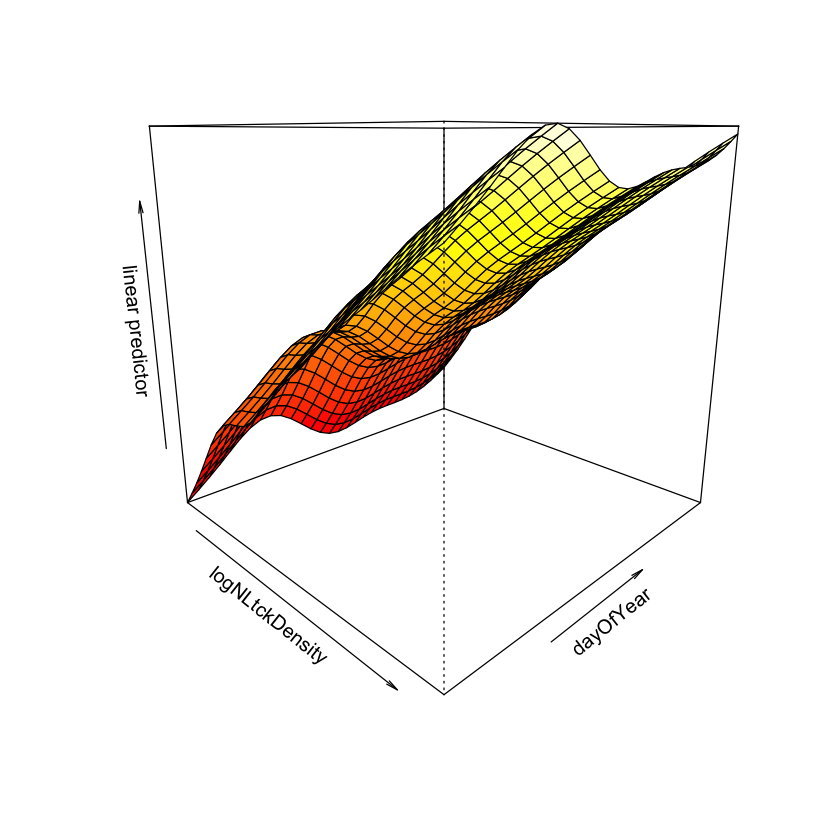
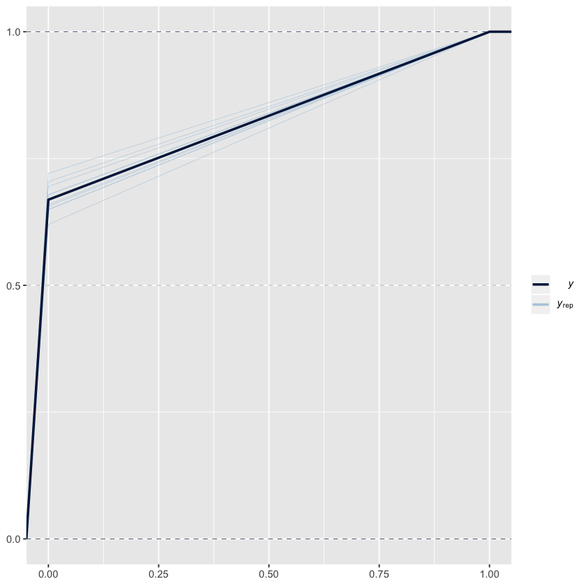

# Preliminary modelling for Borrellia

First, we load all packages and data. 


```R
######## GAM model with manual hurdle component ##########
library(tidyverse)
library(pscl) # hurdle models
library(lme4) # mixed effect models
library(boot) # logit/inv logit
library(car) # Anova (type III)
library(mgcv) # for GAMs
library(randomForest) # for random forest
library(brms)

tck <- read.csv("data_derived/MASTER_all_tck_data_merged.csv")

```

    Loading required package: Rcpp
    Registered S3 method overwritten by 'xts':
      method     from
      as.zoo.xts zoo 
    Loading 'brms' package (version 2.12.0). Useful instructions
    can be found by typing help('brms'). A more detailed introduction
    to the package is available through vignette('brms_overview').
    
    Attaching package: ‘brms’
    
    The following objects are masked from ‘package:mgcv’:
    
        s, t2
    
    The following object is masked from ‘package:lme4’:
    
        ngrps
    
    The following object is masked from ‘package:stats’:
    
        ar
    


## Filtering dataset 

First, let's see how many plots were tested and how many times (number of tests)


```R
#### Filter tick dataset and adjust ####

## How many plots were tested, and how many times?
tck %>%
  mutate(tested=ifelse(is.na(testingID),"no","yes")) %>%
  select(plotID, tested) %>% table(useNA="ifany")

```


              tested
    plotID        no   yes
      ABBY_001    70     0
      ABBY_002    63     0
      ABBY_003    63     0
      ABBY_005    67     0
      ABBY_006    63     0
      ABBY_023    68     0
      BARR_021     3     0
      BARR_030     9     0
      BARR_031     9     0
      BARR_034     9     0
      BARR_037     9     0
      BARR_084     9     0
      BART_002    93     0
      BART_010    87     0
      BART_011    87     0
      BART_015    90     0
      BART_019    87     0
      BART_029    66     0
      BLAN_002   180     0
      BLAN_004   123     0
      BLAN_005  2193  2807
      BLAN_008   126     0
      BLAN_012   221     6
      BLAN_015   798     2
      BLAN_020     3     0
      BONA_002    15     0
      BONA_004    12     0
      BONA_012    15     0
      BONA_013    12     0
      BONA_020    12     0
      BONA_044    15     0
      CLBJ_032    87     0
      CLBJ_033    91     0
      CLBJ_034    87     0
      CLBJ_036    81     0
      CLBJ_040    87     0
      CLBJ_043    87     0
      CPER_001    66     0
      CPER_002    66     0
      CPER_003    66     0
      CPER_004    66     0
      CPER_005    66     0
      CPER_007    66     0
      DCFS_001    62     0
      DCFS_003    53     0
      DCFS_004    39     0
      DCFS_005    43     0
      DCFS_007    42     0
      DCFS_010    59     0
      DEJU_001    24     0
      DEJU_003    24     0
      DEJU_009    24     0
      DEJU_014    24     0
      DEJU_015    24     0
      DEJU_044    21     0
      DELA_001    96     0
      DELA_004    21     0
      DELA_005   113     0
      DELA_007   100     0
      DELA_008   117     6
      DELA_011    21     0
      DELA_014   115     0
      DELA_016    94     0
      DSNY_001    90     0
      DSNY_002     9     0
      DSNY_004    87     0
      DSNY_005    84     0
      DSNY_006    90     0
      DSNY_008    89     0
      DSNY_014     6     0
      DSNY_021    69     0
      GRSM_003    84     0
      GRSM_004    84     0
      GRSM_005    42     0
      GRSM_006    84     0
      GRSM_009    84     0
      GRSM_010    90     0
      GRSM_015    42     0
      GUAN_002    45     0
      GUAN_004    12     0
      GUAN_006    48     0
      GUAN_031    45     0
      GUAN_064    33     0
      GUAN_065    48     0
      GUAN_066    48     0
      HARV_001   273   471
      HARV_002   184     0
      HARV_004  3185   352
      HARV_006   771     8
      HARV_020   152    46
      HARV_022  1382    88
      HARV_026   675    12
      HEAL_001    24     0
      HEAL_004    24     0
      HEAL_010    27     0
      HEAL_011    30     0
      HEAL_014    27     0
      HEAL_026    24     0
      JERC_002    96     0
      JERC_004    96     0
      JERC_005    21     0
      JERC_010    93     0
      JERC_011    54     0
      JERC_034    90     0
      JERC_044    87     0
      JORN_001    51     0
      JORN_002    56     0
      JORN_003    54     0
      JORN_004    54     0
      JORN_005    54     0
      JORN_006    51     0
      KONA_002    47    56
      KONA_003    41    48
      KONA_004    42     0
      KONA_019    41     2
      KONA_021    42     0
      KONA_024    39     0
      KONZ_001   116    14
      KONZ_002   178    29
      KONZ_004   154    32
      KONZ_007   115     2
      KONZ_009   116    35
      KONZ_025  7938  3001
      LAJA_001    45     0
      LAJA_002    45     0
      LAJA_003    33     0
      LAJA_004    42     0
      LAJA_005    30     0
      LAJA_030    30     0
      LENO_002   832     6
      LENO_003   744   245
      LENO_004  1206     0
      LENO_015   124     0
      LENO_023   159    24
      LENO_042   102     8
      MLBS_002    24     0
      MLBS_003    24     0
      MLBS_004    19     0
      MLBS_005    24     0
      MLBS_006    18     0
      MLBS_009    24     0
      MOAB_001    60     0
      MOAB_002    60     0
      MOAB_003    57     0
      MOAB_004    60     0
      MOAB_005    60     0
      MOAB_006    60     0
      NIWO_003    27     0
      NIWO_005    27     0
      NIWO_006    27     0
      NIWO_011    27     0
      NIWO_017    27     0
      NIWO_021    27     0
      NOGP_001    75     0
      NOGP_002    76     0
      NOGP_005    72     0
      NOGP_006    72     0
      NOGP_007    72     0
      NOGP_008    72     0
      OAES_003   110     0
      OAES_004   122     0
      OAES_005   110     0
      OAES_007   109     0
      OAES_008   124     0
      OAES_021   133     0
      ONAQ_003     6     0
      ONAQ_004    63     0
      ONAQ_005    63     0
      ONAQ_008     6     0
      ONAQ_009    63     0
      ONAQ_010     6     0
      ONAQ_011    57     0
      ONAQ_016    57     0
      ONAQ_023    58     0
      ORNL_002  5278  8471
      ORNL_003  3429   561
      ORNL_007 10677  3160
      ORNL_008  4779  6088
      ORNL_009  7493   638
      ORNL_040  5148  4196
      OSBS_001  3521  3609
      OSBS_002   231     0
      OSBS_003  2012  7181
      OSBS_004   144    26
      OSBS_005  9193 28824
      OSBS_022    72  1132
      OSBS_048    41     0
      RMNP_002    18     0
      RMNP_003    18     0
      RMNP_004    18     0
      RMNP_007    18     0
      RMNP_012    18     0
      RMNP_013    18     0
      SCBI_002  2696  1036
      SCBI_005   608    60
      SCBI_006   609    16
      SCBI_007  4085  1093
      SCBI_013  1215  4714
      SCBI_039  1951   147
      SERC_001  3300   567
      SERC_002  6861  3164
      SERC_005  1537  1105
      SERC_006   634   874
      SERC_012  1806   565
      SERC_023   125     8
      SJER_001    39     0
      SJER_002    39     0
      SJER_007    39     0
      SJER_008    39     0
      SJER_009    39     0
      SJER_025    39     0
      SOAP_003    12     0
      SOAP_004    12     0
      SOAP_005    12     0
      SOAP_006    12     0
      SOAP_009    12     0
      SOAP_026    12     0
      SRER_002    42     0
      SRER_003    45     0
      SRER_004    39     0
      SRER_006    45     0
      SRER_007    39     0
      SRER_008    42     0
      STEI_001    66     0
      STEI_002    70     0
      STEI_003    69     0
      STEI_005    70     0
      STEI_023    65     0
      STEI_029    81     0
      STER_006    42     0
      STER_026    51     0
      STER_027    54     0
      STER_028    51     0
      STER_029    51     0
      STER_033    54     0
      TALL_001  2703   923
      TALL_002  5996 18767
      TALL_003   951   738
      TALL_006   675   260
      TALL_008  1819  8798
      TALL_016   208     2
      TOOL_009     9     0
      TOOL_028     9     0
      TOOL_031     9     0
      TOOL_032     9     0
      TOOL_035     9     0
      TOOL_071     9     0
      TREE_005    95     0
      TREE_007   376   373
      TREE_015   271    23
      TREE_017   741   712
      TREE_019  1599  1607
      TREE_022   152   188
      UKFS_001 48606 22766
      UKFS_002  8765   315
      UKFS_003 63104  8448
      UKFS_004 36999  6667
      UKFS_018   128     0
      UKFS_030   157    32
      UNDE_002    69     0
      UNDE_003     9     0
      UNDE_011    66     0
      UNDE_013    75     0
      UNDE_017    94     0
      UNDE_019    76     0
      UNDE_999    69     0
      WOOD_001   248     0
      WOOD_002   163     0
      WOOD_006   225     0
      WOOD_007   290     0
      WOOD_009   187     0
      WOOD_024   111     0
      WREF_001    12     0
      WREF_004    12     0
      WREF_007    12     0
      WREF_008    12     0
      WREF_009    12     0
      WREF_013    12     0
      YELL_001     9     0
      YELL_002     9     0
      YELL_003    12     0
      YELL_004    13     0
      YELL_009    12     0
      YELL_012     9     0


```R
tck %>%
  mutate(tested=ifelse(is.na(testingID),"no","yes")) %>%
  select(lifeStage, tested) %>% table(useNA="ifany")
```


             tested
    lifeStage     no    yes
        Adult   9815      0
        Larva 260512      0
        Nymph  13821 155154


There are many plots that are never tested, and only nymphs were ever tested. Additionally, we are really only interested in Borrelia, since this causes Lyme disease. Let's look at the distribution of negative-Borrelia and non-tested sites. First, aggregate the dataset so that each line is ONE SAMPLE that tells us number tested, proportion tested, etc


```R
## Filter tck to only include samples that tested Borrelia_sp.; count number of different life stages; create proportiontested/positive tc
tck_allsamples_borr <- tck %>%
  mutate(tested=ifelse(is.na(Borrelia_sp.),0,1) # Was each tick  ever tested for borrellia?
         ,isPositive=ifelse(Borrelia_sp.=="Positive", 1,0) # And if it was tested, was it positive or negative?
  ) %>%
  group_by(domainID, siteID, nlcdClass, plotID, elevation, collectDate, dayOfYear, year, month) %>% # collapse by sample-- summing all tck counts together
  summarize(numberTested=sum(tested, na.rm=TRUE) # number of tested ticks in that sample
            ,n=n() # total ticks in that sample
            , numberPositive=sum(isPositive,na.rm = TRUE) # number of positive ticks in that sample
            , nAdult=sum(lifeStage=="Adult")
            , nNymph=sum(lifeStage=="Nymph")
            , nLarva=sum(lifeStage=="Larva")) %>%
  ungroup() %>%
  mutate(proportionTested=numberTested/nNymph # proportion of all nymph ticks tested-- only nymphs were ever tested.
         , proportionPositive=numberPositive/numberTested
         , tested = ifelse(numberTested > 0 , TRUE, FALSE) # new true/false tested, which is summed across ticks
         , testingStatus = ifelse(numberTested > 0, "Tested", ifelse(nNymph>0, "Nymphs present, not tested", "No nymphs"))
         ) %>%
  mutate(nlcdClass=factor(nlcdClass, levels=c("emergentHerbaceousWetlands","cultivatedCrops","pastureHay","grasslandHerbaceous"
                                              ,"dwarfScrub","shrubScrub","sedgeHerbaceous"
                                              ,"woodyWetlands","deciduousForest","evergreenForest","mixedForest"))) %>%
  mutate(borrPresent = ifelse(numberPositive>0,1,0)
         , domainID = factor(as.character(domainID))
         , siteID = factor(as.character(siteID))
         , plotID = factor(as.character(plotID))
         , year = factor(year)
         , tckDensity = sum(c(nLarva, nNymph, nAdult))/n
         , ntckDensity = nNymph/n
         , NLtckDensity = sum(c(nNymph, nAdult), na.rm = TRUE)/n)  %>%
  mutate(lognymphDensity=log(ntckDensity) # Log nymph density
         , logNLtckDensity=log(NLtckDensity) # Log non-Larval density (nymph + adults)
         , logtckDensity = log(tckDensity)) # Log total tick density
```

 Now, let's look at our data and see the degree of zero-inflation there is:


```R
## Plot over time, by year, by plot, to see how zero-inflated it is.
tck_allsamples_borr %>%
  ggplot() + geom_point(aes(x=dayOfYear, y=plotID, fill=proportionPositive, col=testingStatus), pch=21) +
  scale_fill_gradient(low="white", high="darkred") +
  scale_color_manual(values=c(Tested="blue", `Nymphs present, not tested`="grey", `No nymphs`="white")) +
  facet_grid(.~year)
```


What we see is that there are many plots where there were never tested, even though nymphs were present. Therefore, we should remove those sites from analyses.


```R
# What plots never had any borrelia?
infectedPlots <- tck %>%
  filter(Borrelia_sp.=="Positive") %>%
  select(plotID) %>%pull() %>% unique()
## Filtering same data as above; only now removing non-infected plots.
tck_borrelia_positivePlots <- tck_allsamples_borr %>%
  filter(plotID %in% as.character(infectedPlots))
```

Now, we can look at the distribution of zeros across all plots that were tested at least once.


```R
tck_borrelia_positivePlots %>%
  ggplot() + geom_point(aes(x=dayOfYear, y=plotID, fill=proportionPositive, col=testingStatus), pch=21) +
  scale_fill_gradient(low="white", high="darkred") +
  scale_color_manual(values=c(Tested="blue", `Nymphs present, not tested`="grey", `No nymphs`="white")) +
  facet_grid(.~year)

```


There are a lot of plot:collectionDate combinations that were simply never nested. So, let's remove those as well and re-plot the samples.


```R
## There are STILL a lot of zeros-- zeros where there are nymphs but they were never tested.
## Let's remove those.
tck_borrelia <- tck_borrelia_positivePlots %>%
  mutate(numberPositive=ifelse(numberTested==0,NA,numberPositive)) %>% # Make sure that numberPositive is not artificially zero-- if there were no tests, it should be NA
  filter(numberTested!=0) # get rid of all samples where the didn't actually test.

tck_borrelia %>%
  ggplot() + geom_point(aes(x=dayOfYear, y=plotID, fill=proportionPositive, col=testingStatus), pch=21) +
  scale_fill_gradient(low="white", high="darkred") +
  scale_color_manual(values=c(Tested="blue", `Nymphs present, not tested`="grey", `No nymphs`="white")) +
  facet_grid(.~year)
```


What we have are 311 samples left (see code below), where there is still an inflation of zeros, but is much, much better than before.


```R
nrow(tck_borrelia)
# There are only 311 samples left-- still zero inflated, but slightly better.

```

## Preliminary Plotting of prevalence and count


```R
#### Preliminary Plotting ####

# First, what is the distribution of Borrelia prevalence?
tck_borrelia %>%
  ggplot() +geom_histogram(aes(x=log(numberPositive+1)), bins=100)
# histogram without any zeros
tck_borrelia %>%
  filter(numberPositive>0) %>%
  ggplot() +geom_histogram(aes(x=(numberPositive)), bins=100)
# histogram log abundance, no zeros
tck_borrelia %>%
  filter(numberPositive>0) %>%
  ggplot() +geom_histogram(aes(x=log(numberPositive)), bins=50)

```


Are the number of positive ticks proportional to infection prevalence?


```R
# What is relationship between proportion positive and number positive
tck_borrelia %>%
  ggplot() +geom_point(aes(x=log(numberPositive), y=log(proportionPositive)))
```


What proportion of nymphs were tested in each sample? We expect a 1:1 line below if all nymphs were tested within each sample.


```R
# Now, what is the relationship between number tested and nNymph? Might be a binning artifact?
tck_borrelia %>%
  ggplot() +geom_point(aes(x=log(nNymph), y=log(numberTested)))
```


There are a few samples where they did not test ALL the nymphs. If we inspect these (below), we see that only HARV_004 is concerning, since all the others are missing less than 3 nymphs in their testing.


```R
# Just get rid of all data where they didn't test most nymphs-- see how many that is
tck_borrelia %>%
  filter(abs(nNymph-numberTested)>0) %>% select(plotID, collectDate, nNymph, numberTested)
# Most of these samples are not a problem, except HARV_004 (2015) and maybe SCI_002 (2017) and SERC_001 (2017-07). 
# Let's get rid of only HARV_004; I think all the rest are fine.
tck_borrelia_adj <- tck_borrelia %>%
  filter(abs(nNymph-numberTested)<3) # HARV_004 is the only site that differs nNymph and numberTested by more than 3

```


<table>
<caption>A tibble: 36 × 4</caption>
<thead>
	<tr><th scope=col>plotID</th><th scope=col>collectDate</th><th scope=col>nNymph</th><th scope=col>numberTested</th></tr>
	<tr><th scope=col>&lt;fct&gt;</th><th scope=col>&lt;fct&gt;</th><th scope=col>&lt;int&gt;</th><th scope=col>&lt;dbl&gt;</th></tr>
</thead>
<tbody>
	<tr><td>HARV_004</td><td>2015-07-13T18:22Z</td><td>1451</td><td>   2</td></tr>
	<tr><td>BLAN_005</td><td>2016-05-16T15:37Z</td><td> 577</td><td> 575</td></tr>
	<tr><td>BLAN_005</td><td>2017-06-01T17:59Z</td><td>1222</td><td>1221</td></tr>
	<tr><td>BLAN_005</td><td>2017-06-19T14:51Z</td><td> 158</td><td> 156</td></tr>
	<tr><td>SCBI_002</td><td>2016-05-31T14:40Z</td><td> 241</td><td> 240</td></tr>
	<tr><td>SCBI_002</td><td>2017-07-03T16:34Z</td><td>   7</td><td>   6</td></tr>
	<tr><td>SCBI_007</td><td>2017-05-31T17:32Z</td><td>  13</td><td>  12</td></tr>
	<tr><td>SCBI_013</td><td>2017-07-26T17:29Z</td><td> 483</td><td> 482</td></tr>
	<tr><td>SERC_001</td><td>2017-06-28T15:00Z</td><td>  31</td><td>  30</td></tr>
	<tr><td>SERC_001</td><td>2017-07-17T20:38Z</td><td>   7</td><td>   6</td></tr>
	<tr><td>SERC_002</td><td>2017-04-27T18:58Z</td><td>   3</td><td>   2</td></tr>
	<tr><td>SERC_002</td><td>2017-08-09T17:57Z</td><td>  29</td><td>  28</td></tr>
	<tr><td>SERC_005</td><td>2016-06-14T14:38Z</td><td>  56</td><td>  54</td></tr>
	<tr><td>SERC_005</td><td>2017-06-30T12:09Z</td><td>  29</td><td>  28</td></tr>
	<tr><td>SERC_005</td><td>2017-07-17T18:56Z</td><td>  25</td><td>  24</td></tr>
	<tr><td>SERC_006</td><td>2016-05-25T12:27Z</td><td>  18</td><td>  15</td></tr>
	<tr><td>SERC_006</td><td>2017-06-12T15:10Z</td><td> 341</td><td> 340</td></tr>
	<tr><td>SERC_006</td><td>2017-08-09T16:33Z</td><td>   3</td><td>   2</td></tr>
	<tr><td>SERC_012</td><td>2016-06-13T18:25Z</td><td>  24</td><td>  21</td></tr>
	<tr><td>SERC_012</td><td>2017-05-18T23:10Z</td><td> 133</td><td> 132</td></tr>
	<tr><td>SERC_012</td><td>2017-06-29T21:15Z</td><td>  25</td><td>  24</td></tr>
	<tr><td>OSBS_005</td><td>2016-03-30T13:40Z</td><td>3578</td><td>3577</td></tr>
	<tr><td>TREE_019</td><td>2016-06-27T17:45Z</td><td> 576</td><td> 575</td></tr>
	<tr><td>ORNL_002</td><td>2016-07-13T14:40Z</td><td>  31</td><td>  30</td></tr>
	<tr><td>ORNL_002</td><td>2017-05-03T14:15Z</td><td> 133</td><td> 132</td></tr>
	<tr><td>ORNL_007</td><td>2014-07-16T16:50Z</td><td> 183</td><td> 182</td></tr>
	<tr><td>ORNL_007</td><td>2016-06-03T15:00Z</td><td>  73</td><td>  72</td></tr>
	<tr><td>ORNL_007</td><td>2016-07-13T04:53Z</td><td>1600</td><td>1599</td></tr>
	<tr><td>ORNL_007</td><td>2017-04-13T16:05Z</td><td>  19</td><td>  18</td></tr>
	<tr><td>ORNL_007</td><td>2017-05-26T19:11Z</td><td>  43</td><td>  42</td></tr>
	<tr><td>ORNL_007</td><td>2017-07-03T16:07Z</td><td>  91</td><td>  90</td></tr>
	<tr><td>ORNL_007</td><td>2017-08-01T16:44Z</td><td>  21</td><td>  20</td></tr>
	<tr><td>ORNL_008</td><td>2014-06-26T15:32Z</td><td>4033</td><td>4032</td></tr>
	<tr><td>ORNL_008</td><td>2017-05-26T17:25Z</td><td> 183</td><td> 182</td></tr>
	<tr><td>ORNL_040</td><td>2017-08-01T13:19Z</td><td> 625</td><td> 624</td></tr>
	<tr><td>TALL_008</td><td>2016-04-20T15:23Z</td><td> 871</td><td> 870</td></tr>
</tbody>
</table>


## Fitting GAMs

Because the data are zero-inflated, we are going to do a two-part model first to prevent issues with convergence. First, we fit a GAM to the binomial component of the data.


```R
#### Fitting GAMs with a hurdle model component ####

# First, model a binomial component with dayOfYear, nlcdClass, and non-larval tick density (NLtckDensity) as predictors of borrellia presence/absence.
# Plot is a random effect, which I include as a varying-intercept, varying-slope model.
mod.gambin <- gam(borrPresent ~ s(dayOfYear) + nlcdClass + s(plotID, bs="re") + s(dayOfYear,plotID, bs="re") + s(logNLtckDensity) + offset(log(numberTested))
                # , offset=log(numberTested) # I include the offset in the formula instead, so that it is included in predictions. Including it here does NOT incorporate numberTested in predictiosn.
                , data=tck_borrelia_adj
                , method="REML"
                , family=binomial)

```


```R
gam.check(mod.gambin)

```

    
    Method: REML   Optimizer: outer newton
    full convergence after 9 iterations.
    Gradient range [-0.0002481739,-3.069898e-05]
    (score 150.2897 & scale 1).
    Hessian positive definite, eigenvalue range [5.50818e-05,3.265953].
    Model rank =  82 / 82 
    
    Basis dimension (k) checking results. Low p-value (k-index<1) may
    indicate that k is too low, especially if edf is close to k'.
    
                           k'   edf k-index p-value
    s(dayOfYear)         9.00  1.01    0.93    0.15
    s(plotID)           30.00 15.00      NA      NA
    s(dayOfYear,plotID) 30.00  5.92      NA      NA
    s(logNLtckDensity)   9.00  1.00    1.03    0.70


```R
summary(mod.gambin)

```


    
    Family: binomial 
    Link function: logit 
    
    Formula:
    borrPresent ~ s(dayOfYear) + nlcdClass + s(plotID, bs = "re") + 
        s(dayOfYear, plotID, bs = "re") + s(logNLtckDensity) + offset(log(numberTested))
    
    Parametric coefficients:
                             Estimate Std. Error z value Pr(>|z|)    
    (Intercept)                -6.046      1.137  -5.316 1.06e-07 ***
    nlcdClassdeciduousForest    1.165      1.217   0.957   0.3385    
    nlcdClassevergreenForest    2.339      1.570   1.490   0.1364    
    nlcdClassmixedForest        4.876      1.899   2.568   0.0102 *  
    ---
    Signif. codes:  0 ‘***’ 0.001 ‘**’ 0.01 ‘*’ 0.05 ‘.’ 0.1 ‘ ’ 1
    
    Approximate significance of smooth terms:
                           edf Ref.df Chi.sq  p-value    
    s(dayOfYear)         1.013  1.026   3.55   0.0602 .  
    s(plotID)           15.003 26.000  67.52   0.1576    
    s(dayOfYear,plotID)  5.923 29.000  32.84   0.3815    
    s(logNLtckDensity)   1.000  1.000  16.19 5.73e-05 ***
    ---
    Signif. codes:  0 ‘***’ 0.001 ‘**’ 0.01 ‘*’ 0.05 ‘.’ 0.1 ‘ ’ 1
    
    R-sq.(adj) =  0.418   Deviance explained = 54.1%
    -REML = 150.29  Scale est. = 1         n = 308


```R
plot(mod.gambin, scale=0, pages=1)

```


```R
vis.gam(mod.gambin, view = c("logNLtckDensity","dayOfYear"), theta=-45)

```


```R
# Get the "predicted" presence/absence of borrellia, and see how "correct" it was?
plot(NULL,xlim=c(0,1),ylim=c(0,1), xlab=c("Probability Threshold"), ylab=c("Percentage Preditions correct"))
for ( p in seq(0,1, by = 0.05)) {
  points(x=p, y=mean((predict(mod.gambin, type = "response")>p) == tck_borrelia_adj$borrPresent))
}
# Proportion of correct predictions
mean((predict(mod.gambin, type = "response")>0.5) == tck_borrelia_adj$borrPresent)

```


0.844155844155844


```R
# Of those where they predicted presence/absence incorrectly, how "far" were they off? 
# (i.e. were there are "negative" predictions that actually had a LOT of borrellia?)
tck_borrelia_adj %>%
  mutate(pred =as.numeric(predict(mod.gambin, type="response"))
         ,correctPredBin = ((pred>0.5) == tck_borrelia_adj$borrPresent) ) %>%
  ggplot() +geom_jitter(aes(x=log(numberPositive+1), y=correctPredBin), height=0.25, width=0) + ylab("Correctly predicted")
# Ideally, you have a positive, linear correlation between proportion positive and predicted probability. "Errors" should be correlated with small sample size.
tck_borrelia_adj %>%
  mutate(pred =as.numeric(plogis(predict(mod.gambin)))
         ,correctPredBin =((pred>0.5) == tck_borrelia_adj$borrPresent) ) %>%
  ggplot() +geom_point(aes(x=proportionPositive, y=pred, col=correctPredBin, cex=log(numberTested)))

```


```R

```


```R
# What are the groups that they least accurately predicted?
tck_borrelia_adj %>%
  mutate(predictedProbability =as.numeric(plogis(predict(mod.gambin)))
         ,correctPredBin =((predictedProbability>0.5) == tck_borrelia_adj$borrPresent) 
         # , proportionPositive = ifelse(proportionPositive==0, NA, proportionPositive)
         ) %>%
  ggplot() + geom_point(aes(x=dayOfYear, y=plotID, fill=proportionPositive, col=predictedProbability), pch=21,cex=3) +
  scale_fill_gradient(low="white", high="darkred") +
  scale_color_gradient(low="white", high="darkred") +
  facet_grid(.~year)
```


```R
# Is there a bias for predicting negative or positive results?
tck_borrelia_adj %>%
  mutate(predictedProbability =as.numeric(plogis(predict(mod.gambin)))
         , predictedPA = (predictedProbability>0.5)
         ,correctPredBin =((predictedProbability>0.5) == tck_borrelia_adj$borrPresent) ) %>%
  select(borrPresent,predictedPA) %>% table()
paste0(c("False positive rate: ", round(11/(195+11),4)))
paste0(c("False negative rate: ", round(37/(65+37),4)))
# The false negative rate is actually a lot higher than the false positive rate. 
# This means, on average, more samples are positive then you'd expect, given the model.

```


               predictedPA
    borrPresent FALSE TRUE
              0   195   11
              1    37   65


<ol class=list-inline>
	<li>'False positive rate: '</li>
	<li>'0.0534'</li>
</ol>


<ol class=list-inline>
	<li>'False positive rate: '</li>
	<li>'0.3627'</li>
</ol>


Now that we've fitted a binomial model to the presence/absence data, we need to fit a poisson or negative binomial model to the second part of the pseudo-hurdle model. First, we keep all positive borrelia samples. Then, for each "negative" borrelia result, we look at the predicted probability of presence in our model to determine whether it is a "binomial/hurdle" negative, or a "poisson/negbin" negative.


```R
tck_borrelia_filtBin <- tck_borrelia_adj %>%
  mutate(pred=predict(mod.gambin, type="response")) %>%
  filter((borrPresent>0 | pred > 0.5))

# Double check I did the filtering correctly
tck_borrelia_filtBin %>%
  mutate(predictedPA = (pred > 0.5)) %>%
  select(borrPresent,predictedPA) %>% table()
```


               predictedPA
    borrPresent FALSE TRUE
              0     0   11
              1    37   65


```R
# Check if there is overdispersion
test_glm_filt <- glm(numberPositive ~ factor(month) + nlcdClass + plotID + year
                     , data=tck_borrelia_filtBin
                     , family="quasipoisson"
                     , offset = log(numberTested)
)
summary(test_glm_filt)

```


    
    Call:
    glm(formula = numberPositive ~ factor(month) + nlcdClass + plotID + 
        year, family = "quasipoisson", data = tck_borrelia_filtBin, 
        offset = log(numberTested))
    
    Deviance Residuals: 
       Min      1Q  Median      3Q     Max  
    -9.003  -1.895   0.000   2.118   8.483  
    
    Coefficients: (3 not defined because of singularities)
                             Estimate Std. Error t value Pr(>|t|)    
    (Intercept)               -4.5914     0.9105  -5.043  3.1e-06 ***
    factor(month)5             0.6162     0.7178   0.858 0.393390    
    factor(month)6             0.6808     0.7360   0.925 0.357962    
    factor(month)7             0.5101     0.7682   0.664 0.508690    
    factor(month)8             0.6103     1.0333   0.591 0.556576    
    factor(month)9             1.6502     1.5206   1.085 0.281291    
    nlcdClassdeciduousForest   2.1172     0.5361   3.949 0.000175 ***
    nlcdClassevergreenForest   2.5122     0.7353   3.417 0.001027 ** 
    nlcdClassmixedForest       1.4138     0.6127   2.308 0.023783 *  
    plotIDHARV_001             0.2991     0.4248   0.704 0.483623    
    plotIDHARV_004             1.0155     0.6946   1.462 0.147895    
    plotIDHARV_006             1.2637     2.1287   0.594 0.554528    
    plotIDHARV_020             2.8589     2.9422   0.972 0.334323    
    plotIDHARV_022            -0.2242     1.0829  -0.207 0.836547    
    plotIDHARV_026             0.9694     3.5658   0.272 0.786478    
    plotIDKONZ_025            -2.1001     0.7121  -2.949 0.004249 ** 
    plotIDORNL_002            -1.6156     0.8581  -1.883 0.063609 .  
    plotIDORNL_007            -3.8387     1.3856  -2.770 0.007053 ** 
    plotIDORNL_008            -0.4575     1.8758  -0.244 0.807967    
    plotIDORNL_040            -0.9526     1.3271  -0.718 0.475107    
    plotIDOSBS_001             0.6265     0.7596   0.825 0.412105    
    plotIDOSBS_005                 NA         NA      NA       NA    
    plotIDSCBI_002            -0.1317     0.5099  -0.258 0.796943    
    plotIDSCBI_007            -0.7636     0.6641  -1.150 0.253844    
    plotIDSCBI_013            -1.0637     0.3561  -2.987 0.003802 ** 
    plotIDSERC_001            -0.6498     0.8189  -0.794 0.429966    
    plotIDSERC_002            -0.9063     0.3179  -2.851 0.005619 ** 
    plotIDSERC_005            -2.2972     0.8945  -2.568 0.012217 *  
    plotIDSERC_006            -2.1509     0.9540  -2.255 0.027070 *  
    plotIDSERC_012            -1.3469     0.8491  -1.586 0.116898    
    plotIDTALL_001            -0.3457     2.1287  -0.162 0.871415    
    plotIDTALL_008            -1.8198     0.4989  -3.648 0.000486 ***
    plotIDTREE_007            -0.8625     0.8768  -0.984 0.328416    
    plotIDTREE_015             1.4615     1.5762   0.927 0.356764    
    plotIDTREE_017            -0.1297     0.4106  -0.316 0.752991    
    plotIDTREE_019                 NA         NA      NA       NA    
    plotIDTREE_022                 NA         NA      NA       NA    
    plotIDUKFS_001            -2.4622     0.6526  -3.773 0.000320 ***
    year2015                   0.4291     0.8308   0.517 0.607021    
    year2016                   0.6299     0.4150   1.518 0.133317    
    year2017                   0.6003     0.4106   1.462 0.147926    
    ---
    Signif. codes:  0 ‘***’ 0.001 ‘**’ 0.01 ‘*’ 0.05 ‘.’ 0.1 ‘ ’ 1
    
    (Dispersion parameter for quasipoisson family taken to be 23.77297)
    
        Null deviance: 4507.2  on 112  degrees of freedom
    Residual deviance: 1401.0  on  75  degrees of freedom
    AIC: NA
    
    Number of Fisher Scoring iterations: 7


```R
# Try a regular poisson, and see how many zeros it finds
test_glm_filt2 <- glm(numberPositive ~ factor(month) + nlcdClass + plotID + year
                     , data=tck_borrelia_filtBin
                     , family="poisson"
                     , offset = log(numberTested)
)
mu <- predict(test_glm_filt2, type="response") # estimated mean
exp <- sum(dpois(x=0, lambda=mu)) # get probability of zero, then add those up to get total zeros expected?
round(exp)
sum(tck_borrelia_filtBin$numberPositive==0) # real number of zeros
# Yes, there appears to be overdispersion... but the zero-inflation is not nearly as much!

```


7


11


```R
# Now try a negative binomial fit, and see how many zeros it predicts
test_glm_filt3 <- glm(proportionPositive ~ factor(month) + nlcdClass + plotID + year
                      , data=tck_borrelia_filtBin
                      , family=negative.binomial(theta = 1) 
                      , offset = log(numberTested)
)
summary(test_glm_filt3)
mu <- predict(test_glm_filt3, type="response") # estimated mean
sum(round(mu*tck_borrelia_filtBin$numberTested) == 0) # Number of zeros it estimates, given r for each sample
sum(tck_borrelia_filtBin$numberPositive==0) # real number of zeros
# The zero-inflation is significantly reduced!

```


    
    Call:
    glm(formula = proportionPositive ~ factor(month) + nlcdClass + 
        plotID + year, family = negative.binomial(theta = 1), data = tck_borrelia_filtBin, 
        offset = log(numberTested))
    
    Deviance Residuals: 
        Min       1Q   Median       3Q      Max  
    -1.4254  -0.7928  -0.2462   0.8425   1.4728  
    
    Coefficients: (3 not defined because of singularities)
                              Estimate Std. Error t value Pr(>|t|)   
    (Intercept)              -14.94214    4.55383  -3.281  0.00157 **
    factor(month)5             0.13142    3.02875   0.043  0.96550   
    factor(month)6             0.06433    3.06999   0.021  0.98334   
    factor(month)7             1.69979    3.09146   0.550  0.58407   
    factor(month)8             1.63491    3.19162   0.512  0.60998   
    factor(month)9             5.22554    3.51040   1.489  0.14079   
    nlcdClassdeciduousForest   4.02886    3.13265   1.286  0.20237   
    nlcdClassevergreenForest   6.22857    3.09516   2.012  0.04777 * 
    nlcdClassmixedForest       4.14489    3.12875   1.325  0.18927   
    plotIDHARV_001             1.41576    1.22966   1.151  0.25325   
    plotIDHARV_004             1.37492    1.33578   1.029  0.30665   
    plotIDHARV_006             4.44487    1.77480   2.504  0.01444 * 
    plotIDHARV_020             6.29409    3.52886   1.784  0.07853 . 
    plotIDHARV_022             0.96716    1.13215   0.854  0.39567   
    plotIDHARV_026             3.42787    1.81482   1.889  0.06278 . 
    plotIDKONZ_025            -2.85701    3.21563  -0.888  0.37712   
    plotIDORNL_002            -1.51078    2.76080  -0.547  0.58585   
    plotIDORNL_007            -4.23415    2.73485  -1.548  0.12578   
    plotIDORNL_008            -0.25972    2.51337  -0.103  0.91797   
    plotIDORNL_040            -3.70675    2.61491  -1.418  0.16047   
    plotIDOSBS_001             1.40540    4.09080   0.344  0.73214   
    plotIDOSBS_005                  NA         NA      NA       NA   
    plotIDSCBI_002             1.52889    1.30852   1.168  0.24634   
    plotIDSCBI_007             2.85050    1.28871   2.212  0.03002 * 
    plotIDSCBI_013            -0.51940    1.18087  -0.440  0.66132   
    plotIDSERC_001             2.57485    1.19298   2.158  0.03410 * 
    plotIDSERC_002            -2.28323    1.50597  -1.516  0.13369   
    plotIDSERC_005             0.16416    1.56572   0.105  0.91678   
    plotIDSERC_006             0.81959    1.21369   0.675  0.50157   
    plotIDSERC_012            -0.51134    1.50230  -0.340  0.73453   
    plotIDTALL_001             1.22600    2.49050   0.492  0.62397   
    plotIDTALL_008            -2.62739    2.75519  -0.954  0.34334   
    plotIDTREE_007            -0.77210    1.96422  -0.393  0.69537   
    plotIDTREE_015             3.67562    1.59252   2.308  0.02375 * 
    plotIDTREE_017             0.65526    1.10260   0.594  0.55411   
    plotIDTREE_019                  NA         NA      NA       NA   
    plotIDTREE_022                  NA         NA      NA       NA   
    plotIDUKFS_001            -5.34212    2.49145  -2.144  0.03526 * 
    year2015                   4.52823    1.82140   2.486  0.01514 * 
    year2016                   3.94379    1.32288   2.981  0.00387 **
    year2017                   3.04174    1.37875   2.206  0.03044 * 
    ---
    Signif. codes:  0 ‘***’ 0.001 ‘**’ 0.01 ‘*’ 0.05 ‘.’ 0.1 ‘ ’ 1
    
    (Dispersion parameter for Negative Binomial(1) family taken to be 0.7631693)
    
        Null deviance: 174.997  on 112  degrees of freedom
    Residual deviance:  80.263  on  75  degrees of freedom
    AIC: 220.19
    
    Number of Fisher Scoring iterations: 10


10


11


Finally, let's run a second set of GAMs to model prevalence of borrelia in positive samples.


```R
# make year a factor
tck_borrelia_filtBin <- tck_borrelia_filtBin %>%
  mutate(year=factor(year))

#### Finally, the second GAM model for abundance ####
mod.gam_pois <- gam(numberPositive ~ offset(log(numberTested)) +  #Offset
                  s(dayOfYear, sp=2) + s(logNLtckDensity, sp=2)  + nlcdClass +# Main effects: day of year and nymph/adult tick density
                  s(plotID, bs="re") + s(dayOfYear,plotID, bs="re") + # Random Effect of plot
                  s(year, bs="re") + s(year,dayOfYear, bs="re") # Random effect of year
                , data=tck_borrelia_filtBin
                , method="REML"
                , family="poisson")
gam.check(mod.gam_pois)
```

    
    Method: REML   Optimizer: outer newton
    full convergence after 9 iterations.
    Gradient range [-0.0004754618,-3.836562e-05]
    (score 896.379 & scale 1).
    Hessian positive definite, eigenvalue range [0.0004753747,12.85437].
    Model rank =  90 / 90 
    
    Basis dimension (k) checking results. Low p-value (k-index<1) may
    indicate that k is too low, especially if edf is close to k'.
    
                              k'      edf k-index p-value
    s(dayOfYear)         9.00000  3.81381    0.95    0.32
    s(logNLtckDensity)   9.00000  2.73686    1.01    0.50
    s(plotID)           30.00000 19.63807      NA      NA
    s(dayOfYear,plotID) 30.00000 21.62326      NA      NA
    s(year)              4.00000  2.57506      NA      NA
    s(year,dayOfYear)    4.00000  0.00191      NA      NA


```R
summary(mod.gam_pois)
plot(mod.gam_pois, pages=1, scale=0)
```


    
    Family: poisson 
    Link function: log 
    
    Formula:
    numberPositive ~ offset(log(numberTested)) + s(dayOfYear, sp = 2) + 
        s(logNLtckDensity, sp = 2) + nlcdClass + s(plotID, bs = "re") + 
        s(dayOfYear, plotID, bs = "re") + s(year, bs = "re") + s(year, 
        dayOfYear, bs = "re")
    
    Parametric coefficients:
                             Estimate Std. Error z value Pr(>|z|)
    (Intercept)               -0.8614     1.9333  -0.446    0.656
    nlcdClassdeciduousForest  -1.2468     2.0162  -0.618    0.536
    nlcdClassevergreenForest  -1.3977     2.6209  -0.533    0.594
    nlcdClassmixedForest      -1.7245     2.6151  -0.659    0.510
    
    Approximate significance of smooth terms:
                              edf Ref.df    Chi.sq  p-value    
    s(dayOfYear)         3.813812  4.754 6.708e+01 6.02e-13 ***
    s(logNLtckDensity)   2.736862  3.387 1.643e+02  < 2e-16 ***
    s(plotID)           19.638074 26.000 1.021e+06 1.39e-05 ***
    s(dayOfYear,plotID) 21.623256 29.000 1.227e+06 7.58e-06 ***
    s(year)              2.575063  3.000 6.266e+03 5.50e-06 ***
    s(year,dayOfYear)    0.001909  3.000 4.000e-03    0.499    
    ---
    Signif. codes:  0 ‘***’ 0.001 ‘**’ 0.01 ‘*’ 0.05 ‘.’ 0.1 ‘ ’ 1
    
    R-sq.(adj) =  0.782   Deviance explained = 77.9%
    -REML = 896.38  Scale est. = 1         n = 113


```R
vis.gam(mod.gam_pois, view = c("logNLtckDensity","dayOfYear"), theta=45)

```


```R
# sanity check to see that this relationship actually makes sense
plot(tck_borrelia_filtBin$proportionPositive ~ tck_borrelia_filtBin$logNLtckDensity)
plot(tck_borrelia_filtBin$proportionPositive ~ tck_borrelia_filtBin$dayOfYear)

```


Let's also try a quasi-poisson model to see if it improves fit.


```R
# Let's fit a quasipoisson to see if this improves residual distribution.
mod.gam_qpois <- gam(numberPositive ~ offset(log(numberTested)) +  #Offset
                      s(dayOfYear, sp=1) + s(logNLtckDensity, sp=1)  + nlcdClass +# Main effects: day of year and nymph/adult tick density
                      s(plotID, bs="re") + s(dayOfYear,plotID, bs="re") + # Random Effect of plot
                      s(year, bs="re") + s(year,dayOfYear, bs="re") # Random effect of year
                    , data=tck_borrelia_filtBin
                    , method="REML"
                    , family="quasipoisson")
gam.check(mod.gam_qpois)
```

    
    Method: REML   Optimizer: outer newton
    full convergence after 11 iterations.
    Gradient range [-0.0001813477,0.0002672379]
    (score 230.8932 & scale 12.98939).
    Hessian positive definite, eigenvalue range [7.922958e-06,54.33232].
    Model rank =  90 / 90 
    
    Basis dimension (k) checking results. Low p-value (k-index<1) may
    indicate that k is too low, especially if edf is close to k'.
    
                              k'      edf k-index p-value  
    s(dayOfYear)        9.00e+00 5.15e+00    0.90    0.12  
    s(logNLtckDensity)  9.00e+00 4.02e+00    0.87    0.06 .
    s(plotID)           3.00e+01 1.36e+01      NA      NA  
    s(dayOfYear,plotID) 3.00e+01 7.05e-04      NA      NA  
    s(year)             4.00e+00 1.74e-05      NA      NA  
    s(year,dayOfYear)   4.00e+00 1.85e-05      NA      NA  
    ---
    Signif. codes:  0 ‘***’ 0.001 ‘**’ 0.01 ‘*’ 0.05 ‘.’ 0.1 ‘ ’ 1


```R
summary(mod.gam_qpois)
plot(mod.gam_qpois, pages=1, scale=0)
```


    
    Family: quasipoisson 
    Link function: log 
    
    Formula:
    numberPositive ~ offset(log(numberTested)) + s(dayOfYear, sp = 1) + 
        s(logNLtckDensity, sp = 1) + nlcdClass + s(plotID, bs = "re") + 
        s(dayOfYear, plotID, bs = "re") + s(year, bs = "re") + s(year, 
        dayOfYear, bs = "re")
    
    Parametric coefficients:
                             Estimate Std. Error t value Pr(>|t|)    
    (Intercept)               -2.3301     0.5005  -4.655 1.16e-05 ***
    nlcdClassdeciduousForest   0.2973     0.5148   0.577    0.565    
    nlcdClassevergreenForest   0.7964     0.7169   1.111    0.270    
    nlcdClassmixedForest       0.8932     0.6704   1.332    0.186    
    ---
    Signif. codes:  0 ‘***’ 0.001 ‘**’ 0.01 ‘*’ 0.05 ‘.’ 0.1 ‘ ’ 1
    
    Approximate significance of smooth terms:
                              edf Ref.df     F  p-value    
    s(dayOfYear)        5.147e+00  6.207 1.508    0.172    
    s(logNLtckDensity)  4.015e+00  4.960 6.293 4.44e-05 ***
    s(plotID)           1.357e+01 26.000 2.960 1.86e-10 ***
    s(dayOfYear,plotID) 7.051e-04 29.000 0.000    0.665    
    s(year)             1.738e-05  3.000 0.000    1.000    
    s(year,dayOfYear)   1.846e-05  3.000 0.000    1.000    
    ---
    Signif. codes:  0 ‘***’ 0.001 ‘**’ 0.01 ‘*’ 0.05 ‘.’ 0.1 ‘ ’ 1
    
    R-sq.(adj) =  0.772   Deviance explained = 71.2%
    -REML = 230.89  Scale est. = 12.989    n = 113


```R
vis.gam(mod.gam_qpois, view = c("logNLtckDensity","dayOfYear"), theta=45)

```


In my opinion, I think the regular poisson looks better. Finally, let's try a negative binomial model.


```R
## Last option: a negative binomial.
mod.gam_nb <- gam(numberPositive ~ 
                       s(dayOfYear) + s(logNLtckDensity)  + nlcdClass +# Main effects: day of year and nymph/adult tick density
                       s(plotID, bs="re") + s(dayOfYear,plotID, bs="re") + # Random Effect of plot
                       s(year, bs="re") + s(year,dayOfYear, bs="re") # Random effect of year
                     , data=tck_borrelia_filtBin
                     , method="REML"
                     , family=nb)
gam.check(mod.gam_nb)
```

    
    Method: REML   Optimizer: outer newton
    full convergence after 10 iterations.
    Gradient range [-9.166316e-05,4.737323e-07]
    (score 459.1966 & scale 1).
    Hessian positive definite, eigenvalue range [7.116824e-06,42.59625].
    Model rank =  90 / 90 
    
    Basis dimension (k) checking results. Low p-value (k-index<1) may
    indicate that k is too low, especially if edf is close to k'.
    
                              k'      edf k-index p-value  
    s(dayOfYear)        9.00e+00 2.13e+00    0.82   0.090 .
    s(logNLtckDensity)  9.00e+00 1.00e+00    0.80   0.065 .
    s(plotID)           3.00e+01 5.49e+00      NA      NA  
    s(dayOfYear,plotID) 3.00e+01 6.96e-04      NA      NA  
    s(year)             4.00e+00 2.03e-05      NA      NA  
    s(year,dayOfYear)   4.00e+00 1.97e-05      NA      NA  
    ---
    Signif. codes:  0 ‘***’ 0.001 ‘**’ 0.01 ‘*’ 0.05 ‘.’ 0.1 ‘ ’ 1


```R
summary(mod.gam_nb)
plot(mod.gam_nb, pages=1, scale=0)
```


    
    Family: Negative Binomial(1.081) 
    Link function: log 
    
    Formula:
    numberPositive ~ s(dayOfYear) + s(logNLtckDensity) + nlcdClass + 
        s(plotID, bs = "re") + s(dayOfYear, plotID, bs = "re") + 
        s(year, bs = "re") + s(year, dayOfYear, bs = "re")
    
    Parametric coefficients:
                             Estimate Std. Error z value Pr(>|z|)    
    (Intercept)                2.4905     0.4454   5.591 2.26e-08 ***
    nlcdClassdeciduousForest   0.3569     0.4600   0.776    0.438    
    nlcdClassevergreenForest   0.6782     0.6070   1.117    0.264    
    nlcdClassmixedForest       0.7426     0.5555   1.337    0.181    
    ---
    Signif. codes:  0 ‘***’ 0.001 ‘**’ 0.01 ‘*’ 0.05 ‘.’ 0.1 ‘ ’ 1
    
    Approximate significance of smooth terms:
                              edf Ref.df Chi.sq  p-value    
    s(dayOfYear)        2.132e+00  2.683 16.325 0.000961 ***
    s(logNLtckDensity)  1.000e+00  1.000 50.137 1.44e-12 ***
    s(plotID)           5.495e+00 26.000  7.570 0.114704    
    s(dayOfYear,plotID) 6.965e-04 29.000  0.001 0.765063    
    s(year)             2.033e-05  3.000  0.000 1.000000    
    s(year,dayOfYear)   1.968e-05  3.000  0.000 0.835225    
    ---
    Signif. codes:  0 ‘***’ 0.001 ‘**’ 0.01 ‘*’ 0.05 ‘.’ 0.1 ‘ ’ 1
    
    R-sq.(adj) =  0.331   Deviance explained = 48.2%
    -REML =  459.2  Scale est. = 1         n = 113


Honestly, I think the poisson distribution fits the data better than the negative binomial.

## Fitting GAMs to completely non-zero counts

One last thing to try with GAMs before we move onto brms is to see what the fit looks like if we simply remove all zeros.


```R
#### GAM on non-zero counts ####
# Filter to only non-zeros
tck_borrelia_nozeros <- tck_borrelia_adj %>%
  filter(numberPositive>0) %>%
  mutate(year=factor(year))

mod.gam_pois_nozeros <- gam(numberPositive ~ offset(log(numberTested)) +  #Offset
                      s(dayOfYear, sp=2) + s(logNLtckDensity, sp=1)  + nlcdClass +# Main effects: day of year and nymph/adult tick density
                      s(plotID, bs="re") + s(dayOfYear,plotID, bs="re") + # Random Effect of plot
                      s(year, bs="re") + s(year,dayOfYear, bs="re") # Random effect of year
                    , data=tck_borrelia_nozeros
                    , method="REML"
                    , family="poisson")
gam.check(mod.gam_pois_nozeros)
```

    
    Method: REML   Optimizer: outer newton
    full convergence after 10 iterations.
    Gradient range [-0.0003277766,0.0001255724]
    (score 724.2823 & scale 1).
    Hessian positive definite, eigenvalue range [0.0003277506,11.5793].
    Model rank =  90 / 90 
    
    Basis dimension (k) checking results. Low p-value (k-index<1) may
    indicate that k is too low, especially if edf is close to k'.
    
                              k'      edf k-index p-value
    s(dayOfYear)         9.00000  4.02574    1.09    0.83
    s(logNLtckDensity)   9.00000  3.42637    1.03    0.59
    s(plotID)           30.00000 17.55513      NA      NA
    s(dayOfYear,plotID) 30.00000 18.14525      NA      NA
    s(year)              4.00000  2.75692      NA      NA
    s(year,dayOfYear)    4.00000  0.00116      NA      NA


```R
summary(mod.gam_pois_nozeros)
plot(mod.gam_pois_nozeros, pages=1, scale=0)
```


    
    Family: poisson 
    Link function: log 
    
    Formula:
    numberPositive ~ offset(log(numberTested)) + s(dayOfYear, sp = 2) + 
        s(logNLtckDensity, sp = 1) + nlcdClass + s(plotID, bs = "re") + 
        s(dayOfYear, plotID, bs = "re") + s(year, bs = "re") + s(year, 
        dayOfYear, bs = "re")
    
    Parametric coefficients:
                             Estimate Std. Error z value Pr(>|z|)
    (Intercept)               -1.6970     1.0761  -1.577    0.115
    nlcdClassdeciduousForest  -0.1902     1.1217  -0.170    0.865
    nlcdClassevergreenForest  -0.2369     1.4693  -0.161    0.872
    nlcdClassmixedForest      -0.6627     1.4479  -0.458    0.647
    
    Approximate significance of smooth terms:
                              edf Ref.df    Chi.sq  p-value    
    s(dayOfYear)         4.025736  4.905 6.491e+01 2.30e-12 ***
    s(logNLtckDensity)   3.426370  4.193 1.480e+02  < 2e-16 ***
    s(plotID)           17.555133 26.000 1.914e+05 3.58e-05 ***
    s(dayOfYear,plotID) 18.145247 29.000 1.522e+05 0.000718 ***
    s(year)              2.756924  3.000 5.024e+03 4.57e-11 ***
    s(year,dayOfYear)    0.001164  3.000 1.000e-03 0.600905    
    ---
    Signif. codes:  0 ‘***’ 0.001 ‘**’ 0.01 ‘*’ 0.05 ‘.’ 0.1 ‘ ’ 1
    
    R-sq.(adj) =  0.791   Deviance explained = 82.2%
    -REML = 724.28  Scale est. = 1         n = 102


```R
vis.gam(mod.gam_pois_nozeros, view = c("logNLtckDensity","dayOfYear"), theta=45)

```


```R
mod.gam_qpois_nozeros <- gam(numberPositive ~ offset(log(numberTested)) +  #Offset
                       s(dayOfYear, sp=2) + s(logNLtckDensity, sp=1)  + nlcdClass +# Main effects: day of year and nymph/adult tick density
                       s(plotID, bs="re") + s(dayOfYear,plotID, bs="re") + # Random Effect of plot
                       s(year, bs="re") + s(year,dayOfYear, bs="re") # Random effect of year
                     , data=tck_borrelia_nozeros
                     , method="REML"
                     , family="quasipoisson")
gam.check(mod.gam_qpois_nozeros)
```

    
    Method: REML   Optimizer: outer newton
    full convergence after 11 iterations.
    Gradient range [-0.0001670388,0.0002913383]
    (score 198.3134 & scale 11.0678).
    Hessian positive definite, eigenvalue range [1.839431e-05,48.84592].
    Model rank =  90 / 90 
    
    Basis dimension (k) checking results. Low p-value (k-index<1) may
    indicate that k is too low, especially if edf is close to k'.
    
                              k'      edf k-index p-value
    s(dayOfYear)        9.00e+00 4.49e+00    1.04    0.60
    s(logNLtckDensity)  9.00e+00 4.07e+00    0.95    0.28
    s(plotID)           3.00e+01 1.28e+01      NA      NA
    s(dayOfYear,plotID) 3.00e+01 6.28e-04      NA      NA
    s(year)             4.00e+00 8.18e-05      NA      NA
    s(year,dayOfYear)   4.00e+00 8.83e-05      NA      NA


```R
summary(mod.gam_qpois_nozeros)
plot(mod.gam_qpois_nozeros, pages=1, scale=0)
```


    
    Family: quasipoisson 
    Link function: log 
    
    Formula:
    numberPositive ~ offset(log(numberTested)) + s(dayOfYear, sp = 2) + 
        s(logNLtckDensity, sp = 1) + nlcdClass + s(plotID, bs = "re") + 
        s(dayOfYear, plotID, bs = "re") + s(year, bs = "re") + s(year, 
        dayOfYear, bs = "re")
    
    Parametric coefficients:
                             Estimate Std. Error t value Pr(>|t|)    
    (Intercept)               -2.3580     0.4413  -5.343 9.07e-07 ***
    nlcdClassdeciduousForest   0.4956     0.4539   1.092    0.278    
    nlcdClassevergreenForest   0.8495     0.6345   1.339    0.185    
    nlcdClassmixedForest       0.9160     0.5894   1.554    0.124    
    ---
    Signif. codes:  0 ‘***’ 0.001 ‘**’ 0.01 ‘*’ 0.05 ‘.’ 0.1 ‘ ’ 1
    
    Approximate significance of smooth terms:
                              edf Ref.df     F  p-value    
    s(dayOfYear)        4.488e+00  5.471 2.135   0.0743 .  
    s(logNLtckDensity)  4.072e+00  5.009 7.829 3.94e-06 ***
    s(plotID)           1.279e+01 26.000 2.502 1.01e-08 ***
    s(dayOfYear,plotID) 6.283e-04 29.000 0.000   0.6845    
    s(year)             8.177e-05  3.000 0.000   0.5081    
    s(year,dayOfYear)   8.828e-05  3.000 0.000   0.5178    
    ---
    Signif. codes:  0 ‘***’ 0.001 ‘**’ 0.01 ‘*’ 0.05 ‘.’ 0.1 ‘ ’ 1
    
    R-sq.(adj) =  0.773   Deviance explained = 76.8%
    -REML = 198.31  Scale est. = 11.068    n = 102


```R
vis.gam(mod.gam_qpois_nozeros, view = c("logNLtckDensity","dayOfYear"), theta=45)

```





## GAMs in a bayesian framework

Now that we've tried a few GAMs, let's transfer this to a bayesian framework. First, we model the hurdle component


```R
# Hurdle component
if (FALSE ) {
  brm_bin <- brm(bf(borrPresent ~ s(dayOfYear) + nlcdClass + s(plotID, bs="re") + s(dayOfYear,plotID, bs="re") + s(logNLtckDensity) + offset(log(numberTested)))
                 # , offset=log(numberTested) # I include the offset in the formula instead, so that it is included in predictions. Including it here does NOT incorporate numberTested in predictiosn.
                 , data=tck_borrelia_adj
                 , seed=92834
                 , family=bernoulli
                 , control=list(adapt_delta=0.999))
  save(brm_bin, file="brm_bin.RData")
} else {
  load("brm_bin.RData")
}

summary(brm_bin)
```


     Family: bernoulli 
      Links: mu = logit 
    Formula: borrPresent ~ s(dayOfYear) + nlcdClass + s(plotID, bs = "re") + s(dayOfYear, plotID, bs = "re") + s(logNLtckDensity) + offset(log(numberTested)) 
       Data: tck_borrelia_adj (Number of observations: 308) 
    Samples: 4 chains, each with iter = 2000; warmup = 1000; thin = 1;
             total post-warmup samples = 4000
    
    Smooth Terms: 
                            Estimate Est.Error l-95% CI u-95% CI Rhat Bulk_ESS
    sds(sdayOfYear_1)           2.68      2.57     0.09     9.42 1.00     1665
    sds(splotID_1)              1.47      0.68     0.14     2.81 1.01      425
    sds(sdayOfYearplotID_1)     2.04      1.09     0.14     4.20 1.01      469
    sds(slogNLtckDensity_1)     2.01      2.11     0.04     7.59 1.00     1862
                            Tail_ESS
    sds(sdayOfYear_1)           2084
    sds(splotID_1)               727
    sds(sdayOfYearplotID_1)     1058
    sds(slogNLtckDensity_1)     2206
    
    Population-Level Effects: 
                             Estimate Est.Error l-95% CI u-95% CI Rhat Bulk_ESS
    Intercept                   -6.09      1.36    -8.88    -3.46 1.00     1515
    nlcdClassdeciduousForest     1.11      1.46    -1.74     4.11 1.00     1552
    nlcdClassevergreenForest     2.43      1.89    -1.25     6.42 1.00     1751
    nlcdClassmixedForest         5.68      2.31     1.43    10.43 1.00     2115
    sdayOfYear_1                 3.73      7.31    -9.92    21.05 1.00     1985
    slogNLtckDensity_1           5.52      5.51    -6.85    15.88 1.00     2401
                             Tail_ESS
    Intercept                    1866
    nlcdClassdeciduousForest     1976
    nlcdClassevergreenForest     2044
    nlcdClassmixedForest         2591
    sdayOfYear_1                 1714
    slogNLtckDensity_1           1439
    
    Samples were drawn using sampling(NUTS). For each parameter, Bulk_ESS
    and Tail_ESS are effective sample size measures, and Rhat is the potential
    scale reduction factor on split chains (at convergence, Rhat = 1).


```R
stanfit_bin <- rstan::extract(brm_bin$fit)
pp_check(brm_bin, nsamples = 100)
pp_check(brm_bin, type = "ecdf_overlay")

```

    Using 10 posterior samples for ppc type 'ecdf_overlay' by default.





```R
# Look at how estimated probability maps to actual data for borrelia
fitted(brm_bin) %>%
  cbind(brm_bin$data) %>%
  ggplot() +geom_point(aes(x=Estimate, y=borrPresent))

```


```R
# Inspect error rate (false positive and false negative)
predict(brm_bin) %>%
  cbind(brm_bin$data) %>%
  mutate(Pred = ifelse(Estimate>0.5, 1, 0)) %>%
  select(borrPresent, Pred) %>% table()
11/(11+195) # false positive rate
38/(38+64) # false negative rate
```


               Pred
    borrPresent   0   1
              0 196  10
              1  38  64


0.0533980582524272


0.372549019607843


```R

# See if there is correlation between probability and how many positives there actually were
fitted(brm_bin) %>%
  cbind(tck_borrelia_adj[,c("proportionPositive","numberPositive", "numberTested")]) %>%
  ggplot() + geom_point(aes(x=numberPositive, y=Estimate, cex=numberTested)) 
```


```R
## Look at effect of various predictors
# Effect of day of year
fitted(brm_bin) %>%
  cbind(brm_bin$data) %>%
  ggplot() + geom_point(aes(x=dayOfYear, y=Estimate)) + geom_point(aes(x=dayOfYear, y=borrPresent), col="red",alpha=0.2) + geom_smooth(aes(x=dayOfYear, y=borrPresent))
conditional_smooths(brm_bin, smooths="s(dayOfYear)")

```

    `geom_smooth()` using method = 'loess' and formula 'y ~ x'


```R
# Effect of tck density
fitted(brm_bin) %>%
  cbind(brm_bin$data) %>%
  ggplot() + geom_point(aes(x=logNLtckDensity, y=Estimate)) + geom_point(aes(x=logNLtckDensity, y=borrPresent), col="red",alpha=0.2) + geom_smooth(aes(x=logNLtckDensity, y=borrPresent)) 
conditional_smooths(brm_bin, smooths="s(logNLtckDensity)")

```

    `geom_smooth()` using method = 'loess' and formula 'y ~ x'


```R
# Since each sample is IID, we can include all positive results in poisson component of model, and use fitted probabilities to determine
# whether each zero is a "binomial" zero or a "poisson" zero.

tck_borrelia_filtbin_brm <- tck_borrelia_adj %>%
  cbind(predict(brm_bin)) %>%
  filter(borrPresent>0 | Estimate>0.5)
```


```R
## Now try to fit a poisson distribution?
tck_borrelia_filtbin_brm %>%
  ggplot() + geom_histogram(aes(x=proportionPositive), bins=20)
tck_borrelia_filtbin_brm %>%
  ggplot() + geom_histogram(aes(x=numberPositive), bins=20)
```


```R

```


```R


## POISSON
if (FALSE) {
    brm_pois <- brm(numberPositive ~ offset(log(numberTested)) +  #Offset
                  s(dayOfYear) + s(logNLtckDensity)  + nlcdClass +# Main effects: day of year and nymph/adult tick density
                  s(plotID, bs="re") + s(dayOfYear,plotID, bs="re") + # Random Effect of plot
                  s(year, bs="re") + s(year,dayOfYear, bs="re") # Random effect of year
                , data=tck_borrelia_filtbin_brm
                , family=poisson)
    save(brm_pois, file="brm_pois.RData")
} else {
    load(brm_pois)
}

predict(brm_pois) %>%
  cbind(tck_borrelia_filtbin_brm[,c("numberPositive","dayOfYear","numberTested","logNLtckDensity","year","plotID")]) %>%
  ggplot() + geom_point(aes(x=log(numberPositive+1), y=log(Estimate+1))) +
  geom_segment(aes(x=log(numberPositive+1), xend=log(numberPositive+1), y=log(Q2.5+1), yend=log(Q97.5+1)), col="red")


```
